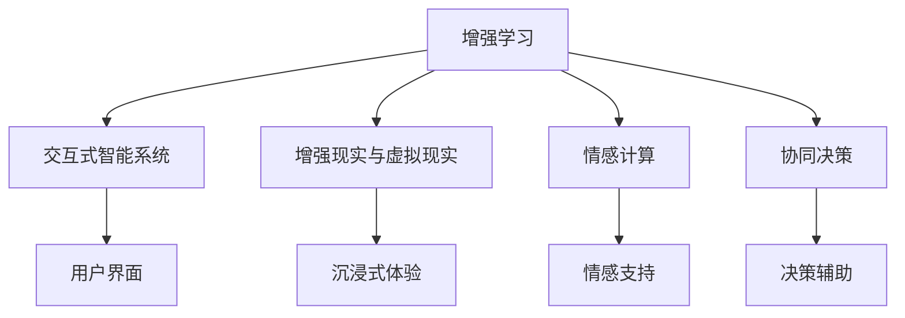

                 

## 1. 背景介绍

在过去的几十年中，人工智能（AI）技术取得了显著的进展，其应用领域覆盖了医疗、金融、教育、交通等诸多行业。然而，尽管AI能够处理大量数据、执行复杂任务，但人类在创造力、情感和直觉方面的能力仍无法被AI完全取代。因此，如何让人类与AI在协作中相互补充，共同提升，成为了当前AI研究的重要方向。

### 1.1 人类与AI的融合需求

随着技术的不断进步，AI在许多领域展现出卓越的性能。例如，在医疗领域，AI可以通过分析大量病历和医学图像，辅助医生进行诊断和治疗。在金融领域，AI能够处理和分析海量数据，预测市场趋势，优化投资策略。在教育领域，AI可以提供个性化学习建议，提升学习效率。然而，这些AI系统往往缺乏对上下文的深刻理解和情感感知能力，难以完全替代人类。

人类与AI的融合，要求我们重新思考如何在AI的帮助下，增强人类的潜能，而不是单纯地追求替代。这需要通过提升AI的理解和生成能力，以及结合人类的创造力和情感，实现更高效、更人性化的协作。

### 1.2 融合AI与人类潜能的重要性

AI与人类潜能的融合，可以带来以下几方面的好处：

1. **增强决策质量**：结合AI强大的数据分析能力和人类的经验直觉，可以提高决策的质量和效率。
2. **提升创造力**：AI可以辅助人类进行数据收集和分析，从而帮助人类更好地进行创造性工作。
3. **增进情感连接**：AI能够处理和生成自然语言，提供情感支持，增强人际沟通的深度和广度。
4. **优化资源利用**：AI可以优化资源分配，提升生产效率，帮助人类更好地管理和利用资源。

## 2. 核心概念与联系

### 2.1 核心概念概述

在探索人类与AI的协作过程中，我们需要关注以下几个核心概念：

- **增强学习**：一种利用AI技术提升人类能力的方法，通过模拟和强化，让AI帮助人类在特定领域取得进步。
- **交互式智能系统**：一种基于AI的智能系统，通过自然语言处理（NLP）和语音识别（ASR）等技术，与人类进行交互。
- **增强现实（AR）与虚拟现实（VR）**：利用AI技术创建沉浸式体验，提升人类对复杂问题的理解和处理能力。
- **情感计算**：一种通过AI技术捕捉和理解人类情感的方法，增强人机交互的情感共鸣。
- **协同决策**：一种结合人类和AI的决策机制，通过AI辅助分析和人类决策相结合，提升决策的准确性和效率。

这些概念之间的逻辑关系可以通过以下Mermaid流程图来展示：



这个流程图展示了增强学习如何通过多种方式提升人类与AI的协作能力。

## 3. 核心算法原理 & 具体操作步骤

### 3.1 算法原理概述

人类与AI的协作，主要依赖于AI的计算能力与人类智能的结合。这种结合通常通过以下几个步骤实现：

1. **数据采集与处理**：收集相关领域的大量数据，并进行清洗和预处理。
2. **模型训练**：利用机器学习算法训练AI模型，使其能够理解和生成特定领域的知识。
3. **交互与反馈**：通过用户界面（UI）与AI进行交互，AI提供决策建议或执行特定任务。
4. **反馈与优化**：根据用户反馈，不断调整AI模型和交互策略，优化用户体验。

### 3.2 算法步骤详解

以下是详细的操作步骤：

1. **需求分析**：明确人类与AI协作的具体需求，确定需要解决的问题和目标。
2. **数据收集与预处理**：收集与目标问题相关的数据，进行清洗和特征提取。
3. **模型选择与训练**：选择合适的AI模型，并在预处理后的数据上训练。
4. **交互设计**：设计用户界面，确保与AI的交互流畅、直观。
5. **模型部署与测试**：将训练好的模型部署到实际环境中，进行测试和优化。
6. **持续迭代**：根据用户反馈和性能评估，不断调整和优化模型。

### 3.3 算法优缺点

增强学习与AI协作有以下优点：

1. **高效性**：AI能够处理大量数据，提供快速、准确的决策支持。
2. **灵活性**：可以根据具体需求，灵活调整AI的功能和表现。
3. **可扩展性**：通过引入新的数据和算法，AI可以不断提升性能。

然而，也存在以下挑战：

1. **数据依赖**：需要大量高质量的数据进行训练。
2. **模型解释性**：AI模型通常较为复杂，难以解释其决策过程。
3. **安全与隐私**：AI处理的数据可能包含敏感信息，需要确保数据安全和隐私保护。

### 3.4 算法应用领域

增强学习与AI协作在多个领域都有广泛的应用：

1. **医疗诊断**：结合AI的图像处理能力和医生的经验，提升诊断的准确性和效率。
2. **金融投资**：利用AI分析市场数据，提供投资建议，优化投资组合。
3. **教育培训**：通过AI辅助个性化学习，提升学生的学习效果和体验。
4. **制造与供应链管理**：利用AI优化生产计划和物流管理，提升生产效率和供应链的灵活性。

## 4. 数学模型和公式 & 详细讲解 & 举例说明

### 4.1 数学模型构建

假设我们有一个强化学习环境，其中环境状态为 $S_t$，行动为 $A_t$，奖励为 $R_t$，模型参数为 $\theta$。模型的目标是通过行动 $A_t$ 最大化长期奖励的期望值 $V(S_t)$，即：

$$
V(S_t) = \mathbb{E}_{\pi} \left[ \sum_{t=0}^{\infty} \gamma^t R_t \right]
$$

其中，$\pi$ 为策略函数，$\gamma$ 为折扣因子。

### 4.2 公式推导过程

在强化学习中，常见的算法包括Q-learning和策略梯度方法。以Q-learning为例，其更新规则为：

$$
Q(S_t, A_t) = Q(S_t, A_t) + \alpha \left( R_t + \gamma \max_{A'} Q(S_{t+1}, A') - Q(S_t, A_t) \right)
$$

其中，$\alpha$ 为学习率。

### 4.3 案例分析与讲解

以医疗诊断为例，我们可以构建一个强化学习环境，其中状态为患者病历，行动为治疗方案，奖励为治疗效果。模型通过不断的学习，优化治疗方案，提升诊断的准确性和效率。

## 5. 项目实践：代码实例和详细解释说明

### 5.1 开发环境搭建

为了进行项目实践，我们需要安装以下软件和工具：

1. Python：安装最新版本的Python。
2. PyTorch：用于深度学习模型的训练和推理。
3. OpenAI Gym：用于构建和测试强化学习环境。
4. TensorBoard：用于可视化训练过程中的指标和模型结构。

### 5.2 源代码详细实现

以下是一个简单的Q-learning代码实现，用于控制一个简单环境中的智能体：

```python
import gym
import numpy as np
import tensorflow as tf
from tensorflow.keras import layers

# 创建环境
env = gym.make('CartPole-v0')

# 定义神经网络模型
model = tf.keras.Sequential([
    layers.Dense(16, activation='relu', input_shape=(4,)),
    layers.Dense(1, activation='sigmoid')
])

# 定义Q-learning参数
learning_rate = 0.1
discount_factor = 0.99
num_episodes = 1000

# 定义Q-learning函数
def q_learning():
    for episode in range(num_episodes):
        state = env.reset()
        done = False
        total_reward = 0
        while not done:
            action = np.random.randint(2)
            next_state, reward, done, _ = env.step(action)
            state_values = model.predict(np.array(state).reshape(1, -1))
            if done:
                total_reward += reward
            else:
                max_state_values = model.predict(np.array(next_state).reshape(1, -1))
                total_reward += reward + discount_factor * np.max(max_state_values)
            model.train_on_batch(np.array(state).reshape(1, -1), [reward])
            state = next_state
        print(f"Episode {episode+1}: Total reward = {total_reward}")

q_learning()
```

### 5.3 代码解读与分析

这段代码实现了一个简单的Q-learning算法，用于控制一个简单的CartPole环境。通过不断更新模型参数，智能体能够逐步学习到最优的行动策略，使环境奖励最大化。

## 6. 实际应用场景

### 6.1 医疗诊断

在医疗诊断中，结合AI的图像处理能力和医生的经验，可以显著提升诊断的准确性和效率。例如，在影像诊断中，AI可以通过分析大量的医学影像数据，辅助医生进行病灶定位和分类。在病理诊断中，AI可以分析患者的基因数据和病历，提供个性化的治疗建议。

### 6.2 金融投资

在金融投资领域，AI可以通过分析市场数据和公司财务报表，提供投资建议和风险评估。例如，AI可以预测股票市场的趋势，优化投资组合，降低投资风险。

### 6.3 教育培训

在教育培训中，AI可以提供个性化的学习建议和资源，提升学生的学习效果和体验。例如，AI可以根据学生的学习进度和偏好，推荐合适的学习材料和习题，提供即时反馈和解答。

### 6.4 制造与供应链管理

在制造与供应链管理中，AI可以优化生产计划和物流管理，提升生产效率和供应链的灵活性。例如，AI可以预测生产需求，优化库存管理，提高供应链的响应速度。

## 7. 工具和资源推荐

### 7.1 学习资源推荐

为了帮助开发者系统掌握增强学习与AI协作的理论基础和实践技巧，这里推荐一些优质的学习资源：

1. 《深度学习》：Ian Goodfellow等人所著，全面介绍了深度学习的基础理论和应用。
2. 《增强学习：现代方法》：Richard S. Sutton等人所著，系统讲解了增强学习的基本概念和算法。
3. Coursera和edX上的相关课程，如“Deep Reinforcement Learning”和“Machine Learning”等。

### 7.2 开发工具推荐

以下是几款用于增强学习与AI协作开发的常用工具：

1. PyTorch：用于深度学习模型的训练和推理。
2. TensorFlow：用于构建和训练复杂的深度学习模型。
3. OpenAI Gym：用于构建和测试强化学习环境。
4. Jupyter Notebook：用于编写和运行代码，支持多种编程语言。
5. TensorBoard：用于可视化训练过程中的指标和模型结构。

### 7.3 相关论文推荐

增强学习与AI协作的发展得益于学界的持续研究。以下是几篇奠基性的相关论文，推荐阅读：

1. Q-learning：Watkins等人提出Q-learning算法，奠定了强化学习的基础。
2. AlphaGo：DeepMind团队开发的AlphaGo系统，通过结合强化学习和蒙特卡罗树搜索，在围棋领域取得突破。
3. Human-AI Collaboration：一个关于人类与AI协作的多学科研究项目，探讨了人机协作的多种方式。

## 8. 总结：未来发展趋势与挑战

### 8.1 研究成果总结

增强学习与AI协作的研究已经取得显著进展，但也面临一些挑战。以下是几个主要的研究成果和挑战：

1. **成果**：AI在多个领域取得了显著的进展，提升了人类决策和工作的效率和质量。
2. **挑战**：数据依赖、模型解释性、安全与隐私等问题仍需解决。

### 8.2 未来发展趋势

未来，增强学习与AI协作将呈现以下几个发展趋势：

1. **多模态学习**：结合视觉、听觉、触觉等多模态数据，提升AI对复杂环境的理解和适应能力。
2. **自适应学习**：通过学习用户的行为和偏好，动态调整AI的功能和表现，提升用户体验。
3. **联邦学习**：通过分布式训练，保护用户隐私的同时提升模型的泛化能力。
4. **跨领域协作**：在不同领域和系统间进行协作，实现资源和知识的共享和整合。

### 8.3 面临的挑战

尽管增强学习与AI协作取得了显著进展，但在实践中仍面临以下挑战：

1. **数据获取和处理**：需要大量高质量的数据进行训练，且数据隐私和安全问题不容忽视。
2. **模型复杂性**：模型过于复杂，难以解释其决策过程，增加了用户信任度。
3. **跨领域协作**：不同领域和系统间的数据和算法难以统一，增加了协作的难度。
4. **实时性和响应性**：在大规模数据和复杂环境中，AI模型的实时性和响应性仍需优化。

### 8.4 研究展望

未来，增强学习与AI协作的研究可以从以下几个方面进行探索：

1. **数据生成与增强**：开发更有效的数据生成和增强方法，提升模型的泛化能力。
2. **模型简化与解释性**：通过简化模型结构和引入解释性技术，提升模型的透明性和可信度。
3. **跨领域协作**：探索跨领域协作的机制和方法，实现资源和知识的共享和整合。
4. **情感计算与协同决策**：结合情感计算和协同决策技术，增强人机交互的深度和广度。

总之，增强学习与AI协作的研究和应用正在不断深入，未来将带来更多的创新和突破，为人类的生产生活方式带来深刻变革。

## 9. 附录：常见问题与解答

**Q1：增强学习与AI协作的主要挑战是什么？**

A: 增强学习与AI协作的主要挑战包括：数据依赖、模型解释性、安全与隐私问题。

**Q2：增强学习在医疗诊断中的应用场景有哪些？**

A: 增强学习在医疗诊断中的应用场景包括影像诊断、病理诊断、基因诊断等。

**Q3：如何提升增强学习模型的解释性？**

A: 可以通过简化模型结构和引入可解释性技术，如LIME、SHAP等，提升模型的透明性和可信度。

**Q4：增强学习与AI协作的未来发展趋势有哪些？**

A: 未来发展趋势包括多模态学习、自适应学习、联邦学习、跨领域协作等。

**Q5：增强学习与AI协作在教育培训中的应用场景有哪些？**

A: 增强学习在教育培训中的应用场景包括个性化学习建议、即时反馈、学习资源推荐等。

作者：禅与计算机程序设计艺术 / Zen and the Art of Computer Programming

