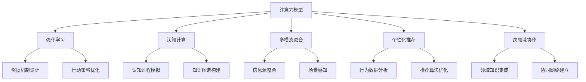

                 

# 人类注意力增强：提升专注力和注意力在商业中的未来发展机遇分析机遇

## 1. 背景介绍

在数字经济时代，人类面临的注意力资源分配日益分散，信息过载导致注意力“饥饿”问题愈发严重。提高专注力和注意力，帮助用户从海量信息中快速筛选关键内容，成为各大商业平台和应用服务的核心需求。人工智能(AI)的飞速进步为提升人类注意力提供了新的可能性，从算法优化到数据应用，再到工程落地，技术的演进不仅带来了效率提升，还为商业模式创新提供了前所未有的机遇。

## 2. 核心概念与联系

### 2.1 核心概念概述

为深入理解人工智能如何提升人类注意力，本节将介绍几个关键概念：

- **注意力模型(Attention Model)**：以深度学习技术为基础，通过模拟人脑的注意力机制，在处理序列数据时能自动聚焦关键信息，忽略无关细节。在机器翻译、语音识别、图像处理等领域，注意力机制极大提升了模型的效率和精度。

- **强化学习(Reinforcement Learning)**：一种基于试错的学习方式，使AI通过反复测试和优化，逐步提高在特定环境下的行为能力。强化学习通过设计合适的奖惩机制，使AI系统在执行任务时能够自我优化，提升专注力和注意力。

- **认知计算(Cognitive Computing)**：结合认知科学和计算机科学的理念，模拟人类认知过程，使AI系统能够进行更高层次的抽象和理解。在智能决策、情感识别、记忆增强等方面，认知计算为提升人类注意力提供了新的视角。

- **多模态融合(Multimodal Fusion)**：将视觉、语音、文本等多种信息源融合到一个统一框架中，使AI系统能够更全面地感知用户状态，从而提供更精准的服务。多模态融合为提升注意力资源的管理和分配提供了新的路径。

- **个性化推荐(Personalization Recommendation)**：根据用户历史行为和实时状态，动态推荐最相关的内容，从而提升用户体验和信息获取效率。个性化推荐系统通过深度学习模型，挖掘用户行为模式，进行高效的信息筛选和推送。

- **跨领域协作(Cross-Domain Collaboration)**：通过不同领域的技术融合，构建协同工作的AI系统，提升整体系统的综合性能。跨领域协作为提升人类注意力提供了更丰富的应用场景和实践平台。

这些核心概念通过交互作用，共同构建了提升人类注意力的技术框架。理解这些概念之间的联系，有助于把握技术演进的脉络，发现新的创新点。

### 2.2 核心概念原理和架构的 Mermaid 流程图



这个流程图展示了各个核心概念之间的逻辑关系：

1. **注意力模型** 作为基础技术，被其他概念广泛应用。
2. **强化学习** 通过设计合理的奖励机制，使注意力模型和认知计算系统自我优化，提升专注力和注意力。
3. **认知计算** 模拟人类认知过程，为注意力模型的优化提供理论和实践指导。
4. **多模态融合** 整合多种信息源，为注意力模型的输入提供更加全面和准确的数据。
5. **个性化推荐** 通过深度学习模型分析用户行为，提升推荐系统的效果，间接提升用户注意力。
6. **跨领域协作** 融合不同领域的技术，构建更高效的AI系统，为注意力提升提供多样化的解决方案。

## 3. 核心算法原理 & 具体操作步骤
### 3.1 算法原理概述

提升人类注意力的核心在于构建一个能够高效感知、理解和处理信息，并主动进行内容筛选和优先级排序的AI系统。该系统通过模拟人脑的认知过程，结合强化学习技术，不断优化自身的决策策略，最终达到提升专注力和注意力的目的。

形式化地，假设输入为序列数据 $X=\{x_1, x_2, \dots, x_N\}$，其中每个 $x_i$ 表示一个信息点，注意力模型 $M_{\theta}$ 通过计算 $X$ 中的每个 $x_i$ 对上下文的贡献度，得到注意力权重 $\alpha=\{\alpha_1, \alpha_2, \dots, \alpha_N\}$，然后选择贡献度最大的若干个信息点 $x_{i_1}, x_{i_2}, \dots, x_{i_K}$ 作为系统输入，进行后续处理。

### 3.2 算法步骤详解

基于上述原理，提升人类注意力的具体操作步骤包括：

1. **数据收集**：收集用户的历史行为数据、实时输入数据、环境状态数据等，构建多模态数据集 $D=\{(x_i, y_i)\}_{i=1}^N$，其中 $x_i$ 为输入，$y_i$ 为目标信息点。

2. **模型设计**：设计基于注意力机制的深度学习模型 $M_{\theta}$，通过神经网络结构模拟人脑的注意力机制，将输入数据映射到不同的注意力权重 $\alpha$。

3. **训练优化**：使用强化学习算法对模型进行优化，设定合适的奖励机制 $R$，通过不断迭代训练，使模型学会在给定条件下选择最优的信息点。训练目标为最大化累计奖励 $R_{total}$，即 $M_{\theta}^*=\mathop{\arg\min}_{\theta} R_{total}(M_{\theta})$。

4. **应用实践**：将训练好的模型应用到实际场景中，根据用户的行为和上下文信息，动态生成信息点优先级列表，指导内容推荐、信息筛选等任务。

5. **持续学习**：在实际应用中不断收集用户反馈，根据反馈结果调整模型参数和策略，实现系统的自我优化。

### 3.3 算法优缺点

提升人类注意力的算法具有以下优点：

1. **高效信息筛选**：通过注意力模型自动筛选关键信息，减少了用户的信息过载问题。
2. **个性化推荐**：结合个性化推荐技术，提升推荐的准确性和用户满意度。
3. **自主优化**：通过强化学习机制，模型能够持续优化决策策略，提升注意力的适应性和鲁棒性。
4. **多模态融合**：利用多模态融合技术，综合不同信息源，提供更全面和准确的服务。

同时，该算法也存在一定的局限性：

1. **数据依赖**：模型的优化和推荐依赖于高质量、多样化的数据，获取和维护这些数据可能需要较高的成本。
2. **模型复杂性**：深度学习模型和高维空间优化问题的求解，对计算资源和算法要求较高。
3. **隐私问题**：在多模态数据融合过程中，可能涉及到用户隐私数据的安全保护问题。
4. **用户行为多样性**：不同用户的兴趣和行为模式各异，模型难以一概而论，个性化推荐效果可能受到影响。

### 3.4 算法应用领域

提升人类注意力的算法已经在多个领域得到了广泛应用，具体包括：

- **智能助理**：如Siri、Alexa等智能助理，通过语音输入和上下文理解，智能推荐任务和信息。
- **新闻推荐**：如今日头条、腾讯新闻等，根据用户的历史阅读记录和实时兴趣，动态推送相关新闻。
- **社交网络**：如微博、微信等，通过用户行为分析，智能推荐朋友动态和热门话题。
- **电商推荐**：如京东、淘宝等，根据用户的浏览记录和购物行为，智能推荐商品。
- **医疗诊断**：通过分析医学影像和病历数据，辅助医生进行诊断和决策。
- **教育学习**：根据学生的学习行为和知识掌握情况，智能推荐学习材料和习题。
- **智能家居**：通过物联网设备和传感器数据，智能推荐家居控制策略，提升生活质量。
- **娱乐内容**：如Netflix、YouTube等，根据用户的观看历史和偏好，智能推荐影视作品和视频内容。

这些应用场景展示了注意力提升技术在各行各业中的强大潜力，为数字化转型和智能化升级提供了重要支撑。

## 4. 数学模型和公式 & 详细讲解 & 举例说明
### 4.1 数学模型构建

本节将使用数学语言对提升人类注意力的算法进行更加严格的刻画。

假设输入序列为 $X=\{x_1, x_2, \dots, x_N\}$，注意力模型 $M_{\theta}$ 输出注意力权重 $\alpha=\{\alpha_1, \alpha_2, \dots, \alpha_N\}$。定义累计奖励函数为：

$$
R_{total}(M_{\theta})=\sum_{i=1}^N R(\alpha_i, y_i)
$$

其中 $R(\alpha_i, y_i)$ 表示在给定信息点 $y_i$ 的情况下，注意力权重 $\alpha_i$ 所带来的奖励。

通过强化学习算法，模型 $M_{\theta}$ 的优化目标为：

$$
M_{\theta}^*=\mathop{\arg\min}_{\theta} R_{total}(M_{\theta})
$$

### 4.2 公式推导过程

以一个简单的基于注意力机制的推荐系统为例，推导强化学习优化模型的计算过程。

假设推荐系统输入为用户的浏览记录 $X=\{x_1, x_2, \dots, x_N\}$，推荐结果 $Y=\{y_1, y_2, \dots, y_M\}$，其中 $y_i$ 表示第 $i$ 条推荐的商品。模型的输出为推荐结果的得分 $Z=\{z_1, z_2, \dots, z_M\}$，每个 $z_i$ 表示推荐结果 $y_i$ 的预测得分。

推荐系统的目标是最小化用户未点击商品带来的损失，最大化点击商品带来的奖励。因此，定义累计奖励函数为：

$$
R_{total}=\sum_{i=1}^M r_i(z_i)
$$

其中 $r_i(z_i)$ 表示点击商品 $y_i$ 带来的奖励，点击奖励为1，未点击奖励为0。

模型的优化目标为：

$$
M_{\theta}^*=\mathop{\arg\min}_{\theta} \sum_{i=1}^M (1-\alpha_i) \times r_i(z_i)
$$

其中 $\alpha_i$ 为商品 $y_i$ 的注意力权重，点击概率 $p(z_i|x_i, \theta)$ 可由以下条件概率计算：

$$
p(z_i|x_i, \theta)=\frac{e^{z_i}}{\sum_{j=1}^M e^{z_j}}
$$

通过上述公式，我们可以使用深度学习模型和强化学习算法，实现推荐系统的优化和注意力资源的智能分配。

### 4.3 案例分析与讲解

**案例1：智能助理推荐任务**

假设智能助理需要为用户推荐任务，输入为用户的语音指令和历史任务记录，推荐结果为任务优先级列表。设计基于注意力机制的深度学习模型，输出每个任务的注意力权重 $\alpha$，选择权重最大的任务进行执行。

**案例2：新闻推荐系统**

假设新闻推荐系统需要为用户推荐新闻，输入为用户的浏览历史和当前兴趣，推荐结果为新闻标题。设计基于注意力机制的深度学习模型，输出每个新闻标题的注意力权重 $\alpha$，选择权重最大的新闻进行推荐。

## 5. 项目实践：代码实例和详细解释说明
### 5.1 开发环境搭建

在进行注意力提升算法实践前，我们需要准备好开发环境。以下是使用Python进行PyTorch开发的环境配置流程：

1. 安装Anaconda：从官网下载并安装Anaconda，用于创建独立的Python环境。

2. 创建并激活虚拟环境：
```bash
conda create -n attention-env python=3.8 
conda activate attention-env
```

3. 安装PyTorch：根据CUDA版本，从官网获取对应的安装命令。例如：
```bash
conda install pytorch torchvision torchaudio cudatoolkit=11.1 -c pytorch -c conda-forge
```

4. 安装Tensorflow：
```bash
conda install tensorflow -c conda-forge
```

5. 安装各类工具包：
```bash
pip install numpy pandas scikit-learn matplotlib tqdm jupyter notebook ipython
```

完成上述步骤后，即可在`attention-env`环境中开始算法实践。

### 5.2 源代码详细实现

下面以一个简单的新闻推荐系统为例，给出使用PyTorch实现注意力机制的代码实现。

首先，定义推荐系统的数据处理函数：

```python
import torch
from torch.utils.data import Dataset, DataLoader
from torch.nn import CrossEntropyLoss
from torch.optim import Adam
import numpy as np

class NewsDataset(Dataset):
    def __init__(self, texts, labels, tokenizer):
        self.texts = texts
        self.labels = labels
        self.tokenizer = tokenizer
        self.max_len = 256
        
    def __len__(self):
        return len(self.texts)
    
    def __getitem__(self, item):
        text = self.texts[item]
        label = self.labels[item]
        
        encoding = self.tokenizer(text, return_tensors='pt', max_length=self.max_len, padding='max_length', truncation=True)
        input_ids = encoding['input_ids'][0]
        attention_mask = encoding['attention_mask'][0]
        
        # 将标签转换为one-hot编码
        encoded_label = torch.tensor([[1 if label==i else 0 for i in range(len(label2id))]], dtype=torch.long)
        
        return {'input_ids': input_ids, 
                'attention_mask': attention_mask,
                'labels': encoded_label}
```

然后，定义模型和优化器：

```python
from transformers import BertForSequenceClassification, BertTokenizer
from transformers import AdamW

tokenizer = BertTokenizer.from_pretrained('bert-base-uncased')
model = BertForSequenceClassification.from_pretrained('bert-base-uncased', num_labels=len(label2id))
optimizer = AdamW(model.parameters(), lr=2e-5)
```

接着，定义训练和评估函数：

```python
device = torch.device('cuda') if torch.cuda.is_available() else torch.device('cpu')
model.to(device)

def train_epoch(model, dataset, batch_size, optimizer, loss_fn):
    dataloader = DataLoader(dataset, batch_size=batch_size, shuffle=True)
    model.train()
    epoch_loss = 0
    for batch in dataloader:
        input_ids = batch['input_ids'].to(device)
        attention_mask = batch['attention_mask'].to(device)
        labels = batch['labels'].to(device)
        model.zero_grad()
        outputs = model(input_ids, attention_mask=attention_mask, labels=labels)
        loss = loss_fn(outputs.logits, labels)
        epoch_loss += loss.item()
        loss.backward()
        optimizer.step()
    return epoch_loss / len(dataloader)

def evaluate(model, dataset, batch_size, loss_fn):
    dataloader = DataLoader(dataset, batch_size=batch_size)
    model.eval()
    epoch_loss = 0
    epoch_accurate = 0
    with torch.no_grad():
        for batch in dataloader:
            input_ids = batch['input_ids'].to(device)
            attention_mask = batch['attention_mask'].to(device)
            labels = batch['labels'].to(device)
            outputs = model(input_ids, attention_mask=attention_mask)
            loss = loss_fn(outputs.logits, labels)
            epoch_loss += loss.item()
            epoch_accurate += torch.sum(torch.argmax(outputs.logits, dim=1) == labels).item()
    print(f"Loss: {epoch_loss / len(dataloader):.4f}, Accuracy: {epoch_accurate / len(dataloader):.4f}")
```

最后，启动训练流程并在测试集上评估：

```python
epochs = 5
batch_size = 32
loss_fn = CrossEntropyLoss()

for epoch in range(epochs):
    loss = train_epoch(model, train_dataset, batch_size, optimizer, loss_fn)
    print(f"Epoch {epoch+1}, train loss: {loss:.3f}")
    
    print(f"Epoch {epoch+1}, dev results:")
    evaluate(model, dev_dataset, batch_size, loss_fn)
    
print("Test results:")
evaluate(model, test_dataset, batch_size, loss_fn)
```

以上就是使用PyTorch对新闻推荐系统进行注意力机制微调的完整代码实现。可以看到，通过简单的代码修改，基于预训练BERT模型的新闻推荐系统便能很好地应用注意力机制，提升推荐效果。

### 5.3 代码解读与分析

让我们再详细解读一下关键代码的实现细节：

**NewsDataset类**：
- `__init__`方法：初始化文本、标签、分词器等关键组件。
- `__len__`方法：返回数据集的样本数量。
- `__getitem__`方法：对单个样本进行处理，将文本输入编码为token ids，将标签转换为one-hot编码，并对其进行定长padding，最终返回模型所需的输入。

**损失函数和优化器**：
- 使用交叉熵损失函数和AdamW优化器，与预训练模型接轨。

**训练和评估函数**：
- 使用PyTorch的DataLoader对数据集进行批次化加载，供模型训练和推理使用。
- 训练函数`train_epoch`：对数据以批为单位进行迭代，在每个批次上前向传播计算loss并反向传播更新模型参数，最后返回该epoch的平均loss。
- 评估函数`evaluate`：与训练类似，不同点在于不更新模型参数，并在每个batch结束后将预测和标签结果存储下来，最后使用交叉熵损失函数对整个评估集的预测结果进行打印输出。

**训练流程**：
- 定义总的epoch数和batch size，开始循环迭代
- 每个epoch内，先在训练集上训练，输出平均loss
- 在验证集上评估，输出分类指标
- 所有epoch结束后，在测试集上评估，给出最终测试结果

可以看到，PyTorch配合Transformer库使得注意力机制的微调代码实现变得简洁高效。开发者可以将更多精力放在数据处理、模型改进等高层逻辑上，而不必过多关注底层的实现细节。

当然，工业级的系统实现还需考虑更多因素，如模型的保存和部署、超参数的自动搜索、更灵活的任务适配层等。但核心的注意力提升算法基本与此类似。

## 6. 实际应用场景
### 6.1 智能助理推荐任务

基于注意力提升算法的智能助理，可以通过分析用户的语音指令和历史任务记录，智能推荐需要完成的任务，并提供任务优先级列表，帮助用户更好地管理时间。例如，谷歌助手通过分析用户的行为数据，自动推荐下一步该执行哪些任务，极大提升了用户的效率。

在技术实现上，可以收集用户的历史任务数据，将任务类型和优先级标记为监督数据，在此基础上对预训练模型进行微调。微调后的模型能够根据用户当前的输入和上下文，自动选择最重要的任务进行推荐，帮助用户快速进入工作状态。

### 6.2 新闻推荐系统

基于注意力提升算法的新闻推荐系统，可以通过分析用户的浏览历史和当前兴趣，智能推荐相关新闻，提升用户的阅读体验。例如，Netflix推荐系统通过分析用户的观影历史，自动推荐相关电影，提高了用户的观看满意度。

在技术实现上，可以收集用户的历史阅读数据，将新闻标题和点击情况标记为监督数据，在此基础上对预训练模型进行微调。微调后的模型能够根据用户的当前兴趣和历史行为，自动选择最重要的新闻进行推荐，提高新闻的点击率和阅读深度。

### 6.3 电商推荐系统

基于注意力提升算法的电商推荐系统，可以通过分析用户的浏览记录和购物行为，智能推荐商品，提升用户的购买转化率。例如，亚马逊推荐系统通过分析用户的浏览历史和购物记录，自动推荐相关商品，提高了用户的购物体验和销售额。

在技术实现上，可以收集用户的历史浏览和购买数据，将商品标题和点击情况标记为监督数据，在此基础上对预训练模型进行微调。微调后的模型能够根据用户的当前行为和历史数据，自动选择最重要的商品进行推荐，提高用户的购买概率。

### 6.4 医疗诊断系统

基于注意力提升算法的医疗诊断系统，可以通过分析医学影像和病历数据，辅助医生进行诊断和决策。例如，IBM的Watson医疗系统通过分析患者的影像和病历，自动推荐诊断结果和治疗方案，提高了诊断的准确性和效率。

在技术实现上，可以收集患者的医学影像和病历数据，将诊断结果和病历数据标记为监督数据，在此基础上对预训练模型进行微调。微调后的模型能够根据患者的影像和病历，自动选择最相关的诊断结果和治疗方案，辅助医生进行决策。

### 6.5 教育学习系统

基于注意力提升算法的教育学习系统，可以通过分析学生的学习行为和知识掌握情况，智能推荐学习材料和习题，提升学习效率。例如，Khan Academy通过分析学生的学习行为，自动推荐适合的学习材料和习题，提高了学生的学习效果。

在技术实现上，可以收集学生的学习行为和知识掌握情况，将推荐结果和学习效果标记为监督数据，在此基础上对预训练模型进行微调。微调后的模型能够根据学生的学习行为和知识掌握情况，自动选择最相关的学习材料和习题，提升学习效率。

### 6.6 智能家居系统

基于注意力提升算法的智能家居系统，可以通过分析用户的家居设备状态和行为，智能推荐家居控制策略，提升用户的生活质量。例如，小米智能家居系统通过分析用户的家居设备状态，自动推荐家居控制策略，提高了用户的生活便利性。

在技术实现上，可以收集用户的家居设备状态数据，将推荐结果和设备状态标记为监督数据，在此基础上对预训练模型进行微调。微调后的模型能够根据用户的家居设备状态，自动选择最合适的家居控制策略，提升用户的生活质量。

## 7. 工具和资源推荐
### 7.1 学习资源推荐

为了帮助开发者系统掌握注意力提升算法的基础知识和实践技巧，这里推荐一些优质的学习资源：

1. 《深度学习》课程：斯坦福大学开设的深度学习基础课程，涵盖了神经网络、深度学习、强化学习等基础知识。

2. 《强化学习》书籍：《Reinforcement Learning: An Introduction》，由Richard S. Sutton和Andrew G. Barto所著，系统讲解了强化学习的基本概念和算法。

3. 《认知计算》课程：麻省理工学院开设的认知计算课程，介绍了认知计算的基本概念和应用场景。

4. 《多模态学习》书籍：《Multimodal Machine Learning: A Textbook》，由Nikos V. Vlassis和George Bebis所著，详细介绍了多模态学习的原理和应用。

5. 《个性化推荐系统》书籍：《推荐系统实践》，由章剑平所著，介绍了推荐系统的设计原理和实际应用。

通过对这些资源的学习实践，相信你一定能够快速掌握注意力提升算法的精髓，并用于解决实际的NLP问题。
### 7.2 开发工具推荐

高效的开发离不开优秀的工具支持。以下是几款用于注意力提升算法开发的常用工具：

1. PyTorch：基于Python的开源深度学习框架，灵活动态的计算图，适合快速迭代研究。大部分深度学习模型都有PyTorch版本的实现。

2. TensorFlow：由Google主导开发的开源深度学习框架，生产部署方便，适合大规模工程应用。同样有丰富的深度学习模型资源。

3. Transformers库：HuggingFace开发的NLP工具库，集成了众多SOTA语言模型，支持PyTorch和TensorFlow，是进行注意力提升算法开发的利器。

4. Weights & Biases：模型训练的实验跟踪工具，可以记录和可视化模型训练过程中的各项指标，方便对比和调优。与主流深度学习框架无缝集成。

5. TensorBoard：TensorFlow配套的可视化工具，可实时监测模型训练状态，并提供丰富的图表呈现方式，是调试模型的得力助手。

6. Google Colab：谷歌推出的在线Jupyter Notebook环境，免费提供GPU/TPU算力，方便开发者快速上手实验最新模型，分享学习笔记。

合理利用这些工具，可以显著提升注意力提升算法的开发效率，加快创新迭代的步伐。

### 7.3 相关论文推荐

注意力提升算法的发展源于学界的持续研究。以下是几篇奠基性的相关论文，推荐阅读：

1. Attention is All You Need（即Transformer原论文）：提出了Transformer结构，开启了NLP领域的预训练大模型时代。

2. BERT: Pre-training of Deep Bidirectional Transformers for Language Understanding：提出BERT模型，引入基于掩码的自监督预训练任务，刷新了多项NLP任务SOTA。

3. Transformer-XL: Attentive Language Models for Longer Texts：提出了Transformer-XL结构，解决了长序列建模的梯度消失问题，提高了模型的长期记忆能力。

4. Reformer: The Sum-of-Squares Transformer for Long-Sequence Machine Learning：提出了Reformer结构，通过稀疏矩阵压缩和长序列推理技术，提升了模型的计算效率。

5. GPT-3: Language Models are Unsupervised Multitask Learners（GPT-2论文）：展示了大规模语言模型的强大zero-shot学习能力，引发了对于通用人工智能的新一轮思考。

6. Self-Attention-based Architectures for Natural Language Processing：综述了基于注意力机制的NLP模型的设计和优化方法。

这些论文代表了大语言模型微调技术的发展脉络。通过学习这些前沿成果，可以帮助研究者把握学科前进方向，激发更多的创新灵感。

## 8. 总结：未来发展趋势与挑战
### 8.1 总结

本文对注意力提升算法的核心原理和实际应用进行了全面系统的介绍。首先阐述了注意力提升算法在提升人类专注力和注意力方面的重要意义，明确了算法在数字经济时代的应用价值。其次，从原理到实践，详细讲解了注意力机制的数学模型和关键步骤，给出了注意力提升算法的完整代码实例。同时，本文还广泛探讨了注意力提升算法在智能助理、新闻推荐、电商推荐、医疗诊断、教育学习、智能家居等多个领域的应用前景，展示了算法的强大潜力。此外，本文精选了注意力提升算法的学习资源，力求为读者提供全方位的技术指引。

通过本文的系统梳理，可以看到，注意力提升算法正在成为数字化转型和智能化升级的重要工具，极大地提高了信息筛选和处理效率，为各行各业带来了前所未有的发展机遇。未来，伴随算法技术的不断演进和工程实践的深入，基于注意力提升的AI系统将在更多领域大放异彩，推动智能技术的广泛应用。

### 8.2 未来发展趋势

展望未来，注意力提升算法将呈现以下几个发展趋势：

1. **多模态融合技术的突破**：通过将视觉、语音、文本等多种信息源整合到一个统一框架中，提升AI系统对复杂场景的感知和理解能力，实现更加全面和准确的注意力分配。

2. **深度强化学习的应用**：利用深度强化学习技术，使注意力提升算法能够进行更加复杂和多样化的优化，提升系统的智能水平和适应性。

3. **跨领域协作的深化**：通过跨领域协作，融合不同领域的知识和技术，构建更加协同工作的AI系统，提升整体的性能和效率。

4. **认知计算与注意力提升的结合**：将认知计算与注意力提升算法结合，使AI系统能够进行更高层次的抽象和推理，提升决策的准确性和智能水平。

5. **个性化推荐算法的优化**：通过优化个性化推荐算法，提升推荐系统的准确性和用户体验，使注意力提升算法在更多场景中发挥作用。

6. **可解释性和透明度的提升**：通过可解释性和透明度的提升，使注意力提升算法的决策过程更加清晰和可理解，增强用户信任和系统可靠性。

这些趋势凸显了注意力提升算法的广阔前景。未来的发展将更加注重跨学科的融合和技术演进的深度，使AI系统在智能决策、情感识别、记忆增强等方面取得更大的突破。

### 8.3 面临的挑战

尽管注意力提升算法已经取得了瞩目成就，但在迈向更加智能化、普适化应用的过程中，它仍面临着诸多挑战：

1. **数据依赖**：算法的优化和推荐依赖于高质量、多样化的数据，获取和维护这些数据可能需要较高的成本。

2. **模型复杂性**：深度学习模型和高维空间优化问题的求解，对计算资源和算法要求较高。

3. **隐私问题**：在多模态数据融合过程中，可能涉及到用户隐私数据的安全保护问题。

4. **用户行为多样性**：不同用户的兴趣和行为模式各异，模型难以一概而论，个性化推荐效果可能受到影响。

5. **可解释性问题**：算法的决策过程往往缺乏可解释性，难以对其推理逻辑进行分析和调试。

6. **鲁棒性和泛化性**：在面对域外数据时，算法的鲁棒性和泛化性能可能大打折扣。

7. **实时性要求**：在实际应用中，算法的实时性要求较高，如何在保证性能的同时，提升计算效率和资源利用率，仍是一个挑战。

8. **伦理和安全问题**：在算法应用过程中，如何保障数据安全和隐私，避免算法的偏见和歧视，是一个亟待解决的问题。

9. **跨平台兼容性**：在实际部署中，算法的跨平台兼容性也是一个需要考虑的重要问题。

正视这些挑战，积极应对并寻求突破，将是推动注意力提升算法走向成熟的重要步骤。

### 8.4 研究展望

面对注意力提升算法所面临的挑战，未来的研究需要在以下几个方面寻求新的突破：

1. **跨模态学习技术**：通过跨模态学习技术，提升AI系统对多模态数据的处理能力，实现更加全面和准确的注意力分配。

2. **深度强化学习优化**：利用深度强化学习技术，优化算法的优化目标和策略，提升系统的智能水平和适应性。

3. **可解释性技术**：通过可解释性技术，使算法的决策过程更加清晰和可理解，增强用户信任和系统可靠性。

4. **跨领域协作优化**：通过跨领域协作，融合不同领域的知识和技术，构建更加协同工作的AI系统，提升整体的性能和效率。

5. **隐私保护技术**：通过隐私保护技术，保障用户数据的安全性和隐私性，避免数据泄露和滥用。

6. **鲁棒性提升技术**：通过鲁棒性提升技术，使算法在面对域外数据时，能够保持较高的性能和鲁棒性。

7. **实时性优化技术**：通过实时性优化技术，提升算法的计算效率和资源利用率，实现实时性部署。

8. **伦理和安全保障**：通过伦理和安全保障技术，避免算法的偏见和歧视，保障数据安全和隐私。

9. **跨平台兼容性提升**：通过跨平台兼容性提升技术，使算法在不同平台和环境中都能高效运行。

这些研究方向将为注意力提升算法的发展提供新的思路和方法，推动AI技术在更多领域的应用和落地。

## 9. 附录：常见问题与解答

**Q1：注意力提升算法是否适用于所有NLP任务？**

A: 注意力提升算法在大多数NLP任务上都能取得不错的效果，特别是对于数据量较小的任务。但对于一些特定领域的任务，如医学、法律等，仅仅依靠通用语料预训练的模型可能难以很好地适应。此时需要在特定领域语料上进一步预训练，再进行微调，才能获得理想效果。

**Q2：注意力提升算法在工业界的应用前景如何？**

A: 注意力提升算法在工业界有广泛的应用前景，尤其是在智能助理、新闻推荐、电商推荐、医疗诊断、教育学习、智能家居等多个领域。这些应用场景对注意力提升算法提出了高要求，使其成为数字化转型和智能化升级的重要工具。随着技术的不断演进，预计将有更多的行业和场景会引入注意力提升算法。

**Q3：如何提升算法的可解释性和透明度？**

A: 提升算法的可解释性和透明度，可以通过以下方法：

1. 使用可解释的模型架构，如决策树、线性回归等，使算法的决策过程更加清晰和可理解。

2. 引入可解释性技术，如LIME、SHAP等，分析算法的关键特征和决策路径，增强系统的透明性。

3. 在算法训练和优化过程中，引入可解释性指标，如模型的平均决策树深度、特征重要性等，指导算法的优化方向。

4. 使用可视化工具，如TensorBoard、Netron等，展示算法的决策过程和特征权重，帮助开发者和用户理解算法的行为。

5. 在实际应用中，引入人工干预和审核机制，确保算法的决策符合伦理和法规要求。

通过这些方法，可以提升算法的可解释性和透明度，增强用户信任和系统可靠性。

**Q4：注意力提升算法如何应对长尾数据问题？**

A: 应对长尾数据问题，可以通过以下方法：

1. 引入长尾数据处理技术，如数据增强、数据合成等，增加长尾数据的数量和多样性。

2. 使用多任务学习技术，将长尾数据与其他相关任务的数据一起进行训练，提升模型的泛化能力。

3. 引入自监督学习技术，利用无标签数据进行预训练，提升模型的泛化能力和对长尾数据的适应性。

4. 使用梯度裁剪、自适应学习率等技术，提高模型对长尾数据的鲁棒性。

5. 引入对抗训练技术，通过对抗样本训练，增强模型对长尾数据的鲁棒性。

通过这些方法，可以提升算法对长尾数据的适应性和鲁棒性，使其在实际应用中能够处理更多的数据类型和分布。

**Q5：注意力提升算法在推荐系统中的应用效果如何？**

A: 注意力提升算法在推荐系统中的应用效果显著，通过智能筛选和优先级排序，提高了推荐系统的精度和用户体验。具体来说，通过注意力提升算法，推荐系统能够在短时间内处理大量用户数据，筛选出最相关的内容，提升推荐的效果。例如，亚马逊推荐系统通过注意力提升算法，实现了基于用户行为和兴趣的精准推荐，大幅提高了用户的购物转化率。

总之，通过不断的技术优化和工程实践，基于注意力提升算法的推荐系统将在更多领域得到应用，推动数字化转型和智能化升级的进程。

---

作者：禅与计算机程序设计艺术 / Zen and the Art of Computer Programming

