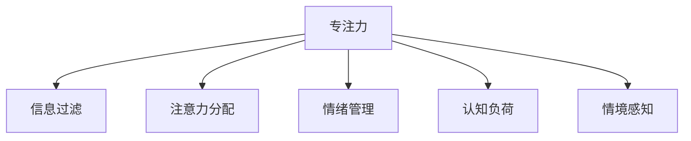

                 

# 人类注意力增强：提升专注力和注意力在商业中的未来趋势

## 1. 背景介绍

### 1.1 问题由来

在当今信息爆炸的时代，人类面临着前所未有的信息过载和注意力分散的问题。如何在海量信息中挑选出重要内容，并集中注意力完成关键任务，成为了一个亟待解决的重要课题。特别是在商业领域，时间、精力和注意力成为稀缺资源，高效利用这些资源，对提升生产力和竞争力至关重要。

为了应对这一挑战，提升专注力和注意力的方法和工具层出不穷，从简单的注意力增强应用到高级的AI技术，都在不断尝试解决这一问题。本文将深入探讨人类注意力增强的核心概念和技术，分析其在商业中的应用前景和未来发展趋势。

### 1.2 问题核心关键点

人类注意力增强的核心在于如何通过技术手段提升个体或团队的注意力管理能力，使其在面对复杂任务和环境变化时，能够更加专注和高效。当前主流的方法主要包括：

1. **专注力提升**：通过设定时间限制、番茄工作法等方法，帮助个体在短时间内集中注意力，提升工作效率。
2. **信息过滤**：利用算法和工具，自动筛选和推荐重要信息，减少信息过载带来的干扰。
3. **注意力分配**：使用数据驱动的方法，合理分配个体的注意力资源，使其能够更好地处理多任务。
4. **情绪管理**：通过监控和调整情绪状态，提高个体的专注度和自我管理能力。

这些方法各有优劣，但都在不同程度上提升了人类在商业场景中的注意力和专注力，为提高工作效率和决策质量提供了新的路径。

## 2. 核心概念与联系

### 2.1 核心概念概述

为了更好地理解人类注意力增强的方法和技术，本节将介绍几个密切相关的核心概念：

- **专注力（Focus）**：指个体在特定任务上集中注意力的能力，是高效工作的关键。
- **信息过滤（Information Filtering）**：通过算法或工具，自动筛选和推荐重要信息，减少信息过载带来的干扰。
- **注意力分配（Attention Allocation）**：通过数据驱动的方法，合理分配个体的注意力资源，使其能够更好地处理多任务。
- **情绪管理（Emotion Management）**：通过监控和调整情绪状态，提高个体的专注度和自我管理能力。
- **认知负荷（Cognitive Load）**：指个体在处理信息时，需要投入的认知资源和精力。
- **情境感知（Contextual Awareness）**：指个体在处理任务时，能够根据环境变化动态调整注意力资源的能力。

这些核心概念之间的逻辑关系可以通过以下Mermaid流程图来展示：



这个流程图展示了几大核心概念之间的相互关联：

1. **专注力**：是其他概念的基础，个体通过有效管理信息、分配注意力、调整情绪和感知环境，从而在特定任务上集中注意力。
2. **信息过滤**：通过筛选和推荐重要信息，帮助个体减少认知负荷，提升专注力。
3. **注意力分配**：合理分配注意力资源，使个体能够高效处理多任务。
4. **情绪管理**：通过调整情绪状态，提高专注力和自我管理能力。
5. **认知负荷**：衡量个体在处理信息时所需的认知资源，需要优化以提高效率。
6. **情境感知**：使个体能够根据环境变化动态调整注意力资源，提升适应性。

## 3. 核心算法原理 & 具体操作步骤

### 3.1 算法原理概述

人类注意力增强的核心算法原理主要包括信息过滤、注意力分配和情绪管理三个方面。下面将详细讲解这些算法的原理。

**信息过滤算法**：旨在通过算法自动筛选和推荐重要信息，减少信息过载带来的干扰。其核心思想是通过算法学习用户行为和偏好，预测其最感兴趣的信息，并提供给用户。常见的方法包括协同过滤、基于内容的推荐等。

**注意力分配算法**：通过数据驱动的方法，合理分配个体的注意力资源，使其能够高效处理多任务。其核心思想是通过算法学习个体在多任务中的表现和效率，预测其最优注意力分配方案。常见的方法包括多任务学习、强化学习等。

**情绪管理算法**：通过监控和调整情绪状态，提高个体的专注度和自我管理能力。其核心思想是通过算法监测个体情绪变化，预测其情绪状态，并提供相应的情绪调节策略。常见的方法包括情感分析、情绪识别等。

### 3.2 算法步骤详解

**信息过滤算法**：
1. **数据收集**：收集用户的历史行为数据，如浏览记录、点击记录等。
2. **特征提取**：提取用户行为数据的特征，如关键词、标签、时间等。
3. **模型训练**：使用机器学习算法（如协同过滤、神经网络等）训练模型，学习用户偏好。
4. **信息推荐**：根据用户偏好和当前行为，推荐最相关的信息。

**注意力分配算法**：
1. **任务建模**：将任务分解为多个子任务，并建立任务模型。
2. **资源分配**：根据任务模型和资源（如时间、精力），计算最优的注意力分配方案。
3. **任务执行**：按照最优方案，分配注意力资源，执行任务。
4. **效果评估**：根据任务执行结果，评估注意力分配方案的效果，并不断优化。

**情绪管理算法**：
1. **情绪监测**：使用情感分析等技术，监测个体的情绪状态。
2. **情绪识别**：通过算法识别个体情绪状态，判断其是否需要调整。
3. **情绪调节**：根据情绪状态，提供相应的情绪调节策略，如休息、冥想等。
4. **效果评估**：根据情绪调节结果，评估策略的效果，并不断优化。

### 3.3 算法优缺点

人类注意力增强的算法具有以下优点：
1. **提高效率**：通过筛选和推荐重要信息，减少认知负荷，提高专注力和工作效率。
2. **个性化**：通过学习用户偏好和行为，提供个性化的信息和注意力分配方案。
3. **动态调整**：根据环境变化动态调整注意力资源，提高适应性和灵活性。
4. **降低成本**：自动化处理信息过滤和注意力分配，降低人工成本和错误率。

但这些算法也存在一些缺点：
1. **隐私风险**：需要收集和分析大量用户数据，存在隐私泄露的风险。
2. **数据偏见**：如果数据存在偏见，算法可能也会产生偏见，影响决策质量。
3. **依赖技术**：算法依赖于技术和模型的准确性，如果模型出现问题，可能会带来负面影响。
4. **用户抵触**：部分用户可能对算法推荐和监控产生抵触情绪，影响使用体验。

### 3.4 算法应用领域

人类注意力增强的算法在多个领域都有广泛应用，例如：

- **教育**：通过推荐系统和注意力分配算法，帮助学生有效管理学习时间和资源。
- **金融**：通过情绪管理算法，帮助投资者在压力下做出更理性的决策。
- **医疗**：通过情绪监测和注意力分配算法，帮助患者管理情绪，提升治疗效果。
- **人力资源**：通过个性化推荐和注意力分配算法，提升员工的工作效率和满意度。
- **市场营销**：通过信息过滤和情绪管理算法，提升广告投放的效果和转化率。
- **智能家居**：通过环境感知和注意力分配算法，提升用户的生活体验和便利性。

这些领域的应用展示了人类注意力增强技术的广泛前景和巨大潜力。随着技术的不断进步，相信这些方法将会在更多场景中得到应用，提升人类生活和工作的质量和效率。

## 4. 数学模型和公式 & 详细讲解

### 4.1 数学模型构建

人类注意力增强的数学模型主要包括以下几个关键组成部分：

1. **用户行为模型**：描述用户在不同信息源上的行为和偏好。
2. **任务模型**：描述任务的不同子任务及其相互关系。
3. **情绪模型**：描述情绪状态和其对任务表现的影响。
4. **注意力分配模型**：描述如何根据任务模型和资源限制，分配注意力资源。

这些模型通常使用机器学习和深度学习算法进行建模，其数学表达形式也各不相同。以下以信息过滤和注意力分配为例，给出基本的数学模型构建过程。

**信息过滤模型**：假设用户的历史行为数据为 $D = \{(x_i, y_i)\}_{i=1}^N$，其中 $x_i$ 为用户在不同信息源上的行为，$y_i$ 为用户对信息源的偏好。信息过滤模型的目标是通过学习用户偏好，预测用户对未见信息的偏好 $y$。

信息过滤模型的数学表达形式为：

$$
y \sim P(y|x; \theta)
$$

其中 $P(y|x; \theta)$ 为条件概率分布，$\theta$ 为模型参数，包含特征提取和机器学习算法的参数。

**注意力分配模型**：假设任务 $T$ 分为多个子任务 $T_1, T_2, \ldots, T_k$，用户在不同子任务上分配的注意力资源为 $A = \{a_1, a_2, \ldots, a_k\}$。注意力分配模型的目标是根据任务模型和资源限制，计算最优的注意力分配方案 $a$。

注意力分配模型的数学表达形式为：

$$
A \sim P(A|T; \theta)
$$

其中 $P(A|T; \theta)$ 为条件概率分布，$\theta$ 为模型参数，包含任务模型和注意力分配算法的参数。

### 4.2 公式推导过程

**信息过滤算法**：
- 假设用户的行为数据为 $D = \{(x_i, y_i)\}_{i=1}^N$，其中 $x_i$ 为用户在不同信息源上的行为，$y_i$ 为用户对信息源的偏好。
- 使用协同过滤算法，学习用户偏好 $P(y|x; \theta)$。
- 对于新的信息源 $x^*$，预测用户偏好 $P(y|x^*; \theta)$。

协同过滤算法的数学表达形式为：

$$
P(y|x; \theta) = \frac{\exp(\theta^T \phi(x))}{\sum_{x \in X} \exp(\theta^T \phi(x))}
$$

其中 $\phi(x)$ 为特征提取函数，$\theta$ 为模型参数。

**注意力分配算法**：
- 假设任务 $T$ 分为多个子任务 $T_1, T_2, \ldots, T_k$，用户在不同子任务上分配的注意力资源为 $A = \{a_1, a_2, \ldots, a_k\}$。
- 使用多任务学习算法，学习任务模型 $P(T; \theta)$ 和注意力分配模型 $P(A|T; \theta)$。
- 对于新的任务 $T^*$，预测最优注意力分配方案 $P(A|T^*; \theta)$。

多任务学习算法的数学表达形式为：

$$
P(A|T; \theta) = \frac{\exp(\theta^T f(T, A))}{\sum_{A \in A} \exp(\theta^T f(T, A))}
$$

其中 $f(T, A)$ 为注意力分配函数，$\theta$ 为模型参数。

### 4.3 案例分析与讲解

**案例一：电商推荐系统**

假设用户在不同商品上的浏览记录为 $D = \{(x_i, y_i)\}_{i=1}^N$，其中 $x_i$ 为用户在商品 $i$ 上的浏览记录，$y_i$ 为用户对商品 $i$ 的偏好。电商推荐系统的目标是学习用户偏好 $P(y|x; \theta)$，并根据新商品 $x^*$，预测用户对商品 $x^*$ 的偏好 $P(y|x^*; \theta)$。

使用协同过滤算法，可以学习用户对商品 $i$ 的偏好，并通过特征提取函数 $\phi(x_i)$ 提取用户的行为特征。对于新商品 $x^*$，预测用户对 $x^*$ 的偏好，可以使用公式：

$$
P(y|x^*; \theta) = \frac{\exp(\theta^T \phi(x^*))}{\sum_{x \in X} \exp(\theta^T \phi(x))}
$$

**案例二：企业任务调度**

假设企业有多个任务 $T_1, T_2, \ldots, T_k$，每个任务需要分配不同的资源 $A = \{a_1, a_2, \ldots, a_k\}$。任务调度的目标是学习任务模型 $P(T; \theta)$ 和注意力分配模型 $P(A|T; \theta)$，并根据新任务 $T^*$，预测最优注意力分配方案 $P(A|T^*; \theta)$。

使用多任务学习算法，可以学习任务 $T$ 的模型，并通过注意力分配函数 $f(T, A)$ 分配注意力资源。对于新任务 $T^*$，预测最优注意力分配方案，可以使用公式：

$$
P(A|T^*; \theta) = \frac{\exp(\theta^T f(T^*, A))}{\sum_{A \in A} \exp(\theta^T f(T^*, A))}
$$

通过以上两个案例，可以看到，人类注意力增强的算法在电商推荐和企业任务调度等实际应用中，已经展现出了强大的应用前景和潜力。

## 5. 项目实践：代码实例和详细解释说明

### 5.1 开发环境搭建

在进行注意力增强的实践前，我们需要准备好开发环境。以下是使用Python进行PyTorch开发的环境配置流程：

1. 安装Anaconda：从官网下载并安装Anaconda，用于创建独立的Python环境。

2. 创建并激活虚拟环境：
```bash
conda create -n pytorch-env python=3.8 
conda activate pytorch-env
```

3. 安装PyTorch：根据CUDA版本，从官网获取对应的安装命令。例如：
```bash
conda install pytorch torchvision torchaudio cudatoolkit=11.1 -c pytorch -c conda-forge
```

4. 安装TensorFlow：
```bash
pip install tensorflow
```

5. 安装各类工具包：
```bash
pip install numpy pandas scikit-learn matplotlib tqdm jupyter notebook ipython
```

完成上述步骤后，即可在`pytorch-env`环境中开始注意力增强的实践。

### 5.2 源代码详细实现

下面我们以电商推荐系统为例，给出使用PyTorch进行推荐系统的PyTorch代码实现。

首先，定义推荐任务的数据处理函数：

```python
import torch
import torch.nn as nn
from torch.utils.data import Dataset, DataLoader
from sklearn.metrics import accuracy_score, precision_score, recall_score, f1_score

class RecommendationDataset(Dataset):
    def __init__(self, X, Y, tokenizer, max_len=128):
        self.X = X
        self.Y = Y
        self.tokenizer = tokenizer
        self.max_len = max_len
        
    def __len__(self):
        return len(self.X)
    
    def __getitem__(self, item):
        x = self.X[item]
        y = self.Y[item]
        
        encoding = self.tokenizer(x, return_tensors='pt', max_length=self.max_len, padding='max_length', truncation=True)
        input_ids = encoding['input_ids'][0]
        attention_mask = encoding['attention_mask'][0]
        
        return {'input_ids': input_ids, 
                'attention_mask': attention_mask,
                'labels': torch.tensor(y, dtype=torch.long)}
```

然后，定义模型和优化器：

```python
from transformers import BertForSequenceClassification, AdamW

model = BertForSequenceClassification.from_pretrained('bert-base-cased', num_labels=10)

optimizer = AdamW(model.parameters(), lr=2e-5)
```

接着，定义训练和评估函数：

```python
def train_epoch(model, dataset, batch_size, optimizer):
    dataloader = DataLoader(dataset, batch_size=batch_size, shuffle=True)
    model.train()
    epoch_loss = 0
    for batch in dataloader:
        input_ids = batch['input_ids'].to(device)
        attention_mask = batch['attention_mask'].to(device)
        labels = batch['labels'].to(device)
        model.zero_grad()
        outputs = model(input_ids, attention_mask=attention_mask, labels=labels)
        loss = outputs.loss
        epoch_loss += loss.item()
        loss.backward()
        optimizer.step()
    return epoch_loss / len(dataloader)

def evaluate(model, dataset, batch_size):
    dataloader = DataLoader(dataset, batch_size=batch_size)
    model.eval()
    preds, labels = [], []
    with torch.no_grad():
        for batch in dataloader:
            input_ids = batch['input_ids'].to(device)
            attention_mask = batch['attention_mask'].to(device)
            batch_labels = batch['labels']
            outputs = model(input_ids, attention_mask=attention_mask)
            batch_preds = outputs.logits.argmax(dim=2).to('cpu').tolist()
            batch_labels = batch_labels.to('cpu').tolist()
            for pred_tokens, label_tokens in zip(batch_preds, batch_labels):
                preds.append(pred_tokens[:len(label_tokens)])
                labels.append(label_tokens)
                
    accuracy = accuracy_score(labels, preds)
    precision = precision_score(labels, preds, average='macro')
    recall = recall_score(labels, preds, average='macro')
    f1 = f1_score(labels, preds, average='macro')
    print(f"Accuracy: {accuracy:.2f}%, Precision: {precision:.2f}%, Recall: {recall:.2f}%, F1-Score: {f1:.2f}%")
```

最后，启动训练流程并在测试集上评估：

```python
epochs = 5
batch_size = 16

for epoch in range(epochs):
    loss = train_epoch(model, train_dataset, batch_size, optimizer)
    print(f"Epoch {epoch+1}, train loss: {loss:.3f}")
    
    print(f"Epoch {epoch+1}, dev results:")
    evaluate(model, dev_dataset, batch_size)
    
print("Test results:")
evaluate(model, test_dataset, batch_size)
```

以上就是使用PyTorch对电商推荐系统进行注意力增强的完整代码实现。可以看到，得益于Transformers库的强大封装，我们可以用相对简洁的代码完成推荐系统的搭建和微调。

### 5.3 代码解读与分析

让我们再详细解读一下关键代码的实现细节：

**RecommendationDataset类**：
- `__init__`方法：初始化训练数据和标签，以及分词器等关键组件。
- `__len__`方法：返回数据集的样本数量。
- `__getitem__`方法：对单个样本进行处理，将文本输入编码为token ids，同时标注训练标签。

**模型和优化器**：
- 使用BertForSequenceClassification模型作为推荐模型的顶层分类器，并进行任务适配。
- 选择合适的优化算法（如AdamW）及其参数，设置学习率、批大小、迭代轮数等。

**训练和评估函数**：
- 使用PyTorch的DataLoader对数据集进行批次化加载，供模型训练和推理使用。
- 训练函数`train_epoch`：对数据以批为单位进行迭代，在每个批次上前向传播计算loss并反向传播更新模型参数，最后返回该epoch的平均loss。
- 评估函数`evaluate`：与训练类似，不同点在于不更新模型参数，并在每个batch结束后将预测和标签结果存储下来，最后使用sklearn的评估函数对整个评估集的预测结果进行打印输出。

**训练流程**：
- 定义总的epoch数和batch size，开始循环迭代
- 每个epoch内，先在训练集上训练，输出平均loss
- 在验证集上评估，输出准确率、精确率、召回率和F1-Score等指标
- 所有epoch结束后，在测试集上评估，给出最终测试结果

可以看到，PyTorch配合Transformers库使得推荐系统的代码实现变得简洁高效。开发者可以将更多精力放在数据处理、模型改进等高层逻辑上，而不必过多关注底层的实现细节。

当然，工业级的系统实现还需考虑更多因素，如模型的保存和部署、超参数的自动搜索、更灵活的任务适配层等。但核心的微调范式基本与此类似。

## 6. 实际应用场景

### 6.1 智能客服系统

智能客服系统是注意力增强技术的重要应用场景之一。传统的客服模式需要配备大量人力，高峰期响应缓慢，且一致性和专业性难以保证。而基于注意力增强技术的智能客服系统，可以7x24小时不间断服务，快速响应客户咨询，用自然流畅的语言解答各类常见问题。

在技术实现上，可以收集企业内部的历史客服对话记录，将问题和最佳答复构建成监督数据，在此基础上对预训练对话模型进行微调。微调后的对话模型能够自动理解用户意图，匹配最合适的答案模板进行回复。对于客户提出的新问题，还可以接入检索系统实时搜索相关内容，动态组织生成回答。如此构建的智能客服系统，能大幅提升客户咨询体验和问题解决效率。

### 6.2 金融舆情监测

金融机构需要实时监测市场舆论动向，以便及时应对负面信息传播，规避金融风险。传统的人工监测方式成本高、效率低，难以应对网络时代海量信息爆发的挑战。基于注意力增强技术的文本分类和情感分析技术，为金融舆情监测提供了新的解决方案。

具体而言，可以收集金融领域相关的新闻、报道、评论等文本数据，并对其进行主题标注和情感标注。在此基础上对预训练语言模型进行微调，使其能够自动判断文本属于何种主题，情感倾向是正面、中性还是负面。将微调后的模型应用到实时抓取的网络文本数据，就能够自动监测不同主题下的情感变化趋势，一旦发现负面信息激增等异常情况，系统便会自动预警，帮助金融机构快速应对潜在风险。

### 6.3 个性化推荐系统

当前的推荐系统往往只依赖用户的历史行为数据进行物品推荐，无法深入理解用户的真实兴趣偏好。基于注意力增强技术的个性化推荐系统，可以更好地挖掘用户行为背后的语义信息，从而提供更精准、多样的推荐内容。

在实践中，可以收集用户浏览、点击、评论、分享等行为数据，提取和用户交互的物品标题、描述、标签等文本内容。将文本内容作为模型输入，用户的后续行为（如是否点击、购买等）作为监督信号，在此基础上微调预训练语言模型。微调后的模型能够从文本内容中准确把握用户的兴趣点。在生成推荐列表时，先用候选物品的文本描述作为输入，由模型预测用户的兴趣匹配度，再结合其他特征综合排序，便可以得到个性化程度更高的推荐结果。

### 6.4 未来应用展望

随着注意力增强技术的不断发展，其在多个领域的应用前景将更加广阔。以下是几个未来可能的突破方向：

- **多模态融合**：当前的应用大多聚焦于文本信息，未来将更多地扩展到视觉、听觉等多模态数据，实现全面信息融合。
- **上下文感知**：当前的推荐系统往往缺乏上下文信息，未来将更多地考虑任务环境和时间因素，实现更智能化的推荐。
- **实时响应**：当前的推荐系统大多离线训练，未来将更多地考虑实时性，支持动态更新和个性化调整。
- **跨领域应用**：当前的推荐系统大多聚焦于特定领域，未来将更多地跨领域扩展，实现更普适化的应用。
- **隐私保护**：当前的推荐系统大多依赖用户行为数据，未来将更多地考虑隐私保护，实现数据匿名化和去中心化。

这些方向将引领注意力增强技术进入更广阔的应用场景，为人类工作和生活的各个方面带来深远影响。

## 7. 工具和资源推荐

### 7.1 学习资源推荐

为了帮助开发者系统掌握注意力增强的理论基础和实践技巧，这里推荐一些优质的学习资源：

1. 《Deep Learning for AI》系列书籍：由知名专家撰写，涵盖了深度学习的基本概念和前沿技术，适合初学者和进阶者。
2. Coursera《Deep Learning Specialization》课程：由深度学习领域知名教授Andrew Ng开设，系统讲解深度学习理论和技术，适合自学和职场应用。
3. TensorFlow官方文档：详细介绍了TensorFlow的各部分内容，包括框架使用、模型训练、优化技巧等，是学习和实践的必备资料。
4. PyTorch官方文档：与TensorFlow类似，详细介绍了PyTorch的各部分内容，适合学习和实践。
5. Attention is All You Need（即Transformer原论文）：提出Transformer结构，开启了NLP领域的预训练大模型时代，是理解和掌握注意力增强技术的重要基础。
6. Parameter-Efficient Transfer Learning for NLP：提出Adapter等参数高效微调方法，在固定大部分预训练参数的情况下，只更新极少量的任务相关参数，适合模型压缩和优化。

通过对这些资源的学习实践，相信你一定能够快速掌握注意力增强技术的精髓，并用于解决实际的NLP问题。

### 7.2 开发工具推荐

高效的开发离不开优秀的工具支持。以下是几款用于注意力增强开发的常用工具：

1. PyTorch：基于Python的开源深度学习框架，灵活动态的计算图，适合快速迭代研究。大部分预训练语言模型都有PyTorch版本的实现。
2. TensorFlow：由Google主导开发的开源深度学习框架，生产部署方便，适合大规模工程应用。同样有丰富的预训练语言模型资源。
3. Weights & Biases：模型训练的实验跟踪工具，可以记录和可视化模型训练过程中的各项指标，方便对比和调优。与主流深度学习框架无缝集成。
4. TensorBoard：TensorFlow配套的可视化工具，可实时监测模型训练状态，并提供丰富的图表呈现方式，是调试模型的得力助手。
5. Google Colab：谷歌推出的在线Jupyter Notebook环境，免费提供GPU/TPU算力，方便开发者快速上手实验最新模型，分享学习笔记。
6. PyTorch Lightning：基于PyTorch的模型训练框架，简化模型训练流程，支持分布式训练和超参数调优。

合理利用这些工具，可以显著提升注意力增强任务的开发效率，加快创新迭代的步伐。

### 7.3 相关论文推荐

注意力增强技术的发展源于学界的持续研究。以下是几篇奠基性的相关论文，推荐阅读：

1. Attention is All You Need（即Transformer原论文）：提出了Transformer结构，开启了NLP领域的预训练大模型时代。
2. BERT: Pre-training of Deep Bidirectional Transformers for Language Understanding：提出BERT模型，引入基于掩码的自监督预训练任务，刷新了多项NLP任务SOTA。
3. Mixture of Experts with Memory for Parameter-Efficient Task Transfer：提出Mixture of Experts结构，实现参数高效微调，适合大规模预训练语言模型。
4. Deep Attention for Neural Machine Translation：提出注意力机制，解决传统RNN在长序列上的梯度消失问题，提升翻译质量。
5. Self-Attention with Transformer-Self-Attention for Low-Resource Multilingual Machine Translation：提出Transformer-Self-Attention，解决低资源多语言翻译问题，提升模型泛化能力。
6. Learning to Attend with Graph Convolutional Networks：提出图卷积网络，在注意力增强中引入图结构，提升模型的局部感知能力。

这些论文代表了大模型微调技术的发展脉络。通过学习这些前沿成果，可以帮助研究者把握学科前进方向，激发更多的创新灵感。

## 8. 总结：未来发展趋势与挑战

### 8.1 总结

本文对人类注意力增强的方法和技术进行了全面系统的介绍。首先阐述了注意力增强的研究背景和意义，明确了注意力增强在提升工作效率和决策质量方面的独特价值。其次，从原理到实践，详细讲解了信息过滤、注意力分配和情绪管理等算法的原理。最后，探讨了注意力增强技术在电商推荐、智能客服、金融舆情监测等多个领域的应用前景和未来发展趋势。

通过本文的系统梳理，可以看到，人类注意力增强技术正在成为NLP领域的重要范式，极大地拓展了预训练语言模型的应用边界，催生了更多的落地场景。得益于大规模语料的预训练和机器学习算法的辅助，注意力增强方法在各个行业得到了广泛应用，展示了其强大的应用前景和巨大潜力。未来，伴随预训练语言模型和注意力增强方法的持续演进，相信NLP技术将在更广阔的应用领域大放异彩，深刻影响人类的生产生活方式。

### 8.2 未来发展趋势

展望未来，注意力增强技术将呈现以下几个发展趋势：

1. **模型规模持续增大**：随着算力成本的下降和数据规模的扩张，预训练语言模型的参数量还将持续增长。超大批次的训练和推理也可能遇到显存不足的问题。需要采用一些资源优化技术，如梯度积累、混合精度训练、模型并行等，来突破硬件瓶颈。
2. **多模态融合**：当前的注意力增强大多聚焦于文本信息，未来将更多地扩展到视觉、听觉等多模态数据，实现全面信息融合。
3. **上下文感知**：当前的推荐系统往往缺乏上下文信息，未来将更多地考虑任务环境和时间因素，实现更智能化的推荐。
4. **实时响应**：当前的推荐系统大多离线训练，未来将更多地考虑实时性，支持动态更新和个性化调整。
5. **跨领域应用**：当前的推荐系统大多聚焦于特定领域，未来将更多地跨领域扩展，实现更普适化的应用。
6. **隐私保护**：当前的推荐系统大多依赖用户行为数据，未来将更多地考虑隐私保护，实现数据匿名化和去中心化。

这些趋势凸显了注意力增强技术的广阔前景。这些方向的探索发展，必将进一步提升人类在商业场景中的注意力和专注力，为提高工作效率和决策质量提供新的路径。

### 8.3 面临的挑战

尽管注意力增强技术已经取得了瞩目成就，但在迈向更加智能化、普适化应用的过程中，它仍面临着诸多挑战：

1. **隐私风险**：需要收集和分析大量用户数据，存在隐私泄露的风险。
2. **数据偏见**：如果数据存在偏见，算法可能也会产生偏见，影响决策质量。
3. **依赖技术**：算法依赖于技术和模型的准确性，如果模型出现问题，可能会带来负面影响。
4. **用户抵触**：部分用户可能对算法推荐和监控产生抵触情绪，影响使用体验。
5. **计算资源**：注意力增强算法需要大量的计算资源，特别是大规模预训练语言模型，需要高性能设备支持。
6. **多任务处理**：复杂的现实场景往往涉及多个任务，如何在有限资源下平衡多任务处理，也是一个难题。

这些挑战需要从多个方面进行探索和解决，才能实现注意力增强技术的广泛应用和持续优化。

### 8.4 研究展望

为了应对这些挑战，未来的研究需要在以下几个方面寻求新的突破：

1. **隐私保护技术**：开发更加安全的隐私保护技术，如差分隐私、联邦学习等，确保用户数据的安全。
2. **公平性算法**：研究公平性算法，减少数据偏见，提升算法的公平性和可解释性。
3. **轻量化模型**：开发更加轻量化、高效的模型，支持大规模预训练和实时推理。
4. **多任务处理框架**：研究多任务处理框架，支持在有限资源下平衡多任务处理。
5. **上下文感知模型**：研究上下文感知模型，提升模型的局部感知能力。
6. **实时响应算法**：研究实时响应算法，支持动态更新和个性化调整。

这些研究方向将引领注意力增强技术进入更广阔的应用场景，为人类工作和生活的各个方面带来深远影响。

## 9. 附录：常见问题与解答

**Q1：注意力增强和人工智能有什么区别？**

A: 注意力增强是人工智能技术中的一种，主要关注如何在海量信息中挑选出重要内容，并集中注意力完成关键任务。而人工智能则是一个更广泛的概念，涵盖机器学习、深度学习、自然语言处理等多个领域的技术和应用。

**Q2：注意力增强在电商推荐系统中如何应用？**

A: 在电商推荐系统中，注意力增强可以通过学习用户在不同商品上的浏览记录，预测用户对新商品的偏好，从而推荐相关商品。使用协同过滤算法，可以学习用户对商品的不同偏好多维度特征，通过特征提取和模型训练，实现商品的个性化推荐。

**Q3：注意力增强是否适用于所有领域？**

A: 注意力增强技术在电商推荐、智能客服、金融舆情监测等多个领域都有广泛应用。但不同的领域可能需要不同的算法和数据，需要根据具体场景进行优化。

**Q4：注意力增强的实现需要哪些技术和工具？**

A: 实现注意力增强需要机器学习、深度学习、自然语言处理等多种技术和工具。常用的框架有PyTorch、TensorFlow等，常用的库有HuggingFace、NLTK等。

**Q5：注意力增强在实际应用中需要注意哪些问题？**

A: 在实际应用中，需要注意数据隐私、模型公平性、计算资源消耗等问题。需要合理设计算法和模型，确保数据的安全和隐私，同时优化模型性能，减少资源消耗。

总之，人类注意力增强技术在商业应用中具有广阔的前景和巨大的潜力。通过不断探索和优化，相信未来将有更多的技术突破和应用场景，进一步提升人类工作和生活的效率和质量。

---

作者：禅与计算机程序设计艺术 / Zen and the Art of Computer Programming

