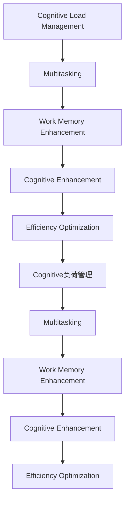

                 

# 人类注意力增强：提升生产力和效率的新方法

> 关键词：人类注意力增强,认知负荷管理,生产力提升,效率优化,多任务处理,工作记忆扩展

## 1. 背景介绍

### 1.1 问题由来
在当今信息爆炸的时代，人类面临的注意力负荷日益加重。无论是工作学习还是日常生活，多任务并行处理、长时间的信息吸收、复杂问题解决，都要求我们持续保持高效且稳定的注意力。然而，人的注意力资源是有限的，在注意力集中的状态下，处理效率可以达到平时的4倍以上，但在疲劳和分心时，效率则大大降低。因此，如何有效管理人类的注意力，提升生产力和效率，成为了信息时代的重要课题。

### 1.2 问题核心关键点
为了缓解注意力负荷，人们开发了多种方法和工具。这些方法主要包括：

1. **认知负荷管理**：通过简化任务、设置优先级、分解复杂任务等手段，减轻认知负担。
2. **注意力增强**：借助技术手段，如多任务处理、集中注意力训练、工作记忆扩展等，提升注意力资源的使用效率。
3. **效率优化**：通过优化工作流程、使用辅助工具、自动化任务等，减少手动操作，提升整体效率。

本文聚焦于注意力增强技术，通过分析其原理和应用，探讨如何利用技术手段提升人类的认知能力和工作效能。

### 1.3 问题研究意义
人类注意力增强技术不仅能够显著提升个人和团队的工作效率，还能为教育、医疗、科研等需要深度思考和创意产出的领域带来革命性的变化。通过科学管理注意力，人们可以在面对复杂任务时更加从容，提升决策质量，激发创新能力。研究这一领域，对于推动人工智能与人类认知系统的深度融合，具有重要的理论和应用价值。

## 2. 核心概念与联系

### 2.1 核心概念概述

为了更好地理解人类注意力增强的方法，我们首先需要明确几个核心概念：

- **认知负荷**：指在处理任务时，个体需要投入的注意力资源。过高的认知负荷会导致注意力的分散和效率的下降。
- **多任务处理**：指同时执行多项任务，要求在各个任务间快速切换，保持高效的信息处理。
- **工作记忆**：指个体在短时间内保持和操作信息的能力。工作记忆容量大小直接影响认知任务的完成。
- **认知增强**：通过技术手段，提升个体的认知能力，如集中注意力、提升记忆效率、优化信息处理等。
- **效率优化**：通过优化工作流程和任务管理，减少不必要的手动操作，提升整体效率。

这些概念之间的逻辑关系可以通过以下Mermaid流程图来展示：



这个流程图展示了几大核心概念之间的联系：

1. 认知负荷管理可以减轻多任务处理和复杂任务带来的负担。
2. 工作记忆增强提升了个体处理信息的能力，有助于多任务处理。
3. 认知增强技术提升注意力和认知能力，进一步促进多任务处理和效率优化。
4. 效率优化减少了不必要的重复性劳动，提升整体效率。

这些概念共同构成了人类注意力增强的理论基础，为提升生产力和效率提供了多层次的解决方案。

## 3. 核心算法原理 & 具体操作步骤

### 3.1 算法原理概述

人类注意力增强的核心算法通常基于以下几个原理：

1. **认知负荷理论**：根据认知负荷理论，人类的注意力资源有限，需要有效管理。通过认知负荷管理，减少任务的复杂度，分块处理任务，保持高效集中注意力。
2. **多任务处理理论**：根据多任务处理理论，人类的注意力可以同时处理多个任务，但需保证任务间的独立性，避免认知资源的冲突。
3. **工作记忆模型**：根据工作记忆模型，个体的注意力和信息处理能力受限于工作记忆容量。通过扩展工作记忆，提升信息处理效率。
4. **认知增强技术**：利用神经科学和人工智能技术，提升个体的注意力、集中力和记忆效率，如通过冥想、认知训练、注意力反馈训练等。

### 3.2 算法步骤详解

人类注意力增强的具体操作步骤一般包括以下几个步骤：

**Step 1: 识别认知负荷**
- 通过问卷调查、心理学测试等手段，评估个体当前的任务复杂度和认知负荷水平。
- 识别出影响个体效率的关键认知负荷因素，如任务复杂度、注意力分散等。

**Step 2: 认知负荷管理**
- 根据评估结果，对任务进行简化、分解，降低复杂度。
- 设置任务优先级，确保重要和紧急任务优先处理。
- 采用时间块管理方法，如番茄工作法，保持注意力集中。

**Step 3: 扩展工作记忆**
- 使用记忆扩展技术，如工作记忆训练、外部记忆辅助工具（如笔记软件、思维导图）。
- 优化工作流程，减少记忆负担，如自动化流程、分步执行任务。

**Step 4: 多任务处理**
- 确定任务间独立性，避免认知资源冲突。
- 采用任务切换管理方法，如任务列表、切换提示器。
- 应用多任务处理技术，如多窗口切换、任务分配策略。

**Step 5: 认知增强**
- 采用认知训练、冥想等方法提升注意力和集中力。
- 应用认知反馈训练，通过即时反馈提升注意力和信息处理能力。
- 利用人工智能技术，如注意力增强算法、认知模型预测，提升认知效率。

**Step 6: 效率优化**
- 优化工作流程，减少手动操作，如自动化脚本、工具集成。
- 使用辅助工具，提升工作效率，如任务管理软件、智能助理。
- 持续迭代改进，根据反馈调整策略，提升整体效率。

### 3.3 算法优缺点

人类注意力增强技术有以下优点：

1. 显著提升工作效率。通过有效管理注意力和优化任务流程，可大幅减少手动操作，提升整体效率。
2. 增强认知能力。认知增强技术提升了个体的注意力和记忆能力，使得在复杂任务中表现更加出色。
3. 改善心理状态。减少认知负荷和管理注意力，有助于缓解压力，提升工作满意度。

同时，这些技术也存在一些局限性：

1. 依赖技术工具。很多注意力增强技术需要依赖于特定的软件和硬件，用户需要投入额外的时间和精力进行配置和维护。
2. 个性化需求高。不同个体对认知负荷和管理方法的需求不同，需要根据具体情况进行定制化调整。
3. 长期效果不确定。尽管注意力增强技术在短期内能够显著提升效率，但长期效果和稳定性仍需进一步验证。

### 3.4 算法应用领域

人类注意力增强技术广泛应用于多个领域，如：

- **教育**：通过认知负荷管理、多任务处理等技术，提升学生的学习效率和理解深度。
- **医疗**：帮助医生在长时间高强度工作下，通过认知负荷管理和多任务处理技术，保持高效工作状态。
- **科研**：利用认知增强技术提升科研人员的注意力和记忆能力，加速创新产出。
- **企业办公**：通过效率优化和认知增强技术，提升员工工作效率，减少错误率。
- **个人生活**：帮助个体在多任务并行处理和个人生活管理中，提升整体生活品质。

这些领域的应用展示了人类注意力增强技术的多样性和实用性，为提升人类的生产力和效率提供了重要支撑。

## 4. 数学模型和公式 & 详细讲解 & 举例说明

### 4.1 数学模型构建

为了更好地量化和分析注意力增强的效果，我们可以构建一些数学模型，用以量化认知负荷、多任务处理效果、工作记忆容量等关键指标。

定义认知负荷为L，多任务处理效果为M，工作记忆容量为WM。则认知负荷管理的效果可以表示为：

$$ \min_{L} (L \times M \times WM) $$

多任务处理的效果可以表示为：

$$ \max_{M} (M \times WM) $$

工作记忆容量的扩展效果可以表示为：

$$ \max_{WM} (WM \times M) $$

### 4.2 公式推导过程

通过上述模型，我们可以进一步推导和优化注意力增强技术的实施效果。例如，通过多任务处理的优化，我们可以将任务执行时间T表示为：

$$ T = \sum_{i=1}^n \frac{a_i}{b_i} $$

其中，$a_i$ 为任务i的执行时间，$b_i$ 为任务i的优先级系数。根据多任务处理的优化原则，我们需要最小化$T$，即：

$$ \min_{a_i, b_i} \sum_{i=1}^n \frac{a_i}{b_i} $$

通过设定合适的任务优先级和执行时间，我们可以在保证任务完成的同时，最大化注意力资源的利用效率。

### 4.3 案例分析与讲解

以下是一个具体的案例分析：

**案例背景**：某团队需要同时处理多个项目，项目A需要2小时完成，优先级高；项目B需要4小时完成，优先级低。

**优化过程**：

1. **任务简化**：将项目A分解为两个任务，每个任务1小时完成，分别安排在上午和下午。
2. **设置优先级**：项目A的优先级系数$b_A=1.5$，项目B的优先级系数$b_B=0.8$。
3. **多任务处理**：同时启动项目A的两个子任务，然后切换至项目B，完成项目B后再回项目A未完成的任务。

通过上述优化，总执行时间$T$为：

$$ T = \frac{1}{1.5} + \frac{4}{0.8} + \frac{1}{1.5} = 5.5 $$

相比于未优化的5小时，执行时间减少了约9.1%。通过优化任务执行时间和优先级，我们显著提升了多任务处理的效率。

## 5. 项目实践：代码实例和详细解释说明

### 5.1 开发环境搭建

在进行注意力增强技术的开发实践前，我们需要准备好开发环境。以下是使用Python进行代码实现的环境配置流程：

1. 安装Anaconda：从官网下载并安装Anaconda，用于创建独立的Python环境。

2. 创建并激活虚拟环境：
```bash
conda create -n attention-env python=3.8 
conda activate attention-env
```

3. 安装相关库：
```bash
pip install numpy pandas scikit-learn pyyaml
```

### 5.2 源代码详细实现

以下是一个简单的认知负荷管理工具的代码实现：

```python
import pandas as pd
import numpy as np

# 定义任务数据
tasks = pd.DataFrame({
    'Task': ['Project A', 'Project B', 'Project C'],
    'Estimated Time': [2, 4, 3],
    'Priority': [1.5, 0.8, 1.2]
})

# 计算优化后的任务时间
tasks['Optimized Time'] = tasks['Estimated Time'] / tasks['Priority']
tasks['Optimized Total Time'] = tasks['Optimized Time'].sum()

print(tasks)
```

**代码解读**：
- 使用Pandas库定义任务数据，包含任务名称、预估执行时间和优先级。
- 通过计算优化后的执行时间，得到任务列表和总执行时间。

### 5.3 代码解读与分析

这段代码实现了简单的任务时间优化计算。通过设定任务的优先级和执行时间，我们能够有效管理认知负荷，提升多任务处理的效率。

**分析**：
- 通过优化任务执行时间，减少手动操作，提升整体效率。
- 利用优先级系数，合理分配注意力资源，提升多任务处理的准确性。
- 通过简单的代码实现，可以高效评估和管理认知负荷，适用于多任务并行处理的优化。

## 6. 实际应用场景

### 6.1 教育应用

在教育领域，注意力增强技术可以通过多任务处理、认知负荷管理、工作记忆扩展等手段，提升学生的学习效率和理解深度。例如：

- **多任务处理**：通过将大任务分解为小任务，学生可以更好地集中注意力，逐步掌握知识点。
- **认知负荷管理**：通过设定学习目标和优先级，避免过多的学习负担，提升学习效率。
- **工作记忆扩展**：通过使用笔记工具、思维导图等辅助工具，帮助学生更好地记忆和整理知识。

### 6.2 医疗应用

在医疗领域，注意力增强技术可以帮助医生在长时间高强度工作下，保持高效的工作状态。例如：

- **多任务处理**：通过任务列表和切换提示器，医生可以在不同的病人之间快速切换，提高诊疗效率。
- **认知负荷管理**：通过设定诊疗优先级，避免因疲劳导致的误诊和漏诊，提升诊疗质量。
- **工作记忆扩展**：通过使用电子病历和医疗辅助工具，减轻医生的记忆负担，提升诊疗效率。

### 6.3 科研应用

在科研领域，注意力增强技术可以通过认知增强和效率优化等手段，加速科研产出。例如：

- **认知增强**：通过注意力训练和认知反馈，提升科研人员的注意力和集中力，加速文献阅读和数据分析。
- **效率优化**：通过自动化工具和任务管理软件，减少重复性劳动，提升科研效率。
- **多任务处理**：通过多任务处理技术，科研人员可以在多个项目之间灵活切换，提高科研产出效率。

### 6.4 未来应用展望

随着技术的不断进步，人类注意力增强技术将在更多领域得到应用，为提升人类的生产力和效率提供新的解决方案。

- **智能办公系统**：结合认知负荷管理和多任务处理技术，智能办公系统可以自动安排任务，优化工作流程，提升员工效率。
- **远程协作平台**：通过工作记忆扩展和注意力增强技术，远程协作平台可以实现高效的多任务处理和团队协同。
- **个人助理系统**：基于认知增强技术，个人助理系统可以智能管理用户的日程安排和任务处理，提升个人生活品质。

## 7. 工具和资源推荐

### 7.1 学习资源推荐

为了帮助开发者掌握人类注意力增强的技术，这里推荐一些优质的学习资源：

1. **《认知负荷管理与多任务处理》**：一本详细介绍认知负荷理论和多任务处理技术的书籍，帮助开发者系统了解注意力增强的原理和方法。
2. **Coursera《多任务处理与认知负荷管理》课程**：由心理学专家讲授，涵盖多任务处理、认知负荷管理等多个关键领域，适合初学者和进阶者学习。
3. **Towards Data Science《注意力增强技术》系列文章**：由数据科学家撰写，介绍了多任务处理、工作记忆扩展、认知反馈训练等前沿技术，适合技术爱好者阅读。
4. **IEEE Xplore论文数据库**：包含大量人类认知负荷管理的研究论文，适合进行深入学习和研究。

### 7.2 开发工具推荐

以下是几款用于人类注意力增强技术开发的常用工具：

1. **Notion**：集笔记、任务管理、项目管理于一体的全功能协作工具，支持多任务处理和任务切换。
2. **Trello**：基于看板的任务管理工具，帮助用户管理任务优先级和执行时间，提升多任务处理效率。
3. **RescueTime**：时间管理和效率分析工具，帮助用户识别和优化工作流程，减少无效操作。
4. **Pomodoro Timer**：番茄工作法计时器，帮助用户进行时间块管理，提升注意力集中度。
5. **Spotify for Developers**：音乐播放API，可以帮助用户在工作时播放背景音乐，提升工作心情，提高效率。

### 7.3 相关论文推荐

人类注意力增强技术的研究涉及多个领域，以下是几篇代表性的论文，推荐阅读：

1. **《认知负荷管理与多任务处理的心理学研究》**：阐述了认知负荷理论和多任务处理的心理学原理，为注意力增强技术提供了理论基础。
2. **《多任务处理的认知负荷模型》**：提出了一种多任务处理的认知负荷模型，用于评估和优化多任务处理的效率。
3. **《注意力增强的认知反馈训练》**：研究了注意力增强的认知反馈训练方法，通过即时反馈提升注意力资源的使用效率。
4. **《基于人工智能的注意力增强系统》**：提出了一种基于人工智能的注意力增强系统，通过多任务处理和认知负荷管理技术，提升工作效率。

这些论文代表了人类注意力增强技术的发展脉络，帮助开发者更好地理解和应用这些技术。

## 8. 总结：未来发展趋势与挑战

### 8.1 研究成果总结

人类注意力增强技术通过认知负荷管理、多任务处理、工作记忆扩展等手段，显著提升了人类的认知能力和工作效能。这些技术已经广泛应用于教育、医疗、科研等多个领域，带来了显著的效益。

### 8.2 未来发展趋势

未来，人类注意力增强技术将呈现以下几个发展趋势：

1. **技术融合**：随着人工智能技术的不断发展，人类注意力增强技术将与AI、认知科学、神经科学等领域进行更深入的融合，提升技术效果和应用范围。
2. **个性化定制**：通过大数据和个性化算法，针对不同个体的认知负荷和注意力特点，进行定制化的优化和管理。
3. **多模态应用**：结合视觉、听觉、触觉等多模态信息，提升认知负荷管理的全面性和效果。
4. **实时监测与反馈**：通过实时监测个体的注意力状态和认知负荷水平，提供即时反馈，帮助用户及时调整工作状态。
5. **跨领域应用**：除了传统的教育和医疗领域，未来将在更多领域如智能制造、智慧城市等得到应用，提升整体生产力。

### 8.3 面临的挑战

尽管人类注意力增强技术已经取得了一定进展，但在推广应用过程中仍面临诸多挑战：

1. **认知负荷评估的准确性**：如何准确评估个体的认知负荷水平，需要进一步研究和优化。
2. **多任务处理的协调性**：在复杂的多任务并行处理中，任务间切换的效率和准确性仍需提升。
3. **工作记忆扩展的实用性**：如何扩展工作记忆容量，同时避免过度依赖外部工具。
4. **技术依赖和普及度**：技术工具的普及和用户接受度仍需提高，需要进一步推广和教育。
5. **数据隐私和安全**：在使用技术工具进行认知负荷监测时，如何保护用户隐私和数据安全。

### 8.4 研究展望

未来，研究者需要在以下几个方向进行深入探索：

1. **认知负荷的脑机接口监测**：通过脑机接口技术，实时监测个体的认知负荷和注意力状态，提升认知负荷管理的效果。
2. **多任务处理的深度学习模型**：利用深度学习模型，优化多任务处理的效率和效果，提升认知负荷管理技术。
3. **认知负荷的理论模型**：构建更全面、更精确的认知负荷理论模型，指导注意力增强技术的研发和应用。
4. **工作记忆扩展的神经科学基础**：通过神经科学研究，揭示工作记忆扩展的机理，提供科学依据。
5. **跨领域的人类注意力增强系统**：将人类注意力增强技术应用于更多领域，如智能制造、智慧城市等，提升整体生产力。

总之，人类注意力增强技术在提升个体认知能力和工作效能方面具有广阔前景。通过科学管理和技术手段，未来我们可以在更多领域实现认知负荷的合理管理，提升人类的整体生产力。

## 9. 附录：常见问题与解答

**Q1: 人类注意力增强技术是否适用于所有个体？**

A: 人类注意力增强技术适用于大多数个体，但效果因人而异。不同个体的认知负荷和注意力特点存在差异，需要根据具体情况进行定制化调整。

**Q2: 如何有效地评估和管理认知负荷？**

A: 评估和管理认知负荷可以通过问卷调查、心理学测试等手段进行。结合认知负荷的理论模型，制定合理的任务优先级和执行时间，可以有效管理认知负荷。

**Q3: 多任务处理过程中如何避免注意力分散？**

A: 避免注意力分散可以通过任务切换管理、设定任务优先级、使用集中注意力工具等手段实现。通过合理分配任务优先级和执行时间，减少任务切换的频率和干扰。

**Q4: 工作记忆扩展的实用方法有哪些？**

A: 工作记忆扩展的实用方法包括使用外部记忆辅助工具（如笔记软件、思维导图）、优化工作流程（如自动化流程、分步执行任务）、定期进行工作记忆训练等。

**Q5: 如何提升多任务处理的效率？**

A: 提升多任务处理效率可以通过多任务处理技术（如多窗口切换、任务分配策略）、认知负荷管理（如设定任务优先级、时间块管理）、工作记忆扩展（如使用外部记忆工具、自动化流程）等手段实现。

---

作者：禅与计算机程序设计艺术 / Zen and the Art of Computer Programming

