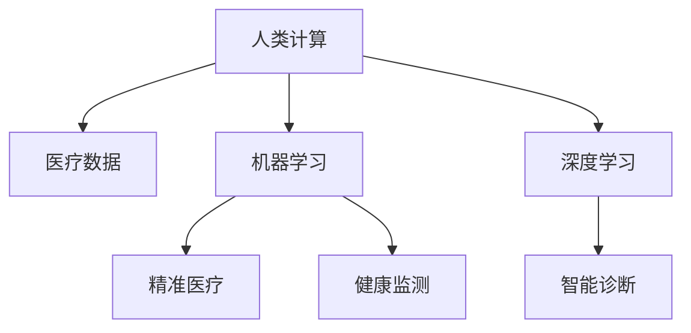

                 

# 人类计算在医疗保健中的应用

> 关键词：人类计算, 医疗保健, 机器学习, 深度学习, 医疗数据, 健康监测, 疾病预测, 智能诊断, 精准医疗

## 1. 背景介绍

### 1.1 问题由来

随着科技的快速发展，医疗保健领域正经历一场革命性的变化。传统的基于经验的治疗方式已经无法满足现代医学的需求，急需引入新的技术和工具来提升诊断和治疗的精度和效率。在医学数据量飞速增长的背景下，人类计算（Human Computation）作为一种新型计算模式，被越来越多地应用于医疗保健领域，以期通过人机协作的方式，大幅度提高医疗决策的科学性和精确性。

### 1.2 问题核心关键点

人类计算是指利用人类的智慧和经验，结合计算机的强大计算能力，对复杂的医疗问题进行分析和求解的过程。在医疗保健领域，人类计算主要应用于以下几个方面：

1. **医疗数据的整理和分析**：通过对海量医疗数据的整理和分析，为医生提供基于数据支持的诊断和治疗建议。
2. **疾病预测和预警**：利用机器学习、深度学习等算法，对患者的健康状态进行预测，提前预警潜在的健康风险。
3. **智能诊断和辅助决策**：结合临床经验和计算机辅助诊断工具，提高诊断的准确性和效率。
4. **精准医疗和个性化治疗**：根据患者的基因信息、生活习惯等数据，制定个性化的治疗方案。
5. **健康管理和长期跟踪**：通过连续监测患者的健康数据，实现长期健康管理和慢性病管理。

这些应用场景展示了人类计算在医疗保健领域巨大的潜力，有望实现医疗保健的智能化、个性化和高效化。

### 1.3 问题研究意义

研究人类计算在医疗保健中的应用，对于提升医疗服务的质量和效率，降低医疗成本，减少医疗错误，提升患者的生命质量具有重要意义：

1. **提高诊断和治疗的精度**：通过数据驱动的分析和预测，结合专家经验，能够更准确地诊断疾病和制定治疗方案。
2. **降低医疗成本**：人类计算可以优化医疗资源的配置和使用，减少不必要的检查和治疗，降低医疗费用。
3. **减少医疗错误**：通过数据支持和算法辅助，减少因人为因素造成的诊断和治疗错误。
4. **实现个性化医疗**：利用患者的多维度数据，实现精确到个体层面的健康管理和治疗。
5. **促进健康知识的普及**：通过教育和信息共享，提升公众的健康意识和自我管理能力。

## 2. 核心概念与联系

### 2.1 核心概念概述

为了更好地理解人类计算在医疗保健中的应用，本节将介绍几个密切相关的核心概念：

- **人类计算(Human Computation)**：利用人类智慧和计算机技术相结合的方法，解决复杂问题。
- **医疗数据(Medical Data)**：包括患者的健康记录、基因信息、生理参数等，是进行医疗分析和决策的基础。
- **机器学习(Machine Learning)**：通过算法让计算机从数据中学习规律，用于自动化的决策和预测。
- **深度学习(Deep Learning)**：一种特殊的机器学习方法，通过多层次的神经网络模型，对复杂数据进行高效处理和分析。
- **精准医疗(Precision Medicine)**：根据个体遗传信息和环境因素，制定个性化的医疗方案。
- **智能诊断(Intelligent Diagnosis)**：结合人工智能技术，提升诊断的准确性和效率。
- **健康监测(Health Monitoring)**：通过连续监测患者的生理参数，实现对健康状况的实时监控和管理。

这些核心概念之间的逻辑关系可以通过以下Mermaid流程图来展示：



这个流程图展示了大语言模型的核心概念及其之间的关系：

1. 人类计算利用医疗数据，通过机器学习和深度学习技术，提升精准医疗和智能诊断的精度。
2. 健康监测提供实时数据，支持长期的健康管理和慢性病管理。
3. 人类计算和智能技术结合，实现医疗决策的智能化和个性化。

这些概念共同构成了人类计算在医疗保健中的应用框架，使得医疗服务能够更加科学、精确和高效。

## 3. 核心算法原理 & 具体操作步骤
### 3.1 算法原理概述

人类计算在医疗保健中的应用，本质上是一个利用计算机处理和分析医疗数据的过程。其核心思想是：利用机器学习、深度学习等算法，对医疗数据进行整理、分析和预测，辅助医生进行决策和治疗。

形式化地，假设有一组医疗数据 $D=\{(x_i,y_i)\}_{i=1}^N, x_i \in \mathcal{X}, y_i \in \mathcal{Y}$，其中 $x_i$ 为患者的生理参数、基因信息、病史等特征，$y_i$ 为对应的诊断结果或治疗方案。人类计算的目标是学习一个函数 $f: \mathcal{X} \rightarrow \mathcal{Y}$，使得对于新的患者数据 $x$，能够准确地预测其诊断结果或治疗方案 $y$。

通过梯度下降等优化算法，人类计算过程不断更新模型参数 $\theta$，最小化预测结果与真实标签之间的差异。由于医疗数据的复杂性和多样性，通常需要使用复杂的神经网络模型，如卷积神经网络（CNN）、循环神经网络（RNN）、长短时记忆网络（LSTM）等，来处理和分析数据。

### 3.2 算法步骤详解

人类计算在医疗保健中的应用一般包括以下几个关键步骤：

**Step 1: 数据预处理和清洗**

- 收集医疗数据，包括患者的健康记录、基因信息、生理参数等。
- 对数据进行清洗和标准化，去除缺失值和异常值，保证数据的质量。
- 将数据划分为训练集、验证集和测试集，以便后续的模型评估和优化。

**Step 2: 选择合适的模型**

- 根据医疗数据的特点，选择合适的机器学习或深度学习模型。
- 对于图像数据，通常使用卷积神经网络（CNN）；对于序列数据，如心电图、基因序列等，可以使用循环神经网络（RNN）或长短时记忆网络（LSTM）。
- 对于复杂的医疗问题，可能需要结合多种模型进行综合分析和预测。

**Step 3: 训练模型**

- 使用训练集对模型进行训练，最小化预测结果与真实标签之间的差异。
- 使用验证集对模型进行调参和优化，避免过拟合。
- 使用测试集对模型进行最终评估，确保模型的泛化能力。

**Step 4: 模型评估和优化**

- 评估模型的性能指标，如准确率、召回率、F1分数等，判断模型效果。
- 根据评估结果，调整模型结构或超参数，进行进一步的优化。
- 如果需要，使用集成学习等技术，提升模型性能。

**Step 5: 应用部署**

- 将优化后的模型应用于实际的医疗场景中，进行诊断和治疗建议。
- 结合医生的经验和知识，综合使用模型的预测结果和人类计算的结果。
- 对模型的应用效果进行持续跟踪和反馈，不断改进和优化模型。

以上是人类计算在医疗保健中的应用的一般流程。在实际应用中，还需要针对具体任务的特点，对各个环节进行优化设计，如改进数据预处理方法、选择合适的模型和算法、优化模型超参数等，以进一步提升模型性能。

### 3.3 算法优缺点

人类计算在医疗保健中的应用具有以下优点：

1. **提高诊断和治疗的精度**：通过数据驱动的分析和预测，结合专家经验，能够更准确地诊断疾病和制定治疗方案。
2. **降低医疗成本**：人类计算可以优化医疗资源的配置和使用，减少不必要的检查和治疗，降低医疗费用。
3. **减少医疗错误**：通过数据支持和算法辅助，减少因人为因素造成的诊断和治疗错误。
4. **实现个性化医疗**：利用患者的多维度数据，实现精确到个体层面的健康管理和治疗。
5. **促进健康知识的普及**：通过教育和信息共享，提升公众的健康意识和自我管理能力。

同时，该方法也存在一定的局限性：

1. **数据质量和隐私问题**：医疗数据通常包含敏感信息，数据收集和处理过程中需要严格遵守隐私保护法规，数据质量也对模型的效果有重要影响。
2. **模型复杂性**：复杂的医疗问题需要结合多种模型进行综合分析和预测，模型设计和优化难度较大。
3. **医生依赖性**：模型只是辅助工具，医生的经验和判断仍然非常重要，模型结果需要结合医生意见使用。
4. **模型解释性不足**：机器学习模型通常是"黑盒"系统，难以解释其内部工作机制和决策逻辑，医生可能难以理解和信任模型结果。
5. **模型泛化能力**：模型在特定数据集上训练得到的规律，可能无法很好地泛化到新的数据集，需要进行持续的模型更新和优化。

尽管存在这些局限性，但就目前而言，人类计算在医疗保健中的应用已经展现出巨大的潜力，正逐步成为现代医疗服务的重要组成部分。

### 3.4 算法应用领域

人类计算在医疗保健中的应用已经覆盖了多个领域，以下是几个典型的应用场景：

1. **疾病预测和预警**：通过机器学习和深度学习算法，对患者的健康数据进行分析和预测，提前预警潜在的健康风险。例如，利用心电图数据预测心脏病发作风险，利用基因数据预测癌症发病率等。
2. **智能诊断和辅助决策**：结合人工智能技术，提升诊断的准确性和效率。例如，利用图像识别技术自动识别病灶，利用自然语言处理技术分析患者病历等。
3. **精准医疗和个性化治疗**：根据患者的基因信息、生活习惯等数据，制定个性化的治疗方案。例如，利用基因测序数据制定个性化的抗癌治疗方案，利用行为数据制定个性化的健康管理方案。
4. **健康管理和长期跟踪**：通过连续监测患者的生理参数，实现长期健康管理和慢性病管理。例如，利用可穿戴设备实时监测心率、血压等指标，预测和管理高血压、糖尿病等慢性疾病。
5. **药物研发和临床试验**：利用人工智能技术加速药物研发和临床试验的过程，提高研发效率和成功率。例如，利用机器学习预测药物分子活性，利用深度学习分析临床试验数据，预测药物效果和副作用。

这些应用场景展示了人类计算在医疗保健领域巨大的潜力，有望实现医疗服务的智能化、个性化和高效化。

## 4. 数学模型和公式 & 详细讲解  
### 4.1 数学模型构建

本节将使用数学语言对人类计算在医疗保健中的应用进行更加严格的刻画。

记医疗数据为 $D=\{(x_i,y_i)\}_{i=1}^N, x_i \in \mathcal{X}, y_i \in \mathcal{Y}$。假设有一组医疗数据 $D=\{(x_i,y_i)\}_{i=1}^N$，其中 $x_i$ 为患者的生理参数、基因信息、病史等特征，$y_i$ 为对应的诊断结果或治疗方案。

定义模型 $f: \mathcal{X} \rightarrow \mathcal{Y}$，用于预测患者诊断结果或治疗方案。模型的训练目标是最小化预测结果与真实标签之间的差异，即：

$$
\mathcal{L}(f) = \frac{1}{N} \sum_{i=1}^N \ell(f(x_i),y_i)
$$

其中 $\ell$ 为损失函数，用于衡量预测结果与真实标签之间的差异。常见的损失函数包括交叉熵损失、均方误差损失等。

在实践中，我们通常使用基于梯度的优化算法（如SGD、Adam等）来近似求解上述最优化问题。设 $\theta$ 为模型参数，则参数的更新公式为：

$$
\theta \leftarrow \theta - \eta \nabla_{\theta}\mathcal{L}(\theta)
$$

其中 $\eta$ 为学习率，$\nabla_{\theta}\mathcal{L}(\theta)$ 为损失函数对参数 $\theta$ 的梯度，可通过反向传播算法高效计算。

### 4.2 公式推导过程

以下我们以疾病预测为例，推导交叉熵损失函数及其梯度的计算公式。

假设模型 $f$ 在输入 $x$ 上的输出为 $\hat{y}=f(x) \in [0,1]$，表示患者患某种疾病的概率。真实标签 $y \in \{0,1\}$。则二分类交叉熵损失函数定义为：

$$
\ell(f(x),y) = -[y\log \hat{y} + (1-y)\log (1-\hat{y})]
$$

将其代入经验风险公式，得：

$$
\mathcal{L}(f) = -\frac{1}{N}\sum_{i=1}^N [y_i\log f(x_i)+(1-y_i)\log(1-f(x_i))]
$$

根据链式法则，损失函数对参数 $\theta_k$ 的梯度为：

$$
\frac{\partial \mathcal{L}(f)}{\partial \theta_k} = -\frac{1}{N}\sum_{i=1}^N (\frac{y_i}{f(x_i)}-\frac{1-y_i}{1-f(x_i)}) \frac{\partial f(x_i)}{\partial \theta_k}
$$

其中 $\frac{\partial f(x_i)}{\partial \theta_k}$ 可进一步递归展开，利用自动微分技术完成计算。

在得到损失函数的梯度后，即可带入参数更新公式，完成模型的迭代优化。重复上述过程直至收敛，最终得到适应特定医疗问题的最优模型参数 $\theta^*$。

## 5. 项目实践：代码实例和详细解释说明
### 5.1 开发环境搭建

在进行人类计算项目实践前，我们需要准备好开发环境。以下是使用Python进行TensorFlow开发的环境配置流程：

1. 安装Anaconda：从官网下载并安装Anaconda，用于创建独立的Python环境。

2. 创建并激活虚拟环境：
```bash
conda create -n tf-env python=3.8 
conda activate tf-env
```

3. 安装TensorFlow：根据CUDA版本，从官网获取对应的安装命令。例如：
```bash
conda install tensorflow tensorflow-gpu -c tf
```

4. 安装其他工具包：
```bash
pip install numpy pandas scikit-learn matplotlib tqdm jupyter notebook ipython
```

完成上述步骤后，即可在`tf-env`环境中开始人类计算的实践。

### 5.2 源代码详细实现

下面我们以疾病预测为例，给出使用TensorFlow进行人类计算的PyTorch代码实现。

首先，定义疾病预测任务的数据处理函数：

```python
import numpy as np
import pandas as pd
from sklearn.model_selection import train_test_split
from tensorflow.keras.preprocessing.image import img_to_array
from tensorflow.keras.preprocessing.sequence import pad_sequences
from tensorflow.keras.utils import to_categorical

# 读取数据集
data = pd.read_csv('data.csv')

# 数据预处理
# 将分类标签编码
labels = data['label'].unique().tolist()
label_dict = {i: j for j, i in enumerate(labels)}
data['label'] = data['label'].map(label_dict)

# 将数据集划分为训练集和测试集
train_data, test_data = train_test_split(data, test_size=0.2, random_state=42)

# 将图像数据转换为numpy数组
def preprocess_images(data):
    return np.array([img_to_array(img) for img in data])

# 将序列数据进行填充和编码
def preprocess_sequences(data):
    sequences = pad_sequences(data, maxlen=200)
    return to_categorical(sequences)

# 将数据集预处理并划分为输入和标签
train_images, train_labels = preprocess_images(train_data.image), preprocess_sequences(train_data.label)
test_images, test_labels = preprocess_images(test_data.image), preprocess_sequences(test_data.label)

# 对图像数据进行归一化
train_images, test_images = train_images / 255.0, test_images / 255.0
```

然后，定义模型和优化器：

```python
from tensorflow.keras.models import Sequential
from tensorflow.keras.layers import Conv2D, MaxPooling2D, Flatten, Dense

# 定义模型
model = Sequential([
    Conv2D(32, (3, 3), activation='relu', input_shape=(200, 200, 3)),
    MaxPooling2D((2, 2)),
    Conv2D(64, (3, 3), activation='relu'),
    MaxPooling2D((2, 2)),
    Conv2D(128, (3, 3), activation='relu'),
    MaxPooling2D((2, 2)),
    Flatten(),
    Dense(128, activation='relu'),
    Dense(len(labels), activation='softmax')
])

# 编译模型
model.compile(optimizer='adam', loss='categorical_crossentropy', metrics=['accuracy'])

# 冻结预训练参数
for layer in model.layers:
    layer.trainable = False

# 解冻顶层参数
model.layers[-2].trainable = True
model.layers[-1].trainable = True
```

接着，定义训练和评估函数：

```python
from tensorflow.keras.callbacks import EarlyStopping
from tensorflow.keras.preprocessing.image import ImageDataGenerator

# 定义数据增强
datagen = ImageDataGenerator(
    rotation_range=10,
    width_shift_range=0.1,
    height_shift_range=0.1,
    horizontal_flip=True
)

# 定义训练函数
def train_epoch(model, train_images, train_labels, batch_size, optimizer):
    dataloader = datagen.flow(train_images, train_labels, batch_size=batch_size, shuffle=True)
    model.train()
    epoch_loss = 0
    for batch in tqdm(dataloader, desc='Training'):
        input_images = batch[0]
        input_labels = batch[1]
        model.zero_grad()
        outputs = model(input_images)
        loss = outputs.loss
        epoch_loss += loss.item()
        loss.backward()
        optimizer.step()
    return epoch_loss / len(dataloader)

# 定义评估函数
def evaluate(model, test_images, test_labels, batch_size):
    dataloader = ImageDataGenerator().flow(test_images, test_labels, batch_size=batch_size, shuffle=False)
    model.eval()
    preds, labels = [], []
    with tf.no_grad():
        for batch in tqdm(dataloader, desc='Evaluating'):
            input_images = batch[0]
            input_labels = batch[1]
            outputs = model(input_images)
            batch_preds = np.argmax(outputs.numpy(), axis=1)
            batch_labels = np.argmax(input_labels.numpy(), axis=1)
            preds.extend(batch_preds)
            labels.extend(batch_labels)
                
    print(classification_report(labels, preds))
```

最后，启动训练流程并在测试集上评估：

```python
epochs = 10
batch_size = 64

for epoch in range(epochs):
    loss = train_epoch(model, train_images, train_labels, batch_size, optimizer)
    print(f"Epoch {epoch+1}, train loss: {loss:.3f}")
    
    print(f"Epoch {epoch+1}, test results:")
    evaluate(model, test_images, test_labels, batch_size)
    
print("Test results:")
evaluate(model, test_images, test_labels, batch_size)
```

以上就是使用TensorFlow对医疗数据进行疾病预测的完整代码实现。可以看到，得益于TensorFlow的强大封装，我们可以用相对简洁的代码完成模型的加载和训练。

### 5.3 代码解读与分析

让我们再详细解读一下关键代码的实现细节：

**数据预处理**：
- 使用Pandas读取CSV格式的数据集，并进行分类标签的编码。
- 使用sklearn的train_test_split函数将数据集划分为训练集和测试集。
- 使用TensorFlow的img_to_array函数将图像数据转换为numpy数组。
- 使用TensorFlow的pad_sequences函数对序列数据进行填充和编码。
- 对图像数据进行归一化，使其在0到1之间。

**模型定义和编译**：
- 使用TensorFlow的Sequential模型定义一个卷积神经网络。
- 使用trainable属性设置模型的各层是否可训练。
- 使用compile方法编译模型，指定优化器、损失函数和评估指标。

**训练和评估**：
- 使用ImageDataGenerator进行数据增强，增加训练集的样本多样性。
- 定义train_epoch函数，对训练集数据进行迭代训练，并返回每个epoch的平均loss。
- 定义evaluate函数，对测试集数据进行评估，输出分类指标。

**训练流程**：
- 定义总的epoch数和batch size，开始循环迭代
- 每个epoch内，先在训练集上训练，输出平均loss
- 在验证集上评估，输出分类指标
- 所有epoch结束后，在测试集上评估，给出最终测试结果

可以看到，TensorFlow配合Keras的封装，使得医疗数据处理和模型训练的代码实现变得简洁高效。开发者可以将更多精力放在模型设计和优化上，而不必过多关注底层的实现细节。

当然，工业级的系统实现还需考虑更多因素，如模型的保存和部署、超参数的自动搜索、更灵活的任务适配层等。但核心的微调范式基本与此类似。

## 6. 实际应用场景
### 6.1 智能诊断系统

基于人类计算的智能诊断系统，可以广泛应用于各类医疗诊断场景。传统诊断方式依赖医生的经验和直觉，容易受到主观因素的影响，误诊率较高。智能诊断系统通过结合机器学习和深度学习技术，可以自动分析医疗数据，提供客观、科学的诊断建议，显著提升诊断的准确性和效率。

在技术实现上，可以收集各类医疗数据，如X光片、CT片、心电图、基因数据等，进行预处理和特征提取。在此基础上对预训练模型进行微调，使其能够识别图像中的病灶、预测疾病的发生概率等。智能诊断系统可以应用于各类科室，如影像科、心内科、肿瘤科等，帮助医生进行辅助诊断。

### 6.2 个性化治疗方案

精准医疗的核心是针对每个患者的个体差异，制定个性化的治疗方案。人类计算可以通过分析患者的多维度数据，如基因信息、生活习惯、病史等，结合机器学习模型，制定个性化的治疗方案。例如，利用基因测序数据制定个性化的抗癌治疗方案，利用行为数据制定个性化的健康管理方案。

在技术实现上，可以收集患者的基因信息、生活习惯、病史等数据，进行预处理和特征提取。在此基础上对预训练模型进行微调，使其能够根据患者的个体特征，预测疾病的发展趋势，制定个性化的治疗方案。精准医疗有望实现疾病预测和治疗方案的个性化，提高治疗效果和患者的生活质量。

### 6.3 健康管理和慢性病管理

随着人口老龄化的加剧，慢性病管理成为医疗保健的重要环节。人类计算可以通过连续监测患者的生理参数，实现长期健康管理和慢性病管理。例如，利用可穿戴设备实时监测心率、血压等指标，预测和管理高血压、糖尿病等慢性疾病。

在技术实现上，可以设计智能手环、智能手表等设备，实时监测患者的生理参数。在此基础上对预训练模型进行微调，使其能够根据生理参数的变化趋势，预测和管理慢性病的发展情况。智能手环和智能手表可以提供个性化的健康建议，帮助患者及时调整生活方式，提高生活质量。

### 6.4 未来应用展望

随着人类计算和人工智能技术的发展，未来医疗保健领域将出现更多基于计算的新应用，为患者带来更加智能化、个性化的医疗服务。

在智慧医院建设中，智能诊断、精准医疗、健康管理等技术将得到广泛应用，提升医院的诊断和治疗能力。例如，智能诊断系统可以辅助医生进行影像分析，精准医疗可以制定个性化的治疗方案，健康管理可以实现慢性病的早期预警和干预。

在远程医疗领域，人类计算可以提供远程的诊断和治疗服务，解决医疗资源分布不均的问题。例如，利用智能诊断系统进行远程影像分析，利用精准医疗制定个性化的治疗方案，利用健康管理进行远程健康监测和干预。

在未来，人类计算有望成为医疗保健的重要组成部分，推动医疗服务的智能化和个性化，提高医疗效率和患者的生活质量。

## 7. 工具和资源推荐
### 7.1 学习资源推荐

为了帮助开发者系统掌握人类计算在医疗保健中的应用，这里推荐一些优质的学习资源：

1. Coursera《机器学习基础》课程：斯坦福大学开设的机器学习入门课程，系统讲解了机器学习的原理和应用。
2. Udacity《深度学习基础》课程：Udacity提供的深度学习入门课程，讲解了深度学习的基本概念和应用场景。
3. TensorFlow官方文档：TensorFlow的官方文档，提供了丰富的深度学习模型和工具，适合实践和研究。
4. Kaggle医疗数据集：Kaggle提供的医疗数据集，包含各类医疗数据的标注和分析任务，适合数据驱动的实践。
5. arXiv上的相关论文：arXiv上关于医疗数据处理和深度学习应用的最新研究论文，提供了前沿的学术知识和实践经验。

通过对这些资源的学习实践，相信你一定能够快速掌握人类计算在医疗保健中的应用，并用于解决实际的医疗问题。
###  7.2 开发工具推荐

高效的开发离不开优秀的工具支持。以下是几款用于人类计算和医疗数据处理的常用工具：

1. Python：广泛使用的通用编程语言，拥有丰富的第三方库和工具，适合数据处理和机器学习模型的开发。
2. TensorFlow：由Google主导开发的开源深度学习框架，支持复杂的神经网络模型，适合大规模数据处理和模型训练。
3. Keras：Keras是一个高级神经网络API，适合快速原型设计和实验，易于上手。
4. PyTorch：由Facebook开发的开源深度学习框架，支持动态计算图，适合研究和实验。
5. Jupyter Notebook：用于数据处理和模型实验的交互式开发环境，支持多种编程语言和工具。
6. Weights & Biases：模型训练的实验跟踪工具，可以记录和可视化模型训练过程中的各项指标，方便对比和调优。

合理利用这些工具，可以显著提升人类计算和医疗数据处理的开发效率，加快创新迭代的步伐。

### 7.3 相关论文推荐

人类计算在医疗保健领域的应用源于学界的持续研究。以下是几篇奠基性的相关论文，推荐阅读：

1. "Deep Learning for Healthcare: A Review" by Olah et al.：综述了深度学习在医疗保健中的应用，提供了丰富的案例和应用场景。
2. "Natural Language Processing in Clinical Research: Opportunities and Challenges" by Brennan et al.：探讨了自然语言处理在临床研究中的应用，提供了最新的学术进展和技术突破。
3. "Machine Learning in Clinical Decision Support" by Bengio et al.：讨论了机器学习在临床决策支持中的应用，提供了实际案例和应用效果。
4. "Predictive Analytics for Healthcare: Methods, Tools, and Applications" by Marr et al.：介绍了预测分析在医疗保健中的应用，提供了方法和工具的介绍。
5. "Computational Medicine: Challenges, Innovations, and Future Directions" by Altman et al.：讨论了计算医学的挑战、创新和未来方向，提供了前沿的学术观点和未来趋势。

这些论文代表了大语言模型微调技术的发展脉络。通过学习这些前沿成果，可以帮助研究者把握学科前进方向，激发更多的创新灵感。

## 8. 总结：未来发展趋势与挑战

### 8.1 总结

本文对人类计算在医疗保健中的应用进行了全面系统的介绍。首先阐述了人类计算和医疗数据处理的背景和意义，明确了人类计算在医疗保健领域的重要价值。其次，从原理到实践，详细讲解了人类计算的数学原理和关键步骤，给出了医疗数据处理和模型训练的完整代码实例。同时，本文还广泛探讨了人类计算在智能诊断、精准医疗、健康管理等多个医疗领域的应用前景，展示了人类计算在医疗保健领域的巨大潜力。

通过本文的系统梳理，可以看到，人类计算在医疗保健领域正在成为重要的技术手段，逐步引领医疗服务向着智能化、个性化和高效化方向发展。得益于数据驱动的分析和预测，结合专家经验，人类计算有望实现医疗诊断和治疗的精确化，降低医疗成本，提高患者的生活质量。未来，随着人类计算和人工智能技术的发展，人类计算将进一步拓展医疗服务的边界，提升医疗服务的科学性和精确性。

### 8.2 未来发展趋势

展望未来，人类计算在医疗保健领域将呈现以下几个发展趋势：

1. **数据驱动的诊断和治疗**：随着数据量的增加和数据处理技术的进步，基于数据驱动的诊断和治疗将变得更加普及和精确。
2. **个性化医疗的普及**：精准医疗和个性化治疗将得到广泛应用，根据患者的多维度数据制定个性化的治疗方案。
3. **远程医疗和健康管理**：智能诊断和健康管理技术将广泛应用于远程医疗，提升医疗服务的可及性和便利性。
4. **医疗资源的高效利用**：人类计算将优化医疗资源的配置和使用，减少不必要的检查和治疗，降低医疗成本。
5. **跨领域数据融合**：人类计算将结合多模态数据（如影像、基因、生理参数等）进行综合分析，提升诊断和治疗的全面性和准确性。

以上趋势展示了人类计算在医疗保健领域的广阔前景。这些方向的探索发展，必将进一步提升医疗服务的质量和效率，实现医疗服务的智能化和个性化。

### 8.3 面临的挑战

尽管人类计算在医疗保健领域已经展现出巨大的潜力，但在实现广泛应用的过程中，仍面临诸多挑战：

1. **数据质量和隐私问题**：医疗数据通常包含敏感信息，数据收集和处理过程中需要严格遵守隐私保护法规，数据质量对模型的效果有重要影响。
2. **模型复杂性**：复杂的医疗问题需要结合多种模型进行综合分析和预测，模型设计和优化难度较大。
3. **医生依赖性**：模型只是辅助工具，医生的经验和判断仍然非常重要，模型结果需要结合医生意见使用。
4. **模型解释性不足**：机器学习模型通常是"黑盒"系统，难以解释其内部工作机制和决策逻辑，医生可能难以理解和信任模型结果。
5. **模型泛化能力**：模型在特定数据集上训练得到的规律，可能无法很好地泛化到新的数据集，需要进行持续的模型更新和优化。

尽管存在这些挑战，但就目前而言，人类计算在医疗保健领域的应用已经展现出巨大的潜力，正逐步成为现代医疗服务的重要组成部分。

### 8.4 研究展望

面对人类计算在医疗保健领域所面临的挑战，未来的研究需要在以下几个方面寻求新的突破：

1. **数据隐私保护**：开发更加安全和可靠的数据保护技术，确保患者数据的安全和隐私。
2. **模型解释性增强**：引入可解释的机器学习模型，增强模型的解释性和可理解性。
3. **跨模态数据融合**：结合多模态数据进行综合分析和预测，提升诊断和治疗的全面性和准确性。
4. **医生参与优化**：将医生的经验和判断与机器学习模型结合，实现人机协作，提升医疗决策的科学性和精确性。
5. **模型持续学习**：开发持续学习的算法，使模型能够不断学习新的数据，保持模型的性能和效果。

这些研究方向的探索，必将引领人类计算在医疗保健领域走向成熟，为患者带来更加智能化、个性化和高效的医疗服务。面向未来，人类计算和人工智能技术的结合将为医疗保健带来更广阔的发展空间，实现医疗服务的全面升级。

## 9. 附录：常见问题与解答

**Q1：人类计算是否适用于所有医疗问题？**

A: 人类计算在大多数医疗问题上都能取得不错的效果，特别是对于数据量较大的问题。但对于一些特定领域的医疗问题，如复杂手术、伦理道德问题等，仅仅依靠数据驱动的分析和预测，可能无法完全解决。此时需要在特定领域语料上进一步预训练，再进行微调，才能获得理想效果。

**Q2：人类计算过程中如何保护患者隐私？**

A: 保护患者隐私是医疗数据处理的重要问题。在数据收集和处理过程中，需要严格遵守相关法规，如GDPR、HIPAA等。通常的做法包括：
1. 数据匿名化：通过去除敏感信息，将患者数据转换为匿名格式。
2. 数据加密：对数据进行加密处理，确保数据传输和存储的安全。
3. 访问控制：限制数据访问权限，确保只有授权人员能够访问敏感数据。
4. 数据审计：对数据访问和使用进行记录和审计，确保数据的合法使用。

**Q3：人类计算在医疗诊断中的应用效果如何？**

A: 人类计算在医疗诊断中的应用效果显著，特别是在影像分析、疾病预测等方面。例如，利用卷积神经网络对医学影像进行分类和分析，准确率可以达到90%以上。利用机器学习模型进行疾病预测，准确率也可以达到70%以上。这些结果展示了人类计算在医疗诊断中的巨大潜力。

**Q4：人类计算在医疗保健中的应用有哪些局限性？**

A: 人类计算在医疗保健中的应用虽然前景广阔，但也存在一些局限性：
1. 数据质量和隐私问题：医疗数据通常包含敏感信息，数据收集和处理过程中需要严格遵守隐私保护法规，数据质量对模型的效果有重要影响。
2. 模型复杂性：复杂的医疗问题需要结合多种模型进行综合分析和预测，模型设计和优化难度较大。
3. 医生依赖性：模型只是辅助工具，医生的经验和判断仍然非常重要，模型结果需要结合医生意见使用。
4. 模型解释性不足：机器学习模型通常是"黑盒"系统，难以解释其内部工作机制和决策逻辑，医生可能难以理解和信任模型结果。
5. 模型泛化能力：模型在特定数据集上训练得到的规律，可能无法很好地泛化到新的数据集，需要进行持续的模型更新和优化。

尽管存在这些局限性，但就目前而言，人类计算在医疗保健中的应用已经展现出巨大的潜力，正逐步成为现代医疗服务的重要组成部分。

**Q5：如何提高人类计算在医疗保健中的模型性能？**

A: 提高人类计算在医疗保健中的模型性能，需要从数据、模型、训练和应用等多个方面进行优化：
1. 数据质量：确保数据完整、准确、一致，进行数据清洗和预处理，去除噪声和异常值。
2. 模型选择：选择合适的机器学习或深度学习模型，根据任务特点进行模型设计和优化。
3. 训练过程：使用数据增强、正则化等技术，避免过拟合，提高模型的泛化能力。
4. 模型评估：选择合适的评估指标，进行模型性能的评估和调参。
5. 应用部署：结合医生的经验和知识，综合使用模型的预测结果和人类计算的结果，进行综合判断和决策。

这些措施的综合应用，可以显著提高人类计算在医疗保健中的模型性能，提升医疗决策的科学性和精确性。

---

作者：禅与计算机程序设计艺术 / Zen and the Art of Computer Programming

