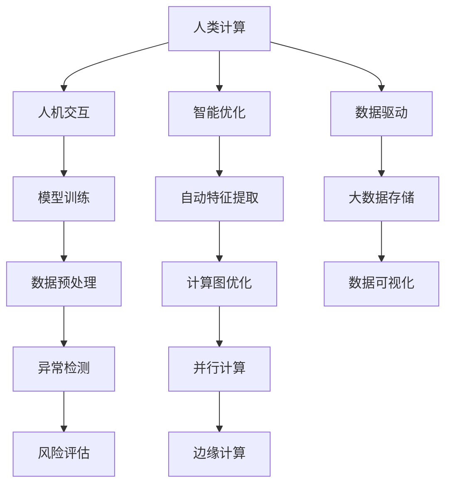

                 

# 人类计算：可持续发展的推动力

> 关键词：人类计算, 可持续发展, 能源效率, 分布式计算, 量子计算, 人工智能, 机器学习, 大数据, 区块链

## 1. 背景介绍

### 1.1 问题由来
随着数字化转型的加速，数据、计算能力与智慧决策的重要性日益突显。然而，当前计算模式已难以满足这一需求，需引入新的计算理念。基于此，"人类计算"概念应运而生，其内涵在于利用人类的智慧和创造力，将复杂的计算任务与人类结合，开启全新的计算范式。

### 1.2 问题核心关键点
人类计算的核心在于融合人机交互、智能优化与数据驱动技术，以实现高效、智能、可持续的计算能力。其核心关键点包括：

- 人机交互：通过人机协作，将复杂任务分解为可操作的步骤，使其易于理解和执行。
- 智能优化：利用人工智能技术，对数据进行分析和智能处理，提升决策效率。
- 数据驱动：以海量数据为基础，构建精确的计算模型和算法，支持决策过程。

## 2. 核心概念与联系

### 2.1 核心概念概述

人类计算作为一种新型的计算范式，依托于多个关键概念，彼此间相互联系，共同构成了一个完整的计算体系。

- **人类计算**：利用人类智慧与计算能力结合，以提高复杂计算任务的效率和准确性。
- **人机交互**：通过接口、界面等方式，实现人与机器的互动，使复杂任务变得可操作。
- **智能优化**：利用机器学习、深度学习等技术，对数据进行智能分析和处理，提升计算效率。
- **数据驱动**：依赖大数据技术，构建数据模型，支持复杂决策和计算。

这些概念之间通过交互和协作，形成了一个有机整体，共同推动了计算的智能化、高效化和可持续发展。

### 2.2 核心概念原理和架构的 Mermaid 流程图



此流程图展示了人类计算的各个核心概念及其相互关系：

- 人机交互允许将复杂任务分解为简单操作。
- 智能优化利用机器学习提升处理效率。
- 数据驱动构建模型，提供决策依据。
- 模型训练、特征提取、存储与可视化等操作，辅助整个过程。

## 3. 核心算法原理 & 具体操作步骤

### 3.1 算法原理概述

人类计算的核心算法原理建立在数据驱动和智能优化的基础上，通过高效的人机交互实现复杂计算任务的分解与执行。该过程主要包括以下几个步骤：

1. **数据收集与预处理**：从不同源收集数据，并进行清洗、转换和标注，确保数据的质量和一致性。
2. **模型训练与优化**：构建合适的机器学习模型，并使用训练集数据进行模型训练，优化模型参数。
3. **智能决策与执行**：将训练好的模型应用于实际问题，实现复杂计算任务的智能化决策与执行。
4. **人机交互反馈**：通过用户反馈，不断调整和优化算法，提高模型和系统的性能。

### 3.2 算法步骤详解

#### 步骤1：数据收集与预处理

1. **数据来源**：确定数据来源，包括公共数据集、社交媒体、传感器等。
2. **数据清洗**：去除重复、噪声和不一致的数据，确保数据质量。
3. **数据转换**：将原始数据转换为可用于训练和推理的格式，如文本、图像、时间序列等。
4. **数据标注**：对数据进行标注，如分类、标注、特征提取等。

#### 步骤2：模型训练与优化

1. **选择合适的模型**：根据任务类型选择合适的机器学习模型，如分类、回归、聚类等。
2. **数据划分**：将数据集划分为训练集、验证集和测试集。
3. **模型训练**：使用训练集数据进行模型训练，优化模型参数。
4. **模型验证**：在验证集上测试模型性能，调整模型参数。
5. **模型评估**：在测试集上评估模型性能，选择最优模型。

#### 步骤3：智能决策与执行

1. **决策制定**：利用训练好的模型对输入数据进行分析和决策。
2. **决策执行**：执行决策结果，实现复杂任务的自动化。
3. **反馈优化**：根据反馈数据，不断优化模型和算法。

#### 步骤4：人机交互反馈

1. **交互设计**：设计友好的用户界面，提供操作指引。
2. **交互监控**：监控用户操作，识别异常行为。
3. **反馈机制**：根据用户反馈，不断调整算法和模型。

### 3.3 算法优缺点

**优点**：
- **高效性**：将复杂任务分解为简单操作，提高计算效率。
- **灵活性**：结合人类智慧，适应不同场景和需求。
- **可持续性**：减少能源消耗，实现绿色计算。

**缺点**：
- **人机协同难度大**：需要高质量的人机交互设计。
- **算法复杂度高**：构建和优化模型需要高度专业知识。
- **依赖数据质量**：数据质量差可能导致计算结果不准确。

### 3.4 算法应用领域

人类计算的应用领域广泛，包括但不限于以下几个方面：

- **智能城市**：通过智能监控和数据分析，实现交通管理、环境保护、公共安全等。
- **医疗健康**：利用数据驱动和智能优化，辅助诊断、治疗、预防等。
- **金融服务**：基于大数据分析和智能决策，提供个性化推荐、风险评估等服务。
- **零售电商**：通过数据驱动和智能优化，提升客户体验、库存管理、营销策略等。
- **能源管理**：利用大数据分析优化能源分配，提升能效。

## 4. 数学模型和公式 & 详细讲解 & 举例说明

### 4.1 数学模型构建

人类计算的数学模型主要包括以下几个部分：

- **线性回归模型**：用于预测连续型变量，公式为 $y = \hat{w}^T x + b$，其中 $y$ 为输出，$x$ 为输入，$\hat{w}$ 为权重，$b$ 为偏置。
- **分类模型**：用于预测离散型变量，如逻辑回归模型，公式为 $\text{logit}(y) = \hat{w}^T x + b$。
- **聚类模型**：用于将数据分组，如 K-Means 算法，公式为 $J = \frac{1}{N}\sum_{i=1}^N \|x_i - \mu_k\|^2$。

### 4.2 公式推导过程

#### 线性回归模型

对输入数据 $x_1, x_2, \ldots, x_n$ 进行线性回归，目标是最小化平方误差，即 $J = \frac{1}{2N}\sum_{i=1}^N (y_i - \hat{y}_i)^2$。

根据最小二乘法，求导并令导数为0，解得 $\hat{w} = (X^T X)^{-1} X^T y$，其中 $X$ 为输入矩阵，$y$ 为输出向量。

#### 逻辑回归模型

逻辑回归模型利用sigmoid函数将输入映射到[0,1]区间，目标是最小化交叉熵损失，即 $J = -\frac{1}{N}\sum_{i=1}^N [y_i\log \hat{y}_i + (1-y_i)\log (1-\hat{y}_i)]$。

根据梯度下降法，求导并令导数为0，解得 $\hat{y}_i = \frac{1}{1+e^{-\hat{w}^T x_i - b}}$，其中 $e$ 为自然常数。

#### K-Means 算法

K-Means 算法用于聚类，目标是最小化簇内误差平方和，即 $J = \frac{1}{N}\sum_{i=1}^N \|x_i - \mu_k\|^2$。

算法步骤如下：
1. 随机初始化 K 个质心 $\mu_1, \mu_2, \ldots, \mu_K$。
2. 对每个数据点 $x_i$，计算其到每个质心的距离，分配到最近的簇中。
3. 更新每个簇的质心，计算所有数据点到新质心的距离的平均值。
4. 重复步骤2和3，直至收敛。

### 4.3 案例分析与讲解

#### 案例1：智能交通管理

通过传感器收集交通数据，如车速、车流量、红绿灯状态等，使用逻辑回归模型预测交通拥堵情况，并生成优化方案。

#### 案例2：医疗健康

利用电子病历数据，构建分类模型预测病人住院概率，并使用聚类模型将病人分为不同风险等级，制定个性化治疗方案。

#### 案例3：智能客服

通过客户交互数据，构建机器学习模型进行情感分析，自动生成应答策略，提升客户满意度。

## 5. 项目实践：代码实例和详细解释说明

### 5.1 开发环境搭建

人类计算的开发环境搭建主要依赖于以下几个库和工具：

1. **Python**：主要开发语言。
2. **PyTorch**：深度学习框架。
3. **TensorFlow**：机器学习框架。
4. **Pandas**：数据处理库。
5. **Scikit-Learn**：机器学习库。
6. **Keras**：高级神经网络库。
7. **Jupyter Notebook**：交互式开发环境。
8. **OpenCV**：图像处理库。

安装这些库和工具后，即可开始开发工作。

### 5.2 源代码详细实现

#### 案例1：智能交通管理

```python
import pandas as pd
import numpy as np
import matplotlib.pyplot as plt

# 数据集加载
df = pd.read_csv('traffic_data.csv')

# 数据预处理
df.dropna(inplace=True)
df = df.drop(columns=['ID', 'Timestamp'])

# 特征工程
X = df.drop(columns=['Traffic', 'JamProb'])
y = df['JamProb']

# 模型训练
from sklearn.linear_model import LogisticRegression
from sklearn.model_selection import train_test_split

X_train, X_test, y_train, y_test = train_test_split(X, y, test_size=0.2, random_state=42)
model = LogisticRegression(solver='lbfgs', C=1e-5)
model.fit(X_train, y_train)

# 模型评估
from sklearn.metrics import classification_report

y_pred = model.predict(X_test)
print(classification_report(y_test, y_pred))
```

#### 案例2：医疗健康

```python
import pandas as pd
from sklearn.cluster import KMeans

# 数据集加载
df = pd.read_csv('electronic_health_records.csv')

# 数据预处理
df.dropna(inplace=True)

# 特征工程
X = df.drop(columns=['Age', 'Gender'])
y = df['Hospitalized']

# K-Means 聚类
kmeans = KMeans(n_clusters=3, random_state=42)
kmeans.fit(X)

# 预测
y_pred = kmeans.predict(X)
print(y_pred)
```

#### 案例3：智能客服

```python
import pandas as pd
from sklearn.feature_extraction.text import TfidfVectorizer
from sklearn.naive_bayes import MultinomialNB

# 数据集加载
df = pd.read_csv('customer_feedback.csv')

# 数据预处理
df.dropna(inplace=True)

# 特征工程
X = TfidfVectorizer().fit_transform(df['Feedback'])
y = df['Rating']

# 模型训练
model = MultinomialNB()
model.fit(X, y)

# 模型评估
y_pred = model.predict(X)
print(classification_report(y, y_pred))
```

### 5.3 代码解读与分析

上述代码展示了三个案例的开发流程，包括以下关键步骤：

1. **数据加载与预处理**：去除缺失值，删除无关特征。
2. **特征工程**：将文本转换为数值特征，进行数据转换和处理。
3. **模型训练**：选择合适的模型，使用训练集数据进行训练。
4. **模型评估**：使用测试集数据进行模型评估，输出性能指标。

## 6. 实际应用场景

### 6.1 智能城市

智能城市利用人类计算，通过传感器和大数据分析，实现交通流量监控、空气质量监测、能源管理等。例如，智能交通系统通过监控实时交通数据，预测交通拥堵情况，并优化信号灯控制。

### 6.2 医疗健康

医疗健康领域通过人类计算，构建病人分类模型和聚类模型，提升诊疗效率和个性化治疗。例如，通过分析电子病历数据，预测病人住院概率和风险等级，制定个性化治疗方案。

### 6.3 金融服务

金融服务利用人类计算，构建预测模型和智能推荐系统，提升风险管理和客户服务质量。例如，利用历史交易数据和市场新闻，构建情感分析模型，预测股票涨跌，生成投资建议。

### 6.4 未来应用展望

未来，人类计算将在更多领域得到广泛应用，实现更智能、更高效、更可持续的计算模式。例如，通过大数据分析和智能优化，优化供应链管理，提升生产效率；利用智能决策和执行，实现自动化维护，降低运维成本。

## 7. 工具和资源推荐

### 7.1 学习资源推荐

1. **Coursera《Machine Learning》课程**：由斯坦福大学开设，涵盖机器学习基础知识和实践技能，适合初学者入门。
2. **Kaggle Kernels**：一个在线代码分享平台，可以学习他人的代码实现，提升编程技能。
3. **TensorFlow 官方文档**：详细介绍了 TensorFlow 的使用方法和应用场景，适合深度学习开发人员。
4. **PyTorch 官方文档**：涵盖了 PyTorch 的各个方面，适合深度学习开发人员。
5. **Scikit-Learn 官方文档**：提供了丰富的机器学习算法和工具，适合数据科学家和工程师。

### 7.2 开发工具推荐

1. **Visual Studio Code**：一款轻量级的代码编辑器，支持多种编程语言和插件。
2. **Jupyter Notebook**：支持代码块、注释和数学公式的交互式开发环境，适合数据分析和机器学习开发。
3. **Google Colab**：谷歌提供的免费云环境，支持GPU计算，适合大规模数据处理和机器学习开发。
4. **PyCharm**：一款功能强大的IDE，支持Python开发和调试，适合开发复杂项目。

### 7.3 相关论文推荐

1. **《Human-Computation: An Enabling Paradigm》**：探讨人类计算的基本概念和应用场景。
2. **《Human-Centered Computing: Collaborating with Humans to Create Hyper-Intelligent Computing Systems》**：研究人机协作的计算系统。
3. **《Human-in-the-loop Machine Learning》**：讨论人机协同机器学习的研究进展。
4. **《A Survey of Human-Computer Interaction Technologies》**：总结人机交互技术的最新发展。

## 8. 总结：未来发展趋势与挑战

### 8.1 研究成果总结

人类计算作为一种新的计算范式，已经在多个领域展示了巨大的潜力和价值。其核心在于融合人机交互、智能优化和数据驱动，实现了高效、智能、可持续的计算。

### 8.2 未来发展趋势

1. **人机协作更加深入**：随着技术的进步，人机协作将更加自然、高效。
2. **智能优化算法不断优化**：算法将更加精准，提升计算效率。
3. **数据驱动计算普及**：大数据和云计算技术将支持更多复杂计算任务。
4. **分布式计算和边缘计算**：通过分布式计算和边缘计算，实现高效、实时计算。
5. **量子计算**：量子计算将带来全新的计算模式，实现指数级的计算速度提升。

### 8.3 面临的挑战

1. **人机交互设计复杂**：需要高质量的用户界面和交互流程设计。
2. **算法实现难度高**：需要高度专业知识，算法实现复杂。
3. **数据质量问题**：数据质量差可能导致计算结果不准确。
4. **能源消耗问题**：大规模计算任务可能导致能源消耗增加。
5. **安全性与隐私保护**：计算过程中涉及大量数据，需保护用户隐私和数据安全。

### 8.4 研究展望

1. **人机协同优化**：探索更高效、更智能的人机协同算法。
2. **多模态计算**：结合文本、图像、语音等多种模态数据，提升计算准确性。
3. **分布式与边缘计算**：研究分布式计算和边缘计算技术，提高计算效率。
4. **量子计算应用**：探索量子计算在人类计算中的应用，提升计算速度和效率。
5. **隐私保护与安全**：研究数据保护技术，确保计算过程中的数据安全。

## 9. 附录：常见问题与解答

**Q1: 什么是人类计算？**

A: 人类计算是一种新的计算范式，利用人类的智慧与计算能力相结合，提高复杂计算任务的效率和准确性。

**Q2: 人类计算与传统计算有什么区别？**

A: 人类计算强调人机交互，将复杂任务分解为简单操作；而传统计算依赖机器自动完成。

**Q3: 如何提高人类计算的效率？**

A: 优化算法，提升模型精度；改善人机交互设计，减少人工操作；使用分布式计算，提高计算效率。

**Q4: 人类计算在实际应用中面临哪些挑战？**

A: 数据质量、人机交互设计、算法实现复杂度、能源消耗、数据隐私和安全问题。

**Q5: 人类计算的应用前景如何？**

A: 人类计算在智能城市、医疗健康、金融服务等领域展示了巨大的潜力，未来将有更广泛的应用。

作者：禅与计算机程序设计艺术 / Zen and the Art of Computer Programming

