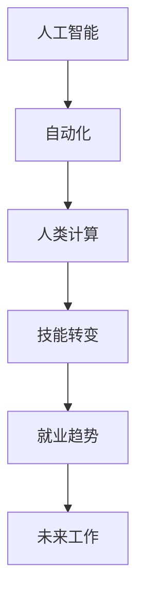

                 

# 人类计算：未来的工作和就业市场

> 关键词：人类计算，人工智能，工作市场，就业趋势，自动化，未来工作，技能转变

## 1. 背景介绍

### 1.1 问题由来
随着人工智能（AI）和自动化技术的发展，未来工作市场将面临巨大的变革。自动化机器人和智能系统正在逐步取代传统的劳动力，特别是那些低技能、重复性高的工作。这一趋势引发了全球范围内的广泛关注和讨论。对于未来的工作和就业市场，我们到底应该做何准备？本文将深入探讨人类计算的概念、影响以及未来发展趋势，以期为读者提供一些有价值的见解。

### 1.2 问题核心关键点
人类计算是指利用人工智能技术来替代人类进行复杂的计算任务，包括数据处理、分析、决策等。这一概念的提出源于对自动化和智能化技术的广泛应用，以及人类社会对智能化工作环境的追求。

### 1.3 问题研究意义
研究人类计算和其对未来工作市场的影响，对于政策制定者、教育机构、企业领导者以及所有职场人士都具有重要意义。理解和预测未来的工作市场趋势，可以帮助决策者制定相关政策，教育机构调整课程设置，企业领导者优化人力资源管理，职场人士提前准备，以应对未来工作环境的变化。

## 2. 核心概念与联系

### 2.1 核心概念概述

为更好地理解人类计算的概念及其对工作市场的影响，本节将介绍几个关键概念及其联系：

- 人工智能（AI）：指通过计算机程序实现的人类智能活动的模拟，包括机器学习、深度学习等技术。
- 自动化（Automation）：指利用机器或软件系统来自动执行原本由人类完成的任务。
- 人类计算（Human Computation）：指利用人工智能技术来辅助或替代人类进行计算任务，特别是在大数据、复杂系统分析和决策过程中。
- 技能转变（Skill Transition）：指因技术变革而导致的工作技能需求变化，包括新技能的学习和旧技能的淘汰。
- 就业趋势（Job Trends）：指未来工作市场中的发展方向和变化规律。
- 未来工作（Future Jobs）：指技术进步推动下的新型工作岗位。

这些概念之间的关系可以通过以下Mermaid流程图来展示：



这个流程图展示了核心概念之间的逻辑关系：

1. 人工智能和自动化技术为人类计算提供了技术基础。
2. 人类计算通过辅助或替代人类进行复杂计算，推动技能转变。
3. 技能转变导致就业市场的变化，形成新的就业趋势。
4. 未来的工作岗位将随着技术的发展而不断涌现和变化。

## 3. 核心算法原理 & 具体操作步骤
### 3.1 算法原理概述

人类计算的核心算法原理主要包括深度学习和强化学习。这些算法能够模拟人类进行复杂计算和决策的能力，通过大量的数据训练和优化，逐步提升计算精度和决策效果。

### 3.2 算法步骤详解

人类计算的实现步骤通常包括以下几个关键环节：

1. **数据准备**：收集和整理用于训练模型的数据，确保数据的多样性和代表性。
2. **模型训练**：使用深度学习和强化学习算法，训练模型进行复杂的计算和决策。
3. **验证和优化**：通过交叉验证和超参数调整，提高模型的准确性和泛化能力。
4. **部署和应用**：将训练好的模型部署到实际应用中，进行数据处理、分析、决策等任务。
5. **持续改进**：根据实际应用反馈，不断调整和优化模型，提升其性能。

### 3.3 算法优缺点

人类计算的优点包括：

- 能够处理大规模、高复杂度的计算任务，提高计算效率和准确性。
- 通过数据驱动的方式，能够不断学习和改进，提升决策能力。

但其缺点同样不可忽视：

- 需要大量数据和计算资源，初始投入成本高。
- 对数据质量和模型训练技巧要求高，易出现偏差。
- 在实际应用中，模型的解释性和透明性不足，难以理解和调试。

### 3.4 算法应用领域

人类计算的应用领域非常广泛，涵盖数据科学、金融、医疗、交通、教育等多个领域。以下是几个典型的应用案例：

- **金融行业**：通过深度学习算法，对海量交易数据进行分析和预测，提升投资决策的准确性。
- **医疗行业**：利用强化学习技术，辅助医生进行复杂诊断和治疗方案的制定。
- **交通管理**：通过智能算法优化交通流量，减少拥堵，提高道路通行效率。
- **教育领域**：通过数据驱动的方式，个性化推荐学习内容，提升教学效果。

## 4. 数学模型和公式 & 详细讲解  
### 4.1 数学模型构建

人类计算的数学模型构建主要基于深度学习和强化学习。以下以深度学习模型为例，介绍其基本框架。

### 4.2 公式推导过程

假设我们要训练一个用于图像识别的深度学习模型。模型的输入为 $x$，输出为 $y$。模型的损失函数为 $L$，优化算法为梯度下降（Gradient Descent）。模型的目标是最小化损失函数：

$$
\min_{\theta} L(\theta)
$$

其中 $\theta$ 为模型参数。梯度下降算法的更新公式为：

$$
\theta \leftarrow \theta - \eta \nabla_{\theta} L(\theta)
$$

其中 $\eta$ 为学习率。

### 4.3 案例分析与讲解

以图像识别为例，我们可以使用卷积神经网络（CNN）模型进行训练。CNN模型通过多层卷积和池化操作，提取出图像的特征，再通过全连接层进行分类。在训练过程中，我们使用交叉熵损失函数作为损失函数，通过反向传播算法计算梯度，并使用随机梯度下降（SGD）进行参数更新。最终，训练好的模型可以高效地进行图像分类任务。

## 5. 项目实践：代码实例和详细解释说明
### 5.1 开发环境搭建

在进行人类计算的实践前，我们需要准备好开发环境。以下是使用Python进行TensorFlow开发的环境配置流程：

1. 安装Anaconda：从官网下载并安装Anaconda，用于创建独立的Python环境。

2. 创建并激活虚拟环境：
```bash
conda create -n tf-env python=3.8 
conda activate tf-env
```

3. 安装TensorFlow：根据CUDA版本，从官网获取对应的安装命令。例如：
```bash
conda install tensorflow=2.7.0
```

4. 安装各类工具包：
```bash
pip install numpy pandas scikit-learn matplotlib tqdm jupyter notebook ipython
```

完成上述步骤后，即可在`tf-env`环境中开始实践。

### 5.2 源代码详细实现

下面我们以图像识别任务为例，给出使用TensorFlow进行深度学习模型训练的PyTorch代码实现。

首先，定义图像识别任务的数据处理函数：

```python
import tensorflow as tf
from tensorflow.keras.preprocessing.image import ImageDataGenerator
from tensorflow.keras.models import Sequential
from tensorflow.keras.layers import Conv2D, MaxPooling2D, Flatten, Dense

class ImageDataset(tf.keras.preprocessing.image.ImageDataGenerator):
    def __init__(self, train_dir, test_dir, batch_size=32, img_height=224, img_width=224):
        self.train_datagen = ImageDataGenerator(rescale=1./255)
        self.train_generator = self.train_datagen.flow_from_directory(
            train_dir,
            target_size=(img_height, img_width),
            batch_size=batch_size,
            class_mode='categorical')
        
        self.test_datagen = ImageDataGenerator(rescale=1./255)
        self.test_generator = self.test_datagen.flow_from_directory(
            test_dir,
            target_size=(img_height, img_width),
            batch_size=batch_size,
            class_mode='categorical')

# 数据处理参数
IMG_HEIGHT = 224
IMG_WIDTH = 224
BATCH_SIZE = 32

# 定义模型
model = Sequential([
    Conv2D(32, (3, 3), activation='relu', input_shape=(IMG_HEIGHT, IMG_WIDTH, 3)),
    MaxPooling2D((2, 2)),
    Conv2D(64, (3, 3), activation='relu'),
    MaxPooling2D((2, 2)),
    Conv2D(128, (3, 3), activation='relu'),
    MaxPooling2D((2, 2)),
    Flatten(),
    Dense(128, activation='relu'),
    Dense(2, activation='softmax')
])
```

然后，定义模型和优化器：

```python
from tensorflow.keras.optimizers import Adam

model.compile(optimizer=Adam(learning_rate=0.001), loss='categorical_crossentropy', metrics=['accuracy'])
```

接着，定义训练和评估函数：

```python
def train_epoch(model, train_generator, test_generator, epochs):
    history = model.fit(train_generator, epochs=epochs, validation_data=test_generator, verbose=0)
    return history.history['accuracy'], history.history['val_accuracy']

def evaluate(model, test_generator):
    test_loss, test_acc = model.evaluate(test_generator, verbose=0)
    return test_loss, test_acc
```

最后，启动训练流程并在测试集上评估：

```python
epochs = 10

history = train_epoch(model, train_generator, test_generator, epochs)
test_loss, test_acc = evaluate(model, test_generator)

print(f"Epochs: {epochs}, Test Loss: {test_loss:.4f}, Test Accuracy: {test_acc:.4f}")
```

以上就是使用TensorFlow进行图像识别任务深度学习模型训练的完整代码实现。可以看到，得益于TensorFlow的强大封装，我们可以用相对简洁的代码完成模型训练。

### 5.3 代码解读与分析

让我们再详细解读一下关键代码的实现细节：

**ImageDataset类**：
- `__init__`方法：初始化数据生成器，包括图像缩放、归一化等预处理步骤。
- `train_generator`和`test_generator`方法：根据指定目录生成训练和测试数据集。

**模型定义**：
- `Sequential`方法：使用TensorFlow的高级API，方便地构建卷积神经网络模型。
- `Conv2D`、`MaxPooling2D`、`Flatten`、`Dense`等层：构成卷积、池化、全连接等基本组件。

**模型编译**：
- `compile`方法：定义优化器、损失函数、评估指标等，完成模型训练的准备工作。

**训练和评估函数**：
- `train_epoch`函数：使用模型训练函数，定义训练轮数和验证集。
- `evaluate`函数：使用模型评估函数，计算测试集上的准确率。

**训练流程**：
- 定义总的训练轮数，启动训练过程。
- 在训练集上训练，输出每个epoch的训练和验证准确率。
- 在测试集上评估模型，输出最终测试准确率。

可以看到，TensorFlow提供了高效的API和工具，使得深度学习模型的实现变得简单高效。开发者可以将更多精力放在数据处理、模型改进等高层逻辑上，而不必过多关注底层的实现细节。

当然，工业级的系统实现还需考虑更多因素，如模型的保存和部署、超参数的自动搜索、更灵活的任务适配层等。但核心的模型训练流程基本与此类似。

## 6. 实际应用场景
### 6.1 智能制造

人工智能和自动化技术在智能制造领域的应用，正在改变传统的生产模式。通过数据驱动和智能决策，智能制造系统可以显著提升生产效率、降低成本、提高产品质量。

在技术实现上，智能制造系统可以利用机器学习技术，对生产数据进行实时监控和分析，预测设备故障，优化生产流程，提高资源利用率。此外，还可以利用图像识别技术，对产品进行自动检测和分类，提高生产线的自动化程度。

### 6.2 智能交通

智能交通系统利用人工智能技术，对交通数据进行实时分析和处理，优化交通流量，提高道路通行效率。通过智能算法，可以实现交通信号优化、事故预测、路径规划等功能。

在技术实现上，可以利用深度学习技术，对交通摄像头拍摄的图像进行分析和处理，识别车辆、行人、交通信号灯等目标，从而实现交通流量监控和预测。同时，利用强化学习技术，可以对交通信号进行优化，提高道路通行效率。

### 6.3 智能医疗

人工智能和自动化技术在医疗领域的应用，正在改变传统的医疗模式。通过智能辅助诊断和个性化治疗，智能医疗系统可以提高诊疗的准确性和效率。

在技术实现上，可以利用深度学习技术，对医疗影像进行分析和处理，辅助医生进行疾病诊断和治疗方案制定。同时，可以利用强化学习技术，对诊疗方案进行优化，提高治疗效果。

### 6.4 未来应用展望

人工智能和自动化技术的应用将进一步拓展到更多领域，为各行各业带来变革性影响。

在智慧城市治理中，智能交通、智能安防、智能能源等系统将提升城市的智能化水平，构建更安全、高效、舒适的生活环境。

在教育领域，智能推荐系统、智能作业批改系统等将提高教学质量和效率，实现因材施教。

在金融行业，智能投顾、智能风控等系统将提升金融服务的智能化水平，降低风险，提高收益。

此外，在零售、物流、农业、环境保护等多个领域，人工智能和自动化技术也将不断涌现，为人类生产生活带来更高效、便捷、环保的解决方案。相信随着技术的持续演进，人工智能将深入渗透到更多行业，推动社会的全面智能化转型。

## 7. 工具和资源推荐
### 7.1 学习资源推荐

为了帮助开发者系统掌握人工智能和自动化技术，这里推荐一些优质的学习资源：

1. 《深度学习》系列书籍：由多位知名专家合著，全面介绍了深度学习的基本概念和实现方法。
2. 《机器学习实战》系列书籍：通俗易懂地介绍了机器学习算法的实现细节和实际应用案例。
3. TensorFlow官方文档：提供了丰富的教程、API文档和示例代码，是学习TensorFlow的重要资源。
4. PyTorch官方文档：提供了大量的教程、API文档和示例代码，是学习PyTorch的重要资源。
5. Kaggle数据科学竞赛平台：提供了大量的数据集和实际应用案例，是练习和验证机器学习模型的平台。

通过对这些资源的学习实践，相信你一定能够快速掌握人工智能和自动化技术的精髓，并用于解决实际的NLP问题。

### 7.2 开发工具推荐

高效的开发离不开优秀的工具支持。以下是几款用于人工智能和自动化技术开发的常用工具：

1. TensorFlow：由Google主导开发的开源深度学习框架，生产部署方便，适合大规模工程应用。
2. PyTorch：基于Python的开源深度学习框架，灵活动态的计算图，适合快速迭代研究。
3. Weights & Biases：模型训练的实验跟踪工具，可以记录和可视化模型训练过程中的各项指标，方便对比和调优。
4. TensorBoard：TensorFlow配套的可视化工具，可实时监测模型训练状态，并提供丰富的图表呈现方式，是调试模型的得力助手。
5. Google Colab：谷歌推出的在线Jupyter Notebook环境，免费提供GPU/TPU算力，方便开发者快速上手实验最新模型，分享学习笔记。

合理利用这些工具，可以显著提升人工智能和自动化技术的开发效率，加快创新迭代的步伐。

### 7.3 相关论文推荐

人工智能和自动化技术的发展源于学界的持续研究。以下是几篇奠基性的相关论文，推荐阅读：

1. 《Deep Learning》一书：深度学习领域的经典之作，介绍了深度学习的基本概念和实现方法。
2. 《Machine Learning Yearning》一书：机器学习领域的入门之作，介绍了机器学习的实现细节和实际应用案例。
3. 《AlphaGo Zero》论文：展示了深度强化学习在复杂决策问题中的成功应用。
4. 《BERT: Pre-training of Deep Bidirectional Transformers for Language Understanding》论文：介绍了BERT模型的实现方法和应用效果。
5. 《ImageNet Classification with Deep Convolutional Neural Networks》论文：展示了卷积神经网络在图像识别任务中的成功应用。

这些论文代表了大语言模型微调技术的发展脉络。通过学习这些前沿成果，可以帮助研究者把握学科前进方向，激发更多的创新灵感。

## 8. 总结：未来发展趋势与挑战
### 8.1 总结

本文对人工智能和自动化技术在人类计算中的应用进行了全面系统的介绍。首先阐述了人类计算的概念及其对未来工作市场的影响，明确了人工智能和自动化技术对工作技能和就业市场的挑战。其次，从原理到实践，详细讲解了人工智能和自动化技术的算法原理和具体操作步骤，给出了实际应用中的代码实例。同时，本文还广泛探讨了人工智能和自动化技术在多个行业领域的应用前景，展示了其在提升生产效率、优化决策过程中的巨大潜力。此外，本文精选了人工智能和自动化技术的各类学习资源，力求为读者提供全方位的技术指引。

通过本文的系统梳理，可以看到，人工智能和自动化技术的应用已经渗透到各个行业，正在推动社会向智能化方向迈进。伴随技术的不断演进，人工智能和自动化技术必将进一步拓展应用范围，引领社会进入全新的智能化时代。

### 8.2 未来发展趋势

展望未来，人工智能和自动化技术的发展趋势包括：

1. 技术融合不断加深。随着AI和自动化技术的不断进步，跨领域的融合将成为新的发展方向。例如，人工智能和物联网的融合，将推动智能制造、智能交通等领域的发展。
2. 数据驱动成为主流。随着大数据技术的发展，数据驱动的决策将成为主流，推动各行各业的智能化转型。
3. 计算能力持续提升。随着计算资源和算力技术的不断提升，人工智能和自动化技术将实现更大规模的应用。
4. 人机协同将成为新的工作模式。人工智能和自动化技术将与人类协作，共同完成复杂任务，提升工作效率和质量。
5. 个性化服务成为趋势。利用人工智能技术，根据用户需求提供个性化服务，提升用户体验和满意度。

以上趋势凸显了人工智能和自动化技术的广阔前景。这些方向的探索发展，必将进一步提升人工智能和自动化技术的应用效果，为各行各业带来更大的创新和突破。

### 8.3 面临的挑战

尽管人工智能和自动化技术的发展前景广阔，但在迈向更加智能化、普适化应用的过程中，它仍面临着诸多挑战：

1. 数据质量和隐私问题。高质量、多样化的数据是AI技术的基础，但数据获取和隐私保护仍是难点。如何确保数据质量和隐私，是一个亟待解决的问题。
2. 模型鲁棒性和公平性。AI模型在实际应用中容易受到输入数据的影响，可能会出现偏见和歧视性。如何提高模型的鲁棒性和公平性，是一个重要的研究方向。
3. 技术可解释性和透明性。AI模型的决策过程复杂，难以解释和理解。如何提高模型的可解释性和透明性，是一个关键问题。
4. 资源限制和成本问题。AI技术的实现需要大量的计算资源和人力成本，如何降低成本，提升效率，是一个重要的挑战。
5. 技术标准和规范。AI技术的快速发展需要统一的技术标准和规范，以促进技术交流和应用。

这些挑战需要政府、企业、学界等多方协同合作，共同解决。只有在数据、模型、技术、标准等多个维度全面优化，才能更好地推动人工智能和自动化技术的落地应用。

### 8.4 研究展望

未来的人工智能和自动化技术研究将围绕以下几个方面进行：

1. 多模态融合。将视觉、语音、文本等多种模态的信息进行融合，提升AI模型的理解和推理能力。
2. 自监督学习和迁移学习。利用自监督学习技术，从无标注数据中提取有用的特征，提高模型的泛化能力。利用迁移学习技术，将模型知识在不同任务和领域中迁移应用，提高模型的迁移能力。
3. 模型可解释性和透明性。利用可解释性技术，提高模型的可解释性和透明性，帮助用户理解模型决策过程。
4. 持续学习和自适应。利用持续学习技术，让模型能够不断学习和适应新的数据和任务，提升模型的适应性。
5. 人机协同与智能化。利用人机协同技术，让AI系统更好地与人类协作，提升智能化水平。

这些研究方向的探索发展，必将引领人工智能和自动化技术的进步，为各行各业带来更深远的影响。只有在不断优化数据、算法、技术、标准等多个维度，才能更好地推动人工智能和自动化技术的落地应用，实现社会的全面智能化转型。

## 9. 附录：常见问题与解答

**Q1：人工智能和自动化技术对未来工作市场的影响是什么？**

A: 人工智能和自动化技术将替代大量的低技能、重复性高的工作，但对高技能、创新性强的岗位需求将增加。未来工作市场将面临技能转变和就业调整，需要相关人员提前进行技能提升和职业规划。

**Q2：如何选择适合的人工智能和自动化技术应用场景？**

A: 在选择人工智能和自动化技术应用场景时，需要考虑以下几个方面：
1. 数据获取和质量：确保数据的多样性和高质量，是AI技术的基础。
2. 业务需求和目标：明确业务需求和目标，选择适合的AI技术方案。
3. 技术成熟度和成本：评估技术的成熟度和实现成本，选择适合的技术方案。

**Q3：如何应对未来技术变革带来的技能转变和就业调整？**

A: 应对未来技术变革，需要从以下几个方面进行准备：
1. 持续学习和培训：参加相关的培训课程和认证考试，提升技能水平。
2. 跨领域学习和迁移：学习跨领域知识，提升跨领域的迁移能力。
3. 职业规划和转型：根据市场变化，进行职业规划和转型，寻找新的发展方向。

**Q4：未来人工智能和自动化技术的发展趋势是什么？**

A: 未来人工智能和自动化技术的发展趋势包括：
1. 技术融合不断加深：AI和自动化技术将与其他领域进行深度融合，推动各行各业的智能化转型。
2. 数据驱动成为主流：利用大数据技术，推动数据驱动的决策和智能化应用。
3. 计算能力持续提升：计算资源和算力技术的不断提升，将支持更大规模的AI应用。
4. 人机协同将成为新的工作模式：AI系统将与人类协作，共同完成复杂任务，提升工作效率和质量。
5. 个性化服务成为趋势：利用AI技术，提供个性化服务，提升用户体验和满意度。

这些趋势凸显了人工智能和自动化技术的广阔前景，需要政府、企业、学界等多方协同合作，共同推动技术发展。

---

作者：禅与计算机程序设计艺术 / Zen and the Art of Computer Programming

