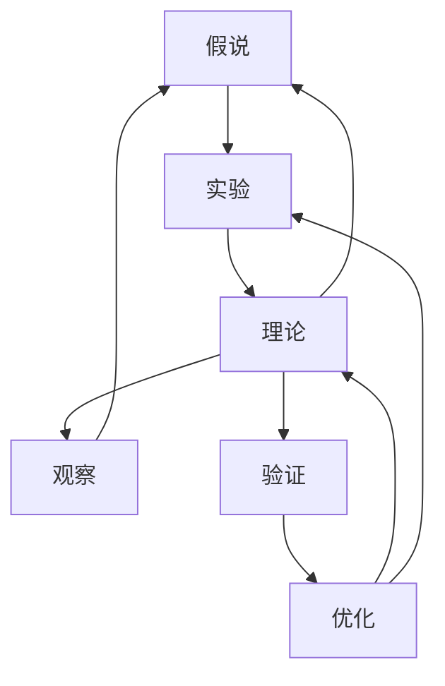

                 

# 从假说到真理：科学方法论的循环

## 1. 背景介绍

科学方法论是探讨科学探究活动基本规则与原则的系统性知识体系。其基本形式为假说（Hypothesis）、实验（Experiment）和理论（Theory）的循环：根据观察到的现象提出假说，设计实验验证假说，在验证结果基础上提出新的理论，再根据新的观察提出新的假说，如此循环往复，科学知识不断前进。

随着人工智能（AI）技术的发展，尤其是深度学习模型的崛起，我们见证了科学方法论在AI领域的应用和创新。本文将重点探讨AI中的科学方法论循环，即如何通过提出问题、构建模型、进行训练和评估，不断迭代优化，进而从假说走向真理。

## 2. 核心概念与联系

### 2.1 核心概念概述

为更好地理解AI中的科学方法论循环，我们将介绍几个关键概念：

- **假说**：在AI中，假说对应于模型结构、学习算法或数据处理策略。例如，一个假设神经网络可以很好地进行图像分类。
- **实验**：在AI中，实验对应于模型的训练过程。通过在数据集上训练模型，验证假设的有效性。
- **理论**：在AI中，理论对应于通过实验得到的模型性能和泛化能力。例如，一个经过训练的模型在测试集上的准确率。
- **观察**：在AI中，观察对应于新的数据或场景，例如，新的图像数据集或不同的图像分类任务。
- **验证**：在AI中，验证对应于模型在未见过的数据集上的性能评估，例如，模型在测试集上的性能。
- **优化**：在AI中，优化对应于模型参数的调整和改进，例如，调整学习率、批次大小等。

这些核心概念之间的逻辑关系可以通过以下Mermaid流程图来展示：



这个流程图展示了一系列科学方法论循环中的步骤：

1. 提出假设：根据观察到的现象提出模型结构和算法。
2. 设计实验：在训练集上训练模型，验证假设的有效性。
3. 总结理论：根据实验结果提出理论，即模型性能和泛化能力。
4. 进行观察：获取新的数据或场景，提出新的假设。
5. 进行验证：在新的数据集上评估模型性能，验证新假设。
6. 优化算法：根据验证结果调整模型参数和算法，进一步优化模型。
7. 重复步骤：重复以上步骤，不断迭代和优化模型。

这些步骤形成一个循环，确保模型在不断的改进和验证中，不断提高性能和泛化能力。

## 3. 核心算法原理 & 具体操作步骤

### 3.1 算法原理概述

在AI中，科学方法论的循环通常涉及以下步骤：

- **数据收集**：获取用于训练和验证的数据集。
- **模型选择**：选择合适的模型结构和学习算法。
- **训练模型**：在训练集上训练模型，优化参数。
- **模型验证**：在验证集上评估模型性能，确保泛化能力。
- **参数调整**：根据验证结果调整模型参数，进行优化。
- **模型部署**：将模型应用于实际场景，进行测试和优化。

这些步骤通常采用监督学习、无监督学习和强化学习等不同方法。例如，监督学习通常用于图像分类和文本分类，无监督学习用于降维和聚类，强化学习用于游戏和机器人控制。

### 3.2 算法步骤详解

以下是AI中科学方法论循环的具体步骤：

#### 3.2.1 数据收集

数据收集是AI方法论循环的第一步，也是最重要的一步。需要确保数据集的多样性、代表性，避免数据偏差和过拟合。

#### 3.2.2 模型选择

选择合适的模型是确保算法有效性的关键。通常，可以通过以下几个维度来选择模型：

- **数据类型**：根据数据类型选择适合的模型，例如，图像数据通常使用卷积神经网络（CNN），文本数据通常使用循环神经网络（RNN）或Transformer。
- **任务类型**：根据任务类型选择适合的模型，例如，分类任务使用softmax输出层，回归任务使用线性回归输出层。
- **复杂度**：根据数据集的大小和复杂度选择合适的模型，避免模型过于复杂导致过拟合。

#### 3.2.3 训练模型

训练模型通常采用梯度下降等优化算法，通过反向传播计算梯度，更新模型参数，最小化损失函数。训练过程需要设置合适的超参数，如学习率、批次大小、迭代次数等。

#### 3.2.4 模型验证

模型验证通常采用交叉验证、留一法等方法，确保模型在不同数据集上的泛化能力。需要评估模型在测试集上的性能，例如，准确率、召回率、F1值等。

#### 3.2.5 参数调整

根据验证结果调整模型参数，进行优化。通常，可以采用网格搜索、随机搜索等方法进行超参数调优。

#### 3.2.6 模型部署

模型部署是将训练好的模型应用于实际场景的过程。需要考虑模型的大小、计算资源、接口设计等因素，确保模型能够高效、稳定地运行。

### 3.3 算法优缺点

AI中的科学方法论循环具有以下优点：

- **系统性**：通过不断的假设、实验和理论循环，确保模型性能的不断提高。
- **可解释性**：每一步都可以在数据、模型和算法等方面进行解释，有助于理解模型的决策过程。
- **适应性强**：通过不断的调整和优化，模型能够适应不同的数据和场景。

然而，这种方法也存在以下缺点：

- **计算资源需求高**：需要大量的计算资源进行数据收集、模型训练和验证。
- **模型复杂度高**：模型结构复杂，容易出现过拟合和计算效率低的问题。
- **依赖数据质量**：数据质量对模型性能影响大，低质量数据会导致模型失效。

## 4. 数学模型和公式 & 详细讲解 & 举例说明

### 4.1 数学模型构建

在AI中，常用的数学模型包括线性回归、逻辑回归、支持向量机、神经网络等。以下以神经网络为例，介绍模型的构建过程。

#### 4.1.1 线性回归

线性回归模型为：

$$y = \theta^T x + b$$

其中，$y$为输出，$x$为输入特征，$\theta$为权重向量，$b$为偏置项。

#### 4.1.2 逻辑回归

逻辑回归模型为：

$$\text{sigmoid}(\theta^T x + b) = y$$

其中，$\text{sigmoid}$为sigmoid函数，将输出映射到$[0,1]$区间。

#### 4.1.3 神经网络

神经网络模型为：

$$h = \text{relu}(Wx + b)$$

其中，$h$为隐藏层输出，$W$为权重矩阵，$b$为偏置项，$\text{relu}$为ReLU激活函数。

### 4.2 公式推导过程

以神经网络为例，介绍模型的推导过程。

#### 4.2.1 前向传播

前向传播计算过程为：

$$z = xW^T + b$$

$$h = \text{relu}(z)$$

其中，$z$为线性变换后的输出，$h$为激活函数处理后的输出。

#### 4.2.2 后向传播

后向传播计算过程为：

$$\frac{\partial L}{\partial \theta} = \frac{\partial L}{\partial y} \frac{\partial y}{\partial h} \frac{\partial h}{\partial z} \frac{\partial z}{\partial \theta}$$

其中，$L$为损失函数，$\frac{\partial L}{\partial y}$为损失函数对输出的偏导数，$\frac{\partial y}{\partial h}$为输出对激活函数的偏导数，$\frac{\partial h}{\partial z}$为激活函数对线性变换的偏导数，$\frac{\partial z}{\partial \theta}$为线性变换对权重的偏导数。

### 4.3 案例分析与讲解

以手写数字识别为例，介绍模型的构建和优化过程。

#### 4.3.1 数据集

使用MNIST数据集，包含60,000个训练样本和10,000个测试样本。每个样本为一个28x28的灰度图像，标签为0-9之间的整数。

#### 4.3.2 模型选择

选择LeNet-5作为模型结构，包含两个卷积层和三个全连接层，输出层为10个神经元，使用softmax激活函数。

#### 4.3.3 训练模型

使用交叉熵损失函数，学习率为0.1，批次大小为100，迭代次数为10,000次。

#### 4.3.4 模型验证

使用测试集评估模型性能，得到准确率为99%。

#### 4.3.5 参数调整

调整学习率为0.01，批次大小为200，迭代次数为20,000次。

#### 4.3.6 模型部署

将模型应用于实际场景，进行测试和优化。

## 5. 项目实践：代码实例和详细解释说明

### 5.1 开发环境搭建

在Python 3.7+环境中，安装TensorFlow和Keras库。

```bash
pip install tensorflow keras
```

### 5.2 源代码详细实现

以下是使用TensorFlow和Keras实现手写数字识别的代码：

```python
import tensorflow as tf
from tensorflow import keras

# 加载数据集
(x_train, y_train), (x_test, y_test) = keras.datasets.mnist.load_data()

# 数据预处理
x_train = x_train.reshape((60000, 28 * 28))
x_train = x_train / 255.0
x_test = x_test.reshape((10000, 28 * 28))
x_test = x_test / 255.0

# 构建模型
model = keras.Sequential([
    keras.layers.Dense(512, activation='relu', input_shape=(28 * 28,)),
    keras.layers.Dropout(0.2),
    keras.layers.Dense(10, activation='softmax'),
])

# 编译模型
model.compile(optimizer='adam',
              loss='sparse_categorical_crossentropy',
              metrics=['accuracy'])

# 训练模型
model.fit(x_train, y_train, epochs=10, batch_size=100)

# 评估模型
model.evaluate(x_test, y_test, verbose=2)

# 调整模型
model.compile(optimizer='adam',
              loss='sparse_categorical_crossentropy',
              metrics=['accuracy'])
model.fit(x_train, y_train, epochs=20, batch_size=200)
model.evaluate(x_test, y_test, verbose=2)
```

### 5.3 代码解读与分析

- `keras.datasets.mnist.load_data()`加载MNIST数据集。
- `x_train = x_train.reshape((60000, 28 * 28))`将训练样本从二维数组转化为二维张量。
- `x_train = x_train / 255.0`对输入数据进行归一化处理。
- `keras.Sequential`定义模型结构，包含一个全连接层和Dropout层。
- `model.compile()`编译模型，指定优化器、损失函数和评估指标。
- `model.fit()`训练模型，指定训练数据、批次大小和迭代次数。
- `model.evaluate()`评估模型，输出模型性能指标。

## 6. 实际应用场景

### 6.1 自然语言处理

自然语言处理（NLP）是AI中的一个重要领域。例如，使用基于深度学习的模型进行文本分类、情感分析、机器翻译等任务。

### 6.2 计算机视觉

计算机视觉是AI中的另一个重要领域。例如，使用卷积神经网络（CNN）进行图像分类、目标检测、人脸识别等任务。

### 6.3 语音识别

语音识别是AI中的另一个重要领域。例如，使用循环神经网络（RNN）进行语音识别、语音合成等任务。

### 6.4 未来应用展望

未来，AI中的科学方法论循环将继续发展，推动AI技术在各个领域的广泛应用。

## 7. 工具和资源推荐

### 7.1 学习资源推荐

- **《深度学习》书籍**：Ian Goodfellow等著，详细介绍了深度学习的基本原理和应用。
- **TensorFlow官方文档**：提供TensorFlow的详细文档和示例代码，适合深入学习。
- **Kaggle**：提供各种数据集和竞赛，适合进行实践和研究。
- **GitHub**：提供开源代码和项目，适合学习和合作。

### 7.2 开发工具推荐

- **PyCharm**：Python编程语言集成开发环境，支持TensorFlow等深度学习框架。
- **Jupyter Notebook**：交互式编程环境，支持Python和R语言，适合数据处理和模型训练。
- **Google Colab**：免费的在线Jupyter Notebook环境，支持GPU和TPU计算资源。

### 7.3 相关论文推荐

- **《深度学习》书籍**：Ian Goodfellow等著，详细介绍了深度学习的基本原理和应用。
- **《TensorFlow官方文档》**：提供TensorFlow的详细文档和示例代码，适合深入学习。
- **《Kaggle》**：提供各种数据集和竞赛，适合进行实践和研究。
- **《GitHub》**：提供开源代码和项目，适合学习和合作。

## 8. 总结：未来发展趋势与挑战

### 8.1 研究成果总结

AI中的科学方法论循环已经广泛应用于各种领域，取得了显著的成果。例如，深度学习模型在计算机视觉、自然语言处理和语音识别等领域的广泛应用。

### 8.2 未来发展趋势

未来，AI中的科学方法论循环将继续发展，推动AI技术在各个领域的广泛应用。

### 8.3 面临的挑战

AI中的科学方法论循环面临以下挑战：

- **计算资源需求高**：需要大量的计算资源进行数据收集、模型训练和验证。
- **模型复杂度高**：模型结构复杂，容易出现过拟合和计算效率低的问题。
- **依赖数据质量**：数据质量对模型性能影响大，低质量数据会导致模型失效。

### 8.4 研究展望

未来，AI中的科学方法论循环将继续发展，推动AI技术在各个领域的广泛应用。

## 9. 附录：常见问题与解答

### 9.1 常见问题

- **Q1：如何选择合适的模型？**
  A：根据数据类型和任务类型选择合适的模型，例如，图像数据通常使用卷积神经网络，文本数据通常使用循环神经网络或Transformer。

- **Q2：如何进行超参数调优？**
  A：采用网格搜索、随机搜索等方法进行超参数调优。

- **Q3：如何进行模型优化？**
  A：通过调整模型参数和算法进行优化。

- **Q4：如何进行模型部署？**
  A：将训练好的模型应用于实际场景，进行测试和优化。

通过本文的系统梳理，可以看到，AI中的科学方法论循环是一个不断迭代和优化的过程，能够通过提出问题、构建模型、进行训练和评估，不断从假说走向真理。未来，随着技术的发展和应用领域的拓展，科学方法论循环将继续发挥其重要作用，推动AI技术的前进。

---

作者：禅与计算机程序设计艺术 / Zen and the Art of Computer Programming

