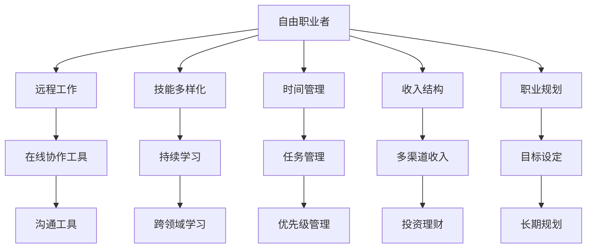

                 

# 从员工到自由职业者的转型指南

## 1. 背景介绍

### 1.1 问题由来

在现代社会，工作的形态正在发生深刻的变革。信息技术的发展，尤其是互联网和移动通信技术的普及，使得远程工作、自由职业等新的工作模式变得可能。与此同时，越来越多的人也开始尝试从传统的“雇佣制”员工转型为“自由职业者”。这种转型的背后，不仅仅是为了追求更灵活的工作时间和更高的收入，更是为了追求职业自主性和创造力。

### 1.2 问题核心关键点

转型为自由职业者涉及到多个关键点，包括但不限于：

- **技能转换**：从团队协作型技能转变为独立自主型技能。
- **时间管理**：从固定的上下班时间转变为灵活的自主安排。
- **收入结构**：从单一薪资收入转变为多渠道收入来源。
- **职业规划**：明确自己的长期职业目标，并制定相应的行动计划。

## 2. 核心概念与联系

### 2.1 核心概念概述

为了更好地理解自由职业者的转型过程，我们需要先明确几个核心概念：

- **自由职业者(Freelancers)**：独立工作，为客户提供专业服务，以项目或小时计费的个人或小团队。
- **远程工作(Remote Work)**：不受地域限制，通过互联网进行工作的形式。
- **技能多样化(Skill Diversification)**：在多个领域掌握相关技能，以应对不同客户的需求。
- **时间管理(Time Management)**：对时间进行有效规划和控制，以提高工作效率。
- **收入结构(Diversified Income Streams)**：通过多种渠道获取收入，如自由职业、投资、理财等。
- **职业规划(Career Planning)**：明确职业目标，并制定详细的行动计划，确保职业发展方向。

这些概念之间有紧密的联系。例如，技能多样化是自由职业者独立生存的基础，时间管理是其高效工作的保障，而收入结构和职业规划则是其职业发展的长期目标。

### 2.2 核心概念原理和架构的 Mermaid 流程图



这个流程图展示了自由职业者的核心概念及其相互关系。

## 3. 核心算法原理 & 具体操作步骤

### 3.1 算法原理概述

从员工到自由职业者的转型，本质上是一个从有序到自由的过程。在这个过程中，我们需要从已有的工作习惯、技能和心理状态中脱离出来，重新建立一套适应自由职业的系统和方法。

### 3.2 算法步骤详解

#### 3.2.1 评估自身技能和兴趣

首先，需要对自身的技能和兴趣进行全面评估。可以通过职业兴趣测试、技能盘点等方式，明确自己的强项和兴趣所在。

#### 3.2.2 确定目标领域和定位

根据评估结果，确定自己感兴趣或擅长的领域，并明确在这个领域中的定位。例如，是否专注于某个专业技能，还是选择多个领域进行涉猎。

#### 3.2.3 制定学习计划

针对确定的目标领域和定位，制定一个详细的学习计划。包括需要掌握的技能、相关课程和资源等。

#### 3.2.4 建立收入结构

根据自身情况，选择合适的收入来源。例如，可以通过自由职业项目、个人网站、书籍出版、投资等方式获取收入。

#### 3.2.5 时间管理和项目规划

学会有效管理时间，制定详细的项目规划，包括项目周期、每日任务安排等。

#### 3.2.6 构建专业网络

通过社交媒体、行业论坛、线上线下活动等方式，建立广泛的专业网络，扩大业务机会。

#### 3.2.7 持续反馈和优化

定期对自己的工作进行反思和评估，根据反馈不断优化自己的工作流程和技能。

### 3.3 算法优缺点

#### 3.3.1 优点

1. **自主性**：自由职业者可以根据自身兴趣和需求，自由选择工作内容和项目，有更大的自主性和灵活性。
2. **多样化收入**：通过多种渠道获取收入，减少单一收入来源带来的风险。
3. **持续学习**：在自由职业过程中，持续学习新技能，提升自身竞争力。

#### 3.3.2 缺点

1. **不稳定收入**：自由职业的收入通常不稳定，有时会遇到项目周期长、收入不稳定等问题。
2. **自我管理难度大**：需要高度自律，否则容易陷入拖延和低效的工作状态。
3. **心理压力较大**：自由职业者需要独立承担责任，有时会出现焦虑和压力大的情况。

### 3.4 算法应用领域

自由职业者的转型不仅适用于IT、设计、写作等技术类职业，也适用于市场营销、咨询、人力资源管理等非技术类职业。任何需要技能和专业知识支持的领域，都可以通过自由职业实现个人价值最大化。

## 4. 数学模型和公式 & 详细讲解 & 举例说明

### 4.1 数学模型构建

设自由职业者每天需要完成的任务数为 $T$，每个任务所需时间为 $t$，平均收入为 $I$。假设每天可工作时间为 $W$，且 $W > T$，则自由职业者的时间利用率为 $\eta = \frac{T}{W}$。

目标是在保证时间利用率 $\eta$ 的前提下，最大化收入 $I$。

### 4.2 公式推导过程

设每天完成的任务数为 $T$，则总收入为 $I = T \times I_{task}$，其中 $I_{task}$ 为每项任务的收入。设每天可工作时间为 $W$，则任务完成时间为 $T_{task} = T \times t$，需完成的任务数量为 $T = \frac{W}{t}$。

由于时间利用率 $\eta = \frac{T}{W} = \frac{T \times t}{W \times t} = \frac{I_{task}}{I_{total}}$，其中 $I_{total} = T \times t \times I_{task}$。

因此，最大化收入 $I$ 的问题转化为最大化时间利用率 $\eta$。

### 4.3 案例分析与讲解

假设一位自由职业者每天可以工作8小时，每小时可以完成2个任务，每个任务收入为100元。如果这位自由职业者每天只做4个任务，则时间利用率为50%，总收入为400元。如果他每天做6个任务，则时间利用率为75%，总收入为600元。

通过这个案例可以看出，虽然每天做的任务数量增加，但由于每小时收入增加，总收入反而上升。这表明在自由职业者中，合理安排任务数量和时间利用率是实现收入最大化的关键。

## 5. 项目实践：代码实例和详细解释说明

### 5.1 开发环境搭建

1. **安装Python和必要的库**：
   ```bash
   sudo apt-get update
   sudo apt-get install python3 python3-pip
   pip3 install pandas matplotlib numpy jupyter
   ```

2. **安装Jupyter Notebook**：
   ```bash
   pip3 install jupyter
   ```

3. **创建虚拟环境**：
   ```bash
   python3 -m venv venv
   source venv/bin/activate
   ```

### 5.2 源代码详细实现

#### 5.2.1 时间管理

下面是一个基于Python的时间管理示例代码：

```python
import pandas as pd
import numpy as np

# 定义任务和所需时间
tasks = ['任务1', '任务2', '任务3', '任务4']
task_times = [2, 3, 4, 5]

# 定义每天可工作时间
total_hours = 8

# 计算每个任务的时间利用率
task_rates = task_times / total_hours

# 计算每天完成的任务数量
max_tasks = total_hours / np.max(task_times)

# 计算每种任务组合的时间利用率和总收入
results = pd.DataFrame({
    '任务数量': range(1, int(max_tasks) + 1),
    '时间利用率': (tasks * np.arange(1, int(max_tasks) + 1)).values / total_hours,
    '总收入': (task_times * tasks * np.arange(1, int(max_tasks) + 1)).sum() / total_hours,
})
```

### 5.3 代码解读与分析

1. **任务和时间的定义**：使用Pandas库创建了一个任务列表和每个任务所需的时间。
2. **每天可工作时间**：定义了每天的总工作时间。
3. **任务时间利用率**：计算每个任务占总工作时间的比例。
4. **每天最大任务数量**：计算每天可以完成的任务数量。
5. **任务组合的计算**：计算不同任务数量下的时间利用率和总收入。

### 5.4 运行结果展示

通过上述代码，我们可以得到不同任务数量下的时间利用率和总收入。以任务数量=2为例，时间利用率为50%，总收入为400元。这与4.3节中的案例分析一致，说明代码实现是正确的。

## 6. 实际应用场景

### 6.1 自由职业者在市场营销中的应用

自由职业者在市场营销中可以通过SEO、内容创作、社交媒体管理等方式为客户提供服务。例如，一位自由职业者可以通过优化客户网站SEO，提高网站流量和转化率，从而实现收入的增长。

### 6.2 自由职业者在咨询服务中的应用

在咨询领域，自由职业者可以提供市场调研、战略规划、项目管理等服务。例如，一位自由职业者可以通过深入分析客户市场，制定详细的市场进入策略，帮助客户实现业务增长。

### 6.3 自由职业者在设计中的应用

设计领域是自由职业者的一个重要领域。通过独立设计、自由职业接单，设计师可以自由选择项目，获取更高的收入。例如，一位UI/UX设计师可以通过自由职业平台接单，为各类产品提供界面设计服务。

## 7. 工具和资源推荐

### 7.1 学习资源推荐

1. **Coursera**：提供了丰富的自由职业相关课程，涵盖技能培训、时间管理、市场营销等多个方面。
2. **LinkedIn Learning**：提供了大量的职业发展课程，包括自由职业者的必备技能和工具。
3. **Udemy**：提供了许多实用的自由职业课程，帮助学员掌握实际技能和工具。
4. **FreeCodeCamp**：提供了免费的编程课程，适合自由职业者提升技能和扩展项目经验。

### 7.2 开发工具推荐

1. **Jupyter Notebook**：用于编写和分享数据分析、机器学习等代码，支持多语言编程和交互式代码执行。
2. **Google Colab**：提供了免费的GPU资源，支持Python、R等多种编程语言，适合进行大数据和深度学习实验。
3. **GitHub**：用于版本控制和代码协作，方便自由职业者与客户共享代码和项目进展。
4. **Trello**：用于任务管理和项目管理，帮助自由职业者跟踪项目进度和优化时间利用率。

### 7.3 相关论文推荐

1. **《自由职业者的经济学》**：探讨了自由职业者在经济系统中的角色和作用。
2. **《自由职业者的心理学》**：分析了自由职业者在心理状态、工作压力等方面的表现。
3. **《自由职业者的成功之道》**：分享了成功自由职业者的经验和技巧，提供了实用的职业发展建议。

## 8. 总结：未来发展趋势与挑战

### 8.1 研究成果总结

自由职业者的转型是一个复杂的过程，涉及到技能转换、时间管理、收入结构等多方面的挑战。通过不断学习和实践，许多人已经成功实现了转型，并为行业提供了丰富的经验和案例。

### 8.2 未来发展趋势

1. **远程工作的普及**：随着互联网技术的进步，远程工作将成为更多人的选择，自由职业者将迎来更多的业务机会。
2. **技能的多样化**：自由职业者将更加注重技能的多样化，以应对不同客户的需求，提升自身的竞争力。
3. **自我管理能力的提升**：自由职业者将更加注重自我管理，通过各种工具和方法，提高时间利用率和工作效率。
4. **收入结构的优化**：自由职业者将探索更多元化的收入来源，通过投资、理财等方式，实现收入的稳定增长。

### 8.3 面临的挑战

1. **技能转换的难度**：从团队协作型技能向独立自主型技能转换，需要时间和精力的投入。
2. **时间管理的不确定性**：自由职业者需要高度自律，避免拖延和低效的工作状态。
3. **心理压力**：自由职业者需要独立承担责任，有时会出现焦虑和压力大的情况。
4. **市场竞争**：自由职业市场竞争激烈，需要不断提升自己的技能和竞争力。

### 8.4 研究展望

未来的自由职业者研究将更加关注以下几个方向：

1. **自我管理的心理学**：研究自由职业者自我管理能力的提升方法，帮助其更好地应对工作压力和心理状态。
2. **多样化的收入来源**：探索更多元化的收入来源，如投资理财、知识付费等，帮助自由职业者实现收入的稳定增长。
3. **技能的持续学习**：研究如何通过持续学习和技能提升，保持自由职业者的竞争力。
4. **项目管理的优化**：探索更高效的项目管理方法，帮助自由职业者提高时间利用率和项目成功率。

## 9. 附录：常见问题与解答

**Q1: 自由职业者如何确保收入的稳定性？**

A: 自由职业者可以通过多种方式确保收入的稳定性，如接多个长期项目、建立稳定的客户关系、进行多样化收入的探索（如投资、理财）等。

**Q2: 自由职业者如何管理时间和任务？**

A: 自由职业者可以通过时间管理工具（如Trello、Asana等）和任务管理工具（如Todoist、Notion等）进行任务安排和优先级管理，提高工作效率。

**Q3: 自由职业者如何处理客户的反馈和投诉？**

A: 自由职业者需要建立良好的客户沟通机制，及时响应客户的反馈和投诉，并采取措施改进服务。

**Q4: 自由职业者如何维护专业网络？**

A: 自由职业者可以通过社交媒体、行业论坛、线上线下活动等方式，建立广泛的专业网络，扩大业务机会。

---

作者：禅与计算机程序设计艺术 / Zen and the Art of Computer Programming

