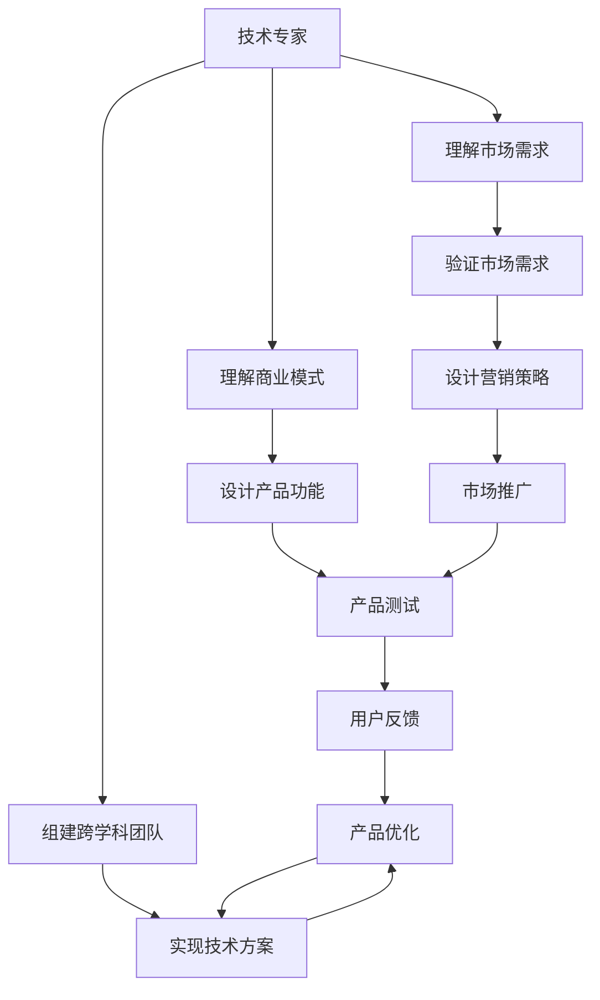

                 

## 1. 背景介绍

### 1.1 问题由来
随着人工智能(AI)技术的快速发展，越来越多的技术专家转型成为企业家，以将他们的技术转化为商业价值。这个转变不仅需要技术知识，还需要对商业运作、市场营销、团队管理等方面的深刻理解。本文将从技术专家转型为企业家这一话题出发，探讨其中的核心概念、关键步骤和常见挑战。

### 1.2 问题核心关键点
技术专家转型为企业家，其核心挑战在于如何从技术视角转向商业视角，同时保持对技术的敏感度。关键点包括：
- 技术理解：理解并保持对核心技术的深入理解。
- 商业理解：理解市场需求、客户痛点、商业模式等。
- 团队管理：组建和领导高效的跨学科团队。
- 创新能力：不断探索和应用新技术。
- 市场验证：验证技术方案的市场需求和可行性。

### 1.3 问题研究意义
对于技术专家而言，转型为企业家不仅能够将自身技术转化为商业价值，还能够为社会带来更多创新和改善。研究技术专家转型的方法和策略，对于推动技术创新、促进产业升级、加速社会变革具有重要意义。

## 2. 核心概念与联系

### 2.1 核心概念概述

为更好地理解技术专家转型为企业家这一过程，本文将介绍几个核心概念：

- 技术专家(Technical Expert)：具有深厚技术背景和专业技能，擅长解决技术问题的人。
- 企业家(Entrepreneur)：拥有商业洞察力，能够识别市场需求，创建和运营商业项目，并能够领导团队的人。
- 技术创业(Technology Startup)：以技术为核心，通过创新解决实际问题，创造商业价值的创业形式。
- 商业画布(Business Canvas)：一种用于可视化商业模式的模型，帮助创业者明确商业模式的核心元素。
- 产品-市场契合(Product-Market Fit)：技术产品与市场需求相匹配的状态。
- 用户体验(User Experience)：用户在使用产品或服务时的体验，对产品成功至关重要。

这些概念之间的逻辑关系可以通过以下Mermaid流程图来展示：



这个流程图展示了一系列技术专家转型为企业家过程中需要考虑的核心步骤：

1. 技术专家需要理解市场需求和商业模式。
2. 组建跨学科团队，实现技术方案。
3. 设计产品功能并实现技术方案。
4. 验证市场需求和设计营销策略。
5. 进行产品测试和市场推广，收集用户反馈并进行产品优化。

## 3. 核心算法原理 & 具体操作步骤

### 3.1 算法原理概述

技术专家转型为企业家，本质上是一个从技术视角向商业视角的转变过程。其核心思想是：利用技术优势解决市场需求，同时构建商业模型，将技术转化为商业价值。

形式化地，假设技术专家具有技术优势 $T$，市场需求为 $D$，商业模型为 $M$，则转型过程的目标是找到最优商业模型 $M^*$，使得：

$$
M^* = \mathop{\arg\min}_{M} \|T - M \cdot D\|
$$

其中 $\| \cdot \|$ 表示距离度量，即技术优势与市场需求和商业模型匹配程度的量化。

### 3.2 算法步骤详解

技术专家转型为企业家的一般步骤如下：

**Step 1: 理解市场需求**
- 进行市场调研，了解目标用户需求和痛点。
- 分析竞争对手，找到市场空白和机会。
- 使用商业画布模型，明确商业模式的核心元素。

**Step 2: 组建跨学科团队**
- 根据项目需求，招募具有不同技能背景的团队成员，如产品设计、市场营销、软件开发等。
- 建立高效的团队沟通机制，促进跨学科协作。

**Step 3: 设计产品功能和商业模式**
- 根据市场需求和团队技术能力，设计产品的核心功能和商业模式。
- 确定产品的技术架构和实施路线。

**Step 4: 实现技术方案**
- 开发和测试产品原型，确保技术实现符合设计要求。
- 进行性能优化和可扩展性提升。

**Step 5: 验证市场需求和设计营销策略**
- 通过MVP（最小可行产品）进行市场验证，收集用户反馈。
- 设计并实施营销策略，推广产品。

**Step 6: 产品测试和市场推广**
- 进行A/B测试，优化产品功能和用户体验。
- 开展市场推广活动，吸引用户。

**Step 7: 收集用户反馈和产品优化**
- 通过用户反馈持续优化产品。
- 进行产品迭代，满足市场不断变化的需求。

### 3.3 算法优缺点

技术专家转型为企业家的方法具有以下优点：
1. 利用技术优势，快速进入市场。
2. 跨学科团队合作，提高创新能力。
3. 产品迭代迅速，适应市场需求变化。

同时，该方法也存在一定的局限性：
1. 转型过程需要时间，初期的市场验证和产品优化需要耐心。
2. 跨学科合作可能面临沟通难题。
3. 市场验证结果可能不如预期，需要及时调整策略。
4. 需要平衡技术创新和商业实际，避免过度关注技术细节而忽略市场。

尽管存在这些局限性，但就目前而言，技术专家转型为企业家的方法是最主流和可行的。未来相关研究的重点在于如何进一步优化跨学科协作，提升市场验证的准确性，同时兼顾技术创新和商业实际的平衡。

### 3.4 算法应用领域

技术专家转型为企业家的方法在多个领域得到了应用，例如：

- 科技初创公司：如Google、Facebook等，通过技术创新解决实际问题，创造商业价值。
- 企业技术转型：如传统制造企业引入人工智能技术，提升生产效率和管理水平。
- 开源项目孵化：如Apache基金会，通过开源社区推动技术创新和应用落地。
- 科技创业孵化器：如Y Combinator，提供资源和指导，帮助创业者实现商业化。

## 4. 数学模型和公式 & 详细讲解 & 举例说明

### 4.1 数学模型构建

本节将使用数学语言对技术专家转型为企业家这一过程进行更加严格的刻画。

记技术专家具有的技术优势为 $T$，市场需求为 $D$，商业模型为 $M$，则转型过程的目标是找到最优商业模型 $M^*$，使得：

$$
M^* = \mathop{\arg\min}_{M} \|T - M \cdot D\|
$$

在实践中，我们通常使用目标函数和约束条件来描述这一优化问题。例如，对于产品-市场契合度，可以定义目标函数为：

$$
F(D, M) = \|T - M \cdot D\|^2
$$

其中 $\|\cdot\|^2$ 表示距离的平方，即技术优势与市场需求和商业模型匹配程度的平方。

### 4.2 公式推导过程

以下我们以一个简单的产品-市场契合度计算为例，推导目标函数的具体形式。

假设市场需求为 $D = (D_1, D_2, ..., D_n)$，商业模型为 $M = (M_1, M_2, ..., M_n)$，其中 $M_i$ 表示产品对市场需求 $D_i$ 的响应程度。则产品-市场契合度的目标函数可以表示为：

$$
F(D, M) = \sum_{i=1}^{n} (T_i - M_i \cdot D_i)^2
$$

其中 $T_i$ 表示技术专家对市场需求 $D_i$ 的预测或评估值。

将上述目标函数最小化，得到最优商业模型 $M^*$：

$$
M^* = \mathop{\arg\min}_{M} F(D, M)
$$

通过求解这一优化问题，可以得到最优的商业模型 $M^*$，从而将技术优势 $T$ 转化为实际的市场需求 $D$。

### 4.3 案例分析与讲解

**案例1：人工智能辅助医疗**
- 市场需求：患者对于精准医疗的需求。
- 技术优势：人工智能在数据分析、疾病预测等方面的能力。
- 商业模型：开发和销售人工智能医疗平台，提供个性化医疗方案。

通过市场调研，技术专家识别出患者对精准医疗的需求，并使用商业画布模型，明确了商业模式的核心元素。随后，组建跨学科团队，设计产品功能和商业模式，开发并测试了AI医疗平台。在市场验证过程中，通过收集用户反馈，不断优化产品功能。最终，成功将AI医疗平台推广到市场，为患者提供了精准医疗方案，实现了技术到商业的转型。

**案例2：智能家居系统**
- 市场需求：用户对于智能家居的控制需求。
- 技术优势：物联网、人工智能在家庭自动化和语音识别方面的能力。
- 商业模型：销售智能家居系统，提供用户个性化的智能家居解决方案。

技术专家通过市场调研，识别出用户对于智能家居的控制需求，并使用商业画布模型，明确了商业模式的核心元素。随后，组建跨学科团队，设计产品功能和商业模式，开发并测试了智能家居系统。在市场验证过程中，通过收集用户反馈，不断优化产品功能。最终，成功将智能家居系统推广到市场，为家庭用户提供了智能家居解决方案，实现了技术到商业的转型。

## 5. 项目实践：代码实例和详细解释说明

### 5.1 开发环境搭建

在进行技术专家转型为企业家这一实践前，我们需要准备好开发环境。以下是使用Python进行开发的常见环境配置流程：

1. 安装Anaconda：从官网下载并安装Anaconda，用于创建独立的Python环境。

2. 创建并激活虚拟环境：
```bash
conda create -n startup python=3.8 
conda activate startup
```

3. 安装必要的Python包：
```bash
pip install numpy pandas scikit-learn matplotlib
```

4. 安装相关开发工具：
```bash
pip install django
```

5. 安装数据库和前端框架：
```bash
pip install mysql-connector-python flask
```

完成上述步骤后，即可在`startup`环境中开始开发实践。

### 5.2 源代码详细实现

这里我们以一个简单的产品-市场契合度计算为例，展示如何利用Python进行商业模型设计和优化。

首先，定义市场需求和商业模型：

```python
import numpy as np

# 市场需求
D = np.array([1, 2, 3, 4, 5])

# 商业模型
M = np.array([0.5, 0.5, 0.5, 0.5, 0.5])
```

然后，计算产品-市场契合度：

```python
# 技术优势
T = np.array([2, 3, 4, 5, 6])

# 计算产品-市场契合度
F = np.sum((T - M * D)**2)
```

最后，优化商业模型：

```python
# 使用优化算法求解最优商业模型
from scipy.optimize import minimize

def objective(M):
    return np.sum((T - M * D)**2)

# 约束条件：商业模型在[0, 1]之间
constraints = ({'type': 'eq', 'fun': lambda M: M - M.min()}, {'type': 'eq', 'fun': lambda M: M.max() - M})
    
result = minimize(objective, M, constraints=constraints)
M_opt = result.x

print("最优商业模型:", M_opt)
```

这段代码展示了如何通过Python进行商业模型设计和优化。在实践中，开发者可以根据具体需求，调整市场需求、技术优势等参数，使用不同优化算法求解最优商业模型。

### 5.3 代码解读与分析

让我们再详细解读一下关键代码的实现细节：

**市场需求和商业模型定义**：
- `D`：市场需求向量，表示不同市场需求的特点。
- `M`：商业模型向量，表示商业模型对不同市场需求的特点。

**产品-市场契合度计算**：
- `T`：技术优势向量，表示技术优势对不同市场需求的特点。
- `F`：产品-市场契合度，表示技术优势与市场需求和商业模型匹配程度的平方和。

**优化商业模型**：
- `objective`函数：定义目标函数，即产品-市场契合度的平方和。
- `constraints`字典：定义约束条件，即商业模型在[0, 1]之间。
- `minimize`函数：使用scipy库的优化算法求解最优商业模型。

**结果输出**：
- `M_opt`：最优商业模型向量，表示商业模型对不同市场需求的特点。

可以看到，Python提供了丰富的科学计算和优化工具，使得商业模型设计和优化的实践变得简单高效。开发者可以借助这些工具，快速实现技术到商业的转型。

## 6. 实际应用场景

### 6.1 智能家居系统

基于人工智能的智能家居系统，可以为家庭用户提供自动化控制、语音识别、数据分析等多种功能，极大地提升用户体验。技术专家可以开发智能家居平台，利用物联网、人工智能技术，实现家庭自动化和语音控制。在市场需求调研中，可以收集用户对于智能家居的需求和痛点，设计并优化产品功能和商业模式。通过产品-市场契合度的计算，验证技术方案的市场需求和可行性，进行产品迭代和市场推广，最终实现技术到商业的转型。

### 6.2 健康医疗应用

健康医疗领域，技术专家可以通过人工智能技术，开发智能诊断、个性化医疗等应用。市场需求调研中，可以收集患者对于精准医疗的需求和痛点，设计并优化产品功能和商业模式。通过产品-市场契合度的计算，验证技术方案的市场需求和可行性，进行产品迭代和市场推广，最终实现技术到商业的转型。例如，IBM的Watson Health平台，利用人工智能技术，提供个性化的健康医疗方案，取得了巨大的商业成功。

### 6.3 教育科技产品

教育科技领域，技术专家可以开发智能教育平台，利用人工智能技术，实现个性化学习、智能评估等功能。市场需求调研中，可以收集教育机构和学生对于个性化学习的需求和痛点，设计并优化产品功能和商业模式。通过产品-市场契合度的计算，验证技术方案的市场需求和可行性，进行产品迭代和市场推广，最终实现技术到商业的转型。例如，Coursera平台，利用人工智能技术，提供个性化的在线课程，取得了巨大的商业成功。

## 7. 工具和资源推荐

### 7.1 学习资源推荐

为了帮助开发者系统掌握技术专家转型为企业家的方法和技巧，这里推荐一些优质的学习资源：

1. 《从0到1：技术创业指南》：详细介绍了技术创业的各个环节，包括市场调研、产品设计、团队管理等。

2. 《精益创业》：介绍了精益创业方法论，通过快速验证和迭代，不断优化商业模式和产品。

3. 《产品管理：从概念到成果》：介绍了产品管理的各个环节，从需求分析到产品迭代，帮助技术专家掌握产品管理技能。

4. 《敏捷开发实践指南》：介绍了敏捷开发方法论，通过快速迭代和反馈，提高产品开发效率。

5. 《创业心理学》：介绍了创业者在转型过程中面临的心理挑战，提供解决方案和心理支持。

通过对这些资源的学习实践，相信你一定能够快速掌握技术专家转型为企业家的方法和技巧，成功将技术转化为商业价值。

### 7.2 开发工具推荐

高效的开发离不开优秀的工具支持。以下是几款用于技术专家转型为企业家开发的常用工具：

1. Python：简单易学的编程语言，广泛应用于数据科学和人工智能领域。

2. Scikit-learn：机器学习库，提供了丰富的算法和工具，支持数据分析和模型优化。

3. Pandas：数据处理库，提供了高效的数据结构和数据分析工具。

4. TensorFlow：开源深度学习框架，支持神经网络模型设计和优化。

5. Flask：轻量级Web框架，支持快速搭建Web应用。

6. MySQL：开源关系型数据库，支持高效的数据存储和查询。

合理利用这些工具，可以显著提升技术专家转型为企业家开发过程的效率，加快创新迭代的步伐。

### 7.3 相关论文推荐

技术专家转型为企业家这一话题涉及多学科知识，以下是几篇奠基性的相关论文，推荐阅读：

1. "The Lean Startup" by Eric Ries：介绍了精益创业方法论，通过快速验证和迭代，不断优化商业模式和产品。

2. "Innovator's Dilemma" by Clayton Christensen：探讨了技术创新和管理挑战，为技术创业提供理论支持。

3. "Blue Ocean Strategy" by W. Chan Kim and Renée Mauborgne：介绍了蓝海战略，通过创新市场空间，避免竞争陷阱。

4. "The Theory of Constraints" by Eliyahu M. Goldratt：介绍了限制理论，通过识别和解决限制因素，提升系统效能。

这些论文代表了大语言模型微调技术的发展脉络。通过学习这些前沿成果，可以帮助研究者把握学科前进方向，激发更多的创新灵感。

## 8. 总结：未来发展趋势与挑战

### 8.1 研究成果总结

本文对技术专家转型为企业家这一话题进行了全面系统的介绍。首先阐述了技术专家转型为企业家这一过程的核心概念和关键步骤，明确了转型过程的目标和具体方法。其次，从原理到实践，详细讲解了技术到商业转型的数学模型和操作步骤，给出了技术到商业转型的完整代码实例。同时，本文还广泛探讨了技术专家转型为企业家在实际应用场景中的具体实现，展示了技术到商业转型的巨大潜力。最后，本文精选了技术专家转型为企业家的方法和技巧，力求为读者提供全方位的技术指引。

### 8.2 未来发展趋势

展望未来，技术专家转型为企业家将呈现以下几个发展趋势：

1. 技术创新与市场需求结合。随着技术的发展，新的技术应用将不断涌现，技术专家需要不断关注新技术，寻找市场需求和商业机会。

2. 跨学科协作和团队管理。技术专家转型为企业家，需要组建跨学科团队，进行高效的跨学科协作。如何有效地管理团队，协调各学科的工作，是未来技术创业的重要方向。

3. 数据驱动的商业决策。数据分析和数据驱动的决策方法，将帮助技术专家更好地理解市场需求和商业机会。

4. 快速验证和迭代。通过快速验证和迭代，不断优化产品功能和商业模式，提高产品-市场契合度，实现商业成功。

5. 持续学习和创新。技术专家转型为企业家，需要不断学习新的技术和管理知识，保持创新能力，适应市场的变化。

### 8.3 面临的挑战

尽管技术专家转型为企业家已经取得了诸多成功案例，但在迈向更加智能化、普适化应用的过程中，仍然面临诸多挑战：

1. 市场验证难度大。技术创新往往面临市场接受度的不确定性，需要进行多次市场验证和迭代。

2. 资源分配和团队管理。如何高效分配资源，管理跨学科团队，是技术创业的重要难题。

3. 商业运营复杂。技术创业不仅需要技术能力，还需要深厚的商业运营知识。

4. 技术壁垒和专利问题。技术创业过程中，可能会面临技术壁垒和专利诉讼等问题，需要提前准备。

5. 市场竞争激烈。技术创业领域竞争激烈，如何在激烈的市场竞争中脱颖而出，需要独特的商业模式和技术创新。

### 8.4 研究展望

面对技术专家转型为企业家所面临的挑战，未来的研究需要在以下几个方面寻求新的突破：

1. 改进市场验证方法。探索更加高效的市场验证方法，降低市场验证的难度和成本。

2. 优化团队管理方法。研究跨学科团队管理方法，提高团队协作效率。

3. 提升商业运营能力。通过培训和实战经验，提升技术专家的商业运营能力。

4. 加强技术保护。研究专利和知识产权保护方法，提升技术壁垒。

5. 创新商业模式。探索更加多样化的商业模式，提高市场竞争力。

这些研究方向的探索，必将引领技术专家转型为企业家走向更高的台阶，为技术创新和商业化提供更加广阔的空间。未来，技术专家转型为企业家将在更多领域得到应用，为经济社会发展注入新的动力。

## 9. 附录：常见问题与解答

**Q1：技术专家转型为企业家需要注意哪些关键点？**

A: 技术专家转型为企业家，需要注意以下几点：
1. 理解市场需求：进行市场调研，了解目标用户需求和痛点。
2. 设计商业模式：根据市场需求，设计合理的商业模式。
3. 组建团队：招募具有不同技能背景的团队成员，组建跨学科团队。
4. 产品设计：根据市场需求和团队技术能力，设计产品功能和商业模式。
5. 市场验证：通过MVP（最小可行产品）进行市场验证，收集用户反馈。
6. 持续优化：根据用户反馈，不断优化产品功能和商业模式。

**Q2：技术专家转型为企业家面临的主要挑战有哪些？**

A: 技术专家转型为企业家面临的主要挑战包括：
1. 市场验证难度大：技术创新往往面临市场接受度的不确定性。
2. 资源分配和管理：如何高效分配资源，管理跨学科团队。
3. 商业运营复杂：技术创业不仅需要技术能力，还需要深厚的商业运营知识。
4. 技术壁垒和专利问题：技术创业过程中，可能会面临技术壁垒和专利诉讼等问题。
5. 市场竞争激烈：技术创业领域竞争激烈，需要在激烈的市场竞争中脱颖而出。

**Q3：如何提升技术专家转型为企业家成功的概率？**

A: 提升技术专家转型为企业家成功的概率，可以从以下几个方面入手：
1. 关注市场需求：通过市场调研，了解目标用户需求和痛点，设计符合市场需求的产品。
2. 优化商业模式：根据市场需求，设计合理的商业模式，提高产品-市场契合度。
3. 组建高效团队：招募具有不同技能背景的团队成员，组建跨学科团队，提高团队协作效率。
4. 快速迭代和优化：通过快速验证和迭代，不断优化产品功能和商业模式，提高产品-市场契合度。
5. 加强学习：不断学习新的技术和管理知识，保持创新能力，适应市场的变化。

**Q4：技术专家转型为企业家常用的开发工具有哪些？**

A: 技术专家转型为企业家常用的开发工具包括：
1. Python：简单易学的编程语言，广泛应用于数据科学和人工智能领域。
2. Scikit-learn：机器学习库，提供了丰富的算法和工具，支持数据分析和模型优化。
3. Pandas：数据处理库，提供了高效的数据结构和数据分析工具。
4. TensorFlow：开源深度学习框架，支持神经网络模型设计和优化。
5. Flask：轻量级Web框架，支持快速搭建Web应用。
6. MySQL：开源关系型数据库，支持高效的数据存储和查询。

这些工具能够帮助技术专家高效开发商业化产品，加速技术到商业的转型。

**Q5：技术专家转型为企业家需要注意哪些伦理问题？**

A: 技术专家转型为企业家需要注意以下伦理问题：
1. 技术安全：开发产品时，需要确保产品的安全性，避免造成用户数据泄露等安全问题。
2. 隐私保护：需要确保用户隐私得到保护，避免侵犯用户隐私。
3. 知识产权：需要遵守知识产权法律法规，避免侵犯他人的知识产权。
4. 商业伦理：需要遵守商业伦理规范，避免商业不正当竞争。
5. 社会责任：需要考虑社会责任，确保产品的社会影响是正面的。

在技术创业过程中，技术专家需要注意这些问题，确保产品的开发和应用是合法的、合伦理的。

---

作者：禅与计算机程序设计艺术 / Zen and the Art of Computer Programming

