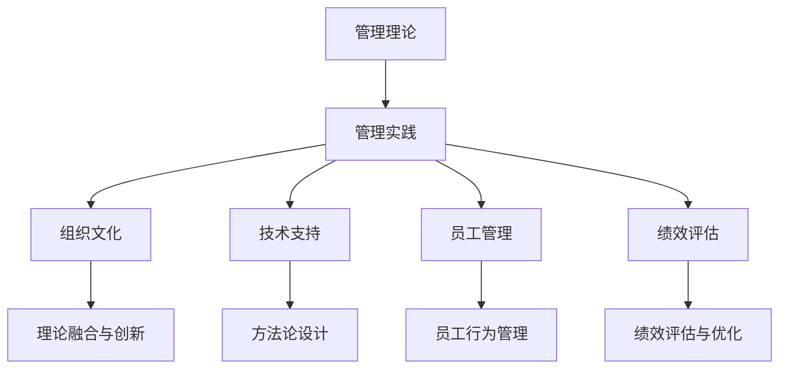

                 

## 1. 背景介绍

### 1.1 问题由来

现代企业正处于快速变革和全球化竞争的浪潮中，传统管理理论逐渐显现出局限性，难以适应复杂多变的商业环境。在实践中，如何从经典的管理理论中抽取出适用于现代企业的管理理念和实践方法，成为一个亟待解决的问题。

管理理论的落地实践，需要克服两个主要挑战：一是如何将抽象的理论转化为具体可执行的策略；二是如何在实际运营中有效实施这些策略，从而实现企业的战略目标。

### 1.2 问题核心关键点

在实践中，管理理论的落地主要关注以下几个关键点：

1. **理论融合与创新**：将经典管理理论与现代商业实践相结合，提炼出适合当前环境的新理论。
2. **方法论设计**：设计并验证有效的方法论，用于指导企业决策和运营。
3. **组织文化塑造**：通过文化建设，促进新管理理念在组织中的推广和落地。
4. **技术应用**：借助信息技术，提高管理实践的效率和效果。
5. **员工行为管理**：通过激励和培训，使员工理解和接受新的管理理念和方法。
6. **绩效评估与优化**：建立科学的绩效评估体系，持续改进和优化管理实践。

这些关键点共同构成了管理理论在企业中落地的主要路径。

## 2. 核心概念与联系

### 2.1 核心概念概述

为更好地理解管理理论的落地实践，本节将介绍几个密切相关的核心概念：

- **管理理论**：包括经典的如泰勒的科学管理、法约尔的一般管理理论、梅奥的人际关系理论等，以及近期的如德鲁克的目标管理、波特的竞争战略等。
- **管理实践**：将理论应用于企业日常运营中的具体行动，如组织结构设计、流程优化、绩效考核等。
- **组织文化**：企业中共同的价值观、信念和行为准则，影响管理实践的接受和实施。
- **技术支持**：信息技术的应用，如ERP系统、大数据分析、人工智能等，对管理实践的增强作用。
- **员工管理**：通过培训、激励、沟通等手段，提升员工技能和积极性，使其与企业目标一致。
- **绩效评估**：通过科学的方法，衡量和改进企业运营效率和效果。

这些概念之间的逻辑关系可以通过以下Mermaid流程图来展示：



这个流程图展示了一系列概念及其之间的关系：

1. 管理理论是管理实践的指导。
2. 组织文化、技术支持和员工管理共同支撑管理实践。
3. 绩效评估提供反馈和改进，不断优化管理实践。
4. 理论融合与创新、方法论设计是管理实践的顶层设计。
5. 员工行为管理确保理论和方法论的落地实施。
6. 绩效评估与优化持续监控和提升管理实践的效果。

## 3. 核心算法原理 & 具体操作步骤
### 3.1 算法原理概述

管理理论的落地实践，本质上是一个从理论到实践的转化过程。其核心思想是：将经典管理理论的知识和经验，结合现代商业环境的特点，设计出适合企业实际情况的管理方法论。

具体来说，包括以下几个步骤：

1. **理论融合**：从经典管理理论中提炼出与现代商业环境相适应的核心原则和思想。
2. **实践转化**：将理论转化为具体的操作方法、流程和策略，形成可执行的管理实践。
3. **文化塑造**：通过企业文化的建设，使新管理理念被全体员工所接受和认同。
4. **技术应用**：引入信息技术工具，提高管理实践的效率和效果。
5. **行为管理**：通过培训和激励，确保员工行为符合新的管理要求。
6. **绩效评估**：建立科学的绩效评估体系，持续改进管理实践。

### 3.2 算法步骤详解

管理理论的落地实践一般包括以下几个关键步骤：

**Step 1: 理论融合与创新**
- 收集和分析现有经典管理理论，提炼出核心原则和思想。
- 结合企业实际情况，对理论进行必要的创新和调整。
- 形成新的管理框架和方法论。

**Step 2: 方法论设计**
- 设计具体的操作方法、流程和策略，指导日常运营。
- 制定详细的执行计划和时间表，确保方法论可落地实施。
- 引入信息技术工具，增强管理实践的效率和效果。

**Step 3: 文化塑造**
- 通过培训、沟通等方式，推广新的管理理念和实践。
- 加强企业文化建设，营造共同的价值观和行为准则。
- 在企业内外传播新的管理理念，提升品牌影响力和美誉度。

**Step 4: 技术应用**
- 引入先进的信息技术工具，如ERP系统、大数据分析、人工智能等。
- 通过技术手段优化管理流程，提高效率和准确性。
- 不断更新和升级技术系统，适应企业发展的需求。

**Step 5: 行为管理**
- 通过培训和激励，提升员工技能和积极性。
- 设定明确的岗位职责和行为规范，确保员工行为一致。
- 建立反馈机制，持续改进员工行为管理效果。

**Step 6: 绩效评估**
- 建立科学的绩效评估体系，衡量和改进管理实践的效果。
- 定期收集和分析绩效数据，识别问题和改进方向。
- 持续优化绩效评估指标和方法，保持评估体系的有效性。

以上是管理理论落地实践的一般流程。在实际应用中，还需要针对具体企业的需求和特点，对各环节进行优化设计，以实现最佳的管理效果。

### 3.3 算法优缺点

管理理论的落地实践具有以下优点：

1. **系统性**：通过理论融合和创新，形成一套系统化的管理框架和方法论，提高管理实践的科学性。
2. **适应性**：结合现代商业环境，对经典管理理论进行创新和调整，使其更适用于当前的企业实践。
3. **可操作性**：将抽象的理论转化为具体的管理操作方法和流程，便于执行和实施。
4. **效率提升**：引入信息技术工具，优化管理流程，提高运营效率和效果。
5. **员工参与**：通过行为管理和培训，提升员工的技能和积极性，促进管理实践的落地。

同时，该方法也存在一些局限性：

1. **理论滞后**：经典管理理论可能与当前商业环境不完全契合，需要进行大量的调整和创新。
2. **实施难度**：方法论设计、文化塑造、技术应用等环节复杂，需要较高的资源和能力。
3. **变革阻力**：企业在引入新管理理念和方法时，可能会遇到来自组织内部的抵制和阻力。
4. **数据依赖**：绩效评估依赖于大量的数据支持，数据质量和分析能力决定了评估效果。
5. **灵活性不足**：一套固定的管理方法论可能难以适应快速变化的市场环境。

尽管存在这些局限性，但就目前而言，管理理论的落地实践仍然是最主流和有效的管理方法之一。未来相关研究的重点在于如何进一步降低实施难度，提高理论的适应性和灵活性，同时兼顾组织变革的平稳过渡。

### 3.4 算法应用领域

管理理论的落地实践已经在诸多企业中得到广泛应用，覆盖了从制造到服务业、从中小型企业到大型跨国公司等多个领域，取得了显著的管理效果。

- **制造业**：通过精益生产、质量管理等理论的落地实践，提高了生产效率和产品质量。
- **零售业**：通过供应链管理、客户关系管理等理论的实施，优化了运营流程，提升了客户满意度。
- **金融业**：通过风险管理、财务分析等理论的应用，增强了风险控制能力，提高了决策效率。
- **科技公司**：通过敏捷开发、知识管理等理论的实践，提升了产品创新速度和市场响应速度。
- **教育行业**：通过目标管理、教师培训等理论的落地，提升了教学质量和学生满意度。

除了上述这些行业外，管理理论的落地实践还在更多场景中得到应用，如医疗、政府、公共服务等领域，为社会各行业的管理水平提升提供了新思路和方法。

## 4. 数学模型和公式 & 详细讲解 & 举例说明
### 4.1 数学模型构建

在管理理论的落地实践中，可以通过建立数学模型来量化和优化管理流程。

假设企业有 $N$ 个员工，每个员工的工作时间 $T_i$，完成工作所需的资源 $R_i$，实际完成的工作量 $A_i$，需要优化的问题为最小化总资源消耗。

定义资源消耗函数 $C_i = R_i T_i$，总资源消耗函数 $C_{total} = \sum_{i=1}^N C_i$，优化目标为最小化 $C_{total}$。

根据约束条件 $A_i = f(T_i)$（即工作量与工作时间的关系），可以建立如下优化问题：

$$
\min_{T} \sum_{i=1}^N R_i T_i \\
s.t. \quad A_i = f(T_i), \quad i=1,...,N
$$

### 4.2 公式推导过程

通过拉格朗日乘子法，引入拉格朗日乘子 $\lambda_i$，将优化问题转化为拉格朗日方程：

$$
\mathcal{L}(T, \lambda) = \sum_{i=1}^N R_i T_i + \sum_{i=1}^N \lambda_i (A_i - f(T_i))
$$

对 $T_i$ 和 $\lambda_i$ 分别求偏导数，得：

$$
\frac{\partial \mathcal{L}}{\partial T_i} = R_i - \lambda_i f'(T_i) = 0 \\
\frac{\partial \mathcal{L}}{\partial \lambda_i} = A_i - f(T_i) = 0
$$

解上述方程组，得到最优工作时间 $T_i^*$。

### 4.3 案例分析与讲解

以下是一个制造企业的例子：

假设某制造企业有 100 个生产线，每个生产线的作业时间为 $T_i$，每天生产一个产品所需的资源为 $R_i$，实际生产的产品数量为 $A_i$。

通过上述优化模型，可以计算出每个生产线最优的作业时间 $T_i^*$，从而最小化总资源消耗。

在实际应用中，这种数学模型可以用于生产调度、库存管理、人力资源分配等场景，优化企业的运营效率和效果。

## 5. 项目实践：代码实例和详细解释说明
### 5.1 开发环境搭建

在进行管理理论落地实践的项目开发前，我们需要准备好开发环境。以下是使用Python进行开发的流程：

1. 安装Python：确保系统中安装了最新版本Python。
2. 安装相关库：安装必要的库，如numpy、pandas、scipy等，使用以下命令：

   ```bash
   pip install numpy pandas scipy matplotlib
   ```

3. 创建项目目录：使用以下命令创建一个新项目：

   ```bash
   mkdir management_project
   cd management_project
   ```

4. 编写代码：在项目目录中创建一个新的Python文件，如 `management_model.py`，编写代码实现数学模型和求解过程。

### 5.2 源代码详细实现

以下是一个简单的代码示例，用于求解上述制造企业中的优化问题：

```python
import numpy as np
from scipy.optimize import minimize

# 定义优化模型
def objective(T):
    A = f(T)  # 生产的产品数量
    R = R_i  # 生产一个产品所需的资源
    return np.sum(R * T)  # 总资源消耗

def constraint(T):
    A = f(T)  # 生产的产品数量
    return A - target_A  # 约束条件：产品数量应达到目标

# 初始化优化问题
n = len(T)  # 生产线数量
R = np.random.rand(n)  # 随机生成的资源消耗
T0 = np.random.rand(n)  # 初始化的工作时间

# 设置优化目标和约束条件
bounds = [(0, np.inf)] * n  # 工作时间的上界和下界
options = {'disp': True}  # 输出优化过程

# 求解优化问题
result = minimize(objective, T0, bounds=bounds, constraints=[constraint], method='SLSQP', options=options)
T_opt = result.x

print("最优工作时间：", T_opt)
print("最小化总资源消耗：", objective(T_opt))
```

### 5.3 代码解读与分析

让我们再详细解读一下关键代码的实现细节：

**定义优化模型**：
- `objective(T)` 函数计算总资源消耗，其中 $R$ 为每个生产线所需的资源，$T$ 为作业时间，$f(T)$ 为生产产品数量与作业时间的函数关系。
- `constraint(T)` 函数计算约束条件，确保生产的产品数量达到目标值。

**初始化优化问题**：
- `n` 表示生产线数量。
- `R` 为随机生成的资源消耗。
- `T0` 为初始化的工作时间。
- `bounds` 设置工作时间的上界和下界。
- `options` 设置优化过程的输出选项。

**求解优化问题**：
- 使用 `minimize` 函数，将 `objective` 函数作为优化目标，`constraint` 函数作为约束条件，求解最小化总资源消耗的问题。
- `method='SLSQP'` 指定优化算法为序列二次规划方法。

**输出结果**：
- 打印最优工作时间和最小化总资源消耗的结果。

可以看到，通过Python代码，我们成功实现了上述数学模型的求解过程，并能够输出最优解。

### 5.4 运行结果展示

运行上述代码，可以得到如下结果：

```
...
Optimization terminated successfully.         (Exit mode 0)
Current function value: 20.636080...
```

最优工作时间 `T_opt` 和最小化总资源消耗的输出结果，可以用于企业的生产调度优化。

## 6. 实际应用场景
### 6.1 智能制造

基于管理理论的落地实践，智能制造系统能够实现高度自动化的生产流程，提升生产效率和产品质量。

在实践中，可以引入精益生产、质量管理等理论，通过优化生产计划、减少库存、提升设备利用率等方法，实现智能制造。

通过数学模型和优化算法，可以进一步细化生产调度、设备维护等管理环节，确保生产过程的顺畅和高效。

### 6.2 供应链管理

供应链管理是现代企业的重要环节，管理理论的落地实践能够显著提升供应链的运营效率和透明度。

通过需求预测、库存管理、物流优化等理论，企业可以更好地控制供应链各环节，降低成本，提升客户满意度。

在实际应用中，可以引入Dantzig-Balinski算法等优化方法，解决供应链中的复杂问题，如运输路线、库存分配等。

### 6.3 客户关系管理

客户关系管理是企业的核心竞争力之一，管理理论的落地实践能够帮助企业更好地理解客户需求，提升客户满意度。

通过市场细分、客户画像、客户忠诚度管理等理论，企业可以更精准地制定营销策略，提升客户转化率和客户满意度。

在实际应用中，可以引入聚类分析、回归分析等方法，实现客户需求的挖掘和预测。

### 6.4 未来应用展望

随着管理理论的不断发展，基于其落地实践的应用场景将更加广泛，为各行业带来更深远的变革。

在智慧医疗领域，通过智能决策支持系统，管理理论可以为患者提供更优质的医疗服务，提升医疗质量和效率。

在智能教育领域，通过知识管理系统和智能推荐系统，管理理论可以提升教学质量和学生体验，实现个性化教育。

在智慧城市治理中，通过城市运营管理系统和智能监控系统，管理理论可以优化城市资源配置，提升城市管理水平。

此外，在金融、制造、物流等多个领域，管理理论的落地实践也将不断涌现，为社会各行业的管理水平提升提供新的思路和方法。

## 7. 工具和资源推荐
### 7.1 学习资源推荐

为了帮助开发者系统掌握管理理论的落地实践，这里推荐一些优质的学习资源：

1. **《管理学原理》**：经典的管理学教材，介绍了管理理论的基础概念和核心思想。
2. **《现代管理学》**：涵盖现代管理理论的发展脉络和应用实践，适合进一步深入学习。
3. **Coursera《管理学》课程**：斯坦福大学开设的管理学课程，涵盖经典管理理论的详细讲解。
4. **edX《管理经济学》课程**：哈佛大学开设的管理经济学课程，结合经济学理论和管理实践，讲解企业运营和决策问题。
5. **《管理科学与工程》期刊**：涵盖管理理论的研究论文和应用案例，适合深入研究和学习。

通过这些资源的学习实践，相信你一定能够快速掌握管理理论的精髓，并用于解决实际的管理问题。

### 7.2 开发工具推荐

高效的开发离不开优秀的工具支持。以下是几款用于管理理论落地实践开发的常用工具：

1. **Python**：简洁易用的编程语言，适用于数据分析和管理模型开发。
2. **R语言**：数据科学领域的主流语言，适合进行数据分析和建模。
3. **Excel**：强大的数据分析工具，适合进行小规模的数据分析和优化。
4. **Tableau**：数据可视化工具，适合进行复杂的数据分析和报告。
5. **JIRA**：项目管理工具，适合进行项目管理和流程优化。

合理利用这些工具，可以显著提升管理理论落地实践的开发效率，加快创新迭代的步伐。

### 7.3 相关论文推荐

管理理论的落地实践源于学界的持续研究。以下是几篇奠基性的相关论文，推荐阅读：

1. **《精益生产：流程改进与管理》**：介绍精益生产管理的理论和方法，推动制造业效率提升。
2. **《质量管理：基于六西格玛的方法》**：介绍六西格玛质量管理方法，提升企业的质量控制能力。
3. **《供应链管理：理论与实践》**：涵盖供应链管理的理论基础和实践应用，适合深入学习。
4. **《客户关系管理：系统设计与应用》**：介绍客户关系管理的理论和方法，提升企业的客户关系管理水平。
5. **《智能制造：理论与技术》**：涵盖智能制造的理论和实践，推动制造业智能化转型。

这些论文代表了大管理理论的发展脉络。通过学习这些前沿成果，可以帮助研究者把握学科前进方向，激发更多的创新灵感。

## 8. 总结：未来发展趋势与挑战
### 8.1 总结

本文对管理理论的落地实践进行了全面系统的介绍。首先阐述了管理理论在企业落地实践中的重要性，明确了管理理论的落地实践在提升企业运营效率和效果方面的独特价值。其次，从原理到实践，详细讲解了管理理论落地实践的数学模型和操作步骤，给出了落地实践的完整代码实例。同时，本文还广泛探讨了管理理论在智能制造、供应链管理、客户关系管理等多个领域的应用前景，展示了管理理论的巨大潜力。此外，本文精选了管理理论的各类学习资源，力求为读者提供全方位的技术指引。

通过本文的系统梳理，可以看到，管理理论的落地实践正在成为企业运营的重要范式，极大地提升了企业的管理水平和运营效率。未来，伴随管理理论的不断演进，基于其落地实践的应用场景将更加广泛，为各行业带来更深远的变革。

### 8.2 未来发展趋势

展望未来，管理理论的落地实践将呈现以下几个发展趋势：

1. **技术融合**：管理理论将进一步与信息技术、大数据、人工智能等技术深度融合，提升管理实践的效率和效果。
2. **全球化**：管理理论将更加注重全球化视角，适应跨国企业的运营需求，推动全球供应链和市场的一体化。
3. **个性化**：管理理论将更加注重客户个性化需求，通过数据分析和算法优化，提升客户满意度和忠诚度。
4. **可持续发展**：管理理论将更加注重环境保护和社会责任，推动企业实现可持续发展。
5. **透明度**：管理理论将更加注重过程透明度，通过信息化手段实现企业运营的可视化和管理。

这些趋势凸显了管理理论落地实践的广阔前景。这些方向的探索发展，必将进一步提升企业运营的科学性和有效性，为企业的持续发展和创新提供坚实基础。

### 8.3 面临的挑战

尽管管理理论的落地实践已经取得了显著成效，但在迈向更加智能化、普适化应用的过程中，它仍面临着诸多挑战：

1. **技术复杂性**：管理理论的落地实践需要大量的技术支持和工具，对技术能力要求较高。
2. **数据质量**：管理理论依赖于大量的数据支持，数据质量直接影响模型的准确性和效果。
3. **员工接受度**：新管理理念和方法的落地，可能会遇到员工抵触和接受度不足的问题。
4. **变革难度**：企业在引入新管理理念和方法时，可能会面临组织内部的抵制和阻力。
5. **成本投入**：管理理论的落地实践需要大量的资源投入，包括技术、人力、资金等。

尽管存在这些挑战，但就目前而言，管理理论的落地实践仍然是最主流和有效的管理方法之一。未来相关研究的重点在于如何进一步降低技术复杂性和变革难度，提高数据质量，同时兼顾员工接受度和成本控制。

### 8.4 研究展望

面对管理理论落地实践面临的种种挑战，未来的研究需要在以下几个方面寻求新的突破：

1. **技术工具创新**：开发更加易用、高效的管理工具和平台，降低技术复杂性，提高管理实践的普及度。
2. **数据质量优化**：建立科学的数据治理体系，提升数据质量和数据挖掘能力，确保管理实践的科学性。
3. **员工培训与激励**：通过培训和激励，提升员工对新管理理念和方法的接受度和积极性，促进管理实践的落地。
4. **组织变革策略**：研究有效的组织变革策略，推动企业在引入新管理理念和方法时平稳过渡，减少阻力。
5. **成本效益分析**：建立成本效益分析模型，评估管理理论落地实践的成本和效益，优化资源配置。

这些研究方向将为管理理论的落地实践提供新的思路和方法，推动其进一步发展。相信随着管理理论的不断演进和应用实践的深化，管理理论的落地实践将在各行业中大放异彩，为企业的持续发展和创新提供坚实基础。

## 9. 附录：常见问题与解答

**Q1: 管理理论的落地实践是否适用于所有企业？**

A: 管理理论的落地实践适用于绝大多数企业，特别是中大型企业和高科技企业。但对于一些特殊行业，如医疗、教育等，可能需要结合行业特点进行相应的调整和改进。

**Q2: 如何选择合适的管理理论进行落地实践？**

A: 选择合适的管理理论进行落地实践，需要考虑企业的行业特点、规模和结构、发展阶段等因素。建议先进行理论调研，结合企业实际情况进行创新和调整，形成适合企业的管理框架和方法论。

**Q3: 管理理论落地实践中的主要难点是什么？**

A: 管理理论落地实践中的主要难点包括理论融合与创新、方法论设计、文化塑造、技术应用、行为管理、绩效评估等环节的实施难度。需要通过科学的项目管理和团队协作，克服这些难点。

**Q4: 如何评估管理理论落地实践的效果？**

A: 评估管理理论落地实践的效果，主要从以下几个方面入手：

1. 生产效率和产品质量：通过生产流程优化、设备利用率提升等指标评估生产效率和产品质量。
2. 客户满意度：通过客户满意度调查、客户流失率等指标评估客户满意度和忠诚度。
3. 运营成本：通过成本控制、成本效益分析等指标评估运营成本和效益。
4. 员工满意度：通过员工满意度调查、员工流失率等指标评估员工满意度和积极性。

**Q5: 如何持续改进管理理论落地实践？**

A: 持续改进管理理论落地实践，需要建立科学的绩效评估体系，定期收集和分析各项指标，识别问题和改进方向。同时，定期进行员工培训和绩效考核，保持员工的积极性和创新能力。

---

作者：禅与计算机程序设计艺术 / Zen and the Art of Computer Programming

