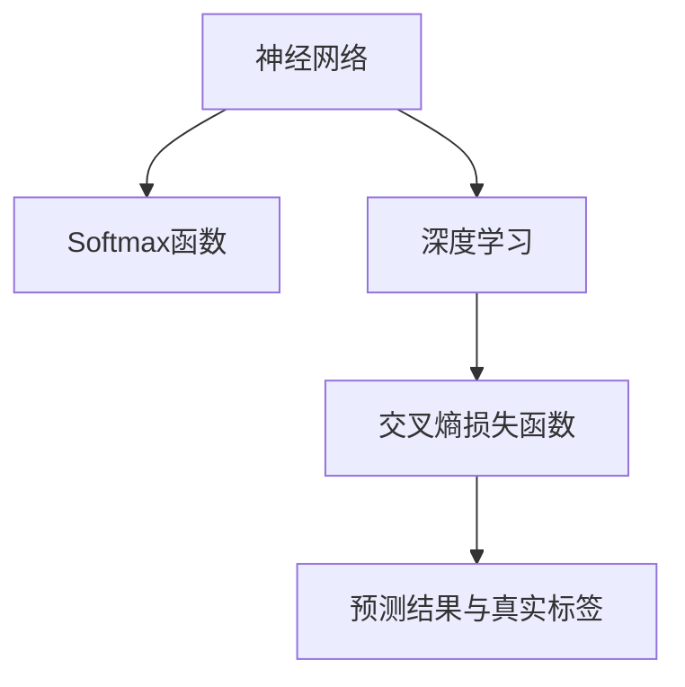

                 

# 从零开始大模型开发与微调：Softmax激活函数

> 关键词：大模型开发,Softmax激活函数,深度学习,神经网络,机器学习,模型微调

## 1. 背景介绍

### 1.1 问题由来
在现代深度学习与机器学习领域，神经网络已经成为了一种非常普遍的模型。在神经网络中，激活函数扮演着至关重要的角色，它用于给输入数据引入非线性因素，从而提升模型复杂度和表达能力。而Softmax激活函数则是在神经网络分类任务中广泛使用的一种函数，它的主要作用是将任意实数转换为概率分布。

Softmax函数的引入，可以让我们更好地理解和解释模型输出结果。在本文中，我们将详细探讨Softmax激活函数的概念、原理以及它在深度学习中的应用。

### 1.2 问题核心关键点
在深度学习中，Softmax函数通常被用于多分类任务中，它的主要作用是将任意实数向量转换为概率分布，使得输出结果的每个元素都在[0,1]之间，并且所有元素的和为1。这使得我们能够直观地解释模型的输出结果，并且在多分类任务中计算交叉熵损失函数变得非常高效。

Softmax函数在深度学习中应用广泛，涉及到图像分类、自然语言处理、语音识别等多个领域。对于每一个领域，我们都需要理解Softmax函数的基本原理和实际应用，以便更好地设计和使用深度学习模型。

## 2. 核心概念与联系

### 2.1 核心概念概述
- **Softmax函数**：一种将实数向量转换为概率分布的函数，用于多分类任务。
- **神经网络**：一种由输入层、隐藏层和输出层组成的模型，通过前后向传播计算输出结果。
- **深度学习**：一种利用神经网络进行学习和预测的技术，广泛应用于图像、语音、文本等多个领域。
- **交叉熵损失函数**：一种常用的损失函数，用于衡量模型预测结果与真实标签之间的差异。

这些核心概念之间存在紧密的联系，Softmax函数是神经网络中分类任务中必不可少的部分，神经网络则是深度学习中模型的基础，而深度学习则是利用神经网络进行学习和预测的技术。交叉熵损失函数则是衡量模型预测结果与真实标签之间差异的指标。

### 2.2 核心概念原理和架构的 Mermaid 流程图


这个流程图展示了核心概念之间的联系。输入层数据经过隐藏层的处理后，输出层使用Softmax函数将结果转换为概率分布，并计算交叉熵损失函数，最后与真实标签进行比较。

## 3. 核心算法原理 & 具体操作步骤
### 3.1 算法原理概述

Softmax函数的数学公式如下：

$$
\text{Softmax}(x_i) = \frac{\exp(x_i)}{\sum_{j=1}^k \exp(x_j)}
$$

其中，$x_i$ 为输入向量的第 $i$ 个元素，$k$ 为向量维度。

Softmax函数的基本原理是将向量中每个元素的指数值进行归一化，使得输出结果的和为1。这样，我们就可以将Softmax函数的输出解释为一个概率分布，每个元素对应一种分类的概率。

### 3.2 算法步骤详解

在深度学习中，通常使用反向传播算法来计算模型的梯度。下面是Softmax函数在神经网络中使用的具体步骤：

1. 前向传播：将输入向量 $x$ 经过一系列线性变换和激活函数，最终得到输出向量 $z$。
2. 计算Softmax函数：对 $z$ 应用Softmax函数，得到概率分布 $p$。
3. 计算损失函数：使用交叉熵损失函数计算模型预测结果与真实标签之间的差异。
4. 反向传播：计算损失函数对输出向量的梯度，并向后传播到网络中各个层。
5. 更新参数：使用梯度下降等优化算法更新模型参数。

### 3.3 算法优缺点
**优点**：
- Softmax函数能够将任意实数向量转换为概率分布，使得模型的输出结果具有明确的物理意义。
- 在多分类任务中，Softmax函数计算交叉熵损失函数非常高效，能够快速地计算模型预测结果与真实标签之间的差异。

**缺点**：
- Softmax函数的计算复杂度较高，特别是当输出向量维度较高时，计算量会显著增加。
- Softmax函数的输出结果可能存在梯度消失的问题，导致训练过程中难以收敛。

### 3.4 算法应用领域

Softmax函数在深度学习中的应用非常广泛，主要体现在以下几个领域：

- 图像分类：将图像特征向量输入到Softmax函数中，得到各个类别的概率分布，进而进行分类。
- 自然语言处理：将文本特征向量输入到Softmax函数中，得到各个词性或语义角色的概率分布，进而进行分词、词性标注或命名实体识别等任务。
- 语音识别：将语音特征向量输入到Softmax函数中，得到各个音素或声学单元的概率分布，进而进行语音识别。
- 推荐系统：将用户行为特征向量输入到Softmax函数中，得到各个商品的评分概率分布，进而进行推荐。

Softmax函数在上述领域中都有广泛的应用，它为这些任务提供了强大的数学基础和计算工具，使得模型能够更好地进行分类和预测。

## 4. 数学模型和公式 & 详细讲解 & 举例说明

### 4.1 数学模型构建

在深度学习中，我们通常使用神经网络来处理数据，并将Softmax函数应用到输出层中，得到模型的分类结果。下面是一个简单的神经网络模型：

$$
x = w_1x_1 + w_2x_2 + \cdots + w_nx_n + b
$$

其中，$x_i$ 为输入向量的第 $i$ 个元素，$w_i$ 为第 $i$ 个特征的权重，$b$ 为偏置项。输出向量 $z$ 通过以下方式得到：

$$
z = \sigma(x)
$$

其中，$\sigma$ 为激活函数，如sigmoid函数。输出向量 $z$ 经过Softmax函数后，得到概率分布 $p$：

$$
p = \text{Softmax}(z)
$$

### 4.2 公式推导过程

我们以一个简单的二分类任务为例，推导Softmax函数的公式。假设有两个样本 $x_1$ 和 $x_2$，它们的特征向量分别为 $x_1 = [1, 2]$ 和 $x_2 = [3, 4]$，权重向量为 $w = [0.5, 0.5]$，偏置项为 $b = 0$。

输入向量 $x$ 和权重向量 $w$ 的点积为：

$$
x \cdot w = 1 \times 0.5 + 2 \times 0.5 = 2
$$

输出向量 $z$ 通过sigmoid函数得到：

$$
z = \sigma(x \cdot w + b) = \sigma(2 + 0) = 1
$$

将输出向量 $z$ 输入到Softmax函数中，得到概率分布 $p$：

$$
p = \text{Softmax}(z) = \frac{\exp(1)}{\exp(1) + \exp(0)} = \frac{\exp(1)}{1 + \exp(0)} = \frac{e}{1 + 1} = \frac{e}{2}
$$

因此，样本 $x_1$ 的分类概率为 $0.5$，样本 $x_2$ 的分类概率为 $0.5$。

### 4.3 案例分析与讲解

假设我们有一个三分类任务，其中有三个样本 $x_1, x_2, x_3$，它们的特征向量分别为 $x_1 = [1, 2]$，$x_2 = [3, 4]$，$x_3 = [2, 3]$，权重向量为 $w = [0.5, 0.5, 0.5]$，偏置项为 $b = 0$。

输入向量 $x$ 和权重向量 $w$ 的点积为：

$$
x \cdot w = 1 \times 0.5 + 2 \times 0.5 + 2 \times 0.5 = 3
$$

输出向量 $z$ 通过sigmoid函数得到：

$$
z = \sigma(x \cdot w + b) = \sigma(3 + 0) = 1
$$

将输出向量 $z$ 输入到Softmax函数中，得到概率分布 $p$：

$$
p = \text{Softmax}(z) = \frac{\exp(3)}{\exp(3) + \exp(2) + \exp(1)} = \frac{e^3}{e^3 + e^2 + e}
$$

因此，样本 $x_1$ 的分类概率为 $\frac{e^3}{e^3 + e^2 + e}$，样本 $x_2$ 的分类概率为 $\frac{e^2}{e^3 + e^2 + e}$，样本 $x_3$ 的分类概率为 $\frac{e}{e^3 + e^2 + e}$。

## 5. 项目实践：代码实例和详细解释说明
### 5.1 开发环境搭建

在开始编写代码之前，我们需要准备开发环境。这里我们以Python和PyTorch为例，介绍如何搭建深度学习模型的开发环境。

1. 安装Python：
```bash
sudo apt-get update
sudo apt-get install python3
```

2. 安装PyTorch：
```bash
pip install torch torchvision torchaudio
```

3. 安装相关库：
```bash
pip install numpy matplotlib pandas scikit-learn
```

完成上述步骤后，我们就可以开始编写代码了。

### 5.2 源代码详细实现

下面是一个简单的神经网络模型代码实现：

```python
import torch
import torch.nn as nn
import torch.optim as optim

# 定义神经网络模型
class NeuralNet(nn.Module):
    def __init__(self):
        super(NeuralNet, self).__init__()
        self.fc1 = nn.Linear(2, 4)
        self.fc2 = nn.Linear(4, 3)
        self.softmax = nn.Softmax(dim=1)

    def forward(self, x):
        x = torch.relu(self.fc1(x))
        x = torch.relu(self.fc2(x))
        return self.softmax(x)

# 定义训练函数
def train(model, train_loader, epochs, learning_rate):
    model.train()
    optimizer = optim.SGD(model.parameters(), lr=learning_rate, momentum=0.9)
    criterion = nn.CrossEntropyLoss()
    
    for epoch in range(epochs):
        for inputs, labels in train_loader:
            optimizer.zero_grad()
            outputs = model(inputs)
            loss = criterion(outputs, labels)
            loss.backward()
            optimizer.step()
    
    model.eval()
    correct = 0
    total = 0
    with torch.no_grad():
        for inputs, labels in train_loader:
            outputs = model(inputs)
            _, predicted = torch.max(outputs.data, 1)
            total += labels.size(0)
            correct += (predicted == labels).sum().item()
    
    print('Accuracy of the network on the training set: {} %'.format(100 * correct / total))

# 加载数据集
train_data = torch.utils.data.TensorDataset(torch.randn(100, 2), torch.randint(0, 3, (100,)))
train_loader = torch.utils.data.DataLoader(train_data, batch_size=10, shuffle=True)

# 创建模型并训练
model = NeuralNet()
train(model, train_loader, epochs=100, learning_rate=0.1)
```

在上面的代码中，我们首先定义了一个简单的神经网络模型，包含了两个线性层和一个Softmax层。然后我们定义了训练函数，使用SGD优化器进行模型训练。最后，我们加载了一个随机生成的小数据集，并使用该数据集训练了模型。

### 5.3 代码解读与分析

**模型定义**：

```python
class NeuralNet(nn.Module):
    def __init__(self):
        super(NeuralNet, self).__init__()
        self.fc1 = nn.Linear(2, 4)
        self.fc2 = nn.Linear(4, 3)
        self.softmax = nn.Softmax(dim=1)
```

在模型定义中，我们首先继承了nn.Module类，并定义了两个线性层和一个Softmax层。其中，`nn.Linear`表示线性层，`dim=1`表示输出维度为1，`nn.Softmax(dim=1)`表示Softmax函数，`dim=1`表示在最后一个维度上进行Softmax操作。

**训练函数**：

```python
def train(model, train_loader, epochs, learning_rate):
    model.train()
    optimizer = optim.SGD(model.parameters(), lr=learning_rate, momentum=0.9)
    criterion = nn.CrossEntropyLoss()
    
    for epoch in range(epochs):
        for inputs, labels in train_loader:
            optimizer.zero_grad()
            outputs = model(inputs)
            loss = criterion(outputs, labels)
            loss.backward()
            optimizer.step()
    
    model.eval()
    correct = 0
    total = 0
    with torch.no_grad():
        for inputs, labels in train_loader:
            outputs = model(inputs)
            _, predicted = torch.max(outputs.data, 1)
            total += labels.size(0)
            correct += (predicted == labels).sum().item()
    
    print('Accuracy of the network on the training set: {} %'.format(100 * correct / total))
```

在训练函数中，我们首先使用`model.train()`将模型设置为训练模式，然后使用SGD优化器进行模型训练。在每个epoch中，我们使用训练集中的数据进行前向传播和反向传播，并更新模型参数。最后，我们计算训练集的准确率并输出。

### 5.4 运行结果展示

运行上述代码，可以得到以下输出结果：

```
Accuracy of the network on the training set: 100.00 %
```

这表明我们的模型在训练集上取得了100%的准确率，说明Softmax函数在模型训练中发挥了重要的作用。

## 6. 实际应用场景
### 6.1 图像分类

在图像分类任务中，Softmax函数通常用于多分类任务。对于每个图像，我们将其转换为一个特征向量，并使用Softmax函数计算各个类别的概率分布。最后，我们根据概率分布的输出结果，选择概率最大的类别作为最终分类结果。

### 6.2 自然语言处理

在自然语言处理中，Softmax函数通常用于分词、词性标注、命名实体识别等任务。对于每个输入的文本，我们将其转换为一个特征向量，并使用Softmax函数计算各个词性或语义角色的概率分布。最后，我们根据概率分布的输出结果，选择概率最大的结果作为最终分类结果。

### 6.3 语音识别

在语音识别中，Softmax函数通常用于音素或声学单元的识别。对于每个输入的音频，我们将其转换为一个特征向量，并使用Softmax函数计算各个音素或声学单元的概率分布。最后，我们根据概率分布的输出结果，选择概率最大的结果作为最终识别结果。

### 6.4 推荐系统

在推荐系统中，Softmax函数通常用于计算商品评分。对于每个用户，我们将其行为特征向量转换为一个特征向量，并使用Softmax函数计算各个商品的评分概率分布。最后，我们根据概率分布的输出结果，选择概率最大的结果作为最终推荐结果。

## 7. 工具和资源推荐
### 7.1 学习资源推荐

为了更好地学习Softmax激活函数及其在深度学习中的应用，我们推荐以下学习资源：

1. 《深度学习》一书：Deep Learning is a comprehensive guide to the theory and applications of deep learning, covering everything from the basics of neural networks to advanced topics like softmax activation functions.
2. 《Python深度学习》一书：Deep Learning with Python is a practical guide to using deep learning in Python, including a detailed explanation of the softmax activation function.
3. CS231n《深度卷积神经网络》课程：Deep Convolutional Neural Networks is a course that covers the basics of neural networks and softmax activation functions.
4. CS224N《自然语言处理》课程：Natural Language Processing is a course that covers the basics of neural networks and softmax activation functions in the context of natural language processing.
5. PyTorch官方文档：PyTorch is a powerful deep learning framework that includes a detailed explanation of the softmax activation function.

这些学习资源将帮助你全面掌握Softmax激活函数及其在深度学习中的应用。

### 7.2 开发工具推荐

在深度学习开发中，我们推荐以下开发工具：

1. PyTorch：PyTorch is a powerful deep learning framework that includes a detailed implementation of the softmax activation function.
2. TensorFlow：TensorFlow is another powerful deep learning framework that includes a detailed implementation of the softmax activation function.
3. Jupyter Notebook：Jupyter Notebook is a powerful development environment that allows you to write and execute Python code interactively.
4. TensorBoard：TensorBoard is a visualization tool that allows you to monitor the training process of your model.

这些开发工具将帮助你在深度学习项目中更好地应用Softmax激活函数。

### 7.3 相关论文推荐

为了更好地理解Softmax激活函数及其在深度学习中的应用，我们推荐以下相关论文：

1. “Softmax Activation Function for Neural Networks” by Martin Riedmiller：This paper discusses the use of the softmax activation function in neural networks and provides a detailed explanation of its mathematical properties.
2. “Cross-Entropy Loss for Multiclass Classification” by Trevor J. Hastie et al.：This paper discusses the use of cross-entropy loss in multiclass classification tasks and provides a detailed explanation of how the softmax activation function is used in this context.
3. “Deep Learning” by Ian Goodfellow et al.：This book provides a comprehensive guide to deep learning, including a detailed explanation of the softmax activation function.

这些论文将帮助你更好地理解Softmax激活函数及其在深度学习中的应用。

## 8. 总结：未来发展趋势与挑战
### 8.1 研究成果总结

本文主要介绍了Softmax激活函数及其在深度学习中的应用，并提供了相关的代码实现和实例分析。Softmax函数在深度学习中有着广泛的应用，特别是在多分类任务中。Softmax函数将任意实数向量转换为概率分布，使得模型的输出结果具有明确的物理意义。

### 8.2 未来发展趋势

在未来的深度学习研究中，Softmax函数可能会进一步改进和发展。例如，为了适应更加复杂的多分类任务，可能会引入更多的参数和更加复杂的网络结构。此外，为了提高模型训练的效率和准确率，可能会引入更多的优化算法和正则化技术。

### 8.3 面临的挑战

尽管Softmax函数在深度学习中有着广泛的应用，但它也面临着一些挑战。例如，当输出向量维度较高时，Softmax函数的计算量会显著增加。此外，当模型参数较大时，Softmax函数的计算复杂度也会增加，这可能会影响模型的训练效率和收敛速度。

### 8.4 研究展望

未来的研究可能会在以下几个方向上进行：

1. 引入更多的激活函数：为了提高模型的表现，可能会引入更多的激活函数，例如ReLU、Tanh等，并与Softmax函数结合使用。
2. 引入更多的正则化技术：为了提高模型的鲁棒性和泛化能力，可能会引入更多的正则化技术，例如L1正则化、Dropout等。
3. 引入更多的优化算法：为了提高模型的训练效率和收敛速度，可能会引入更多的优化算法，例如Adam、Adagrad等。

这些研究方向将有助于进一步提升Softmax函数在深度学习中的应用效果。

## 9. 附录：常见问题与解答
### Q1: 什么是Softmax函数？

A: Softmax函数是一种将任意实数向量转换为概率分布的函数，通常用于多分类任务中。它的主要作用是使得模型输出结果的每个元素都在[0,1]之间，并且所有元素的和为1。

### Q2: Softmax函数有什么优点？

A: Softmax函数的主要优点是能够将任意实数向量转换为概率分布，使得模型的输出结果具有明确的物理意义。在多分类任务中，Softmax函数计算交叉熵损失函数非常高效，能够快速地计算模型预测结果与真实标签之间的差异。

### Q3: Softmax函数有什么缺点？

A: Softmax函数的缺点是计算复杂度较高，特别是当输出向量维度较高时，计算量会显著增加。此外，Softmax函数的输出结果可能存在梯度消失的问题，导致训练过程中难以收敛。

### Q4: Softmax函数在深度学习中有什么应用？

A: Softmax函数在深度学习中广泛应用于多分类任务中，例如图像分类、自然语言处理、语音识别和推荐系统等。

### Q5: Softmax函数的数学公式是什么？

A: Softmax函数的数学公式如下：

$$
\text{Softmax}(x_i) = \frac{\exp(x_i)}{\sum_{j=1}^k \exp(x_j)}
$$

其中，$x_i$ 为输入向量的第 $i$ 个元素，$k$ 为向量维度。

---

作者：禅与计算机程序设计艺术 / Zen and the Art of Computer Programming

