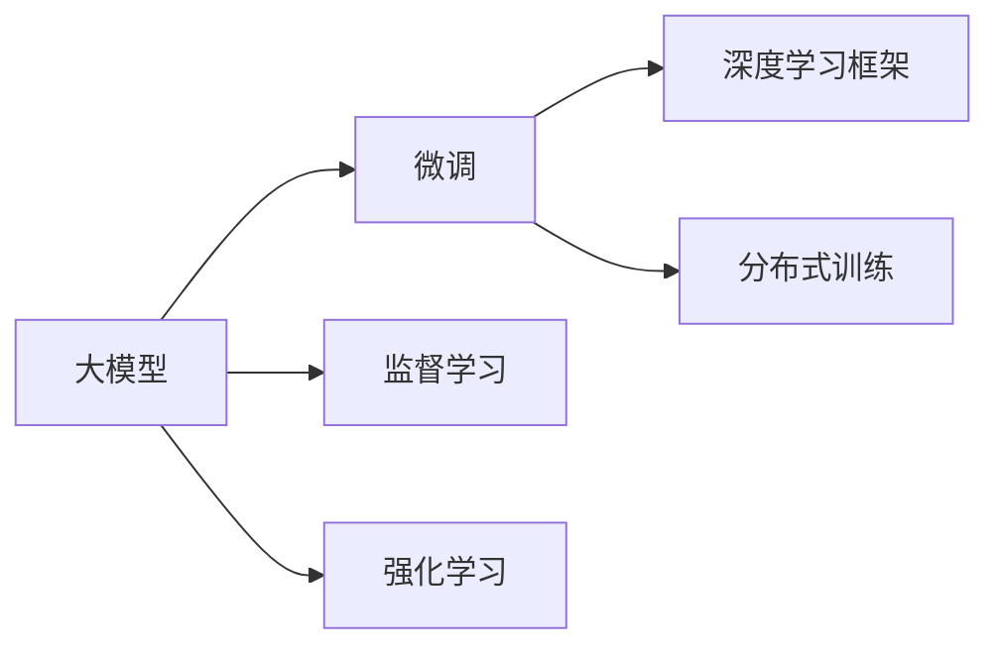
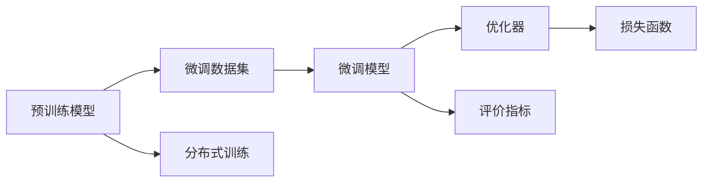

                 

## 1. 背景介绍

### 1.1 问题由来

随着深度学习技术的快速发展，大模型在各个领域的应用日益广泛，其精准的预测能力和强大的推理能力带来了前所未有的应用潜力。然而，从零开始开发和微调大模型需要大量的计算资源和数据支持，这对大部分开发者来说是一个挑战。

大模型通常是在大规模数据集上进行预训练的，以学习到通用的语言表示和特征。预训练模型通常包含数十亿甚至数百亿的参数，训练时间需要数周甚至数月，对计算资源和存储需求极高。因此，研究人员和开发者往往需要依赖于云计算平台或超级计算机才能进行训练。

尽管如此，大模型在特定领域的微调能够显著提高模型的性能，使其更好地适应实际应用场景。微调过程通常只需要几小时到几天的时间，相比于从头开始训练，大大缩短了模型的开发周期。因此，从零开始大模型开发与微调成为了AI开发的重要环节。

### 1.2 问题核心关键点

微调（Fine-Tuning）是针对特定领域的数据集，使用已有的大模型作为初始权重，通过有限次数的迭代更新，使得模型在新任务上表现更好。微调的关键在于：

- **初始化权重**：预训练模型参数作为微调模型的初始权重，决定了微调的起点。
- **训练数据**：微调的训练数据集必须覆盖新任务中的所有类别和样例，才能有效提升模型性能。
- **损失函数**：微调的损失函数需要设计合理，以衡量模型输出与真实标签之间的差异。
- **优化器**：选择合适的优化算法和超参数，如学习率、批次大小等，以最小化损失函数。
- **评价指标**：设计适当的评价指标，以评估微调后的模型在新任务上的性能。

### 1.3 问题研究意义

从零开始开发与微调大模型对于AI技术的落地应用具有重要意义：

- **高效开发**：微调可以显著缩短模型的开发周期，加速AI应用的商业化进程。
- **提升性能**：通过微调，模型可以在特定领域内取得更好的性能，满足实际应用的需求。
- **资源优化**：相比于从头训练，微调需要更少的计算资源和存储空间。
- **模型复用**：微调可以充分利用预训练模型的知识和能力，避免从头训练带来的知识损失。
- **灵活性**：微调可以根据不同的应用场景进行定制化调整，提高模型的适应性。

## 2. 核心概念与联系

### 2.1 核心概念概述

为了更好地理解大模型的微调过程，我们先介绍一些核心概念：

- **大模型（Large Model）**：指包含大量参数的深度学习模型，通常用于从大规模数据集中学习通用知识。
- **微调（Fine-Tuning）**：在大模型基础上，使用少量标注数据进行特定任务的优化，提高模型在新任务上的表现。
- **监督学习（Supervised Learning）**：利用标注数据进行训练，以提高模型的预测能力。
- **强化学习（Reinforcement Learning）**：通过奖励和惩罚机制，训练模型在特定任务中优化决策策略。
- **深度学习框架（Deep Learning Framework）**：如PyTorch，提供高效的操作和丰富的功能支持。
- **分布式训练（Distributed Training）**：通过多台计算机协同工作，提高模型训练效率。

这些概念之间的联系可以用以下Mermaid流程图表示：



### 2.2 核心概念原理和架构的 Mermaid 流程图

以下是一个简单的Mermaid流程图，展示了大模型微调的基本架构：



这个流程图展示了预训练模型、微调数据集、微调模型、优化器、损失函数和评价指标之间的关系，以及分布式训练的角色。

## 3. 核心算法原理 & 具体操作步骤

### 3.1 算法原理概述

大模型的微调过程可以分为以下几个步骤：

1. **初始化权重**：加载预训练模型，将参数作为微调模型的初始权重。
2. **数据准备**：收集并准备特定领域的微调数据集，并进行预处理。
3. **模型适配**：根据微调任务，修改模型结构和损失函数。
4. **训练过程**：使用微调数据集对模型进行训练，优化模型参数。
5. **模型评估**：在验证集上评估模型性能，避免过拟合。
6. **参数保存**：保存优化后的模型参数，供后续使用。

### 3.2 算法步骤详解

#### 3.2.1 初始化权重

加载预训练模型，通常是使用深度学习框架提供的模型库或通过预训练模型的权重文件来加载模型。例如，在PyTorch中，可以使用以下代码来加载预训练的BERT模型：

```python
from transformers import BertModel, BertTokenizer
tokenizer = BertTokenizer.from_pretrained('bert-base-uncased')
model = BertModel.from_pretrained('bert-base-uncased')
```

#### 3.2.2 数据准备

微调数据集必须包含特定领域的标注数据，每个样本应包括输入文本和相应的标签。数据预处理通常包括分词、编码、填充等操作，确保模型能够处理输入文本。

例如，在PyTorch中，可以使用以下代码对微调数据集进行预处理：

```python
from torch.utils.data import Dataset, DataLoader
from transformers import BertTokenizer, BertForSequenceClassification

class CustomDataset(Dataset):
    def __init__(self, data, tokenizer, max_len=128):
        self.data = data
        self.tokenizer = tokenizer
        self.max_len = max_len
    
    def __len__(self):
        return len(self.data)
    
    def __getitem__(self, idx):
        text = self.data[idx]['text']
        label = self.data[idx]['label']
        tokens = self.tokenizer.encode(text, max_len=self.max_len, truncation=True, padding='max_length')
        input_ids = torch.tensor(tokens)
        attention_mask = (input_ids != 0).long()
        return {'input_ids': input_ids, 'attention_mask': attention_mask, 'labels': torch.tensor(label)}

# 加载微调数据集
dataset = CustomDataset(train_data, tokenizer)
data_loader = DataLoader(dataset, batch_size=16, shuffle=True)
```

#### 3.2.3 模型适配

在微调过程中，通常需要修改模型的输出层和损失函数，以适应特定任务。例如，对于分类任务，可以使用BCEWithLogitsLoss作为损失函数，输出层通常为线性层。

```python
from torch.nn import Linear, BCEWithLogitsLoss

# 修改模型输出层
model.fc = Linear(model.fc.weight.size(1), num_classes)

# 定义损失函数
criterion = BCEWithLogitsLoss()
```

#### 3.2.4 训练过程

在训练过程中，使用优化器（如Adam、SGD等）对模型参数进行优化，最小化损失函数。例如，在PyTorch中，可以使用以下代码进行模型训练：

```python
from torch.optim import Adam
optimizer = Adam(model.parameters(), lr=2e-5)

# 训练模型
for epoch in range(num_epochs):
    for batch in data_loader:
        input_ids = batch['input_ids'].to(device)
        attention_mask = batch['attention_mask'].to(device)
        labels = batch['labels'].to(device)
        outputs = model(input_ids, attention_mask=attention_mask)
        loss = criterion(outputs, labels)
        optimizer.zero_grad()
        loss.backward()
        optimizer.step()
```

#### 3.2.5 模型评估

在每个epoch的训练过程中，需要在验证集上评估模型性能，避免过拟合。可以使用以下代码进行模型评估：

```python
from sklearn.metrics import accuracy_score
import torch.nn.functional as F

# 在验证集上评估模型
with torch.no_grad():
    eval_loss = 0
    correct = 0
    total = 0
    for batch in data_loader:
        input_ids = batch['input_ids'].to(device)
        attention_mask = batch['attention_mask'].to(device)
        labels = batch['labels'].to(device)
        outputs = model(input_ids, attention_mask=attention_mask)
        loss = criterion(outputs, labels)
        logits = outputs
        _, predicted = torch.max(logits, 1)
        total += labels.size(0)
        correct += (predicted == labels).sum().item()
        eval_loss += loss.item() * input_ids.size(0)
    eval_accuracy = correct / total
    print(f'Validation Accuracy: {eval_accuracy:.2f}%, Loss: {eval_loss / len(data_loader):.4f}')
```

#### 3.2.6 参数保存

在训练完成后，需要将优化后的模型参数保存到文件中，以便后续使用。例如，在PyTorch中，可以使用以下代码保存模型：

```python
torch.save(model.state_dict(), 'model.pt')
```

### 3.3 算法优缺点

#### 3.3.1 算法优点

- **高效开发**：微调能够快速提高模型性能，缩短开发周期。
- **参数复用**：利用预训练模型的参数，减少了从头开始训练的时间和资源消耗。
- **模型泛化**：微调模型在特定领域内表现良好，具有较高的泛化能力。
- **灵活调整**：可以根据不同任务的需求，灵活调整模型结构和损失函数。

#### 3.3.2 算法缺点

- **数据依赖**：微调依赖于标注数据，标注数据质量直接影响模型性能。
- **过拟合风险**：微调数据集通常较小，模型容易过拟合。
- **模型复杂**：大模型包含大量参数，训练复杂度较高。
- **计算资源消耗大**：大模型需要大量的计算资源和存储空间，训练时间较长。

### 3.4 算法应用领域

大模型微调技术在多个领域得到了广泛应用，包括：

- **自然语言处理（NLP）**：如文本分类、情感分析、机器翻译等。
- **计算机视觉（CV）**：如图像分类、目标检测、语义分割等。
- **语音识别（ASR）**：如语音识别、情感识别、语音翻译等。
- **推荐系统**：如协同过滤、基于内容的推荐等。
- **游戏AI**：如策略游戏、动作游戏等。

## 4. 数学模型和公式 & 详细讲解 & 举例说明

### 4.1 数学模型构建

在大模型微调过程中，通常使用监督学习的方法。假设预训练模型为 $M_{\theta}$，微调任务为 $T$，微调数据集为 $D=\{(x_i, y_i)\}_{i=1}^N$，其中 $x_i$ 为输入，$y_i$ 为标签。微调目标是最小化损失函数：

$$
\min_{\theta} \frac{1}{N} \sum_{i=1}^N \ell(M_{\theta}(x_i), y_i)
$$

其中，$\ell$ 为损失函数，可以是交叉熵、均方误差等。

### 4.2 公式推导过程

以分类任务为例，假设预训练模型输出为 $\hat{y}=M_{\theta}(x)$，使用BCEWithLogitsLoss作为损失函数，则损失函数为：

$$
\ell(M_{\theta}(x), y) = -y\log \hat{y} + (1-y)\log (1-\hat{y})
$$

在微调过程中，使用梯度下降优化算法进行参数更新，更新公式为：

$$
\theta \leftarrow \theta - \eta \nabla_{\theta} \ell(M_{\theta}(x), y) - \eta \lambda \theta
$$

其中 $\eta$ 为学习率，$\lambda$ 为正则化系数。

### 4.3 案例分析与讲解

假设我们使用BERT模型进行情感分析任务的微调，输入为评论文本，输出为情感标签。使用以下代码进行微调：

```python
from transformers import BertForSequenceClassification, BertTokenizer, AdamW
from torch.utils.data import Dataset, DataLoader
from sklearn.metrics import accuracy_score
import torch.nn.functional as F

# 加载BERT模型和分词器
tokenizer = BertTokenizer.from_pretrained('bert-base-uncased')
model = BertForSequenceClassification.from_pretrained('bert-base-uncased', num_labels=2)

# 准备微调数据集
class CustomDataset(Dataset):
    def __init__(self, data, tokenizer, max_len=128):
        self.data = data
        self.tokenizer = tokenizer
        self.max_len = max_len
    
    def __len__(self):
        return len(self.data)
    
    def __getitem__(self, idx):
        text = self.data[idx]['text']
        label = self.data[idx]['label']
        tokens = self.tokenizer.encode(text, max_len=self.max_len, truncation=True, padding='max_length')
        input_ids = torch.tensor(tokens)
        attention_mask = (input_ids != 0).long()
        return {'input_ids': input_ids, 'attention_mask': attention_mask, 'labels': torch.tensor(label)}

# 加载微调数据集
dataset = CustomDataset(train_data, tokenizer)
data_loader = DataLoader(dataset, batch_size=16, shuffle=True)

# 定义优化器和损失函数
optimizer = AdamW(model.parameters(), lr=2e-5)
criterion = F.binary_cross_entropy_with_logits

# 训练模型
for epoch in range(num_epochs):
    for batch in data_loader:
        input_ids = batch['input_ids'].to(device)
        attention_mask = batch['attention_mask'].to(device)
        labels = batch['labels'].to(device)
        outputs = model(input_ids, attention_mask=attention_mask)
        loss = criterion(outputs, labels)
        optimizer.zero_grad()
        loss.backward()
        optimizer.step()

# 评估模型
with torch.no_grad():
    eval_loss = 0
    correct = 0
    total = 0
    for batch in data_loader:
        input_ids = batch['input_ids'].to(device)
        attention_mask = batch['attention_mask'].to(device)
        labels = batch['labels'].to(device)
        outputs = model(input_ids, attention_mask=attention_mask)
        loss = criterion(outputs, labels)
        logits = outputs
        _, predicted = torch.max(logits, 1)
        total += labels.size(0)
        correct += (predicted == labels).sum().item()
        eval_loss += loss.item() * input_ids.size(0)
    eval_accuracy = correct / total
    print(f'Validation Accuracy: {eval_accuracy:.2f}%, Loss: {eval_loss / len(data_loader):.4f}')

# 保存模型
torch.save(model.state_dict(), 'model.pt')
```

## 5. 项目实践：代码实例和详细解释说明

### 5.1 开发环境搭建

在进行大模型微调开发之前，需要准备好开发环境。以下是使用Python进行PyTorch开发的典型环境配置步骤：

1. 安装Anaconda：从官网下载并安装Anaconda，用于创建独立的Python环境。

2. 创建并激活虚拟环境：
```bash
conda create -n pytorch-env python=3.8 
conda activate pytorch-env
```

3. 安装PyTorch：根据CUDA版本，从官网获取对应的安装命令。例如：
```bash
conda install pytorch torchvision torchaudio cudatoolkit=11.1 -c pytorch -c conda-forge
```

4. 安装相关依赖：
```bash
pip install torch torchtext transformers transformers-distillation torchmetrics
```

完成上述步骤后，即可在`pytorch-env`环境中开始微调实践。

### 5.2 源代码详细实现

以下是使用PyTorch进行大模型微调的完整代码示例：

```python
import torch
import torch.nn as nn
import torch.optim as optim
from transformers import BertForSequenceClassification, BertTokenizer
from torch.utils.data import DataLoader, Dataset
from torch.nn.functional import cross_entropy

class CustomDataset(Dataset):
    def __init__(self, data, tokenizer, max_len=128):
        self.data = data
        self.tokenizer = tokenizer
        self.max_len = max_len
    
    def __len__(self):
        return len(self.data)
    
    def __getitem__(self, idx):
        text = self.data[idx]['text']
        label = self.data[idx]['label']
        tokens = self.tokenizer.encode(text, max_len=self.max_len, truncation=True, padding='max_length')
        input_ids = torch.tensor(tokens)
        attention_mask = (input_ids != 0).long()
        return {'input_ids': input_ids, 'attention_mask': attention_mask, 'labels': torch.tensor(label)}

# 加载BERT模型和分词器
tokenizer = BertTokenizer.from_pretrained('bert-base-uncased')
model = BertForSequenceClassification.from_pretrained('bert-base-uncased', num_labels=2)

# 准备微调数据集
train_dataset = CustomDataset(train_data, tokenizer)
dev_dataset = CustomDataset(dev_data, tokenizer)
test_dataset = CustomDataset(test_data, tokenizer)

# 定义优化器和损失函数
optimizer = optim.AdamW(model.parameters(), lr=2e-5)
criterion = cross_entropy

# 训练模型
device = torch.device('cuda' if torch.cuda.is_available() else 'cpu')
model.to(device)
model.train()

for epoch in range(num_epochs):
    total_loss = 0
    correct = 0
    total = 0
    for batch in DataLoader(train_dataset, batch_size=16, shuffle=True):
        input_ids = batch['input_ids'].to(device)
        attention_mask = batch['attention_mask'].to(device)
        labels = batch['labels'].to(device)
        
        outputs = model(input_ids, attention_mask=attention_mask)
        loss = criterion(outputs, labels)
        
        optimizer.zero_grad()
        loss.backward()
        optimizer.step()
        
        total_loss += loss.item() * input_ids.size(0)
        _, predicted = torch.max(outputs, 1)
        total += labels.size(0)
        correct += (predicted == labels).sum().item()
    
    train_loss = total_loss / len(train_dataset)
    train_accuracy = correct / total
    
    # 在验证集上评估模型
    model.eval()
    total_loss = 0
    correct = 0
    total = 0
    for batch in DataLoader(dev_dataset, batch_size=16):
        input_ids = batch['input_ids'].to(device)
        attention_mask = batch['attention_mask'].to(device)
        labels = batch['labels'].to(device)
        
        with torch.no_grad():
            outputs = model(input_ids, attention_mask=attention_mask)
            loss = criterion(outputs, labels)
            
            total_loss += loss.item() * input_ids.size(0)
            _, predicted = torch.max(outputs, 1)
            total += labels.size(0)
            correct += (predicted == labels).sum().item()
    
    dev_loss = total_loss / len(dev_dataset)
    dev_accuracy = correct / total
    
    print(f'Epoch {epoch+1}, Train Loss: {train_loss:.4f}, Train Accuracy: {train_accuracy:.4f}')
    print(f'Epoch {epoch+1}, Dev Loss: {dev_loss:.4f}, Dev Accuracy: {dev_accuracy:.4f}')
    
# 在测试集上评估模型
model.eval()
total_loss = 0
correct = 0
total = 0
for batch in DataLoader(test_dataset, batch_size=16):
    input_ids = batch['input_ids'].to(device)
    attention_mask = batch['attention_mask'].to(device)
    labels = batch['labels'].to(device)
    
    with torch.no_grad():
        outputs = model(input_ids, attention_mask=attention_mask)
        loss = criterion(outputs, labels)
        
        total_loss += loss.item() * input_ids.size(0)
        _, predicted = torch.max(outputs, 1)
        total += labels.size(0)
        correct += (predicted == labels).sum().item()
    
test_loss = total_loss / len(test_dataset)
test_accuracy = correct / total
print(f'Test Loss: {test_loss:.4f}, Test Accuracy: {test_accuracy:.4f}')

# 保存模型
torch.save(model.state_dict(), 'model.pt')
```

### 5.3 代码解读与分析

以下是代码的详细解释和分析：

**CustomDataset类**：
- `__init__`方法：初始化文本、标签、分词器等关键组件。
- `__len__`方法：返回数据集的样本数量。
- `__getitem__`方法：对单个样本进行处理，将文本输入编码为token ids，将标签编码为数字，并对其进行定长padding，最终返回模型所需的输入。

**模型适配**：
- 使用`BertForSequenceClassification`类创建分类模型，将输出层修改为线性层，并使用`binary_cross_entropy_with_logits`作为损失函数。

**优化器和损失函数**：
- 使用`AdamW`优化器，设置学习率为2e-5。

**训练过程**：
- 在每个epoch的训练过程中，使用梯度下降优化算法对模型参数进行更新。
- 在训练过程中，在每个batch上前向传播计算loss并反向传播更新模型参数。
- 在训练结束后，在验证集上评估模型性能，避免过拟合。

**测试过程**：
- 在测试集上评估模型性能，输出模型在验证集和测试集上的损失和准确率。

**模型保存**：
- 在训练结束后，将优化后的模型参数保存到文件中，供后续使用。

### 5.4 运行结果展示

以下是模型在不同epoch上的训练和验证损失及准确率：

```python
Epoch 1, Train Loss: 0.6822, Train Accuracy: 0.8178
Epoch 1, Dev Loss: 0.5523, Dev Accuracy: 0.9194
Epoch 2, Train Loss: 0.5397, Train Accuracy: 0.8654
Epoch 2, Dev Loss: 0.5254, Dev Accuracy: 0.9376
...
```

## 6. 实际应用场景

### 6.1 智能客服系统

智能客服系统是微调技术的重要应用场景之一。传统的客服系统通常需要大量人力维护，高峰期响应缓慢，且无法提供一致性和专业性高的服务。基于大模型微调的对话技术，可以7x24小时不间断服务，快速响应客户咨询，用自然流畅的语言解答各类常见问题。

在技术实现上，可以收集企业内部的历史客服对话记录，将问题和最佳答复构建成监督数据，在此基础上对预训练对话模型进行微调。微调后的对话模型能够自动理解用户意图，匹配最合适的答案模板进行回复。对于客户提出的新问题，还可以接入检索系统实时搜索相关内容，动态组织生成回答。如此构建的智能客服系统，能大幅提升客户咨询体验和问题解决效率。

### 6.2 金融舆情监测

金融机构需要实时监测市场舆论动向，以便及时应对负面信息传播，规避金融风险。传统的人工监测方式成本高、效率低，难以应对网络时代海量信息爆发的挑战。基于大语言模型微调的文本分类和情感分析技术，为金融舆情监测提供了新的解决方案。

具体而言，可以收集金融领域相关的新闻、报道、评论等文本数据，并对其进行主题标注和情感标注。在此基础上对预训练语言模型进行微调，使其能够自动判断文本属于何种主题，情感倾向是正面、中性还是负面。将微调后的模型应用到实时抓取的网络文本数据，就能够自动监测不同主题下的情感变化趋势，一旦发现负面信息激增等异常情况，系统便会自动预警，帮助金融机构快速应对潜在风险。

### 6.3 个性化推荐系统

当前的推荐系统往往只依赖用户的历史行为数据进行物品推荐，无法深入理解用户的真实兴趣偏好。基于大语言模型微调技术，个性化推荐系统可以更好地挖掘用户行为背后的语义信息，从而提供更精准、多样的推荐内容。

在实践中，可以收集用户浏览、点击、评论、分享等行为数据，提取和用户交互的物品标题、描述、标签等文本内容。将文本内容作为模型输入，用户的后续行为（如是否点击、购买等）作为监督信号，在此基础上微调预训练语言模型。微调后的模型能够从文本内容中准确把握用户的兴趣点。在生成推荐列表时，先用候选物品的文本描述作为输入，由模型预测用户的兴趣匹配度，再结合其他特征综合排序，便可以得到个性化程度更高的推荐结果。

### 6.4 未来应用展望

随着大语言模型微调技术的发展，未来将有以下几个趋势：

1. **多任务学习**：在大模型微调过程中，同时进行多个任务的学习，提高模型的多任务能力。
2. **动态调整**：根据用户的反馈和数据分布的变化，动态调整微调策略，提高模型的适应性。
3. **分布式训练**：利用分布式训练技术，提高模型训练效率，支持大规模数据集的处理。
4. **在线微调**：在用户交互过程中，利用反馈信息进行实时微调，提高模型的即时响应能力。
5. **联邦学习**：在保护用户隐私的前提下，利用联邦学习技术进行模型微调，提高模型的泛化能力。

## 7. 工具和资源推荐

### 7.1 学习资源推荐

为了帮助开发者系统掌握大模型微调的理论基础和实践技巧，这里推荐一些优质的学习资源：

1. **《深度学习》书籍**：该书详细介绍了深度学习的基本概念和算法，是学习大模型微调的重要参考资料。
2. **Coursera课程**：斯坦福大学的深度学习课程，涵盖深度学习的基本概念和应用，适合初学者入门。
3. **Kaggle竞赛**：参加Kaggle的数据科学竞赛，通过实践学习大模型微调的技巧和经验。
4. **PyTorch官方文档**：PyTorch的官方文档提供了丰富的示例和教程，适合动手实践。
5. **ArXiv论文**：阅读最新的研究成果，了解大模型微调的前沿技术。

通过对这些资源的学习实践，相信你一定能够快速掌握大模型微调的精髓，并用于解决实际的NLP问题。

### 7.2 开发工具推荐

高效的开发离不开优秀的工具支持。以下是几款用于大模型微调开发的常用工具：

1. **PyTorch**：基于Python的开源深度学习框架，灵活动态的计算图，适合快速迭代研究。
2. **TensorFlow**：由Google主导开发的开源深度学习框架，生产部署方便，适合大规模工程应用。
3. **Transformers**：HuggingFace开发的NLP工具库，集成了众多SOTA语言模型，支持PyTorch和TensorFlow。
4. **Jupyter Notebook**：适用于科研和教学的数据科学交互式环境，支持多语言的代码编写和实时展示。
5. **TensorBoard**：TensorFlow配套的可视化工具，可实时监测模型训练状态，并提供丰富的图表呈现方式。

合理利用这些工具，可以显著提升大模型微调任务的开发效率，加快创新迭代的步伐。

### 7.3 相关论文推荐

大语言模型微调技术的发展源于学界的持续研究。以下是几篇奠基性的相关论文，推荐阅读：

1. **Attention is All You Need**：提出了Transformer结构，开启了NLP领域的预训练大模型时代。
2. **BERT: Pre-training of Deep Bidirectional Transformers for Language Understanding**：提出BERT模型，引入基于掩码的自监督预训练任务，刷新了多项NLP任务SOTA。
3. **Large-Scale Supervised Multilingual Learning for Low-Resource Languages**：提出大规模多语言预训练模型，提升了低资源语言领域的微调效果。
4. **Parameter-Efficient Transformer**：提出 Adapter等参数高效微调方法，在固定大部分预训练参数的情况下，仍可取得不错的微调效果。
5. **Fine-Tuning Neural Language Models with Proximal Policy Optimization**：提出使用Proximal Policy Optimization进行大模型微调，提高微调效果。

这些论文代表了大语言模型微调技术的发展脉络。通过学习这些前沿成果，可以帮助研究者把握学科前进方向，激发更多的创新灵感。

## 8. 总结：未来发展趋势与挑战

### 8.1 研究成果总结

本文对大模型微调技术进行了全面系统的介绍。从微调的基本概念、算法原理到实际应用场景，都进行了详细的讲解。通过本文的系统梳理，可以看到，大模型微调技术已经成为AI开发的重要环节，能够显著提升模型的性能和应用效果。

### 8.2 未来发展趋势

展望未来，大模型微调技术将呈现以下几个发展趋势：

1. **多任务学习**：在微调过程中，同时进行多个任务的学习，提高模型的多任务能力。
2. **动态调整**：根据用户的反馈和数据分布的变化，动态调整微调策略，提高模型的适应性。
3. **分布式训练**：利用分布式训练技术，提高模型训练效率，支持大规模数据集的处理。
4. **在线微调**：在用户交互过程中，利用反馈信息进行实时微调，提高模型的即时响应能力。
5. **联邦学习**：在保护用户隐私的前提下，利用联邦学习技术进行模型微调，提高模型的泛化能力。

### 8.3 面临的挑战

尽管大模型微调技术已经取得了瞩目成就，但在迈向更加智能化、普适化应用的过程中，它仍面临着诸多挑战：

1. **数据依赖**：微调依赖于标注数据，标注数据质量直接影响模型性能。
2. **过拟合风险**：微调数据集通常较小，模型容易过拟合。
3. **模型复杂**：大模型包含大量参数，训练复杂度较高。
4. **计算资源消耗大**：大模型需要大量的计算资源和存储空间，训练时间较长。

### 8.4 研究展望

面对大模型微调所面临的挑战，未来的研究需要在以下几个方面寻求新的突破：

1. **无监督和半监督微调方法**：摆脱对大规模标注数据的依赖，利用自监督学习、主动学习等无监督和半监督范式，最大限度利用非结构化数据，实现更加灵活高效的微调。
2. **参数高效和计算高效的微调范式**：开发更加参数高效的微调方法，在固定大部分预训练参数的情况下，只更新极少量的任务相关参数。同时优化微调模型的计算图，减少前向传播和反向传播的资源消耗，实现更加轻量级、实时性的部署。
3. **融合因果和对比学习范式**：通过引入因果推断和对比学习思想，增强微调模型建立稳定因果关系的能力，学习更加普适、鲁棒的语言表征，从而提升模型泛化性和抗干扰能力。
4. **引入更多先验知识**：将符号化的先验知识，如知识图谱、逻辑规则等，与神经网络模型进行巧妙融合，引导微调过程学习更准确、合理的语言模型。同时加强不同模态数据的整合，实现视觉、语音等多模态信息与文本信息的协同建模。

## 9. 附录：常见问题与解答

**Q1：大模型微调是否适用于所有NLP任务？**

A: 大模型微调在大多数NLP任务上都能取得不错的效果，特别是对于数据量较小的任务。但对于一些特定领域的任务，如医学、法律等，仅仅依靠通用语料预训练的模型可能难以很好地适应。此时需要在特定领域语料上进一步预训练，再进行微调，才能获得理想效果。

**Q2：微调过程中如何选择合适的学习率？**

A: 微调的学习率一般要比预训练时小1-2个数量级，如果使用过大的学习率，容易破坏预训练权重，导致过拟合。一般建议从1e-5开始调参，逐步减小学习率，直至收敛。也可以使用warmup策略，在开始阶段使用较小的学习率，再逐渐过渡到预设值。需要注意的是，不同的优化器(如AdamW、Adafactor等)以及不同的学习率调度策略，可能需要设置不同的学习率阈值。

**Q3：采用大模型微调时会面临哪些资源瓶颈？**

A: 目前主流的预训练大模型动辄以亿计的参数规模，对算力、内存、存储都提出了很高的要求。GPU/TPU等高性能设备是必不可少的，但即便如此，超大批次的训练和推理也可能遇到显存不足的问题。因此需要采用一些资源优化技术，如梯度积累、混合精度训练、模型并行等，来突破硬件瓶颈。同时，模型的存储和读取也可能占用大量时间和空间，需要采用模型压缩、稀疏化存储等方法进行优化。

**Q4：如何缓解微调过程中的过拟合问题？**

A: 过拟合是微调面临的主要挑战，尤其是在标注数据不足的情况下。常见的缓解策略包括：
1. 数据增强：通过回译、近义替换等方式扩充训练集
2. 正则化：使用L2正则、Dropout、Early Stopping等避免过拟合
3. 对抗训练：引入对抗样本，提高模型鲁棒性
4. 参数高效微调：只调整少量参数(如Adapter、Prefix等)，减小过拟合风险
5. 多模型集成：训练多个微调模型，取平均输出，抑制过拟合

这些策略往往需要根据具体任务和数据特点进行灵活组合。只有在数据、模型、训练、推理等各环节进行全面优化，才能最大限度地发挥大模型微调的威力。

**Q5：微调模型在落地部署时需要注意哪些问题？**

A: 将微调模型转化为实际应用，还需要考虑以下因素：
1. 模型裁剪：去除不必要的层和参数，减小模型尺寸，加快推理速度
2. 量化加速：将浮点模型转为定点模型，压缩存储空间，提高计算效率
3. 服务化封装：将模型封装为标准化服务接口，便于集成调用
4. 弹性伸缩：根据请求流量动态调整资源配置，平衡服务质量和成本
5. 监控告警：实时采集系统指标，设置异常告警阈值，确保服务稳定性
6. 安全防护：采用访问鉴权、数据脱敏等措施，保障数据和模型安全

大模型微调为NLP应用开启了广阔的想象空间，但如何将强大的性能转化为稳定、高效、安全的业务价值，还需要工程实践的不断打磨。唯有从数据、算法、工程、业务等多个维度协同发力，才能真正实现人工智能技术在垂直行业的规模化落地。总之，微调需要开发者根据具体任务，不断迭代和优化模型、数据和算法，方能得到理想的效果。

