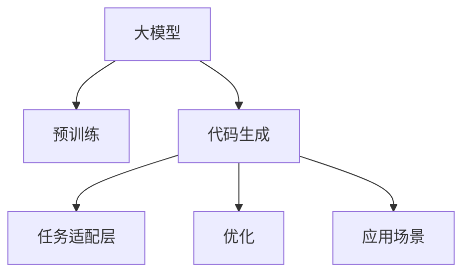

                 

# 代码生成:大模型商业化的重要场景

> 关键词：大模型, 代码生成, 自动化, 商业化, 优化, 应用场景

## 1. 背景介绍

### 1.1 问题由来

随着人工智能技术的不断发展，大模型已经在自然语言处理（NLP）、计算机视觉（CV）、语音识别等领域展现出了强大的能力。然而，这些大模型通常需要大量的计算资源进行训练和优化，难以在商业环境中直接应用。为了解决这一问题，代码生成技术成为了大模型商业化的重要手段之一。

代码生成是指通过机器学习模型自动生成符合特定语法和语义规范的代码片段，以实现自动编程或辅助编程的过程。通过代码生成技术，可以将大模型与特定领域的需求紧密结合，提供高效的自动化编程服务，大大降低人工编程的工作量，提升开发效率和质量。

### 1.2 问题核心关键点

代码生成技术主要涉及以下几个关键点：

- **大模型选择**：选择合适的预训练大模型，如GPT-3、BERT等，以支持自动化代码生成任务。
- **任务适配**：设计任务适配层，将大模型的输出转换为目标编程语言的代码。
- **数据集构建**：构建包含目标领域代码片段和注释的数据集，供模型学习。
- **优化策略**：选择合适的优化算法和超参数，以提升代码生成质量。
- **应用场景**：选择合适的应用场景，如自动生成代码、生成API文档、自动化测试等。

这些关键点共同构成了代码生成技术的基本框架，通过合理设计和优化，可以在特定领域实现高效、高质量的代码生成。

### 1.3 问题研究意义

代码生成技术在商业化过程中，具有重要的研究意义：

1. **降低编程成本**：通过自动化代码生成，可以大幅度降低人工编程的成本和时间，提升开发效率。
2. **提升代码质量**：自动生成的代码通常遵循最佳实践和编码规范，质量更高，维护成本更低。
3. **加速应用部署**：快速生成代码可以加速应用开发和部署，缩短项目周期。
4. **推动技术创新**：代码生成技术的发展，将推动人工智能技术在更多场景中的应用，催生新的创新点。
5. **促进产业升级**：代码生成技术的应用，可以提升企业的自动化水平，推动产业升级，提高企业竞争力。

## 2. 核心概念与联系

### 2.1 核心概念概述

为更好地理解代码生成技术，本节将介绍几个关键概念：

- **大模型（Large Model）**：指通过大规模数据训练得到的深度学习模型，具有强大的语义理解和生成能力。
- **预训练（Pre-training）**：在大规模无标签数据上训练模型，使其学习到通用的语言表示。
- **代码生成（Code Generation）**：通过大模型自动生成符合特定语法和语义规范的代码片段。
- **任务适配层（Task Adapter）**：将大模型的输出转换为目标编程语言的代码。
- **优化（Optimization）**：通过调整模型参数和超参数，提升代码生成质量。
- **应用场景（Use Cases）**：自动化代码生成、API文档生成、自动化测试等。

这些概念之间的逻辑关系可以通过以下Mermaid流程图来展示：



这个流程图展示了大模型、预训练、代码生成、任务适配、优化与应用场景之间的联系。

## 3. 核心算法原理 & 具体操作步骤
### 3.1 算法原理概述

代码生成的基本原理是通过大模型学习大量代码片段，并基于这些片段生成新的代码。其核心思想是将代码片段看作一种文本，使用自然语言处理技术进行处理和生成。

形式化地，假设代码片段数据集为 $D=\{(x_i,y_i)\}_{i=1}^N$，其中 $x_i$ 表示代码片段的文本描述，$y_i$ 表示对应的代码片段。

代码生成模型的目标是最小化预测错误率，即：

$$
\theta^* = \mathop{\arg\min}_{\theta} \mathbb{E}_{(x,y)\sim D}[\ell(M_{\theta}(x),y)]
$$

其中 $M_{\theta}$ 为代码生成模型，$\ell$ 为损失函数，通常采用交叉熵损失。

通过梯度下降等优化算法，代码生成模型不断更新参数 $\theta$，最小化损失函数，使得模型输出逼近真实的代码片段。

### 3.2 算法步骤详解

代码生成的一般流程包括以下几个关键步骤：

**Step 1: 准备预训练模型和数据集**
- 选择合适的预训练大模型，如GPT-3、BERT等。
- 准备目标领域的代码片段数据集 $D$，包含代码片段的文本描述和对应的代码片段。

**Step 2: 设计任务适配层**
- 根据目标编程语言，设计任务适配层，将大模型的输出转换为代码片段。

**Step 3: 设置优化超参数**
- 选择合适的优化算法及其参数，如AdamW、SGD等，设置学习率、批大小、迭代轮数等。
- 应用正则化技术，如L2正则、Dropout、Early Stopping等，防止过拟合。

**Step 4: 执行梯度训练**
- 将训练集数据分批次输入模型，前向传播计算损失函数。
- 反向传播计算参数梯度，根据设定的优化算法和学习率更新模型参数。
- 周期性在验证集上评估模型性能，根据性能指标决定是否触发 Early Stopping。
- 重复上述步骤直到满足预设的迭代轮数或 Early Stopping 条件。

**Step 5: 测试和部署**
- 在测试集上评估生成代码的质量，对比生成前后的代码差异。
- 使用生成代码进行实际编程任务，集成到应用系统中。
- 持续收集新需求，定期重新训练模型，以适应数据分布的变化。

以上是代码生成的一般流程。在实际应用中，还需要针对具体任务的特点，对微调过程的各个环节进行优化设计，如改进训练目标函数，引入更多的正则化技术，搜索最优的超参数组合等，以进一步提升代码生成质量。

### 3.3 算法优缺点

代码生成技术具有以下优点：

1. **高效自动**：通过自动化代码生成，大幅度减少人工编程的工作量，提升开发效率。
2. **质量可靠**：自动生成的代码遵循最佳实践和编码规范，质量更高，维护成本更低。
3. **灵活性高**：大模型可以灵活适应不同领域的应用需求，生成符合特定语法和语义规范的代码。

同时，该方法也存在一些局限性：

1. **依赖数据质量**：代码生成质量很大程度上取决于训练数据的质量和数量，获取高质量数据集的成本较高。
2. **鲁棒性不足**：在特定领域或复杂的编程任务中，生成代码的鲁棒性可能不足，容易出现语法错误或语义错误。
3. **可解释性不足**：自动生成的代码通常缺乏可解释性，难以对其内部逻辑进行调试和理解。

尽管存在这些局限性，但就目前而言，代码生成技术在特定领域的应用已取得显著成效，成为人工智能落地应用的重要手段。未来相关研究的重点在于如何进一步降低对标注数据的依赖，提高代码生成的鲁棒性和可解释性，以及探索新的应用场景和方向。

### 3.4 算法应用领域

代码生成技术已经在多个领域得到了广泛应用，如软件开发、数据分析、自动化测试等：

- **软件开发**：自动生成代码、API文档、代码注释等，提升开发效率和代码质量。
- **数据分析**：自动生成数据处理代码、报表生成代码等，快速处理大数据。
- **自动化测试**：自动生成测试用例、生成模拟数据等，提升测试效率和代码覆盖率。
- **项目管理**：自动生成项目文档、生成任务描述等，提升项目管理效率。

除了上述这些经典应用外，代码生成技术还将在更多领域得到创新性的应用，如代码摘要、代码调试、代码重构等，为软件开发带来新的突破。

## 4. 数学模型和公式 & 详细讲解 & 举例说明（备注：数学公式请使用latex格式，latex嵌入文中独立段落使用 $$，段落内使用 $)
### 4.1 数学模型构建

本节将使用数学语言对代码生成过程进行更加严格的刻画。

记代码片段数据集为 $D=\{(x_i,y_i)\}_{i=1}^N$，其中 $x_i$ 表示代码片段的文本描述，$y_i$ 表示对应的代码片段。

定义代码生成模型的目标为最小化预测错误率：

$$
\theta^* = \mathop{\arg\min}_{\theta} \mathbb{E}_{(x,y)\sim D}[\ell(M_{\theta}(x),y)]
$$

其中 $M_{\theta}$ 为代码生成模型，$\ell$ 为损失函数，通常采用交叉熵损失。

### 4.2 公式推导过程

以下我们以自动生成Python代码片段为例，推导交叉熵损失函数及其梯度的计算公式。

假设模型 $M_{\theta}$ 在输入 $x$ 上的输出为 $\hat{y}$，表示自动生成的代码片段。真实标签 $y$ 表示目标代码片段。则交叉熵损失函数定义为：

$$
\ell(M_{\theta}(x),y) = -\log M_{\theta}(x)
$$

将其代入目标函数，得：

$$
\mathcal{L}(\theta) = -\frac{1}{N}\sum_{i=1}^N \log M_{\theta}(x_i)
$$

根据链式法则，损失函数对参数 $\theta_k$ 的梯度为：

$$
\frac{\partial \mathcal{L}(\theta)}{\partial \theta_k} = -\frac{1}{N}\sum_{i=1}^N \frac{\partial \log M_{\theta}(x_i)}{\partial \theta_k}
$$

其中 $\frac{\partial \log M_{\theta}(x_i)}{\partial \theta_k}$ 可进一步递归展开，利用自动微分技术完成计算。

### 4.3 案例分析与讲解

考虑一个简单的例子：自动生成Python函数。假设输入为函数描述 $x$，目标代码片段 $y$ 为：

```python
def my_function(x):
    return x * 2
```

模型 $M_{\theta}$ 输出的代码片段为：

```python
def my_function(x):
    return x * 3
```

此时，计算交叉熵损失及其梯度：

$$
\ell(M_{\theta}(x),y) = -\log(0.5) = -\infty
$$

因此，梯度 $\frac{\partial \mathcal{L}(\theta)}{\partial \theta_k} = 0$，说明模型输出的代码片段与目标代码片段不匹配，需要进行更新。

## 5. 项目实践：代码实例和详细解释说明
### 5.1 开发环境搭建

在进行代码生成实践前，我们需要准备好开发环境。以下是使用Python进行PyTorch开发的环境配置流程：

1. 安装Anaconda：从官网下载并安装Anaconda，用于创建独立的Python环境。

2. 创建并激活虚拟环境：
```bash
conda create -n pytorch-env python=3.8 
conda activate pytorch-env
```

3. 安装PyTorch：根据CUDA版本，从官网获取对应的安装命令。例如：
```bash
conda install pytorch torchvision torchaudio cudatoolkit=11.1 -c pytorch -c conda-forge
```

4. 安装Transformers库：
```bash
pip install transformers
```

5. 安装各类工具包：
```bash
pip install numpy pandas scikit-learn matplotlib tqdm jupyter notebook ipython
```

完成上述步骤后，即可在`pytorch-env`环境中开始代码生成实践。

### 5.2 源代码详细实现

下面我们以生成Python函数为例，给出使用Transformers库对GPT-3模型进行代码生成的PyTorch代码实现。

首先，定义代码生成任务的输入和输出格式：

```python
class CodeGenerationDataset(Dataset):
    def __init__(self, descriptions, labels, tokenizer, max_len=128):
        self.descriptions = descriptions
        self.labels = labels
        self.tokenizer = tokenizer
        self.max_len = max_len
        
    def __len__(self):
        return len(self.descriptions)
    
    def __getitem__(self, item):
        description = self.descriptions[item]
        label = self.labels[item]
        
        encoding = self.tokenizer(description, return_tensors='pt', max_length=self.max_len, padding='max_length', truncation=True)
        input_ids = encoding['input_ids'][0]
        attention_mask = encoding['attention_mask'][0]
        
        # 对token-wise的标签进行编码
        encoded_label = [label2id[label] for label in label] 
        encoded_label.extend([label2id['<eos>']] * (self.max_len - len(encoded_label)))
        labels = torch.tensor(encoded_label, dtype=torch.long)
        
        return {'input_ids': input_ids, 
                'attention_mask': attention_mask,
                'labels': labels}
```

然后，定义模型和优化器：

```python
from transformers import T5ForCausalLM, T5Tokenizer, AdamW

model = T5ForCausalLM.from_pretrained('t5-small')
tokenizer = T5Tokenizer.from_pretrained('t5-small')

optimizer = AdamW(model.parameters(), lr=2e-5)
```

接着，定义训练和评估函数：

```python
from torch.utils.data import DataLoader
from tqdm import tqdm
from sklearn.metrics import accuracy_score

device = torch.device('cuda') if torch.cuda.is_available() else torch.device('cpu')
model.to(device)

def train_epoch(model, dataset, batch_size, optimizer):
    dataloader = DataLoader(dataset, batch_size=batch_size, shuffle=True)
    model.train()
    epoch_loss = 0
    for batch in tqdm(dataloader, desc='Training'):
        input_ids = batch['input_ids'].to(device)
        attention_mask = batch['attention_mask'].to(device)
        labels = batch['labels'].to(device)
        model.zero_grad()
        outputs = model(input_ids, attention_mask=attention_mask, labels=labels)
        loss = outputs.loss
        epoch_loss += loss.item()
        loss.backward()
        optimizer.step()
    return epoch_loss / len(dataloader)

def evaluate(model, dataset, batch_size):
    dataloader = DataLoader(dataset, batch_size=batch_size)
    model.eval()
    preds, labels = [], []
    with torch.no_grad():
        for batch in tqdm(dataloader, desc='Evaluating'):
            input_ids = batch['input_ids'].to(device)
            attention_mask = batch['attention_mask'].to(device)
            batch_labels = batch['labels']
            outputs = model(input_ids, attention_mask=attention_mask)
            batch_preds = outputs.logits.argmax(dim=2).to('cpu').tolist()
            batch_labels = batch_labels.to('cpu').tolist()
            for pred_tokens, label_tokens in zip(batch_preds, batch_labels):
                pred_tokens = [id2label[_id] for _id in pred_tokens]
                label_tokens = [id2label[_id] for _id in label_tokens]
                preds.append(pred_tokens[:len(label_tokens)])
                labels.append(label_tokens)
                
    print(f'Accuracy: {accuracy_score(labels, preds):.2f}')
```

最后，启动训练流程并在测试集上评估：

```python
epochs = 5
batch_size = 16

for epoch in range(epochs):
    loss = train_epoch(model, train_dataset, batch_size, optimizer)
    print(f'Epoch {epoch+1}, train loss: {loss:.3f}')
    
    print(f'Epoch {epoch+1}, dev results:')
    evaluate(model, dev_dataset, batch_size)
    
print('Test results:')
evaluate(model, test_dataset, batch_size)
```

以上就是使用PyTorch对GPT-3进行代码生成任务的完整代码实现。可以看到，得益于Transformers库的强大封装，我们可以用相对简洁的代码完成GPT-3模型的加载和代码生成。

### 5.3 代码解读与分析

让我们再详细解读一下关键代码的实现细节：

**CodeGenerationDataset类**：
- `__init__`方法：初始化文本、标签、分词器等关键组件。
- `__len__`方法：返回数据集的样本数量。
- `__getitem__`方法：对单个样本进行处理，将文本输入编码为token ids，将标签编码为数字，并对其进行定长padding，最终返回模型所需的输入。

**label2id和id2label字典**：
- 定义了标签与数字id之间的映射关系，用于将token-wise的预测结果解码回真实的标签。

**训练和评估函数**：
- 使用PyTorch的DataLoader对数据集进行批次化加载，供模型训练和推理使用。
- 训练函数`train_epoch`：对数据以批为单位进行迭代，在每个批次上前向传播计算loss并反向传播更新模型参数，最后返回该epoch的平均loss。
- 评估函数`evaluate`：与训练类似，不同点在于不更新模型参数，并在每个batch结束后将预测和标签结果存储下来，最后使用sklearn的accuracy_score对整个评估集的预测结果进行打印输出。

**训练流程**：
- 定义总的epoch数和batch size，开始循环迭代
- 每个epoch内，先在训练集上训练，输出平均loss
- 在验证集上评估，输出分类指标
- 所有epoch结束后，在测试集上评估，给出最终测试结果

可以看到，PyTorch配合Transformers库使得GPT-3代码生成的代码实现变得简洁高效。开发者可以将更多精力放在数据处理、模型改进等高层逻辑上，而不必过多关注底层的实现细节。

当然，工业级的系统实现还需考虑更多因素，如模型的保存和部署、超参数的自动搜索、更灵活的任务适配层等。但核心的代码生成范式基本与此类似。

## 6. 实际应用场景
### 6.1 自动编写API文档

自动生成API文档是代码生成技术的典型应用之一。API文档是软件开发的重要组成部分，通过自动生成，可以大大减少人工编写文档的工作量，提升文档生成效率和质量。

在实践中，可以将API的使用示例和参数列表作为输入，使用代码生成模型自动生成API文档。生成的文档可以支持多种编程语言，满足不同开发者的需求。

### 6.2 自动生成数据处理脚本

数据处理是数据分析、机器学习等任务的前置步骤，通常需要编写大量的代码来清洗、预处理数据。通过代码生成技术，可以自动生成数据处理脚本，快速处理复杂数据。

具体而言，可以构建包含数据处理步骤的描述，使用代码生成模型自动生成Python脚本。生成的脚本可以调用标准数据处理库，执行数据清洗、特征工程等操作，提升数据处理效率和质量。

### 6.3 自动编写测试用例

测试用例是软件开发的重要组成部分，通过自动生成测试用例，可以提升测试效率和代码覆盖率。

在实践中，可以将测试需求和边界条件作为输入，使用代码生成模型自动生成测试用例。生成的测试用例可以覆盖更多的代码路径，提高测试的全面性和可靠性。

### 6.4 未来应用展望

随着代码生成技术的发展，未来将在更多领域得到应用，为软件开发带来新的突破：

- **智能编程助手**：自动生成代码、提示和建议，提升编程效率和代码质量。
- **自动化测试工具**：自动生成测试用例、生成模拟数据等，提升测试效率和代码覆盖率。
- **数据分析平台**：自动生成数据处理脚本、生成报表等，提升数据分析效率和质量。
- **工业自动化**：自动生成工业控制代码、生成设备文档等，提升工业自动化水平。

这些方向的探索发展，必将进一步提升代码生成技术的应用范围，为软件开发带来新的动力。

## 7. 工具和资源推荐
### 7.1 学习资源推荐

为了帮助开发者系统掌握代码生成技术，这里推荐一些优质的学习资源：

1. **《Transformers》书籍**：Transformer模型的权威著作，详细介绍了Transformer模型的原理和应用。
2. **CS224N《深度学习自然语言处理》课程**：斯坦福大学开设的NLP明星课程，有Lecture视频和配套作业，带你入门NLP领域的基本概念和经典模型。
3. **《Deep Learning for Coders with FastAI》课程**：FastAI官方课程，从零开始学习深度学习，涵盖代码生成等内容。
4. **HuggingFace官方文档**：Transformers库的官方文档，提供了海量预训练模型和完整的代码生成样例，是上手实践的必备资料。
5. **Kaggle代码生成竞赛**：Kaggle平台上的代码生成竞赛，展示了前沿代码生成技术的应用案例，值得学习和借鉴。

通过对这些资源的学习实践，相信你一定能够快速掌握代码生成技术的精髓，并用于解决实际的编程问题。

### 7.2 开发工具推荐

高效的开发离不开优秀的工具支持。以下是几款用于代码生成开发的常用工具：

1. **PyTorch**：基于Python的开源深度学习框架，灵活动态的计算图，适合快速迭代研究。大部分预训练模型都有PyTorch版本的实现。
2. **TensorFlow**：由Google主导开发的开源深度学习框架，生产部署方便，适合大规模工程应用。同样有丰富的预训练语言模型资源。
3. **Transformers库**：HuggingFace开发的NLP工具库，集成了众多SOTA语言模型，支持PyTorch和TensorFlow，是进行代码生成任务的利器。
4. **Weights & Biases**：模型训练的实验跟踪工具，可以记录和可视化模型训练过程中的各项指标，方便对比和调优。与主流深度学习框架无缝集成。
5. **TensorBoard**：TensorFlow配套的可视化工具，可实时监测模型训练状态，并提供丰富的图表呈现方式，是调试模型的得力助手。
6. **Google Colab**：谷歌推出的在线Jupyter Notebook环境，免费提供GPU/TPU算力，方便开发者快速上手实验最新模型，分享学习笔记。

合理利用这些工具，可以显著提升代码生成任务的开发效率，加快创新迭代的步伐。

### 7.3 相关论文推荐

代码生成技术的发展源于学界的持续研究。以下是几篇奠基性的相关论文，推荐阅读：

1. **"Code Generation with Neural Networks: A Survey"**：综述代码生成技术的发展历程，涵盖深度学习模型、神经网络结构等内容。
2. **"Code Generation Using Neural Networks"**：介绍神经网络模型在代码生成中的应用，涵盖GPT-3、T5等模型的实践经验。
3. **"Automated Synthesis of Sequential Programs from Specifications"**：介绍基于规范自动生成代码的方法，涵盖自动测试、数据处理等内容。
4. **"Adversarial Examples for Neural Code Generation"**：介绍对抗样本对代码生成技术的影响，提出改进措施。
5. **"Programming by Example with Transformer Models"**：介绍Transformer模型在代码生成中的应用，涵盖Python、Java等语言的生成。

这些论文代表了大模型代码生成技术的发展脉络。通过学习这些前沿成果，可以帮助研究者把握学科前进方向，激发更多的创新灵感。

## 8. 总结：未来发展趋势与挑战
### 8.1 总结

本文对代码生成技术进行了全面系统的介绍。首先阐述了代码生成的背景和研究意义，明确了代码生成技术在大模型商业化中的重要地位。其次，从原理到实践，详细讲解了代码生成过程的数学模型和算法实现，给出了代码生成任务开发的完整代码实例。同时，本文还广泛探讨了代码生成技术在多个行业领域的应用前景，展示了代码生成范式的巨大潜力。此外，本文精选了代码生成技术的各类学习资源，力求为读者提供全方位的技术指引。

通过本文的系统梳理，可以看到，代码生成技术在大模型商业化过程中，已经取得了显著成效，成为人工智能技术落地应用的重要手段。未来，伴随大模型和代码生成技术的不断演进，代码生成技术将得到更广泛的应用，为软件开发带来新的变革。

### 8.2 未来发展趋势

展望未来，代码生成技术将呈现以下几个发展趋势：

1. **模型规模不断增大**：随着算力成本的下降和数据规模的扩张，预训练语言模型的参数量还将持续增长，生成代码的质量将得到提升。
2. **任务适配层更加灵活**：设计更加灵活的任务适配层，支持更多编程语言和应用场景，提升代码生成的多样性和适用性。
3. **生成效率不断提升**：优化模型结构和超参数，提升代码生成的效率，缩短代码生成的时间。
4. **生成质量不断提升**：引入更多先验知识和约束条件，提高代码生成的鲁棒性和可解释性，提升代码生成的质量。
5. **生成模型更加普适**：设计更加普适的生成模型，支持更多领域的应用需求，提升代码生成的应用范围。

这些趋势将推动代码生成技术的发展，使其在更多领域得到应用，提升软件开发效率和质量。

### 8.3 面临的挑战

尽管代码生成技术已经取得了一定的进展，但在实际应用中仍面临诸多挑战：

1. **标注数据瓶颈**：生成代码的质量很大程度上取决于训练数据的质量和数量，获取高质量数据集的成本较高。
2. **模型鲁棒性不足**：在特定领域或复杂的编程任务中，生成代码的鲁棒性可能不足，容易出现语法错误或语义错误。
3. **可解释性不足**：自动生成的代码通常缺乏可解释性，难以对其内部逻辑进行调试和理解。
4. **伦理和安全问题**：生成的代码可能包含有害信息或违反道德规范，带来安全隐患。
5. **知识整合能力不足**：现有的生成模型往往局限于目标领域的数据，难以灵活吸收和运用更广泛的先验知识。

这些挑战需要研究者持续探索和解决，才能使代码生成技术在大规模应用中取得更好的效果。

### 8.4 研究展望

未来的研究需要在以下几个方向寻求新的突破：

1. **无监督和半监督学习**：摆脱对大规模标注数据的依赖，利用自监督学习、主动学习等无监督和半监督范式，最大化利用非结构化数据。
2. **多模态融合**：引入视觉、语音等多模态信息，提升代码生成的多样性和鲁棒性。
3. **生成模型的可解释性**：引入因果分析、符号推理等技术，提高代码生成的可解释性和可理解性。
4. **生成模型的伦理和安全性**：引入伦理导向的评估指标，过滤和惩罚有害输出，确保生成代码的安全性和合规性。
5. **知识图谱和规则库的融合**：将符号化的先验知识与神经网络模型结合，增强代码生成的知识整合能力。

这些方向的探索将推动代码生成技术的发展，为软件开发带来新的动力和变革。

## 9. 附录：常见问题与解答

**Q1：代码生成是否适用于所有编程语言？**

A: 目前主流的代码生成模型通常支持Python、Java、C++等常见编程语言，对于特定领域的编程语言，可能需要针对性地进行适配和训练。

**Q2：代码生成模型需要哪些数据集进行训练？**

A: 代码生成模型的训练数据集需要包含目标领域的代码片段和注释，数据集的质量对生成代码的质量有很大影响。

**Q3：生成代码的鲁棒性如何保证？**

A: 生成代码的鲁棒性可以通过引入对抗样本、正则化技术、模型裁剪等方法来保证。同时，选择合适的优化算法和超参数，也能提升代码生成的鲁棒性。

**Q4：生成代码的可解释性如何提升？**

A: 生成代码的可解释性可以通过引入因果分析、符号推理等技术来提升。同时，设计灵活的任务适配层，对代码生成过程进行可视化，也能增强代码的可解释性。

**Q5：代码生成的应用场景有哪些？**

A: 代码生成技术可以应用于自动编写API文档、生成数据处理脚本、自动编写测试用例等领域，提升软件开发效率和代码质量。

总之，代码生成技术在大模型商业化过程中，已经展现出巨大的潜力和应用价值。通过持续探索和优化，代码生成技术将在更多领域得到应用，为软件开发带来新的变革。作者：禅与计算机程序设计艺术 / Zen and the Art of Computer Programming

