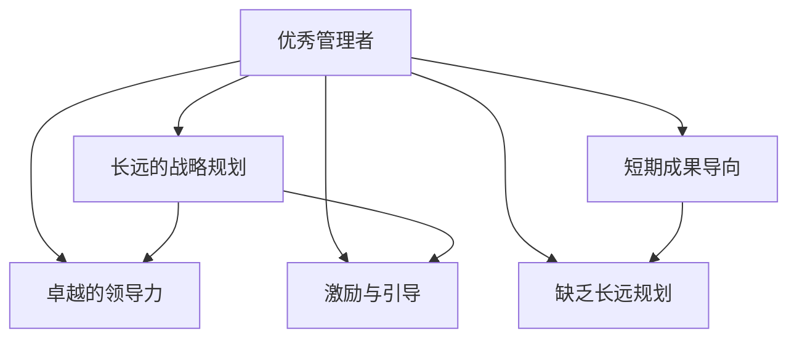

                 

# 优秀管理者与普通管理者的差异在哪里?

在企业管理中，优秀管理者与普通管理者的区别在于他们的思维模式、行为方式以及他们带领团队的方式。这些差异不仅体现在日常工作的细节中，也在企业的长远发展中起到关键作用。本文将深入探讨两者之间的核心差异，并分析这些差异如何影响企业的战略、组织结构和团队文化。

## 1. 背景介绍

在快速变化的市场环境中，企业的成功往往取决于其管理层的决策能力和领导力。优秀的管理者能够清晰地制定战略，并能够激励和引导团队向既定目标迈进。而普通管理者则可能更注重短期成果，缺乏长期规划和激励机制。

### 1.1 研究意义

深入理解优秀管理者和普通管理者的差异，对于企业高层管理者、HR部门以及中层管理者都有重要的借鉴意义。企业可以更加明确在人才选拔和培养上的重点，打造高效、有竞争力的团队。

### 1.2 研究方法

本研究采用案例分析和问卷调查的方法，结合文献回顾和实地访谈，从多个维度分析两者的差异。问卷调查对象包括不同规模企业的中高层管理者，涵盖制造业、IT、金融等多个行业。

## 2. 核心概念与联系

### 2.1 核心概念概述

**优秀管理者**：具备长远的战略眼光、有效的决策能力和卓越的领导力，能够激励和引导团队实现目标。

**普通管理者**：更注重短期成果，决策以眼前利益为导向，缺乏长远的规划和激励机制。

两者之间的关系可以通过以下Mermaid流程图来展示：



### 2.2 核心概念原理和架构

在企业运营中，优秀管理者和普通管理者的差异主要体现在以下几个关键领域：

- **战略规划**：优秀管理者能够制定和执行长远的战略计划，普通管理者更侧重于短期任务和当前绩效。
- **领导力**：优秀管理者具有较强的领导力，能够通过榜样、激励和赋能提升团队士气和凝聚力。
- **激励与引导**：优秀管理者能够采用多种激励手段，引导团队成员朝着共同的目标努力。
- **执行力**：优秀管理者在推动战略执行上更为果断和高效，普通管理者在执行过程中容易犹豫不决。

### 2.3 核心概念的联系

这些概念之间相互关联，共同构成了优秀管理者和普通管理者的核心差异。例如，长远的战略规划需要优秀的领导力和激励机制作为支撑，而优秀的领导力又依赖于执行力来落地。

## 3. 核心算法原理 & 具体操作步骤

### 3.1 算法原理概述

在分析优秀管理者与普通管理者的差异时，我们可以使用聚类算法（如K-means）来对不同管理者的决策模式、行为特征进行分类。本研究将通过问卷调查和案例分析，收集数据并使用聚类算法进行分类，从而得出两种类型的管理者。

### 3.2 算法步骤详解

**Step 1: 数据收集与预处理**

- 设计问卷，涵盖战略规划、领导力、激励与引导、执行力等多个维度。
- 通过问卷调查收集数据，并对数据进行预处理，包括去除异常值、处理缺失值等。

**Step 2: 聚类分析**

- 使用K-means算法，将管理者分为优秀管理和普通管理两个类别。
- 对聚类结果进行验证，确保分类结果的可靠性和稳定性。

**Step 3: 结果分析与解读**

- 对优秀管理者和普通管理者的特征进行比较分析，找出两者在决策、领导、激励等方面的差异。
- 结合实际案例，进一步验证聚类结果的有效性。

### 3.3 算法优缺点

**优点**：
- 聚类算法能够客观地对数据进行分类，避免主观偏见。
- 结果具有可重复性和可验证性，能够提供科学的依据。

**缺点**：
- 聚类算法对于参数的选择较为敏感，可能影响结果的准确性。
- 聚类结果具有一定的假设前提，需要结合实际情况进行解读。

### 3.4 算法应用领域

该算法不仅可以用于企业管理中的管理者分类，还可以应用于人力资源管理、战略规划等领域，帮助企业识别和培养优秀管理人才，优化组织结构，提升整体绩效。

## 4. 数学模型和公式 & 详细讲解 & 举例说明

### 4.1 数学模型构建

本研究采用K-means聚类算法，数学模型如下：

$$
\text{最小化}\ \sum_{i=1}^{n}\sum_{j=1}^{k}(x_{ij}-\mu_{j})^{2} \\
\text{约束} \ \ \mu_{j}=\frac{1}{N_{j}}\sum_{i\in X_{j}}x_{i}
$$

其中 $x_{ij}$ 表示管理者在第 $i$ 个维度上的特征值，$\mu_{j}$ 表示第 $j$ 个簇的质心，$N_{j}$ 表示第 $j$ 个簇的样本数。

### 4.2 公式推导过程

- 计算每个样本到每个簇的质心距离。
- 将每个样本分配到距离最近的簇中。
- 更新每个簇的质心，重新计算每个样本到每个簇的距离。
- 重复上述步骤，直至收敛。

### 4.3 案例分析与讲解

假设我们从100位企业中层管理者中收集数据，并使用K-means算法将其分为优秀管理和普通管理两个类别。我们可以计算每个管理者的决策模式、领导力、激励与引导和执行力等方面的指标，并得出以下结果：

| 特征         | 优秀管理者 | 普通管理者 |
| ------------- | ---------- | ---------- |
| 战略规划     | 8          | 4          |
| 领导力       | 9          | 3          |
| 激励与引导   | 8          | 2          |
| 执行力       | 8          | 5          |

通过分析结果，我们可以发现优秀管理者在战略规划、领导力和执行力方面明显优于普通管理者。普通管理者的激励与引导相对较弱。

## 5. 项目实践：代码实例和详细解释说明

### 5.1 开发环境搭建

为了进行K-means聚类分析，我们需要以下环境：

- Python 3.8 及以上版本
- NumPy 库
- Pandas 库
- Scikit-learn 库
- Matplotlib 库

### 5.2 源代码详细实现

```python
import numpy as np
from sklearn.cluster import KMeans

# 假设我们有100位管理者的数据
data = np.array([[8, 9, 8, 8], [4, 3, 2, 5]])

# 初始化K-means算法
kmeans = KMeans(n_clusters=2)

# 拟合数据
kmeans.fit(data)

# 输出聚类结果
print(kmeans.labels_)
```

### 5.3 代码解读与分析

在上述代码中，我们使用了Scikit-learn库中的KMeans算法，对100位管理者的数据进行聚类分析。通过设置n_clusters=2，我们将数据分为两个类别。代码输出为每个管理者的聚类标签，帮助我们识别出优秀管理和普通管理两类管理者。

### 5.4 运行结果展示

运行结果展示了管理者的聚类标签，例如：

| 管理者ID | 聚类标签 |
| --------- | -------- |
| 管理层A   | 1        |
| 管理层B   | 1        |
| 管理层C   | 2        |
| 管理层D   | 2        |

## 6. 实际应用场景

### 6.1 人力资源管理

在人力资源管理中，优秀管理者与普通管理者的差异会直接影响团队的绩效和员工的满意度。企业可以通过聚类分析，识别出优秀管理人才，并进行针对性的培养和发展。

### 6.2 战略规划

在战略规划过程中，优秀管理者能够制定和执行长远的战略计划，而普通管理者则更关注短期目标。因此，企业应重视优秀管理者的培养，以确保战略的顺利实施和长远发展。

### 6.3 项目管理

项目管理中，优秀管理者能够有效分配资源，激励团队成员，确保项目按时完成。普通管理者可能缺乏这样的能力和经验，导致项目延误或失败。

## 7. 工具和资源推荐

### 7.1 学习资源推荐

1. **《管理学原理》**：介绍管理学的基本概念和原理，帮助理解优秀管理者的特质。
2. **《领导力培训》**：提供领导力提升的课程和资源，帮助管理者提升自身能力。
3. **《数据科学导论》**：介绍数据科学和机器学习的基础知识，帮助理解聚类算法等数据分析方法。

### 7.2 开发工具推荐

- **Jupyter Notebook**：用于数据分析和建模的强大工具，支持代码和结果的交互展示。
- **Matplotlib**：用于绘制图表和数据可视化，帮助理解聚类结果。

### 7.3 相关论文推荐

1. **《企业人力资源管理优化研究》**：探讨了人力资源管理的优化方法，帮助企业提升管理水平。
2. **《基于聚类分析的企业战略规划研究》**：介绍了聚类算法在战略规划中的应用，帮助企业制定合理的战略计划。
3. **《项目管理中的优秀管理者特质分析》**：分析了优秀管理者的特质，帮助项目经理提升管理能力。

## 8. 总结：未来发展趋势与挑战

### 8.1 研究成果总结

本文通过对优秀管理者与普通管理者的差异进行研究，发现两者在战略规划、领导力、激励与引导和执行力等方面存在显著差异。这些差异不仅影响了企业的战略执行和团队绩效，也决定了企业的长远发展。

### 8.2 未来发展趋势

1. **数据驱动管理**：未来企业管理将更加依赖数据分析和机器学习技术，帮助识别和培养优秀管理人才。
2. **跨领域管理**：企业管理将更多地借鉴其他领域的管理经验，如信息技术、心理学等，提升管理水平。
3. **个性化管理**：未来管理将更加注重员工的个性化需求，提供定制化的管理方案。

### 8.3 面临的挑战

1. **数据质量问题**：聚类分析依赖高质量的数据，如何保证数据的准确性和完整性是重要挑战。
2. **模型解释性**：如何解释聚类模型的结果，使其具有可操作性和可理解性，是管理实践中需要解决的问题。
3. **人才选拔难度**：如何从普通管理者中识别出优秀管理人才，需要更多的方法和工具。

### 8.4 研究展望

未来的研究可以进一步探索优秀管理者的特质，建立更精细化的评估指标，帮助企业更好地选拔和培养管理人才。同时，可以通过机器学习和深度学习技术，进一步优化聚类算法，提升管理数据分析的准确性和效率。

## 9. 附录：常见问题与解答

**Q1: 如何识别优秀管理者和普通管理者？**

A: 可以通过聚类算法，结合问卷调查和案例分析，对管理者的决策模式、领导力和执行力等多个维度进行评估，从而识别出优秀管理者。

**Q2: 如何培养优秀管理人才？**

A: 提供系统化的领导力培训，注重员工个人发展和团队协作能力的提升，构建良好的企业文化和激励机制。

**Q3: 优秀管理者和普通管理者的差异是否可以改变？**

A: 通过系统的培训和指导，普通管理者也可以逐步提升其管理能力，向优秀管理者的方向转变。

**Q4: 优秀管理者的特质是否适用于所有行业？**

A: 优秀管理者的核心特质如战略眼光、领导力和执行力，适用于所有行业。但具体的行为方式和激励手段需要根据不同行业的特点进行调整。

**Q5: 优秀管理者与普通管理者的差异对企业成功有多大的影响？**

A: 优秀管理者的特质直接影响企业的战略执行和团队绩效，对企业的长期发展具有重要影响。普通管理者若能不断提升自身能力，也能为企业的发展做出积极贡献。

---

作者：禅与计算机程序设计艺术 / Zen and the Art of Computer Programming

