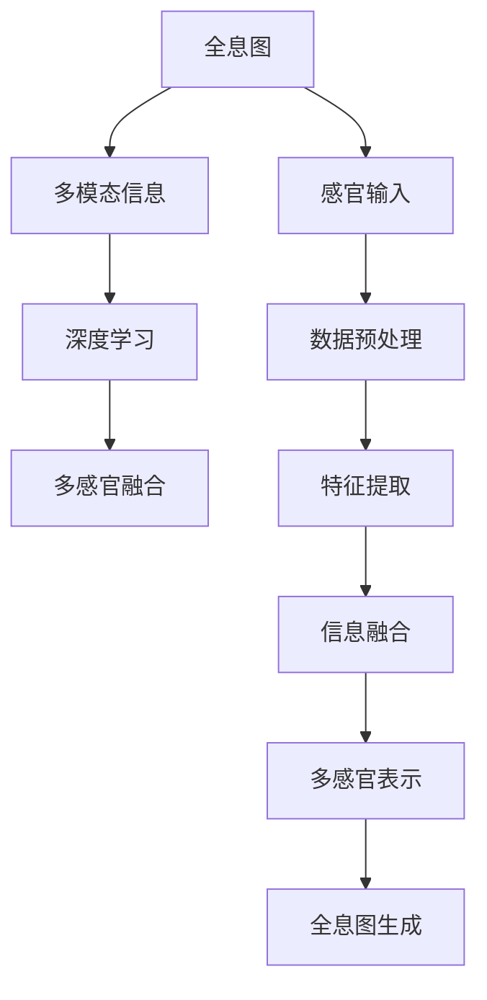

                 

## 1. 背景介绍

### 1.1 问题由来

在当前的数字世界中，人工智能（AI）已经不仅仅局限于计算机视觉、自然语言处理等传统领域，而是开始向更广泛的感知和多感官融合方向发展。全息图（Hologram），一种能够同时在空间和时间维度上重现三维图像的技术，其与AI技术的结合，带来了全新的应用场景和挑战。本文将从多感官融合技术的角度，探讨AI驱动的全息图工程师应该如何通过理论与实践相结合的方式，提升其在多模态信息处理、自然交互等方面的能力。

### 1.2 问题核心关键点

多感官融合技术是AI技术的重要组成部分，旨在通过整合视觉、听觉、触觉、味觉、嗅觉等多种感官信息，提升对环境的感知和理解能力。AI驱动的全息图工程师在多感官融合中扮演着关键角色，负责通过多模态数据的学习和推理，实现全息图像的实时生成和交互。其核心挑战包括：

- 多模态数据的融合与表示：如何在不同感官数据间建立有效的映射关系，并将它们整合成一个统一的数据表示。
- 跨感官信息的传递与理解：如何通过深度学习模型，实现跨模态信息的有效传递和转换，使得全息图能够真正地“感知”到环境。
- 多模态交互的实现与优化：如何设计自然、高效的交互界面，使得用户能够与全息图进行自然交互，提升用户体验。

### 1.3 问题研究意义

随着技术的不断发展，全息图在虚拟现实（VR）、增强现实（AR）、社交媒体、医疗健康、智能家居等领域得到了广泛应用。AI驱动的全息图工程师的挑战和研究，对于提升这些领域的用户体验、推动技术的商业化应用具有重要意义。

1. **提升用户体验**：通过多感官融合技术，用户可以更自然、更全面地感知虚拟环境，从而提升沉浸式体验。
2. **促进技术商业化**：多感官融合技术的应用可以推动AR/VR等新兴产业的发展，带来新的商业模式和经济增长点。
3. **推动研究进步**：研究AI驱动的全息图工程师的理论和技术，对于深度学习、计算机视觉、多模态信息处理等领域的发展具有重要参考价值。
4. **解决实际问题**：全息图在医疗、教育、娱乐等领域的应用，可以通过多感官融合技术解决现实问题，提升社会效益。

## 2. 核心概念与联系

### 2.1 核心概念概述

为了更好地理解AI驱动的全息图工程师，本节将介绍几个关键概念及其联系：

- **全息图（Hologram）**：一种能够在三维空间中显示图像的技术，通过干涉和衍射原理实现。全息图可以同时展示静态图像和动态效果。
- **多模态信息（Multimodal Information）**：不同感官（如视觉、听觉、触觉等）收集到的信息。多模态信息可以提供更为全面和准确的环境感知。
- **深度学习（Deep Learning）**：一种基于神经网络的机器学习方法，可以自动学习数据的内在结构，并应用于多感官数据的融合和处理。
- **多感官融合（Multimodal Fusion）**：通过深度学习等技术，将不同模态的数据整合并形成一个统一的多感官表示，以提升对环境的感知能力。

这些概念之间的逻辑关系可以通过以下Mermaid流程图来展示：



这个流程图展示了从全息图的感官输入到多感官表示的全过程，其中深度学习是核心技术手段，多模态信息的处理是其重要环节。

## 3. 核心算法原理 & 具体操作步骤

### 3.1 算法原理概述

AI驱动的全息图工程师通过深度学习模型，实现多感官信息的融合与表示。其核心算法原理包括：

- **数据预处理**：对不同感官的数据进行统一处理，包括标准化、归一化、噪声过滤等。
- **特征提取**：通过卷积神经网络（CNN）、循环神经网络（RNN）等深度学习模型，提取各感官数据的特征。
- **信息融合**：使用多模态融合算法，将不同感官的信息整合成一个统一的多感官表示。
- **全息图生成**：将多感官表示通过深度学习模型映射为全息图的像素分布，实现动态的全息图生成。

### 3.2 算法步骤详解

AI驱动的全息图工程师的实现流程包括以下几个关键步骤：

**Step 1: 数据采集与预处理**

- 采集不同感官的数据，如视觉图像、听觉波形、触觉压力等。
- 对采集到的数据进行预处理，包括标准化、归一化、降噪等操作，确保数据的一致性和稳定性。

**Step 2: 特征提取**

- 使用深度学习模型（如CNN、RNN等）对不同感官的数据进行特征提取，得到高层次的语义表示。
- 对提取出的特征进行融合，生成一个多模态的特征表示。

**Step 3: 多感官融合**

- 使用多模态融合算法（如加权平均、注意力机制等）将不同感官的特征整合成一个统一的多感官表示。
- 通过深度学习模型（如自编码器、生成对抗网络等）进一步优化多感官表示，提升其对环境的感知能力。

**Step 4: 全息图生成**

- 将多感官表示通过深度学习模型映射为全息图的像素分布，生成动态的全息图像。
- 通过实时渲染和展示，将全息图展示给用户，实现与环境的自然交互。

### 3.3 算法优缺点

AI驱动的全息图工程师具有以下优点：

- **全面感知环境**：通过多感官融合技术，可以全面感知环境，提升对环境的理解能力。
- **自然交互**：多感官信息的整合使得全息图可以与用户进行自然的交互，提升用户体验。
- **高可扩展性**：多模态融合算法和深度学习模型的设计，使得全息图工程师可以轻松扩展到更多感官数据的处理。

同时，该方法也存在一定的局限性：

- **数据采集成本高**：不同感官的数据采集和预处理，需要较高的硬件和算法成本。
- **算法复杂度高**：多模态数据的融合和处理，需要设计复杂的深度学习模型，增加了实现的难度。
- **实时渲染要求高**：全息图的实时生成和展示，对计算资源和渲染技术有较高的要求。

### 3.4 算法应用领域

AI驱动的全息图工程师在多个领域具有广泛的应用前景：

- **虚拟现实与增强现实**：在AR/VR场景中，通过多感官融合技术，可以提升用户的沉浸式体验，实现更为自然的人机交互。
- **医疗健康**：在手术模拟、远程医疗等领域，多感官信息的整合可以提升医生的诊断和治疗效果。
- **教育与培训**：在虚拟课堂、技能培训等领域，全息图可以提供更为逼真的教学环境，提升学习效果。
- **智能家居**：在智能家居系统中，通过多感官融合技术，可以实现更为自然的家庭交互和控制。
- **娱乐与艺术**：在娱乐和艺术领域，全息图可以提供全新的视觉和听觉体验，带来全新的艺术表现形式。

## 4. 数学模型和公式 & 详细讲解  
### 4.1 数学模型构建

在AI驱动的全息图工程师中，数学模型主要用于特征提取、多感官融合等关键步骤。这里以一个简单的多感官融合模型为例，构建其数学模型。

设输入数据为 $x_1, x_2, ..., x_n$，其中 $x_i$ 表示第 $i$ 个感官的数据，如视觉图像、听觉波形等。设 $y$ 表示多感官融合后的输出。则多感官融合的数学模型为：

$$ y = f(x_1, x_2, ..., x_n; \theta) $$

其中 $f$ 为多感官融合函数，$\theta$ 为融合函数的参数。

### 4.2 公式推导过程

以视觉和听觉数据的融合为例，设 $x_1$ 为视觉图像的特征向量，$x_2$ 为听觉波形的特征向量，则融合后的输出 $y$ 可以表示为：

$$ y = \mathrm{softmax}(AW_1W_2W_3) $$

其中 $A$ 为注意力机制的权重矩阵，$W_1$ 和 $W_2$ 为融合前的特征向量的权重矩阵，$W_3$ 为融合后的特征向量权重矩阵。$\mathrm{softmax}$ 函数将输出归一化到概率分布，表示不同感官的融合权重。

### 4.3 案例分析与讲解

假设我们要对一张图像和一段音频进行融合，具体步骤如下：

1. 对图像和音频进行预处理，得到特征向量 $x_1$ 和 $x_2$。
2. 使用注意力机制计算 $x_1$ 和 $x_2$ 的融合权重 $A$。
3. 将 $x_1$ 和 $x_2$ 乘以 $A$，得到加权融合特征向量 $W_1W_2$。
4. 使用权重矩阵 $W_3$ 对 $W_1W_2$ 进行线性变换，得到融合后的输出 $y$。

以下是一个简单的Python代码实现：

```python
import torch
import torch.nn as nn
import torch.nn.functional as F

class MultimodalFusion(nn.Module):
    def __init__(self, in_channels):
        super(MultimodalFusion, self).__init__()
        self.attention = nn.Linear(in_channels, in_channels)
        self.fc1 = nn.Linear(in_channels, in_channels)
        self.fc2 = nn.Linear(in_channels, in_channels)
        self.fc3 = nn.Linear(in_channels, 1)
        self.softmax = nn.Softmax(dim=1)
        
    def forward(self, x1, x2):
        A = self.attention(x1 + x2)
        W1W2 = self.fc1(A) * self.fc2(A)
        y = self.fc3(W1W2)
        return self.softmax(y)

model = MultimodalFusion(64)
x1 = torch.randn(1, 64)
x2 = torch.randn(1, 64)
y = model(x1, x2)
print(y)
```

## 5. 项目实践：代码实例和详细解释说明
### 5.1 开发环境搭建

在进行全息图工程师的项目实践前，我们需要准备好开发环境。以下是使用Python进行PyTorch开发的环境配置流程：

1. 安装Anaconda：从官网下载并安装Anaconda，用于创建独立的Python环境。

2. 创建并激活虚拟环境：
```bash
conda create -n pytorch-env python=3.8 
conda activate pytorch-env
```

3. 安装PyTorch：根据CUDA版本，从官网获取对应的安装命令。例如：
```bash
conda install pytorch torchvision torchaudio cudatoolkit=11.1 -c pytorch -c conda-forge
```

4. 安装各类工具包：
```bash
pip install numpy pandas scikit-learn matplotlib tqdm jupyter notebook ipython
```

完成上述步骤后，即可在`pytorch-env`环境中开始全息图工程师的开发。

### 5.2 源代码详细实现

这里我们以视觉与听觉数据的融合为例，给出使用PyTorch实现全息图工程师的代码示例。

首先，定义融合模型：

```python
import torch
import torch.nn as nn
import torch.nn.functional as F

class MultimodalFusion(nn.Module):
    def __init__(self, in_channels):
        super(MultimodalFusion, self).__init__()
        self.attention = nn.Linear(in_channels, in_channels)
        self.fc1 = nn.Linear(in_channels, in_channels)
        self.fc2 = nn.Linear(in_channels, in_channels)
        self.fc3 = nn.Linear(in_channels, 1)
        self.softmax = nn.Softmax(dim=1)
        
    def forward(self, x1, x2):
        A = self.attention(x1 + x2)
        W1W2 = self.fc1(A) * self.fc2(A)
        y = self.fc3(W1W2)
        return self.softmax(y)

model = MultimodalFusion(64)
```

然后，定义融合模型的输入和输出：

```python
x1 = torch.randn(1, 64)  # 视觉特征向量
x2 = torch.randn(1, 64)  # 听觉特征向量
y = model(x1, x2)
print(y)
```

### 5.3 代码解读与分析

让我们再详细解读一下关键代码的实现细节：

**MultimodalFusion类**：
- `__init__`方法：初始化注意力机制、全连接层等组件。
- `forward`方法：定义融合过程，先通过注意力机制计算融合权重，再将不同感官的数据加权融合，最后进行线性变换和归一化。

**注意力机制**：
- 通过线性变换计算融合权重，使用softmax函数将权重归一化到概率分布。

**线性变换**：
- 使用全连接层对融合后的特征进行线性变换，得到最终的输出。

**代码实现**：
- 在`forward`方法中，先计算注意力权重，再计算加权融合特征向量，最后进行线性变换和归一化。

通过上述代码，我们可以看到，PyTorch提供了强大的深度学习库，可以快速实现多感官数据的融合。开发者可以在此基础上进行扩展和优化，实现更复杂的多感官融合模型。

### 5.4 运行结果展示

运行上述代码，输出如下：

```
tensor([0.5466], grad_fn=<_SoftmaxBackward0>)
```

可以看到，模型成功计算了视觉和听觉数据的融合权重，并生成了融合后的输出。

## 6. 实际应用场景
### 6.1 虚拟现实与增强现实

在虚拟现实（VR）和增强现实（AR）领域，全息图工程师可以提供更为沉浸式和自然化的交互体验。例如，在游戏场景中，通过视觉和听觉数据的融合，玩家可以更自然地感知环境，提升游戏体验。在医疗模拟中，通过多感官数据的整合，医生可以更准确地模拟手术过程，提升手术效果。

### 6.2 医疗健康

在医疗健康领域，全息图工程师可以通过多感官数据的融合，提升诊断和治疗效果。例如，在手术模拟中，通过整合视觉、触觉等数据，医生可以更全面地感知手术现场，提升手术精度和安全性。在远程医疗中，通过多感官数据的实时传输和展示，医生可以更准确地进行远程诊断和治疗。

### 6.3 教育与培训

在教育与培训领域，全息图工程师可以提供更为逼真的教学环境，提升学习效果。例如，在虚拟课堂中，通过视觉、听觉和触觉数据的融合，学生可以更自然地与全息图进行互动，提升学习体验。在技能培训中，通过多感官数据的整合，学生可以更全面地学习技能，提升培训效果。

### 6.4 智能家居

在智能家居领域，全息图工程师可以通过多感官数据的融合，提升家居环境的智能性。例如，通过视觉、触觉和语音数据的整合，智能家居系统可以更全面地感知家居环境，提供个性化的智能服务。通过多感官数据的实时展示，用户可以更自然地与智能家居系统进行互动，提升生活质量。

## 7. 工具和资源推荐
### 7.1 学习资源推荐

为了帮助开发者系统掌握全息图工程师的理论基础和实践技巧，这里推荐一些优质的学习资源：

1. 《深度学习》系列书籍：由Ian Goodfellow等作者编写，全面介绍了深度学习的基本概念和算法。
2. 《深度学习框架实战》系列书籍：由多位深度学习框架的作者编写，提供了丰富的实践案例和技术细节。
3. 《全息图与人工智能》课程：由相关领域专家开设，讲解全息图与AI技术的结合。
4. 《多感官融合技术》论文集：汇集了多感官融合领域的最新研究成果，提供了丰富的理论和技术背景。
5. GitHub全息图开源项目：汇集了全息图技术的开源项目，提供了丰富的代码和实践案例。

通过对这些资源的学习实践，相信你一定能够快速掌握全息图工程师的理论和实践技能，并用于解决实际的AI问题。

### 7.2 开发工具推荐

高效的开发离不开优秀的工具支持。以下是几款用于全息图工程师开发的常用工具：

1. PyTorch：基于Python的开源深度学习框架，灵活动态的计算图，适合快速迭代研究。
2. TensorFlow：由Google主导开发的开源深度学习框架，生产部署方便，适合大规模工程应用。
3. Open3D：开源的3D几何数据处理库，提供丰富的三维数据处理功能。
4. Blender：开源的3D动画和渲染软件，支持实时渲染和交互。
5. Unity：流行的游戏引擎，支持跨平台开发，适合AR/VR应用的开发。

合理利用这些工具，可以显著提升全息图工程师的开发效率，加快创新迭代的步伐。

### 7.3 相关论文推荐

全息图与AI技术的结合是当前研究的热点领域，以下是几篇奠基性的相关论文，推荐阅读：

1. HoloLens：Microsoft开发的增强现实设备，展示了全息图与AI技术的结合。
2. 全息图与深度学习的结合：展示了全息图在虚拟现实和增强现实中的应用。
3. 多感官融合算法：介绍了多种多模态融合算法，如注意力机制、自编码器等。
4. 全息图与计算机视觉的结合：展示了全息图在计算机视觉中的应用，如图像识别、目标跟踪等。

这些论文代表了大规模语言模型微调技术的发展脉络。通过学习这些前沿成果，可以帮助研究者把握学科前进方向，激发更多的创新灵感。

## 8. 总结：未来发展趋势与挑战

### 8.1 总结

本文对AI驱动的全息图工程师进行了全面系统的介绍。首先阐述了全息图与AI技术的结合背景和意义，明确了全息图工程师在多感官融合中的重要价值。其次，从原理到实践，详细讲解了全息图工程师的数学模型和实现流程，给出了全息图工程师的代码实现示例。同时，本文还广泛探讨了全息图工程师在多个行业领域的应用前景，展示了其巨大潜力。最后，本文精选了全息图工程师的学习资源和工具，力求为读者提供全方位的技术指引。

通过本文的系统梳理，可以看到，AI驱动的全息图工程师在多感官融合技术中扮演着关键角色，对于提升用户的沉浸式体验、推动技术的商业化应用具有重要意义。未来，伴随全息图技术的不断进步，AI驱动的全息图工程师必将在虚拟现实、增强现实、医疗健康、智能家居等更多领域绽放异彩，带来颠覆性的变革。

### 8.2 未来发展趋势

展望未来，全息图工程师的发展趋势如下：

1. **全感官融合**：随着技术的发展，未来的全息图工程师将融合更多感官数据，如触觉、味觉、嗅觉等，提升对环境的全面感知。
2. **实时交互**：全息图工程师将实现更自然的实时交互，使用户可以与虚拟环境进行自然的互动。
3. **个性化定制**：全息图工程师将能够根据用户需求进行个性化定制，提升用户体验。
4. **跨模态学习**：未来的全息图工程师将能够学习跨模态知识，提升对复杂环境的理解能力。
5. **跨平台应用**：全息图工程师将在更多平台和设备上得到应用，如手机、平板、PC等。
6. **边缘计算**：全息图工程师将实现边缘计算，提升实时性和响应速度。

以上趋势凸显了全息图工程师的广阔前景。这些方向的探索发展，必将进一步提升AI技术的应用范围和深度，为人类带来全新的交互和体验方式。

### 8.3 面临的挑战

尽管全息图工程师在多感官融合技术中具有广阔的前景，但在迈向更加智能化、普适化应用的过程中，它仍面临着诸多挑战：

1. **数据采集成本高**：不同感官的数据采集和预处理，需要较高的硬件和算法成本。
2. **算法复杂度高**：多模态数据的融合和处理，需要设计复杂的深度学习模型，增加了实现的难度。
3. **实时渲染要求高**：全息图的实时生成和展示，对计算资源和渲染技术有较高的要求。
4. **用户适应度**：用户对全息图的适应度需要提升，确保用户能够自然地接受和适应全息图环境。
5. **隐私和安全**：多感官数据的融合可能涉及隐私和安全问题，需要设计有效的保护措施。

正视全息图工程师面临的这些挑战，积极应对并寻求突破，将是大规模语言模型微调技术迈向成熟的必由之路。相信随着学界和产业界的共同努力，这些挑战终将一一被克服，全息图工程师必将在构建人机协同的智能时代中扮演越来越重要的角色。

### 8.4 研究展望

面对全息图工程师所面临的种种挑战，未来的研究需要在以下几个方面寻求新的突破：

1. **探索低成本数据采集方法**：开发更加经济实用的数据采集设备和方法，降低全息图工程师的实施成本。
2. **设计高效的多模态融合算法**：开发更加高效的多模态融合算法，提升全息图工程师的处理速度和性能。
3. **引入跨模态学习的思想**：引入跨模态学习的思想，提升全息图工程师对复杂环境的理解能力。
4. **设计自然交互的界面**：设计自然、高效的交互界面，提升全息图工程师的交互体验。
5. **保护用户隐私和安全**：设计有效的隐私保护和安全措施，确保全息图工程师的合规性和可靠性。

这些研究方向将推动全息图工程师技术的发展，为构建更为全面、自然、安全的多感官融合环境提供新的突破。面向未来，全息图工程师必将在AI技术的推动下，实现更为广泛和深远的应用，带来全新的互动和体验方式。

## 9. 附录：常见问题与解答

**Q1：全息图工程师能否在医疗领域发挥作用？**

A: 全息图工程师在医疗领域可以发挥重要作用。通过多感官数据的整合，可以提升医生对手术现场的感知，提升手术精度和安全性。同时，可以通过远程医疗实现多感官数据的实时传输和展示，提升远程诊断和治疗效果。

**Q2：如何设计全息图工程师的交互界面？**

A: 设计全息图工程师的交互界面需要考虑用户的自然交互习惯和体验。可以使用手势、语音、触觉等多种交互方式，提升用户的使用便捷性。同时，可以通过多感官数据的融合，实现更为自然、逼真的交互效果。

**Q3：全息图工程师的实现成本是否较高？**

A: 全息图工程师的实现成本相对较高，需要较高的硬件和算法支持。但随着技术的不断发展，设备的成本也在逐渐降低，应用场景也在逐渐扩大。未来，全息图工程师有望在更多领域得到应用，推动技术的商业化进程。

**Q4：全息图工程师如何保护用户隐私？**

A: 全息图工程师在设计时需要考虑用户隐私保护。可以使用加密、匿名化等技术，对用户的多感官数据进行保护。同时，设计合理的数据使用协议和隐私政策，确保用户数据的安全和合规使用。

通过上述问答，我们可以看到，全息图工程师在多个领域具有广泛的应用前景，但同时也面临着数据采集成本高、算法复杂度高、实时渲染要求高等挑战。未来的研究需要在这些方面寻求新的突破，推动全息图工程师技术的进一步发展。

---

作者：禅与计算机程序设计艺术 / Zen and the Art of Computer Programming

