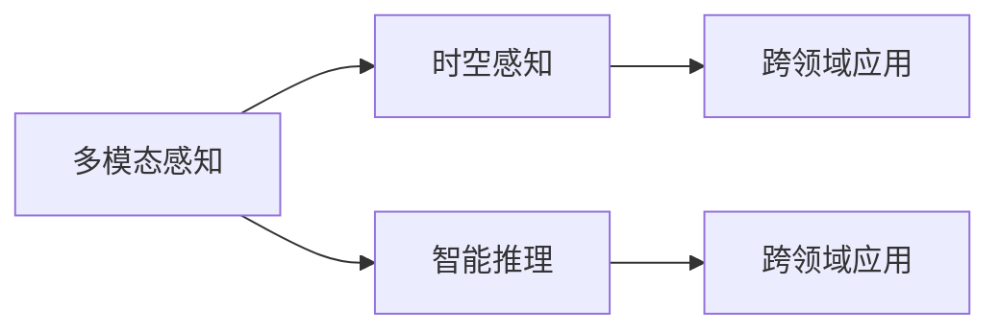

                 

## 1. 背景介绍

### 1.1 问题由来

随着人工智能技术的快速发展，AI在各个领域的应用已经逐渐深入，从传统的图像识别、语音识别，到当前的自然语言处理、情感分析、推荐系统，以及未来的自动驾驶、机器人等，AI的感知能力正在以惊人的速度拓展。在感知领域的边界不断拓展中，AI正在逐渐拥有更加复杂和深入的感知能力，并且能够跨越时间和空间的限制，实现对世界的全面理解和交互。

### 1.2 问题核心关键点

当前AI的感知边界拓展主要集中在以下几个方面：

- **多模态感知**：AI已经能够处理和理解图像、语音、文本等多种模态的信息，并且能够将不同模态的信息进行融合，提高感知能力。
- **时空感知**：AI不仅能够感知当前的视觉和语音信息，还能够通过时间序列分析、历史数据挖掘等方式，获得对时间和空间的感知能力。
- **智能推理**：AI能够通过学习和推理，实现对复杂问题的理解和解决，如自动驾驶、智能机器人等。
- **跨领域应用**：AI的感知能力正在向更多的领域拓展，如医疗、金融、教育等，并且能够实现跨领域的应用。

这些核心关键点不仅代表了AI技术的发展方向，也展示了AI在未来各个领域的应用潜力。

## 2. 核心概念与联系

### 2.1 核心概念概述

在AI的感知边界拓展过程中，涉及到一些核心的概念和技术：

- **多模态感知**：指AI能够处理和理解多种模态的信息，如视觉、语音、文本等，并将不同模态的信息进行融合。
- **时空感知**：指AI能够通过时间序列分析、历史数据挖掘等方式，获得对时间和空间的感知能力。
- **智能推理**：指AI能够通过学习和推理，实现对复杂问题的理解和解决，如自动驾驶、智能机器人等。
- **跨领域应用**：指AI的感知能力正在向更多的领域拓展，如医疗、金融、教育等，并且能够实现跨领域的应用。

这些概念和技术相互关联，共同构成了AI在感知领域的能力体系。

### 2.2 核心概念原理和架构的 Mermaid 流程图



这个流程图展示了多模态感知、时空感知、智能推理和跨领域应用之间的逻辑关系。多模态感知是基础，时空感知和智能推理在此基础上进一步提升，而跨领域应用则是AI感知能力拓展的最终目标。

## 3. 核心算法原理 & 具体操作步骤

### 3.1 算法原理概述

AI的感知边界拓展主要依赖于深度学习技术，特别是在计算机视觉、自然语言处理和语音识别等领域。以下是几个核心的算法原理：

- **卷积神经网络（CNN）**：用于处理图像和视频等多模态数据，通过卷积操作提取特征。
- **循环神经网络（RNN）**：用于处理时间序列数据，如自然语言和时间序列数据，通过循环操作捕捉时间依赖性。
- **Transformer**：用于处理序列数据，如自然语言和语音，通过自注意力机制捕捉序列之间的依赖关系。
- **深度强化学习**：用于实现智能推理和决策，通过奖励机制和环境反馈优化模型。

这些算法原理在AI的感知边界拓展中扮演了关键角色。

### 3.2 算法步骤详解

AI的感知边界拓展一般包括以下几个关键步骤：

**Step 1: 数据收集与预处理**

- 收集各个领域的数据，并进行数据清洗和预处理，确保数据的可用性和一致性。

**Step 2: 模型选择与设计**

- 选择适合的深度学习模型，并进行模型设计和优化，如卷积神经网络、循环神经网络、Transformer等。

**Step 3: 特征提取与融合**

- 通过卷积、循环或自注意力机制提取数据特征，并进行多模态特征的融合。

**Step 4: 训练与优化**

- 使用收集的数据对模型进行训练，并通过各种优化技术如正则化、Dropout、学习率调度等优化模型性能。

**Step 5: 评估与部署**

- 在测试集上评估模型性能，并进行必要的调整，然后将模型部署到实际应用中。

### 3.3 算法优缺点

**优点**：

- **多模态数据处理能力**：AI能够处理和理解多种模态的信息，提高感知能力。
- **时空感知能力**：通过时间序列分析和历史数据挖掘，AI能够获得对时间和空间的感知能力。
- **智能推理能力**：通过学习和推理，AI能够实现对复杂问题的理解和解决。

**缺点**：

- **数据需求高**：AI需要大量的标注数据进行训练，尤其是在跨领域应用中，数据收集和标注成本高。
- **模型复杂度高**：深度学习模型的复杂度高，训练和推理成本高。
- **模型泛化能力有限**：AI的模型在特定领域或数据集上的泛化能力有限，需要持续优化和改进。

### 3.4 算法应用领域

AI的感知边界拓展已经广泛应用于以下几个领域：

- **医疗领域**：通过多模态感知和智能推理，AI能够辅助医生进行诊断和治疗决策。
- **金融领域**：通过时空感知和跨领域应用，AI能够进行风险管理和投资决策。
- **教育领域**：通过多模态感知和智能推理，AI能够提供个性化学习和智能辅导。
- **自动驾驶**：通过多模态感知和智能推理，AI能够实现自动驾驶和智能交通管理。

## 4. 数学模型和公式 & 详细讲解 & 举例说明

### 4.1 数学模型构建

AI的感知边界拓展涉及多个数学模型，以下以卷积神经网络和循环神经网络为例进行详细讲解。

**卷积神经网络（CNN）**

卷积神经网络主要用于处理图像和视频数据，其基本结构包括卷积层、池化层和全连接层。卷积层通过卷积操作提取特征，池化层通过降采样操作减少特征维度和提高计算效率，全连接层用于分类和回归任务。

**循环神经网络（RNN）**

循环神经网络主要用于处理时间序列数据，其基本结构包括循环层、激活函数和全连接层。循环层通过循环操作捕捉时间依赖性，激活函数用于非线性变换，全连接层用于分类和回归任务。

### 4.2 公式推导过程

**卷积神经网络（CNN）**

卷积神经网络的数学模型如下：

$$
f(x) = \sum_{i=1}^{n} W_i x_i
$$

其中，$x$ 为输入向量，$W$ 为权重矩阵，$f(x)$ 为输出向量。

**循环神经网络（RNN）**

循环神经网络的数学模型如下：

$$
h_t = f(h_{t-1}, x_t)
$$

其中，$h_t$ 为隐藏状态向量，$f$ 为激活函数，$x_t$ 为输入向量。

### 4.3 案例分析与讲解

以图像分类任务为例，使用卷积神经网络进行图像分类。首先，将图像数据输入卷积层进行卷积操作，提取图像特征。然后，通过池化层进行降采样，减少特征维度和提高计算效率。最后，通过全连接层进行分类，输出分类结果。

## 5. 项目实践：代码实例和详细解释说明

### 5.1 开发环境搭建

在进行AI感知边界拓展的实践前，我们需要准备好开发环境。以下是使用Python进行TensorFlow开发的环境配置流程：

1. 安装Anaconda：从官网下载并安装Anaconda，用于创建独立的Python环境。

2. 创建并激活虚拟环境：
```bash
conda create -n tf-env python=3.8 
conda activate tf-env
```

3. 安装TensorFlow：根据CUDA版本，从官网获取对应的安装命令。例如：
```bash
conda install tensorflow -c pytorch -c conda-forge
```

4. 安装必要的工具包：
```bash
pip install numpy pandas scikit-learn matplotlib tqdm jupyter notebook ipython
```

完成上述步骤后，即可在`tf-env`环境中开始AI感知边界拓展的实践。

### 5.2 源代码详细实现

这里我们以图像分类任务为例，使用TensorFlow进行卷积神经网络的实现。

首先，定义卷积神经网络的结构：

```python
import tensorflow as tf
from tensorflow.keras import layers, models

model = models.Sequential()

model.add(layers.Conv2D(32, (3, 3), activation='relu', input_shape=(28, 28, 1)))
model.add(layers.MaxPooling2D((2, 2)))

model.add(layers.Conv2D(64, (3, 3), activation='relu'))
model.add(layers.MaxPooling2D((2, 2)))

model.add(layers.Conv2D(64, (3, 3), activation='relu'))
model.add(layers.MaxPooling2D((2, 2)))

model.add(layers.Flatten())

model.add(layers.Dense(64, activation='relu'))
model.add(layers.Dense(10))
```

然后，定义数据集和模型训练：

```python
from tensorflow.keras.datasets import mnist
from tensorflow.keras.utils import to_categorical

(x_train, y_train), (x_test, y_test) = mnist.load_data()

x_train = x_train.reshape((x_train.shape[0], 28, 28, 1))
x_test = x_test.reshape((x_test.shape[0], 28, 28, 1))

y_train = to_categorical(y_train)
y_test = to_categorical(y_test)

model.compile(optimizer='adam', loss='categorical_crossentropy', metrics=['accuracy'])

model.fit(x_train, y_train, epochs=10, validation_data=(x_test, y_test))
```

最后，进行模型评估：

```python
model.evaluate(x_test, y_test)
```

以上就是使用TensorFlow对卷积神经网络进行图像分类任务微调的完整代码实现。可以看到，TensorFlow提供了丰富的API，使得神经网络模型的搭建和训练变得简洁高效。

### 5.3 代码解读与分析

让我们再详细解读一下关键代码的实现细节：

**卷积神经网络（CNN）**

```python
model = models.Sequential()

model.add(layers.Conv2D(32, (3, 3), activation='relu', input_shape=(28, 28, 1)))
model.add(layers.MaxPooling2D((2, 2)))

model.add(layers.Conv2D(64, (3, 3), activation='relu'))
model.add(layers.MaxPooling2D((2, 2)))

model.add(layers.Conv2D(64, (3, 3), activation='relu'))
model.add(layers.MaxPooling2D((2, 2)))

model.add(layers.Flatten())

model.add(layers.Dense(64, activation='relu'))
model.add(layers.Dense(10))
```

**数据集和模型训练**

```python
from tensorflow.keras.datasets import mnist
from tensorflow.keras.utils import to_categorical

(x_train, y_train), (x_test, y_test) = mnist.load_data()

x_train = x_train.reshape((x_train.shape[0], 28, 28, 1))
x_test = x_test.reshape((x_test.shape[0], 28, 28, 1))

y_train = to_categorical(y_train)
y_test = to_categorical(y_test)

model.compile(optimizer='adam', loss='categorical_crossentropy', metrics=['accuracy'])

model.fit(x_train, y_train, epochs=10, validation_data=(x_test, y_test))
```

可以看到，TensorFlow的API非常简洁，可以通过几个简单的API调用完成神经网络的搭建和训练。开发者可以将更多精力放在模型优化和调试上，而不必过多关注底层的实现细节。

## 6. 实际应用场景

### 6.1 智能医疗

在智能医疗领域，AI的感知边界拓展可以通过多模态感知和智能推理实现。例如，使用卷积神经网络和循环神经网络处理医疗影像和电子病历数据，辅助医生进行疾病诊断和治疗决策。AI可以分析患者的症状、体征和影像数据，提供初步诊断和治疗建议，减少医生的工作负担，提高诊断和治疗的准确性和效率。

### 6.2 金融风控

在金融风控领域，AI的感知边界拓展可以通过时空感知和跨领域应用实现。例如，使用循环神经网络处理金融市场的历史数据，捕捉市场波动和趋势，预测股票和基金的涨跌。AI还可以分析客户的交易行为和信用记录，评估其信用风险，制定个性化的金融产品和服务。

### 6.3 智能教育

在智能教育领域，AI的感知边界拓展可以通过多模态感知和智能推理实现。例如，使用卷积神经网络和循环神经网络处理学生的学习记录和考试数据，分析学生的学习行为和知识掌握情况。AI可以提供个性化的学习建议和辅导，帮助学生提升学习效果和成绩。

### 6.4 自动驾驶

在自动驾驶领域，AI的感知边界拓展可以通过多模态感知和智能推理实现。例如，使用卷积神经网络和循环神经网络处理摄像头和雷达的数据，捕捉交通场景和物体信息。AI可以分析交通规则和环境信息，制定驾驶策略，实现自动驾驶和智能交通管理。

## 7. 工具和资源推荐

### 7.1 学习资源推荐

为了帮助开发者系统掌握AI感知边界拓展的理论基础和实践技巧，这里推荐一些优质的学习资源：

1. **《深度学习》书籍**：Ian Goodfellow等著，详细介绍了深度学习的基本概念和算法原理，是深度学习入门的经典教材。
2. **《Python深度学习》书籍**：Francois Chollet等著，通过代码和实例详细讲解了TensorFlow的使用方法和应用场景。
3. **《自然语言处理综论》课程**：斯坦福大学开设的NLP明星课程，涵盖自然语言处理的基本概念和前沿技术。
4. **深度学习在线课程**：Coursera、edX等在线平台提供了丰富的深度学习课程，包括TensorFlow和PyTorch等主流框架的使用方法和应用场景。
5. **Kaggle竞赛平台**：提供了丰富的数据集和竞赛任务，可以锻炼和提升数据处理和模型训练能力。

通过对这些资源的学习实践，相信你一定能够快速掌握AI感知边界拓展的精髓，并用于解决实际的AI问题。

### 7.2 开发工具推荐

高效的开发离不开优秀的工具支持。以下是几款用于AI感知边界拓展开发的常用工具：

1. **TensorFlow**：由Google主导开发的深度学习框架，支持分布式计算和GPU加速，适用于大规模深度学习模型的开发和训练。
2. **PyTorch**：由Facebook主导开发的深度学习框架，灵活动态，支持多种深度学习模型的开发和训练。
3. **Keras**：由Francois Chollet主导开发的高级深度学习框架，提供了简洁的API和丰富的预训练模型，适合快速原型开发。
4. **MXNet**：由Apache主导开发的深度学习框架，支持多种深度学习模型的开发和训练，具有高效的分布式计算能力。
5. **Jupyter Notebook**：一个基于浏览器的交互式笔记本，支持Python、R等语言，方便开发和分享代码和数据。

合理利用这些工具，可以显著提升AI感知边界拓展任务的开发效率，加快创新迭代的步伐。

### 7.3 相关论文推荐

AI感知边界拓展涉及多个前沿研究方向，以下是几篇奠基性的相关论文，推荐阅读：

1. **ImageNet Large Scale Visual Recognition Challenge (ILSVRC)**：AlexNet等深度学习模型的突破，展示了深度学习在图像分类任务中的强大能力。
2. **Speech Recognition with Deep Recurrent Neural Networks**：RNN在语音识别任务中的突破，展示了深度学习在时间序列数据中的强大能力。
3. **Attention is All You Need (Transformer)**：Transformer结构在自然语言处理任务中的突破，展示了深度学习在序列数据中的强大能力。
4. **Multi-task Learning using Prediction-to-Anchor Neural Networks**：跨领域学习的突破，展示了深度学习在多任务学习中的强大能力。
5. **Deep Reinforcement Learning for Playing Go**：深度强化学习在复杂决策任务中的突破，展示了深度学习在智能推理中的强大能力。

这些论文代表了AI感知边界拓展技术的发展脉络。通过学习这些前沿成果，可以帮助研究者把握学科前进方向，激发更多的创新灵感。

## 8. 总结：未来发展趋势与挑战

### 8.1 总结

本文对AI感知边界拓展进行了全面系统的介绍。首先阐述了AI感知边界拓展的研究背景和意义，明确了感知拓展在提升AI能力、拓展应用场景方面的独特价值。其次，从原理到实践，详细讲解了感知拓展的数学模型和关键步骤，给出了感知边界拓展任务开发的完整代码实例。同时，本文还广泛探讨了感知拓展方法在智能医疗、金融风控、智能教育等多个行业领域的应用前景，展示了感知边界拓展范式的巨大潜力。此外，本文精选了感知边界拓展技术的各类学习资源，力求为读者提供全方位的技术指引。

通过本文的系统梳理，可以看到，AI的感知边界拓展技术正在成为AI技术的重要方向，极大地拓展了AI的感知能力，为AI在各个领域的应用提供了新的可能性。未来，伴随深度学习技术的不断演进，AI的感知边界拓展必将在更广泛的领域大放异彩，为人类认知智能的进化带来深远影响。

### 8.2 未来发展趋势

展望未来，AI的感知边界拓展将呈现以下几个发展趋势：

1. **多模态感知能力提升**：AI将进一步提升对多种模态数据的处理能力，如图像、语音、文本、视频等，实现跨模态的感知和理解。
2. **时空感知能力增强**：AI将进一步提升对时间和空间的感知能力，如时间序列分析、历史数据挖掘等，实现对复杂动态环境的理解和适应。
3. **智能推理能力突破**：AI将进一步突破智能推理的瓶颈，如自动驾驶、智能机器人等，实现更加复杂和灵活的决策和推理。
4. **跨领域应用拓展**：AI的感知能力将进一步拓展到更多领域，如医疗、金融、教育、安全等，实现跨领域的应用和优化。
5. **计算资源优化**：AI将进一步优化计算资源，如加速器、分布式计算等，提升感知边界拓展任务的计算效率和可扩展性。

以上趋势凸显了AI感知边界拓展技术的广阔前景。这些方向的探索发展，必将进一步提升AI的感知能力，为构建人机协同的智能时代提供新的技术支撑。

### 8.3 面临的挑战

尽管AI的感知边界拓展技术已经取得了显著进展，但在迈向更加智能化、普适化应用的过程中，它仍面临诸多挑战：

1. **数据需求高**：AI的感知边界拓展需要大量的标注数据，尤其是跨领域和复杂任务的数据，数据收集和标注成本高。
2. **模型复杂度高**：深度学习模型的复杂度高，训练和推理成本高。
3. **模型泛化能力有限**：AI的模型在特定领域或数据集上的泛化能力有限，需要持续优化和改进。
4. **模型鲁棒性不足**：AI的模型在面对复杂和动态环境时，鲁棒性不足，容易出现误判和失效。
5. **模型解释性不足**：AI的模型缺乏可解释性，难以理解和解释模型的决策逻辑。

这些挑战需要研究者不断探索和突破，才能实现AI感知边界拓展技术的广泛应用。

### 8.4 研究展望

面对AI感知边界拓展所面临的挑战，未来的研究需要在以下几个方面寻求新的突破：

1. **无监督学习和自监督学习**：探索无监督和自监督学习范式，降低对标注数据的依赖，提升模型的泛化能力。
2. **模型压缩和优化**：开发更加高效的模型压缩和优化技术，降低计算资源消耗，提升模型的推理效率。
3. **跨模态和多模态学习**：研究跨模态和多模态学习技术，提升AI对多种模态数据的处理和理解能力。
4. **动态感知和学习**：研究动态感知和学习技术，提升AI对动态环境的适应和响应能力。
5. **模型可解释性提升**：提升AI模型的可解释性，增强其决策逻辑的可理解性和可解释性。

这些研究方向的探索，必将引领AI感知边界拓展技术迈向更高的台阶，为构建安全、可靠、可解释、可控的智能系统铺平道路。面向未来，AI感知边界拓展技术还需要与其他人工智能技术进行更深入的融合，如知识表示、因果推理、强化学习等，多路径协同发力，共同推动自然语言理解和智能交互系统的进步。只有勇于创新、敢于突破，才能不断拓展AI的感知边界，让智能技术更好地造福人类社会。

## 9. 附录：常见问题与解答

**Q1: 大语言模型微调是否适用于所有NLP任务？**

A: 大语言模型微调在大多数NLP任务上都能取得不错的效果，特别是对于数据量较小的任务。但对于一些特定领域的任务，如医学、法律等，仅仅依靠通用语料预训练的模型可能难以很好地适应。此时需要在特定领域语料上进一步预训练，再进行微调，才能获得理想效果。此外，对于一些需要时效性、个性化很强的任务，如对话、推荐等，微调方法也需要针对性的改进优化。

**Q2: 微调过程中如何选择合适的学习率？**

A: 微调的学习率一般要比预训练时小1-2个数量级，如果使用过大的学习率，容易破坏预训练权重，导致过拟合。一般建议从1e-5开始调参，逐步减小学习率，直至收敛。也可以使用warmup策略，在开始阶段使用较小的学习率，再逐渐过渡到预设值。需要注意的是，不同的优化器(如AdamW、Adafactor等)以及不同的学习率调度策略，可能需要设置不同的学习率阈值。

**Q3: 采用大模型微调时会面临哪些资源瓶颈？**

A: 目前主流的预训练大模型动辄以亿计的参数规模，对算力、内存、存储都提出了很高的要求。GPU/TPU等高性能设备是必不可少的，但即便如此，超大批次的训练和推理也可能遇到显存不足的问题。因此需要采用一些资源优化技术，如梯度积累、混合精度训练、模型并行等，来突破硬件瓶颈。同时，模型的存储和读取也可能占用大量时间和空间，需要采用模型压缩、稀疏化存储等方法进行优化。

**Q4: 如何缓解微调过程中的过拟合问题？**

A: 过拟合是微调面临的主要挑战，尤其是在标注数据不足的情况下。常见的缓解策略包括：
1. 数据增强：通过回译、近义替换等方式扩充训练集
2. 正则化：使用L2正则、Dropout、Early Stopping等避免过拟合
3. 对抗训练：引入对抗样本，提高模型鲁棒性
4. 参数高效微调：只调整少量参数(如Adapter、Prefix等)，减小过拟合风险
5. 多模型集成：训练多个微调模型，取平均输出，抑制过拟合

这些策略往往需要根据具体任务和数据特点进行灵活组合。只有在数据、模型、训练、推理等各环节进行全面优化，才能最大限度地发挥大模型微调的威力。

**Q5: 微调模型在落地部署时需要注意哪些问题？**

A: 将微调模型转化为实际应用，还需要考虑以下因素：
1. 模型裁剪：去除不必要的层和参数，减小模型尺寸，加快推理速度
2. 量化加速：将浮点模型转为定点模型，压缩存储空间，提高计算效率
3. 服务化封装：将模型封装为标准化服务接口，便于集成调用
4. 弹性伸缩：根据请求流量动态调整资源配置，平衡服务质量和成本
5. 监控告警：实时采集系统指标，设置异常告警阈值，确保服务稳定性
6. 安全防护：采用访问鉴权、数据脱敏等措施，保障数据和模型安全

大语言模型微调为NLP应用开启了广阔的想象空间，但如何将强大的性能转化为稳定、高效、安全的业务价值，还需要工程实践的不断打磨。唯有从数据、算法、工程、业务等多个维度协同发力，才能真正实现人工智能技术在垂直行业的规模化落地。总之，微调需要开发者根据具体任务，不断迭代和优化模型、数据和算法，方能得到理想的效果。

---

作者：禅与计算机程序设计艺术 / Zen and the Art of Computer Programming

