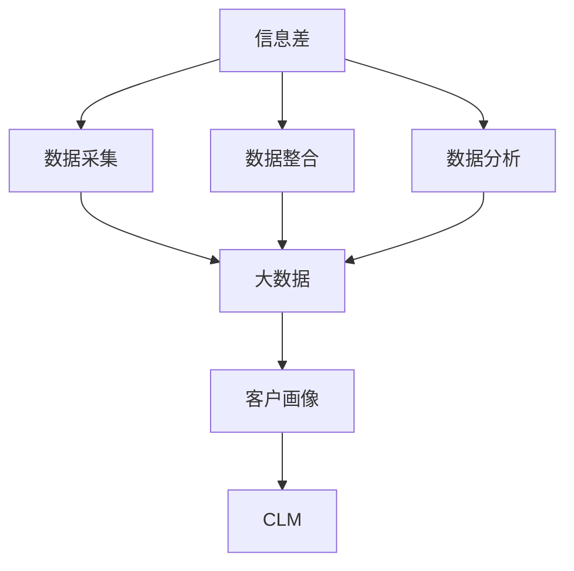

                 

# 信息差的商业客户生命周期管理：大数据如何管理客户生命周期

## 1. 背景介绍

### 1.1 问题由来

在现代商业环境中，客户生命周期管理（Customer Lifecycle Management, CLM）是企业提升客户满意度和忠诚度的重要手段。然而，由于信息差（Information Gap）的存在，企业在获取和分析客户信息时面临诸多挑战。信息差指在客户关系管理过程中，由于数据采集、数据整合、数据分析等环节的误差，导致企业无法准确把握客户需求和行为特征，从而影响决策和业务效果的现状。如何通过大数据技术，构建高效、准确、实时的客户关系管理系统，成为当前企业数字化转型的核心议题。

### 1.2 问题核心关键点

信息差主要体现在以下几个方面：
1. **数据采集偏差**：由于数据采集渠道和采集方式的多样性，不同来源的数据可能存在不一致性，影响数据的统一性和完整性。
2. **数据整合困难**：多个数据源产生的数据格式、结构各异，如何高效整合这些数据，形成统一的客户视图，是信息差管理的关键。
3. **数据分析局限**：现有数据处理技术在处理海量数据时，可能存在计算资源不足、算法精度有限等问题，导致数据分析结果不准确。
4. **数据隐私和安全**：客户数据涉及隐私和安全问题，如何在保障数据隐私的前提下，实现数据的高效利用和共享，是信息差管理的重要挑战。

解决这些关键点，需要构建一个全面、高效、安全的数据驱动的客户关系管理系统，通过大数据技术，实现客户数据的统一、准确、及时管理，提升客户满意度和忠诚度。

### 1.3 问题研究意义

大数据技术在客户生命周期管理中的应用，对于企业提升运营效率、优化客户体验、实现差异化竞争策略具有重要意义：

1. **提升运营效率**：通过大数据分析，企业可以准确把握客户需求和行为，制定精准的运营策略，提高客户满意度，减少客户流失。
2. **优化客户体验**：实时监控客户反馈和行为数据，及时调整产品和服务，提供个性化体验，提升客户粘性和忠诚度。
3. **实现差异化竞争**：通过深入分析客户行为和市场趋势，发现潜在商机，制定差异化竞争策略，占据市场领先地位。
4. **降低运营成本**：自动化数据分析和决策支持，减少人工干预，提高运营效率，降低企业运营成本。

## 2. 核心概念与联系

### 2.1 核心概念概述

为更好地理解大数据在客户生命周期管理中的应用，本节将介绍几个密切相关的核心概念：

- **客户生命周期管理 (Customer Lifecycle Management, CLM)**：指通过数据分析和管理技术，对客户从潜在客户到忠实客户的整个生命周期进行跟踪、分析和优化，提升客户满意度和忠诚度。
- **信息差 (Information Gap)**：指在客户关系管理过程中，由于数据采集、数据整合、数据分析等环节的误差，导致企业无法准确把握客户需求和行为特征的现状。
- **大数据 (Big Data)**：指从各种数据源收集的海量数据，通过先进的数据处理技术进行分析，以获取有价值的信息和洞察。
- **数据湖 (Data Lake)**：指一个集成的存储架构，用于存储、管理和分析大规模异构数据，支持数据的高效整合和快速访问。
- **客户画像 (Customer Persona)**：指通过数据整合和分析，构建的全面、详细的客户特征描述，用于指导营销和运营决策。

这些核心概念之间的逻辑关系可以通过以下Mermaid流程图来展示：



这个流程图展示了大数据在客户生命周期管理中的核心流程：

1. 从信息差中识别数据采集和整合的需求。
2. 通过大数据技术采集和整合客户数据。
3. 利用数据分析技术，生成客户画像。
4. 基于客户画像，进行客户生命周期管理。

这些概念共同构成了大数据在客户关系管理中的应用框架，使得企业能够通过数据驱动的方式，提升客户满意度和忠诚度，实现差异化竞争策略。

## 3. 核心算法原理 & 具体操作步骤

### 3.1 算法原理概述

大数据在客户生命周期管理中的应用，主要基于数据采集、数据整合、数据分析和客户画像构建等关键环节。其核心算法原理如下：

1. **数据采集算法**：通过多种数据采集渠道（如社交媒体、网站、交易记录等），获取客户行为和特征数据。
2. **数据整合算法**：将不同来源的数据进行格式转换和统一处理，消除数据冗余和误差，形成统一的客户视图。
3. **数据分析算法**：利用机器学习和统计分析技术，挖掘客户数据中的潜在模式和关系，生成客户画像。
4. **客户画像构建算法**：基于数据分析结果，构建全面、详细的客户画像，用于指导营销和运营决策。

### 3.2 算法步骤详解

基于大数据的客户生命周期管理，一般包括以下几个关键步骤：

**Step 1: 数据采集与预处理**

1. **选择数据源**：根据业务需求，选择适合的客户数据源，如社交媒体、电商平台、CRM系统等。
2. **数据清洗**：对采集到的数据进行去重、缺失值处理、异常值检测等预处理，确保数据质量。
3. **数据转换**：对不同数据源的数据格式进行统一处理，确保数据的一致性。

**Step 2: 数据整合与存储**

1. **数据集成**：使用ETL工具（Extract-Transform-Load）将不同来源的数据整合到数据湖中。
2. **数据存储**：将整合后的数据存储在分布式文件系统或数据库中，支持高并发访问和高效查询。
3. **数据治理**：建立数据治理机制，定义数据标准和规范，确保数据的质量和安全。

**Step 3: 数据分析与模型构建**

1. **数据探索**：对数据进行探索性分析，发现数据中的潜在模式和趋势。
2. **特征工程**：选择和构造适合模型的特征，提升模型预测精度。
3. **模型训练**：使用机器学习算法，训练客户画像模型，生成客户画像。
4. **模型评估**：对训练好的模型进行评估，选择最优模型进行后续应用。

**Step 4: 客户画像与CLM应用**

1. **客户画像生成**：基于训练好的模型，生成全面的客户画像，包含客户的基本信息、行为特征、购买历史等。
2. **CLM策略制定**：根据客户画像，制定针对性的营销和运营策略，提高客户满意度和忠诚度。
3. **持续优化**：定期更新客户数据，重新训练模型，不断优化客户画像和CLM策略。

### 3.3 算法优缺点

大数据在客户生命周期管理中的应用，具有以下优点：
1. **全面性**：通过大数据技术，可以全面收集和分析客户行为数据，生成细致的客户画像。
2. **实时性**：利用流处理和实时分析技术，可以实现对客户数据的实时监控和处理。
3. **高效性**：使用分布式计算和大规模机器学习算法，可以高效处理海量数据，提升分析效率。
4. **可扩展性**：大数据技术支持分布式存储和计算，可以适应企业数据量的不断增长。

同时，该方法也存在一些缺点：
1. **数据隐私问题**：客户数据涉及隐私和安全，处理不当可能引起法律和道德问题。
2. **数据质量问题**：数据采集和整合过程中，可能存在数据不一致、缺失等问题，影响数据分析结果。
3. **技术门槛高**：大数据技术涉及复杂的计算和算法，对技术要求较高，需要专业人才进行维护和优化。
4. **成本高**：大数据基础设施建设和管理需要投入大量资源，企业需要承担较高的成本。

尽管存在这些局限性，但就目前而言，大数据技术仍是大客户生命周期管理的重要手段。未来相关研究的重点在于如何进一步降低数据隐私风险，提高数据质量，降低技术门槛和成本，从而更好地推动客户关系管理的智能化和高效化。

### 3.4 算法应用领域

大数据技术在客户生命周期管理中的应用，已经覆盖了多个领域，包括但不限于：

- **电子商务**：通过大数据分析，提升用户购物体验，优化库存管理，提高销售转化率。
- **金融服务**：分析客户交易行为，制定个性化的金融产品和服务，提升客户满意度和忠诚度。
- **医疗健康**：利用客户健康数据，提供个性化健康服务，提升客户健康管理水平。
- **旅游出行**：通过数据分析，推荐个性化旅游路线和酒店，提升客户旅游体验。
- **娱乐媒体**：分析用户观看和消费数据，推荐个性化内容，提高用户粘性和满意度。

除了上述这些经典领域外，大数据技术在更多行业领域的应用也在不断拓展，如教育、农业、物流等，为不同行业带来了数字化转型的新机遇。

## 4. 数学模型和公式 & 详细讲解  
### 4.1 数学模型构建

本节将使用数学语言对大数据在客户生命周期管理中的应用进行更加严格的刻画。

记客户数据集为 $D=\{(x_i, y_i)\}_{i=1}^N, x_i \in X, y_i \in Y$，其中 $x_i$ 为客户的特征向量， $y_i$ 为客户的标签（如流失客户、高价值客户等）。假设客户画像模型为 $M_{\theta}$，其中 $\theta$ 为模型参数。

定义客户画像模型在数据样本 $(x,y)$ 上的损失函数为 $\ell(M_{\theta}(x),y)$，则在数据集 $D$ 上的经验风险为：

$$
\mathcal{L}(\theta) = \frac{1}{N}\sum_{i=1}^N \ell(M_{\theta}(x_i),y_i)
$$

其中 $\ell$ 为适合客户画像模型的损失函数，如交叉熵损失、均方误差损失等。

微调的目标是最小化经验风险，即找到最优参数：

$$
\theta^* = \mathop{\arg\min}_{\theta} \mathcal{L}(\theta)
$$

在实践中，我们通常使用基于梯度的优化算法（如SGD、Adam等）来近似求解上述最优化问题。设 $\eta$ 为学习率，$\lambda$ 为正则化系数，则参数的更新公式为：

$$
\theta \leftarrow \theta - \eta \nabla_{\theta}\mathcal{L}(\theta) - \eta\lambda\theta
$$

其中 $\nabla_{\theta}\mathcal{L}(\theta)$ 为损失函数对参数 $\theta$ 的梯度，可通过反向传播算法高效计算。

### 4.2 公式推导过程

以下我们以二分类客户画像模型为例，推导交叉熵损失函数及其梯度的计算公式。

假设客户画像模型 $M_{\theta}$ 在输入 $x$ 上的输出为 $\hat{y}=M_{\theta}(x) \in [0,1]$，表示客户属于正类的概率。真实标签 $y \in \{0,1\}$。则二分类交叉熵损失函数定义为：

$$
\ell(M_{\theta}(x),y) = -[y\log \hat{y} + (1-y)\log (1-\hat{y})]
$$

将其代入经验风险公式，得：

$$
\mathcal{L}(\theta) = -\frac{1}{N}\sum_{i=1}^N [y_i\log M_{\theta}(x_i)+(1-y_i)\log(1-M_{\theta}(x_i))]
$$

根据链式法则，损失函数对参数 $\theta_k$ 的梯度为：

$$
\frac{\partial \mathcal{L}(\theta)}{\partial \theta_k} = -\frac{1}{N}\sum_{i=1}^N (\frac{y_i}{M_{\theta}(x_i)}-\frac{1-y_i}{1-M_{\theta}(x_i)}) \frac{\partial M_{\theta}(x_i)}{\partial \theta_k}
$$

其中 $\frac{\partial M_{\theta}(x_i)}{\partial \theta_k}$ 可进一步递归展开，利用自动微分技术完成计算。

在得到损失函数的梯度后，即可带入参数更新公式，完成模型的迭代优化。重复上述过程直至收敛，最终得到适应客户画像的最优模型参数 $\theta^*$。

## 5. 项目实践：代码实例和详细解释说明
### 5.1 开发环境搭建

在进行大数据客户生命周期管理实践前，我们需要准备好开发环境。以下是使用Python进行PySpark开发的环境配置流程：

1. 安装Anaconda：从官网下载并安装Anaconda，用于创建独立的Python环境。

2. 创建并激活虚拟环境：
```bash
conda create -n spark-env python=3.8 
conda activate spark-env
```

3. 安装PySpark：根据CUDA版本，从官网获取对应的安装命令。例如：
```bash
conda install pyspark hdfs=2.4.0
```

4. 安装各类工具包：
```bash
pip install numpy pandas scikit-learn matplotlib tqdm jupyter notebook ipython
```

5. 配置PySpark：
```bash
spark-submit --master local[*] --py-files <your-py-files> spark_example.py
```

完成上述步骤后，即可在`spark-env`环境中开始大数据客户生命周期管理的实践。

### 5.2 源代码详细实现

这里我们以客户流失预测为例，给出使用PySpark进行大数据客户生命周期管理的代码实现。

首先，定义客户流失预测的特征工程函数：

```python
from pyspark.ml.feature import VectorAssembler
from pyspark.ml.classification import LogisticRegression
from pyspark.ml.evaluation import BinaryClassificationEvaluator
import pyspark.sql.functions as F

def feature_engineering(df):
    # 特征工程：构造新的特征列
    vector_assembler = VectorAssembler(inputCols=["age", "income", "purchase_frequency", "customer_age"], outputCol="features")
    df = vector_assembler.transform(df)
    
    # 数据标准化
    df = df.select([F.stddev("features").over(F.window(partitionId(), 10)), F.mean("features").over(F.window(partitionId(), 10))])
    
    # 构造标签列
    label_col = F.when(df["customer_age"] > 10, 1).otherwise(0)
    df = df.drop("customer_age", "purchase_frequency")
    
    return df

# 数据加载和预处理
spark = SparkSession.builder.getOrCreate()
df = spark.read.json("customer_data.json")

# 特征工程
df = feature_engineering(df)

# 数据分割
train_df, test_df = df.randomSplit([0.8, 0.2])
```

然后，定义客户流失预测模型并进行训练：

```python
from pyspark.ml.classification import LogisticRegression
from pyspark.ml.tuning import CrossValidator
from pyspark.ml.evaluation import BinaryClassificationEvaluator

# 定义逻辑回归模型
lr = LogisticRegression(featuresCol="features", labelCol="label", maxIter=10, regParam=0.3, elasticNetParam=0.8)

# 定义交叉验证器
crossval = CrossValidator(estimator=lr, evaluator=evaluator, numFolds=5)

# 训练模型
lr_model = crossval.fit(train_df)
```

接着，在测试集上评估模型性能：

```python
# 模型评估
predictions = lr_model.transform(test_df)
evaluator = BinaryClassificationEvaluator(predictionCol="prediction", labelCol="label", metricName="areaUnderROC")
auc = evaluator.evaluate(predictions)
print("AUC: ", auc)
```

最后，使用训练好的模型进行预测并生成客户画像：

```python
# 模型预测
df = spark.read.json("customer_data.json")
df = feature_engineering(df)

# 预测客户流失
df = lr_model.transform(df)
df = df.select(["id", "label", "probability"])
df.show()
```

以上就是使用PySpark进行大数据客户生命周期管理的完整代码实现。可以看到，得益于Spark的高效并行计算能力和丰富的机器学习库支持，代码实现变得简洁高效。

### 5.3 代码解读与分析

让我们再详细解读一下关键代码的实现细节：

**特征工程函数**：
- 构造新的特征列，将客户的基本信息、购买频率、年龄等数据进行组合，形成一个数值型特征向量。
- 对特征向量进行标准化处理，使用窗口函数计算特征向量的均值和标准差。
- 构造标签列，将客户流失与否转化为数值型标签。
- 删除不用的列，保持数据结构的简洁性。

**数据加载和预处理**：
- 使用Spark读取JSON格式的数据集，将其转换为DataFrame。
- 对DataFrame进行特征工程，生成用于模型训练和评估的特征向量。
- 使用randomSplit函数将数据集分割成训练集和测试集。

**模型训练和评估**：
- 定义逻辑回归模型，设置训练参数，如迭代次数、正则化参数等。
- 定义交叉验证器，使用5折交叉验证，评估模型的性能。
- 训练模型，并使用AUC作为评价指标，评估模型在测试集上的表现。

**预测与客户画像生成**：
- 使用训练好的模型进行预测，生成新的DataFrame。
- 选择需要的列，输出预测结果和对应概率。

可以看到，PySpark在处理大规模数据集时，提供了高效的分布式计算和数据处理能力，使得大数据客户生命周期管理的实现变得简洁高效。

当然，实际应用中还需考虑更多因素，如数据质量控制、模型选择和调优、生产环境的部署等。但核心的特征工程、模型训练和评估步骤，基本与此类似。

## 6. 实际应用场景
### 6.1 智能客服系统

大数据技术在智能客服系统中的应用，可以通过客户生命周期管理实现客户行为和需求的全面把握，从而提升客户服务质量。具体实现包括：

1. **客户分类**：通过数据分析，将客户按照流失概率和价值分为高、中、低三个等级，制定不同的服务策略。
2. **需求预测**：分析客户历史行为数据，预测客户未来需求，提前准备相应的服务和产品。
3. **服务优化**：实时监控客户反馈和行为数据，及时调整服务策略，提高客户满意度和忠诚度。

### 6.2 金融服务

大数据在金融服务中的应用，可以通过客户生命周期管理实现个性化服务和风险控制。具体实现包括：

1. **客户分层**：分析客户交易行为，识别高价值和潜在流失客户，提供差异化服务。
2. **风险预警**：利用客户画像预测潜在风险，提前采取措施，减少金融风险。
3. **产品推荐**：通过数据分析，推荐个性化的金融产品，提升客户粘性和满意度。

### 6.3 医疗健康

大数据在医疗健康中的应用，可以通过客户生命周期管理实现健康管理和精准医疗。具体实现包括：

1. **健康监测**：实时监控患者健康数据，发现异常情况，及时通知医生。
2. **疾病预测**：分析患者历史健康数据，预测疾病风险，提供预防措施。
3. **个性化治疗**：根据患者健康数据，制定个性化的治疗方案，提高治疗效果。

### 6.4 未来应用展望

随着大数据技术的不断发展，客户生命周期管理的应用前景将更加广阔：

1. **实时监控**：利用流处理和大数据技术，实现对客户行为的实时监控和分析，及时发现和解决客户问题。
2. **跨领域融合**：将客户画像和数据与其他领域数据（如社交媒体、物流等）进行融合，实现更全面的客户理解。
3. **人工智能结合**：结合人工智能技术，提升客户画像的准确性和预测能力，提供更个性化的服务。
4. **数据隐私保护**：采用数据匿名化和隐私保护技术，保障客户数据的安全性和隐私性。
5. **多模态数据融合**：将文本、图像、音频等多模态数据进行整合，全面了解客户行为和需求。

## 7. 工具和资源推荐
### 7.1 学习资源推荐

为了帮助开发者系统掌握大数据在客户生命周期管理中的应用，这里推荐一些优质的学习资源：

1. **《大数据技术与应用》系列博文**：由大数据专家撰写，详细介绍了大数据在各个领域的应用场景和实现方法。

2. **Coursera《大数据基础》课程**：由斯坦福大学教授开设，全面介绍了大数据的基本概念、技术和应用。

3. **《大数据时代》书籍**：由大数据专家撰写，介绍了大数据在商业、科技、医疗等多个领域的应用实例。

4. **Kaggle《大数据竞赛》**：提供丰富的数据集和模型，适合实践大数据处理和分析技能。

5. **Apache Spark官方文档**：Spark官方文档提供了详细的API文档和开发指南，是学习Spark的重要资源。

通过对这些资源的学习实践，相信你一定能够快速掌握大数据在客户生命周期管理中的应用，并用于解决实际的业务问题。

### 7.2 开发工具推荐

高效的开发离不开优秀的工具支持。以下是几款用于大数据客户生命周期管理开发的常用工具：

1. Apache Spark：基于内存计算的大数据处理框架，支持分布式计算和流处理。

2. Hadoop：分布式文件系统和计算平台，支持大规模数据存储和处理。

3. PySpark：Python语言与Spark的结合，提供了简单易用的API接口，支持数据处理和机器学习任务。

4. Hive：基于Hadoop的数据仓库系统，提供SQL查询和数据处理功能。

5. Hudi：分布式数据湖，支持高效的增量处理和数据湖查询。

6. Databricks：基于Spark的云端大数据平台，提供集成的数据工程和机器学习工具。

合理利用这些工具，可以显著提升大数据客户生命周期管理的开发效率，加速创新迭代的步伐。

### 7.3 相关论文推荐

大数据技术在客户生命周期管理中的应用，源于学界的持续研究。以下是几篇奠基性的相关论文，推荐阅读：

1. **《Big Data: The Next Decade》**：大数据领域知名专家James A. Evans撰写的综述性论文，介绍了大数据技术的发展和应用。

2. **《Customer Lifecycle Management: An Overview》**：综述了客户生命周期管理的定义、方法和实践，提供了全面的理论基础。

3. **《Big Data Analytics for Customer Lifecycle Management》**：探讨了大数据在客户生命周期管理中的应用，提供了实际案例和算法模型。

4. **《Customer Lifecycle Management Using Data Mining and Statistical Learning》**：介绍了数据挖掘和统计学习在客户生命周期管理中的应用，提供了详细的算法流程。

5. **《Customer Lifecycle Management with Machine Learning》**：探讨了机器学习在客户生命周期管理中的应用，提供了模型构建和评估方法。

这些论文代表了大数据技术在客户生命周期管理中的应用方向，通过学习这些前沿成果，可以帮助研究者把握学科前进方向，激发更多的创新灵感。

## 8. 总结：未来发展趋势与挑战

### 8.1 总结

本文对大数据在客户生命周期管理中的应用进行了全面系统的介绍。首先阐述了大数据和信息差对客户生命周期管理的重要意义，明确了大数据技术在提升客户满意度和忠诚度方面的独特价值。其次，从原理到实践，详细讲解了大数据客户生命周期管理的数学模型和关键步骤，给出了大数据客户生命周期管理的完整代码实例。同时，本文还广泛探讨了大数据技术在智能客服、金融服务、医疗健康等众多行业领域的应用前景，展示了大数据技术的广阔应用空间。

通过本文的系统梳理，可以看到，大数据技术在客户生命周期管理中的应用已经成为现代企业数字化转型的重要手段。通过科学的数据采集、高效的数据整合、精准的数据分析和全面的客户画像构建，企业可以更全面地把握客户需求和行为，制定针对性的营销和运营策略，提升客户满意度和忠诚度。

### 8.2 未来发展趋势

展望未来，大数据在客户生命周期管理中的应用将呈现以下几个发展趋势：

1. **实时化**：利用流处理和大数据技术，实现对客户行为的实时监控和分析，及时发现和解决客户问题。
2. **智能化**：结合人工智能技术，提升客户画像的准确性和预测能力，提供更个性化的服务。
3. **多模态**：将文本、图像、音频等多模态数据进行整合，全面了解客户行为和需求。
4. **隐私保护**：采用数据匿名化和隐私保护技术，保障客户数据的安全性和隐私性。
5. **跨领域融合**：将客户画像和数据与其他领域数据（如社交媒体、物流等）进行融合，实现更全面的客户理解。

以上趋势凸显了大数据技术在客户关系管理中的应用前景。这些方向的探索发展，必将进一步提升客户生命周期管理的智能化和高效化，推动企业数字化转型的深入发展。

### 8.3 面临的挑战

尽管大数据技术在客户生命周期管理中的应用已经取得了显著成效，但在迈向更加智能化、普适化应用的过程中，仍面临诸多挑战：

1. **数据隐私和安全**：客户数据涉及隐私和安全，处理不当可能引起法律和道德问题。
2. **数据质量问题**：数据采集和整合过程中，可能存在数据不一致、缺失等问题，影响数据分析结果。
3. **技术门槛高**：大数据技术涉及复杂的计算和算法，对技术要求较高，需要专业人才进行维护和优化。
4. **成本高**：大数据基础设施建设和管理需要投入大量资源，企业需要承担较高的成本。

尽管存在这些局限性，但就目前而言，大数据技术仍是大客户生命周期管理的重要手段。未来相关研究的重点在于如何进一步降低数据隐私风险，提高数据质量，降低技术门槛和成本，从而更好地推动客户关系管理的智能化和高效化。

### 8.4 研究展望

面对大数据在客户生命周期管理中面临的挑战，未来的研究需要在以下几个方面寻求新的突破：

1. **无监督和半监督学习**：摆脱对大规模标注数据的依赖，利用自监督学习、主动学习等无监督和半监督范式，最大限度利用非结构化数据，实现更加灵活高效的客户生命周期管理。
2. **参数高效和计算高效的微调方法**：开发更加参数高效的微调方法，在固定大部分预训练参数的同时，只更新极少量的任务相关参数。同时优化微调模型的计算图，减少前向传播和反向传播的资源消耗，实现更加轻量级、实时性的部署。
3. **因果分析和博弈论工具**：将因果分析方法引入客户生命周期管理，识别出模型决策的关键特征，增强输出解释的因果性和逻辑性。借助博弈论工具刻画人机交互过程，主动探索并规避模型的脆弱点，提高系统稳定性。
4. **多模态数据融合**：将文本、图像、音频等多模态数据进行整合，全面了解客户行为和需求。
5. **引入伦理道德约束**：在模型训练目标中引入伦理导向的评估指标，过滤和惩罚有偏见、有害的输出倾向。加强人工干预和审核，建立模型行为的监管机制，确保输出符合人类价值观和伦理道德。

这些研究方向的探索，必将引领大数据客户生命周期管理技术迈向更高的台阶，为构建安全、可靠、可解释、可控的智能系统铺平道路。面向未来，大数据技术需要与其他人工智能技术进行更深入的融合，如知识表示、因果推理、强化学习等，多路径协同发力，共同推动客户关系管理的进步。

## 9. 附录：常见问题与解答

**Q1：大数据在客户生命周期管理中如何确保数据隐私和安全？**

A: 在大数据处理过程中，确保数据隐私和安全是至关重要的。以下是一些常见的方法：
1. **数据匿名化**：对客户数据进行去标识处理，使其无法直接关联到具体的个人。
2. **访问控制**：限制数据访问权限，只有经过授权的人员才能访问和使用数据。
3. **加密技术**：对敏感数据进行加密处理，确保数据在传输和存储过程中的安全。
4. **数据审计**：定期审计数据使用情况，确保数据不被滥用。
5. **合规性检查**：确保数据处理流程符合相关法律法规和行业标准，如GDPR、CCPA等。

**Q2：大数据在客户生命周期管理中如何处理数据质量问题？**

A: 数据质量问题在大数据处理中比较常见，以下是一些常见的方法：
1. **数据清洗**：对数据进行去重、缺失值处理、异常值检测等预处理，确保数据完整性和一致性。
2. **数据验证**：通过规则和算法验证数据的正确性，及时发现和纠正错误。
3. **数据治理**：建立数据治理机制，定义数据标准和规范，确保数据的质量和一致性。
4. **数据集成**：使用ETL工具将不同来源的数据整合到统一的数据库中，消除数据冗余和误差。
5. **数据监控**：实时监控数据处理过程，及时发现和解决数据质量问题。

**Q3：大数据在客户生命周期管理中如何实现实时监控？**

A: 利用流处理和大数据技术，可以实现对客户行为的实时监控和分析。以下是一些常见的方法：
1. **实时数据采集**：通过实时数据流技术，收集客户行为数据。
2. **流处理框架**：使用Apache Kafka、Apache Flink等流处理框架，实现数据的实时处理和分析。
3. **实时存储**：利用Hadoop、Hudi等实时存储系统，存储实时数据，支持高并发访问和高效查询。
4. **实时分析**：使用Spark Streaming、Apache Storm等实时分析工具，对实时数据进行分析和处理。

**Q4：大数据在客户生命周期管理中如何实现多模态数据融合？**

A: 将文本、图像、音频等多模态数据进行整合，可以全面了解客户行为和需求。以下是一些常见的方法：
1. **数据格式转换**：对不同模态的数据进行格式转换，确保数据格式一致。
2. **特征提取**：对不同模态的数据提取特征，形成统一的数据表示。
3. **模型融合**：使用集成学习技术，将不同模态的数据进行融合，提升数据融合的准确性和鲁棒性。
4. **多模态学习**：使用多模态学习算法，将不同模态的数据进行联合训练，提高模型预测能力。

**Q5：大数据在客户生命周期管理中如何实现跨领域融合？**

A: 将客户画像和数据与其他领域数据（如社交媒体、物流等）进行融合，可以提供更全面的客户理解。以下是一些常见的方法：
1. **数据集成**：使用ETL工具将不同领域的数据整合到统一的数据库中，消除数据冗余和误差。
2. **数据共享**：通过API接口、数据交换协议等，实现不同领域数据的高效共享和整合。
3. **数据治理**：建立数据治理机制，定义数据标准和规范，确保数据的质量和一致性。
4. **数据融合**：使用数据融合技术，将不同领域的数据进行联合分析，生成更全面的客户画像。

**Q6：大数据在客户生命周期管理中如何实现智能化？**

A: 结合人工智能技术，可以提升客户画像的准确性和预测能力。以下是一些常见的方法：
1. **机器学习算法**：使用机器学习算法，如逻辑回归、决策树、随机森林等，进行客户画像的建模和预测。
2. **深度学习算法**：使用深度学习算法，如卷积神经网络、循环神经网络等，提升客户画像的预测能力。
3. **自然语言处理**：利用自然语言处理技术，从文本数据中提取和分析客户需求和情感。
4. **知识图谱**：结合知识图谱技术，将客户画像与外部知识库进行融合，提升模型预测的准确性和全面性。

**Q7：大数据在客户生命周期管理中如何实现隐私保护？**

A: 采用数据匿名化和隐私保护技术，可以保障客户数据的安全性和隐私性。以下是一些常见的方法：
1. **数据匿名化**：对客户数据进行去标识处理，使其无法直接关联到具体的个人。
2. **差分隐私**：在数据分析过程中，加入噪声，确保数据不泄露个人隐私。
3. **安全多方计算**：在数据共享过程中，不泄露原始数据，只共享计算结果。
4. **数据加密**：对敏感数据进行加密处理，确保数据在传输和存储过程中的安全。
5. **隐私保护算法**：使用隐私保护算法，如差分隐私、同态加密等，保护客户数据的隐私。

这些方法和技术可以帮助企业在客户生命周期管理过程中，确保数据隐私和安全，提升客户满意度和忠诚度。

