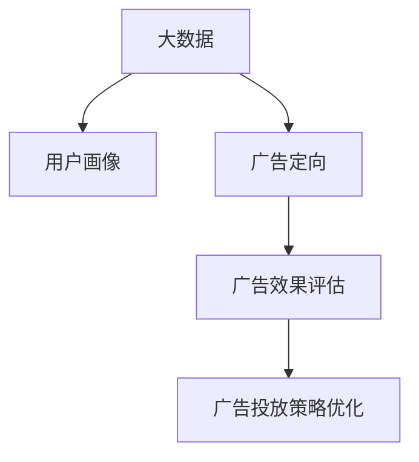

                 

# 信息差的商业广告投放：大数据如何提升广告投放效果

> 关键词：大数据,广告投放,用户画像,广告定向,广告效果评估,智能算法

## 1. 背景介绍

### 1.1 问题由来

在互联网时代，广告已经成为企业触达目标客户、提升品牌影响力、实现市场转化的重要手段。然而，由于用户数据的分散、噪声以及海量数据的处理难度，传统的广告投放方式往往难以精确地触达目标客户群体，导致了广告资源的浪费和投放效果的低下。据统计，全球每年广告费高达数十亿美元，但真正能够有效转化为销售的却不到20%。

为了解决这一问题，大数据技术被引入到广告投放领域，利用大规模数据对用户行为和市场趋势进行分析，精准地匹配用户需求和广告内容，从而提高广告的投放效果。然而，随着互联网数据量的爆炸式增长，如何在大规模数据中提取出对广告投放真正有价值的信息，成为了广告主和广告投放平台面临的重要挑战。

### 1.2 问题核心关键点

在大数据时代，信息差（Information Gap）问题成为了广告投放的核心难点。信息差指的是广告主和用户之间存在的知识、信息不对称，广告主不了解用户真正的需求和行为，用户也不知道哪些广告与自身相关，从而导致了广告投放的低效。要解决这一问题，需要建立一套基于大数据的算法体系，以精准匹配广告主和用户的意图和需求，从而提升广告投放效果。

具体来说，解决信息差问题需要：

1. **用户画像构建**：基于大数据技术，对用户行为数据进行深度挖掘，构建出详细的用户画像，从而准确把握用户的兴趣、需求和行为特征。
2. **广告定向优化**：通过广告定向算法，匹配广告内容和用户画像，精准地将广告投放给最有可能产生转化的用户。
3. **广告效果评估**：通过大数据分析，对广告效果进行全面评估，及时发现和调整广告投放策略，提升广告投资回报率。

## 2. 核心概念与联系

### 2.1 核心概念概述

要理解大数据在广告投放中的应用，首先需要了解一些核心概念：

- **大数据（Big Data）**：指通过数据生成、处理、存储和分析所产生的海量、多样化的数据集合。大数据技术的核心在于从海量数据中提取有价值的信息。
- **用户画像（User Persona）**：指通过数据分析构建出对用户的详细描述，包括用户的兴趣、行为、人口统计信息等。用户画像是广告定向的重要依据。
- **广告定向（Ad Targeting）**：指利用用户画像和广告内容，精准地将广告投放给最有可能产生转化的用户，提升广告的点击率和转化率。
- **广告效果评估（Ad Effectiveness Measurement）**：指通过数据分析和模型评估，对广告投放的效果进行评估，及时发现和调整投放策略，提升广告投资回报率。

这些概念之间的联系可以通过以下Mermaid流程图来展示：



这个流程图展示了大数据在广告投放中的应用流程：通过大数据分析构建用户画像，进而优化广告定向，最终评估广告效果并进行策略优化。

## 3. 核心算法原理 & 具体操作步骤
### 3.1 算法原理概述

基于大数据的广告投放优化算法，其核心在于利用数据挖掘和机器学习技术，从海量用户数据中提取关键信息，构建用户画像，并利用这些画像进行广告定向。具体来说，算法分为以下几个步骤：

1. **数据收集与预处理**：收集用户行为数据、广告内容数据以及市场数据，并进行清洗、去重和归一化处理。
2. **用户画像构建**：通过聚类、关联规则等算法，从用户行为数据中提取特征，构建出详细的用户画像。
3. **广告定向优化**：利用分类、回归等机器学习模型，将用户画像与广告内容进行匹配，优化广告投放策略。
4. **广告效果评估**：通过A/B测试、因果推断等方法，对广告效果进行评估，并根据评估结果优化广告投放策略。

### 3.2 算法步骤详解

**Step 1: 数据收集与预处理**

广告投放算法的首要步骤是收集和预处理数据。具体来说，需要收集以下几类数据：

1. **用户行为数据**：包括用户的浏览历史、点击历史、购买历史等。
2. **广告内容数据**：包括广告文本、图片、视频等。
3. **市场数据**：包括行业趋势、季节性数据等。

数据收集完成后，需要进行以下预处理：

1. **数据清洗**：去除缺失值、异常值和噪声数据，保证数据的完整性和准确性。
2. **数据归一化**：将不同尺度的数据归一化到[0, 1]区间，便于后续的计算。
3. **特征提取**：利用TF-IDF、Word2Vec等技术，提取文本数据的特征。

**Step 2: 用户画像构建**

用户画像构建是广告定向的基础。通过聚类、关联规则等算法，从用户行为数据中提取关键特征，构建出详细的用户画像。

具体来说，可以使用以下方法构建用户画像：

1. **用户聚类**：使用K-means、层次聚类等算法，将用户划分为不同的群组。每个群组代表一个典型的用户画像。
2. **关联规则挖掘**：使用Apriori、FP-Growth等算法，挖掘用户行为数据中的关联规则，找出用户的兴趣点和行为习惯。
3. **兴趣点推荐**：利用协同过滤、矩阵分解等算法，推荐用户可能感兴趣的广告内容。

**Step 3: 广告定向优化**

广告定向优化是广告投放的核心环节。通过机器学习算法，将用户画像与广告内容进行匹配，选择最有可能产生转化的广告进行投放。

具体来说，可以使用以下方法进行广告定向：

1. **分类模型**：使用逻辑回归、决策树、随机森林等分类模型，预测用户对广告的兴趣。
2. **回归模型**：使用线性回归、岭回归等回归模型，预测广告的点击率、转化率等指标。
3. **深度学习模型**：使用卷积神经网络（CNN）、循环神经网络（RNN）等深度学习模型，提取广告内容和用户行为的特征，进行匹配和预测。

**Step 4: 广告效果评估**

广告效果评估是广告投放优化的重要环节。通过数据分析和模型评估，对广告效果进行全面评估，并根据评估结果优化广告投放策略。

具体来说，可以使用以下方法评估广告效果：

1. **A/B测试**：对比两个或多个广告版本的效果，找出最佳的广告内容。
2. **因果推断**：使用潜在结果模型（Potential Outcome Model）、倾向得分方法（Propensity Score）等算法，评估广告的因果效应。
3. **指标分析**：利用点击率（CTR）、转化率（CVR）、投资回报率（ROI）等指标，综合评估广告效果。

### 3.3 算法优缺点

大数据广告投放算法具有以下优点：

1. **精准匹配**：利用大数据技术，从海量数据中提取关键信息，精准匹配用户需求和广告内容，提升广告投放效果。
2. **实时调整**：通过实时数据分析，及时发现和调整广告投放策略，优化广告效果。
3. **可扩展性强**：算法可以处理大规模数据，适应不同行业和市场的广告投放需求。

然而，大数据广告投放算法也存在以下缺点：

1. **数据隐私问题**：在数据收集和处理过程中，需要严格遵守隐私保护法规，避免用户隐私泄露。
2. **算法复杂性高**：算法模型复杂，需要大量数据和计算资源支持，对技术要求较高。
3. **模型解释性差**：深度学习模型等复杂模型难以解释其决策过程，广告主难以理解广告投放的逻辑。

## 4. 数学模型和公式 & 详细讲解 & 举例说明

### 4.1 数学模型构建

在广告投放优化中，常见的数学模型包括分类模型、回归模型和深度学习模型。下面以分类模型为例，介绍其数学模型的构建过程。

假设用户画像的特征向量为 $x \in \mathbb{R}^d$，广告内容的特征向量为 $y \in \mathbb{R}^d$，分类模型 $f(x,y)$ 用于预测用户对广告的兴趣。模型的目标是最小化预测误差，即：

$$
\min_{f} \mathcal{L}(f) = \frac{1}{N} \sum_{i=1}^N \ell(f(x_i),y_i)
$$

其中 $\ell$ 为损失函数，$N$ 为样本数量。常用的损失函数包括交叉熵损失、均方误差损失等。

### 4.2 公式推导过程

以逻辑回归模型为例，其数学公式推导如下：

假设广告对用户是否感兴趣为二分类问题，即 $y \in \{0,1\}$。逻辑回归模型的输出为：

$$
f(x,y) = \log \frac{P(y=1|x)}{P(y=0|x)} = \log \frac{p}{1-p} = \log \hat{p}
$$

其中 $\hat{p}$ 为模型预测的概率。模型参数 $\theta$ 通过梯度下降算法更新：

$$
\theta \leftarrow \theta - \eta \nabla_{\theta}\mathcal{L}(\theta)
$$

其中 $\eta$ 为学习率。使用交叉熵损失函数，其梯度为：

$$
\nabla_{\theta}\mathcal{L}(\theta) = -\frac{1}{N}\sum_{i=1}^N [y_i \nabla_{\hat{p}}\ell + (1-y_i)\nabla_{1-\hat{p}}\ell]
$$

其中 $\nabla_{\hat{p}}\ell$ 和 $\nabla_{1-\hat{p}}\ell$ 分别为预测值和真实值的对数似然函数的导数。

### 4.3 案例分析与讲解

以电商平台的广告投放为例，分析如何利用大数据优化广告投放效果。

假设电商平台有100万个用户，每个用户都可能对平台上的商品广告感兴趣。通过收集用户的浏览历史、购买历史等数据，构建出详细的用户画像。广告内容为平台上的商品图片、标题、价格等。

广告定向优化可以使用逻辑回归模型。首先，将用户画像和广告内容特征进行编码，得到特征向量 $x \in \mathbb{R}^d$ 和 $y \in \mathbb{R}^d$。然后，构建逻辑回归模型：

$$
f(x,y) = \log \frac{P(y=1|x)}{P(y=0|x)} = \log \hat{p}
$$

通过训练逻辑回归模型，可以得到最优的模型参数 $\theta$。使用该模型预测用户对广告的兴趣，并选择最有可能产生转化的广告进行投放。

广告效果评估可以使用点击率（CTR）和转化率（CVR）作为指标。首先，在测试集上评估模型的性能，得到点击率和转化率：

$$
CTR = \frac{\sum_{i=1}^N \hat{p}_i}{N}
$$

$$
CVR = \frac{\sum_{i=1}^N \hat{p}_i \times y_i}{N}
$$

其中 $\hat{p}_i$ 为第 $i$ 个用户对广告的预测概率，$y_i$ 为实际点击和转化情况。

通过A/B测试，对比不同广告版本的效果，找出最佳的广告内容。同时，使用因果推断方法，评估广告的因果效应，确定广告投放的最终效果。

## 5. 项目实践：代码实例和详细解释说明
### 5.1 开发环境搭建

在进行广告投放优化实践前，我们需要准备好开发环境。以下是使用Python进行TensorFlow开发的环境配置流程：

1. 安装Anaconda：从官网下载并安装Anaconda，用于创建独立的Python环境。

2. 创建并激活虚拟环境：
```bash
conda create -n ad-marketing python=3.8 
conda activate ad-marketing
```

3. 安装TensorFlow：根据CUDA版本，从官网获取对应的安装命令。例如：
```bash
conda install tensorflow==2.7.0
```

4. 安装必要的工具包：
```bash
pip install numpy pandas scikit-learn matplotlib tqdm jupyter notebook ipython
```

完成上述步骤后，即可在`ad-marketing`环境中开始广告投放优化实践。

### 5.2 源代码详细实现

下面我们以电商平台广告投放为例，给出使用TensorFlow进行广告定向和效果评估的PyTorch代码实现。

首先，定义广告数据处理函数：

```python
import tensorflow as tf
import numpy as np

def load_data():
    # 加载广告数据和用户画像数据
    # 广告数据：图片、标题、价格等
    # 用户画像数据：浏览历史、购买历史等
    return X, y
    
X, y = load_data()
```

然后，定义逻辑回归模型：

```python
model = tf.keras.models.Sequential([
    tf.keras.layers.Dense(64, activation='relu', input_shape=(X.shape[1],)),
    tf.keras.layers.Dense(1, activation='sigmoid')
])
model.compile(optimizer=tf.keras.optimizers.Adam(), loss='binary_crossentropy', metrics=['accuracy'])
```

接着，训练模型并进行广告定向：

```python
batch_size = 128
epochs = 10

model.fit(X, y, batch_size=batch_size, epochs=epochs, verbose=1)

# 广告定向
# 预测用户对广告的兴趣
predictions = model.predict(X)

# 选择最有可能产生转化的广告进行投放
# 根据点击率CTR选择广告
selected_ads = X[np.argsort(predictions)[-10000:]]
```

最后，评估广告效果：

```python
# 计算点击率CTR和转化率CVR
click_rate = np.mean(predictions)
conversion_rate = np.mean(predictions * y)

# 输出广告效果
print(f"CTR: {click_rate}")
print(f"CVR: {conversion_rate}")
```

### 5.3 代码解读与分析

让我们再详细解读一下关键代码的实现细节：

**load_data函数**：
- 加载广告数据和用户画像数据，包括图片、标题、价格等广告内容特征，以及用户的浏览历史、购买历史等行为数据。

**模型定义**：
- 定义逻辑回归模型，包含一个ReLU激活的隐藏层和一个sigmoid激活的输出层。使用Adam优化器，交叉熵损失函数，并设置评估指标为准确率。

**模型训练**：
- 使用广告数据进行模型训练，设置批量大小和训练轮数。训练过程中打印训练进度。

**广告定向**：
- 使用训练好的模型预测用户对广告的兴趣，选择最有可能产生转化的广告进行投放。选择CTR最高的广告作为推荐广告。

**广告效果评估**：
- 计算点击率（CTR）和转化率（CVR），并输出广告效果指标。

可以看到，TensorFlow提供了强大的机器学习库和深度学习框架，使得广告投放优化代码实现变得简洁高效。

## 6. 实际应用场景
### 6.1 智能推荐系统

大数据在广告投放中的应用场景之一是智能推荐系统。智能推荐系统可以根据用户的行为数据和偏好，精准地推荐商品、内容等，提高用户的满意度和转化率。

具体来说，可以收集用户的浏览历史、点击历史、购买历史等数据，构建出详细的用户画像。利用广告定向算法，将广告内容与用户画像进行匹配，精准地推荐最相关的广告内容。通过实时监控和优化广告效果，不断调整推荐策略，提升推荐系统的效果。

### 6.2 在线广告投放

大数据在在线广告投放中也有广泛应用。通过收集用户的点击历史、转化历史等数据，构建出详细的用户画像。利用广告定向算法，将广告内容与用户画像进行匹配，精准地将广告投放给最有可能产生转化的用户。通过实时监控和优化广告效果，及时发现和调整广告投放策略，提升广告投放的效果。

### 6.3 社交媒体广告

大数据在社交媒体广告投放中也有广泛应用。通过收集用户的点赞、评论、分享等行为数据，构建出详细的用户画像。利用广告定向算法，将广告内容与用户画像进行匹配，精准地将广告投放给最有可能产生转化的用户。通过实时监控和优化广告效果，及时发现和调整广告投放策略，提升广告投放的效果。

## 7. 工具和资源推荐
### 7.1 学习资源推荐

为了帮助开发者系统掌握大数据在广告投放中的应用，这里推荐一些优质的学习资源：

1. 《大数据技术与应用》系列课程：由知名高校和公司联合开设的课程，涵盖大数据技术的基础和应用，适合初学者入门。
2. 《机器学习》课程：斯坦福大学开设的机器学习经典课程，涵盖机器学习的基本原理和算法，适合进一步学习。
3. 《TensorFlow官方文档》：TensorFlow的官方文档，提供了详细的API和代码示例，是学习和使用TensorFlow的重要资源。
4. 《深度学习框架综合教程》书籍：详细介绍了深度学习框架（如TensorFlow、PyTorch等）的实现原理和应用场景，适合深入学习和实践。

通过对这些资源的学习实践，相信你一定能够快速掌握大数据在广告投放中的应用，并用于解决实际的广告投放问题。

### 7.2 开发工具推荐

高效的开发离不开优秀的工具支持。以下是几款用于大数据广告投放开发的常用工具：

1. TensorFlow：由Google主导开发的开源深度学习框架，支持大规模分布式训练，适合大数据广告投放。
2. Spark：Apache开源的大数据处理框架，支持大规模数据处理和分析，适合广告数据的预处理和计算。
3. Hadoop：Apache开源的大数据处理框架，支持大规模数据存储和计算，适合海量数据的存储和处理。
4. Python：开源的编程语言，提供了丰富的科学计算和数据分析库，适合数据处理和模型开发。
5. Jupyter Notebook：开源的交互式编程环境，支持Python和TensorFlow等工具，适合数据可视化和学习调试。

合理利用这些工具，可以显著提升大数据广告投放任务的开发效率，加快创新迭代的步伐。

### 7.3 相关论文推荐

大数据在广告投放中的应用得益于学界的持续研究。以下是几篇奠基性的相关论文，推荐阅读：

1. 《Ad Impact: How Marketing Increases Offline Sales》：研究了在线广告对线下销售的影响，提出了基于因果推断的广告效果评估方法。
2. 《The Pay-Per-Click Advertising Model》：提出了点击率预测模型，用于在线广告的点击率优化。
3. 《A Survey on Recommendation Systems》：综述了推荐系统的最新进展，包括广告定向推荐等应用场景。

这些论文代表了大数据在广告投放技术的发展脉络。通过学习这些前沿成果，可以帮助研究者把握学科前进方向，激发更多的创新灵感。

## 8. 总结：未来发展趋势与挑战
### 8.1 总结

本文对大数据在广告投放中的应用进行了全面系统的介绍。首先阐述了大数据在广告投放中的应用背景和意义，明确了广告投放中的信息差问题及其解决方法。其次，从原理到实践，详细讲解了广告投放的数学模型和算法流程，给出了广告投放的代码实例和优化建议。同时，本文还广泛探讨了大数据在广告投放中的应用场景，展示了大数据技术的广阔前景。

通过本文的系统梳理，可以看到，大数据在广告投放中的应用已经在诸多领域落地，显著提升了广告投放的效果和效率。未来，伴随大数据技术的发展和成熟，广告投放将变得更加精准、高效和智能化。

### 8.2 未来发展趋势

展望未来，大数据在广告投放领域的发展趋势如下：

1. **自动化程度提升**：未来的广告投放将更加自动化，通过智能算法自动生成广告创意和投放策略，减少人工干预。
2. **实时性增强**：通过实时数据分析和模型优化，广告投放将更加灵活和动态，及时响应市场变化。
3. **跨平台协同**：未来的广告投放将跨越多个平台和渠道，实现跨平台的协同优化和个性化推荐。
4. **用户体验优化**：通过个性化推荐和动态调整，提升用户体验和广告的转化率。
5. **隐私保护加强**：在广告投放过程中，更加重视用户隐私保护，避免数据泄露和滥用。

这些趋势表明，大数据在广告投放中的应用将更加精准、高效和智能化，为广告主和用户带来更好的体验。

### 8.3 面临的挑战

尽管大数据在广告投放中的应用已经取得了显著成效，但在迈向更加智能化、普适化应用的过程中，仍面临诸多挑战：

1. **数据隐私问题**：在广告投放过程中，如何保护用户隐私，避免数据泄露和滥用，是一个重要问题。
2. **算法复杂性高**：大数据广告投放算法复杂，需要大量数据和计算资源支持，对技术要求较高。
3. **模型解释性差**：深度学习模型等复杂模型难以解释其决策过程，广告主难以理解广告投放的逻辑。
4. **数据质量问题**：数据质量差、数据格式不统一等问题，将影响广告投放的效果和效率。

## 9. 附录：常见问题与解答

**Q1：大数据在广告投放中的应用是否适用于所有行业？**

A: 大数据在广告投放中的应用可以适用于大多数行业，但其效果和应用方式可能因行业特性而有所不同。例如，在电商、旅游等行业，用户行为数据更加丰富，可以通过大数据进行精准的广告定向和效果评估。而在教育、医疗等行业，数据收集和处理难度较大，需要结合行业特点进行优化。

**Q2：如何选择合适的广告定向算法？**

A: 选择合适的广告定向算法需要考虑多个因素，如广告目标、用户画像、广告形式等。一般来说，可以使用以下几种算法：

1. 分类算法：如逻辑回归、决策树等，用于预测用户对广告的兴趣。
2. 回归算法：如线性回归、岭回归等，用于预测广告的点击率、转化率等指标。
3 深度学习算法：如卷积神经网络（CNN）、循环神经网络（RNN）等，用于提取广告内容和用户行为的特征，进行匹配和预测。

需要根据具体任务选择最合适的算法。

**Q3：如何评估广告效果？**

A: 评估广告效果可以使用多种指标，如点击率（CTR）、转化率（CVR）、投资回报率（ROI）等。通过A/B测试、因果推断等方法，对比不同广告版本的效果，找出最佳的广告内容。同时，使用潜在结果模型（Potential Outcome Model）、倾向得分方法（Propensity Score）等算法，评估广告的因果效应，确定广告投放的最终效果。

**Q4：如何在保护用户隐私的前提下进行广告投放？**

A: 在广告投放过程中，保护用户隐私是至关重要的。以下是一些保护用户隐私的方法：

1. 数据去标识化：在收集和处理数据时，去除或模糊化用户的个人身份信息，保护用户隐私。
2. 匿名化处理：对数据进行匿名化处理，使其无法直接关联到具体用户。
3. 数据访问控制：严格控制数据访问权限，确保只有授权人员能够访问用户数据。
4. 法律合规：遵守相关的隐私保护法规，如GDPR、CCPA等，确保广告投放合法合规。

这些方法可以帮助在保护用户隐私的前提下进行广告投放。

**Q5：大数据在广告投放中的数据质量如何保证？**

A: 数据质量是影响广告投放效果的重要因素。为了保证大数据在广告投放中的数据质量，需要采取以下措施：

1. 数据清洗：去除缺失值、异常值和噪声数据，保证数据的完整性和准确性。
2. 数据标准化：将不同格式的数据标准化到统一格式，便于数据分析和处理。
3. 数据验证：定期对数据进行验证和校验，确保数据的准确性和一致性。
4. 数据更新：及时更新和补充数据，保持数据的时效性和完整性。

通过这些措施，可以保证大数据在广告投放中的数据质量，提升广告投放的效果。

