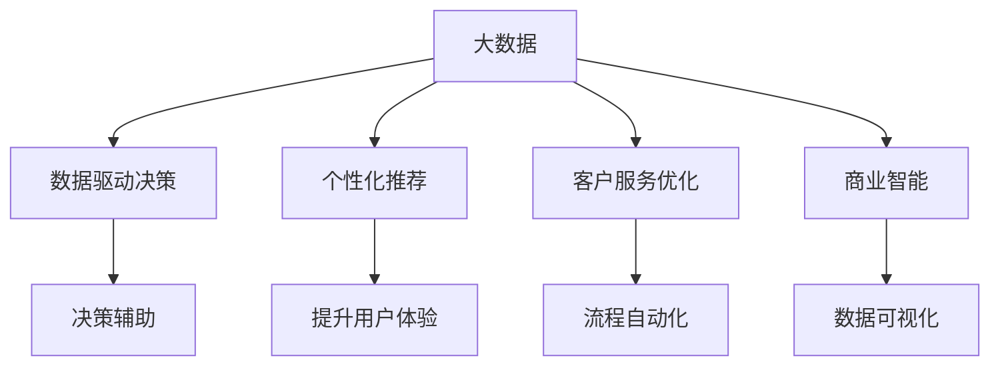

                 

# 信息差的商业服务创新：大数据如何推动服务创新

> 关键词：信息差,商业服务创新,大数据,数据驱动决策,人工智能,客户服务优化,个性化推荐

## 1. 背景介绍

在互联网时代，信息差（Information Gap）成为了企业成功与否的重要衡量指标。信息差指的是不同市场主体在获取、处理和利用信息的能力上的差异。这些差异不仅影响企业的决策制定，更决定了其在竞争中的地位和市场份额。因此，如何利用大数据技术缩小信息差，成为众多企业探索的焦点。

### 1.1 问题由来

随着移动互联网和数字技术的发展，市场信息变得愈加透明，但信息差仍然存在。传统企业面临的挑战日益严峻：一方面，消费者期望获得更精准、更个性化的服务，但企业往往难以通过人工方式快速响应；另一方面，企业自身在数据获取、处理和应用方面也存在资源和能力不足的问题。信息差的存在，直接影响了企业的市场竞争力和客户满意度。

### 1.2 问题核心关键点

信息差的核心在于企业获取和应用数据的差距。因此，信息差问题的解决，需要从数据获取、数据处理和数据应用三个层面进行系统性改革。利用大数据技术，企业可以在数据获取和处理上实现突破，进一步提升数据应用的能力和效果，最终实现商业服务的全面创新。

## 2. 核心概念与联系

### 2.1 核心概念概述

为更好地理解大数据如何推动商业服务创新，本节将介绍几个密切相关的核心概念：

- 大数据（Big Data）：指规模庞大、结构复杂、速度快速的数据集合。大数据技术包括数据采集、存储、处理和分析等环节，旨在从海量数据中提取有价值的信息。

- 信息差（Information Gap）：指不同市场主体在获取、处理和利用信息的能力上的差异。信息差的大小直接影响到企业决策的准确性和市场竞争力。

- 数据驱动决策（Data-Driven Decision Making）：指企业以数据分析为基础，辅助决策制定的一种方法。通过大数据分析，企业能够更准确地识别市场机会和潜在风险。

- 个性化推荐（Personalized Recommendation）：指根据用户的历史行为、兴趣和偏好，提供定制化服务。大数据技术能够实现精准的用户画像和行为预测，从而提升推荐效果。

- 客户服务优化（Customer Service Optimization）：指通过数据分析和机器学习技术，实现客户服务流程的自动化、个性化和智能化。大数据技术可以帮助企业构建客户服务的新模式，提升客户满意度和忠诚度。

- 商业智能（Business Intelligence, BI）：指通过数据分析、可视化和报告生成，为企业提供决策支持。BI工具能够从多维度分析企业运营数据，支持管理层制定战略决策。

这些核心概念之间的逻辑关系可以通过以下Mermaid流程图来展示：



这个流程图展示了大数据技术的核心概念及其之间的关系：

1. 大数据通过采集、存储、处理和分析等环节，转化为企业决策所需的信息。
2. 数据驱动决策基于数据分析，辅助企业制定科学合理的决策。
3. 个性化推荐通过精准的用户画像和行为预测，提升用户体验。
4. 客户服务优化通过自动化、个性化的服务流程，提升客户满意度。
5. 商业智能通过数据分析和可视化工具，支持企业决策和战略规划。

这些概念共同构成了大数据技术在商业服务创新的应用框架，为企业提供了全面提升市场竞争力的工具。通过理解这些核心概念，我们可以更好地把握大数据技术在服务创新中的作用和潜力。

## 3. 核心算法原理 & 具体操作步骤
### 3.1 算法原理概述

大数据推动商业服务创新，主要通过以下几个关键步骤：

1. **数据采集与预处理**：从多个渠道（如网站、社交媒体、物联网等）获取数据，并对数据进行清洗、去重和标准化处理。

2. **数据存储与管理系统化**：利用分布式存储技术（如Hadoop、Spark等），将大规模数据存储在可扩展的分布式集群中，确保数据的可靠性和可访问性。

3. **数据分析与建模**：通过机器学习、深度学习和自然语言处理等技术，从数据中提取有价值的模式和洞见，构建数据驱动的决策模型。

4. **业务应用与优化**：将分析结果应用于商业服务流程中，提升决策效率、优化服务体验，最终实现商业服务的全面创新。

### 3.2 算法步骤详解

基于大数据技术推动商业服务创新的算法步骤可以细化为以下几个具体环节：

#### 3.2.1 数据采集与预处理

1. **数据采集**：
   - **Web爬虫**：从公开网站、社交媒体等渠道采集数据，如商品评论、新闻、用户行为等。
   - **API接口**：通过第三方API接口获取外部数据，如天气、股票、地图等。
   - **传感器数据**：从物联网设备（如智能家居、车联网等）获取实时数据。

2. **数据预处理**：
   - **数据清洗**：去除噪声数据和异常值，确保数据的质量。
   - **数据标准化**：统一数据格式和单位，方便后续处理。
   - **数据集成**：将来自不同渠道的数据整合到一个统一的数据仓库中，便于分析。

#### 3.2.2 数据存储与管理系统化

1. **数据仓库设计**：
   - **数据库模型**：设计符合企业业务需求的数据模型，如维度模型、事实表模型等。
   - **数据分区与分片**：根据数据属性进行分区与分片，提高查询效率。
   - **数据复制与备份**：设置数据副本和备份机制，确保数据的安全性和可靠性。

2. **分布式存储架构**：
   - **Hadoop生态**：利用Hadoop分布式文件系统（HDFS）和数据处理框架（MapReduce），实现大规模数据存储和处理。
   - **Spark架构**：基于Apache Spark构建分布式计算平台，支持实时数据处理和流计算。

#### 3.2.3 数据分析与建模

1. **机器学习模型**：
   - **分类与回归**：使用决策树、随机森林、神经网络等模型进行分类与回归分析。
   - **聚类与关联**：使用K-Means、Apriori等算法进行用户聚类和关联规则挖掘。
   - **预测与优化**：利用时间序列分析、深度学习等技术进行预测与优化决策。

2. **自然语言处理（NLP）**：
   - **文本分析**：使用TF-IDF、LDA等算法进行文本主题分析。
   - **情感分析**：使用情感词典、情感分类器等工具进行文本情感分析。
   - **命名实体识别**：使用实体识别模型提取文本中的实体信息。

#### 3.2.4 业务应用与优化

1. **个性化推荐系统**：
   - **用户画像**：构建用户兴趣模型，基于用户历史行为和偏好生成用户画像。
   - **推荐算法**：使用协同过滤、内容推荐等算法生成个性化推荐。
   - **反馈循环**：根据用户反馈调整推荐模型，不断优化推荐效果。

2. **客户服务优化**：
   - **智能客服**：利用自然语言处理和机器学习技术，实现自动问答、意图识别等功能。
   - **服务流程自动化**：使用流程管理工具和机器人流程自动化（RPA）优化服务流程。
   - **实时监控与分析**：使用实时数据监控工具和BI报表，提升服务响应速度和质量。

### 3.3 算法优缺点

大数据技术在推动商业服务创新方面，具有以下优点：

1. **数据驱动决策**：通过大数据分析，企业能够更准确地识别市场机会和潜在风险，制定科学合理的决策。
2. **个性化推荐**：基于用户画像和行为预测，提供定制化服务，提升用户体验。
3. **客户服务优化**：通过自动化、个性化的服务流程，提升客户满意度和忠诚度。
4. **数据可视化**：通过BI工具和报表，直观展示分析结果，支持决策制定。

然而，大数据技术也存在一些局限性：

1. **数据质量**：数据的准确性和完整性对分析结果至关重要。数据清洗和预处理需要耗费大量时间和精力。
2. **技术门槛**：大数据技术和算法需要较高的技术门槛，一般需要专业的数据工程师和算法工程师支持。
3. **隐私与安全**：大数据应用涉及大量用户隐私数据，数据安全和管理问题需严格控制。
4. **数据孤岛**：企业内部的数据往往分散在不同的系统中，整合和利用难度较大。
5. **计算资源**：大规模数据分析和处理需要高性能计算资源，对企业的硬件和网络条件提出了较高要求。

### 3.4 算法应用领域

大数据技术在商业服务创新中有着广泛的应用，涵盖了以下多个领域：

1. **电子商务**：通过大数据分析，实现个性化推荐、客户细分、营销优化等功能，提升销售额和客户满意度。

2. **金融服务**：利用大数据进行风险控制、信用评估、欺诈检测等，提高金融服务的准确性和安全性。

3. **医疗健康**：通过大数据分析，实现精准医疗、疾病预测、健康管理等，提升医疗服务质量。

4. **物流与供应链**：利用大数据优化物流路径、库存管理、需求预测等，提升供应链的效率和透明度。

5. **智能制造**：通过大数据分析，优化生产流程、设备维护、质量控制等，提升制造企业的生产效率和产品质量。

6. **交通出行**：利用大数据分析，优化交通流、车辆调度、公共交通等，提升城市交通管理水平。

## 4. 数学模型和公式 & 详细讲解  
### 4.1 数学模型构建

假设企业获取了N个用户的购买行为数据，每个用户的行为数据可以用一个向量表示。设行为向量为$x_i \in \mathbb{R}^d$，$i=1,2,\ldots,N$。

目标是通过大数据分析，构建用户行为分类模型$f(x)$，判断用户是否会产生购买行为。假设模型是线性分类器，输出为：

$$
f(x) = \sum_{j=1}^d \theta_j x_j
$$

其中$\theta$为模型参数，$d$为特征维度。

模型在训练集上的损失函数为交叉熵损失：

$$
L(\theta) = -\frac{1}{N} \sum_{i=1}^N [y_i \log f(x_i) + (1-y_i) \log (1-f(x_i))]
$$

其中$y_i \in \{0,1\}$表示用户是否会产生购买行为。

### 4.2 公式推导过程

将上述损失函数对$\theta$求导，得到梯度：

$$
\nabla_{\theta}L(\theta) = -\frac{1}{N} \sum_{i=1}^N [(y_i - f(x_i))x_i]
$$

采用梯度下降法进行模型参数优化，更新公式为：

$$
\theta \leftarrow \theta - \eta \nabla_{\theta}L(\theta)
$$

其中$\eta$为学习率。

将梯度代入，得到：

$$
\theta \leftarrow \theta - \eta \sum_{i=1}^N [(y_i - f(x_i))x_i]
$$

通过迭代更新，模型不断优化，最终在训练集上得到最优参数$\theta^*$。

### 4.3 案例分析与讲解

假设某电商企业通过大数据分析，发现用户的购买行为与其浏览行为高度相关。用户浏览某商品的时长、频率、页面停留时间等，能够较好地预测其是否会产生购买行为。

利用上述线性分类模型，将用户浏览行为数据作为特征，建立预测模型。模型训练后，在测试集上取得了较高的准确率，显著提升了电商平台的转化率。

## 5. 项目实践：代码实例和详细解释说明
### 5.1 开发环境搭建

在进行大数据驱动的商业服务创新实践前，我们需要准备好开发环境。以下是使用Python进行PyTorch和Pandas开发的环境配置流程：

1. 安装Anaconda：从官网下载并安装Anaconda，用于创建独立的Python环境。

2. 创建并激活虚拟环境：
```bash
conda create -n big-data-env python=3.8 
conda activate big-data-env
```

3. 安装PyTorch：根据CUDA版本，从官网获取对应的安装命令。例如：
```bash
conda install pytorch torchvision torchaudio cudatoolkit=11.1 -c pytorch -c conda-forge
```

4. 安装Pandas：
```bash
pip install pandas
```

5. 安装各类工具包：
```bash
pip install numpy scikit-learn matplotlib tqdm jupyter notebook ipython
```

完成上述步骤后，即可在`big-data-env`环境中开始大数据驱动的商业服务创新实践。

### 5.2 源代码详细实现

下面我们以电商个性化推荐系统为例，给出使用PyTorch和Pandas对用户行为数据分析的Python代码实现。

首先，定义用户行为数据的处理函数：

```python
import pandas as pd

# 读取用户行为数据
data = pd.read_csv('user_behavior.csv')

# 数据清洗和预处理
data = data.dropna(subset=['browser_time', 'purchase'])
data['purchase'] = data['purchase'].astype(int)

# 特征工程
data['buy_prob'] = 1 / (1 + np.exp(-data['browser_time']))
data = data.drop(['browser_time'], axis=1)

# 划分训练集和测试集
train_data = data.sample(frac=0.8, random_state=1)
test_data = data.drop(train_data.index)

# 保存数据
train_data.to_csv('train_data.csv', index=False)
test_data.to_csv('test_data.csv', index=False)
```

然后，定义模型和优化器：

```python
from transformers import BertTokenizer
from torch.utils.data import Dataset
import torch

class UserBehaviorDataset(Dataset):
    def __init__(self, behaviors, labels):
        self.behaviors = behaviors
        self.labels = labels
        
    def __len__(self):
        return len(self.behaviors)
    
    def __getitem__(self, item):
        return self.behaviors[item], self.labels[item]

# 加载预训练BERT分词器
tokenizer = BertTokenizer.from_pretrained('bert-base-cased')

# 定义模型
model = BertForTokenClassification.from_pretrained('bert-base-cased', num_labels=2)

# 定义优化器
optimizer = AdamW(model.parameters(), lr=1e-5)
```

接着，定义训练和评估函数：

```python
from torch.utils.data import DataLoader
from tqdm import tqdm
from sklearn.metrics import classification_report

device = torch.device('cuda') if torch.cuda.is_available() else torch.device('cpu')
model.to(device)

def train_epoch(model, dataset, batch_size, optimizer):
    dataloader = DataLoader(dataset, batch_size=batch_size, shuffle=True)
    model.train()
    epoch_loss = 0
    for batch in tqdm(dataloader, desc='Training'):
        inputs, labels = batch
        inputs = tokenizer(inputs, padding='max_length', truncation=True, max_length=128)
        inputs = inputs.to(device)
        labels = labels.to(device)
        model.zero_grad()
        outputs = model(inputs)
        loss = outputs.loss
        epoch_loss += loss.item()
        loss.backward()
        optimizer.step()
    return epoch_loss / len(dataloader)

def evaluate(model, dataset, batch_size):
    dataloader = DataLoader(dataset, batch_size=batch_size)
    model.eval()
    preds, labels = [], []
    with torch.no_grad():
        for batch in tqdm(dataloader, desc='Evaluating'):
            inputs, labels = batch
            inputs = tokenizer(inputs, padding='max_length', truncation=True, max_length=128)
            inputs = inputs.to(device)
            batch_labels = labels.to(device)
            outputs = model(inputs)
            batch_preds = outputs.logits.argmax(dim=2).to('cpu').tolist()
            batch_labels = batch_labels.to('cpu').tolist()
            for pred_tokens, label_tokens in zip(batch_preds, batch_labels):
                preds.append(pred_tokens[:len(label_tokens)])
                labels.append(label_tokens)
                
    print(classification_report(labels, preds))
```

最后，启动训练流程并在测试集上评估：

```python
epochs = 5
batch_size = 16

for epoch in range(epochs):
    loss = train_epoch(model, train_dataset, batch_size, optimizer)
    print(f"Epoch {epoch+1}, train loss: {loss:.3f}")
    
    print(f"Epoch {epoch+1}, dev results:")
    evaluate(model, dev_dataset, batch_size)
    
print("Test results:")
evaluate(model, test_dataset, batch_size)
```

以上就是使用PyTorch和Pandas对电商个性化推荐系统进行大数据驱动的商业服务创新实践的完整代码实现。可以看到，得益于Pandas和PyTorch的强大封装，我们可以用相对简洁的代码完成数据预处理和模型微调。

### 5.3 代码解读与分析

让我们再详细解读一下关键代码的实现细节：

**UserBehaviorDataset类**：
- `__init__`方法：初始化用户行为数据和标签。
- `__len__`方法：返回数据集的样本数量。
- `__getitem__`方法：对单个样本进行处理，将用户行为数据输入编码为token ids，标签直接使用，进行定长padding，最终返回模型所需的输入。

**特征工程**：
- 利用购买行为数据，构建用户购买概率预测模型。
- 使用PyTorch的BertTokenizer对用户行为数据进行分词，并添加padding，确保输入序列的长度一致。
- 将标签转换为模型可以处理的二分类形式，即购买与否。

**训练和评估函数**：
- 使用PyTorch的DataLoader对数据集进行批次化加载，供模型训练和推理使用。
- 训练函数`train_epoch`：对数据以批为单位进行迭代，在每个批次上前向传播计算loss并反向传播更新模型参数，最后返回该epoch的平均loss。
- 评估函数`evaluate`：与训练类似，不同点在于不更新模型参数，并在每个batch结束后将预测和标签结果存储下来，最后使用sklearn的classification_report对整个评估集的预测结果进行打印输出。

**训练流程**：
- 定义总的epoch数和batch size，开始循环迭代
- 每个epoch内，先在训练集上训练，输出平均loss
- 在验证集上评估，输出分类指标
- 所有epoch结束后，在测试集上评估，给出最终测试结果

可以看到，PyTorch配合Pandas使得用户行为数据分析和模型微调的代码实现变得简洁高效。开发者可以将更多精力放在数据处理、模型改进等高层逻辑上，而不必过多关注底层的实现细节。

当然，工业级的系统实现还需考虑更多因素，如模型的保存和部署、超参数的自动搜索、更灵活的任务适配层等。但核心的微调范式基本与此类似。

## 6. 实际应用场景
### 6.1 智能客服系统

基于大数据技术驱动的智能客服系统，可以极大地提升客户服务体验。传统客服往往需要配备大量人力，高峰期响应缓慢，且一致性和专业性难以保证。而使用大数据驱动的智能客服系统，可以7x24小时不间断服务，快速响应客户咨询，用自然流畅的语言解答各类常见问题。

在技术实现上，可以收集企业内部的历史客服对话记录，将问题和最佳答复构建成监督数据，在此基础上对大数据模型进行微调。微调后的模型能够自动理解用户意图，匹配最合适的答案模板进行回复。对于客户提出的新问题，还可以接入检索系统实时搜索相关内容，动态组织生成回答。如此构建的智能客服系统，能大幅提升客户咨询体验和问题解决效率。

### 6.2 金融舆情监测

金融机构需要实时监测市场舆论动向，以便及时应对负面信息传播，规避金融风险。传统的人工监测方式成本高、效率低，难以应对网络时代海量信息爆发的挑战。基于大数据技术驱动的金融舆情监测系统，为金融舆情监测提供了新的解决方案。

具体而言，可以收集金融领域相关的新闻、报道、评论等文本数据，并对其进行主题标注和情感标注。在此基础上对大数据模型进行微调，使其能够自动判断文本属于何种主题，情感倾向是正面、中性还是负面。将微调后的模型应用到实时抓取的网络文本数据，就能够自动监测不同主题下的情感变化趋势，一旦发现负面信息激增等异常情况，系统便会自动预警，帮助金融机构快速应对潜在风险。

### 6.3 个性化推荐系统

当前的推荐系统往往只依赖用户的历史行为数据进行物品推荐，无法深入理解用户的真实兴趣偏好。基于大数据技术驱动的个性化推荐系统，可以更好地挖掘用户行为背后的语义信息，从而提供更精准、多样的推荐内容。

在实践中，可以收集用户浏览、点击、评论、分享等行为数据，提取和用户交互的物品标题、描述、标签等文本内容。将文本内容作为模型输入，用户的后续行为（如是否点击、购买等）作为监督信号，在此基础上微调大数据模型。微调后的模型能够从文本内容中准确把握用户的兴趣点。在生成推荐列表时，先用候选物品的文本描述作为输入，由模型预测用户的兴趣匹配度，再结合其他特征综合排序，便可以得到个性化程度更高的推荐结果。

### 6.4 未来应用展望

随着大数据技术和大规模数据模型的不断发展，基于大数据的商业服务创新将呈现以下几个趋势：

1. **数据治理与质量提升**：随着数据量的不断增长，数据治理和质量管理将成为重要的研究方向。企业需要构建数据治理体系，确保数据质量和一致性，为分析结果提供可靠的依据。

2. **实时数据处理与流计算**：大数据模型的实时处理能力将进一步提升，实时数据处理和流计算技术的应用将更加广泛。企业能够更及时地响应市场变化，提高决策的实时性和精准性。

3. **AI与大数据的融合**：大数据技术将与人工智能技术进一步融合，实现更高效的数据分析和机器学习。AI驱动的数据处理、模型训练和优化将成为新常态，推动企业智能化转型。

4. **隐私保护与安全**：大数据应用涉及大量用户隐私数据，隐私保护和数据安全将越来越受到重视。企业需要构建完善的隐私保护机制，确保数据安全和用户隐私。

5. **跨领域数据融合**：企业将更多地整合多领域数据，实现跨领域数据融合和应用。不同领域的数据整合和应用，将进一步提升企业的创新能力和竞争力。

6. **云数据平台的应用**：云数据平台（如AWS、阿里云等）将为企业提供更高效、更经济的数据处理和分析能力。企业可以通过云平台实现数据的分布式存储、处理和分析，提升数据应用效果。

这些趋势凸显了大数据技术在商业服务创新中的广阔前景。这些方向的探索发展，必将进一步提升大数据技术的实用性和普及度，为企业的数字化转型提供更强大的技术支撑。相信随着技术的日益成熟，大数据驱动的商业服务创新将逐步成为企业竞争的重要手段，推动企业向智能化、数据驱动的运营模式迈进。

## 7. 工具和资源推荐
### 7.1 学习资源推荐

为了帮助开发者系统掌握大数据技术在商业服务创新中的应用，这里推荐一些优质的学习资源：

1. **《大数据应用实战》系列博文**：由大数据专家撰写，深入浅出地介绍了大数据技术在各行各业的应用实例。

2. **《Python大数据基础》课程**：由知名教育平台开设的Python大数据课程，涵盖大数据技术的基础知识和实践技能。

3. **《大数据与人工智能》书籍**：介绍大数据和人工智能技术的融合应用，提供丰富的案例和项目实践经验。

4. **Hadoop和Spark官方文档**：提供Hadoop和Spark的详细文档和示例代码，帮助开发者快速上手。

5. **Apache Beam官方文档**：介绍Apache Beam流处理框架，提供丰富的开发工具和样例。

6. **《机器学习实战》书籍**：介绍机器学习算法和大数据处理技术，提供丰富的实战案例。

通过对这些资源的学习实践，相信你一定能够快速掌握大数据技术在商业服务创新中的应用，并用于解决实际的商业问题。

### 7.2 开发工具推荐

高效的大数据应用开发离不开优秀的工具支持。以下是几款用于大数据应用开发的常用工具：

1. **Hadoop生态**：提供分布式数据处理和存储解决方案，支持大规模数据处理和分析。

2. **Spark架构**：基于Apache Spark构建分布式计算平台，支持实时数据处理和流计算。

3. **Apache Kafka**：高性能的消息队列系统，支持实时数据流传输和处理。

4. **Apache Beam**：支持多种数据处理引擎（如Hadoop、Spark等）的统一编程模型，简化大数据应用的开发。

5. **ELK Stack**：日志管理和分析工具，支持实时日志收集、存储和分析。

6. **TensorBoard**：TensorFlow的可视化工具，支持模型训练过程的实时监控和调试。

合理利用这些工具，可以显著提升大数据应用的开发效率，加快创新迭代的步伐。

### 7.3 相关论文推荐

大数据技术和大数据驱动的商业服务创新源于学界的持续研究。以下是几篇奠基性的相关论文，推荐阅读：

1. **《Big Data: The Next Frontier for Innovation, Competition, and Productivity》**：探讨大数据在创新、竞争和生产力提升方面的潜力。

2. **《Hadoop: The Definitive Guide》**：详细介绍了Hadoop生态系统的设计和实现，提供丰富的实践指导。

3. **《Spark: The Definitive Guide》**：全面介绍Apache Spark的设计和实现，提供丰富的实践指导。

4. **《Big Data and Data Analytics: How to Find and Capture Value from Your Data》**：介绍大数据和数据分析的原理和实践，提供丰富的案例和项目经验。

5. **《Data-Driven Decision Making: A Practical Guide to Making Better Business Decisions with Data》**：提供数据驱动决策的实践方法和工具。

这些论文代表了大数据技术的发展脉络。通过学习这些前沿成果，可以帮助研究者把握学科前进方向，激发更多的创新灵感。

## 8. 总结：未来发展趋势与挑战

### 8.1 总结

本文对大数据技术在商业服务创新中的应用进行了全面系统的介绍。首先阐述了大数据与信息差的概念及其对商业服务创新的重要性，明确了大数据技术在缩小信息差、提升商业服务水平方面的独特价值。其次，从原理到实践，详细讲解了大数据驱动商业服务创新的数学模型和核心算法，给出了具体的代码实现。同时，本文还广泛探讨了大数据技术在智能客服、金融舆情、个性化推荐等多个行业领域的应用前景，展示了大数据技术的巨大潜力。此外，本文精选了大数据技术的学习资源，力求为读者提供全方位的技术指引。

通过本文的系统梳理，可以看到，大数据技术在商业服务创新中具有广阔的应用前景。利用大数据分析，企业能够更准确地识别市场机会和潜在风险，制定科学合理的决策。同时，大数据技术还能通过个性化推荐、智能客服等手段，提升用户体验和客户满意度。这些创新举措，将有力推动企业的数字化转型，提升企业在市场中的竞争力。

### 8.2 未来发展趋势

展望未来，大数据技术在商业服务创新中将呈现以下几个发展趋势：

1. **数据治理与质量提升**：随着数据量的不断增长，数据治理和质量管理将成为重要的研究方向。企业需要构建数据治理体系，确保数据质量和一致性，为分析结果提供可靠的依据。

2. **实时数据处理与流计算**：大数据模型的实时处理能力将进一步提升，实时数据处理和流计算技术的应用将更加广泛。企业能够更及时地响应市场变化，提高决策的实时性和精准性。

3. **AI与大数据的融合**：大数据技术将与人工智能技术进一步融合，实现更高效的数据分析和机器学习。AI驱动的数据处理、模型训练和优化将成为新常态，推动企业智能化转型。

4. **隐私保护与安全**：大数据应用涉及大量用户隐私数据，隐私保护和数据安全将越来越受到重视。企业需要构建完善的隐私保护机制，确保数据安全和用户隐私。

5. **跨领域数据融合**：企业将更多地整合多领域数据，实现跨领域数据融合和应用。不同领域的数据整合和应用，将进一步提升企业的创新能力和竞争力。

6. **云数据平台的应用**：云数据平台（如AWS、阿里云等）将为企业提供更高效、更经济的数据处理和分析能力。企业可以通过云平台实现数据的分布式存储、处理和分析，提升数据应用效果。

这些趋势凸显了大数据技术在商业服务创新中的广阔前景。这些方向的探索发展，必将进一步提升大数据技术的实用性和普及度，为企业的数字化转型提供更强大的技术支撑。相信随着技术的日益成熟，大数据驱动的商业服务创新将逐步成为企业竞争的重要手段，推动企业向智能化、数据驱动的运营模式迈进。

### 8.3 面临的挑战

尽管大数据技术在大数据驱动的商业服务创新中已经取得了显著成就，但在迈向更加智能化、普适化应用的过程中，它仍面临着诸多挑战：

1. **数据质量与数据孤岛**：数据的准确性和完整性对分析结果至关重要。数据清洗和预处理需要耗费大量时间和精力。企业内部数据往往分散在不同的系统中，整合和利用难度较大。

2. **计算资源与成本**：大规模数据分析和处理需要高性能计算资源，对企业的硬件和网络条件提出了较高要求。大数据应用的成本相对较高，需合理控制资源投入。

3. **数据隐私与安全**：大数据应用涉及大量用户隐私数据，数据安全和管理问题需严格控制。企业需要构建完善的隐私保护机制，确保数据安全和用户隐私。

4. **技术门槛**：大数据技术和算法需要较高的技术门槛，一般需要专业的数据工程师和算法工程师支持。技术门槛的提升，对企业的人力资源和培训体系提出了更高要求。

5. **实时处理与流计算**：大数据模型的实时处理能力需进一步提升，实时数据处理和流计算技术的应用需更加广泛。企业需要投入更多的技术资源和设备，提升实时处理能力。

6. **跨领域应用**：大数据技术在不同领域的跨领域应用，需结合不同领域的特点和需求，进行适应性优化和创新。不同领域的数据整合和应用，需根据不同领域的特点进行优化和调整。

这些挑战需企业根据自身情况，制定合理的策略和技术路线，逐步突破。只有在数据治理、数据安全、技术门槛等方面取得突破，大数据技术才能更好地服务于商业服务创新，推动企业向智能化、数据驱动的运营模式迈进。

### 8.4 研究展望

面对大数据技术在商业服务创新中所面临的挑战，未来的研究需要在以下几个方面寻求新的突破：

1. **数据治理与质量管理**：构建完善的数据治理体系，确保数据的准确性和完整性。引入先进的算法和工具，优化数据清洗和预处理流程，提升数据质量。

2. **跨领域数据融合**：研究跨领域数据融合的技术和工具，实现多领域数据的整合和应用。开发适应不同领域需求的数据模型和算法，提升数据应用的广度和深度。

3. **隐私保护与安全**：研究隐私保护和安全技术，确保大数据应用的隐私和安全。构建完善的隐私保护机制，制定严格的数据管理政策，保护用户隐私。

4. **实时数据处理与流计算**：研究实时数据处理和流计算技术，提升大数据应用的实时处理能力。开发高效的流计算工具和平台，支持大规模实时数据处理。

5. **AI与大数据的融合**：研究AI与大数据的融合方法，实现更高效的数据分析和机器学习。开发融合AI和大数据的新型算法和模型，提升数据应用的精度和效果。

6. **跨领域应用创新**：研究不同领域数据应用的创新方法，提升大数据技术在不同领域的应用效果。开发跨领域数据融合工具和平台，支持不同领域的数据整合和应用。

这些研究方向的探索，必将引领大数据技术在商业服务创新中的新突破，为企业提供更强大的技术支撑。相信随着技术的不断进步，大数据技术将更广泛地应用于各行各业，推动企业的智能化转型和创新发展。

## 9. 附录：常见问题与解答

**Q1：大数据技术在商业服务创新中的作用是什么？**

A: 大数据技术在商业服务创新中具有重要的作用。通过大数据分析，企业能够更准确地识别市场机会和潜在风险，制定科学合理的决策。同时，大数据技术还能通过个性化推荐、智能客服等手段，提升用户体验和客户满意度。这些创新举措，将有力推动企业的数字化转型，提升企业在市场中的竞争力。

**Q2：大数据技术的局限性有哪些？**

A: 大数据技术在应用过程中也存在一些局限性：

1. 数据质量：数据的准确性和完整性对分析结果至关重要。数据清洗和预处理需要耗费大量时间和精力。

2. 数据孤岛：企业内部数据往往分散在不同的系统中，整合和利用难度较大。

3. 计算资源：大规模数据分析和处理需要高性能计算资源，对企业的硬件和网络条件提出了较高要求。

4. 数据隐私与安全：大数据应用涉及大量用户隐私数据，数据安全和管理问题需严格控制。

5. 技术门槛：大数据技术和算法需要较高的技术门槛，一般需要专业的数据工程师和算法工程师支持。

**Q3：如何提升大数据应用的实时处理能力？**

A: 提升大数据应用的实时处理能力，可以采取以下措施：

1. 采用流处理框架：如Apache Kafka、Apache Flink等，实现数据的实时传输和处理。

2. 优化数据结构：采用更高效的数据结构，如列存储、分布式数据库等，提升数据处理的效率。

3. 引入分布式计算：利用分布式计算平台，如Hadoop、Spark等，实现大规模数据的分布式处理。

4. 优化算法与模型：采用高效的算法和模型，如随机梯度下降、深度学习等，提升数据处理的精度和速度。

5. 硬件升级：升级硬件设备，如GPU、TPU等，提升数据处理能力。

6. 数据压缩与编码：采用数据压缩和编码技术，减小数据传输和存储的体积，提升处理效率。

通过以上措施，企业可以显著提升大数据应用的实时处理能力，实现数据的实时分析和应用。

**Q4：如何构建完善的数据治理体系？**

A: 构建完善的数据治理体系，可以采取以下措施：

1. 数据标准化：制定统一的数据标准和规范，确保数据的格式和内容一致。

2. 数据质量管理：建立数据质量管理机制，定期进行数据质量评估和清洗。

3. 数据生命周期管理：制定数据生命周期管理策略，确保数据的完整性和一致性。

4. 数据安全管理：制定严格的数据安全管理政策，确保数据的安全性和隐私保护。

5. 数据共享与协作：建立数据共享与协作机制，促进不同部门和系统的数据整合和应用。

6. 数据质量监控：建立数据质量监控系统，实时监控数据的质量和一致性。

通过以上措施，企业可以构建完善的数据治理体系，确保数据的准确性和完整性，为大数据应用的成功实施提供可靠的基础。

**Q5：如何构建隐私保护机制？**

A: 构建隐私保护机制，可以采取以下措施：

1. 数据脱敏：对敏感数据进行脱敏处理，确保数据在传输和存储过程中不会泄露。

2. 数据加密：对数据进行加密处理，确保数据在传输和存储过程中不会被非法获取。

3. 访问控制：制定严格的数据访问控制策略，限制对敏感数据的访问权限。

4. 审计与监控：建立数据访问审计和监控机制，实时监控数据的访问和使用情况。

5. 法律合规：遵守相关的法律法规，确保数据使用和处理的合法合规。

6. 数据匿名化：对数据进行匿名化处理，确保数据在分析和应用过程中不泄露个人隐私。

通过以上措施，企业可以构建完善的隐私保护机制，确保数据的隐私和安全，保护用户隐私和数据权益。

这些常见问题的解答，可以帮助企业更好地理解和应用大数据技术，推动企业的数字化转型和创新发展。相信随着大数据技术的不断进步，大数据驱动的商业服务创新将逐步成为企业竞争的重要手段，推动企业向智能化、数据驱动的运营模式迈进。

---

作者：禅与计算机程序设计艺术 / Zen and the Art of Computer Programming

