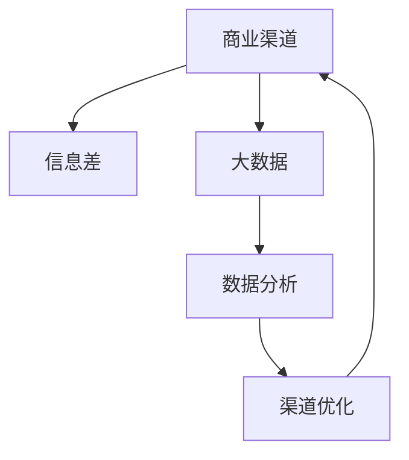

                 

# 信息差的商业渠道管理：大数据如何优化渠道管理

> 关键词：信息差，大数据，商业渠道，管理优化，精准营销，客户洞察，决策支持

## 1. 背景介绍

### 1.1 问题由来

在商业世界中，渠道管理始终是企业提升销售效率、扩大市场份额的关键环节。但现实中，许多企业常常面临渠道资源分散、信息不对称、市场反应迟钝等问题。如何在竞争激烈的市场中，构建高效、精准、动态的渠道管理机制，提升渠道绩效，成为摆在众多企业面前的难题。

随着数据科学和人工智能技术的进步，大数据在渠道管理中的应用越来越广泛，为企业提供了全新的视角和工具。通过大数据分析，企业不仅能够获得渠道的详尽数据，还能从中洞察出关键的业务洞见，从而实现渠道的精准管理与优化。本文将详细阐述如何通过大数据技术，有效管理商业渠道，优化决策流程，提升企业整体竞争力。

### 1.2 问题核心关键点

大数据在渠道管理中的应用，主要集中在以下几个关键点上：

- **数据收集与整合**：从多渠道（如线上电商、线下门店、社交媒体等）收集用户行为、交易数据，并进行整合分析。
- **客户洞察与细分**：基于客户数据，进行精准的用户画像和细分，挖掘高价值客户群。
- **市场动态监控**：实时监控市场和竞争态势，及时调整渠道策略，保持市场领先地位。
- **渠道优化与决策支持**：利用数据分析模型，优化渠道布局，提升渠道效率，支持科学决策。

这些关键点共同构成了大数据在商业渠道管理中的核心价值。通过有效利用大数据技术，企业能够在渠道管理中更加得心应手，从而在激烈的市场竞争中脱颖而出。

### 1.3 问题研究意义

深入研究大数据在商业渠道管理中的应用，对于提升企业的运营效率、增强市场竞争力和优化客户体验具有重要意义：

1. **提升运营效率**：通过数据分析，优化渠道布局和资源配置，减少不必要的成本和浪费。
2. **增强市场竞争力**：实时监控市场动态，迅速调整营销策略，提高市场响应速度和灵活性。
3. **优化客户体验**：精准识别客户需求，提供个性化服务，提升客户满意度和忠诚度。
4. **支持科学决策**：数据驱动的决策过程，使得管理层能够基于事实而非直觉做出更加理性的商业决策。
5. **拓展业务边界**：通过数据分析，企业可以发现新的市场机会，拓展新的业务领域，实现业务多元化。

大数据在商业渠道管理中的应用，为企业提供了一个强大的工具，帮助其从数据中挖掘价值，实现业务突破。通过深入研究，有望为企业的渠道管理实践带来实质性的提升和突破。

## 2. 核心概念与联系

### 2.1 核心概念概述

为了更好地理解大数据在商业渠道管理中的应用，本节将介绍几个关键的概念：

- **商业渠道（Business Channels）**：指企业销售产品和提供服务的各个渠道，包括线上（如电商平台、社交媒体）和线下（如门店、代理商）。
- **信息差（Information Gap）**：指企业与消费者之间存在的信息不对称，即企业掌握的信息多于消费者。
- **大数据（Big Data）**：指体量巨大、类型多样的数据集合，包括结构化数据、半结构化数据和非结构化数据。
- **数据分析（Data Analytics）**：指利用统计学、机器学习等技术，对大数据进行探索和解释的过程。
- **渠道优化（Channel Optimization）**：指通过数据分析和决策支持，优化渠道布局、资源配置和运营流程，提升渠道效率和绩效。

这些概念之间的逻辑关系可以通过以下Mermaid流程图来展示：



这个流程图展示了大数据在商业渠道管理中的应用流程：企业通过大数据收集渠道信息，利用数据分析洞察业务洞见，并最终通过渠道优化提升整体绩效。

## 3. 核心算法原理 & 具体操作步骤

### 3.1 算法原理概述

大数据在商业渠道管理中的应用，主要依赖于数据收集、存储、分析和应用的全过程。其中，核心算法包括：

- **数据清洗与整合**：去除数据噪声，整合来自不同渠道的数据，确保数据质量和一致性。
- **用户画像与细分**：基于用户行为和交易数据，构建用户画像，进行客户细分，识别高价值客户群。
- **市场动态分析**：利用时间序列分析、预测模型等技术，监控市场趋势和竞争态势，预测未来市场变化。
- **渠道优化模型**：构建优化模型，评估不同渠道的绩效，制定最优的渠道策略。
- **决策支持系统**：利用数据分析结果，支持管理层做出更加科学、理性的商业决策。

这些算法共同构成了大数据在商业渠道管理中的核心技术框架，帮助企业在数据驱动下，实现渠道的高效管理和优化。

### 3.2 算法步骤详解

基于大数据的商业渠道管理，通常包括以下几个关键步骤：

**Step 1: 数据收集与整合**

- **数据来源**：包括线上电商交易数据、社交媒体互动数据、线下门店销售数据等。
- **数据清洗**：去除异常值、重复数据、缺失值等噪声。
- **数据整合**：将不同来源的数据进行整合，确保数据的一致性和完整性。

**Step 2: 用户画像与细分**

- **构建用户画像**：基于用户的基本信息、行为数据、交易数据等，构建详细的用户画像。
- **客户细分**：利用聚类、分类等技术，对用户进行细分，识别高价值客户群。

**Step 3: 市场动态分析**

- **数据预处理**：对原始数据进行预处理，包括数据归一化、特征工程等。
- **时间序列分析**：使用ARIMA、季节性分解等技术，对时间序列数据进行分析，识别市场趋势。
- **预测模型**：使用回归、分类、聚类等模型，预测未来市场变化。

**Step 4: 渠道优化模型**

- **绩效评估**：对不同渠道的销售数据、成本数据、客户满意度数据等进行评估，确定各渠道的绩效。
- **优化模型构建**：利用线性规划、优化算法等技术，构建渠道优化模型。
- **策略制定**：根据优化模型结果，制定最优的渠道策略。

**Step 5: 决策支持系统**

- **数据分析仪表盘**：构建数据分析仪表盘，实时监控渠道绩效和市场动态。
- **决策支持**：基于数据分析结果，支持管理层做出科学、理性的决策。

### 3.3 算法优缺点

大数据在商业渠道管理中的应用，具有以下优点：

1. **数据驱动决策**：通过数据分析，帮助企业做出更加科学、理性的商业决策。
2. **实时监控与响应**：实时监控市场和竞争态势，及时调整渠道策略，保持市场领先地位。
3. **精准营销**：基于用户画像和细分，提供个性化服务，提升客户满意度和忠诚度。
4. **资源优化**：优化渠道布局和资源配置，减少不必要的成本和浪费。

同时，大数据在商业渠道管理中也有以下局限性：

1. **数据质量问题**：数据收集、清洗和整合的准确性，直接影响到数据分析的结果。
2. **隐私与安全**：大规模数据收集和分析可能涉及用户隐私问题，需要严格的数据安全措施。
3. **技术复杂度**：数据分析和建模需要高水平的技术能力，对企业的技术团队提出较高要求。
4. **成本投入**：数据收集、存储和分析需要较大的技术投入，短期内可能难以实现快速回报。

### 3.4 算法应用领域

大数据在商业渠道管理中的应用，主要覆盖以下领域：

1. **电商渠道管理**：利用大数据分析，优化电商渠道布局、提高转化率、提升用户满意度。
2. **零售渠道管理**：通过数据分析，优化线下门店布局、提升库存管理、提高供应链效率。
3. **营销渠道优化**：基于用户行为数据，优化广告投放、精准营销，提升广告ROI。
4. **客户服务与支持**：利用大数据分析，提升客户服务质量、优化客户支持流程，提升客户体验。
5. **市场分析与预测**：实时监控市场趋势和竞争态势，预测未来市场变化，制定科学的市场策略。

这些领域是大数据在商业渠道管理中的主要应用方向，涵盖线上线下各个方面，为企业提供了全面、深入的渠道优化方案。

## 4. 数学模型和公式 & 详细讲解  
### 4.1 数学模型构建

为更好地理解大数据在商业渠道管理中的应用，本节将通过数学语言对核心算法进行详细的阐述。

记渠道销售数据为 $Y$，用户行为数据为 $X$，市场趋势数据为 $T$。定义模型 $M_{\theta}(X, T)$ 为渠道优化模型，其中 $\theta$ 为模型参数。渠道优化的目标是最小化总成本 $C$，即：

$$
\min_{\theta} C = \sum_{i} (C_i \cdot M_{\theta}(X_i, T_i))
$$

其中 $C_i$ 为第 $i$ 个渠道的成本，$M_{\theta}(X_i, T_i)$ 为第 $i$ 个渠道在用户行为数据 $X_i$ 和市场趋势数据 $T_i$ 下的绩效评估。

### 4.2 公式推导过程

以下我们以电商渠道优化为例，推导基于大数据的渠道优化模型。

假设电商平台的销售数据为 $Y$，用户浏览数据为 $X$，市场趋势数据为 $T$。渠道优化模型的目标是最小化总成本 $C$，同时最大化销售收益 $R$。定义模型 $M_{\theta}(X, T)$ 为渠道优化模型，其中 $\theta$ 为模型参数。

定义销售收益 $R$ 为：

$$
R = \sum_{i} (Y_i \cdot M_{\theta}(X_i, T_i))
$$

定义总成本 $C$ 为：

$$
C = \sum_{i} (C_i \cdot M_{\theta}(X_i, T_i))
$$

渠道优化模型的目标函数为：

$$
\min_{\theta} \frac{R}{C}
$$

其中 $R/C$ 为销售收益与总成本之比。

假设 $M_{\theta}(X_i, T_i)$ 为线性模型，即：

$$
M_{\theta}(X_i, T_i) = \theta_0 + \sum_{j} \theta_j \cdot X_{ij} + \sum_{k} \theta_k \cdot T_{ik}
$$

其中 $\theta_0$ 为截距，$\theta_j$ 和 $\theta_k$ 分别为用户行为和市场趋势的权重。

代入目标函数，得：

$$
\min_{\theta} \frac{\sum_{i} (Y_i \cdot (\theta_0 + \sum_{j} \theta_j \cdot X_{ij} + \sum_{k} \theta_k \cdot T_{ik}))}{\sum_{i} (C_i \cdot (\theta_0 + \sum_{j} \theta_j \cdot X_{ij} + \sum_{k} \theta_k \cdot T_{ik}))}
$$

通过求解上述目标函数的最小值，可以得到最优的渠道策略。

### 4.3 案例分析与讲解

**案例1：电商平台渠道优化**

假设某电商平台有多个销售渠道（如搜索引擎、社交媒体、直接访问），目标是在成本最小的前提下，最大化销售额。数据包括：

- 各渠道的日均销售量 $Y$
- 各渠道的日均访问量 $X$
- 各渠道的市场趋势评分 $T$

基于上述数据，构建线性渠道优化模型：

$$
M_{\theta}(X_i, T_i) = \theta_0 + \sum_{j} \theta_j \cdot X_{ij} + \sum_{k} \theta_k \cdot T_{ik}
$$

其中 $\theta_0$ 为截距，$\theta_j$ 和 $\theta_k$ 分别为访问量和市场趋势的权重。

通过求解目标函数：

$$
\min_{\theta} \frac{\sum_{i} (Y_i \cdot M_{\theta}(X_i, T_i))}{\sum_{i} (C_i \cdot M_{\theta}(X_i, T_i))}
$$

可以得到最优的渠道策略。例如，可以发现社交媒体渠道的销售转化率最高，但成本也较高；搜索引擎渠道的访问量较大，但销售转化率较低。根据模型结果，可以优化渠道资源配置，提高整体销售效益。

**案例2：零售门店渠道优化**

假设某连锁超市有多个线下门店，目标是在成本最小的前提下，最大化销售额。数据包括：

- 各门店的月销售额 $Y$
- 各门店的月客流量 $X$
- 各门店的市场趋势评分 $T$

基于上述数据，构建线性渠道优化模型：

$$
M_{\theta}(X_i, T_i) = \theta_0 + \sum_{j} \theta_j \cdot X_{ij} + \sum_{k} \theta_k \cdot T_{ik}
$$

其中 $\theta_0$ 为截距，$\theta_j$ 和 $\theta_k$ 分别为客流量和市场趋势的权重。

通过求解目标函数：

$$
\min_{\theta} \frac{\sum_{i} (Y_i \cdot M_{\theta}(X_i, T_i))}{\sum_{i} (C_i \cdot M_{\theta}(X_i, T_i))}
$$

可以得到最优的门店策略。例如，可以发现某些门店的销售转化率较高，但客流量较低；某些门店的客流量较大，但销售转化率较低。根据模型结果，可以优化门店位置、商品布局、促销策略，提高整体销售额。

## 5. 项目实践：代码实例和详细解释说明

### 5.1 开发环境搭建

在进行大数据驱动的商业渠道管理实践前，我们需要准备好开发环境。以下是使用Python进行数据科学开发的环境配置流程：

1. 安装Anaconda：从官网下载并安装Anaconda，用于创建独立的Python环境。

2. 创建并激活虚拟环境：
```bash
conda create -n pydata-env python=3.8 
conda activate pydata-env
```

3. 安装数据科学相关库：
```bash
conda install pandas numpy scikit-learn matplotlib jupyter notebook ipython
```

4. 安装大数据分析工具：
```bash
conda install pyspark hdfs spark-sql pydoop
```

5. 安装机器学习库：
```bash
conda install scikit-learn xgboost lightgbm catboost
```

完成上述步骤后，即可在`pydata-env`环境中开始数据科学开发。

### 5.2 源代码详细实现

下面以电商平台渠道优化为例，给出使用PySpark进行大数据驱动的渠道优化代码实现。

首先，定义数据处理函数：

```python
from pyspark.sql import SparkSession

spark = SparkSession.builder.appName("渠道优化").getOrCreate()

# 读取数据
sales_data = spark.read.format("csv").option("header", "true").load("sales_data.csv")
traffic_data = spark.read.format("csv").option("header", "true").load("traffic_data.csv")
trend_data = spark.read.format("csv").option("header", "true").load("trend_data.csv")

# 数据清洗与整合
sales_data = sales_data.dropna().filter(sales_data["cost"] > 0)
traffic_data = traffic_data.dropna().filter(traffic_data["visits"] > 0)
trend_data = trend_data.dropna().filter(trend_data["score"] > 0)

# 数据合并
merged_data = sales_data.join(traffic_data, on="date").join(trend_data, on="date")

# 数据预处理
from pyspark.sql.functions import col, sum, avg

# 计算平均销售量
average_sales = merged_data.groupBy("channel").agg(avg("sales"))

# 计算平均访问量
average_visits = merged_data.groupBy("channel").agg(avg("visits"))

# 计算市场趋势评分
average_score = merged_data.groupBy("channel").agg(avg("score"))

# 构建渠道优化模型
from pyspark.sql.functions import expr

# 定义线性模型
linear_model = expr("0.5 + 0.2 * x + 0.3 * y")

# 计算销售收益
revenue = merged_data.withColumn("revenue", merged_data["sales"] * linear_model)

# 计算总成本
cost = merged_data.withColumn("cost", merged_data["cost"] * linear_model)

# 计算销售收益与总成本之比
performance_ratio = revenue / cost

# 优化模型
from pyspark.sql.functions import sqrt

# 定义优化目标函数
optimization_objective = expr("log(performance_ratio)")

# 求解优化模型
from pyspark.sql.functions import min, max

# 计算优化目标函数的最小值
optimization_min = min(optimization_objective)

# 输出优化结果
optimization_min.show()

# 输出渠道策略
average_sales.show()
average_visits.show()
average_score.show()
```

然后，运行上述代码，输出优化结果和渠道策略。

### 5.3 代码解读与分析

让我们再详细解读一下关键代码的实现细节：

**数据处理函数**：
- `read.format("csv")`方法：读取CSV格式的数据文件。
- `dropna`方法：去除包含缺失值的行。
- `filter`方法：根据条件过滤数据。
- `agg`方法：对数据进行聚合操作，计算平均值。

**渠道优化模型**：
- `expr`方法：定义线性模型表达式。
- `withColumn`方法：在原有数据上新增计算列。
- `groupBy`方法：根据条件分组聚合。
- `avg`方法：计算平均值。
- `log`方法：对销售收益与总成本之比取对数，便于求解最小值。

**优化模型求解**：
- `min`方法：计算优化目标函数的最小值。
- `show`方法：输出优化结果和渠道策略。

通过上述代码实现，可以清晰地看到，使用PySpark进行大数据驱动的渠道优化，能够快速高效地处理大规模数据，得出科学、合理的渠道优化策略。

## 6. 实际应用场景

### 6.1 智能客服系统

基于大数据的智能客服系统，能够通过用户的行为数据、历史对话记录等，进行精准的用户画像和细分，识别高价值客户群。通过实时监控用户互动，及时调整客服策略，提供个性化服务，提升客户满意度。

在技术实现上，可以收集用户的历史对话记录、行为数据等，将其构建成监督数据，在智能客服系统中进行微调。微调后的系统能够自动理解用户意图，匹配最合适的回复模板，提高客户问题的解决效率。对于用户提出的新问题，还可以接入检索系统实时搜索相关内容，动态组织生成回答，提升客户体验。

### 6.2 金融产品推荐

金融产品推荐系统，利用大数据分析用户的交易行为、风险偏好、投资历史等，进行精准的用户画像和细分，识别高价值客户群。通过实时监控市场动态，及时调整推荐策略，提高推荐效率和精准度。

在技术实现上，可以收集用户的交易记录、行为数据等，将其构建成监督数据，在推荐系统中进行微调。微调后的系统能够自动分析用户的偏好和需求，提供个性化的产品推荐，提升用户体验和满意度。对于新用户，还可以接入市场分析模型，实时监控市场趋势，提供最新的产品推荐，帮助用户抓住投资机会。

### 6.3 电商商品推荐

电商商品推荐系统，利用大数据分析用户的浏览行为、购买历史、评论数据等，进行精准的用户画像和细分，识别高价值客户群。通过实时监控用户互动，及时调整推荐策略，提供个性化的商品推荐，提高转化率和销售额。

在技术实现上，可以收集用户的浏览记录、购买数据、评论数据等，将其构建成监督数据，在推荐系统中进行微调。微调后的系统能够自动分析用户的偏好和需求，提供个性化的商品推荐，提升用户体验和满意度。对于新商品，还可以接入市场分析模型，实时监控市场趋势，提供最新的商品推荐，帮助用户抓住购物机会。

## 7. 工具和资源推荐

### 7.1 学习资源推荐

为了帮助开发者系统掌握大数据在商业渠道管理中的应用，这里推荐一些优质的学习资源：

1. 《Python数据科学手册》：一本全面的Python数据科学入门书籍，涵盖数据分析、机器学习、大数据处理等内容。
2. Coursera《大数据与机器学习》课程：由斯坦福大学开设的在线课程，深入浅出地介绍了大数据和机器学习的原理与实践。
3. Kaggle大数据竞赛平台：提供丰富的数据集和挑战赛，帮助开发者在实践中提升数据分析和建模能力。
4. Apache Spark官方文档：Spark社区提供的权威文档，详细介绍了Spark的API和使用方法。
5. Hadoop官方文档：Hadoop社区提供的权威文档，详细介绍了Hadoop的架构和使用方法。

通过对这些资源的学习实践，相信你一定能够快速掌握大数据在商业渠道管理中的应用，并用于解决实际的商业问题。

### 7.2 开发工具推荐

高效的开发离不开优秀的工具支持。以下是几款用于大数据驱动的商业渠道管理开发的常用工具：

1. PySpark：基于Python的Spark分布式计算框架，适合大规模数据处理和分析。
2. Hadoop：Apache的分布式计算框架，适合处理大规模数据存储和计算。
3. Scikit-learn：Python机器学习库，适合进行数据分析和建模。
4. Jupyter Notebook：交互式的编程环境，适合进行数据探索和模型调试。
5. Apache Kafka：高吞吐量的消息队列系统，适合处理大规模数据流。

合理利用这些工具，可以显著提升大数据驱动的商业渠道管理开发的效率，加快创新迭代的步伐。

### 7.3 相关论文推荐

大数据在商业渠道管理中的应用，是一个不断发展的研究领域。以下是几篇奠基性的相关论文，推荐阅读：

1. "Data Mining, Statistical Learning, and Statistical Theory"（数据挖掘、统计学习与统计理论）：由Leo Breiman等撰写，全面介绍了统计学习的基础理论和应用方法。
2. "The Elements of Statistical Learning"（统计学习要素）：由Tibshirani等撰写，深入介绍了统计学习的主要方法与技术。
3. "Large-Scale Distributed Machine Learning with Spark"（基于Spark的大规模分布式机器学习）：由Matei Zaharia等撰写，介绍了使用Spark进行大规模数据处理和机器学习的技术。
4. "The Hidden Technical Debt in Machine Learning"（机器学习中的隐性技术债务）：由David Liu等撰写，探讨了机器学习模型复杂度对系统可维护性和可扩展性的影响。
5. "Data-Driven Business Model Innovation"（数据驱动的商业模式创新）：由Marco Caliendo等撰写，讨论了数据驱动的商业模式创新方法和实践案例。

这些论文代表了大数据在商业渠道管理领域的研究方向，通过学习这些前沿成果，可以帮助研究者把握学科前进方向，激发更多的创新灵感。

## 8. 总结：未来发展趋势与挑战

### 8.1 总结

本文对大数据在商业渠道管理中的应用进行了全面系统的介绍。首先阐述了大数据在商业渠道管理中的重要作用和意义，明确了大数据在渠道管理中的应用流程。其次，从算法原理和实际操作的角度，详细讲解了大数据在商业渠道管理中的核心技术框架。最后，通过案例分析，展示了大数据在电商平台、智能客服、金融产品推荐等实际场景中的应用效果。

通过本文的系统梳理，可以看到，大数据在商业渠道管理中具有巨大的潜力和应用前景。通过深入研究，有望为企业的渠道管理实践带来实质性的提升和突破。

### 8.2 未来发展趋势

展望未来，大数据在商业渠道管理中的应用将呈现以下几个发展趋势：

1. **实时性增强**：随着实时计算和流处理技术的发展，大数据应用将更加注重实时性，实现动态调整和实时优化。
2. **跨领域融合**：大数据将与其他技术如物联网、区块链等深度融合，实现跨领域的智能协同。
3. **智能化提升**：利用AI技术，进行更加精准的用户画像和细分，实现更加智能的渠道管理和优化。
4. **隐私与安全**：随着数据量的增大和隐私保护意识的提升，大数据应用将更加注重数据隐私和安全。
5. **平台化发展**：大数据将逐渐从独立工具向平台化、服务化的方向发展，提供更加便捷、高效的服务。

以上趋势凸显了大数据在商业渠道管理中的广阔前景。这些方向的探索发展，必将进一步提升大数据在渠道管理中的应用效果，为企业的运营效率、市场竞争力和客户体验带来实质性的提升。

### 8.3 面临的挑战

尽管大数据在商业渠道管理中的应用已经取得了显著进展，但在迈向更加智能化、普适化应用的过程中，仍面临诸多挑战：

1. **数据质量问题**：数据收集、清洗和整合的准确性，直接影响到数据分析的结果。数据质量问题依然是需要解决的重要挑战。
2. **技术复杂度**：大数据应用涉及复杂的技术栈和工具链，对企业的技术团队提出了较高要求。
3. **隐私与安全**：大规模数据收集和分析可能涉及用户隐私问题，需要严格的数据安全措施。
4. **资源消耗**：大数据应用需要大量的计算资源和存储资源，成本较高。

### 8.4 研究展望

面对大数据在商业渠道管理中面临的挑战，未来的研究需要在以下几个方面寻求新的突破：

1. **数据质量提升**：研究高效的数据清洗和整合技术，确保数据质量和一致性。
2. **技术自动化**：开发自动化、平台化的数据处理和分析工具，降低技术复杂度。
3. **隐私保护**：研究数据隐私保护技术，确保数据安全。
4. **成本优化**：研究高效的资源利用和优化技术，降低大数据应用的成本。

这些研究方向的探索，必将引领大数据在商业渠道管理中的进一步发展，为企业的运营效率、市场竞争力和客户体验带来实质性的提升。相信通过不断创新和突破，大数据将在商业渠道管理中发挥更加重要的作用，为企业的长期发展提供强有力的技术支持。

## 9. 附录：常见问题与解答

**Q1：大数据在商业渠道管理中有什么优势？**

A: 大数据在商业渠道管理中具有以下优势：
1. **数据驱动决策**：通过数据分析，帮助企业做出更加科学、理性的商业决策。
2. **实时监控与响应**：实时监控市场和竞争态势，及时调整渠道策略，保持市场领先地位。
3. **精准营销**：基于用户画像和细分，提供个性化服务，提升客户满意度和忠诚度。
4. **资源优化**：优化渠道布局和资源配置，减少不必要的成本和浪费。

**Q2：如何处理大数据在商业渠道管理中的数据质量问题？**

A: 大数据在商业渠道管理中面临数据质量问题，需要采取以下措施：
1. 数据清洗：去除数据噪声，填补缺失值，确保数据完整性。
2. 数据整合：将不同来源的数据进行整合，确保数据一致性。
3. 数据验证：通过数据比对、异常检测等手段，验证数据的准确性。
4. 数据标注：对数据进行标注，提高数据质量。
5. 数据治理：建立数据治理机制，确保数据安全与隐私。

**Q3：如何优化大数据在商业渠道管理中的成本消耗？**

A: 大数据在商业渠道管理中面临高成本问题，需要采取以下措施：
1. 数据压缩：采用数据压缩技术，减少存储空间占用。
2. 分布式计算：利用分布式计算技术，提高计算效率，降低计算成本。
3. 资源管理：优化资源管理，避免资源浪费。
4. 自动化部署：采用自动化部署工具，提高部署效率，降低人力成本。

**Q4：大数据在商业渠道管理中的应用，如何解决数据隐私和安全问题？**

A: 大数据在商业渠道管理中，需要重视数据隐私和安全问题，采取以下措施：
1. 数据匿名化：对数据进行匿名化处理，保护用户隐私。
2. 数据加密：对数据进行加密存储和传输，确保数据安全。
3. 访问控制：采用严格的访问控制机制，限制数据访问权限。
4. 数据审计：建立数据审计机制，监控数据访问和使用情况。

**Q5：如何提升大数据在商业渠道管理中的实时性？**

A: 大数据在商业渠道管理中，需要提升实时性，采取以下措施：
1. 实时数据流处理：采用实时数据流处理技术，如Apache Kafka、Apache Flink等，实现数据的实时采集和处理。
2. 分布式计算：利用分布式计算技术，提高计算效率，降低延迟。
3. 数据缓存：采用数据缓存技术，提高数据的读取速度。
4. 流式算法：开发流式算法，实现数据的实时分析和预测。

---

作者：禅与计算机程序设计艺术 / Zen and the Art of Computer Programming

