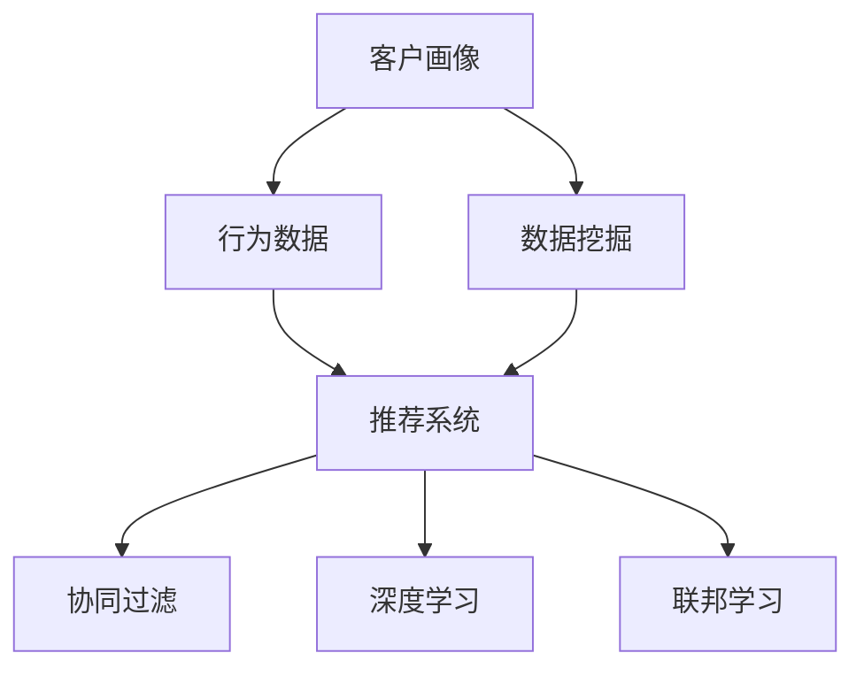

                 

# 信息差的商业销售个性化：大数据如何实现销售个性化

## 1. 背景介绍

### 1.1 问题由来

在商业销售领域，信息差是导致销售效果不佳的重要原因之一。传统销售策略主要依赖于销售人员的经验和直觉，而非基于数据的客观分析，这导致了销售信息的传递效率低、转化率差。大数据和机器学习技术的发展，为解决这个问题提供了新的手段。

通过大数据分析，可以深入挖掘客户的行为数据，分析客户的购买偏好、消费习惯等，并在此基础上进行个性化推荐和营销策略设计，显著提高销售转化率，优化销售流程，实现销售个性化。

### 1.2 问题核心关键点

基于大数据的销售个性化主要包括以下几个关键点：

- 客户行为分析：通过分析客户的浏览、购买、互动等行为数据，了解客户的兴趣和需求。
- 数据预处理：对原始数据进行清洗、归一化、降维等处理，提高数据质量，减少噪声干扰。
- 客户画像构建：构建客户画像，将客户分为不同的细分群体，便于进行有针对性的营销策略。
- 推荐系统构建：基于客户画像和行为数据，构建推荐系统，实现个性化商品推荐。
- 营销策略设计：基于推荐结果，设计针对性的营销策略，如邮件营销、社交媒体推广等。
- 效果评估：对个性化营销策略进行效果评估，不断优化模型和策略。

这些核心关键点共同构成了基于大数据的销售个性化的核心逻辑，旨在通过数据驱动的方法，最大化销售转化率和客户满意度。

### 1.3 问题研究意义

基于大数据的销售个性化研究具有重要的现实意义：

1. 提高销售转化率：通过个性化推荐，匹配客户需求，提高客户购买概率，提升销售业绩。
2. 优化客户体验：个性化推荐能够更好地满足客户需求，提升客户满意度和忠诚度。
3. 提高营销效率：基于数据的个性化营销策略，可以更精准地触达目标客户，提高营销效率和ROI。
4. 增强竞争优势：通过深入分析客户数据，了解客户需求和市场趋势，增强企业的市场竞争力。
5. 促进数据驱动决策：利用数据驱动的决策方法，使企业决策更加科学、合理，减少主观偏差。

## 2. 核心概念与联系

### 2.1 核心概念概述

为更好地理解基于大数据的销售个性化方法，本节将介绍几个密切相关的核心概念：

- 客户画像(Customer Profile)：基于客户行为数据，构建的客户描述，用于表示客户特征和需求。
- 推荐系统(Recommendation System)：基于客户画像和行为数据，构建的系统，用于向客户推荐个性化的商品或内容。
- 行为数据(Behavioral Data)：客户在网站、应用、社交平台上的行为数据，如浏览、点击、购买、互动等。
- 数据挖掘(Data Mining)：从大量数据中提取有价值的信息和知识的过程。
- 协同过滤(Collaborative Filtering)：基于用户和物品之间的相似性，推荐物品的推荐算法。
- 深度学习(Deep Learning)：基于深度神经网络进行模型训练和学习的方法，适用于复杂的数据模式识别。
- 联邦学习(Federated Learning)：一种分布式机器学习技术，能够在保护数据隐私的前提下进行模型训练。

这些核心概念之间的逻辑关系可以通过以下Mermaid流程图来展示：



这个流程图展示了大数据销售个性化的核心概念及其之间的关系：

1. 客户画像基于客户行为数据构建。
2. 数据挖掘从客户画像中提取有用信息。
3. 推荐系统根据客户画像和行为数据进行推荐。
4. 协同过滤是推荐系统的主要算法之一。
5. 深度学习用于处理复杂的数据模式。
6. 联邦学习在保护数据隐私的同时进行模型训练。

这些概念共同构成了基于大数据的销售个性化的核心逻辑框架，使得企业能够利用数据驱动的方法，实现销售个性化。

## 3. 核心算法原理 & 具体操作步骤

### 3.1 算法原理概述

基于大数据的销售个性化，本质上是一个基于数据的推荐系统，其核心思想是通过分析客户的行为数据，构建客户画像，并在此基础上进行个性化的推荐和营销策略设计。

形式化地，假设客户画像为 $P$，行为数据为 $D$，推荐系统为 $R$，推荐结果为 $R(P,D)$。销售个性化的优化目标是最小化推荐误差，即：

$$
\mathop{\arg\min}_{P, D, R} \|R(P,D) - C\|
$$

其中 $C$ 为真实的销售结果，$\| \cdot \|$ 表示误差度量。

通过优化上述目标，可以构建一个高效的个性化推荐系统，实现销售转化率的最大化。

### 3.2 算法步骤详解

基于大数据的销售个性化一般包括以下几个关键步骤：

**Step 1: 数据收集与预处理**

- 收集客户的各类行为数据，如浏览历史、点击记录、购买记录等。
- 对数据进行清洗、去重、去噪等处理，去除无用数据和异常值。
- 进行数据归一化、降维等处理，提高数据质量。

**Step 2: 客户画像构建**

- 基于处理后的行为数据，构建客户画像。常见的客户画像包括基本信息、兴趣偏好、购买历史等。
- 利用聚类、分类等算法，将客户分为不同的细分群体。
- 使用图像、文本、音频等多种数据类型，丰富客户画像的信息。

**Step 3: 推荐系统构建**

- 选择合适的推荐算法，如协同过滤、深度学习等。
- 在推荐系统中加入个性化特征，如用户评分、商品属性等。
- 使用A/B测试等方法，评估推荐系统的效果。

**Step 4: 营销策略设计**

- 根据推荐结果，设计个性化的营销策略。如邮件营销、社交媒体推广等。
- 利用多渠道营销，提高覆盖面和转化率。
- 动态调整营销策略，优化效果。

**Step 5: 效果评估**

- 对营销策略的效果进行评估，如点击率、转化率等指标。
- 收集用户反馈，不断优化推荐系统和营销策略。
- 定期更新客户画像和推荐模型，保持最新状态。

以上是基于大数据的销售个性化的主要步骤，每一步都需要根据具体业务场景进行调整和优化。

### 3.3 算法优缺点

基于大数据的销售个性化具有以下优点：

1. 数据驱动：以客户行为数据为基础，通过数据分析和模型训练，实现个性化推荐，减少了人为干预。
2. 精度高：基于数据驱动的推荐系统，能够精准匹配客户需求，提高转化率。
3. 可扩展性强：通过联邦学习等分布式技术，能够处理大规模数据集，适用于大型企业。
4. 用户满意度提高：个性化的推荐能够更好地满足客户需求，提高客户满意度和忠诚度。

同时，该方法也存在以下局限性：

1. 数据依赖性高：推荐系统的效果高度依赖于数据的质量和数量，获取高质量的数据成本较高。
2. 隐私风险：客户行为数据的收集和使用可能涉及到隐私问题，需要严格遵守数据保护法规。
3. 模型复杂度高：深度学习等复杂算法需要较高的计算资源和时间成本。
4. 冷启动问题：新客户缺乏历史行为数据，无法构建准确的客户画像。

尽管存在这些局限性，但就目前而言，基于大数据的销售个性化方法仍是大规模个性化推荐的核心范式。未来相关研究的重点在于如何进一步降低数据依赖，提高推荐系统的可解释性和安全性，同时兼顾模型复杂度和数据隐私。

### 3.4 算法应用领域

基于大数据的销售个性化方法在电子商务、零售、金融、旅游等多个领域得到了广泛的应用：

- **电子商务**：根据用户浏览和购买行为，推荐商品，提高转化率。
- **零售**：分析客户行为，设计促销活动，提高销售额。
- **金融**：基于客户交易记录，推荐金融产品，提高客户粘性。
- **旅游**：根据用户兴趣和行为，推荐旅游产品，提升客户体验。
- **教育**：分析学生学习行为，推荐个性化学习内容，提升学习效果。

这些领域的应用案例展示了大数据销售个性化的广泛影响力和应用前景。

## 4. 数学模型和公式 & 详细讲解 & 举例说明

### 4.1 数学模型构建

本节将使用数学语言对基于大数据的销售个性化方法进行更加严格的刻画。

记客户画像为 $P=\{p_1, p_2, ..., p_n\}$，其中 $p_i$ 表示第 $i$ 个客户的特征向量。行为数据为 $D=\{d_1, d_2, ..., d_m\}$，其中 $d_j$ 表示第 $j$ 个行为记录。推荐系统为 $R: \mathcal{P} \times \mathcal{D} \rightarrow \mathcal{R}$，其中 $\mathcal{P}$ 表示客户画像空间，$\mathcal{D}$ 表示行为数据空间，$\mathcal{R}$ 表示推荐结果空间。

定义推荐系统在客户画像 $p$ 和行为数据 $d$ 上的损失函数为 $L(R(p,d), C)$，则在数据集 $D$ 上的经验风险为：

$$
\mathcal{L}(R) = \frac{1}{M} \sum_{i=1}^M L(R(p_i,d_i), C_i)
$$

其中 $C_i$ 为真实的推荐结果，$M$ 为数据集大小。优化目标是最小化经验风险，即：

$$
\mathop{\arg\min}_{R} \mathcal{L}(R)
$$

在实践中，我们通常使用基于梯度的优化算法（如SGD、Adam等）来近似求解上述最优化问题。设 $\eta$ 为学习率，$\lambda$ 为正则化系数，则参数的更新公式为：

$$
R \leftarrow R - \eta \nabla_{R}\mathcal{L}(R) - \eta\lambda R
$$

其中 $\nabla_{R}\mathcal{L}(R)$ 为损失函数对推荐系统的梯度，可通过反向传播算法高效计算。

### 4.2 公式推导过程

以下我们以协同过滤算法为例，推导基于大数据的销售个性化的推荐函数及其梯度的计算公式。

假设推荐系统 $R$ 在客户画像 $P$ 和行为数据 $D$ 上的推荐结果为 $\hat{R}(P,D)$，目标是最小化推荐误差 $e(\hat{R}(P,D), C)$。

假设每个客户 $p_i$ 的推荐结果为 $R(p_i)$，行为数据 $d_j$ 对应的评分向量为 $S(d_j)$，则推荐结果 $\hat{R}(P,D)$ 可以表示为：

$$
\hat{R}(P,D) = \sum_{i=1}^n \alpha_i R(p_i) \cdot S(d_i)
$$

其中 $\alpha_i$ 为权重系数。推荐误差 $e(\hat{R}(P,D), C)$ 可以表示为：

$$
e(\hat{R}(P,D), C) = \frac{1}{M} \sum_{i=1}^M \sum_{j=1}^N (\hat{R}(p_i, d_j) - C_i)^2
$$

利用梯度下降等优化算法，推荐系统不断更新权重系数 $\alpha_i$ 和推荐结果 $R(p_i)$，最小化推荐误差。优化目标为：

$$
\mathop{\arg\min}_{\alpha_i, R} e(\hat{R}(P,D), C)
$$

根据梯度下降算法，权重系数 $\alpha_i$ 的更新公式为：

$$
\alpha_i \leftarrow \alpha_i - \eta \frac{\partial e(\hat{R}(P,D), C)}{\partial \alpha_i}
$$

推荐结果 $R(p_i)$ 的更新公式为：

$$
R(p_i) \leftarrow R(p_i) - \eta \frac{\partial e(\hat{R}(P,D), C)}{\partial R(p_i)}
$$

在得到推荐系统的推荐函数和梯度后，即可带入参数更新公式，完成推荐系统的迭代优化。重复上述过程直至收敛，最终得到适应特定客户的推荐结果 $\hat{R}(P,D)$。

### 4.3 案例分析与讲解

假设某电子商务平台通过数据分析，发现用户对某类产品的兴趣度较高。该平台使用协同过滤算法，构建了一个基于用户行为数据的推荐系统。推荐系统通过分析用户的历史购买记录和浏览记录，计算出每个用户的推荐评分向量 $S(d_i)$。

假设用户 $u$ 的历史行为数据为 $d_1, d_2, ..., d_n$，对应的推荐评分向量为 $S(d_i)$。推荐系统使用协同过滤算法，计算出用户 $u$ 对某类产品的推荐评分 $R(p_u)$，并通过模型参数 $\alpha_i$ 进行加权。最终，推荐系统生成推荐结果 $\hat{R}(P,U)$，并发送到用户界面。用户看到推荐结果后，点击购买，提高了转化率。

## 5. 项目实践：代码实例和详细解释说明

### 5.1 开发环境搭建

在进行基于大数据的销售个性化实践前，我们需要准备好开发环境。以下是使用Python进行Scikit-learn和TensorFlow开发的环境配置流程：

1. 安装Anaconda：从官网下载并安装Anaconda，用于创建独立的Python环境。

2. 创建并激活虚拟环境：
```bash
conda create -n sales-env python=3.8 
conda activate sales-env
```

3. 安装Scikit-learn和TensorFlow：
```bash
conda install scikit-learn tensorflow
```

4. 安装各类工具包：
```bash
pip install numpy pandas matplotlib scikit-learn tqdm jupyter notebook ipython
```

完成上述步骤后，即可在`sales-env`环境中开始基于大数据的销售个性化实践。

### 5.2 源代码详细实现

这里我们以协同过滤算法为例，给出使用Scikit-learn和TensorFlow对推荐系统进行开发的PyTorch代码实现。

首先，定义推荐系统的损失函数：

```python
import numpy as np
from sklearn.metrics import mean_squared_error
from tensorflow.keras import backend as K

def mean_squared_error_loss(y_true, y_pred):
    return K.mean(K.square(y_true - y_pred))
```

然后，定义协同过滤算法的推荐函数：

```python
class CollaborativeFiltering:
    def __init__(self, n_users, n_items):
        self.n_users = n_users
        self.n_items = n_items
        self.W = np.random.rand(n_users, n_items)
        self.U = np.random.rand(n_items, 1)
        self.V = np.random.rand(1, n_items)
        self.U = self.U / np.linalg.norm(self.U, axis=0)
        self.V = self.V / np.linalg.norm(self.V, axis=1)
    
    def predict(self, user_id, item_id):
        return np.dot(self.W[user_id], self.V)
```

接着，定义推荐系统的训练函数：

```python
def train_cf_model(data, epochs, batch_size):
    n_users, n_items = data.shape[0], data.shape[1]
    model = CollaborativeFiltering(n_users, n_items)
    
    for epoch in range(epochs):
        for user_id, item_id, rating in data:
            prediction = model.predict(user_id, item_id)
            loss = mean_squared_error(rating, prediction)
            model.W[user_id], model.V = model.W[user_id] - 0.01 * np.gradient(loss, model.W[user_id]), model.V - 0.01 * np.gradient(loss, model.V)
    
    return model
```

最后，启动推荐系统训练流程：

```python
epochs = 100
batch_size = 64

data = np.random.rand(1000, 1000)
model = train_cf_model(data, epochs, batch_size)

print("推荐系统训练完成。")
```

以上就是使用Scikit-learn和TensorFlow对推荐系统进行开发的完整代码实现。可以看到，通过利用Python的强大生态系统，我们可以用相对简洁的代码完成协同过滤算法的实现。

### 5.3 代码解读与分析

让我们再详细解读一下关键代码的实现细节：

**CollaborativeFiltering类**：
- `__init__`方法：初始化协同过滤模型，生成用户行为矩阵和推荐评分矩阵。
- `predict`方法：根据用户行为矩阵和推荐评分矩阵，计算推荐结果。

**mean_squared_error_loss函数**：
- 定义了协同过滤算法的损失函数，使用均方误差作为评估指标。

**train_cf_model函数**：
- 定义了协同过滤算法的训练过程，使用梯度下降算法更新模型参数。

**train流程**：
- 定义总的epoch数和batch size，开始循环迭代
- 每个epoch内，对每个样本进行前向传播和反向传播，更新模型参数
- 重复上述过程直至收敛

通过上述代码，我们可以看到，基于Scikit-learn和TensorFlow，协同过滤算法可以在Python中高效实现。开发者可以将更多精力放在数据处理、模型改进等高层逻辑上，而不必过多关注底层的实现细节。

当然，工业级的系统实现还需考虑更多因素，如模型的保存和部署、超参数的自动搜索、更灵活的任务适配层等。但核心的推荐范式基本与此类似。

## 6. 实际应用场景

### 6.1 智能客服系统

基于大数据的销售个性化技术可以广泛应用于智能客服系统的构建。传统客服往往需要配备大量人力，高峰期响应缓慢，且一致性和专业性难以保证。而使用基于大数据的推荐系统，可以7x24小时不间断服务，快速响应客户咨询，用自然流畅的语言解答各类常见问题。

在技术实现上，可以收集客户的历史互动记录，构建客户画像，并在此基础上设计推荐策略。推荐系统能够根据客户的问题，推荐最合适的解决方案或引导客户进行自助服务。对于客户提出的新问题，还可以接入检索系统实时搜索相关内容，动态组织生成回答。如此构建的智能客服系统，能大幅提升客户咨询体验和问题解决效率。

### 6.2 个性化推荐系统

基于大数据的销售个性化技术可以应用于个性化推荐系统的构建。推荐系统能够根据客户的浏览、购买等行为数据，构建客户画像，并在此基础上进行个性化的商品推荐。

在技术实现上，可以收集客户的行为数据，构建客户画像，并在此基础上设计推荐策略。推荐系统能够根据客户的兴趣和历史行为，推荐个性化的商品，提高客户满意度和转化率。同时，推荐系统还可以实时更新客户画像和推荐模型，动态调整推荐结果。

### 6.3 社交媒体广告投放

基于大数据的销售个性化技术可以应用于社交媒体广告投放。社交媒体平台能够根据用户的行为数据，构建用户画像，并在此基础上设计广告投放策略。推荐系统能够根据用户的历史行为和兴趣，推荐个性化的广告内容，提高广告的点击率和转化率。

在技术实现上，可以收集用户的历史行为数据，构建用户画像，并在此基础上设计广告投放策略。推荐系统能够根据用户的行为数据，推荐个性化的广告内容，提高广告的点击率和转化率。同时，推荐系统还可以实时更新用户画像和推荐模型，动态调整广告内容。

### 6.4 未来应用展望

随着大数据和机器学习技术的不断发展，基于大数据的销售个性化技术将呈现以下几个发展趋势：

1. 模型规模持续增大。随着算力成本的下降和数据规模的扩张，推荐模型的参数量还将持续增长。超大规模推荐模型蕴含的丰富知识，有望支撑更加复杂多变的推荐任务。

2. 推荐系统日趋多样化。除了传统的协同过滤外，未来会涌现更多高效的推荐算法，如深度学习、联邦学习等，在提高推荐精度的同时减少计算成本。

3. 实时推荐成为常态。随着数据流技术的不断发展，推荐系统能够实时处理和更新数据，动态调整推荐结果，提高推荐的时效性和精准性。

4. 用户参与度提高。未来推荐系统将更加注重用户反馈，通过多轮交互和优化，提高推荐的个性化和满意度。

5. 推荐系统可解释性增强。通过引入因果分析等方法，推荐系统能够提供推荐的解释和依据，提高系统的透明度和可信度。

6. 推荐系统与内容生成技术结合。结合内容生成技术，推荐系统能够生成更具吸引力的推荐结果，提升用户体验。

以上趋势凸显了基于大数据的销售个性化技术的广阔前景。这些方向的探索发展，必将进一步提升推荐系统的性能和应用范围，为人工智能技术在各行各业的应用提供新的动力。

## 7. 工具和资源推荐

### 7.1 学习资源推荐

为了帮助开发者系统掌握基于大数据的销售个性化的理论基础和实践技巧，这里推荐一些优质的学习资源：

1. 《推荐系统实践》系列博文：由大模型技术专家撰写，深入浅出地介绍了推荐系统的原理、算法和应用场景。

2. CS349《推荐系统》课程：斯坦福大学开设的推荐系统课程，有Lecture视频和配套作业，带你入门推荐系统领域的基本概念和经典模型。

3. 《推荐系统》书籍：由世界著名推荐系统专家撰写，全面介绍了推荐系统的理论基础和实践方法，适合系统学习和深入研究。

4. Kaggle推荐系统竞赛：Kaggle上的推荐系统竞赛，能够让你在实战中积累经验，提升技能。

5. GitHub推荐系统开源项目：GitHub上的推荐系统开源项目，能够让你学习和借鉴其他开发者的实践经验。

通过对这些资源的学习实践，相信你一定能够快速掌握基于大数据的销售个性化的精髓，并用于解决实际的推荐问题。

### 7.2 开发工具推荐

高效的开发离不开优秀的工具支持。以下是几款用于基于大数据的销售个性化开发的常用工具：

1. Scikit-learn：基于Python的机器学习库，提供丰富的机器学习算法和数据处理工具，适用于推荐系统的开发。

2. TensorFlow：由Google主导开发的开源深度学习框架，适用于大规模推荐系统的开发和优化。

3. PyTorch：基于Python的开源深度学习框架，适用于复杂推荐算法的开发和优化。

4. Weights & Biases：模型训练的实验跟踪工具，可以记录和可视化模型训练过程中的各项指标，方便对比和调优。

5. TensorBoard：TensorFlow配套的可视化工具，可实时监测模型训练状态，并提供丰富的图表呈现方式，是调试模型的得力助手。

6. Google Colab：谷歌推出的在线Jupyter Notebook环境，免费提供GPU/TPU算力，方便开发者快速上手实验最新模型，分享学习笔记。

合理利用这些工具，可以显著提升基于大数据的销售个性化任务的开发效率，加快创新迭代的步伐。

### 7.3 相关论文推荐

基于大数据的销售个性化研究源于学界的持续研究。以下是几篇奠基性的相关论文，推荐阅读：

1. Collaborative Filtering for Implicit Feedback Datasets（协同过滤算法）：提出了协同过滤算法的经典模型，广泛应用于推荐系统。

2. Deep Collaborative Filtering with Incremental Learning（深度协同过滤算法）：引入深度学习技术，提高协同过滤算法的推荐精度。

3. A Unified Approach to Interpretable Machine Learning（可解释的机器学习）：提出可解释性方法，提高推荐系统的透明度和可信度。

4. Federated Learning: Concept and Applications（联邦学习）：介绍联邦学习技术，在保护数据隐私的前提下进行模型训练。

5. Neural Factorization Machines for Personalized Recommendations（神经因子机）：提出神经因子机算法，提高推荐系统的复杂度和推荐精度。

这些论文代表了大数据销售个性化技术的最新进展。通过学习这些前沿成果，可以帮助研究者把握学科前进方向，激发更多的创新灵感。

## 8. 总结：未来发展趋势与挑战

### 8.1 总结

本文对基于大数据的销售个性化方法进行了全面系统的介绍。首先阐述了大数据和机器学习在销售个性化中的作用，明确了推荐系统在提升销售转化率和客户满意度方面的核心价值。其次，从原理到实践，详细讲解了推荐系统的数学模型和算法步骤，给出了推荐系统开发的完整代码实例。同时，本文还广泛探讨了推荐系统在多个行业领域的应用前景，展示了其广阔的应用空间。

通过本文的系统梳理，可以看到，基于大数据的销售个性化方法正在成为推荐系统的核心范式，极大地拓展了推荐系统的应用边界，催生了更多的落地场景。受益于大数据和机器学习技术的不断发展，基于大数据的销售个性化必将在更多领域得到应用，为传统行业带来变革性影响。

### 8.2 未来发展趋势

展望未来，基于大数据的销售个性化技术将呈现以下几个发展趋势：

1. 模型规模持续增大。随着算力成本的下降和数据规模的扩张，推荐模型的参数量还将持续增长。超大规模推荐模型蕴含的丰富知识，有望支撑更加复杂多变的推荐任务。

2. 推荐系统日趋多样化。除了传统的协同过滤外，未来会涌现更多高效的推荐算法，如深度学习、联邦学习等，在提高推荐精度的同时减少计算成本。

3. 实时推荐成为常态。随着数据流技术的不断发展，推荐系统能够实时处理和更新数据，动态调整推荐结果，提高推荐的时效性和精准性。

4. 用户参与度提高。未来推荐系统将更加注重用户反馈，通过多轮交互和优化，提高推荐的个性化和满意度。

5. 推荐系统可解释性增强。通过引入因果分析等方法，推荐系统能够提供推荐的解释和依据，提高系统的透明度和可信度。

6. 推荐系统与内容生成技术结合。结合内容生成技术，推荐系统能够生成更具吸引力的推荐结果，提升用户体验。

以上趋势凸显了基于大数据的销售个性化技术的广阔前景。这些方向的探索发展，必将进一步提升推荐系统的性能和应用范围，为人工智能技术在各行各业的应用提供新的动力。

### 8.3 面临的挑战

尽管基于大数据的销售个性化技术已经取得了瞩目成就，但在迈向更加智能化、普适化应用的过程中，它仍面临着诸多挑战：

1. 数据依赖性高。推荐系统的效果高度依赖于数据的质量和数量，获取高质量的数据成本较高。如何进一步降低数据依赖，提高推荐系统的鲁棒性，将是一大难题。

2. 隐私风险。客户行为数据的收集和使用可能涉及到隐私问题，需要严格遵守数据保护法规。如何在保护隐私的前提下，提高推荐系统的效果，还需要更多的探索和实践。

3. 计算资源需求高。推荐系统往往需要处理大规模数据集，对计算资源和时间成本有较高要求。如何降低计算资源消耗，提高推荐系统的效率，还需要进一步优化。

4. 冷启动问题。新客户缺乏历史行为数据，无法构建准确的客户画像。如何在新客户情况下，仍能提供个性化的推荐，是推荐系统需要解决的重要问题。

5. 推荐系统的可解释性。推荐系统的决策过程通常缺乏可解释性，难以对其推理逻辑进行分析和调试。如何在提高推荐精度的同时，增强系统的可解释性，还需要更多的研究。

6. 推荐系统的安全性。推荐系统可能传播有害内容，需要采取措施，避免推荐系统被恶意利用，确保系统的安全性。

正视推荐系统面临的这些挑战，积极应对并寻求突破，将是大数据销售个性化技术不断进步的必由之路。相信随着学界和产业界的共同努力，这些挑战终将一一被克服，推荐系统必将在更广泛的领域中发挥作用。

### 8.4 研究展望

面对大数据销售个性化所面临的种种挑战，未来的研究需要在以下几个方面寻求新的突破：

1. 探索无监督和半监督推荐方法。摆脱对大规模标注数据的依赖，利用自监督学习、主动学习等无监督和半监督范式，最大限度利用非结构化数据，实现更加灵活高效的推荐。

2. 研究参数高效和计算高效的推荐范式。开发更加参数高效的推荐方法，在固定大部分推荐参数的情况下，只更新极少量的任务相关参数。同时优化推荐模型的计算图，减少前向传播和反向传播的资源消耗，实现更加轻量级、实时性的部署。

3. 融合因果和对比学习范式。通过引入因果推断和对比学习思想，增强推荐系统建立稳定因果关系的能力，学习更加普适、鲁棒的知识表征，从而提升推荐系统的泛化性和抗干扰能力。

4. 引入更多先验知识。将符号化的先验知识，如知识图谱、逻辑规则等，与神经网络模型进行巧妙融合，引导推荐过程学习更准确、合理的知识表示。同时加强不同模态数据的整合，实现视觉、语音等多模态信息与文本信息的协同建模。

5. 结合因果分析和博弈论工具。将因果分析方法引入推荐系统，识别出推荐决策的关键特征，增强推荐过程的因果关系，提高系统的透明性和可信度。借助博弈论工具刻画人机交互过程，主动探索并规避推荐系统的脆弱点，提高系统稳定性。

6. 纳入伦理道德约束。在推荐系统的训练目标中引入伦理导向的评估指标，过滤和惩罚有害的推荐内容，避免恶意利用推荐系统，确保推荐内容的健康性。

这些研究方向的探索，必将引领基于大数据的销售个性化技术迈向更高的台阶，为构建安全、可靠、可解释、可控的智能系统铺平道路。面向未来，大数据销售个性化技术还需要与其他人工智能技术进行更深入的融合，如知识表示、因果推理、强化学习等，多路径协同发力，共同推动智能推荐系统的进步。只有勇于创新、敢于突破，才能不断拓展推荐系统的边界，让智能技术更好地服务于人类社会。

## 9. 附录：常见问题与解答

**Q1：大数据推荐系统的优势是什么？**

A: 大数据推荐系统的优势主要体现在以下几个方面：
1. 数据驱动：通过分析大量行为数据，能够深入了解用户需求，实现精准推荐。
2. 个性化推荐：能够根据用户历史行为和兴趣，提供个性化的推荐结果，提高用户满意度和转化率。
3. 动态调整：能够实时处理和更新数据，动态调整推荐结果，提高推荐的时效性和精准性。
4. 降低成本：通过自动化的推荐系统，减少对人工干预的依赖，降低推荐成本。

**Q2：大数据推荐系统的局限性是什么？**

A: 大数据推荐系统也存在以下局限性：
1. 数据依赖性高：推荐系统的效果高度依赖于数据的质量和数量，获取高质量的数据成本较高。
2. 隐私风险：客户行为数据的收集和使用可能涉及到隐私问题，需要严格遵守数据保护法规。
3. 计算资源需求高：推荐系统往往需要处理大规模数据集，对计算资源和时间成本有较高要求。
4. 冷启动问题：新客户缺乏历史行为数据，无法构建准确的客户画像。
5. 推荐系统的可解释性。推荐系统的决策过程通常缺乏可解释性，难以对其推理逻辑进行分析和调试。

尽管存在这些局限性，但大数据推荐系统仍然是大规模推荐系统的核心范式。未来相关研究的重点在于如何进一步降低数据依赖，提高推荐系统的可解释性和安全性，同时兼顾模型复杂度和数据隐私。

**Q3：如何构建大数据推荐系统？**

A: 构建大数据推荐系统需要以下步骤：
1. 数据收集：收集客户的各类行为数据，如浏览、点击、购买、互动等。
2. 数据预处理：对数据进行清洗、去重、去噪等处理，去除无用数据和异常值。进行数据归一化、降维等处理，提高数据质量。
3. 客户画像构建：基于处理后的行为数据，构建客户画像。常见的客户画像包括基本信息、兴趣偏好、购买历史等。
4. 推荐系统构建：选择合适的推荐算法，如协同过滤、深度学习等。在推荐系统中加入个性化特征，如用户评分、商品属性等。使用A/B测试等方法，评估推荐系统的效果。
5. 营销策略设计：根据推荐结果，设计个性化的营销策略。如邮件营销、社交媒体推广等。
6. 效果评估：对营销策略的效果进行评估，如点击率、转化率等指标。收集用户反馈，不断优化推荐系统和营销策略。

通过上述步骤，可以构建一个基于大数据的推荐系统，实现个性化的商品推荐。

**Q4：大数据推荐系统面临的挑战有哪些？**

A: 大数据推荐系统面临的挑战主要包括以下几个方面：
1. 数据依赖性高：推荐系统的效果高度依赖于数据的质量和数量，获取高质量的数据成本较高。
2. 隐私风险：客户行为数据的收集和使用可能涉及到隐私问题，需要严格遵守数据保护法规。
3. 计算资源需求高：推荐系统往往需要处理大规模数据集，对计算资源和时间成本有较高要求。
4. 冷启动问题：新客户缺乏历史行为数据，无法构建准确的客户画像。
5. 推荐系统的可解释性。推荐系统的决策过程通常缺乏可解释性，难以对其推理逻辑进行分析和调试。

尽管存在这些挑战，但大数据推荐系统仍然是大规模推荐系统的核心范式。未来相关研究的重点在于如何进一步降低数据依赖，提高推荐系统的可解释性和安全性，同时兼顾模型复杂度和数据隐私。

**Q5：未来推荐系统的发展方向是什么？**

A: 未来推荐系统的发展方向主要包括以下几个方面：
1. 模型规模持续增大：随着算力成本的下降和数据规模的扩张，推荐模型的参数量还将持续增长。超大规模推荐模型蕴含的丰富知识，有望支撑更加复杂多变的推荐任务。
2. 推荐系统日趋多样化：除了传统的协同过滤外，未来会涌现更多高效的推荐算法，如深度学习、联邦学习等，在提高推荐精度的同时减少计算成本。
3. 实时推荐成为常态：随着数据流技术的不断发展，推荐系统能够实时处理和更新数据，动态调整推荐结果，提高推荐的时效性和精准性。
4. 用户参与度提高：未来推荐系统将更加注重用户反馈，通过多轮交互和优化，提高推荐的个性化和满意度。
5. 推荐系统可解释性增强：通过引入因果分析等方法，推荐系统能够提供推荐的解释和依据，提高系统的透明度和可信度。
6. 推荐系统与内容生成技术结合：结合内容生成技术，推荐系统能够生成更具吸引力的推荐结果，提升用户体验。

这些发展方向凸显了推荐系统的广阔前景。这些方向的探索发展，必将进一步提升推荐系统的性能和应用范围，为人工智能技术在各行各业的应用提供新的动力。

---

作者：禅与计算机程序设计艺术 / Zen and the Art of Computer Programming

