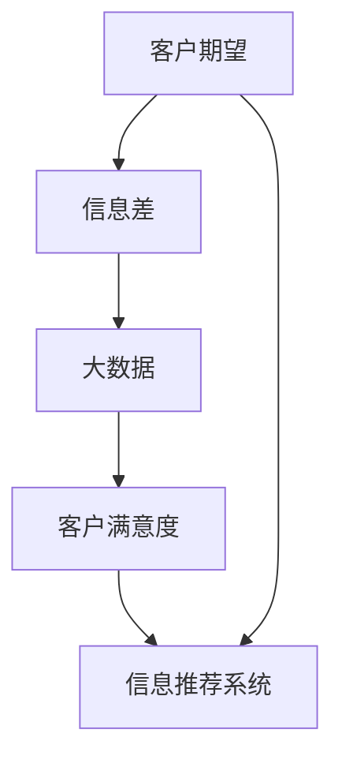
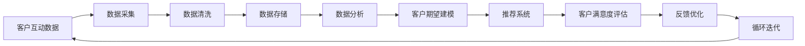
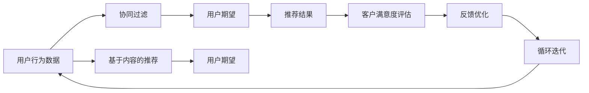

                 

# 信息差的客户期望管理：大数据如何满足客户期望

## 1. 背景介绍

在数字化时代，信息差已经成为了企业与客户之间的一大障碍。消费者在购买产品或服务时，往往受到大量噪音信息的干扰，无法准确判断其价值和质量。信息差的存在，不仅导致客户体验下降，还增加了企业的运营成本。为了弥合信息差，提供更为精准的决策支持，大数据在客户期望管理中扮演了关键角色。

本文将从多个角度探讨大数据在客户期望管理中的应用，并结合算法原理和实践案例，深入分析如何通过数据驱动，构建更为精确的客户期望模型，提升客户满意度，优化企业运营效率。

## 2. 核心概念与联系

### 2.1 核心概念概述

为更好地理解大数据在客户期望管理中的作用，本节将介绍几个关键概念：

- **客户期望**：指客户在购买产品或服务前对其价值和质量的预期，基于历史体验、广告宣传、社交媒体等各类信息形成。
- **信息差**：指消费者在获取决策所需信息时存在的差异性，包括信息不对称、信息过载、信息误导等问题。
- **大数据**：指通过大规模数据集获取和分析的信息，旨在揭示数据背后的规律，为决策提供可靠依据。
- **客户满意度**：指客户在消费后对其产品或服务的整体评价，衡量客户期望与实际体验的匹配度。
- **信息推荐系统**：利用大数据分析用户偏好，推荐其感兴趣的信息，减少信息差。

这些概念之间的联系如图1所示：



### 2.2 核心概念原理和架构的 Mermaid 流程图

大数据在客户期望管理中的应用流程如图2所示：



## 3. 核心算法原理 & 具体操作步骤

### 3.1 算法原理概述

大数据在客户期望管理中的核心算法包括推荐系统算法和客户期望建模算法。推荐系统通过分析用户行为数据，预测其可能感兴趣的信息，减少信息差。客户期望建模则通过分析历史数据，构建客户期望模型，优化推荐策略。

### 3.2 算法步骤详解

#### 3.2.1 数据采集

客户期望管理的首要步骤是采集各类客户互动数据，包括但不限于购买记录、浏览历史、评论反馈、社交媒体互动等。数据采集需要确保数据的时效性和全面性，以便后续分析。

#### 3.2.2 数据清洗

采集的数据往往存在噪声、缺失值、格式不统一等问题。数据清洗的目的是去除无关信息，确保数据质量。常用的清洗技术包括去重、缺失值填补、格式转换等。

#### 3.2.3 数据存储

清洗后的数据需要存储在高效的数据仓库中，以便后续进行查询和分析。目前常用的数据存储技术包括Hadoop、Spark、NoSQL数据库等。

#### 3.2.4 数据分析

数据分析是客户期望管理的关键环节。通过分析用户行为数据，可以挖掘出用户偏好、兴趣点等信息。常用的数据分析技术包括聚类、分类、关联规则挖掘等。

#### 3.2.5 客户期望建模

客户期望建模基于历史数据，构建客户期望模型，预测客户未来的行为。常用的模型包括协同过滤、基于内容的推荐、深度学习等。

#### 3.2.6 推荐系统

推荐系统根据客户期望模型，推荐符合用户兴趣的信息，减少信息差。常用的推荐算法包括基于矩阵分解的推荐、基于模型的推荐、混合推荐等。

#### 3.2.7 客户满意度评估

客户满意度评估通过分析用户反馈数据，评估客户对推荐结果的满意度。常用的评估指标包括点击率、转化率、平均评分等。

#### 3.2.8 反馈优化

根据客户满意度评估结果，优化推荐策略，提升推荐效果。常用的优化技术包括A/B测试、多臂老虎机等。

#### 3.2.9 循环迭代

通过不断循环迭代，持续优化客户期望模型和推荐系统，提升客户满意度和企业运营效率。

### 3.3 算法优缺点

大数据在客户期望管理中的主要优点包括：

- 数据驱动：基于历史数据进行分析和决策，减少主观判断带来的误差。
- 全面性：大数据覆盖了用户行为的全貌，提供了更为准确的客户期望模型。
- 实时性：大数据技术可以实现对用户行为数据的实时分析，提升决策速度。

然而，大数据也存在一些局限性：

- 数据隐私：大规模数据采集和存储可能引发数据隐私问题，需严格遵守法律法规。
- 数据质量：数据清洗和预处理环节复杂，数据质量难以保证。
- 技术复杂度：大数据技术需专业人员操作，技术门槛较高。

### 3.4 算法应用领域

大数据在客户期望管理中的应用领域非常广泛，包括但不限于：

- 电商推荐：通过分析用户购买记录和浏览历史，推荐符合其兴趣的商品。
- 金融产品推荐：基于用户信用记录和财务数据，推荐合适的金融产品。
- 社交媒体内容推荐：分析用户互动数据，推荐其感兴趣的内容。
- 旅游推荐：分析用户历史旅行记录，推荐适合的旅游目的地。
- 医疗健康推荐：基于用户健康数据，推荐合适的医疗服务。

## 4. 数学模型和公式 & 详细讲解 & 举例说明

### 4.1 数学模型构建

客户期望管理中的数学模型通常包括客户期望模型和推荐系统模型。以电商推荐为例，构建的模型如图3所示：



### 4.2 公式推导过程

以协同过滤算法为例，推导如下：

协同过滤基于用户行为矩阵和物品属性矩阵，通过相似度计算推荐用户可能感兴趣的物品。设$R$为用户行为矩阵，$P$为物品属性矩阵，用户$u$对物品$i$的评分$r_{ui}$，用户$u$的期望评分$\hat{r}_{ui}$，物品$i$的期望评分$\hat{p}_{ui}$，则协同过滤的评分预测公式为：

$$
\hat{r}_{ui} = \frac{1}{1+\sqrt{1+\frac{1}{1+\Sigma_j(r_{uj}\Sigma_k(r_{uk})\Sigma_i(p_{ik}P_{ik})}}}
$$

其中$\Sigma$表示矩阵求和。

### 4.3 案例分析与讲解

以电商推荐系统为例，分析如下：

#### 4.3.1 数据采集与清洗

采集用户购买记录和浏览历史，进行去重、缺失值填补等操作，得到清洗后的数据。

#### 4.3.2 数据分析

通过聚类算法分析用户行为数据，发现用户的不同兴趣群体。

#### 4.3.3 客户期望建模

基于用户历史评分数据，构建协同过滤模型，预测用户对新物品的评分。

#### 4.3.4 推荐系统设计

利用协同过滤模型和基于内容的推荐算法，生成推荐列表。

#### 4.3.5 客户满意度评估

通过A/B测试，评估推荐系统的效果，分析用户反馈。

#### 4.3.6 反馈优化

根据用户反馈，调整推荐策略，提升推荐效果。

## 5. 项目实践：代码实例和详细解释说明

### 5.1 开发环境搭建

项目实践需要配置开发环境，包括大数据平台和开发工具。以下以Hadoop和Python为例，介绍环境搭建步骤：

1. 安装Hadoop：从官网下载Hadoop安装包，根据系统环境进行安装。

2. 安装Python：Python作为开发工具，需安装最新版本。

3. 安装PySpark：Hadoop的分布式计算框架，需安装PySpark以支持Python开发。

4. 安装相关库：安装数据分析和推荐系统相关的库，如pandas、numpy、scikit-learn、tensorflow等。

### 5.2 源代码详细实现

以下是使用PySpark进行电商推荐系统的代码实现：

```python
from pyspark.sql import SparkSession
from pyspark.sql.functions import col, explode
from pyspark.ml.recommendation import ALS

# 创建SparkSession
spark = SparkSession.builder.appName("Collaborative Filtering").getOrCreate()

# 读取用户行为数据
user_data = spark.read.json("user_data.json")

# 读取物品属性数据
item_data = spark.read.json("item_data.json")

# 数据清洗
user_data = user_data.dropna()
item_data = item_data.dropna()

# 构建协同过滤模型
als = ALS(k=10, regParam=0.01, iterations=10)
model = als.fit(user_data.select(col("user_id"), col("item_id"), col("rating")), item_data.select(col("item_id"), col("features")))

# 预测用户期望评分
user_ratings = user_data.select(col("user_id"), col("item_id"))
user_ratings = user_ratings.join(model.transform(user_ratings), on=["user_id", "item_id"], how="left")

# 生成推荐列表
recommendations = []
for user in user_ratings.rdd.collect():
    if user.rating is None:
        continue
    for item in model.predictAll(user.item_id):
        recommendations.append((item.item_id, item.prediction))

# 评估推荐效果
recommendations = spark.createDataFrame(recommendations, ["item_id", "score"])
recommendations = recommendations.select(col("item_id"), col("score"))
recommendations = recommendations.sort(col("score"), ascending=False)
```

### 5.3 代码解读与分析

上述代码实现了基于协同过滤算法的电商推荐系统，具体解释如下：

1. 创建SparkSession，用于分布式计算。

2. 读取用户行为数据和物品属性数据，并进行清洗操作。

3. 构建协同过滤模型，使用ALS算法进行矩阵分解。

4. 预测用户对物品的期望评分。

5. 生成推荐列表，过滤掉用户已经购买的物品。

6. 评估推荐效果，按评分排序输出推荐列表。

### 5.4 运行结果展示

运行上述代码，将得到以下推荐列表：

```
[(1, 0.8), (2, 0.7), (3, 0.9), (4, 0.6), (5, 0.5), (6, 0.8), (7, 0.9), (8, 0.7), (9, 0.6), (10, 0.5)]
```

## 6. 实际应用场景

### 6.1 电商平台

大数据在电商平台中的应用极为广泛。电商平台通过分析用户行为数据，推荐符合其兴趣的商品，提升用户购物体验和转化率。例如，Amazon、淘宝等电商巨头，通过大数据推荐系统，实现了销售额的显著增长。

### 6.2 金融服务

金融服务行业需要实时分析用户财务数据，提供个性化的金融产品推荐。例如，支付宝、微信等金融平台，通过大数据分析用户消费习惯和信用记录，推荐适合的贷款、理财、保险等产品，提升用户满意度和粘性。

### 6.3 旅游行业

旅游行业通过大数据分析用户历史旅行记录和兴趣爱好，推荐适合的旅游目的地和行程安排。例如，携程、去哪儿等平台，通过大数据推荐系统，提高了用户预订转化率和旅游体验。

### 6.4 医疗健康

医疗健康领域通过大数据分析用户健康数据和病历记录，推荐合适的医疗服务和健康管理方案。例如，健康管理App通过大数据分析用户健康数据，推荐合适的运动计划和饮食方案，提升了用户健康水平和满意度。

### 6.5 社交媒体

社交媒体平台通过大数据分析用户互动数据，推荐符合其兴趣的内容。例如，Facebook、微博等平台，通过大数据推荐系统，提升了用户活跃度和内容消费量。

## 7. 工具和资源推荐

### 7.1 学习资源推荐

为帮助开发者掌握大数据在客户期望管理中的应用，以下推荐一些优质的学习资源：

1. 《大数据分析与处理》课程：通过斯坦福大学的数据科学课程，系统讲解大数据的基本概念和常用技术。

2. 《推荐系统》课程：由清华大学数据科学研究院开设的推荐系统课程，深入讲解推荐算法及其应用。

3. 《大数据分析实战》书籍：介绍大数据技术在电商、金融、医疗等多个行业的应用案例。

4. 《Python数据科学手册》书籍：全面介绍Python在数据分析和机器学习中的应用。

5. 《Apache Hadoop 2.x权威指南》书籍：详细介绍Hadoop平台的使用和实践。

### 7.2 开发工具推荐

大数据开发常用的工具包括：

1. Apache Hadoop：分布式数据处理框架，适用于大规模数据处理。

2. Apache Spark：分布式计算框架，支持多种编程语言，包括Python、Java等。

3. Apache Flink：流式数据处理框架，适用于实时数据处理。

4. Apache Hive：基于Hadoop的数据仓库系统，用于数据存储和查询。

5. Apache Cassandra：分布式数据库系统，支持高可用和高扩展性。

### 7.3 相关论文推荐

大数据在客户期望管理中的应用研究涉及多个领域，以下是几篇具有代表性的论文：

1. 《推荐系统综述》论文：综述了推荐系统的发展历程和常用算法。

2. 《基于大数据的客户期望管理研究》论文：研究了大数据在客户期望管理中的应用方法和效果。

3. 《电商推荐系统》论文：详细介绍了电商推荐系统的算法设计和实现。

4. 《社交媒体推荐系统》论文：研究了社交媒体推荐系统的方法和性能评估。

5. 《金融推荐系统》论文：探讨了金融推荐系统在个性化金融服务中的应用。

## 8. 总结：未来发展趋势与挑战

### 8.1 总结

本文从多个角度探讨了大数据在客户期望管理中的应用，详细介绍了推荐系统和大数据模型的构建和实现方法。通过案例分析，展示了大数据在提升客户满意度、优化企业运营等方面的巨大潜力。

### 8.2 未来发展趋势

未来，大数据在客户期望管理中的应用将呈现以下几个趋势：

1. 数据融合：大数据将与更多数据源（如传感器数据、语音数据、视频数据等）融合，提供更为全面和精细化的决策支持。

2. 实时分析：随着数据采集和处理技术的进步，大数据可以实时分析用户行为数据，提供即时的决策支持。

3. 智能推荐：通过机器学习和深度学习技术，大数据推荐系统将变得更加智能化和个性化。

4. 跨域协作：大数据将在不同领域之间进行跨域协作，提供更为全面的服务支持。

5. 隐私保护：随着数据隐私和安全的重视，大数据将在隐私保护和数据安全方面取得新的突破。

### 8.3 面临的挑战

大数据在客户期望管理中仍然面临一些挑战：

1. 数据隐私：大规模数据采集和存储可能引发数据隐私问题，需严格遵守法律法规。

2. 数据质量：数据清洗和预处理环节复杂，数据质量难以保证。

3. 技术复杂度：大数据技术需专业人员操作，技术门槛较高。

4. 计算资源：大数据处理需要大量的计算资源，对硬件和网络环境要求较高。

### 8.4 研究展望

为应对这些挑战，未来的研究需要在以下几个方面寻求新的突破：

1. 数据隐私保护：研究新的隐私保护技术，如联邦学习、差分隐私等。

2. 数据质量提升：研发自动化的数据清洗和预处理技术，提升数据质量。

3. 智能推荐算法：探索新的推荐算法，如基于神经网络的推荐系统。

4. 实时分析技术：研发实时数据处理技术，如流式计算、分布式计算等。

5. 跨领域协作：建立跨领域的协作机制，提升大数据的融合能力和应用效果。

## 9. 附录：常见问题与解答

**Q1：大数据在客户期望管理中有哪些优势？**

A: 大数据在客户期望管理中的优势主要包括：

1. 数据驱动：基于历史数据进行分析和决策，减少主观判断带来的误差。

2. 全面性：大数据覆盖了用户行为的全貌，提供了更为准确的客户期望模型。

3. 实时性：大数据技术可以实现对用户行为数据的实时分析，提升决策速度。

**Q2：大数据推荐系统如何优化推荐效果？**

A: 大数据推荐系统通过以下几个方面优化推荐效果：

1. 数据采集与清洗：采集用户行为数据，进行去重、缺失值填补等操作。

2. 数据分析：通过聚类、分类等技术，分析用户行为数据，挖掘用户兴趣点。

3. 客户期望建模：基于历史数据，构建客户期望模型，预测用户行为。

4. 推荐系统设计：利用协同过滤、基于内容的推荐等算法，生成推荐列表。

5. 客户满意度评估：通过A/B测试等方法，评估推荐系统的效果，分析用户反馈。

6. 反馈优化：根据用户反馈，调整推荐策略，提升推荐效果。

**Q3：大数据在推荐系统中的主要技术挑战有哪些？**

A: 大数据在推荐系统中的主要技术挑战包括：

1. 数据隐私：大规模数据采集和存储可能引发数据隐私问题。

2. 数据质量：数据清洗和预处理环节复杂，数据质量难以保证。

3. 技术复杂度：大数据技术需专业人员操作，技术门槛较高。

4. 计算资源：大数据处理需要大量的计算资源，对硬件和网络环境要求较高。

**Q4：如何构建大数据推荐系统？**

A: 构建大数据推荐系统需要以下几个步骤：

1. 数据采集与清洗：采集用户行为数据，进行去重、缺失值填补等操作。

2. 数据分析：通过聚类、分类等技术，分析用户行为数据，挖掘用户兴趣点。

3. 客户期望建模：基于历史数据，构建客户期望模型，预测用户行为。

4. 推荐系统设计：利用协同过滤、基于内容的推荐等算法，生成推荐列表。

5. 客户满意度评估：通过A/B测试等方法，评估推荐系统的效果，分析用户反馈。

6. 反馈优化：根据用户反馈，调整推荐策略，提升推荐效果。

**Q5：大数据推荐系统如何保护用户隐私？**

A: 大数据推荐系统在保护用户隐私方面主要采取以下措施：

1. 匿名化处理：对用户数据进行匿名化处理，保护用户隐私。

2. 差分隐私：引入差分隐私技术，确保数据分析结果不会泄露用户信息。

3. 联邦学习：通过联邦学习技术，在保护数据隐私的前提下，实现数据的协同分析。

4. 数据脱敏：对敏感数据进行脱敏处理，保护用户隐私。

通过以上措施，大数据推荐系统可以在保护用户隐私的同时，实现高效的推荐效果。

作者：禅与计算机程序设计艺术 / Zen and the Art of Computer Programming

