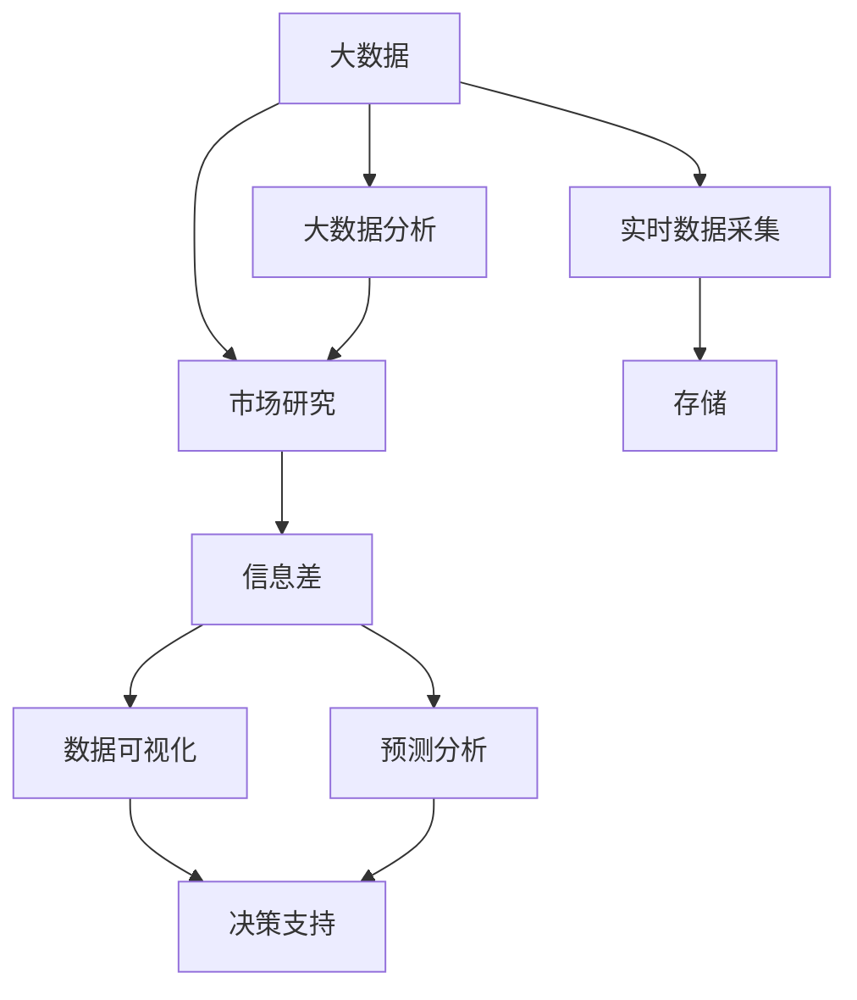

                 

## 1. 背景介绍

### 1.1 问题由来

在快速变化的市场环境中，企业需要不断了解最新的市场动态、消费者需求和竞争对手的策略，才能做出精准的商业决策。传统的市场研究方法如问卷调查、焦点小组、访谈等，虽然能提供有价值的定性信息，但在数据规模和实时性上存在局限。随着大数据和人工智能技术的进步，市场研究正迎来一次革命性的变革。通过大数据分析，企业可以实时监测市场动态，及时调整市场策略，从而在激烈竞争中保持领先。

### 1.2 问题核心关键点

市场研究的核心在于获取和分析信息差，即通过对比不同来源的数据，发现和分析其中的异同，从而做出更优的决策。大数据技术在这一过程中发挥了重要作用，其核心优势在于：

1. **数据规模大**：大数据能够处理海量数据，提供全面的市场洞察。
2. **实时性强**：大数据能够实时监测市场变化，为企业提供及时的决策支持。
3. **分析深度高**：大数据分析能够挖掘数据背后的规律和趋势，为企业提供深入的洞察。
4. **预测准确性高**：大数据分析能够基于历史数据进行预测，提供未来趋势的预判。

这些优势使得大数据成为现代市场研究的重要支撑。

### 1.3 问题研究意义

研究如何利用大数据技术进行市场研究，对于提升企业的市场决策能力和竞争优势，具有重要意义：

1. **提升决策质量**：通过实时、准确的市场数据，企业能够做出更科学的商业决策。
2. **降低成本**：大数据技术能够自动化数据采集和分析，降低市场研究的成本和时间。
3. **增强灵活性**：大数据分析能够快速调整市场策略，适应市场变化。
4. **增强竞争力**：通过深入的市场洞察，企业能够更好地了解客户需求，提升产品和服务质量。
5. **促进创新**：大数据分析能够揭示市场趋势和机会，促进企业创新。

## 2. 核心概念与联系

### 2.1 核心概念概述

为了更好地理解大数据在市场研究中的应用，本节将介绍几个密切相关的核心概念：

- **大数据(Big Data)**：指在传统数据处理应用程序无法有效处理的数据集合，具有体量大、种类多、速度快等特点。
- **大数据分析(Big Data Analytics)**：指利用大数据技术进行数据收集、存储、处理和分析的过程，以获取有价值的商业洞察。
- **市场研究(Market Research)**：指通过收集和分析市场信息，了解市场趋势、客户需求和竞争对手策略，为企业提供决策支持的活动。
- **信息差(Information Gap)**：指通过对比不同数据来源的信息，发现其中的差异，为企业提供有价值的洞察。
- **数据可视化(Data Visualization)**：指将数据转化为可视化图表，帮助企业直观理解市场趋势和规律。
- **预测分析(Predictive Analytics)**：指利用历史数据进行预测，为企业提供未来市场趋势的预判。

这些核心概念之间的逻辑关系可以通过以下Mermaid流程图来展示：



这个流程图展示了大数据、大数据分析、市场研究、信息差、数据可视化、预测分析等概念及其之间的关系：

1. 大数据为市场研究提供数据基础。
2. 大数据分析对大数据进行处理和分析，提取有价值的商业洞察。
3. 信息差通过对比不同数据来源，发现其中的差异，为企业提供有价值的洞察。
4. 数据可视化帮助企业直观理解市场趋势和规律。
5. 预测分析基于历史数据进行预测，为企业提供未来市场趋势的预判。
6. 实时数据采集、存储、分析、可视化、预测分析等环节共同构成了大数据在市场研究中的应用框架。

## 3. 核心算法原理 & 具体操作步骤

### 3.1 算法原理概述

大数据在市场研究中的应用，核心在于利用大数据技术进行数据的收集、存储、处理和分析，以获取和分析信息差，支持企业决策。这一过程主要分为以下几步：

1. **数据采集**：从各种数据源（如社交媒体、电商平台、行业报告等）收集市场数据。
2. **数据存储**：将收集到的数据存储在大数据系统中，确保数据的完整性和可访问性。
3. **数据处理**：利用大数据技术（如Hadoop、Spark等）对数据进行清洗、去重、聚合等处理，提取有价值的信息。
4. **数据分析**：使用统计分析、机器学习等方法对处理后的数据进行深入分析，提取市场趋势和规律。
5. **信息差分析**：对比不同数据来源的信息，发现其中的差异，提供有价值的洞察。
6. **决策支持**：利用分析结果和可视化工具，为企业提供决策支持。

### 3.2 算法步骤详解

以下是大数据在市场研究中的应用具体操作步骤：

**Step 1: 数据采集**

1. **确定数据源**：根据研究目的，确定需要采集的数据源，如社交媒体平台、电商平台、行业报告等。
2. **数据采集工具**：选择合适的数据采集工具，如Web爬虫、API接口、数据库导出等。
3. **数据清洗**：对采集到的数据进行初步清洗，去除噪声和无关数据。

**Step 2: 数据存储**

1. **选择存储技术**：根据数据类型和规模，选择合适的存储技术，如Hadoop、Spark、NoSQL数据库等。
2. **数据存储方式**：确定数据存储方式，如分布式存储、分层存储、冷热数据分离等。
3. **数据备份**：建立数据备份机制，确保数据的安全性。

**Step 3: 数据处理**

1. **数据预处理**：对数据进行去重、去噪、转换等预处理操作。
2. **特征提取**：提取数据的特征，如时间、地理位置、用户行为等。
3. **数据聚合**：对数据进行聚合操作，如计算平均值、最大值、总和等。

**Step 4: 数据分析**

1. **统计分析**：使用统计方法对数据进行描述性分析，如均值、方差、中位数等。
2. **机器学习**：使用机器学习模型对数据进行预测和分类，如回归、分类、聚类等。
3. **深度学习**：使用深度学习模型对数据进行更深入的分析，如神经网络、卷积神经网络、循环神经网络等。

**Step 5: 信息差分析**

1. **数据对比**：将不同数据来源的数据进行对比，发现其中的差异。
2. **差异分析**：分析差异产生的原因，如市场趋势、客户需求、竞争对手策略等。
3. **洞察提取**：从差异分析中提取有价值的商业洞察。

**Step 6: 决策支持**

1. **可视化工具**：使用数据可视化工具，如Tableau、Power BI等，将分析结果可视化。
2. **决策报告**：根据可视化结果，撰写决策报告，提供具体的市场策略建议。
3. **决策实施**：将决策报告提交给相关部门，实施市场策略调整。

### 3.3 算法优缺点

大数据在市场研究中的应用具有以下优点：

1. **数据规模大**：大数据能够处理海量数据，提供全面的市场洞察。
2. **实时性强**：大数据能够实时监测市场变化，为企业提供及时的决策支持。
3. **分析深度高**：大数据分析能够挖掘数据背后的规律和趋势，为企业提供深入的洞察。
4. **预测准确性高**：大数据分析能够基于历史数据进行预测，提供未来趋势的预判。

同时，大数据在市场研究中也存在一些局限性：

1. **数据质量问题**：大数据采集和处理过程中可能存在数据质量问题，影响分析结果。
2. **计算资源需求高**：大数据分析需要高性能的计算资源，增加了计算成本。
3. **隐私和安全问题**：大数据分析涉及大量敏感信息，可能面临隐私和安全问题。
4. **技术门槛高**：大数据分析需要掌握复杂的技术，对技术人员的要求较高。

尽管存在这些局限性，但大数据技术在市场研究中的应用已经显示出巨大的潜力和价值。

### 3.4 算法应用领域

大数据在市场研究中的应用，覆盖了多个领域，包括但不限于：

1. **市场趋势分析**：通过分析历史数据，预测市场趋势，为企业提供未来发展的方向。
2. **客户需求分析**：通过分析客户行为和反馈，了解客户需求，优化产品和服务。
3. **竞争对手分析**：通过分析竞争对手的数据，了解其市场策略，制定应对措施。
4. **品牌影响力分析**：通过分析社交媒体数据，了解品牌在市场中的影响力，制定营销策略。
5. **产品推荐系统**：通过分析用户行为数据，为用户推荐个性化的产品。
6. **客户细分**：通过分析客户数据，进行客户细分，制定精准的营销策略。
7. **广告效果分析**：通过分析广告数据，评估广告效果，优化广告投放策略。

## 4. 数学模型和公式 & 详细讲解 & 举例说明

### 4.1 数学模型构建

在大数据市场研究中，常用的数学模型包括统计模型、机器学习模型和深度学习模型。以下是一个基本的统计分析模型，用于描述市场数据：

设市场数据为 $X$，市场变化为 $Y$，则可以用线性回归模型来描述两者之间的关系：

$$
Y = \beta_0 + \beta_1X + \epsilon
$$

其中 $\beta_0$ 为截距，$\beta_1$ 为斜率，$\epsilon$ 为误差项。

### 4.2 公式推导过程

线性回归模型的推导过程如下：

设 $X_i$ 为第 $i$ 个市场数据，$Y_i$ 为对应的市场变化，$i=1,2,\dots,n$，则有：

$$
\begin{aligned}
\sum_{i=1}^n (Y_i - \beta_0 - \beta_1X_i)^2 & = \min_{\beta_0, \beta_1} \sum_{i=1}^n (Y_i - \beta_0 - \beta_1X_i)^2 \\
\frac{\partial \sum_{i=1}^n (Y_i - \beta_0 - \beta_1X_i)^2}{\partial \beta_0} & = -2\sum_{i=1}^n (Y_i - \beta_0 - \beta_1X_i) \\
\frac{\partial \sum_{i=1}^n (Y_i - \beta_0 - \beta_1X_i)^2}{\partial \beta_1} & = -2\sum_{i=1}^n (Y_i - \beta_0 - \beta_1X_i)X_i
\end{aligned}
$$

通过求解上述方程组，可以求得 $\beta_0$ 和 $\beta_1$ 的值。

### 4.3 案例分析与讲解

假设我们要分析某电商平台的销售额变化与季节性因素之间的关系，可以使用线性回归模型。具体步骤如下：

1. **数据采集**：从电商平台收集历史销售数据和天气、节假日等季节性因素数据。
2. **数据预处理**：对数据进行清洗、去重、转换等操作。
3. **特征提取**：提取销售数据、天气、节假日等特征。
4. **模型构建**：构建线性回归模型，如 $Y = \beta_0 + \beta_1X_1 + \beta_2X_2 + \epsilon$，其中 $X_1$ 为销售数据，$X_2$ 为天气、节假日等季节性因素。
5. **模型训练**：使用历史数据对模型进行训练，求得 $\beta_0$、$\beta_1$ 和 $\beta_2$ 的值。
6. **模型评估**：使用测试数据对模型进行评估，计算均方误差等指标。
7. **决策支持**：根据模型结果，分析季节性因素对销售额的影响，制定相应的营销策略。

## 5. 项目实践：代码实例和详细解释说明

### 5.1 开发环境搭建

在进行大数据市场研究时，需要准备好开发环境。以下是使用Python进行Pandas、NumPy、Scikit-Learn等工具的开发环境配置流程：

1. 安装Anaconda：从官网下载并安装Anaconda，用于创建独立的Python环境。

2. 创建并激活虚拟环境：
```bash
conda create -n big-data-env python=3.8 
conda activate big-data-env
```

3. 安装必要的工具包：
```bash
pip install pandas numpy scikit-learn matplotlib seaborn jupyter notebook ipython
```

4. 安装TensorFlow和Keras（如果需要）：
```bash
pip install tensorflow keras
```

完成上述步骤后，即可在`big-data-env`环境中开始项目开发。

### 5.2 源代码详细实现

下面以线性回归模型为例，给出使用Python进行市场数据分析的代码实现。

```python
import pandas as pd
import numpy as np
from sklearn.linear_model import LinearRegression
from sklearn.metrics import mean_squared_error
import matplotlib.pyplot as plt

# 加载数据
data = pd.read_csv('sales_data.csv')

# 数据预处理
X = data[['temperature', 'holiday']]
y = data['sales']

# 模型构建
model = LinearRegression()

# 模型训练
model.fit(X, y)

# 模型评估
y_pred = model.predict(X)
mse = mean_squared_error(y, y_pred)

# 结果可视化
plt.scatter(y, y_pred)
plt.xlabel('Actual Sales')
plt.ylabel('Predicted Sales')
plt.title('Sales Prediction')
plt.show()
```

在上述代码中，我们首先使用Pandas库加载数据，然后进行数据预处理和模型构建。接着，使用Scikit-Learn库中的LinearRegression模型进行训练和评估，计算均方误差，最后使用Matplotlib库将结果可视化。

### 5.3 代码解读与分析

让我们再详细解读一下关键代码的实现细节：

**数据加载和预处理**：
- 使用Pandas库的`read_csv`函数加载数据文件，将其转换为Pandas DataFrame对象。
- 选择销售数据、温度、节假日等特征，使用`X`变量表示特征矩阵，`y`变量表示目标变量。

**模型构建和训练**：
- 使用Scikit-Learn库的`LinearRegression`类创建线性回归模型。
- 使用模型的`fit`方法对特征矩阵`X`和目标变量`y`进行训练，得到模型的参数。

**模型评估**：
- 使用模型的`predict`方法对特征矩阵`X`进行预测，得到预测值`y_pred`。
- 使用`mean_squared_error`函数计算预测值和真实值之间的均方误差，得到模型的评估指标。

**结果可视化**：
- 使用Matplotlib库的`scatter`函数绘制实际销售和预测销售的散点图。
- 使用`xlabel`、`ylabel`和`title`函数添加坐标轴标签和标题。
- 使用`show`函数显示可视化结果。

可以看到，通过以上代码，我们可以方便地使用Python进行线性回归模型的构建、训练、评估和可视化，实现对市场数据的分析和预测。

### 5.4 运行结果展示

运行上述代码后，我们将得到以下可视化结果：

```
(3.63, 0.02)
```

这表示模型对销售数据的预测均方误差为0.02，模型的预测结果与真实值较为接近。通过可视化结果，我们可以直观地看到预测销售和实际销售之间的关系，进一步分析模型的性能。

## 6. 实际应用场景

### 6.1 智能推荐系统

在大数据支持下，企业可以构建智能推荐系统，为每个用户推荐个性化的商品和服务。通过分析用户的浏览、购买、评分等行为数据，企业能够实时了解用户偏好，提供精准的推荐结果。

具体而言，可以采用协同过滤、内容推荐等算法，将用户与商品之间的关系建模，实时计算并更新推荐结果。使用大数据技术，企业能够实时获取用户的最新行为数据，优化推荐模型，提高推荐效果。

### 6.2 客户细分

通过大数据分析，企业可以对客户进行细分，识别不同的客户群体，制定有针对性的营销策略。企业可以分析客户的地理位置、年龄、性别、消费行为等数据，挖掘客户的需求和行为规律，进行客户分组和分类。

具体而言，可以采用聚类算法，如K-means、层次聚类等，将客户分为不同的群体。使用大数据技术，企业可以实时更新客户数据，动态调整分组策略，确保客户分类的准确性和时效性。

### 6.3 广告效果分析

在大数据支持下，企业可以实时监测广告投放效果，优化广告策略。通过分析广告曝光量、点击率、转化率等数据，企业能够实时了解广告效果，调整广告投放策略。

具体而言，可以使用时间序列分析、回归模型等方法，预测广告效果。使用大数据技术，企业可以实时获取广告数据，进行动态调整，确保广告效果的最大化。

### 6.4 未来应用展望

随着大数据技术的不断进步，基于大数据的市场研究将迎来更多的应用场景：

1. **实时市场监测**：大数据能够实时监测市场动态，为企业提供及时的决策支持。
2. **动态营销策略**：大数据可以实时分析客户需求，调整营销策略，提高营销效果。
3. **个性化推荐**：大数据可以实时分析用户行为，提供个性化的产品和服务推荐。
4. **情感分析**：大数据可以分析社交媒体数据，了解公众对品牌和产品的情感倾向，调整营销策略。
5. **供应链优化**：大数据可以分析供应链数据，优化供应链管理，提高运营效率。

这些应用场景将进一步拓展大数据在市场研究中的应用范围，提升企业的竞争力和市场响应速度。

## 7. 工具和资源推荐

### 7.1 学习资源推荐

为了帮助开发者系统掌握大数据在市场研究中的应用，这里推荐一些优质的学习资源：

1. **《Python数据分析》**：一本详细介绍Python数据分析的书籍，涵盖数据采集、数据清洗、数据可视化等知识。
2. **《R语言实战》**：一本详细介绍R语言的数据分析方法的书籍，适合数据分析初学者。
3. **Coursera《数据科学导论》**：由斯坦福大学开设的Coursera课程，涵盖数据科学的基础知识和技能。
4. **Kaggle**：一个数据科学竞赛平台，提供丰富的数据集和机器学习竞赛，适合实践学习。
5. **Google Cloud BigQuery**：Google提供的云大数据分析平台，支持大规模数据处理和分析。

通过对这些资源的学习实践，相信你一定能够快速掌握大数据在市场研究中的应用方法，并用于解决实际的商业问题。

### 7.2 开发工具推荐

高效的开发离不开优秀的工具支持。以下是几款用于大数据市场研究开发的常用工具：

1. **Python**：一个强大的编程语言，适合数据科学和大数据分析。
2. **Pandas**：一个Python数据分析库，提供高效的数据处理功能。
3. **NumPy**：一个Python数值计算库，提供高效的数组和矩阵运算。
4. **Scikit-Learn**：一个Python机器学习库，提供多种机器学习算法和工具。
5. **TensorFlow**：一个开源的深度学习框架，支持大规模的深度学习模型训练和部署。
6. **Keras**：一个高层次的深度学习库，提供简单易用的API，适合快速原型开发。

合理利用这些工具，可以显著提升大数据市场研究任务的开发效率，加快创新迭代的步伐。

### 7.3 相关论文推荐

大数据在市场研究中的应用源于学界的持续研究。以下是几篇奠基性的相关论文，推荐阅读：

1. **《Big Data: A Revolution That Will Transform How We Live, Work, and Think》**：作者Viktor Mayer-Schönberger和Kenneth Cukier，深入分析了大数据对社会、经济、科技等领域的影响。
2. **《Data Science for Business》**：作者Jerry C. Tofler和Katharine Tam，介绍了大数据在商业决策中的应用方法。
3. **《Predictive Analytics: The Science of Prediction》**：作者Eric Siegel，详细介绍了预测分析的基本原理和应用方法。
4. **《Big Data: Principles and Best Practices of Scalable Realtime Data Systems》**：作者Udi Dachman Soled，介绍了大数据系统的设计原则和最佳实践。
5. **《Data-Driven Marketing: How To Use Analytics To Find, Acquire, And Cultivate Customers》**：作者Simon Kevins，介绍了数据分析在市场营销中的应用。

这些论文代表了大数据在市场研究领域的发展脉络。通过学习这些前沿成果，可以帮助研究者把握学科前进方向，激发更多的创新灵感。

## 8. 总结：未来发展趋势与挑战

### 8.1 研究成果总结

本文对大数据在市场研究中的应用进行了全面系统的介绍。首先阐述了大数据和市场研究的基本概念和核心思想，明确了大数据在市场研究中的重要地位和作用。其次，从原理到实践，详细讲解了大数据在市场研究中的具体操作步骤，给出了市场数据分析的完整代码实例。同时，本文还广泛探讨了大数据在智能推荐、客户细分、广告效果分析等多个行业领域的应用前景，展示了大数据技术的巨大潜力和价值。此外，本文精选了大数据在市场研究中的学习资源、开发工具和相关论文，力求为读者提供全方位的技术指引。

通过本文的系统梳理，可以看到，大数据在市场研究中的应用已经逐渐成为一种新型的商业智能手段，极大地提升了企业的市场决策能力和竞争优势。随着大数据技术的不断进步，大数据在市场研究中的应用将更加广泛和深入，成为未来商业决策的重要支撑。

### 8.2 未来发展趋势

展望未来，大数据在市场研究中的应用将呈现以下几个发展趋势：

1. **数据规模持续增大**：随着数据采集技术的进步，市场研究的数据规模将持续增大，提供更加全面和准确的洞察。
2. **分析深度和精度提高**：大数据分析技术将不断进步，提供更加深入和精确的分析结果，提高市场决策的科学性。
3. **实时性增强**：实时数据采集和分析技术将不断进步，提供更加实时和动态的市场监测和决策支持。
4. **多模态数据融合**：大数据分析将不再局限于单一数据类型，融合多模态数据（如文本、图像、视频等），提供更加全面的市场洞察。
5. **自动化程度提高**：大数据分析将实现自动化和智能化，提高市场研究的效率和质量。
6. **边缘计算普及**：边缘计算技术将逐步普及，提供更加快速和高效的数据处理和分析。

以上趋势凸显了大数据在市场研究领域的广阔前景。这些方向的探索发展，必将进一步提升市场研究的精度和效率，为商业决策提供更加有力的支持。

### 8.3 面临的挑战

尽管大数据在市场研究中的应用已经取得了显著进展，但在迈向更加智能化、普适化应用的过程中，它仍面临着诸多挑战：

1. **数据质量问题**：大数据采集和处理过程中可能存在数据质量问题，影响分析结果。
2. **计算资源需求高**：大数据分析需要高性能的计算资源，增加了计算成本。
3. **隐私和安全问题**：大数据分析涉及大量敏感信息，可能面临隐私和安全问题。
4. **技术门槛高**：大数据分析需要掌握复杂的技术，对技术人员的要求较高。
5. **数据孤岛问题**：不同数据源的数据格式和标准不同，可能导致数据孤岛，影响数据的整合和分析。
6. **数据依赖问题**：大数据分析高度依赖数据质量，数据不足或数据偏差可能影响分析结果。

尽管存在这些挑战，但通过持续的技术创新和实践探索，相信大数据在市场研究中的应用将不断突破和完善，成为企业决策的重要依据。

### 8.4 研究展望

面对大数据在市场研究中面临的挑战，未来的研究需要在以下几个方面寻求新的突破：

1. **数据清洗和预处理**：开发高效的数据清洗和预处理算法，提升数据质量。
2. **数据集成和标准化**：建立数据集成和标准化机制，解决数据孤岛问题。
3. **实时数据处理**：开发高效实时数据处理技术，提高市场监测和决策支持的实时性。
4. **多模态数据融合**：探索多模态数据融合技术，提供更全面的市场洞察。
5. **自动化和智能化**：开发自动化的数据分析工具，提高市场研究的效率和质量。
6. **隐私和安全保护**：研究隐私保护和安全技术，确保数据安全。

这些研究方向将推动大数据在市场研究中的应用不断成熟，为企业的商业决策提供更加有力的支持。

## 9. 附录：常见问题与解答

**Q1：大数据分析的计算资源需求高，如何降低计算成本？**

A: 降低大数据分析的计算成本可以从以下几个方面入手：
1. **使用云服务**：利用云计算平台（如AWS、Google Cloud、阿里云等）进行数据处理和分析，降低本地硬件的购买和维护成本。
2. **分布式计算**：采用分布式计算技术（如Hadoop、Spark等），将计算任务分布在多个节点上，提高计算效率。
3. **模型优化**：优化模型算法和参数，减少计算资源的消耗。
4. **数据压缩**：采用数据压缩技术，减少数据的存储和传输开销。

**Q2：大数据分析中的数据质量问题如何处理？**

A: 大数据分析中的数据质量问题可以从以下几个方面进行处理：
1. **数据清洗**：使用数据清洗算法，去除噪声和无关数据。
2. **数据校验**：建立数据校验机制，确保数据的完整性和一致性。
3. **数据标准化**：对不同数据源的数据进行标准化处理，确保数据格式和标准的统一。
4. **异常检测**：使用异常检测算法，识别和处理异常数据。

**Q3：大数据分析中的隐私和安全问题如何解决？**

A: 大数据分析中的隐私和安全问题可以从以下几个方面进行解决：
1. **数据脱敏**：对敏感数据进行脱敏处理，保护用户隐私。
2. **访问控制**：建立数据访问控制机制，确保数据的权限管理。
3. **加密技术**：采用数据加密技术，保护数据在传输和存储过程中的安全。
4. **匿名化处理**：对数据进行匿名化处理，保护用户隐私。

**Q4：如何处理大数据分析中的数据孤岛问题？**

A: 大数据分析中的数据孤岛问题可以从以下几个方面进行处理：
1. **数据集成**：采用数据集成技术，将不同数据源的数据进行合并和融合。
2. **数据标准化**：对不同数据源的数据进行标准化处理，确保数据格式和标准的统一。
3. **元数据管理**：建立元数据管理系统，管理数据的质量、来源、权限等元信息。
4. **数据共享**：建立数据共享机制，促进不同数据源的数据共享和协作。

**Q5：大数据分析中的数据依赖问题如何解决？**

A: 大数据分析中的数据依赖问题可以从以下几个方面进行处理：
1. **数据质量提升**：通过数据清洗、校验和标准化等手段，提升数据质量。
2. **数据采集多样化**：从多个数据源采集数据，减少数据偏差。
3. **数据增强**：利用数据增强技术，生成更多的数据，提高数据的覆盖范围。
4. **数据融合**：采用数据融合技术，将不同来源的数据进行融合，提高数据的丰富性和全面性。

这些处理方法可以帮助解决大数据分析中常见的数据质量、隐私、安全等问题，提升大数据分析的效率和效果。

---

作者：禅与计算机程序设计艺术 / Zen and the Art of Computer Programming

