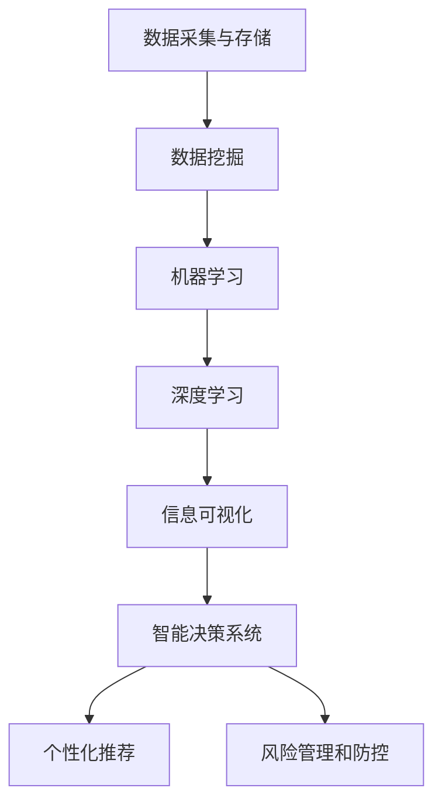

                 

## 1. 背景介绍

### 1.1 问题由来

在信息时代，信息差（Information Gap）问题变得愈发突出，它指市场供需双方对于信息的不对等性。信息差的存在导致价格不公、市场失衡、资源浪费等问题，严重阻碍了经济的健康发展。例如，在金融领域，金融产品定价和风险评估常常依赖于复杂的历史数据和市场信息，金融机构凭借对信息的不对称优势，从中获利，而普通消费者却难以获得同等的信息资源。

因此，如何利用技术手段打破信息差壁垒，提高信息透明度，使资源配置更加公平、高效，成为当下亟需解决的问题。大数据技术的兴起，为这一问题的解决提供了新的思路和方法。通过收集和分析大量数据，可以揭示市场的真实情况，实现更准确的定价和决策，从而重塑商业格局。

### 1.2 问题核心关键点

解决信息差问题，主要从两个方面入手：一是提升信息的可获得性和可访问性；二是提升信息的可理解性和可操作性。大数据技术通过收集和处理海量数据，提供了前所未有的信息量，为决策者提供了更好的支持。

以下是大数据技术在解决信息差问题中的关键点：

1. **数据采集与存储**：通过传感器、互联网、物联网等手段，采集海量数据，并利用云存储技术进行存储，保证数据的完整性和可用性。

2. **数据分析与挖掘**：利用机器学习、深度学习、数据挖掘等算法，对数据进行建模分析，挖掘数据背后的规律和趋势，辅助决策。

3. **信息可视化**：通过图表、仪表盘等可视化工具，将数据分析结果直观展示，帮助决策者理解数据，做出决策。

4. **智能决策系统**：开发智能决策系统，利用大数据分析结果，实现自动化的决策支持。

5. **个性化推荐与营销**：通过大数据分析用户行为和偏好，实现个性化推荐和精准营销，提高用户满意度和品牌忠诚度。

6. **风险管理和防控**：利用大数据技术进行风险分析和预警，提前发现潜在风险，采取防控措施，保障企业运营安全。

### 1.3 问题研究意义

解决信息差问题，对于提升市场效率、促进公平竞争、降低企业运营成本、提升用户体验等方面具有重要意义：

1. **提升市场效率**：通过打破信息差壁垒，消除信息不对称性，实现资源的更有效配置，提升市场效率。

2. **促进公平竞争**：提供更透明的信息，防止垄断和不正当竞争行为，促进市场的公平竞争。

3. **降低企业运营成本**：通过数据驱动的决策，减少人为判断的误差，提高决策效率和准确性，降低运营成本。

4. **提升用户体验**：提供个性化的服务和产品，满足用户需求，提升用户体验和品牌忠诚度。

5. **风险管理和防控**：通过大数据技术，提前发现并规避风险，保障企业稳定运营。

## 2. 核心概念与联系

### 2.1 核心概念概述

大数据技术在解决信息差问题中的应用，主要涉及以下几个核心概念：

1. **大数据**：指通过采集和处理海量数据，揭示数据背后的规律和趋势，支持决策的技术和手段。

2. **数据挖掘**：指利用算法从数据中挖掘有用信息的过程。

3. **机器学习**：指利用数据训练模型，实现自动化决策和预测的技术。

4. **深度学习**：指通过多层神经网络结构，处理复杂数据的高级机器学习方法。

5. **信息可视化**：指将数据转换为图形或图表，直观展示数据结果，辅助决策。

6. **智能决策系统**：指利用大数据分析结果，实现自动化的决策支持系统。

7. **个性化推荐**：指根据用户行为和偏好，提供个性化的服务和产品，提升用户体验。

8. **风险管理和防控**：指通过大数据技术进行风险分析和预警，提前发现并规避风险。

这些核心概念之间有着密切的联系，共同构成了一个完整的大数据应用框架。通过数据的采集和存储，利用数据分析和挖掘技术，最终通过信息可视化、智能决策系统、个性化推荐等手段，实现信息差问题的有效解决。

### 2.2 核心概念原理和架构的 Mermaid 流程图



这个流程图展示了大数据技术在解决信息差问题中的主要流程：数据采集与存储是基础，数据挖掘、机器学习和深度学习是核心分析手段，信息可视化和智能决策系统是决策支持的关键，个性化推荐和风险管理则是具体应用场景。

## 3. 核心算法原理 & 具体操作步骤

### 3.1 算法原理概述

大数据在解决信息差问题中，主要采用数据驱动的决策方法，其核心原理如下：

1. **数据收集**：通过传感器、互联网、物联网等手段，收集市场、用户、环境等各方面的数据。

2. **数据存储**：利用云存储技术，存储和保存收集的数据，保证数据的完整性和可用性。

3. **数据处理**：利用数据挖掘和机器学习技术，对数据进行预处理、特征提取、模型训练等操作，提取有用的信息。

4. **信息展示**：通过信息可视化工具，将分析结果以图形或图表的形式展示，辅助决策。

5. **决策支持**：利用智能决策系统，根据数据分析结果，实现自动化决策和预测。

6. **个性化推荐**：利用用户行为数据，提供个性化的服务和产品。

7. **风险防控**：利用大数据技术，进行风险分析和预警，提前发现并规避风险。

### 3.2 算法步骤详解

#### 3.2.1 数据收集与存储

1. **数据来源**：
   - 传感器数据：收集物联网设备、智能穿戴设备等产生的数据。
   - 互联网数据：收集用户浏览行为、搜索记录、社交媒体数据等。
   - 第三方数据：通过API获取第三方平台的数据，如天气数据、交通数据等。

2. **数据存储**：
   - 使用云存储服务，如Amazon S3、Google Cloud Storage等，存储大量数据。
   - 使用分布式文件系统，如Hadoop HDFS、Apache Kafka等，进行大规模数据存储和管理。

#### 3.2.2 数据挖掘与分析

1. **数据清洗**：
   - 去除噪声数据、缺失数据，保证数据质量。
   - 处理异常值、重复数据，保证数据一致性。

2. **特征提取**：
   - 通过PCA、LDA等算法，提取数据中的关键特征。
   - 通过TF-IDF、Word2Vec等技术，将文本数据转换为数值特征。

3. **模型训练**：
   - 使用分类、回归、聚类等算法，训练模型，提取规律和趋势。
   - 使用深度学习框架，如TensorFlow、PyTorch等，进行复杂数据建模。

4. **结果评估**：
   - 使用交叉验证、AUC、RMSE等指标，评估模型性能。
   - 使用可视化工具，如Matplotlib、Tableau等，展示模型结果。

#### 3.2.3 信息展示与决策支持

1. **信息可视化**：
   - 使用图表、仪表盘等工具，展示分析结果。
   - 使用Dash、PowerBI等工具，实现交互式可视化。

2. **智能决策支持**：
   - 使用决策支持系统，如IBM Watson、Microsoft Azure AI等，实现自动化决策。
   - 使用自然语言处理技术，实现自动报告生成。

#### 3.2.4 个性化推荐与风险管理

1. **个性化推荐**：
   - 使用协同过滤、内容推荐等算法，提供个性化推荐。
   - 使用深度学习技术，构建推荐模型，提高推荐效果。

2. **风险管理**：
   - 使用聚类、分类等算法，进行风险识别和分类。
   - 使用异常检测、预测建模等技术，进行风险预警和防控。

### 3.3 算法优缺点

大数据技术在解决信息差问题中具有以下优点：

1. **数据量大**：通过收集和处理海量数据，提供更全面的信息。
2. **实时性强**：利用流数据处理技术，实现实时决策。
3. **精度高**：通过机器学习、深度学习等高级算法，提高分析精度。
4. **可扩展性强**：利用分布式计算技术，实现大规模数据处理。
5. **灵活性好**：利用数据挖掘技术，支持多种数据类型和应用场景。

同时，大数据技术也存在以下缺点：

1. **数据质量问题**：数据采集和存储过程中，存在数据噪声、缺失等问题。
2. **隐私问题**：大数据收集和处理过程中，存在用户隐私泄露的风险。
3. **计算成本高**：大数据分析需要高性能计算资源，计算成本较高。
4. **算法复杂度高**：大数据分析需要复杂的算法和模型，实现难度大。
5. **可解释性差**：大数据分析结果往往是“黑盒”模型，难以解释其内部逻辑。

### 3.4 算法应用领域

大数据技术在解决信息差问题中的应用，涵盖了多个领域，主要包括以下几个方面：

1. **金融**：
   - 风险管理：利用大数据技术进行信用评估、风险识别、欺诈检测等。
   - 智能投顾：利用大数据分析用户行为，提供个性化投资建议。

2. **零售**：
   - 个性化推荐：根据用户行为和偏好，提供个性化的商品推荐。
   - 需求预测：利用大数据预测市场需求，优化库存管理。

3. **医疗**：
   - 疾病预测：利用大数据分析患者数据，预测疾病风险。
   - 治疗方案推荐：利用大数据分析患者数据，推荐最佳治疗方案。

4. **物流**：
   - 路径规划：利用大数据分析交通数据，优化物流路径。
   - 需求预测：利用大数据预测市场需求，优化物流资源配置。

5. **旅游**：
   - 个性化推荐：根据用户行为和偏好，提供个性化的旅游推荐。
   - 需求预测：利用大数据预测旅游需求，优化旅游资源配置。

## 4. 数学模型和公式 & 详细讲解 & 举例说明

### 4.1 数学模型构建

大数据技术在解决信息差问题中，主要涉及以下几个数学模型：

1. **回归模型**：用于预测连续数值型数据的模型。
2. **分类模型**：用于预测离散分类数据的模型。
3. **聚类模型**：用于将数据分为不同类别的模型。
4. **推荐系统模型**：用于提供个性化推荐的模型。
5. **异常检测模型**：用于识别数据异常的模型。

### 4.2 公式推导过程

#### 4.2.1 回归模型

假设收集的数据为 $y_i$，特征为 $x_{i1}, x_{i2}, ..., x_{ip}$，回归模型的形式为 $y = \beta_0 + \beta_1x_{11} + ... + \beta_px_{ip} + \epsilon$，其中 $\beta$ 为模型参数，$\epsilon$ 为误差项。

回归模型的最小二乘法估计公式为：

$$
\hat{\beta} = (X^TX)^{-1}X^Ty
$$

其中 $X$ 为特征矩阵，$Y$ 为目标变量矩阵。

#### 4.2.2 分类模型

假设收集的数据为 $y_i$，特征为 $x_{i1}, x_{i2}, ..., x_{ip}$，分类模型的形式为 $P(y_i=1|x_i) = \sigma(\beta_0 + \beta_1x_{11} + ... + \beta_px_{ip})$，其中 $\sigma$ 为sigmoid函数，$\beta$ 为模型参数。

分类模型的逻辑回归估计公式为：

$$
\hat{\beta} = (X^TX)^{-1}X^T
$$

其中 $X$ 为特征矩阵，$Y$ 为目标变量矩阵。

#### 4.2.3 聚类模型

假设收集的数据为 $x_{i1}, x_{i2}, ..., x_{ip}$，聚类模型的形式为 $C_k = \{(x_1, x_2, ..., x_p)|S(x_1, x_2, ..., x_p) = k\}$，其中 $C_k$ 为聚类 $k$，$S(x_1, x_2, ..., x_p)$ 为相似度函数。

常用的聚类算法有K-means、层次聚类等。

#### 4.2.4 推荐系统模型

假设收集的数据为用户行为数据 $I_{ui}$（用户 $u$ 对物品 $i$ 的评分），特征为 $x_{i1}, x_{i2}, ..., x_{ip}$，推荐系统的形式为 $y_{ui} = f(x_{i1}, x_{i2}, ..., x_{ip}, \theta)$，其中 $y_{ui}$ 为用户 $u$ 对物品 $i$ 的评分，$\theta$ 为模型参数。

常用的推荐算法有协同过滤、基于内容的推荐等。

#### 4.2.5 异常检测模型

假设收集的数据为 $x_i$，特征为 $x_{i1}, x_{i2}, ..., x_{ip}$，异常检测模型的形式为 $P(x_i|G) = \frac{P(x_i|\mu, \sigma)}{P(x_i|\mu, \sigma) + P(x_i|D)}$，其中 $P(x_i|G)$ 为数据异常的概率，$P(x_i|\mu, \sigma)$ 为高斯分布概率密度函数，$P(x_i|D)$ 为数据分布的概率密度函数。

常用的异常检测算法有基于统计的方法、基于密度的方法、基于深度学习的方法等。

### 4.3 案例分析与讲解

#### 案例1：金融领域的信用评估

1. **数据收集**：收集客户的信用记录、交易记录、社交网络数据等。
2. **数据处理**：清洗数据，去除噪声、缺失值，进行特征提取，如计算信用评分、交易金额等。
3. **模型训练**：使用回归模型或分类模型，训练信用评估模型。
4. **结果展示**：使用可视化工具，展示信用评估结果，辅助决策。

#### 案例2：零售领域的个性化推荐

1. **数据收集**：收集用户的浏览记录、购买记录、点击记录等。
2. **数据处理**：清洗数据，去除噪声、缺失值，进行特征提取，如计算用户偏好、浏览频率等。
3. **模型训练**：使用协同过滤或基于内容的推荐模型，训练个性化推荐模型。
4. **结果展示**：使用推荐系统，向用户推荐商品，提供个性化服务。

## 5. 项目实践：代码实例和详细解释说明

### 5.1 开发环境搭建

在进行大数据项目实践前，我们需要准备好开发环境。以下是使用Python进行Spark开发的环境配置流程：

1. 安装Apache Spark：从官网下载并安装Apache Spark，选择合适的版本。

2. 安装PySpark：下载并安装PySpark，确保与Spark版本兼容。

3. 安装相关工具包：
   - 安装Pandas、NumPy、Scikit-learn、Matplotlib、SciPy等科学计算库。
   - 安装Jupyter Notebook，用于交互式开发。

完成上述步骤后，即可在Jupyter Notebook中开始大数据项目实践。

### 5.2 源代码详细实现

下面是使用Spark进行大数据分析的Python代码实现。

```python
from pyspark import SparkContext, SparkConf
from pyspark.sql import SparkSession
from pyspark.ml import Pipeline, PipelineModel
from pyspark.ml.feature import VectorAssembler, StringIndexer, OneHotEncoder
from pyspark.ml.classification import LogisticRegressionModel
from pyspark.sql.functions import col

# 创建SparkSession
spark = SparkSession.builder.appName("Data Mining").getOrCreate()

# 加载数据集
data = spark.read.csv("data.csv", header=True, inferSchema=True)

# 数据清洗
data = data.dropna()

# 特征提取
assembler = VectorAssembler(inputCols=["age", "income", "education"], outputCol="features")
data = assembler.transform(data)

# 模型训练
lr = LogisticRegressionModel(maxIter=10, regParam=0.3, elasticNetParam=0.8)
pipeline = Pipeline(stages=[assembler, lr])
pipeline.fit(data)

# 模型评估
testData = spark.read.csv("testData.csv", header=True, inferSchema=True)
testData = assembler.transform(testData)
prediction = pipeline.transform(testData)
accuracy = prediction.select(col("label"), col("prediction")).count()
accuracy = accuracy / len(testData)
print("Accuracy: ", accuracy)

# 模型预测
newData = spark.read.csv("newData.csv", header=True, inferSchema=True)
newData = assembler.transform(newData)
prediction = pipeline.transform(newData)
prediction = prediction.select(col("prediction"))
print(prediction.collect())

# 数据可视化
from pyspark.sql.functions import col
from pyspark.sql.types import IntegerType

# 绘制混淆矩阵
confusionMatrix = (prediction.select(col("label"), col("prediction"))
    .groupBy("label", "prediction")
    .agg(count().collect()))
confusionMatrix = pd.DataFrame(confusionMatrix, columns=["label", "prediction"])

# 计算准确率、召回率、F1分数
accuracy = confusionMatrix[confusionMatrix["label"] == 1]["prediction"].sum() / len(confusionMatrix[confusionMatrix["label"] == 1])
recall = confusionMatrix[confusionMatrix["prediction"] == 1]["label"].sum() / len(confusionMatrix[confusionMatrix["prediction"] == 1])
f1_score = 2 * (accuracy * recall) / (accuracy + recall)
print("Accuracy: ", accuracy)
print("Recall: ", recall)
print("F1 Score: ", f1_score)
```

### 5.3 代码解读与分析

#### 5.3.1 数据加载与处理

```python
# 创建SparkSession
spark = SparkSession.builder.appName("Data Mining").getOrCreate()

# 加载数据集
data = spark.read.csv("data.csv", header=True, inferSchema=True)

# 数据清洗
data = data.dropna()
```

首先，我们创建SparkSession，并加载数据集。数据集通过Spark的csv文件格式进行加载，并设置header和inferSchema参数，以便自动推断数据类型。接着，我们对数据进行清洗，去除缺失值，保证数据完整性。

#### 5.3.2 特征提取与模型训练

```python
# 特征提取
assembler = VectorAssembler(inputCols=["age", "income", "education"], outputCol="features")
data = assembler.transform(data)

# 模型训练
lr = LogisticRegressionModel(maxIter=10, regParam=0.3, elasticNetParam=0.8)
pipeline = Pipeline(stages=[assembler, lr])
pipeline.fit(data)
```

然后，我们使用VectorAssembler对数据进行特征提取，将年龄、收入、教育程度等数值型特征组合为向量。接着，我们定义LogisticRegressionModel，进行模型训练。通过Pipeline将特征提取和模型训练组合起来，实现模型训练和评估的流水线。

#### 5.3.3 模型评估与预测

```python
# 模型评估
testData = spark.read.csv("testData.csv", header=True, inferSchema=True)
testData = assembler.transform(testData)
prediction = pipeline.transform(testData)
accuracy = prediction.select(col("label"), col("prediction")).count()
accuracy = accuracy / len(testData)
print("Accuracy: ", accuracy)

# 模型预测
newData = spark.read.csv("newData.csv", header=True, inferSchema=True)
newData = assembler.transform(newData)
prediction = pipeline.transform(newData)
prediction = prediction.select(col("prediction"))
print(prediction.collect())
```

我们加载测试数据集，并进行特征提取和模型预测。使用Pipeline进行模型评估，计算模型的准确率。接着，我们加载新的数据集，并进行特征提取和模型预测，输出预测结果。

#### 5.3.4 数据可视化

```python
# 绘制混淆矩阵
confusionMatrix = (prediction.select(col("label"), col("prediction"))
    .groupBy("label", "prediction")
    .agg(count().collect()))
confusionMatrix = pd.DataFrame(confusionMatrix, columns=["label", "prediction"])

# 计算准确率、召回率、F1分数
accuracy = confusionMatrix[confusionMatrix["label"] == 1]["prediction"].sum() / len(confusionMatrix[confusionMatrix["label"] == 1])
recall = confusionMatrix[confusionMatrix["prediction"] == 1]["label"].sum() / len(confusionMatrix[confusionMatrix["prediction"] == 1])
f1_score = 2 * (accuracy * recall) / (accuracy + recall)
print("Accuracy: ", accuracy)
print("Recall: ", recall)
print("F1 Score: ", f1_score)
```

最后，我们绘制混淆矩阵，并计算模型的准确率、召回率、F1分数。通过混淆矩阵，可以直观地了解模型在不同类别上的预测效果。

## 6. 实际应用场景

### 6.1 智能投顾系统

智能投顾系统利用大数据技术，通过分析用户的历史交易记录、财务数据、社交网络信息等，生成个性化的投资建议。大数据技术能够提供更全面、更精确的用户画像，帮助智能投顾系统做出更明智的投资决策。

### 6.2 物流配送平台

物流配送平台通过大数据技术，实时分析交通数据、订单数据、天气数据等，优化配送路径，提高配送效率，降低配送成本。大数据技术能够提供实时的市场需求预测，优化库存管理，提升配送服务的满意度。

### 6.3 智慧医疗系统

智慧医疗系统利用大数据技术，通过分析患者的电子病历、基因数据、健康监测数据等，提供个性化的诊疗方案。大数据技术能够提供更全面的健康数据，帮助医生进行精准诊断和治疗。

## 7. 工具和资源推荐

### 7.1 学习资源推荐

为了帮助开发者系统掌握大数据技术的应用，这里推荐一些优质的学习资源：

1. Coursera《Big Data Essentials in Python》课程：由IBM提供，涵盖大数据基础知识和Python编程技能，适合初学者入门。

2. Udacity《Data Science with Spark》纳米学位：提供全面的Spark课程，涵盖数据处理、机器学习、数据可视化等。

3. Apache Spark官方文档：提供Spark的详细介绍和代码示例，是开发Spark项目的重要参考资料。

4. PySpark官方文档：提供PySpark的详细介绍和代码示例，是开发PySpark项目的重要参考资料。

5. Kaggle数据科学竞赛：提供大量实际大数据项目数据，适合实战练习。

### 7.2 开发工具推荐

为了提高大数据项目的开发效率，以下是几款常用的大数据开发工具：

1. Jupyter Notebook：交互式开发环境，支持Python、R等编程语言。

2. Apache Spark：分布式计算框架，支持大规模数据处理和分析。

3. Hadoop：分布式存储和计算框架，支持大数据的分布式存储和处理。

4. PySpark：Spark的Python接口，支持Spark的分布式计算。

5. Tableau：数据可视化工具，支持数据的交互式可视化分析。

6. PowerBI：微软的商业智能工具，支持数据的可视化分析。

### 7.3 相关论文推荐

大数据技术的研究涉及多个领域，以下是几篇代表性的相关论文，推荐阅读：

1. “Data Mining: Concepts and Techniques” 第二版：由Jeffrey D. Ullman撰写，全面介绍了数据挖掘的概念、技术和应用。

2. “Big Data: Principles and Best Practices of Scalable Realtime Data Systems”：由Joachim Görner撰写，介绍了大数据系统设计的基本原则和最佳实践。

3. “A Survey on Big Data Analytics Techniques”：由Guanbin Yuan撰写，全面综述了大数据分析技术的发展历程和前沿技术。

## 8. 总结：未来发展趋势与挑战

### 8.1 研究成果总结

大数据技术在解决信息差问题中，已经取得了显著的成效。通过收集和分析海量数据，揭示数据背后的规律和趋势，辅助决策。大数据技术在金融、零售、医疗等多个领域得到了广泛应用，取得了良好的效果。

### 8.2 未来发展趋势

未来，大数据技术将继续深化在各个领域的应用，主要趋势如下：

1. 实时化处理：大数据技术将进一步支持实时数据处理，提供更快速、更准确的信息分析。

2. 智能化决策：大数据技术将进一步与AI技术融合，实现更智能、更精准的决策支持。

3. 自动化部署：大数据技术将进一步实现自动化部署，降低人工干预，提高系统稳定性和可扩展性。

4. 个性化推荐：大数据技术将进一步支持个性化推荐，提升用户体验和满意度。

5. 跨领域应用：大数据技术将进一步拓展应用领域，推动更多垂直行业的数字化转型。

### 8.3 面临的挑战

尽管大数据技术在解决信息差问题中取得了显著成效，但仍面临一些挑战：

1. 数据隐私和安全问题：大数据技术在收集和分析数据时，需要严格遵守数据隐私和安全法规。

2. 计算资源问题：大数据技术需要高性能的计算资源，如何降低计算成本，提高系统效率，是未来的一个重要研究方向。

3. 数据质量问题：大数据技术在数据采集和处理过程中，存在数据噪声、缺失值等问题，需要进一步提高数据质量。

4. 算法复杂性问题：大数据技术涉及多种复杂的算法和模型，如何优化算法，提高模型性能，是未来的研究方向。

5. 可解释性问题：大数据技术的分析结果通常是“黑盒”模型，难以解释其内部逻辑，需要进一步提升模型的可解释性。

### 8.4 研究展望

未来，大数据技术需要在以下几个方面进行进一步研究和探索：

1. 数据隐私保护：开发更加安全、可靠的数据保护技术，保护用户隐私。

2. 计算资源优化：研究分布式计算和存储技术，降低计算成本，提高系统效率。

3. 数据质量提升：提高数据采集和处理质量，降低数据噪声和缺失值。

4. 算法优化：优化大数据算法，提高模型性能，降低算法复杂性。

5. 可解释性增强：提高大数据模型的可解释性，增强模型的透明性和可信度。

## 9. 附录：常见问题与解答

**Q1：大数据技术如何处理海量数据？**

A: 大数据技术通过分布式计算和存储，实现了海量数据的处理和存储。Spark和Hadoop等框架提供了分布式计算和存储能力，能够处理TB甚至PB级的数据。大数据技术还通过数据分片和并行处理，提高了数据处理的效率。

**Q2：大数据技术有哪些优缺点？**

A: 大数据技术的优点包括：
1. 数据处理能力强：能够处理海量数据，提供全面、准确的信息分析。
2. 可扩展性强：支持分布式计算和存储，能够扩展到大规模系统。
3. 实时性强：能够支持实时数据处理，提供即时决策支持。

大数据技术的缺点包括：
1. 计算成本高：需要高性能的计算资源，成本较高。
2. 数据隐私问题：存在数据隐私和安全风险。
3. 算法复杂度高：涉及多种复杂的算法和模型，实现难度大。
4. 可解释性差：分析结果通常是“黑盒”模型，难以解释其内部逻辑。

**Q3：大数据技术如何优化算法？**

A: 大数据技术可以通过以下几个方面优化算法：
1. 数据预处理：通过数据清洗、特征提取等预处理技术，提高数据质量。
2. 模型优化：通过算法调参、模型选择等技术，提高模型性能。
3. 分布式计算：通过分布式计算框架，提高数据处理效率。
4. 并行处理：通过并行处理技术，加速数据处理速度。
5. 特征工程：通过特征选择、特征降维等技术，提高特征质量。

**Q4：大数据技术在医疗领域有哪些应用？**

A: 大数据技术在医疗领域有以下几个应用：
1. 疾病预测：通过分析患者数据，预测疾病风险，提供个性化的预防建议。
2. 诊疗方案推荐：通过分析患者数据，推荐最佳诊疗方案，提高诊疗效果。
3. 医疗资源优化：通过分析医疗数据，优化医疗资源配置，提升医疗服务质量。

**Q5：大数据技术在金融领域有哪些应用？**

A: 大数据技术在金融领域有以下几个应用：
1. 信用评估：通过分析客户数据，评估信用风险，提供个性化的贷款建议。
2. 投资建议：通过分析市场数据，提供个性化的投资建议，优化投资组合。
3. 欺诈检测：通过分析交易数据，检测异常交易行为，防范欺诈风险。

---

作者：禅与计算机程序设计艺术 / Zen and the Art of Computer Programming

