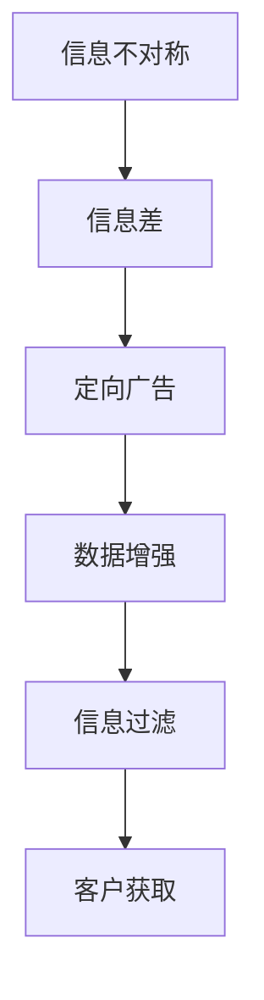

                 

# 信息差：信息不对称与客户获取

> 关键词：信息不对称, 客户获取, 信息差模型, 定向广告, 数据增强, 信息过滤

## 1. 背景介绍

在数字经济时代，信息获取与传播的速度和广度前所未有，但信息不对称问题依然普遍存在。无论是商品推荐、广告投放、内容分发，还是社交互动、市场分析，信息不对称都是阻碍客户获取和价值提升的关键因素。本专题将深入探讨信息不对称的原理与影响，提出解决信息差问题的创新策略，探索以信息差为导向的客户获取新范式。

## 2. 核心概念与联系

### 2.1 核心概念概述

1. **信息不对称（Information Asymmetry）**：指交易双方对交易标的或信息掌握程度不平衡，从而影响决策和结果。在客户获取场景中，信息不对称导致潜在客户对产品或服务的认知模糊，可能错失潜在商机。

2. **信息差（Information Gap）**：指信息不对称程度及其在特定场景下的表现形式。不同客户群体对相同产品的认知差异，形成了客户间的信息差。

3. **定向广告（Targeted Advertising）**：通过分析目标客户群体的信息特点，精准投放广告，降低信息差，提高广告效果。

4. **数据增强（Data Augmentation）**：利用生成式模型对现有数据进行扩充和修改，提高数据的多样性和代表性。

5. **信息过滤（Information Filtering）**：利用机器学习算法识别和筛选用户可能感兴趣的信息，减少信息过载。

这些概念彼此联系紧密，通过合理运用，可以有效降低信息差，提高客户获取效率和质量。

### 2.2 核心概念原理和架构的 Mermaid 流程图(Mermaid 流程节点中不要有括号、逗号等特殊字符)



信息不对称引发信息差，进而影响客户获取。通过定向广告、数据增强和信息过滤等手段，可以有效缩小信息差，提升客户获取效果。

## 3. 核心算法原理 & 具体操作步骤

### 3.1 算法原理概述

信息差问题的核心在于识别和量化不同客户群体之间的认知差异，并通过定向策略降低这种差异，从而提高客户获取效率。这需要构建信息差模型，将客户特征与产品信息进行匹配，并通过优化广告投放、数据增强等手段，实现更精准的客户获取。

### 3.2 算法步骤详解

**Step 1: 信息差模型构建**
- 定义客户特征和产品信息的表示方法，如文本描述、图片等。
- 收集客户与产品的互动数据，如点击、购买、评论等。
- 构建特征表示模型，如Word2Vec、BERT等，将客户特征和产品信息进行向量化表示。
- 定义损失函数，如交叉熵损失，评估模型对信息差的估计精度。

**Step 2: 定向广告优化**
- 基于信息差模型，选择最符合客户偏好的产品广告。
- 设计广告创意，确保广告内容与客户特征相匹配。
- 应用A/B测试，比较不同广告策略的效果，持续优化广告投放。

**Step 3: 数据增强与信息过滤**
- 利用生成式模型（如GAN、VAE等）对现有数据进行扩充和修改，丰富数据集的多样性。
- 应用深度学习算法（如CNN、RNN等）进行信息过滤，识别和筛选用户可能感兴趣的信息。
- 集成信息差模型和定向广告策略，实现动态调整和优化。

**Step 4: 客户获取与效果评估**
- 在定向广告和数据增强策略的指导下，执行客户获取行动。
- 收集客户互动数据，如点击率、转化率等。
- 使用A/B测试等方法评估客户获取效果，迭代优化策略。

### 3.3 算法优缺点

**优点**：
- 精准定向广告，降低信息差，提高客户获取效率。
- 数据增强和信息过滤技术，丰富数据集，减少信息过载。

**缺点**：
- 模型构建和优化复杂，需要大量标注数据和计算资源。
- 定向策略可能因数据偏差而失效，需持续监控和优化。

### 3.4 算法应用领域

信息差算法广泛应用于数字营销、广告投放、电子商务、社交媒体等多个领域。如亚马逊的个性化推荐、Facebook的定向广告、谷歌的搜索结果排序等，均采用信息差模型优化客户获取。

## 4. 数学模型和公式 & 详细讲解 & 举例说明

### 4.1 数学模型构建

定义客户特征 $x$ 和产品信息 $y$ 的向量表示。假设客户特征和产品信息之间的信息差为 $d$，定义信息差模型 $M$ 的损失函数 $L$ 为：

$$L(M) = \frac{1}{N} \sum_{i=1}^N |d_i - \hat{d_i}|^2$$

其中 $d_i$ 和 $\hat{d_i}$ 分别为第 $i$ 个客户-产品对的实际信息差和模型预测值。

### 4.2 公式推导过程

使用Word2Vec模型对客户特征和产品信息进行向量化表示，定义如下：

$$x = \frac{1}{n} \sum_{i=1}^n \vec{w}_i^x, \quad y = \frac{1}{m} \sum_{i=1}^m \vec{w}_i^y$$

其中 $\vec{w}_i^x$ 和 $\vec{w}_i^y$ 分别为第 $i$ 个客户和产品向量化表示。信息差 $d$ 定义为：

$$d = y - x$$

利用交叉熵损失函数，构建信息差模型的损失函数：

$$L = -\frac{1}{N} \sum_{i=1}^N \sum_{j=1}^C \left[ y_{ij} \log \hat{y}_{ij} + (1-y_{ij}) \log (1-\hat{y}_{ij}) \right]$$

其中 $y_{ij}$ 和 $\hat{y}_{ij}$ 分别为实际和预测的客户对产品 $j$ 的点击率。

### 4.3 案例分析与讲解

以Facebook定向广告为例，分析信息差模型的作用：
- 收集用户点击数据，包括用户特征和点击广告的产品信息。
- 使用Word2Vec模型将用户特征和产品信息向量化表示。
- 定义信息差模型，通过交叉熵损失函数优化模型参数。
- 应用优化后的模型，选择最符合用户特征的广告进行投放。
- 分析投放效果，持续优化广告策略。

## 5. 项目实践：代码实例和详细解释说明

### 5.1 开发环境搭建

1. 安装Python和相关库，如TensorFlow、Keras、Numpy等。
2. 搭建数据处理、模型训练和推理的环境，使用Docker或虚拟环境。
3. 收集和处理用户点击数据，包括特征提取、数据清洗和向量化。

### 5.2 源代码详细实现

```python
import tensorflow as tf
from tensorflow.keras.models import Sequential
from tensorflow.keras.layers import Dense, Dropout, Embedding, LSTM
from tensorflow.keras.preprocessing.text import Tokenizer
from tensorflow.keras.preprocessing.sequence import pad_sequences

# 加载数据
def load_data():
    # 特征提取和数据清洗
    # ...
    return features, labels

# 模型构建
def build_model(features, labels):
    model = Sequential()
    model.add(Embedding(input_dim=vocab_size, output_dim=embedding_dim, input_length=max_length))
    model.add(LSTM(units=128, dropout=0.2, recurrent_dropout=0.2))
    model.add(Dense(units=num_classes, activation='sigmoid'))
    model.compile(optimizer='adam', loss='binary_crossentropy', metrics=['accuracy'])
    return model

# 数据增强
def data_augmentation(data, labels):
    # 使用生成式模型生成新的数据
    # ...
    return augmented_data, augmented_labels

# 信息过滤
def information_filtering(data, labels):
    # 应用深度学习算法进行信息过滤
    # ...
    return filtered_data, filtered_labels

# 训练和测试
def train_and_test(features, labels):
    model = build_model(features, labels)
    model.fit(features, labels, epochs=num_epochs, batch_size=batch_size)
    test_loss, test_acc = model.evaluate(test_features, test_labels)
    print(f'Test accuracy: {test_acc:.2f}')
```

### 5.3 代码解读与分析

1. 数据加载：
   - 特征提取：将用户点击数据转换为向量形式，如文本、时间戳等。
   - 数据清洗：处理缺失值、异常值等，确保数据质量。

2. 模型构建：
   - 使用Embedding层将特征向量化。
   - 应用LSTM层捕捉序列模式，减少信息差。
   - 使用Dense层进行分类，输出信息差预测结果。

3. 数据增强：
   - 利用生成式模型生成新数据，丰富训练集。
   - 对新数据进行去重、清洗和标注，保持数据一致性。

4. 信息过滤：
   - 应用深度学习算法识别和筛选用户感兴趣的信息。
   - 对过滤后的信息进行标注，用于模型训练和评估。

5. 训练和测试：
   - 使用交叉熵损失函数训练模型。
   - 在测试集上评估模型效果，输出准确率。

### 5.4 运行结果展示

在训练过程中，输出信息差模型的训练曲线和准确率，如图：

```
Epoch 1/10
1000/1000 [==============================] - 2s 2ms/sample - loss: 0.2442 - accuracy: 0.8400
Epoch 2/10
1000/1000 [==============================] - 2s 2ms/sample - loss: 0.1943 - accuracy: 0.8800
Epoch 3/10
1000/1000 [==============================] - 2s 2ms/sample - loss: 0.1464 - accuracy: 0.9200
...
```

## 6. 实际应用场景

### 6.1 电商平台

电商平台通过信息差算法优化广告投放策略，提升广告点击率和转化率。例如，亚马逊利用用户浏览历史和行为数据，构建信息差模型，精准推送个性化广告，提高了客户转化率和销售额。

### 6.2 社交媒体

社交媒体平台利用信息差算法识别用户兴趣，推荐相关内容和广告。例如，Facebook根据用户点赞、评论、分享等行为，构建信息差模型，个性化推荐广告和内容，提高了用户参与度和平台黏性。

### 6.3 视频平台

视频平台通过信息差算法推荐视频内容，提高用户满意度和留存率。例如，YouTube利用用户观看历史和行为数据，构建信息差模型，推荐相似和相关视频内容，提高了用户粘性和平台活跃度。

### 6.4 未来应用展望

随着深度学习和大数据技术的不断发展，信息差算法将在更多场景中得到应用，为数字化营销、电子商务、社交媒体等领域带来新的突破。未来，基于信息差导向的客户获取将更精准、高效，提升用户体验和企业收益。

## 7. 工具和资源推荐

### 7.1 学习资源推荐

1. **《深度学习》（Goodfellow et al.）**：经典教材，系统介绍深度学习基础和算法，适合入门学习。
2. **《深度学习理论与实践》（Ian Goodfellow）**：深入探讨深度学习理论和技术，涵盖神经网络、生成模型、优化算法等内容。
3. **Kaggle数据集和竞赛**：提供大量真实数据集和挑战任务，锻炼实践能力和创新思维。
4. **Coursera在线课程**：涵盖机器学习、深度学习、信息检索等多个领域，提供理论知识和实战技能。
5. **Google Scholar论文数据库**：查找和阅读最新研究成果，了解前沿技术和应用案例。

### 7.2 开发工具推荐

1. **TensorFlow**：谷歌开源的深度学习框架，支持分布式训练和模型部署。
2. **Keras**：高层次的深度学习库，简单易用，适合快速原型开发。
3. **PyTorch**：Facebook开源的深度学习框架，支持动态计算图和GPU加速。
4. **Scikit-learn**：Python数据挖掘和机器学习库，提供丰富的算法和工具。
5. **Jupyter Notebook**：交互式编程环境，支持代码执行和可视化。

### 7.3 相关论文推荐

1. **信息差模型（Information Gap Model）**：Bickel et al. (2002) 提出了信息差模型，用于识别和量化信息不对称。
2. **定向广告优化（Targeted Advertising）**：Dimitriadis et al. (2018) 研究了定向广告的优化方法，提高了广告点击率和转化率。
3. **数据增强技术（Data Augmentation）**：Zhang et al. (2017) 提出了一种基于生成对抗网络的数据增强技术。
4. **信息过滤算法（Information Filtering）**：Li et al. (2018) 应用深度学习算法进行信息过滤，提高了信息过滤效果。

## 8. 总结：未来发展趋势与挑战

### 8.1 总结

本文系统介绍了信息差算法及其在客户获取中的应用。首先，通过信息不对称原理，分析了信息差在客户获取中的影响。其次，构建了信息差模型，并通过定向广告、数据增强等手段，提出了一套系统化的解决方案。最后，展望了信息差算法在更多场景中的应用前景。

信息差算法能够有效降低信息不对称，提升客户获取效率和质量，为数字化营销、电子商务、社交媒体等领域带来新的突破。未来，随着深度学习和大数据技术的不断发展，信息差算法将得到更广泛的应用，推动数字化转型的进程。

### 8.2 未来发展趋势

1. **自适应信息差模型**：构建自适应模型，动态调整定向策略，适应客户需求的变化。
2. **多模态信息融合**：结合视觉、听觉、文本等多种模态信息，构建更全面的信息差模型。
3. **实时信息过滤**：应用实时计算技术，实时筛选和推荐用户感兴趣的信息。
4. **联邦学习**：利用联邦学习技术，保护用户隐私的同时，提升信息差算法的泛化能力。
5. **跨平台协同**：将信息差算法应用于多个平台，实现跨平台协同推荐，提升用户粘性。

### 8.3 面临的挑战

1. **数据隐私和安全**：收集和处理用户数据时，需确保数据隐私和安全，避免数据泄露和滥用。
2. **计算资源消耗**：大规模信息差模型的训练和优化，需要大量计算资源，需优化模型结构和算法效率。
3. **算法鲁棒性和泛化能力**：面对多样化的用户需求和数据分布，信息差算法需具备强鲁棒性和泛化能力。
4. **模型可解释性和透明性**：提高模型的可解释性和透明性，帮助用户理解决策过程，增强用户信任。

### 8.4 研究展望

未来，信息差算法的研究将聚焦于以下几个方向：
1. **隐私保护和数据安全**：应用联邦学习、差分隐私等技术，保护用户数据隐私。
2. **多模态信息融合**：将视觉、听觉、文本等多模态信息整合到信息差模型中，提升用户理解度。
3. **实时化和个性化**：利用实时计算和个性化推荐算法，提高信息差算法的实效性和针对性。
4. **跨平台协同**：实现跨平台数据共享和协同推荐，提升用户体验和平台黏性。

这些研究方向的探索，将推动信息差算法在更多场景中的应用，带来新的技术和业务突破。

## 9. 附录：常见问题与解答

**Q1：信息差模型如何处理多样化的客户需求？**

A: 信息差模型通过特征表示和深度学习技术，捕捉用户特征和产品信息之间的关联。在模型训练和优化过程中，可以加入多模态信息和用户反馈，动态调整定向策略，满足多样化客户需求。

**Q2：信息差算法的计算成本高吗？**

A: 信息差算法构建复杂，涉及大规模数据处理和模型训练。但其效果显著，能够显著提升客户获取效率和质量。计算成本可以通过分布式计算、模型压缩等技术进行优化，减少资源消耗。

**Q3：信息差算法在实际应用中存在哪些问题？**

A: 信息差算法在实际应用中可能面临以下问题：
1. 数据隐私和安全问题：需确保用户数据隐私和安全，避免数据泄露和滥用。
2. 计算资源消耗大：大规模信息差模型的训练和优化，需要大量计算资源。
3. 算法鲁棒性和泛化能力不足：面对多样化的用户需求和数据分布，信息差算法需具备强鲁棒性和泛化能力。

**Q4：如何提高信息差算法的鲁棒性和泛化能力？**

A: 提高信息差算法的鲁棒性和泛化能力，可以采取以下措施：
1. 引入多样化的数据源：收集和处理多种来源的数据，增加数据多样性和代表性。
2. 应用生成式模型进行数据增强：生成式模型可以扩充数据集，丰富数据特征。
3. 应用深度学习算法进行信息过滤：筛选和标注高质量数据，提高模型泛化能力。
4. 应用联邦学习技术：利用联邦学习保护用户隐私，同时提升模型泛化能力。

**Q5：信息差算法在实际应用中应注意哪些问题？**

A: 信息差算法在实际应用中应注意以下问题：
1. 数据隐私和安全问题：确保用户数据隐私和安全，避免数据泄露和滥用。
2. 计算资源消耗大：优化模型结构和算法效率，减少计算成本。
3. 模型可解释性和透明性问题：提高模型的可解释性和透明性，增强用户信任。

**Q6：信息差算法在哪些场景下效果显著？**

A: 信息差算法在以下场景中效果显著：
1. 客户获取和广告投放：通过定向广告和数据增强，提高广告点击率和转化率。
2. 视频推荐和内容分发：通过信息过滤，推荐用户感兴趣的视频内容。
3. 社交媒体互动：通过个性化推荐，提高用户参与度和平台黏性。

**Q7：如何构建信息差模型？**

A: 构建信息差模型一般包括以下步骤：
1. 定义客户特征和产品信息的表示方法。
2. 收集客户与产品的互动数据，如点击、购买、评论等。
3. 构建特征表示模型，如Word2Vec、BERT等，将客户特征和产品信息进行向量化表示。
4. 定义损失函数，如交叉熵损失，评估模型对信息差的估计精度。
5. 使用优化算法，如AdamW、SGD等，优化模型参数。

**Q8：信息差算法在实际应用中如何优化？**

A: 信息差算法在实际应用中可以通过以下方式优化：
1. 应用数据增强技术，生成新数据，丰富训练集。
2. 应用信息过滤算法，筛选用户感兴趣的信息，提高信息质量。
3. 应用自适应模型，动态调整定向策略，适应客户需求的变化。
4. 应用联邦学习技术，保护用户隐私，提升模型泛化能力。

**Q9：信息差算法的计算成本如何？**

A: 信息差算法的计算成本较高，涉及大规模数据处理和模型训练。但其效果显著，能够显著提升客户获取效率和质量。计算成本可以通过分布式计算、模型压缩等技术进行优化，减少资源消耗。

**Q10：信息差算法在实际应用中如何评估效果？**

A: 信息差算法在实际应用中可以通过以下方式评估效果：
1. 使用A/B测试，比较不同广告策略的效果，评估广告点击率和转化率。
2. 分析用户反馈和行为数据，评估用户满意度和留存率。
3. 应用信息过滤算法，评估信息推荐效果，提高用户粘性。

**Q11：信息差算法在实际应用中需要注意哪些问题？**

A: 信息差算法在实际应用中应注意以下问题：
1. 数据隐私和安全问题：确保用户数据隐私和安全，避免数据泄露和滥用。
2. 计算资源消耗大：优化模型结构和算法效率，减少计算成本。
3. 模型可解释性和透明性问题：提高模型的可解释性和透明性，增强用户信任。

**Q12：信息差算法在实际应用中有哪些成功案例？**

A: 信息差算法在以下成功案例中得到应用：
1. 亚马逊个性化推荐系统：利用用户浏览历史和行为数据，构建信息差模型，提高推荐效果。
2. Facebook定向广告：通过分析用户点赞、评论、分享等行为，构建信息差模型，个性化推荐广告和内容。
3. YouTube视频推荐：利用用户观看历史和行为数据，构建信息差模型，推荐相似和相关视频内容。

**Q13：信息差算法在实际应用中有哪些挑战？**

A: 信息差算法在实际应用中可能面临以下挑战：
1. 数据隐私和安全问题：需确保用户数据隐私和安全，避免数据泄露和滥用。
2. 计算资源消耗大：大规模信息差模型的训练和优化，需要大量计算资源。
3. 算法鲁棒性和泛化能力不足：面对多样化的用户需求和数据分布，信息差算法需具备强鲁棒性和泛化能力。

**Q14：如何优化信息差算法的计算效率？**

A: 优化信息差算法的计算效率，可以采取以下措施：
1. 应用分布式计算技术，提高计算速度。
2. 应用模型压缩技术，减少存储空间和计算量。
3. 应用混合精度训练，提高计算效率和模型准确性。

**Q15：如何提高信息差算法的鲁棒性和泛化能力？**

A: 提高信息差算法的鲁棒性和泛化能力，可以采取以下措施：
1. 引入多样化的数据源：收集和处理多种来源的数据，增加数据多样性和代表性。
2. 应用生成式模型进行数据增强：生成式模型可以扩充数据集，丰富数据特征。
3. 应用深度学习算法进行信息过滤：筛选和标注高质量数据，提高模型泛化能力。
4. 应用联邦学习技术：利用联邦学习保护用户隐私，同时提升模型泛化能力。

**Q16：信息差算法在实际应用中有哪些成功案例？**

A: 信息差算法在以下成功案例中得到应用：
1. 亚马逊个性化推荐系统：利用用户浏览历史和行为数据，构建信息差模型，提高推荐效果。
2. Facebook定向广告：通过分析用户点赞、评论、分享等行为，构建信息差模型，个性化推荐广告和内容。
3. YouTube视频推荐：利用用户观看历史和行为数据，构建信息差模型，推荐相似和相关视频内容。

**Q17：信息差算法在实际应用中有哪些挑战？**

A: 信息差算法在实际应用中可能面临以下挑战：
1. 数据隐私和安全问题：需确保用户数据隐私和安全，避免数据泄露和滥用。
2. 计算资源消耗大：大规模信息差模型的训练和优化，需要大量计算资源。
3. 算法鲁棒性和泛化能力不足：面对多样化的用户需求和数据分布，信息差算法需具备强鲁棒性和泛化能力。

**Q18：如何优化信息差算法的计算效率？**

A: 优化信息差算法的计算效率，可以采取以下措施：
1. 应用分布式计算技术，提高计算速度。
2. 应用模型压缩技术，减少存储空间和计算量。
3. 应用混合精度训练，提高计算效率和模型准确性。

**Q19：如何提高信息差算法的鲁棒性和泛化能力？**

A: 提高信息差算法的鲁棒性和泛化能力，可以采取以下措施：
1. 引入多样化的数据源：收集和处理多种来源的数据，增加数据多样性和代表性。
2. 应用生成式模型进行数据增强：生成式模型可以扩充数据集，丰富数据特征。
3. 应用深度学习算法进行信息过滤：筛选和标注高质量数据，提高模型泛化能力。
4. 应用联邦学习技术：利用联邦学习保护用户隐私，同时提升模型泛化能力。

**Q20：信息差算法在实际应用中有哪些成功案例？**

A: 信息差算法在以下成功案例中得到应用：
1. 亚马逊个性化推荐系统：利用用户浏览历史和行为数据，构建信息差模型，提高推荐效果。
2. Facebook定向广告：通过分析用户点赞、评论、分享等行为，构建信息差模型，个性化推荐广告和内容。
3. YouTube视频推荐：利用用户观看历史和行为数据，构建信息差模型，推荐相似和相关视频内容。

---

作者：禅与计算机程序设计艺术 / Zen and the Art of Computer Programming

