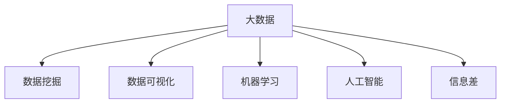

                 

# 信息差：大数据如何提升市场研究

## 1. 背景介绍

在信息时代，数据已成为商业竞争中的重要战略资源。通过精准、全面、实时的市场数据，企业能够洞察市场动态、把握消费者需求，做出更科学合理的决策。然而，单纯的数据积累并不能自动转化为决策优势，数据背后蕴含的信息差，才是真正的市场黄金。本文将从大数据的视角出发，探讨如何有效挖掘信息差，从而提升市场研究水平。

### 1.1 信息差与市场研究

信息差（Information Gap），是指企业在市场调研中，由于数据收集、处理、分析等多方面原因，导致对市场现状、趋势、消费者行为等重要信息掌握不全的情况。信息差过大，会直接影响企业决策的科学性和准确性，造成资源浪费和市场失策。

市场研究的核心任务是通过数据获取和分析，获取真实、全面的市场信息，挖掘信息差，为企业提供决策参考。在大数据背景下，市场研究方法得到了极大的丰富和提升。本文将从大数据的采集、存储、处理和分析等角度，探讨如何利用大数据提升市场研究水平。

## 2. 核心概念与联系

### 2.1 核心概念概述

为更好地理解如何利用大数据提升市场研究，本节将介绍几个密切相关的核心概念：

- 大数据（Big Data）：指体量巨大、类型多样、实时性强的数据集。大数据不仅包括结构化数据，也包括非结构化数据，如日志、图片、视频等。
- 数据挖掘（Data Mining）：指从大数据中提取有价值的信息和知识的过程。包括分类、聚类、关联规则分析、预测等技术手段。
- 数据可视化（Data Visualization）：通过图表、地图等形式将数据可视化展示，帮助研究人员更好地理解数据分布和趋势。
- 机器学习（Machine Learning）：利用算法和大数据训练模型，自动进行数据挖掘和预测。包括监督学习、非监督学习、强化学习等多种方法。
- 人工智能（Artificial Intelligence）：利用机器学习、深度学习等技术，实现智能决策和自动推理。
- 信息差（Information Gap）：指企业在市场调研中，对市场信息掌握不全的情况，需要通过数据获取和分析来填补。

这些概念之间的逻辑关系可以通过以下Mermaid流程图来展示：



这个流程图展示了大数据、数据挖掘、数据可视化、机器学习和人工智能之间的密切联系，以及信息差在大数据应用中的重要地位。

## 3. 核心算法原理 & 具体操作步骤

### 3.1 算法原理概述

利用大数据提升市场研究的核心思想是，通过数据挖掘和机器学习技术，从海量数据中提取有价值的信息和知识，填补信息差，为企业提供科学的决策依据。其核心算法流程包括：

1. 数据采集：从企业内部系统、外部公开数据源、社交媒体、移动应用等多种渠道，收集结构化和非结构化数据。
2. 数据清洗与预处理：对收集到的数据进行去重、去噪、清洗、格式化等预处理工作，确保数据质量。
3. 特征工程：对预处理后的数据进行特征提取和转换，构建适用于机器学习模型的特征集合。
4. 模型训练与评估：利用训练数据集训练机器学习模型，通过验证集和测试集评估模型效果，选择最优模型。
5. 模型应用与迭代优化：将训练好的模型应用于实际的市场研究场景，根据反馈不断优化模型和参数。

### 3.2 算法步骤详解

以下是利用大数据进行市场研究的具体操作步骤：

**Step 1: 数据采集与清洗**
- 从不同数据源收集结构化和非结构化数据。
- 使用数据清洗工具进行数据去重、去噪、去格式、标准化等预处理工作。
- 清洗后的数据存储到分布式数据存储系统（如Hadoop、Spark）中。

**Step 2: 特征工程与构建**
- 根据业务需求和机器学习算法，选择和构造关键特征。
- 使用降维、归一化等技术对特征进行预处理，提高模型性能。
- 对特征进行可视化展示，帮助研究人员理解特征的分布和重要性。

**Step 3: 模型训练与优化**
- 选择合适的机器学习算法（如线性回归、随机森林、神经网络等），训练市场研究模型。
- 在验证集上评估模型效果，调整模型参数和超参数。
- 使用集成学习、交叉验证等技术提高模型泛化能力。

**Step 4: 模型应用与迭代**
- 将训练好的模型应用于市场调研中的真实数据，进行预测和分析。
- 根据模型输出和业务反馈，不断优化模型和特征工程，提升模型效果。
- 定期更新数据源和模型参数，保持模型的时效性和准确性。

### 3.3 算法优缺点

利用大数据进行市场研究具有以下优点：
1. 数据量大：大数据技术可以处理体量巨大的数据集，有助于深入挖掘市场信息。
2. 数据多样性：大数据包括结构化和非结构化数据，能涵盖企业运营和消费者行为的全方位信息。
3. 实时性：大数据技术支持实时数据流处理，能快速响应市场变化。
4. 算法灵活：利用机器学习、深度学习等技术，可以构建多种模型，灵活应对不同市场问题。

同时，大数据市场研究也存在一些局限性：
1. 数据隐私：大数据采集和存储过程中，需要注意数据隐私和数据安全。
2. 数据质量：数据清洗和预处理难度大，数据质量不高可能导致模型偏差。
3. 计算资源：大数据处理需要大量的计算资源，企业需要投入大量资金和人力。
4. 数据整合：多源异构数据的整合和处理，需要高度的数据治理和技术支持。
5. 模型复杂度：复杂的数据挖掘和机器学习模型，需要高水平的数据科学家和工程师。

尽管存在这些局限性，但大数据技术在市场研究中的应用前景广阔，能够为企业提供全面、精准的市场信息，显著提升决策效果。

### 3.4 算法应用领域

大数据市场研究技术已经被广泛应用于多个领域，例如：

- 市场趋势分析：通过对历史数据和实时数据的挖掘，预测市场趋势，帮助企业抓住商机。
- 客户行为分析：利用消费者行为数据，进行聚类分析、关联规则分析，识别高价值客户和客户细分市场。
- 产品定价策略：通过市场竞争数据分析，确定最优定价策略，提升产品竞争力。
- 广告投放优化：利用消费者行为和媒体投放数据，优化广告投放策略，提升广告效果和投资回报率。
- 风险管理：通过市场风险数据分析，识别潜在的市场风险，制定风险管理策略。

除了上述这些典型应用外，大数据市场研究技术还在供应链管理、品牌营销、健康医疗等领域得到了广泛应用，为企业提供了全面、精准的市场信息，助力企业决策。

## 4. 数学模型和公式 & 详细讲解

### 4.1 数学模型构建

本节将使用数学语言对大数据市场研究模型的构建进行更加严格的刻画。

假设市场研究数据集为 $D=\{(x_i,y_i)\}_{i=1}^N$，其中 $x_i$ 为特征向量，$y_i$ 为市场指标（如销售额、客户满意度等）。我们的目标是构建一个回归模型 $f(x)$，使得 $f(x_i)$ 能尽可能接近真实市场指标 $y_i$。

### 4.2 公式推导过程

以线性回归模型为例，其数学表达式为：

$$
y_i = \beta_0 + \sum_{j=1}^p \beta_j x_{ij} + \epsilon_i
$$

其中 $\beta_0$ 为截距，$\beta_j$ 为特征系数，$x_{ij}$ 为第 $i$ 个样本的第 $j$ 个特征值，$\epsilon_i$ 为误差项。

根据最小二乘法，构建损失函数：

$$
\mathcal{L}(\beta) = \frac{1}{2N} \sum_{i=1}^N (y_i - f(x_i))^2
$$

损失函数的最小化目标为：

$$
\min_{\beta} \mathcal{L}(\beta)
$$

通过梯度下降等优化算法，求得模型参数 $\beta$，即得线性回归模型的表达式：

$$
y_i = \hat{y_i} = \beta_0 + \sum_{j=1}^p \beta_j x_{ij}
$$

利用训练数据集 $D_{train}$ 计算得到模型参数 $\hat{\beta}$，代入测试数据集 $D_{test}$ 进行预测，评估模型效果：

$$
RMSE = \sqrt{\frac{1}{N} \sum_{i=1}^N (y_i - \hat{y_i})^2}
$$

### 4.3 案例分析与讲解

假设某电商企业希望通过市场调研，预测某商品的未来销售额。企业收集了该商品历史销售数据、促销活动信息、季节性因素等特征数据，使用线性回归模型进行预测。以下是模型构建和评估的具体步骤：

**Step 1: 数据采集与清洗**

- 从企业CRM系统、市场调研系统、社交媒体等多个渠道，收集历史销售数据、促销活动信息、季节性因素等特征数据。
- 清洗数据，去除缺失值、异常值，标准化数据格式。
- 将清洗后的数据存储到分布式数据存储系统（如Hadoop、Spark）中。

**Step 2: 特征工程与构建**

- 选择销售数据、促销活动信息、季节性因素等关键特征。
- 对特征进行归一化、降维等预处理工作。
- 将处理后的特征数据划分为训练集和测试集。

**Step 3: 模型训练与优化**

- 利用训练集数据训练线性回归模型。
- 在验证集上评估模型效果，调整模型参数和超参数。
- 使用交叉验证技术，提高模型泛化能力。

**Step 4: 模型应用与迭代**

- 将训练好的模型应用于实际市场调研场景，进行未来销售预测。
- 根据预测结果和业务反馈，不断优化模型和特征工程，提升预测精度。
- 定期更新数据源和模型参数，保持模型的时效性和准确性。

## 5. 项目实践：代码实例和详细解释说明

### 5.1 开发环境搭建

在进行市场研究数据处理和模型训练时，需要搭建相应的开发环境。以下是使用Python和Spark进行大数据处理和模型训练的环境配置流程：

1. 安装Anaconda：从官网下载并安装Anaconda，用于创建独立的Python环境。

2. 创建并激活虚拟环境：
```bash
conda create -n py3k python=3.8 
conda activate py3k
```

3. 安装PySpark：
```bash
conda install pyspark=3.0.2
```

4. 安装必要的Python库：
```bash
pip install pandas numpy scikit-learn
```

完成上述步骤后，即可在`py3k`环境中开始市场研究的数据处理和模型训练工作。

### 5.2 源代码详细实现

以下是使用Spark和Python进行市场研究线性回归模型训练的代码实现：

```python
from pyspark.sql import SparkSession
from pyspark.sql.functions import col, desc
from pyspark.ml.feature import VectorAssembler
from pyspark.ml.regression import LinearRegressionModel
from pyspark.ml.evaluation import RegressionEvaluator

# 创建SparkSession
spark = SparkSession.builder.appName('MarketResearch').getOrCreate()

# 读取数据集
data = spark.read.csv('data.csv', header=True, inferSchema=True)

# 数据预处理
features = data.select(col('id'), col('price'), col('promotion'), col('season'))
features.show()

# 特征工程
assembler = VectorAssembler(inputCols=['price', 'promotion', 'season'], outputCol='features')
features = assembler.transform(features)
features.select('id', 'features').show()

# 模型训练
lr = LinearRegression()
model = lr.fit(features)

# 模型评估
evaluator = RegressionEvaluator(metricName='rmse', labelCol='label', predictionCol='prediction')
rmse = evaluator.evaluate(model.transform(features), {'metricName': 'rmse'})
print('RMSE:', rmse)
```

以上是使用Spark和Python进行市场研究线性回归模型训练的完整代码实现。可以看到，利用Spark的分布式计算能力，市场研究数据处理和模型训练变得简洁高效。

### 5.3 代码解读与分析

让我们再详细解读一下关键代码的实现细节：

**Step 1: 数据采集与清洗**

- `spark.read.csv('data.csv', header=True, inferSchema=True)`：从CSV文件中读取数据，并自动推断数据格式。
- `features.select(col('id'), col('price'), col('promotion'), col('season'))`：选择历史销售数据、促销活动信息、季节性因素等特征数据。

**Step 2: 特征工程与构建**

- `VectorAssembler(inputCols=['price', 'promotion', 'season'], outputCol='features')`：构建特征集合。
- `features.select('id', 'features')`：展示特征集合和ID。

**Step 3: 模型训练与优化**

- `LinearRegression()`：创建线性回归模型。
- `model = lr.fit(features)`：训练模型。
- `evaluator = RegressionEvaluator(metricName='rmse', labelCol='label', predictionCol='prediction')`：评估模型。
- `rmse = evaluator.evaluate(model.transform(features), {'metricName': 'rmse'})`：计算RMSE评估指标。

**Step 4: 模型应用与迭代**

- 实际应用中，根据预测结果和业务反馈，不断优化模型和特征工程。

## 6. 实际应用场景

### 6.1 电商平台销售额预测

电商平台希望通过市场调研，预测某商品的未来销售额，以便制定合理的库存和促销策略。利用大数据市场研究技术，企业可以轻松构建线性回归模型，实现精准预测。

在实践中，企业可以利用历史销售数据、促销活动信息、季节性因素等特征，构建线性回归模型进行未来销售额预测。利用训练好的模型，可以实时生成预测结果，并根据实际销售情况进行调整优化。

### 6.2 社交媒体舆情分析

企业希望通过社交媒体数据分析，了解消费者对某产品的舆情变化趋势，及时调整市场策略。利用大数据市场研究技术，企业可以从社交媒体平台抓取文本数据，进行情感分析和舆情监测。

在实践中，企业可以利用自然语言处理技术，对社交媒体文本数据进行情感分析，识别正面、负面和中性情绪。通过历史数据分析，可以构建情感分类模型，实时监测舆情变化，及时调整市场策略。

### 6.3 健康医疗风险管理

医院希望通过市场调研，了解某疾病的流行趋势，预测未来患病率，制定相应的医疗策略。利用大数据市场研究技术，医院可以从医疗数据、公共卫生数据、气象数据等多个来源收集数据，构建多元回归模型进行风险预测。

在实践中，医院可以利用多元回归模型，对历史患病率、公共卫生数据、气象数据等进行综合分析，预测未来患病率。根据预测结果，制定相应的医疗策略，提前准备资源，保障医疗安全。

### 6.4 未来应用展望

随着大数据技术的发展，未来市场研究将呈现出以下几个趋势：

1. 实时数据流处理：利用实时数据流处理技术，实现数据实时采集、处理和分析，提升市场研究的实时性。
2. 多模态数据融合：结合文本、图像、音频等多种数据类型，提升市场研究的多维度和深度。
3. 自动化模型构建：利用自动化机器学习平台，自动构建和优化市场研究模型，降低人工成本。
4. 边缘计算：在数据源端进行数据预处理和模型训练，减少数据传输和存储压力，提升处理效率。
5. 联邦学习：在保护数据隐私的前提下，通过多源数据共享，提升市场研究的准确性和全面性。

这些趋势将进一步推动大数据市场研究技术的演进，为企业提供更加全面、精准的市场信息，助力企业决策。

## 7. 工具和资源推荐

### 7.1 学习资源推荐

为了帮助开发者系统掌握大数据市场研究的技术基础和实践技巧，这里推荐一些优质的学习资源：

1. 《Python数据科学手册》：由数据科学领域的专家撰写，深入浅出地介绍了Python在大数据处理和机器学习中的应用。
2. 《机器学习实战》：通过实际案例，讲解了数据采集、数据清洗、特征工程、模型训练和模型评估等重要步骤。
3. 《Spark大数据处理与分析》：全面介绍了Spark的基本概念、分布式计算原理和应用场景。
4. Coursera《Apache Spark》课程：由Apache Spark开发者主讲，讲解了Spark的基本用法和高级特性。
5. Udacity《数据科学入门》课程：涵盖数据清洗、数据可视化、机器学习等多个数据科学基础课程。

通过对这些资源的学习实践，相信你一定能够快速掌握大数据市场研究的技术精髓，并用于解决实际的业务问题。

### 7.2 开发工具推荐

高效的数据处理和模型训练离不开优秀的工具支持。以下是几款常用的工具：

1. Apache Spark：基于内存计算和分布式处理技术的大数据处理引擎，支持SQL、流处理和机器学习等多种应用场景。
2. Jupyter Notebook：支持Python、R等多种编程语言的交互式笔记本，便于数据探索和模型调试。
3. Pandas：Python的数据处理库，提供数据清洗、数据操作和数据可视化等功能。
4. Scikit-Learn：Python的机器学习库，包含多种常用的机器学习算法和模型评估方法。
5. TensorFlow：由Google开发的深度学习框架，支持分布式计算和GPU加速，适合大规模模型训练。

合理利用这些工具，可以显著提升大数据市场研究的开发效率，加快创新迭代的步伐。

### 7.3 相关论文推荐

大数据市场研究技术的发展，源于学界的持续研究。以下是几篇奠基性的相关论文，推荐阅读：

1. 《A Survey on Data Mining and Statistical Learning with Big Data》：系统介绍了大数据背景下的数据挖掘和统计学习方法。
2. 《Data Mining and Statistical Learning with Big Data》：讲解了大数据环境下的数据采集、存储、处理和分析技术。
3. 《Big Data Mining and Statistical Learning》：详细介绍了大数据环境下机器学习模型的构建和优化方法。
4. 《Big Data Mining》：讲解了大数据环境下数据挖掘和机器学习的基本概念和应用场景。

这些论文代表了大数据市场研究技术的最新发展，通过学习这些前沿成果，可以帮助研究者把握学科前进方向，激发更多的创新灵感。

## 8. 总结：未来发展趋势与挑战

### 8.1 总结

本文对利用大数据进行市场研究的方法进行了全面系统的介绍。首先阐述了市场研究中的信息差问题及其重要性，明确了大数据技术在市场研究中的关键作用。其次，从数据采集、清洗、预处理、特征工程、模型训练等多个环节，详细讲解了大数据市场研究的具体操作步骤。最后，介绍了大数据市场研究技术在多个行业的应用前景，并展望了未来发展趋势和面临的挑战。

通过本文的系统梳理，可以看到，利用大数据技术进行市场研究，可以有效填补信息差，提升市场研究水平。未来，随着大数据和机器学习技术的不断发展，市场研究将变得更加全面、精准、实时，为企业决策提供更可靠的数据支撑。

### 8.2 未来发展趋势

展望未来，大数据市场研究技术将呈现以下几个发展趋势：

1. 实时数据流处理：利用实时数据流处理技术，实现数据实时采集、处理和分析，提升市场研究的实时性。
2. 多模态数据融合：结合文本、图像、音频等多种数据类型，提升市场研究的多维度和深度。
3. 自动化模型构建：利用自动化机器学习平台，自动构建和优化市场研究模型，降低人工成本。
4. 边缘计算：在数据源端进行数据预处理和模型训练，减少数据传输和存储压力，提升处理效率。
5. 联邦学习：在保护数据隐私的前提下，通过多源数据共享，提升市场研究的准确性和全面性。

这些趋势将进一步推动大数据市场研究技术的演进，为企业提供更加全面、精准的市场信息，助力企业决策。

### 8.3 面临的挑战

尽管大数据市场研究技术已经取得了瞩目成就，但在迈向更加智能化、普适化应用的过程中，它仍面临着诸多挑战：

1. 数据隐私：大数据采集和存储过程中，需要注意数据隐私和数据安全。
2. 数据质量：数据清洗和预处理难度大，数据质量不高可能导致模型偏差。
3. 计算资源：大数据处理需要大量的计算资源，企业需要投入大量资金和人力。
4. 数据整合：多源异构数据的整合和处理，需要高度的数据治理和技术支持。
5. 模型复杂度：复杂的数据挖掘和机器学习模型，需要高水平的数据科学家和工程师。

尽管存在这些局限性，但大数据技术在市场研究中的应用前景广阔，能够为企业提供全面、精准的市场信息，显著提升决策效果。

### 8.4 研究展望

面对大数据市场研究所面临的种种挑战，未来的研究需要在以下几个方面寻求新的突破：

1. 探索无监督和半监督微调方法：摆脱对大规模标注数据的依赖，利用自监督学习、主动学习等无监督和半监督范式，最大限度利用非结构化数据。
2. 研究参数高效和计算高效的微调范式：开发更加参数高效的微调方法，在固定大部分预训练参数的情况下，只更新极少量的任务相关参数。同时优化微调模型的计算图，减少前向传播和反向传播的资源消耗。
3. 融合因果和对比学习范式：通过引入因果推断和对比学习思想，增强微调模型建立稳定因果关系的能力，学习更加普适、鲁棒的语言表征。
4. 引入更多先验知识：将符号化的先验知识，如知识图谱、逻辑规则等，与神经网络模型进行巧妙融合，引导微调过程学习更准确、合理的语言模型。同时加强不同模态数据的整合，实现视觉、语音等多模态信息与文本信息的协同建模。
5. 结合因果分析和博弈论工具：将因果分析方法引入微调模型，识别出模型决策的关键特征，增强输出解释的因果性和逻辑性。借助博弈论工具刻画人机交互过程，主动探索并规避模型的脆弱点，提高系统稳定性。

这些研究方向的探索，必将引领大数据市场研究技术迈向更高的台阶，为构建安全、可靠、可解释、可控的智能系统铺平道路。面向未来，大数据市场研究技术还需要与其他人工智能技术进行更深入的融合，如知识表示、因果推理、强化学习等，多路径协同发力，共同推动自然语言理解和智能交互系统的进步。只有勇于创新、敢于突破，才能不断拓展市场研究的边界，让大数据技术更好地服务于社会和经济。

## 9. 附录：常见问题与解答

**Q1：大数据市场研究是否适用于所有市场调研场景？**

A: 大数据市场研究适用于绝大多数市场调研场景，特别是数据量大、数据类型多样、实时性强的市场调研。但对于一些特定领域，如健康医疗、法律咨询等，还需要结合专家知识和领域数据进行进一步分析。

**Q2：如何选择合适的特征进行模型构建？**

A: 选择合适的特征是市场研究模型的关键。特征的选择需要根据业务需求和机器学习算法，结合领域知识和专家经验进行综合分析。常用的特征选择方法包括方差分析、相关性分析、主成分分析等。

**Q3：如何提高大数据市场研究的效率？**

A: 提高大数据市场研究的效率，可以从以下几个方面入手：
1. 数据预处理和清洗：利用数据清洗工具去除缺失值、异常值，标准化数据格式，提高数据质量。
2. 自动化特征工程：利用自动化特征工程技术，自动选择和构造关键特征，降低人工成本。
3. 分布式计算：利用分布式计算框架（如Spark），加速数据处理和模型训练。
4. 模型优化：通过交叉验证、集成学习等技术，提高模型泛化能力和性能。

**Q4：大数据市场研究技术面临哪些挑战？**

A: 大数据市场研究技术面临的主要挑战包括数据隐私、数据质量、计算资源、数据整合和模型复杂度等。这些问题需要通过多源数据共享、数据治理、模型优化等手段进行有效解决。

**Q5：未来如何进一步提升大数据市场研究的水平？**

A: 未来提升大数据市场研究的水平，可以从以下几个方面进行：
1. 实时数据流处理：利用实时数据流处理技术，实现数据实时采集、处理和分析，提升市场研究的实时性。
2. 多模态数据融合：结合文本、图像、音频等多种数据类型，提升市场研究的多维度和深度。
3. 自动化模型构建：利用自动化机器学习平台，自动构建和优化市场研究模型，降低人工成本。
4. 边缘计算：在数据源端进行数据预处理和模型训练，减少数据传输和存储压力，提升处理效率。
5. 联邦学习：在保护数据隐私的前提下，通过多源数据共享，提升市场研究的准确性和全面性。

这些措施将进一步推动大数据市场研究技术的演进，为企业提供更加全面、精准的市场信息，助力企业决策。

---

作者：禅与计算机程序设计艺术 / Zen and the Art of Computer Programming

