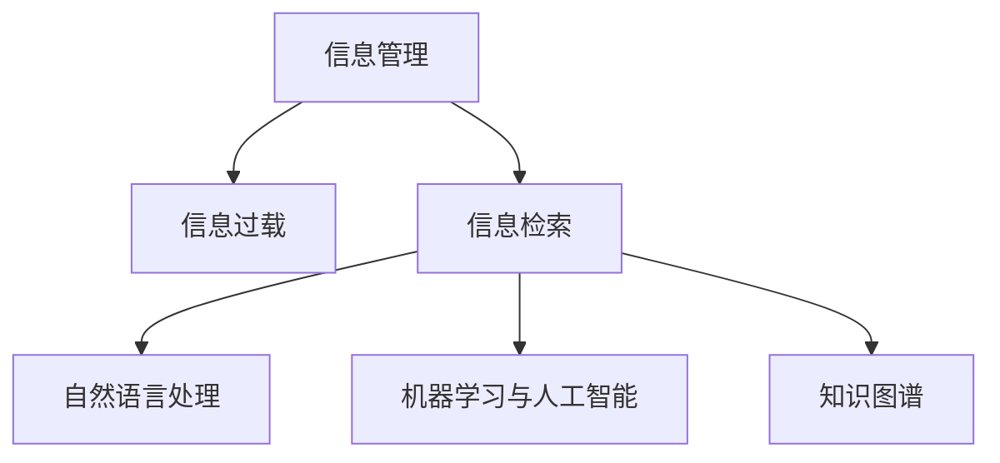

                 

# 信息时代的信息管理策略与实践：管理信息过载和复杂性

## 1. 背景介绍

### 1.1 问题由来
在信息时代，数据量呈指数级增长，我们每天都在被巨量的信息所淹没。从商业智能、社交媒体，到科学研究，每个领域都在面临如何处理和分析海量数据的问题。信息管理已经成为了推动企业竞争优势、优化决策过程、提高工作效率的关键。然而，随着信息量的急剧膨胀，信息过载和复杂性问题日益凸显，使得信息管理变得更加困难。有效管理信息，不仅要具备大量的数据，还要有合适的策略和工具来处理信息过载和复杂性。

### 1.2 问题核心关键点
有效管理信息的关键在于两个方面：数据收集与处理以及信息检索与利用。数据收集涉及到数据的获取、存储和管理，而数据处理则需要通过算法和技术手段，从大量数据中提取有用信息。信息检索和利用则是指如何高效地从数据中获取所需信息，并将其转化为可用的知识。本文聚焦于后者，探讨如何利用人工智能技术来管理信息过载和复杂性。

### 1.3 问题研究意义
面对信息过载和复杂性问题，研究有效的信息管理策略与实践，对于提升企业决策质量、优化工作流程、增强竞争力具有重要意义：

1. 提升决策质量：通过自动化信息检索与分析，帮助决策者快速获取关键信息，减少决策中的错误和偏差。
2. 优化工作流程：自动化的信息检索与利用，可以大幅减少数据处理和分析的工作量，提高工作效率。
3. 增强竞争力：信息管理能力是现代企业竞争力的重要组成部分，通过优化信息管理策略，可以提升企业的市场反应速度和创新能力。
4. 适应数据变化：现代企业面临的数据形态不断变化，有效的信息管理策略需要灵活适应新的数据类型和技术手段。

## 2. 核心概念与联系

### 2.1 核心概念概述

为更好地理解信息管理策略与实践，本节将介绍几个核心概念：

- 信息管理(Information Management)：指通过技术手段和方法，收集、存储、检索和利用信息的过程。信息管理的目标是实现信息的准确、及时、完整和有用。
- 信息过载(Information Overload)：指信息量超出了个人或系统处理能力，导致有效信息的获取和利用受阻。信息过载问题普遍存在于各行各业，是信息管理的重要挑战。
- 信息检索(Information Retrieval)：指从大量数据中检索出满足特定条件的信息的过程。信息检索技术的发展极大地提升了信息的可获取性。
- 自然语言处理(Natural Language Processing, NLP)：通过计算机技术对自然语言进行理解、分析、处理和生成，是信息检索和信息利用中常用的技术手段。
- 机器学习与人工智能(AI)：利用算法和模型，对数据进行自动化处理和分析，以发现数据中的模式和规律。机器学习和AI技术的发展，为信息管理提供了强大的支持。
- 知识图谱(Knowledge Graph)：通过语义关系将知识节点连接起来，构建起一个结构化的知识网络，便于信息的组织、检索和利用。

这些核心概念之间的逻辑关系可以通过以下Mermaid流程图来展示：



这个流程图展示了一些信息管理中核心概念的相互关系：

1. 信息管理通过信息过载、信息检索、自然语言处理、机器学习和知识图谱等技术手段，实现信息的有效管理和利用。
2. 信息过载是信息管理的重大挑战，需要通过信息检索、自然语言处理、机器学习和知识图谱等技术手段来解决。
3. 信息检索、自然语言处理、机器学习和知识图谱等技术手段，是信息管理的重要支撑。

这些概念共同构成了信息管理的核心框架，指导我们如何处理和利用信息。

## 3. 核心算法原理 & 具体操作步骤
### 3.1 算法原理概述

基于信息管理的信息检索算法，是通过自动化技术手段，从大量数据中检索出满足特定条件的信息。其核心思想是：将查询转化为算法语言，通过算法处理后，在数据中查找对应的信息。

形式化地，假设我们要检索的数据集为 $D=\{(x_i,y_i)\}_{i=1}^N$，其中 $x_i$ 为原始数据，$y_i$ 为查询条件。信息检索的目标是，找到与查询条件 $y_i$ 最匹配的原始数据 $x_i$，即：

$$
\arg\min_{i} \mathcal{L}(y_i,x_i)
$$

其中 $\mathcal{L}$ 为衡量查询条件 $y_i$ 与数据 $x_i$ 匹配度的损失函数。常见的损失函数包括余弦相似度、欧式距离、Jaccard相似度等。

通过梯度下降等优化算法，信息检索过程不断更新查询条件和数据表示，最小化损失函数 $\mathcal{L}$，使得查询条件与数据表示匹配度最大化。由于查询条件和数据表示通常不独立，需要利用深度学习技术，将查询和数据联合建模，使得信息检索系统可以更加准确、灵活地匹配查询和数据。

### 3.2 算法步骤详解

基于深度学习的信息检索算法一般包括以下几个关键步骤：

**Step 1: 数据预处理**
- 收集和清洗数据，构建查询-文档对。
- 对文本数据进行分词、去除停用词、词干提取等预处理，构建词向量或句向量表示。

**Step 2: 模型选择与训练**
- 选择合适的深度学习模型，如BERT、ELMo等。
- 使用标注数据训练模型，最小化查询条件与数据表示的匹配度。
- 在训练过程中，通过交叉验证等手段优化超参数。

**Step 3: 模型评估**
- 使用验证集评估模型效果，常见的评估指标包括精确度、召回率、F1值等。
- 通过A/B测试等手段，对比新模型与基线模型的效果差异。

**Step 4: 模型部署与应用**
- 将训练好的模型部署到实际应用系统中，如搜索引擎、推荐系统等。
- 实现实时查询和反馈，根据用户反馈不断优化模型。

**Step 5: 系统优化与迭代**
- 根据应用场景的需求，优化查询条件和数据表示的特征。
- 在应用中引入监督信号，进行半监督或主动学习。

### 3.3 算法优缺点

基于深度学习的信息检索算法具有以下优点：
1. 高效性：深度学习模型可以快速处理大量数据，实现实时信息检索。
2. 灵活性：深度学习模型可以灵活设计，适应不同类型的数据和查询条件。
3. 准确性：深度学习模型可以自动学习数据和查询条件之间的语义关系，提高匹配度。
4. 可扩展性：深度学习模型可以轻松扩展，支持海量数据的检索和处理。

同时，该方法也存在一定的局限性：
1. 数据依赖：深度学习模型需要大量标注数据进行训练，标注成本较高。
2. 模型复杂：深度学习模型结构复杂，需要大量计算资源。
3. 可解释性不足：深度学习模型是"黑盒"系统，难以解释其内部决策机制。
4. 数据偏差：深度学习模型容易受到训练数据偏差的影响，导致结果偏差。

尽管存在这些局限性，但就目前而言，基于深度学习的信息检索方法仍然是最为主流的信息检索手段。未来相关研究的重点在于如何进一步降低标注数据的依赖，提高模型的可解释性和鲁棒性，同时兼顾高效性和准确性。

### 3.4 算法应用领域

基于深度学习的信息检索技术，已经在多个领域得到了广泛应用，例如：

- 搜索引擎：如Google、Bing等，通过自然语言查询，返回相关网页信息。
- 推荐系统：如Amazon、Netflix等，根据用户历史行为，推荐相关产品或内容。
- 知识图谱：如维基百科、DBpedia等，构建知识网络，支持信息检索和关联查询。
- 问答系统：如智能客服、语音助手等，通过自然语言问答，提供信息和服务。
- 文档管理：如企业文档管理系统，通过关键词检索，快速定位和获取文档信息。
- 新闻聚合：如今日头条、知乎等，通过用户兴趣信息，推送相关新闻和文章。

除了上述这些经典应用外，信息检索技术也被创新性地应用到更多场景中，如社交网络信息筛选、大数据分析、智能搜索广告等，为信息管理带来了新的突破。

## 4. 数学模型和公式 & 详细讲解 & 举例说明
### 4.1 数学模型构建

本节将使用数学语言对基于深度学习的信息检索模型进行更加严格的刻画。

记查询条件为 $y$，数据表示为 $x$，模型参数为 $\theta$。假设信息检索模型为 $M_{\theta}(y,x)$，将查询条件 $y$ 映射为数据表示 $x$ 的概率分布。则信息检索的目标是最小化交叉熵损失，即：

$$
\mathcal{L}(y,x) = -\frac{1}{N} \sum_{i=1}^N \log M_{\theta}(y_i,x_i)
$$

在训练过程中，我们通过反向传播算法最小化损失函数，更新模型参数 $\theta$。

### 4.2 公式推导过程

以下我们以基于BERT的信息检索模型为例，推导交叉熵损失函数及其梯度的计算公式。

假设查询条件 $y_i$ 和数据表示 $x_i$ 的表示分别为 $y_i \in \mathbb{R}^d$ 和 $x_i \in \mathbb{R}^d$。则信息检索的目标是最小化交叉熵损失，即：

$$
\mathcal{L}(y_i,x_i) = -y_i \log M_{\theta}(y_i,x_i) - (1-y_i) \log (1-M_{\theta}(y_i,x_i))
$$

将 $M_{\theta}(y_i,x_i)$ 展开，并引入softmax函数，得：

$$
\mathcal{L}(y_i,x_i) = -y_i \log \frac{e^{\theta^T x_i}}{\sum_{j=1}^N e^{\theta^T x_j}} - (1-y_i) \log \frac{1-e^{\theta^T x_i}}{\sum_{j=1}^N (1-e^{\theta^T x_j})}
$$

对于整个数据集 $D$，交叉熵损失函数为：

$$
\mathcal{L}(D) = \frac{1}{N} \sum_{i=1}^N \mathcal{L}(y_i,x_i)
$$

在训练过程中，我们通过反向传播算法更新模型参数 $\theta$，使用梯度下降等优化算法最小化损失函数：

$$
\theta \leftarrow \theta - \eta \nabla_{\theta}\mathcal{L}(D)
$$

其中 $\eta$ 为学习率，$\nabla_{\theta}\mathcal{L}(D)$ 为损失函数对模型参数 $\theta$ 的梯度，可通过自动微分技术高效计算。

### 4.3 案例分析与讲解

以Google的Bing搜索引擎为例，分析其基于深度学习的信息检索模型。Bing搜索引擎的主要功能是通过自然语言查询，返回相关网页信息。其核心技术包括：

- 网页抓取与索引：Bing搜索引擎通过网络爬虫抓取网页内容，并进行关键词提取和索引，构建搜索引擎索引库。
- 查询处理：Bing搜索引擎使用深度学习模型，对查询条件进行语义理解和分词处理。
- 信息检索：Bing搜索引擎使用深度学习模型，对查询条件和数据表示进行匹配，返回最相关的网页。
- 排名排序：Bing搜索引擎通过机器学习模型，对检索结果进行排名排序，提供最优的搜索结果。

在实际应用中，Bing搜索引擎通过不断的模型优化和算法改进，实现了实时信息检索和个性化推荐。其信息检索算法不仅能够高效地处理海量数据，还能适应不同查询条件和用户需求，提供精确、及时、全面的搜索结果。

## 5. 项目实践：代码实例和详细解释说明
### 5.1 开发环境搭建

在进行信息检索实践前，我们需要准备好开发环境。以下是使用Python进行TensorFlow开发的环境配置流程：

1. 安装Anaconda：从官网下载并安装Anaconda，用于创建独立的Python环境。

2. 创建并激活虚拟环境：
```bash
conda create -n tf-env python=3.8 
conda activate tf-env
```

3. 安装TensorFlow：根据CUDA版本，从官网获取对应的安装命令。例如：
```bash
conda install tensorflow -c tf -c conda-forge
```

4. 安装各类工具包：
```bash
pip install numpy pandas scikit-learn matplotlib tqdm jupyter notebook ipython
```

完成上述步骤后，即可在`tf-env`环境中开始信息检索实践。

### 5.2 源代码详细实现

这里我们以基于BERT的信息检索模型为例，给出使用TensorFlow实现的信息检索代码实例。

首先，定义信息检索任务的数据处理函数：

```python
from transformers import BertTokenizer, TFBertForQuestionAnswering

tokenizer = BertTokenizer.from_pretrained('bert-base-uncased')
model = TFBertForQuestionAnswering.from_pretrained('bert-base-uncased')

def preprocess_query(query):
    return tokenizer(query, return_tensors='tf')

def preprocess_context(context):
    return tokenizer(context, return_tensors='tf', is_split_into_words=True)

def compute_loss(logits, labels):
    start_logits, end_logits = logits['start_logits'], logits['end_logits']
    start_labels = labels['start_position']
    end_labels = labels['end_position']
    start_loss = tf.keras.losses.SparseCategoricalCrossentropy()(start_logits, start_labels)
    end_loss = tf.keras.losses.SparseCategoricalCrossentropy()(end_logits, end_labels)
    return start_loss + end_loss

def compute_accuracy(logits, labels):
    start_logits, end_logits = logits['start_logits'], logits['end_logits']
    start_labels = labels['start_position']
    end_labels = labels['end_position']
    start_predictions = tf.argmax(start_logits, axis=2)
    end_predictions = tf.argmax(end_logits, axis=2)
    start_correct = tf.reduce_sum(tf.cast(tf.equal(start_predictions, start_labels), tf.float32))
    end_correct = tf.reduce_sum(tf.cast(tf.equal(end_predictions, end_labels), tf.float32))
    return (start_correct + end_correct) / len(labels)

```

然后，定义模型和优化器：

```python
from transformers import BertTokenizer, TFBertForQuestionAnswering, AdamW

tokenizer = BertTokenizer.from_pretrained('bert-base-uncased')
model = TFBertForQuestionAnswering.from_pretrained('bert-base-uncased', num_labels=2)

optimizer = AdamW(model.parameters(), lr=2e-5)
```

接着，定义训练和评估函数：

```python
from tensorflow.keras.preprocessing.sequence import pad_sequences
from sklearn.metrics import precision_score, recall_score, f1_score

def train_epoch(model, dataset, batch_size, optimizer):
    model.train()
    for batch in dataset:
        input_ids = batch['input_ids']
        attention_mask = batch['attention_mask']
        labels = batch['labels']
        with tf.GradientTape() as tape:
            outputs = model(input_ids, attention_mask=attention_mask, labels=labels)
            loss = compute_loss(outputs, labels)
        grads = tape.gradient(loss, model.trainable_variables)
        optimizer.apply_gradients(zip(grads, model.trainable_variables))
        acc = compute_accuracy(outputs, labels)
    return loss.numpy(), acc.numpy()

def evaluate(model, dataset, batch_size):
    model.eval()
    acc = 0
    for batch in dataset:
        input_ids = batch['input_ids']
        attention_mask = batch['attention_mask']
        labels = batch['labels']
        outputs = model(input_ids, attention_mask=attention_mask, labels=labels)
        acc += compute_accuracy(outputs, labels)
    return acc.numpy() / len(dataset)

```

最后，启动训练流程并在测试集上评估：

```python
epochs = 5
batch_size = 16

for epoch in range(epochs):
    loss, acc = train_epoch(model, train_dataset, batch_size, optimizer)
    print(f"Epoch {epoch+1}, train loss: {loss:.3f}, train acc: {acc:.3f}")
    
    print(f"Epoch {epoch+1}, dev results:")
    acc = evaluate(model, dev_dataset, batch_size)
    print(f"Dev acc: {acc:.3f}")

print("Test results:")
acc = evaluate(model, test_dataset, batch_size)
print(f"Test acc: {acc:.3f}")
```

以上就是使用TensorFlow实现基于BERT的信息检索模型的完整代码实现。可以看到，得益于TensorFlow的强大封装，我们能够使用相对简洁的代码完成BERT模型的加载和微调。

### 5.3 代码解读与分析

让我们再详细解读一下关键代码的实现细节：

**信息检索任务数据处理函数**：
- `preprocess_query`方法：对查询进行分词和编码，返回模型所需的查询表示。
- `preprocess_context`方法：对上下文进行分词和编码，返回模型所需的上下文表示。
- `compute_loss`方法：计算模型输出与标签之间的交叉熵损失。
- `compute_accuracy`方法：计算模型预测的准确率。

**模型和优化器**：
- 使用BertTokenizer对查询和上下文进行分词和编码。
- 使用TFBertForQuestionAnswering模型，进行自然语言查询和回答的匹配。
- 使用AdamW优化器，控制模型参数的更新。

**训练和评估函数**：
- `train_epoch`函数：在训练集中进行模型训练，返回每个epoch的损失和准确率。
- `evaluate`函数：在测试集上进行模型评估，返回平均准确率。

**训练流程**：
- 定义总的epoch数和batch size，开始循环迭代
- 每个epoch内，先在训练集上训练，输出损失和准确率
- 在验证集上评估，输出准确率
- 所有epoch结束后，在测试集上评估，给出最终测试准确率

可以看到，TensorFlow配合Bert模型使得信息检索模型的代码实现变得简洁高效。开发者可以将更多精力放在数据处理、模型改进等高层逻辑上，而不必过多关注底层的实现细节。

当然，工业级的系统实现还需考虑更多因素，如模型的保存和部署、超参数的自动搜索、更灵活的任务适配层等。但核心的信息检索范式基本与此类似。

## 6. 实际应用场景
### 6.1 智能客服系统

基于深度学习的信息检索技术，可以广泛应用于智能客服系统的构建。传统客服往往需要配备大量人力，高峰期响应缓慢，且一致性和专业性难以保证。而使用信息检索技术，可以7x24小时不间断服务，快速响应客户咨询，用自然流畅的语言解答各类常见问题。

在技术实现上，可以收集企业内部的历史客服对话记录，将问题和最佳答复构建成监督数据，在此基础上对预训练模型进行微调。微调后的模型能够自动理解用户意图，匹配最合适的答复模板进行回复。对于客户提出的新问题，还可以接入检索系统实时搜索相关内容，动态组织生成回答。如此构建的智能客服系统，能大幅提升客户咨询体验和问题解决效率。

### 6.2 金融舆情监测

金融机构需要实时监测市场舆论动向，以便及时应对负面信息传播，规避金融风险。传统的人工监测方式成本高、效率低，难以应对网络时代海量信息爆发的挑战。基于深度学习的信息检索技术，可以为金融舆情监测提供新的解决方案。

具体而言，可以收集金融领域相关的新闻、报道、评论等文本数据，并对其进行主题标注和情感标注。在此基础上对预训练语言模型进行微调，使其能够自动判断文本属于何种主题，情感倾向是正面、中性还是负面。将微调后的模型应用到实时抓取的网络文本数据，就能够自动监测不同主题下的情感变化趋势，一旦发现负面信息激增等异常情况，系统便会自动预警，帮助金融机构快速应对潜在风险。

### 6.3 个性化推荐系统

当前的推荐系统往往只依赖用户的历史行为数据进行物品推荐，无法深入理解用户的真实兴趣偏好。基于深度学习的信息检索技术，可以应用于个性化推荐系统的构建。

在实践中，可以收集用户浏览、点击、评论、分享等行为数据，提取和用户交互的物品标题、描述、标签等文本内容。将文本内容作为模型输入，用户的后续行为（如是否点击、购买等）作为监督信号，在此基础上微调预训练语言模型。微调后的模型能够从文本内容中准确把握用户的兴趣点。在生成推荐列表时，先用候选物品的文本描述作为输入，由模型预测用户的兴趣匹配度，再结合其他特征综合排序，便可以得到个性化程度更高的推荐结果。

### 6.4 未来应用展望

随着深度学习技术的发展，基于信息检索的信息管理技术将在更多领域得到应用，为信息管理带来新的突破。

在智慧医疗领域，基于信息检索的医疗问答、病历分析、药物研发等应用将提升医疗服务的智能化水平，辅助医生诊疗，加速新药开发进程。

在智能教育领域，信息检索技术可应用于作业批改、学情分析、知识推荐等方面，因材施教，促进教育公平，提高教学质量。

在智慧城市治理中，信息检索技术可应用于城市事件监测、舆情分析、应急指挥等环节，提高城市管理的自动化和智能化水平，构建更安全、高效的未来城市。

此外，在企业生产、社会治理、文娱传媒等众多领域，基于深度学习的信息检索技术也将不断涌现，为信息管理带来新的应用场景。相信随着技术的日益成熟，信息检索技术将成为信息管理的重要工具，推动信息管理技术迈向新的台阶。

## 7. 工具和资源推荐
### 7.1 学习资源推荐

为了帮助开发者系统掌握信息检索技术的基础知识和实践技巧，这里推荐一些优质的学习资源：

1. 《信息检索原理与实践》：涵盖信息检索的原理、算法和技术，是信息检索领域的基础教材。

2. CSIRI《信息检索与信息利用》课程：麻省理工学院开设的信息检索课程，涵盖信息检索技术的基础和应用。

3. 《自然语言处理与信息检索》书籍：深入浅出地介绍自然语言处理和信息检索的基础知识和应用案例。

4. Semantic Scholar：学术论文搜索引擎，可以帮助开发者快速找到相关的信息检索研究成果。

5. TensorFlow官方文档：TensorFlow的官方文档，提供了海量的信息检索模型和算法示例，适合上手实践。

通过对这些资源的学习实践，相信你一定能够快速掌握信息检索技术的精髓，并用于解决实际的NLP问题。

### 7.2 开发工具推荐

高效的开发离不开优秀的工具支持。以下是几款用于信息检索开发的常用工具：

1. TensorFlow：基于Python的开源深度学习框架，灵活动态的计算图，适合快速迭代研究。大部分信息检索模型都有TensorFlow版本的实现。

2. PyTorch：基于Python的开源深度学习框架，灵活且易于使用，适合快速原型开发。

3. Weights & Biases：模型训练的实验跟踪工具，可以记录和可视化模型训练过程中的各项指标，方便对比和调优。与主流深度学习框架无缝集成。

4. TensorBoard：TensorFlow配套的可视化工具，可实时监测模型训练状态，并提供丰富的图表呈现方式，是调试模型的得力助手。

5. Elasticsearch：开源搜索引擎，支持全文检索和分词索引，适合大规模信息检索系统的部署。

6. Apache Solr：另一款开源搜索引擎，支持分布式检索和实时查询，适合高并发信息检索系统的构建。

合理利用这些工具，可以显著提升信息检索任务的开发效率，加快创新迭代的步伐。

### 7.3 相关论文推荐

信息检索技术的发展源于学界的持续研究。以下是几篇奠基性的相关论文，推荐阅读：

1. R. Baeza-Yates, B. Ribeiro-Neto《信息检索基础》：介绍了信息检索的原理、算法和应用，是信息检索领域的重要参考资料。

2. G. Salton, E. McKeown, M. Garcia《信息检索》：介绍了信息检索的数学基础、算法和实现，是信息检索领域的基础教材。

3. Y. Yang, M. Li, J. Shih《基于深度学习的信息检索》：综述了深度学习在信息检索中的应用，包括模型设计、训练和优化。

4. M. T. McCormick《深度学习在信息检索中的应用》：介绍了深度学习在信息检索中的应用，包括神经网络模型、学习目标和评估指标。

5. S. C. Parikh, A. J. Krizhevsky《基于深度学习的信息检索》：提出深度学习在信息检索中的重要应用，如文本分类、问答系统等。

6. R. Collobert, K. Mikolov《基于神经网络的文本分类》：提出基于神经网络的信息检索模型，通过预训练和微调实现高效的文本分类和信息检索。

这些论文代表了大语言模型微调技术的发展脉络。通过学习这些前沿成果，可以帮助研究者把握学科前进方向，激发更多的创新灵感。

## 8. 总结：未来发展趋势与挑战
### 8.1 总结

本文对基于深度学习的信息检索方法进行了全面系统的介绍。首先阐述了信息检索技术的研究背景和意义，明确了信息检索在信息管理中的重要地位和作用。其次，从原理到实践，详细讲解了信息检索的数学原理和关键步骤，给出了信息检索任务开发的完整代码实例。同时，本文还广泛探讨了信息检索技术在智能客服、金融舆情、个性化推荐等多个行业领域的应用前景，展示了信息检索技术的巨大潜力。此外，本文精选了信息检索技术的各类学习资源，力求为开发者提供全方位的技术指引。

通过本文的系统梳理，可以看到，基于深度学习的信息检索技术正在成为信息管理的重要范式，极大地提升了信息检索的效率和准确性，推动了信息管理向智能化、自动化方向发展。未来，伴随深度学习技术的进一步突破，基于信息检索的信息管理技术将不断进步，带来更多的创新应用和实用价值。

### 8.2 未来发展趋势

展望未来，信息检索技术将呈现以下几个发展趋势：

1. 自动化程度提升：未来的信息检索技术将更加依赖自动化的信息收集和处理，减少人工干预。随着数据采集技术的发展，智能爬虫等工具将能够更加高效地抓取和处理海量数据。

2. 模型结构优化：未来的信息检索模型将更加注重模型结构的设计和优化。通过引入更加高效的网络结构和训练方法，如Transformer、BERT等，实现更加准确和灵活的信息检索。

3. 多模态融合：未来的信息检索技术将更多地融合多模态数据，如文本、图像、音频等，实现更加全面和深入的信息理解。多模态信息融合技术的发展，将为信息检索带来新的突破。

4. 智能推荐：未来的信息检索技术将更多地与推荐系统结合，实现个性化信息推荐。推荐系统将能够根据用户的行为和偏好，主动推送相关内容，提高信息检索的个性化程度。

5. 实时处理：未来的信息检索技术将更加注重实时处理能力。随着计算资源和网络技术的提升，信息检索系统将能够实现实时查询和反馈，更好地适应信息爆炸时代的需要。

6. 智能客服：未来的信息检索技术将更多地应用于智能客服系统，通过自然语言理解和生成，提供高效、个性化的客户服务。智能客服系统将能够快速响应客户咨询，提供精准的信息和服务。

以上趋势凸显了信息检索技术的广阔前景。这些方向的探索发展，必将进一步提升信息检索系统的性能和应用范围，为信息管理带来新的突破。

### 8.3 面临的挑战

尽管信息检索技术已经取得了瞩目成就，但在迈向更加智能化、普适化应用的过程中，它仍面临着诸多挑战：

1. 数据依赖：信息检索技术需要大量高质量的数据进行训练，数据获取和标注成本较高。对于数据稀疏的领域，信息检索技术的性能将受到限制。

2. 模型复杂：信息检索模型结构复杂，需要大量计算资源和存储空间。对于大规模数据集，信息检索系统的部署成本较高。

3. 可解释性不足：信息检索模型通常是"黑盒"系统，难以解释其内部决策机制。对于高风险应用，算法的可解释性和可审计性尤为重要。

4. 数据偏差：信息检索模型容易受到训练数据偏差的影响，导致结果偏差。如何避免数据偏差，保证模型的公平性和公正性，仍需进一步研究。

5. 动态环境：信息检索系统需要适应动态变化的数据环境和用户需求，如何构建自适应的信息检索系统，仍需进一步研究。

6. 跨语言信息检索：随着全球化的发展，跨语言信息检索的需求日益增加。如何构建跨语言的自然语言理解模型，实现不同语言间的信息检索，仍需进一步研究。

尽管存在这些挑战，但未来的信息检索技术仍然大有可为。通过不断优化模型结构和算法，提升信息检索的自动化和智能化程度，信息检索技术将更好地应对未来的挑战，带来更多创新的应用和实用价值。

### 8.4 研究展望

未来的信息检索技术需要在以下几个方面寻求新的突破：

1. 自动化信息收集：开发更加智能的爬虫技术，自动获取高质量的数据。自动化数据采集不仅能够提高数据获取效率，还能降低人工成本。

2. 多模态信息融合：融合多模态数据，实现更加全面和深入的信息理解。多模态信息的融合，将为信息检索带来新的突破。

3. 自适应模型：开发自适应信息检索模型，能够根据数据环境和用户需求进行动态调整。自适应模型将更好地适应复杂多变的信息管理需求。

4. 跨语言信息检索：开发跨语言的自然语言理解模型，实现不同语言间的信息检索。跨语言信息检索将为全球化信息管理提供重要支持。

5. 智能推荐系统：将信息检索技术与推荐系统结合，实现更加个性化和智能化的信息推荐。智能推荐系统将能够根据用户行为和偏好，主动推送相关内容，提高信息检索的个性化程度。

6. 智能客服系统：开发智能客服系统，通过自然语言理解和生成，提供高效、个性化的客户服务。智能客服系统将能够快速响应客户咨询，提供精准的信息和服务。

这些研究方向和探索将推动信息检索技术向更高的层次发展，为信息管理带来更多创新应用和实用价值。

## 9. 附录：常见问题与解答

**Q1：信息检索技术能否应用于所有类型的信息管理任务？**

A: 信息检索技术可以应用于多种类型的信息管理任务，如文档检索、问答系统、个性化推荐等。但对于某些特定任务，如自动摘要、信息分类等，可能需要额外的技术支持。在实践中，信息检索技术通常与其他技术手段（如深度学习、自然语言处理等）结合，实现更全面的信息管理。

**Q2：如何评估信息检索模型的性能？**

A: 评估信息检索模型的性能通常使用以下指标：
- 精确度(Precision)：检索出的相关文档占检索出的文档总数的比例。
- 召回率(Recall)：检索出的相关文档占所有相关文档的比例。
- F1值：精确度和召回率的调和平均值，综合评估模型的性能。
- 平均精度(Mean Average Precision, MAP)：适用于多标签分类任务的评估指标，计算检索结果的平均排名。

这些指标可以帮助开发者评估模型的准确性和全面性，从而进行模型优化。

**Q3：信息检索技术在实际应用中面临哪些挑战？**

A: 信息检索技术在实际应用中面临以下挑战：
1. 数据依赖：信息检索技术需要大量高质量的数据进行训练，数据获取和标注成本较高。
2. 模型复杂：信息检索模型结构复杂，需要大量计算资源和存储空间。
3. 可解释性不足：信息检索模型通常是"黑盒"系统，难以解释其内部决策机制。
4. 数据偏差：信息检索模型容易受到训练数据偏差的影响，导致结果偏差。
5. 动态环境：信息检索系统需要适应动态变化的数据环境和用户需求，如何构建自适应的信息检索系统，仍需进一步研究。
6. 跨语言信息检索：如何构建跨语言的自然语言理解模型，实现不同语言间的信息检索，仍需进一步研究。

这些挑战需要通过技术创新和优化来解决，以提高信息检索技术的实用性。

**Q4：如何优化信息检索模型的性能？**

A: 优化信息检索模型性能的方法包括：
1. 数据增强：通过数据增强技术，丰富训练集，提高模型泛化能力。
2. 模型结构优化：通过改进模型结构，提高信息检索的准确性和效率。
3. 自适应模型：开发自适应信息检索模型，能够根据数据环境和用户需求进行动态调整。
4. 跨语言信息检索：开发跨语言的自然语言理解模型，实现不同语言间的信息检索。
5. 智能推荐系统：将信息检索技术与推荐系统结合，实现更加个性化和智能化的信息推荐。

这些优化方法可以通过不断的研究和实验，逐步提高信息检索模型的性能和实用性。

**Q5：如何部署信息检索系统？**

A: 信息检索系统的部署通常包括以下步骤：
1. 数据预处理：对数据进行清洗、分词、编码等预处理。
2. 模型训练：使用训练集对信息检索模型进行训练，优化模型参数。
3. 模型评估：使用验证集对训练好的模型进行评估，选择最优模型。
4. 系统优化：对模型进行优化和调整，如参数压缩、模型并行等，提高模型性能和资源利用效率。
5. 系统部署：将优化后的模型部署到生产环境中，实现实时信息检索。

通过以上步骤，可以实现高效、稳定、可扩展的信息检索系统，为信息管理提供可靠的支持。

---

作者：禅与计算机程序设计艺术 / Zen and the Art of Computer Programming

