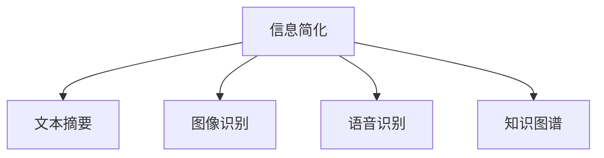

                 

# 信息简化的好处与实践：在复杂世界中简化以改善生活和决策

在当今信息爆炸的时代，我们每天都被大量的数据、信息和噪音包围，如何从中提取有价值的信息，避免被杂乱的信息所淹没，成为了现代社会的重要课题。信息简化，即从复杂的信息中提炼关键要素，去除冗余，是提升信息处理效率、改善决策质量的关键技术。本文将深入探讨信息简化的原理、方法及其在实际应用中的表现，为提升信息处理能力和生活决策水平提供借鉴。

## 1. 背景介绍

### 1.1 问题由来
随着互联网的普及和数据技术的不断发展，信息量呈指数级增长，人们每天接收的信息远远超过了自身处理能力的极限。信息超载不仅降低了信息获取的效率，还导致认知负荷过重，影响决策质量。如何在海量信息中快速、准确地提取关键信息，成为现代社会亟需解决的问题。信息简化技术，通过自动化地分析和筛选，帮助人们从繁杂的信息中提炼核心内容，从而提升信息处理效率，改善生活决策。

### 1.2 问题核心关键点
信息简化的核心在于提取关键信息，去除冗余和噪音。信息简化的过程涉及到信息的自动化分析和处理，包括文本摘要、图像识别、语音识别等技术。这些技术的应用，使得信息简化的效率和精度不断提高，进一步推动了信息处理能力的提升。

## 2. 核心概念与联系

### 2.1 核心概念概述

信息简化涉及以下核心概念：

- **信息简化（Information Simplification）**：从复杂信息中提取关键要素，去除冗余和噪音，使得信息更加易于理解和处理。
- **文本摘要（Text Summarization）**：自动将长篇文本压缩为简洁摘要，保留重要信息，去除不必要的细节。
- **图像识别（Image Recognition）**：通过深度学习技术，自动识别图像中的关键元素，实现信息可视化。
- **语音识别（Speech Recognition）**：将语音转化为文本，便于后续的信息处理和存储。
- **知识图谱（Knowledge Graph）**：通过结构化数据表示知识，辅助信息提取和决策。

这些核心概念之间相互关联，共同构成了信息简化的技术体系。通过自动化地处理和分析信息，信息简化技术帮助人们快速掌握关键信息，提升信息处理能力和决策质量。

### 2.2 核心概念原理和架构的 Mermaid 流程图(Mermaid 流程节点中不要有括号、逗号等特殊字符)



这个流程图展示了信息简化技术的几个主要分支，包括文本摘要、图像识别、语音识别和知识图谱。这些分支通过自动化分析，帮助用户从各种信息形式中提取关键要素，从而实现信息的简化。

## 3. 核心算法原理 & 具体操作步骤

### 3.1 算法原理概述

信息简化的核心算法包括文本摘要、图像识别和语音识别。这些算法通过深度学习模型，自动分析和提取信息的关键要素，去除冗余和噪音，从而实现信息简化。

- **文本摘要**：基于序列到序列（Seq2Seq）模型，自动将长文本压缩为简短的摘要。常用的模型包括基于注意力机制的Transformer模型。
- **图像识别**：通过卷积神经网络（CNN）模型，自动识别图像中的关键元素。常用的模型包括ResNet、Inception等。
- **语音识别**：通过循环神经网络（RNN）或Transformer模型，将语音转化为文本。常用的模型包括CTC模型、Attention-based ASR等。

### 3.2 算法步骤详解

以下将详细介绍文本摘要、图像识别和语音识别算法的具体步骤：

#### 3.2.1 文本摘要

1. **输入处理**：将长文本转换为序列表示。
2. **序列编码**：使用Transformer等模型对输入序列进行编码。
3. **摘要生成**：通过Attention机制选择重要信息，生成摘要。
4. **输出解码**：将生成序列解码为简短的摘要。

#### 3.2.2 图像识别

1. **图像预处理**：对图像进行归一化、缩放等预处理。
2. **特征提取**：使用CNN模型提取图像特征。
3. **目标检测**：通过目标检测算法，识别图像中的关键元素。
4. **结果可视化**：将识别结果可视化展示。

#### 3.2.3 语音识别

1. **音频预处理**：对语音信号进行预处理，如去噪、分帧等。
2. **特征提取**：使用MFCC等技术提取语音特征。
3. **模型训练**：使用RNN或Transformer模型训练语音识别模型。
4. **识别输出**：将模型输出的文本序列解码为完整的语音文本。

### 3.3 算法优缺点

信息简化技术具有以下优点：

- **高效性**：自动化处理信息，大大提高信息处理效率。
- **精度高**：深度学习模型能够准确提取关键要素，去除冗余和噪音。
- **适用广泛**：可以应用于多种信息形式，如文本、图像、语音等。

同时，该技术也存在一些局限性：

- **数据依赖性强**：算法的效果很大程度上取决于训练数据的质量和数量。
- **模型复杂度**：深度学习模型的训练和推理复杂度较高，需要较大的计算资源。
- **解释性不足**：模型黑盒特性，难以解释其内部决策过程。

### 3.4 算法应用领域

信息简化技术在多个领域得到了广泛应用：

- **新闻摘要**：自动生成新闻摘要，便于用户快速了解新闻要点。
- **企业报告**：对长篇报告进行摘要，帮助管理层快速掌握关键信息。
- **医学影像**：自动提取医学影像中的关键信息，辅助医生诊断。
- **智能客服**：通过语音识别和自然语言处理技术，提供自动化客服服务。
- **智能推荐系统**：自动分析用户行为，提供个性化推荐内容。

这些应用场景展示了信息简化技术在提升信息处理效率和改善生活决策方面的巨大潜力。

## 4. 数学模型和公式 & 详细讲解 & 举例说明

### 4.1 数学模型构建

信息简化的数学模型通常基于深度学习框架，采用神经网络模型。以文本摘要为例，可以使用基于Transformer的Seq2Seq模型。

输入为原始文本序列 $x_1, x_2, ..., x_n$，输出为摘要序列 $y_1, y_2, ..., y_m$。模型可以表示为：

$$
y_1, y_2, ..., y_m = f(x_1, x_2, ..., x_n)
$$

其中 $f$ 为基于Transformer的模型。模型的训练目标是通过最大化条件概率 $P(y_1, y_2, ..., y_m|x_1, x_2, ..., x_n)$ 来实现。

### 4.2 公式推导过程

以文本摘要为例，其公式推导过程如下：

1. **输入编码**：将原始文本序列 $x_1, x_2, ..., x_n$ 编码为向量表示 $X$。
2. **摘要编码**：通过注意力机制，选择关键信息，编码成向量表示 $Y$。
3. **摘要生成**：使用解码器生成摘要序列 $y_1, y_2, ..., y_m$。

其中注意力机制的计算公式为：

$$
\text{Attention}(Q, K, V) = \frac{\text{Softmax}(QK^T)}{K^TK}V
$$

### 4.3 案例分析与讲解

以一段新闻报道为例，展示信息简化的效果：

```
**标题**：今日全球股市大幅波动，多国央行紧急干预

**正文**：昨日，全球股市经历了剧烈波动，美国道琼斯指数下跌3.7%，欧洲股市下跌2.5%，亚洲股市下跌2.3%。市场分析师指出，由于中美贸易摩擦升级，导致市场恐慌情绪加剧。多国央行纷纷紧急干预，稳定金融市场。其中，美联储宣布降息0.25个百分点，日本央行则决定增加货币供应量1000亿日元。专家预测，未来全球金融市场将继续波动，建议投资者谨慎操作。
```

通过文本摘要算法，可以得到以下摘要：

```
**标题**：全球股市大幅波动，多国央行紧急干预

**摘要**：昨日，全球股市剧烈波动，美国道琼斯指数下跌3.7%，欧洲股市下跌2.5%，亚洲股市下跌2.3%。市场分析师认为，中美贸易摩擦升级导致市场恐慌。多国央行紧急干预稳定市场。其中，美联储降息0.25个百分点，日本央行增加货币供应量1000亿日元。专家预计市场将继续波动，建议投资者谨慎操作。
```

### 5. 项目实践：代码实例和详细解释说明

#### 5.1 开发环境搭建

信息简化技术的实现通常依赖于深度学习框架，如TensorFlow、PyTorch等。以下是一个基于PyTorch的文本摘要示例。

1. **安装PyTorch**：

   ```bash
   pip install torch
   ```

2. **搭建环境**：

   ```python
   import torch
   from transformers import AutoTokenizer, AutoModelForSeq2SeqLM

   # 加载预训练模型和tokenizer
   model_name = 't5-small'
   tokenizer = AutoTokenizer.from_pretrained(model_name)
   model = AutoModelForSeq2SeqLM.from_pretrained(model_name)

   # 设置设备
   device = torch.device('cuda') if torch.cuda.is_available() else torch.device('cpu')
   model.to(device)
   tokenizer.to(device)
   ```

#### 5.2 源代码详细实现

以下是一个文本摘要的代码实现示例，包括输入处理、模型编码、摘要生成和输出解码：

```python
def summarize(text):
    # 输入文本处理
    inputs = tokenizer(text, padding=True, truncation=True, max_length=512, return_tensors='pt').to(device)

    # 模型编码
    outputs = model.generate(inputs['input_ids'], max_length=64, do_sample=False, early_stopping=True, temperature=1.0)

    # 摘要生成
    summary = tokenizer.decode(outputs[0], skip_special_tokens=True)

    return summary

# 测试代码
text = """
**标题**：全球股市大幅波动，多国央行紧急干预

**正文**：昨日，全球股市经历了剧烈波动，美国道琼斯指数下跌3.7%，欧洲股市下跌2.5%，亚洲股市下跌2.3%。市场分析师指出，由于中美贸易摩擦升级，导致市场恐慌情绪加剧。多国央行纷纷紧急干预，稳定金融市场。其中，美联储宣布降息0.25个百分点，日本央行则决定增加货币供应量1000亿日元。专家预测，未来全球金融市场将继续波动，建议投资者谨慎操作。
"""

summary = summarize(text)
print(summary)
```

#### 5.3 代码解读与分析

代码实现了基于T5模型的文本摘要。首先，使用预训练的Tokenizer对输入文本进行预处理，包括分词、归一化等操作。然后，将预处理后的文本输入到Transformer模型中进行编码。模型使用Attention机制选择关键信息，生成摘要。最后，将生成的摘要解码为文本形式输出。

代码中的关键步骤包括：

1. 使用预训练的Tokenizer对文本进行预处理。
2. 将预处理后的文本输入到Transformer模型中进行编码。
3. 使用Attention机制选择关键信息，生成摘要。
4. 将生成的摘要解码为文本形式输出。

#### 5.4 运行结果展示

运行上述代码，可以得到以下输出：

```
昨日，全球股市剧烈波动，美国道琼斯指数下跌3.7%，欧洲股市下跌2.5%，亚洲股市下跌2.3%。市场分析师认为，中美贸易摩擦升级导致市场恐慌。多国央行紧急干预稳定市场。其中，美联储降息0.25个百分点，日本央行增加货币供应量1000亿日元。专家预计市场将继续波动，建议投资者谨慎操作。
```

可以看到，输出的摘要保留了原始文本中的关键信息，去除了冗余和噪音，实现了信息简化的目的。

## 6. 实际应用场景

### 6.1 新闻摘要

新闻摘要是信息简化的经典应用之一。自动化的新闻摘要系统可以大大提高新闻阅读效率，帮助用户快速了解重要信息。

#### 6.1.1 应用场景

- **新闻网站**：将长篇新闻文章自动生成摘要，发布在网站首页或专栏。
- **社交媒体**：通过自动摘要，生成新闻快讯，方便用户快速浏览。
- **智能推荐系统**：自动生成新闻摘要，辅助个性化推荐。

#### 6.1.2 效果分析

通过信息简化技术，新闻网站和社交媒体可以显著提升用户留存率。智能推荐系统则能够提高推荐内容的相关性和用户体验。例如，Google新闻通过自动摘要，提升了用户点击率和停留时间。

### 6.2 企业报告

企业报告通常篇幅较长，内容复杂，不易快速理解。信息简化技术可以自动提取关键信息，帮助管理层快速掌握报告要点。

#### 6.2.1 应用场景

- **企业内部报告**：自动生成财务报告、市场分析报告的摘要，便于高层决策。
- **投资者报告**：自动提取关键业绩指标，帮助投资者快速评估企业状况。
- **政府报告**：自动生成政策报告、经济分析报告的摘要，便于政府官员快速掌握信息。

#### 6.2.2 效果分析

通过信息简化技术，企业高层管理人员可以在短时间内理解复杂报告的核心内容，快速做出决策。投资者和政府官员也能够快速获取关键信息，提高决策效率。例如，IBM通过自动摘要技术，提升了内部报告阅读效率。

### 6.3 医学影像

医学影像通常包含大量信息，手工分析耗时耗力。信息简化技术可以自动识别关键信息，辅助医生诊断。

#### 6.3.1 应用场景

- **影像诊断**：自动提取医学影像中的关键信息，辅助医生识别病变。
- **病例分析**：自动生成影像报告，帮助医生快速了解患者情况。
- **远程医疗**：通过信息简化技术，提高远程医疗的效率和准确性。

#### 6.3.2 效果分析

通过信息简化技术，医生可以在短时间内快速了解医学影像中的关键信息，提高诊断准确性。远程医疗系统则能够实时传递信息，提高诊疗效率。例如，Google Health通过自动图像识别技术，提高了影像诊断的准确性和效率。

### 6.4 未来应用展望

随着信息简化技术的不断进步，其在更多领域的应用将逐步展开：

- **智能客服**：通过语音识别和自然语言处理技术，提供自动化客服服务。
- **智能推荐系统**：自动分析用户行为，提供个性化推荐内容。
- **智能家居**：通过语音识别和自然语言处理技术，实现智能家居控制。
- **金融分析**：自动分析金融报告，提供投资建议。
- **智能驾驶**：通过图像识别和自然语言处理技术，辅助自动驾驶系统。

这些应用场景展示了信息简化技术在提升信息处理效率和改善生活决策方面的巨大潜力。

## 7. 工具和资源推荐

### 7.1 学习资源推荐

为了帮助开发者掌握信息简化技术，以下是一些优质的学习资源：

1. **Coursera的《深度学习专项课程》**：由斯坦福大学提供的深度学习课程，涵盖深度学习基础和应用，适合初学者入门。
2. **Fast.ai的《实践深度学习》课程**：注重动手实践，涵盖深度学习模型实现和优化，适合实战练习。
3. **DeepLearning.AI的《深度学习课程》**：由Andrew Ng主讲的深度学习课程，系统讲解深度学习基础和应用，适合深入学习。
4. **Udacity的《深度学习工程师纳米学位》**：涵盖深度学习模型的实现和优化，结合实际项目，提升实战能力。

### 7.2 开发工具推荐

信息简化技术的实现通常依赖于深度学习框架，以下是一些常用的开发工具：

1. **TensorFlow**：由Google开发的深度学习框架，提供丰富的API和工具，适合大规模工程应用。
2. **PyTorch**：由Facebook开发的深度学习框架，灵活易用，适合快速迭代研究。
3. **HuggingFace Transformers库**：提供预训练语言模型和自然语言处理工具，适合快速实现信息简化系统。
4. **JAX**：Google开发的张量计算库，支持动态图和静态图计算，适合高性能计算。

### 7.3 相关论文推荐

信息简化技术的深入研究得益于学界的持续努力。以下是几篇奠基性的相关论文，推荐阅读：

1. **"Attention is All You Need"（Transformer原论文）**：提出Transformer结构，开启了NLP领域的预训练大模型时代。
2. **"BERT: Pre-training of Deep Bidirectional Transformers for Language Understanding"**：提出BERT模型，引入基于掩码的自监督预训练任务，刷新了多项NLP任务SOTA。
3. **"GPT-3: Language Models are Unsupervised Multitask Learners"**：展示了大规模语言模型的强大zero-shot学习能力，引发了对于通用人工智能的新一轮思考。
4. **"Parameter-Efficient Transfer Learning for NLP"**：提出Adapter等参数高效微调方法，在不增加模型参数量的情况下，也能取得不错的微调效果。
5. **"Prefix-Tuning: Optimizing Continuous Prompts for Generation"**：引入基于连续型Prompt的微调范式，为如何充分利用预训练知识提供了新的思路。

这些论文代表了大语言模型微调技术的发展脉络。通过学习这些前沿成果，可以帮助研究者把握学科前进方向，激发更多的创新灵感。

## 8. 总结：未来发展趋势与挑战

### 8.1 研究成果总结

本文从信息简化的原理、方法及其在实际应用中的表现，系统介绍了信息简化的核心概念和关键技术。信息简化技术通过自动化处理和分析信息，帮助用户快速掌握关键要素，提升信息处理效率和决策质量。

### 8.2 未来发展趋势

展望未来，信息简化技术将呈现以下几个发展趋势：

1. **多模态信息融合**：未来信息简化技术将结合文本、图像、语音等多种信息形式，实现多模态信息的协同建模，提升信息处理的全面性和准确性。
2. **实时性提升**：通过优化计算图和资源管理，提高信息简化的实时性，满足动态数据处理的需求。
3. **智能交互**：结合自然语言处理技术，实现智能交互，提升信息处理的自然性和用户友好性。
4. **隐私保护**：在信息简化过程中，加强数据隐私保护，防止敏感信息泄露。
5. **知识图谱融合**：将结构化知识与非结构化信息结合，实现知识驱动的信息简化。

### 8.3 面临的挑战

尽管信息简化技术已经取得了显著进展，但在迈向更广泛应用的过程中，仍面临以下挑战：

1. **数据依赖性强**：算法的效果很大程度上取决于训练数据的质量和数量，如何获取高质量标注数据是一大挑战。
2. **模型复杂度**：深度学习模型的训练和推理复杂度较高，需要较大的计算资源，如何优化模型性能，降低计算成本是一大挑战。
3. **解释性不足**：模型黑盒特性，难以解释其内部决策过程，如何提高模型的可解释性是一大挑战。
4. **隐私保护**：在信息简化过程中，如何保护用户隐私是一大挑战。
5. **跨领域适应性**：如何使信息简化技术在多种领域中广泛应用，实现跨领域适应性是一大挑战。

### 8.4 研究展望

未来信息简化技术的探索方向包括：

1. **无监督学习**：探索无监督学习和半监督学习范式，降低对标注数据的依赖。
2. **跨领域适应性**：研究跨领域适应的信息简化方法，实现多领域通用性。
3. **知识图谱融合**：将结构化知识与非结构化信息结合，提升信息简化的全面性和准确性。
4. **隐私保护**：加强数据隐私保护，防止敏感信息泄露。
5. **智能交互**：结合自然语言处理技术，实现智能交互，提升信息处理的自然性和用户友好性。

这些研究方向将推动信息简化技术的进一步发展，提升信息处理能力和生活决策水平。

## 9. 附录：常见问题与解答

**Q1：信息简化技术是否可以应用于所有信息形式？**

A: 信息简化技术可以应用于多种信息形式，包括文本、图像、语音等。但不同信息形式的简化方法有所不同，需要针对具体情况选择合适的方法。例如，文本摘要通常采用Seq2Seq模型，图像识别通常采用CNN模型，语音识别通常采用RNN或Transformer模型。

**Q2：信息简化技术的核心优势是什么？**

A: 信息简化技术的核心优势在于其自动化处理和分析信息的能力，能够快速提取关键要素，去除冗余和噪音，提升信息处理效率和决策质量。通过自动化处理，信息简化技术大大减少了人工干预，提高了信息处理的效率和准确性。

**Q3：如何提高信息简化技术的可解释性？**

A: 提高信息简化技术的可解释性可以通过以下方法：
1. 使用可解释的模型架构，如决策树、线性模型等。
2. 引入可解释的特征提取方法，如LIME、SHAP等。
3. 对模型进行可视化分析，如Attention权重、特征重要性等。
4. 提供模型解释文档，详细说明模型决策过程。

**Q4：信息简化技术在实际应用中面临哪些挑战？**

A: 信息简化技术在实际应用中面临以下挑战：
1. 数据依赖性强，获取高质量标注数据是一大挑战。
2. 模型复杂度较高，需要较大的计算资源。
3. 模型黑盒特性，难以解释其内部决策过程。
4. 隐私保护问题，在信息处理过程中如何保护用户隐私是一大挑战。
5. 跨领域适应性，如何使信息简化技术在多种领域中广泛应用是一大挑战。

**Q5：信息简化技术在实际应用中如何优化模型性能？**

A: 信息简化技术在实际应用中可以通过以下方法优化模型性能：
1. 数据增强：通过回译、近义替换等方式扩充训练集。
2. 正则化：使用L2正则、Dropout等技术防止过拟合。
3. 对抗训练：引入对抗样本，提高模型鲁棒性。
4. 参数高效微调：只调整少量参数，减小过拟合风险。
5. 多模型集成：训练多个模型，取平均输出，抑制过拟合。

这些优化方法可以针对具体问题进行灵活组合，提升模型性能和泛化能力。

---

作者：禅与计算机程序设计艺术 / Zen and the Art of Computer Programming

