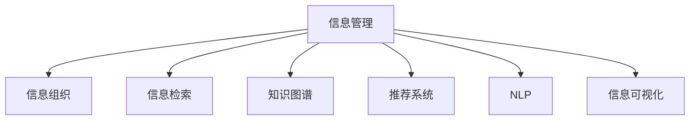

                 

## 1. 背景介绍

### 1.1 问题由来

在数字信息时代，信息的数量和复杂性急剧增长。面对信息爆炸的挑战，如何有效地组织和管理信息，使得知识可以被快速检索、共享和应用，成为当前信息技术领域的一个重大课题。从学术资料到企业数据，从个人笔记到社交媒体，信息形式的丰富多样使得传统的文档存储和检索方式已难以适应。

### 1.2 问题核心关键点

信息过载的核心问题在于信息量的膨胀和信息质量的不确定性。传统的信息管理方式依赖于结构化的数据库和文件系统，但在信息形态日益复杂、信息来源日益多元化的今天，这些方式已显得力不从心。如何构建一个能处理海量、多样化、实时变化信息的管理系统，成为信息管理的迫切需求。

### 1.3 问题研究意义

研究信息组织和管理的方法，对于提升信息系统的效率、降低信息获取的难度、促进知识的传播和应用，具有重要意义：

1. **提升效率**：通过有效的信息组织，快速定位所需信息，节省搜索和处理时间。
2. **降低难度**：复杂的信息系统需要专业知识，通过智能化管理工具，降低用户的使用门槛。
3. **促进传播**：合理的信息组织方式能够提高信息的可访问性和可理解性，促进知识的分享和利用。
4. **应用广泛**：在学术研究、企业数据管理、个人知识整理等多个领域都有重要应用。
5. **技术创新**：探索新的信息管理技术，如自然语言处理、机器学习等，推动信息技术的发展。

## 2. 核心概念与联系

### 2.1 核心概念概述

为更好地理解信息组织和管理的核心概念，本节将介绍几个关键概念及其联系：

- **信息管理**：指的是对各类信息资源进行收集、存储、组织、检索、共享和使用的一系列活动和过程。
- **信息组织**：涉及对信息进行分类、归档、排序、标记等操作，以便于检索和利用。
- **信息检索**：通过查询系统，快速找到相关信息，并提供展示结果。
- **知识图谱**：使用图结构对知识进行表示，便于知识的推理和检索。
- **推荐系统**：通过分析用户行为和偏好，推荐可能感兴趣的信息内容。
- **自然语言处理(NLP)**：利用计算机理解和处理人类语言的技术，如文本分类、实体识别、语义分析等。
- **信息可视化**：将信息转化为图表、地图等可视化形式，帮助理解和发现信息间的关联。

这些概念之间的关系可以通过以下Mermaid流程图来展示：



这个流程图展示了信息管理活动中的多个关键环节：

1. 信息管理涉及多个模块，如信息组织、信息检索等。
2. 信息组织通过分类、归档等操作，使得信息能够被有效地检索和利用。
3. 信息检索系统通过查询，快速定位所需信息，并提供展示结果。
4. 知识图谱提供了一种结构化的知识表示方式，便于知识的推理和检索。
5. 推荐系统根据用户行为，推荐相关内容，提升信息的使用效率。
6. NLP技术使得计算机能够理解和处理人类语言，从而增强信息检索和分析能力。
7. 信息可视化将信息转化为图表、地图等形式，帮助理解和发现信息间的关联。

## 3. 核心算法原理 & 具体操作步骤
### 3.1 算法原理概述

信息组织和管理的核心算法原理主要涉及以下几个方面：

1. **信息分类**：将信息按主题、类型、来源等进行分类，便于检索和利用。
2. **文本索引**：建立文本索引，通过倒排索引、TF-IDF等技术，提高检索效率。
3. **知识图谱构建**：利用RDF、ontology等技术，建立实体间的关系网络，便于知识推理。
4. **推荐算法**：使用协同过滤、基于内容的推荐、深度学习等算法，提高信息推荐的相关性。
5. **信息可视化**：使用图表、地图等技术，将信息转化为直观的形式，帮助理解和发现信息间的关系。

这些算法共同构成了信息管理的核心，使得信息能够被有效组织、检索和利用。

### 3.2 算法步骤详解

信息组织和管理的步骤通常包括：

1. **数据收集**：收集不同来源的信息，建立统一的信息库。
2. **数据清洗**：清洗数据，去除噪声和冗余，保证数据质量。
3. **数据标注**：对信息进行标注，如分类、实体识别、关系抽取等。
4. **数据存储**：将处理后的数据存储到数据库或分布式文件系统中。
5. **数据索引**：建立数据索引，支持高效的检索和查询。
6. **知识图谱构建**：将数据转化为知识图谱，支持复杂的知识推理。
7. **推荐系统设计**：根据用户行为和偏好，设计推荐算法，提供个性化推荐。
8. **信息可视化**：将数据转化为图表、地图等形式，帮助理解和发现信息间的关系。

### 3.3 算法优缺点

信息组织和管理的算法具有以下优点：

1. **高效检索**：通过索引和分类，可以快速定位所需信息。
2. **数据整合**：能够整合不同来源的数据，形成统一的知识体系。
3. **个性化推荐**：通过推荐算法，提升信息的相关性和可用性。
4. **信息可视化**：通过图表、地图等形式，使得信息更直观、易理解。

同时，这些算法也存在以下局限性：

1. **数据质量依赖**：算法的性能很大程度上依赖于输入数据的质量，如数据噪声、标注偏差等。
2. **资源消耗大**：处理大规模数据集需要较高的计算资源和存储资源。
3. **知识图谱构建复杂**：知识图谱的构建需要大量人工标注和专家知识，成本较高。
4. **模型泛化能力不足**：推荐系统通常针对特定用户群，难以适应大规模人群的变化。
5. **信息安全问题**：大量敏感信息的存储和处理，需要考虑信息安全和隐私保护。

尽管存在这些局限性，但基于这些算法的信息管理方式，仍然在各行各业得到了广泛的应用，推动了信息技术的进步。

### 3.4 算法应用领域

信息组织和管理的算法广泛应用于多个领域，包括：

- **图书馆管理**：通过分类、索引等技术，帮助读者快速查找所需书籍。
- **企业知识管理**：建立企业知识库，支持内部文档的检索、分享和利用。
- **社交媒体分析**：通过实体识别、情感分析等技术，帮助企业了解市场动态。
- **推荐系统**：根据用户行为，推荐商品、新闻、内容等，提升用户体验。
- **医疗信息管理**：存储和检索医学文献、病历等，支持医疗决策。
- **智能客服**：通过自然语言处理技术，处理用户咨询，提供个性化服务。
- **地理信息系统(GIS)**：将空间数据转化为地图、图表等形式，支持地理信息的分析和管理。

这些应用场景展示了信息管理算法的强大能力和广泛应用。

## 4. 数学模型和公式 & 详细讲解 & 举例说明

### 4.1 数学模型构建

信息组织和管理涉及的数学模型通常包括以下几个部分：

- **TF-IDF**：文本索引中常用的权重计算方法，用于衡量单词的重要性。
- **倒排索引**：一种用于快速检索的索引结构，通过将单词映射到包含该单词的文档列表，实现快速查询。
- **向量空间模型**：将文档和单词表示为向量，便于计算相似度和检索。
- **协同过滤算法**：基于用户行为，推荐相关内容，如基于用户的协同过滤、基于物品的协同过滤等。
- **知识图谱构建算法**：如RDF、ontology等，用于表示和推理实体间的关系。

### 4.2 公式推导过程

**TF-IDF计算公式**：

$$
TF_{word} = \frac{n_{word}}{n_{doc}}
$$

$$
IDF_{word} = \log \frac{N}{n_{word}}
$$

$$
TF-IDF_{word} = TF_{word} \times IDF_{word}
$$

其中，$n_{word}$ 表示单词在文档中出现的次数，$n_{doc}$ 表示文档总数，$N$ 表示语料库中单词总数。

**倒排索引的构建**：

假设有一个包含$M$个文档和$W$个单词的语料库，其倒排索引结构可以表示为：

$$
\text{Index} = \{(w_i, d_j)|w_i \in W, d_j \in D\}
$$

其中，$w_i$ 表示单词，$d_j$ 表示包含该单词的文档列表。

**协同过滤算法**：

假设用户$u$对物品$i$的评分$s_{ui}$为$n_{ui}$，对于所有用户$u$，物品$i$的平均评分$\overline{s_i}$为：

$$
\overline{s_i} = \frac{1}{M} \sum_{u=1}^M s_{ui}
$$

用户$u$和物品$i$的相似度$sim_{ui}$为：

$$
sim_{ui} = \frac{n_{ui}}{\sqrt{\sum_{j=1}^M s_{uj}^2} \times \sqrt{\sum_{j=1}^M s_{ij}^2}}
$$

用户$u$的推荐物品集$R_u$为：

$$
R_u = \{j|sim_{uj} > \theta\}
$$

其中，$\theta$ 为相似度阈值，可根据实际情况调整。

### 4.3 案例分析与讲解

以图书馆信息管理系统为例，分析其核心算法和实现步骤：

**数据收集**：收集图书馆的所有书籍信息，包括书名、作者、出版年份、摘要等。

**数据清洗**：去除无效字段、校验数据完整性等，保证数据质量。

**数据标注**：对书籍进行分类，如文学、历史、科学等，同时进行实体识别，提取书籍的关键信息。

**数据存储**：将处理后的数据存储到数据库中，如MySQL、Elasticsearch等。

**数据索引**：建立倒排索引，支持高效的全文检索和关键词检索。

**推荐系统设计**：根据用户的历史借阅记录和评分数据，设计推荐算法，推荐相关书籍。

**信息可视化**：使用图表、地图等形式，展示图书馆的藏书情况、借阅排行榜等。

## 5. 项目实践：代码实例和详细解释说明

### 5.1 开发环境搭建

在进行信息管理系统的开发前，我们需要准备好开发环境。以下是使用Python进行Elasticsearch开发的开发环境配置流程：

1. 安装Anaconda：从官网下载并安装Anaconda，用于创建独立的Python环境。

2. 创建并激活虚拟环境：
```bash
conda create -n elasticsearch-env python=3.8 
conda activate elasticsearch-env
```

3. 安装Elasticsearch：根据Elasticsearch版本，从官网获取对应的安装命令。例如：
```bash
pip install elasticsearch
```

4. 安装各类工具包：
```bash
pip install numpy pandas scikit-learn matplotlib tqdm jupyter notebook ipython
```

完成上述步骤后，即可在`elasticsearch-env`环境中开始信息管理系统的开发。

### 5.2 源代码详细实现

下面是使用Python进行Elasticsearch的图书管理系统开发的代码实现。

首先，定义图书的索引结构和字段：

```python
from elasticsearch import Elasticsearch

es = Elasticsearch([{'host': 'localhost', 'port': 9200}])

# 创建图书索引
es.indices.create(index='books', ignore=[400, 404])
```

接着，定义图书的添加、查询和删除操作：

```python
class Book:
    def __init__(self, title, author, year, genre, summary):
        self.title = title
        self.author = author
        self.year = year
        self.genre = genre
        self.summary = summary

    def add(self):
        # 构建文档
        doc = {
            'title': self.title,
            'author': self.author,
            'year': self.year,
            'genre': self.genre,
            'summary': self.summary
        }
        # 添加文档到索引
        res = es.index(index='books', doc_type='title', id=self.title, body=doc)
        return res

    def query(self, query_string):
        # 构建查询
        res = es.search(index='books', body={
            "query": {
                "query_string": {
                    "query": query_string
                }
            }
        })
        return res

    def delete(self):
        # 删除文档
        res = es.delete(index='books', doc_type='title', id=self.title)
        return res
```

最后，使用Elasticsearch的API实现图书的添加、查询和删除功能：

```python
# 添加图书
book = Book('Python深度学习', 'Ian Goodfellow', 2016, 'AI', '深度学习领域的经典之作')
book.add()

# 查询图书
res = book.query('Python')
for hit in res['hits']['hits']:
    print(hit['_source'])

# 删除图书
book.delete()
```

以上就是使用Elasticsearch进行图书管理系统的代码实现。可以看到，通过Elasticsearch提供的API，我们可以非常方便地构建索引、添加、查询和删除数据，实现图书管理系统的核心功能。

### 5.3 代码解读与分析

让我们再详细解读一下关键代码的实现细节：

**Elasticsearch的连接**：
- 使用Elasticsearch的官方Python库，通过指定主机和端口，建立Elasticsearch的连接。

**图书索引的创建**：
- 使用Elasticsearch的API创建图书索引，指定索引名称为'books'，同时忽略400和404错误。

**图书的添加、查询和删除**：
- 定义图书类，包含书名、作者、出版年份、类型和摘要等属性。
- 实现图书的添加、查询和删除方法，分别通过Elasticsearch的API实现文档的创建、查询和删除。
- 在实际使用中，根据不同的需求，可以使用Elasticsearch提供的各种API，如搜索API、聚合API、过滤API等，实现更加复杂的功能。

## 6. 实际应用场景
### 6.1 图书馆管理系统

基于Elasticsearch的图书管理系统，可以广泛应用于图书馆的信息管理。传统图书馆的书籍管理依赖于人工操作，效率低、易出错。而使用Elasticsearch构建的图书管理系统，可以快速定位所需书籍，支持高效的图书检索和借阅管理。

在技术实现上，可以收集图书馆的所有书籍信息，建立统一的索引，通过Elasticsearch提供的查询API，实现快速检索和推荐。系统还可以集成用户借阅记录，通过协同过滤等推荐算法，推荐用户可能感兴趣的新书，提升借阅率。

### 6.2 企业知识管理系统

Elasticsearch还可以用于企业知识管理系统的构建，帮助企业集中存储和管理各类知识资源。知识管理系统通常包括文档存储、版本控制、搜索、权限管理等功能，使用Elasticsearch可以轻松实现。

具体而言，企业可以收集各类文档、报告、标准等，通过Elasticsearch构建统一的知识索引，支持高效的搜索和版本控制。系统还可以根据用户的访问记录，通过协同过滤等推荐算法，推荐相关文档，提升知识利用效率。

### 6.3 社交媒体分析系统

Elasticsearch在社交媒体分析中也具有广泛应用。社交媒体平台通常包含大量的用户评论、帖子等文本数据，使用Elasticsearch可以高效地存储和管理这些数据。

具体而言，可以收集用户的评论、帖子等文本数据，通过Elasticsearch构建索引，支持高效的搜索和分析。系统可以分析用户的情感、兴趣等，通过实体识别等NLP技术，提取关键信息，支持舆情监测和用户画像构建。

### 6.4 未来应用展望

随着Elasticsearch等技术的发展，信息管理系统的应用前景将更加广阔。

在智慧城市治理中，基于Elasticsearch的智能监控系统可以实时收集各类信息，通过数据分析和可视化，支持城市管理决策。在医疗领域，基于Elasticsearch的病历管理系统可以高效存储和检索医疗数据，支持医疗决策和研究。

此外，在企业生产、智能客服、智慧教育等众多领域，基于Elasticsearch的信息管理系统也将不断涌现，为数字化转型提供新的工具和解决方案。

## 7. 工具和资源推荐
### 7.1 学习资源推荐

为了帮助开发者系统掌握Elasticsearch等技术，这里推荐一些优质的学习资源：

1. Elasticsearch官方文档：Elasticsearch的官方文档，提供了完整的API和示例代码，是学习Elasticsearch的重要资源。

2. Elasticsearch中文社区：国内最大的Elasticsearch社区，提供了丰富的教程和案例，帮助开发者快速上手。

3. 《Elasticsearch入门与实战》书籍：全面的介绍Elasticsearch的原理和实战技巧，适合初学者和进阶开发者。

4. 《深入Elasticsearch》书籍：深入讲解Elasticsearch的高级功能和优化技巧，适合有一定基础的开发者。

5. 在线课程平台：如Coursera、Udemy等平台，提供了大量Elasticsearch相关的课程，适合系统学习。

通过对这些资源的学习实践，相信你一定能够快速掌握Elasticsearch等技术的精髓，并用于解决实际的NLP问题。

### 7.2 开发工具推荐

Elasticsearch作为一款强大的数据管理和搜索工具，常用的开发工具包括：

1. Python：Elasticsearch提供了Python API，适合快速原型开发。

2. Java：Elasticsearch的主要语言之一，适合大规模部署和应用。

3. Elasticsearch的客户端工具：如Elasticsearch的Python客户端、Java客户端等，提供了便捷的API调用方式。

4. Kibana：Elasticsearch的可视化界面，提供了强大的数据分析和可视化功能。

5. Logstash：Elasticsearch的数据管道工具，支持数据收集、转换和存储。

6. monitoring tools：如ELK Stack、Grafana等，提供了实时的监控和告警功能。

合理利用这些工具，可以显著提升Elasticsearch应用的开发效率，加速创新迭代的步伐。

### 7.3 相关论文推荐

Elasticsearch等技术的发展得益于学界的持续研究。以下是几篇奠基性的相关论文，推荐阅读：

1. "A Distributed Real-time File System"（分布式实时文件系统）：Elasticsearch的底层存储技术，具有高可用性和高扩展性。

2. "Apache Lucene: Real-time Distributed Search"（Apache Lucene：实时分布式搜索）：Elasticsearch的查询引擎，具有高效检索和实时分析能力。

3. "The Elasticsearch Source Code"（Elasticsearch源代码）：Elasticsearch的核心代码，详细解释了其设计和实现。

4. "Elasticsearch: A distributed real-time search and analytics engine"（Elasticsearch：分布式实时搜索和分析引擎）：Elasticsearch的官方介绍文档，全面讲解其原理和应用。

5. "Elasticsearch: A distributed search and analytics engine"（Elasticsearch：分布式搜索和分析引擎）：Elasticsearch的学术研究论文，介绍了其技术细节和应用场景。

这些论文代表了大数据技术的发展脉络，通过学习这些前沿成果，可以帮助研究者把握学科前进方向，激发更多的创新灵感。

## 8. 总结：未来发展趋势与挑战

### 8.1 总结

本文对基于Elasticsearch的信息管理技术进行了全面系统的介绍。首先阐述了信息管理技术的研究背景和意义，明确了Elasticsearch等技术在提升信息检索、存储和利用方面的独特价值。其次，从原理到实践，详细讲解了Elasticsearch的数学模型和关键步骤，给出了信息管理系统的代码实现。同时，本文还广泛探讨了Elasticsearch在图书馆管理、企业知识管理、社交媒体分析等多个领域的应用前景，展示了Elasticsearch的强大能力。

通过本文的系统梳理，可以看到，基于Elasticsearch等技术的信息管理技术正在成为信息管理的重要范式，极大地提升了大规模数据的管理和利用效率，推动了信息技术的发展。未来，伴随Elasticsearch等技术的不断演进，信息管理技术还将迎来更多创新，为数字化转型提供更加智能、高效的工具和解决方案。

### 8.2 未来发展趋势

展望未来，基于Elasticsearch等技术的信息管理技术将呈现以下几个发展趋势：

1. 分布式处理能力增强。Elasticsearch的分布式存储和处理能力将继续提升，支持更大规模的数据管理和分析。

2. 实时性提升。通过引入流处理技术和实时存储引擎，Elasticsearch将支持实时数据流的处理和分析。

3. 用户接口优化。通过提升API和可视化工具的易用性，Elasticsearch将进一步降低用户的使用门槛，促进技术的普及应用。

4. 扩展性和可定制性增强。通过提供更多的插件和扩展，Elasticsearch将支持更丰富的功能需求，满足不同场景的需求。

5. 安全性加强。通过引入更多的安全机制和审计功能，Elasticsearch将确保数据的安全性和隐私保护。

以上趋势展示了Elasticsearch等技术的广阔前景。这些方向的探索发展，必将进一步提升信息管理系统的性能和应用范围，为数字化转型提供更加智能、高效的工具和解决方案。

### 8.3 面临的挑战

尽管Elasticsearch等技术已经取得了瞩目成就，但在迈向更加智能化、普适化应用的过程中，仍面临诸多挑战：

1. 数据存储和处理能力瓶颈。Elasticsearch在大规模数据处理和存储时，可能会遇到存储和计算资源不足的问题。如何优化存储和计算效率，需要更多的技术突破。

2. 数据质量和完整性问题。Elasticsearch的性能很大程度上依赖于数据的质量，如数据噪声、缺失等，如何保证数据的高质量和完整性，需要更多的数据治理措施。

3. 系统复杂度增加。Elasticsearch的分布式设计和实时处理能力，增加了系统的复杂度，如何优化系统架构和运维管理，需要更多的工程实践。

4. 安全性和隐私保护。Elasticsearch存储和处理大量敏感数据，如何保障数据安全和隐私保护，需要更多的安全机制和加密技术。

5. 用户接口设计。Elasticsearch的复杂性和功能丰富性，使得其用户接口设计成为一大挑战，如何提升用户的使用体验，需要更多的用户反馈和迭代优化。

尽管存在这些挑战，但Elasticsearch等技术的发展前景广阔，通过不断创新和优化，Elasticsearch必将在信息管理领域发挥更大的作用。

### 8.4 研究展望

面对Elasticsearch等技术面临的种种挑战，未来的研究需要在以下几个方面寻求新的突破：

1. 分布式系统优化。通过改进分布式存储和处理算法，优化系统的扩展性和容错性，支持更大规模的数据管理和分析。

2. 实时处理优化。通过引入流处理技术和实时存储引擎，优化系统的实时处理能力，支持实时数据流的处理和分析。

3. 数据质量治理。通过数据清洗、数据增强等技术，提升数据的质量和完整性，确保系统性能的稳定性和可靠性。

4. 系统复杂度降低。通过优化系统架构和设计，降低系统的复杂度，提升系统的易用性和可维护性。

5. 安全性和隐私保护。通过引入更多的安全机制和加密技术，保障数据安全和隐私保护，提升系统的可信度和可靠性。

这些研究方向的探索，必将引领Elasticsearch等技术的不断进步，为数字化转型提供更加智能、高效的工具和解决方案。面向未来，Elasticsearch等技术需要与其他大数据技术进行更深入的融合，如Hadoop、Spark等，多路径协同发力，共同推动信息管理的创新发展。

## 9. 附录：常见问题与解答

**Q1：Elasticsearch有哪些核心组件？**

A: Elasticsearch的核心组件包括：

1. 存储引擎：支持分布式存储和检索，是Elasticsearch的核心功能。

2. 查询引擎：提供丰富的查询API，支持高效的检索和分析。

3. 插件系统：支持扩展和定制，添加更多的功能和特性。

4. 聚合框架：支持复杂的聚合操作，如分组、聚合、统计等。

5. 监控和告警：提供实时的监控和告警功能，确保系统的稳定运行。

6. 可视化界面：提供Kibana等可视化工具，帮助用户进行数据分析和可视化。

这些组件共同构成了Elasticsearch的核心功能，使其能够高效地管理和检索大规模数据。

**Q2：Elasticsearch有哪些数据类型？**

A: Elasticsearch支持多种数据类型，包括：

1. 文档类型：最常见的数据类型，用于存储文档和实体。

2. 分布式类型：支持分布式存储和处理，提高数据管理的效率。

3. 索引类型：用于组织和分类数据，支持高效的检索和查询。

4. 搜索类型：支持实时的全文搜索和关键词搜索，提高数据检索的效率。

5. 聚合类型：用于统计和分析数据，支持复杂的聚合操作。

6. 文件类型：支持文件存储和检索，支持对文件进行全文搜索和关键词搜索。

这些数据类型提供了灵活的数据管理方式，满足不同场景的需求。

**Q3：如何使用Elasticsearch进行实时监控？**

A: Elasticsearch提供了实时的监控和告警功能，通过以下步骤实现实时监控：

1. 定义监控指标：定义需要监控的指标，如请求次数、响应时间、错误率等。

2. 设置监控阈值：根据业务需求，设置各项指标的监控阈值。

3. 配置告警规则：根据监控阈值，配置告警规则，当指标超过阈值时触发告警。

4. 使用监控工具：使用ELK Stack、Grafana等监控工具，实时显示监控指标和告警信息。

通过上述步骤，可以构建一个实时的监控系统，及时发现和处理系统问题，保障系统的稳定运行。

**Q4：如何优化Elasticsearch的查询性能？**

A: 优化Elasticsearch的查询性能，主要通过以下几种方法：

1. 优化索引设计：通过合理的索引设计，减少查询时的数据量。

2. 使用缓存机制：通过使用缓存机制，减少查询时的计算量。

3. 调整查询参数：通过调整查询参数，如分页、过滤、排序等，减少查询时的数据量。

4. 使用分布式查询：通过分布式查询，将查询任务分解到多个节点上，提高查询效率。

5. 优化查询结构：通过优化查询结构，减少查询时的计算量。

这些方法可以有效提升Elasticsearch的查询性能，确保系统的高效运行。

**Q5：Elasticsearch在数据备份和恢复方面有哪些解决方案？**

A: Elasticsearch提供了多种数据备份和恢复的解决方案，包括：

1. 使用快照机制：使用快照机制，定期备份数据到存储设备，支持数据的恢复。

2. 使用远程复制：通过远程复制，将数据备份到其他节点或云存储设备，支持数据的恢复。

3. 使用日志机制：通过日志机制，记录数据的修改和更新操作，支持数据的恢复。

4. 使用版本控制：通过版本控制，支持数据的版本管理和恢复。

5. 使用备份工具：使用第三方备份工具，支持数据的备份和恢复。

这些解决方案可以确保Elasticsearch数据的可靠性和完整性，保障数据的备份和恢复。

---

作者：禅与计算机程序设计艺术 / Zen and the Art of Computer Programming

