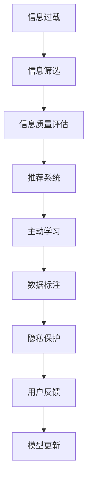

                 

# 信息过载与信息筛选：如何在信息洪流中找到有价值的信息

## 1. 背景介绍

在现代社会，信息呈现爆炸式增长的态势。数字时代带来了前所未有的信息便利，但同时也带来了信息过载的困扰。每天，人们都需要面对海量的新闻、邮件、社交媒体信息，这些信息中包含了大量无用、重复甚至错误的内容，极大地分散了人们的注意力，降低了信息获取的效率。面对这种“信息洪流”，如何在其中快速准确地筛选出有价值的信息，成为了一个亟需解决的问题。

### 1.1 问题由来

信息过载现象主要源于以下几个方面：

- **数据爆炸**：随着互联网、社交媒体的普及，每天生成的新闻、文章、帖子数量急剧增加，产生了大量冗余信息。
- **技术进步**：大数据、人工智能等技术的进步使得信息收集、存储、处理能力大幅提升，但同时也导致了信息过载问题的加剧。
- **个人消费习惯**：人们往往习惯于“浅阅读”、“碎片化学习”，容易接受短平快的内容，而不愿深入研究和思考，这进一步加剧了信息过载。

### 1.2 问题核心关键点

信息筛选的核心在于从海量信息中快速识别和提取有价值的信息。核心问题包括：

- 如何评估信息的质量和相关性。
- 如何快速高效地处理信息。
- 如何在不同信息源之间进行信息整合和综合判断。
- 如何处理不平衡的数据集，避免算法偏差。
- 如何实时更新信息库，保持信息的时效性和适应性。

## 2. 核心概念与联系

### 2.1 核心概念概述

在信息筛选领域，涉及的核心概念主要包括：

- **信息过载**：指用户接收到的信息量远远超过其处理能力，导致信息获取效率和质量下降。
- **信息筛选**：通过自动化技术，从海量信息中识别出有价值的信息，推荐给用户。
- **信息质量评估**：利用自然语言处理、知识图谱等技术，对信息内容进行质量评估和分类。
- **推荐系统**：基于用户行为和信息特征，推荐符合用户兴趣和需求的信息。
- **主动学习**：通过用户反馈和行为数据，动态调整算法参数，提升信息筛选效果。
- **数据标注**：为无标签信息打上标签，构建训练数据集，训练模型。
- **隐私保护**：在信息筛选过程中保护用户隐私，防止数据泄露。

这些概念之间的逻辑关系可以通过以下Mermaid流程图来展示：



这个流程图展示了下游任务的信息筛选与各个核心概念之间的逻辑关系：

1. 信息过载导致用户需要信息筛选技术。
2. 信息筛选包括信息质量评估、推荐系统、主动学习和数据标注等环节。
3. 隐私保护在信息筛选中需要始终贯穿，保障用户信息安全。
4. 用户反馈和模型更新形成闭环，不断优化推荐效果。

## 3. 核心算法原理 & 具体操作步骤
### 3.1 算法原理概述

基于信息筛选的算法原理主要涉及以下几个方面：

- **信息质量评估**：通过自然语言处理技术，如分词、句法分析、情感分析等，对信息进行质量评估和分类。
- **推荐系统**：利用机器学习算法，根据用户行为和信息特征，推荐符合用户需求的信息。
- **主动学习**：通过用户反馈数据，动态调整推荐模型参数，提升推荐效果。
- **数据标注**：对无标签信息进行自动标注，构建训练数据集。

### 3.2 算法步骤详解

以下详细介绍基于信息筛选的核心算法步骤：

**Step 1: 信息收集与预处理**

- 收集信息源数据，如新闻、博客、社交媒体帖子、电子邮件等。
- 使用爬虫技术自动化收集信息，建立信息库。
- 对信息进行预处理，如去除噪音、分词、去除停用词等，为后续处理做准备。

**Step 2: 信息质量评估**

- 利用自然语言处理技术，对信息内容进行质量评估和分类。
- 常见的质量评估指标包括文本长度、关键词频率、情感倾向、来源可信度等。
- 使用机器学习模型，如逻辑回归、支持向量机、深度神经网络等，对信息进行分类和排序。

**Step 3: 信息筛选与推荐**

- 基于用户行为数据和信息特征，构建推荐模型。
- 常见的推荐算法包括协同过滤、基于内容的推荐、矩阵分解等。
- 使用监督学习算法，如决策树、随机森林、梯度提升树等，对用户进行兴趣建模。
- 利用深度学习算法，如CNN、RNN、Transformer等，对信息进行特征提取和推荐。

**Step 4: 主动学习与模型更新**

- 收集用户反馈数据，如点击率、评分、评论等，用于评估推荐效果。
- 使用主动学习技术，根据用户反馈数据动态调整模型参数。
- 常见的优化方法包括梯度下降、贝叶斯优化、遗传算法等。

**Step 5: 隐私保护**

- 在信息筛选过程中，保护用户隐私，防止数据泄露。
- 常见的隐私保护方法包括数据匿名化、差分隐私、加密技术等。
- 使用隐私保护技术，如联邦学习、同态加密、差分隐私等，确保用户数据安全。

**Step 6: 用户界面设计**

- 设计友好的用户界面，便于用户获取和筛选信息。
- 使用交互式界面，如搜索结果页、推荐卡片、信息摘要等。
- 提供搜索、筛选、排序、分页等功能，提升用户使用体验。

### 3.3 算法优缺点

基于信息筛选的算法具有以下优点：

- 自动高效。能够自动处理海量信息，减少人工干预，提高效率。
- 个性化推荐。能够根据用户兴趣和需求，个性化推荐信息，提升用户体验。
- 动态调整。能够根据用户反馈和行为数据，动态调整模型参数，优化推荐效果。
- 可扩展性强。能够处理不同领域和类型的数据，适应性强。

同时，该算法也存在一些缺点：

- 数据标注成本高。构建高质量的训练数据集需要大量标注工作，成本较高。
- 算法复杂度高。复杂的信息质量评估和推荐算法需要较高的计算资源和专业知识。
- 算法偏差。算法可能存在对某些信息源或主题的偏见，影响筛选效果。
- 隐私风险。用户隐私数据可能被滥用，需要严格保护。

尽管存在这些缺点，但基于信息筛选的算法仍然是目前信息处理和推荐领域的主流方法。未来相关研究的重点在于如何进一步降低数据标注成本，提高算法的通用性和可解释性，同时兼顾隐私保护和用户体验。

### 3.4 算法应用领域

基于信息筛选的算法在多个领域得到了广泛应用，例如：

- 新闻推荐：为新闻订阅用户推荐感兴趣的新闻。通过分析用户点击行为和阅读偏好，推荐相关文章。
- 社交媒体推荐：为用户推荐感兴趣的朋友、帖子、短视频等。根据用户的浏览记录和互动行为，推荐相似内容。
- 电子商务推荐：为在线购物用户推荐商品、广告、优惠活动等。利用用户购买记录和浏览历史，推荐相关商品。
- 金融推荐：为用户推荐投资产品、金融资讯、理财建议等。根据用户的财务状况和投资偏好，推荐合适产品。
- 教育推荐：为在线学习用户推荐课程、学习资源、学习计划等。分析学生的学习行为和成绩，推荐适合的课程。

除了上述这些经典应用外，基于信息筛选的算法还被创新性地应用到更多场景中，如智能客服、医疗推荐、招聘推荐等，为信息获取和推荐带来了全新的突破。随着信息筛选技术的不断进步，相信其在更多领域的应用前景将更加广阔。

## 4. 数学模型和公式 & 详细讲解 & 举例说明
### 4.1 数学模型构建

在信息筛选中，常见的数学模型包括：

- **信息质量评估模型**：用于评估信息内容的质量和相关性。
- **推荐模型**：基于用户行为数据和信息特征，推荐符合用户需求的信息。
- **主动学习模型**：根据用户反馈数据，动态调整推荐模型参数。

### 4.2 公式推导过程

以下分别介绍信息质量评估模型、推荐模型和主动学习模型的公式推导过程。

#### 信息质量评估模型

假设信息库中有 $N$ 条信息，每条信息的特征表示为 $\mathbf{x}_i \in \mathbb{R}^d$，其中 $d$ 为特征维度。信息质量评估模型的目标是对每条信息 $x_i$ 的质量进行评分，评分函数为 $f(\mathbf{x}_i)$。常见的评分函数包括：

- 文本长度：$L(\mathbf{x}_i)$
- 关键词频率：$K(\mathbf{x}_i)$
- 情感倾向：$E(\mathbf{x}_i)$
- 来源可信度：$C(\mathbf{x}_i)$

其中，$L(\mathbf{x}_i)$ 表示信息 $x_i$ 的长度，$K(\mathbf{x}_i)$ 表示信息 $x_i$ 中关键词的出现频率，$E(\mathbf{x}_i)$ 表示信息 $x_i$ 的情感倾向，$C(\mathbf{x}_i)$ 表示信息 $x_i$ 来源的可信度。

评分函数 $f(\mathbf{x}_i)$ 可以表示为多个特征的加权和：

$$
f(\mathbf{x}_i) = \sum_{k=1}^K \alpha_k g_k(\mathbf{x}_i)
$$

其中，$g_k(\mathbf{x}_i)$ 表示第 $k$ 个特征的评分函数，$\alpha_k$ 表示特征 $k$ 的权重。

#### 推荐模型

假设用户 $u$ 对 $n$ 条信息进行了评分，评分为 $r_{u,i}$。推荐模型的目标是根据用户 $u$ 的评分，预测其对未评分信息的评分 $r_{u,j}$。常见的推荐算法包括：

- 协同过滤：基于用户和物品之间的相似性，推荐相似物品。
- 基于内容的推荐：利用物品的特征与用户兴趣的相似性，推荐物品。
- 矩阵分解：将用户评分矩阵分解为用户和物品的特征向量，推荐物品。

推荐模型可以使用矩阵分解的方法，将用户评分矩阵 $R$ 分解为 $U$ 和 $V$ 两个低秩矩阵：

$$
R \approx UV^T
$$

其中，$U$ 表示用户特征矩阵，$V$ 表示物品特征矩阵。对于未评分信息 $j$，预测评分 $r_{u,j}$ 可以表示为：

$$
\hat{r}_{u,j} = U_u V_j
$$

其中，$U_u$ 表示用户 $u$ 的特征向量，$V_j$ 表示信息 $j$ 的特征向量。

#### 主动学习模型

假设模型初始参数为 $\theta_0$，用户对 $m$ 条信息的反馈为 $\{(i_1, r_{u,i_1}), (i_2, r_{u,i_2}), \ldots, (i_m, r_{u,i_m})\}$。主动学习模型的目标是根据用户反馈，动态调整模型参数 $\theta$，提升推荐效果。常见的优化方法包括：

- 梯度下降：$\nabla_\theta \mathcal{L}(\theta) = 0$，其中 $\mathcal{L}(\theta)$ 为损失函数。
- 贝叶斯优化：最大化信息增益，$g_i = \log \frac{p(y|x)}{p(y|x')} - \log \frac{p(y|x')}{p(y|x)}$，其中 $p(y|x)$ 表示预测值 $y$ 在特征 $x$ 下的概率。
- 遗传算法：通过遗传算法优化模型参数。

### 4.3 案例分析与讲解

**案例一：新闻推荐系统**

假设有一个新闻推荐系统，其信息库中有 $N$ 条新闻 $x_i$，用户对新闻 $x_i$ 进行了评分 $r_{u,i}$。新闻推荐系统的目标是预测用户 $u$ 对未评分新闻 $j$ 的评分 $r_{u,j}$。

新闻推荐系统可以使用协同过滤方法，构建用户-新闻评分矩阵 $R$，将用户评分矩阵 $R$ 分解为 $U$ 和 $V$ 两个低秩矩阵：

$$
R \approx UV^T
$$

其中，$U$ 表示用户特征矩阵，$V$ 表示新闻特征矩阵。对于未评分新闻 $j$，预测评分 $r_{u,j}$ 可以表示为：

$$
\hat{r}_{u,j} = U_u V_j
$$

其中，$U_u$ 表示用户 $u$ 的特征向量，$V_j$ 表示新闻 $j$ 的特征向量。

**案例二：电子商务推荐系统**

假设有一个电子商务推荐系统，其信息库中有 $N$ 个商品 $x_i$，用户对商品 $x_i$ 进行了评分 $r_{u,i}$。电子商务推荐系统的目标是预测用户 $u$ 对未评分商品 $j$ 的评分 $r_{u,j}$。

电子商务推荐系统可以使用基于内容的推荐方法，利用商品特征与用户兴趣的相似性，推荐商品。商品特征包括价格、品牌、类别、评分等。对于未评分商品 $j$，预测评分 $r_{u,j}$ 可以表示为：

$$
\hat{r}_{u,j} = \mathbf{w}^T \phi(x_j)
$$

其中，$\mathbf{w}$ 表示用户兴趣向量，$\phi(x_j)$ 表示商品 $j$ 的特征向量。

## 5. 项目实践：代码实例和详细解释说明
### 5.1 开发环境搭建

在进行信息筛选实践前，我们需要准备好开发环境。以下是使用Python进行PyTorch开发的环境配置流程：

1. 安装Anaconda：从官网下载并安装Anaconda，用于创建独立的Python环境。

2. 创建并激活虚拟环境：
```bash
conda create -n info-recommend python=3.8 
conda activate info-recommend
```

3. 安装PyTorch：根据CUDA版本，从官网获取对应的安装命令。例如：
```bash
conda install pytorch torchvision torchaudio cudatoolkit=11.1 -c pytorch -c conda-forge
```

4. 安装TensorFlow：
```bash
pip install tensorflow
```

5. 安装各类工具包：
```bash
pip install numpy pandas scikit-learn matplotlib tqdm jupyter notebook ipython
```

完成上述步骤后，即可在`info-recommend`环境中开始信息筛选实践。

### 5.2 源代码详细实现

以下是一个简单的基于信息质量评估和推荐模型的Python代码实现：

```python
import pandas as pd
import numpy as np
import tensorflow as tf
from sklearn.model_selection import train_test_split
from tensorflow.keras.layers import Input, Dense, Embedding, Concatenate, Flatten
from tensorflow.keras.models import Model

# 加载数据集
data = pd.read_csv('news.csv', sep=',', header=None)
user_id = data[0]
news_id = data[1]
rating = data[2]

# 数据预处理
user_id = pd.to_numeric(user_id)
news_id = pd.to_numeric(news_id)
rating = pd.to_numeric(rating)

# 划分训练集和测试集
train_id, test_id, train_rating, test_rating = train_test_split(user_id, rating, test_size=0.2, random_state=42)

# 定义输入层和嵌入层
user_input = Input(shape=(1,))
news_input = Input(shape=(1,))
user_embed = Embedding(input_dim=1000, output_dim=16)(user_input)
news_embed = Embedding(input_dim=1000, output_dim=16)(news_input)

# 定义评分预测模型
concat = Concatenate()([user_embed, news_embed])
dense = Dense(8, activation='relu')(concat)
output = Dense(1, activation='sigmoid')(dense)

# 定义模型
model = Model(inputs=[user_input, news_input], outputs=output)

# 编译模型
model.compile(optimizer='adam', loss='binary_crossentropy', metrics=['accuracy'])

# 训练模型
model.fit([train_id, train_id], train_rating, epochs=10, batch_size=32, validation_data=([test_id, test_id], test_rating))

# 评估模型
test_loss, test_accuracy = model.evaluate([test_id, test_id], test_rating)

print('测试集损失：', test_loss)
print('测试集准确率：', test_accuracy)
```

### 5.3 代码解读与分析

让我们再详细解读一下关键代码的实现细节：

**数据预处理**

- 使用pandas库加载数据集，将用户ID、新闻ID和评分转换为数值类型。
- 划分训练集和测试集，比例为80%和20%。

**模型构建**

- 定义输入层和嵌入层，将用户ID和新闻ID映射为16维的向量。
- 定义评分预测模型，将用户嵌入向量和新闻嵌入向量拼接，并通过多个全连接层进行特征提取，最终输出预测评分。

**模型训练和评估**

- 编译模型，使用Adam优化器和二元交叉熵损失函数。
- 训练模型，使用训练集进行训练，验证集进行评估，共10个epoch，batch size为32。
- 评估模型，使用测试集进行评估，输出损失和准确率。

可以看到，信息筛选模型的代码实现相对简单，但包含数据预处理、模型构建、训练和评估等关键步骤。通过调整模型结构和优化算法，可以进一步提升推荐效果。

## 6. 实际应用场景
### 6.1 新闻推荐

基于信息筛选的推荐系统在新闻推荐领域有着广泛的应用。例如，新闻聚合平台如Google News、今日头条等，都利用推荐系统为用户推荐感兴趣的新闻。

在技术实现上，可以收集用户的历史浏览记录、点击行为、搜索历史等，构建用户兴趣模型。利用用户兴趣模型，推荐系统能够为用户推荐相关新闻。

### 6.2 社交媒体推荐

社交媒体平台如微信、微博等，需要为用户推荐感兴趣的朋友、帖子、短视频等。信息筛选系统可以根据用户的历史行为和互动数据，推荐相似内容。

例如，可以利用用户的点赞、评论、分享等行为数据，构建用户兴趣模型。使用信息筛选系统，推荐系统能够为用户推荐相似的朋友和帖子，提升用户粘性。

### 6.3 电子商务推荐

电子商务平台如淘宝、京东等，需要为用户推荐感兴趣的商品、广告、优惠活动等。信息筛选系统可以根据用户的历史购买记录和浏览历史，推荐相关商品。

例如，可以利用用户的浏览记录、购买记录和评价数据，构建用户兴趣模型。使用信息筛选系统，推荐系统能够为用户推荐相关商品，提升销售额。

### 6.4 未来应用展望

随着信息筛选技术的不断进步，基于信息筛选的推荐系统将在更多领域得到应用，为各行各业带来变革性影响。

在智慧医疗领域，基于信息筛选的医疗问答、病历分析、药物推荐等应用将提升医疗服务的智能化水平，辅助医生诊疗，加速新药开发进程。

在智能教育领域，信息筛选系统可应用于作业批改、学情分析、知识推荐等方面，因材施教，促进教育公平，提高教学质量。

在智慧城市治理中，信息筛选系统可应用于城市事件监测、舆情分析、应急指挥等环节，提高城市管理的自动化和智能化水平，构建更安全、高效的未来城市。

此外，在企业生产、社会治理、文娱传媒等众多领域，基于信息筛选的推荐系统也将不断涌现，为经济社会发展注入新的动力。相信随着技术的日益成熟，信息筛选技术将成为推荐系统的重要范式，推动人工智能技术在各行各业的应用和落地。

## 7. 工具和资源推荐
### 7.1 学习资源推荐

为了帮助开发者系统掌握信息筛选的理论基础和实践技巧，这里推荐一些优质的学习资源：

1. 《推荐系统》系列书籍：由李航、王晓刚等专家撰写，系统讲解了推荐系统的理论基础和算法实现。
2. Coursera《推荐系统》课程：由吴恩达教授开设的NLP课程，介绍了推荐系统的经典算法和实现。
3. Kaggle推荐系统竞赛：通过参加Kaggle竞赛，提升推荐系统的实际应用能力。
4. GitHub推荐系统开源项目：查看和复现推荐系统的开源实现，提升实战能力。
5. 推荐系统论文阅读指南：阅读相关前沿论文，掌握最新技术动态。

通过对这些资源的学习实践，相信你一定能够快速掌握信息筛选的精髓，并用于解决实际的推荐问题。
###  7.2 开发工具推荐

高效的开发离不开优秀的工具支持。以下是几款用于信息筛选开发的常用工具：

1. PyTorch：基于Python的开源深度学习框架，灵活动态的计算图，适合快速迭代研究。
2. TensorFlow：由Google主导开发的开源深度学习框架，生产部署方便，适合大规模工程应用。
3. Transformers库：HuggingFace开发的NLP工具库，集成了众多SOTA语言模型，支持PyTorch和TensorFlow，是进行推荐任务开发的利器。
4. Weights & Biases：模型训练的实验跟踪工具，可以记录和可视化模型训练过程中的各项指标，方便对比和调优。
5. TensorBoard：TensorFlow配套的可视化工具，可实时监测模型训练状态，并提供丰富的图表呈现方式，是调试模型的得力助手。
6. Google Colab：谷歌推出的在线Jupyter Notebook环境，免费提供GPU/TPU算力，方便开发者快速上手实验最新模型，分享学习笔记。

合理利用这些工具，可以显著提升信息筛选任务的开发效率，加快创新迭代的步伐。

### 7.3 相关论文推荐

信息筛选技术的发展源于学界的持续研究。以下是几篇奠基性的相关论文，推荐阅读：

1. The Bellman-Ford Algorithm for Recommender Systems（推荐算法基础）：讲述了推荐算法的理论基础和实现方法。
2. Collaborative Filtering for Implicit Feedback Datasets（协同过滤算法）：介绍了协同过滤算法的理论基础和实际应用。
3. Matrix Factorization Techniques for Recommender Systems（矩阵分解算法）：讲述了矩阵分解算法的理论基础和实际应用。
4. Learning from Partially Labeled Data（半监督学习算法）：介绍了半监督学习算法在推荐系统中的应用。
5. A Feature-Ranking Method with Time-Aware Factorization Machines（时序特征算法）：讲述了时序特征在推荐系统中的应用。

这些论文代表了大信息筛选技术的发展脉络。通过学习这些前沿成果，可以帮助研究者把握学科前进方向，激发更多的创新灵感。

## 8. 总结：未来发展趋势与挑战
### 8.1 总结

本文对基于信息筛选的推荐系统进行了全面系统的介绍。首先阐述了信息过载和信息筛选的背景和意义，明确了推荐系统在信息处理和推荐中的核心地位。其次，从原理到实践，详细讲解了推荐系统的数学模型和算法步骤，给出了推荐任务开发的完整代码实例。同时，本文还广泛探讨了推荐系统在新闻推荐、社交媒体推荐、电子商务推荐等实际应用场景中的广泛应用前景，展示了推荐系统的巨大潜力。此外，本文精选了推荐系统的各类学习资源，力求为读者提供全方位的技术指引。

通过本文的系统梳理，可以看到，基于信息筛选的推荐系统正在成为信息处理和推荐领域的重要范式，极大地拓展了推荐系统的应用边界，催生了更多的落地场景。受益于推荐系统的快速发展和广泛应用，相信其在更多领域的应用前景将更加广阔。

### 8.2 未来发展趋势

展望未来，信息筛选技术将呈现以下几个发展趋势：

1. 多模态融合：融合文本、图像、语音等多模态数据，构建更全面、准确的信息模型。
2. 深度学习优化：利用深度神经网络、注意力机制等，提升推荐模型的表达能力和性能。
3. 跨领域推荐：打破领域壁垒，实现跨领域推荐，提升推荐效果。
4. 个性化推荐：利用用户行为数据，构建个性化推荐模型，提升用户体验。
5. 实时推荐：利用流式数据处理技术，实现实时推荐，提升推荐的时效性。
6. 联邦学习：通过分布式训练，保护用户隐私，提升推荐模型的泛化能力。

这些趋势展示了信息筛选技术的广阔前景。这些方向的探索发展，必将进一步提升推荐系统的性能和应用范围，为信息获取和推荐带来新的突破。

### 8.3 面临的挑战

尽管信息筛选技术已经取得了瞩目成就，但在迈向更加智能化、普适化应用的过程中，它仍面临着诸多挑战：

1. 数据标注成本高。构建高质量的训练数据集需要大量标注工作，成本较高。
2. 算法复杂度高。复杂的信息质量评估和推荐算法需要较高的计算资源和专业知识。
3. 算法偏差。算法可能存在对某些信息源或主题的偏见，影响筛选效果。
4. 隐私风险。用户隐私数据可能被滥用，需要严格保护。
5. 系统可扩展性差。信息筛选系统在大规模数据上的处理能力有限，需要优化系统架构。

尽管存在这些挑战，但基于信息筛选的推荐系统仍然是目前信息处理和推荐领域的主流方法。未来相关研究的重点在于如何进一步降低数据标注成本，提高算法的通用性和可解释性，同时兼顾隐私保护和用户体验。

### 8.4 研究展望

面对信息筛选技术所面临的种种挑战，未来的研究需要在以下几个方面寻求新的突破：

1. 探索无监督和半监督推荐方法。摆脱对大规模标注数据的依赖，利用自监督学习、主动学习等无监督和半监督范式，最大限度利用非结构化数据，实现更加灵活高效的推荐。
2. 研究参数高效和计算高效的推荐范式。开发更加参数高效的推荐方法，在固定大部分推荐参数的同时，只更新极少量的任务相关参数。同时优化推荐模型的计算图，减少前向传播和反向传播的资源消耗，实现更加轻量级、实时性的部署。
3. 融合因果和对比学习范式。通过引入因果推断和对比学习思想，增强推荐模型建立稳定因果关系的能力，学习更加普适、鲁棒的信息模型。
4. 引入更多先验知识。将符号化的先验知识，如知识图谱、逻辑规则等，与神经网络模型进行巧妙融合，引导推荐过程学习更准确、合理的语言模型。同时加强不同模态数据的整合，实现视觉、语音等多模态信息与文本信息的协同建模。
5. 结合因果分析和博弈论工具。将因果分析方法引入推荐模型，识别出模型决策的关键特征，增强推荐输出解释的因果性和逻辑性。借助博弈论工具刻画人机交互过程，主动探索并规避模型的脆弱点，提高系统稳定性。
6. 纳入伦理道德约束。在推荐目标中引入伦理导向的评估指标，过滤和惩罚有害的输出倾向。同时加强人工干预和审核，建立推荐模型的监管机制，确保推荐内容符合人类价值观和伦理道德。

这些研究方向的探索，必将引领信息筛选技术迈向更高的台阶，为构建安全、可靠、可解释、可控的推荐系统铺平道路。面向未来，信息筛选技术还需要与其他人工智能技术进行更深入的融合，如知识表示、因果推理、强化学习等，多路径协同发力，共同推动智能推荐系统的进步。只有勇于创新、敢于突破，才能不断拓展推荐系统的边界，让智能技术更好地服务于人类社会。

## 9. 附录：常见问题与解答

**Q1：信息筛选和推荐系统有什么区别？**

A: 信息筛选和推荐系统都是信息处理和推荐的工具，但二者有细微的差别。信息筛选主要关注信息质量评估和筛选，而推荐系统则更侧重于信息推荐和排序。信息筛选通常作为推荐系统的一部分，用于初步筛选信息，再进行推荐排序。

**Q2：如何评估信息筛选模型的性能？**

A: 信息筛选模型的性能评估通常包括准确率、召回率、F1-score、AUC等指标。具体评估方法包括：
1. 留出法：将数据集分为训练集和测试集，使用测试集评估模型性能。
2. 交叉验证法：使用交叉验证方法，多次评估模型性能，取平均值作为最终结果。
3. K折验证法：将数据集分为K个子集，每次使用其中一个子集作为测试集，其他子集作为训练集，评估模型性能。

**Q3：信息筛选系统如何保护用户隐私？**

A: 信息筛选系统在保护用户隐私方面需要采取以下措施：
1. 数据匿名化：对用户数据进行匿名化处理，隐藏用户身份信息。
2. 差分隐私：使用差分隐私技术，在保证信息准确性的前提下，降低用户隐私泄露风险。
3. 加密技术：使用加密技术，保护数据传输和存储安全。
4. 联邦学习：通过分布式训练，保护用户隐私，提升推荐模型的泛化能力。

这些措施能够有效保护用户隐私，提升信息筛选系统的可信度和安全性。

**Q4：信息筛选系统如何实现实时推荐？**

A: 实时推荐系统需要借助流式数据处理技术和分布式计算框架，实现对实时数据流的处理和推荐。常见的实时推荐系统架构包括：
1. 数据流处理框架：如Apache Kafka、Apache Storm等，实现对实时数据流的处理。
2. 分布式计算框架：如Apache Hadoop、Apache Spark等，实现分布式计算和推荐模型训练。
3. 内存计算框架：如Apache Flink、Apache Beam等，实现对实时数据的高效处理和推荐。

这些架构能够实现对实时数据流的处理和推荐，提升推荐系统的时效性。

**Q5：信息筛选系统如何处理不平衡的数据集？**

A: 不平衡的数据集可能造成推荐模型对少数类信息的忽略。信息筛选系统需要采取以下措施：
1. 过采样：对少数类信息进行过采样，平衡数据集。
2. 欠采样：对多数类信息进行欠采样，平衡数据集。
3. 集成学习：利用集成学习方法，如Bagging、Boosting等，提升模型对少数类信息的识别能力。
4. 算法优化：优化推荐算法，使其对少数类信息更加敏感。

这些措施能够有效处理不平衡的数据集，提升推荐模型的鲁棒性。

---

作者：禅与计算机程序设计艺术 / Zen and the Art of Computer Programming

