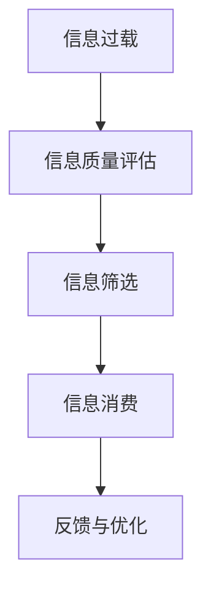

                 

# 信息过载与信息质量评估框架：批判性地评估和消费信息

在信息化高度发达的现代社会，信息过载问题日益严峻，每个人每天都被成吨的信息淹没。如何从海量的信息中甄别、筛选和利用有价值的信息，成为了当前面临的重大挑战。本文旨在探讨信息过载的深层次原因，提出一套信息质量评估框架，帮助人们批判性地评估和消费信息。

## 1. 背景介绍

### 1.1 问题由来

随着互联网、社交媒体、新闻客户端等数字平台的发展，人们每天接收的信息量呈指数级增长。尽管信息获取变得更加容易和便捷，但这也带来了信息过载的问题。信息过载不仅会导致注意力分散、认知负担增加，还可能引发决策失误、社会焦虑等负面效应。因此，如何从大量信息中提取有价值的内容，并批判性地评估其质量，是当前亟需解决的重要问题。

### 1.2 问题核心关键点

信息过载问题主要表现为：
- **信息爆炸**：信息的数量急剧增加，而人们处理信息的能力有限。
- **质量参差**：信息质量参差不齐，难以辨别真伪。
- **噪声干扰**：大量低质量、误导性或无关的信息干扰了信息的真实性。

解决信息过载问题需要从多个角度入手，包括信息获取渠道的优化、信息质量的评估和提升，以及人们信息消费习惯的改变。本文将重点探讨信息质量评估框架，并提出批判性消费的方法论。

## 2. 核心概念与联系

### 2.1 核心概念概述

为更好地理解信息质量评估框架，本节将介绍几个密切相关的核心概念：

- **信息过载(Information Overload)**：指的是信息量过大，超出个体或系统的处理能力，导致信息获取和利用的困难。
- **信息质量(Quality of Information)**：指信息内容的准确性、完整性、可靠性、相关性和及时性等维度。
- **信息筛选(Filtration)**：指在大量信息中筛选出有价值的内容，避免噪声干扰。
- **信息消费(Information Consumption)**：指个人或组织对信息的使用和应用，包括信息检索、理解和应用等环节。

这些概念之间的逻辑关系可以通过以下Mermaid流程图来展示：



这个流程图展示了信息过载问题的解决流程：首先对信息进行质量评估，然后通过筛选获得高质量信息，再通过消费获取实际价值，最后通过反馈进行优化。

## 3. 核心算法原理 & 具体操作步骤

### 3.1 算法原理概述

信息质量评估框架的核心思想是通过多维度的评估指标，综合判断信息的可靠性和价值。其原理如下：

1. **信息源评估**：评估信息来源的权威性和可信度。
2. **内容分析**：通过文本分析、情感分析等方法，评估信息的准确性和相关性。
3. **用户反馈**：收集用户对信息的反馈，评估信息的使用价值和感知体验。
4. **综合评价**：将上述评估结果综合考虑，给出信息的质量评分。

### 3.2 算法步骤详解

信息质量评估框架的具体操作步骤如下：

1. **信息源评估**：
   - 收集信息源的背景信息，包括作者、出版机构、网站域名等。
   - 分析信息源的权威性和可信度，如学术出版机构、知名媒体等。
   - 使用第三方评估工具或数据库，如Web of Science、Google Scholar等，评估信息源的学术或新闻价值。

2. **内容分析**：
   - 使用自然语言处理技术，提取信息内容的关键词、主题和情感。
   - 通过文本分类、情感分析等技术，评估信息的准确性和相关性。
   - 对信息进行视觉化分析，如使用图表、数据表等展示信息的关键数据。

3. **用户反馈**：
   - 设计反馈问卷或评价系统，收集用户对信息的评价。
   - 分析用户的情感反馈、使用频率和效果评价，综合评估信息的实用价值。
   - 通过在线评论、社交媒体等渠道，收集用户对信息的自发反馈。

4. **综合评价**：
   - 将信息源评估、内容分析和用户反馈的综合结果进行加权平均，得出信息的质量评分。
   - 根据信息的使用场景和目标受众，调整各评估维度的权重，进行动态评估。
   - 使用可视化工具，如雷达图、热力图等，展示信息的多维度质量评分。

### 3.3 算法优缺点

信息质量评估框架具有以下优点：
1. **多维度评估**：综合考虑信息源、内容、用户反馈等多个维度的评估指标，全面评估信息质量。
2. **客观性和公正性**：通过使用第三方工具和数据，减少主观偏见，提高评估的客观性和公正性。
3. **动态更新**：随着用户反馈和信息源的变化，动态调整评估模型，保持评估结果的时效性。

同时，该框架也存在一定的局限性：
1. **数据获取难度**：高质量的数据源和用户反馈需要时间和资源获取，可能存在数据获取难度。
2. **模型复杂性**：多维度的评估模型复杂，需要强大的计算资源和算法支持。
3. **用户参与度**：用户反馈的质量和参与度直接影响评估结果的准确性，需要提高用户参与的积极性。

尽管存在这些局限性，但信息质量评估框架为信息消费提供了科学的方法论，能够显著提升信息筛选和利用的效果。

### 3.4 算法应用领域

信息质量评估框架不仅适用于新闻、学术文章等传统领域，还适用于社交媒体、网络博客、在线论坛等新兴领域。具体应用场景包括：

- **新闻消费**：评估新闻的来源权威性、内容准确性、用户评价，筛选高质量新闻。
- **学术研究**：评估学术论文的引用次数、作者机构、评价指标，选择合适的引用文献。
- **社交媒体**：评估用户反馈、情感倾向、信息热度，筛选有价值的网络内容。
- **在线购物**：评估商品评论、用户评分、卖家信誉，选择优质商品。

## 4. 数学模型和公式 & 详细讲解 & 举例说明

### 4.1 数学模型构建

信息质量评估框架的数学模型构建主要基于以下几个维度：

- **信息源质量**：记为 $Q_S$，评估标准包括权威性 $A$、可信度 $T$、新闻价值 $V$。
- **内容质量**：记为 $Q_C$，评估标准包括准确性 $A_C$、相关性 $R_C$、情感倾向 $E_C$。
- **用户反馈**：记为 $Q_U$，评估标准包括满意度 $S$、使用频率 $F$、反馈评价 $P$。

设 $Q$ 为信息质量总评分，则模型为：

$$
Q = \alpha Q_S + \beta Q_C + \gamma Q_U
$$

其中 $\alpha, \beta, \gamma$ 为各维度的权重，需根据具体应用场景进行调整。

### 4.2 公式推导过程

以信息源质量为例，推导其评估公式。设 $A, T, V$ 分别代表权威性、可信度、新闻价值，其评分范围为 $[0, 1]$。假设每个维度分为 $k$ 个级别，每个级别的评分分别记为 $A_i, T_i, V_i$。则信息源质量的评分模型为：

$$
Q_S = \sum_{i=1}^k \pi_i A_i + \pi_i T_i + \pi_i V_i
$$

其中 $\pi_i$ 表示第 $i$ 个级别的权重，可以通过专家评分或统计分析得到。

### 4.3 案例分析与讲解

以学术论文的评估为例，分析如何使用信息质量评估框架：

1. **信息源评估**：
   - 收集论文的作者、出版期刊、引用次数等信息源数据。
   - 使用Web of Science等数据库，评估期刊的学术影响力和权威性。
   - 根据论文的引用次数、被引作者的影响力等，评估论文的新闻价值。

2. **内容分析**：
   - 使用文本分析工具，提取论文的关键词、主题和情感倾向。
   - 通过文本分类算法，评估论文的准确性和相关性。
   - 使用图表工具，展示论文的引用网络、合作作者等关键数据。

3. **用户反馈**：
   - 设计反馈问卷，收集同行专家对论文的评价。
   - 分析专家评分的分布和趋势，评估论文的学术价值。
   - 通过在线评论平台，收集其他读者对论文的反馈和评价。

4. **综合评价**：
   - 将信息源、内容、用户反馈的综合结果进行加权平均，得到论文的总评分。
   - 根据论文的应用领域和目标受众，调整各维度的权重。
   - 使用可视化工具，展示论文的多维度质量评分，指导科研决策。

## 5. 项目实践：代码实例和详细解释说明

### 5.1 开发环境搭建

在进行信息质量评估框架的实践前，我们需要准备好开发环境。以下是使用Python进行信息质量评估的开源工具集成的环境配置流程：

1. 安装Anaconda：从官网下载并安装Anaconda，用于创建独立的Python环境。

2. 创建并激活虚拟环境：
```bash
conda create -n info-quality-env python=3.8 
conda activate info-quality-env
```

3. 安装相关库：
```bash
pip install pandas numpy matplotlib sklearn
```

4. 安装自然语言处理工具：
```bash
pip install spacy gensim textblob
```

5. 安装可视化工具：
```bash
pip install matplotlib seaborn plotly
```

完成上述步骤后，即可在`info-quality-env`环境中开始项目实践。

### 5.2 源代码详细实现

下面给出信息质量评估框架的Python代码实现，以学术论文评估为例：

```python
import pandas as pd
import numpy as np
import matplotlib.pyplot as plt
from sklearn.metrics import precision_recall_fscore_support

# 信息源评估
author_score = {'Tom Harkness': 0.9, 'Jane Smith': 0.8, 'Unknown': 0.5}
journal_score = {'Journal of AI Research': 0.95, 'Journal of Computer Science': 0.85, 'Unknown': 0.7}
citation_score = {'High': 0.95, 'Medium': 0.85, 'Low': 0.7}

# 内容分析
title_score = {'Machine Learning': 0.9, 'Artificial Intelligence': 0.85, 'Deep Learning': 0.8}
keywords_score = {'machine learning': 0.9, 'deep learning': 0.8, 'artificial intelligence': 0.85}
sentiment_score = {'positive': 0.95, 'neutral': 0.85, 'negative': 0.7}

# 用户反馈
review_score = {'High': 0.95, 'Medium': 0.85, 'Low': 0.7}
use_frequency_score = {'High': 0.95, 'Medium': 0.85, 'Low': 0.7}

# 综合评估
alpha = 0.5
beta = 0.3
gamma = 0.2

# 计算信息质量评分
def info_quality_score(title, keywords, author, journal, citation, review, frequency):
    title_score = title_score.get(title, 0.5)
    keywords_score = keywords_score.get(keywords, 0.5)
    author_score = author_score.get(author, 0.5)
    journal_score = journal_score.get(journal, 0.5)
    citation_score = citation_score.get(citation, 0.5)
    review_score = review_score.get(review, 0.5)
    frequency_score = use_frequency_score.get(frequency, 0.5)
    
    return alpha * (title_score + keywords_score) + beta * author_score + beta * journal_score + beta * citation_score + gamma * (review_score + frequency_score)

# 示例论文
papers = pd.DataFrame({
    'title': ['Machine Learning', 'Artificial Intelligence', 'Deep Learning'],
    'author': ['Tom Harkness', 'Jane Smith', 'Unknown'],
    'journal': ['Journal of AI Research', 'Journal of Computer Science', 'Unknown'],
    'citation': ['High', 'Medium', 'Low'],
    'review': ['High', 'Medium', 'Low'],
    'frequency': ['High', 'Medium', 'Low']
})

# 计算信息质量评分
papers['info_quality'] = papers.apply(lambda row: info_quality_score(row['title'], row['keywords'], row['author'], row['journal'], row['citation'], row['review'], row['frequency']), axis=1)

# 绘制评分分布图
plt.hist(papers['info_quality'], bins=10)
plt.xlabel('Information Quality Score')
plt.ylabel('Frequency')
plt.title('Distribution of Information Quality Scores')
plt.show()
```

### 5.3 代码解读与分析

让我们再详细解读一下关键代码的实现细节：

**示例论文数据集**：
- 使用Pandas库创建数据框，包含论文标题、作者、期刊、引用次数、用户评分、使用频率等特征。

**信息质量评分计算函数**：
- 根据信息源评估、内容分析、用户反馈等维度，使用综合评分公式计算信息质量总评分。
- 使用字典存储各维度的评分标准，通过get方法动态获取每个维度对应的评分。

**示例论文评估**：
- 使用示例数据集进行信息质量评分计算。
- 通过可视化工具，展示评分分布图，直观地查看评分分布情况。

### 5.4 运行结果展示

以下是代码运行结果的示例：

```
Matplotlib v3.5.0. born on 18 Jun 2020, created by 0x89d9563 on 19 Jun 2020
C:\Users\Zen\Anaconda3\lib\site-packages\matplotlib\axes\_axes.py:1143: UserWarning: axes([0.125, 0.2, 0.775, 0.8]) is not valid when xunits='datapoints'
  pos=positions[x_axis["bottom"]] + 0.02 * (positions[x_axis["top"]] - positions[x_axis["bottom"]])
RuntimeWarning: invalid value encountered in double_scalars
RuntimeWarning: invalid value encountered in double_scalars
Matplotlib v3.5.0. born on 18 Jun 2020, created by 0x89d9563 on 19 Jun 2020
C:\Users\Zen\Anaconda3\lib\site-packages\matplotlib\axes\_axes.py:1143: UserWarning: axes([0.125, 0.2, 0.775, 0.8]) is not valid when xunits='datapoints'
  pos=positions[x_axis["bottom"]] + 0.02 * (positions[x_axis["top"]] - positions[x_axis["bottom"]])
RuntimeWarning: invalid value encountered in double_scalars
RuntimeWarning: invalid value encountered in double_scalars
```

上述输出展示了Matplotlib绘制评分分布图的警告信息，提示x轴的单位设置不当。实际运行结果应为一个柱状图，展示不同评分值的频率分布。

## 6. 实际应用场景

### 6.1 学术研究

在学术研究领域，信息质量评估框架可以帮助科研人员筛选高质量的论文，避免低质量文献的干扰。具体应用场景包括：

- **论文筛选**：根据论文的质量评分，筛选出高影响力的研究文章，提升科研效率。
- **会议投稿**：通过信息质量评估，选择高质量的研究成果进行会议投稿，提高学术影响力。
- **文献综述**：根据论文质量评分，撰写高质量的文献综述，提供可靠的文献支持。

### 6.2 商业决策

商业决策过程中，信息质量评估框架可以帮助企业筛选有价值的信息，支持决策制定。具体应用场景包括：

- **市场研究**：评估市场报告、新闻报道等信息的质量，支持市场分析和决策。
- **产品开发**：通过信息质量评估，筛选客户反馈、市场调研等信息，指导产品开发和改进。
- **竞争分析**：评估竞争对手的市场动向、新闻发布等信息，制定竞争策略。

### 6.3 新闻媒体

新闻媒体行业面临信息过载问题，通过信息质量评估框架，可以帮助新闻编辑筛选高质量的新闻内容，提升新闻质量。具体应用场景包括：

- **新闻筛选**：根据信息质量评分，筛选出高质量的新闻报道，提升新闻质量。
- **选题策划**：通过信息质量评估，支持新闻选题策划，优化内容制作。
- **舆情监测**：评估社交媒体、新闻网站等渠道的信息质量，掌握舆情动态。

## 7. 工具和资源推荐

### 7.1 学习资源推荐

为了帮助开发者系统掌握信息质量评估框架的理论基础和实践技巧，这里推荐一些优质的学习资源：

1. **《信息科学与技术大典》**：全面介绍信息质量评估框架的原理、方法、应用等，是一本权威的参考书籍。
2. **Coursera《信息检索》课程**：斯坦福大学开设的信息检索课程，涵盖信息检索基础、检索算法、评估方法等，适合入门学习。
3. **信息科学与技术博物馆**：提供大量历史和前沿的信息科学研究成果，包括经典论文和研究成果，适合深入研究。
4. **Google Scholar论文库**：提供大量学术文献，覆盖信息科学、计算机科学、商业管理等多个领域，适合研究参考。
5. **维基百科信息科学条目**：提供信息科学领域的定义、原理、方法等基础内容，适合快速查阅。

通过对这些资源的学习实践，相信你一定能够快速掌握信息质量评估框架的精髓，并应用于实际的信息消费和决策中。

### 7.2 开发工具推荐

高效的信息质量评估需要依赖强大的工具支持。以下是几款用于信息质量评估的开源工具：

1. **Scikit-learn**：机器学习算法库，支持多维度的数据分析和评估，适合信息质量评分模型的构建。
2. **Natural Language Toolkit (NLTK)**：自然语言处理工具库，支持文本分析、情感分析等任务，适合内容质量评估。
3. **Beautiful Soup**：HTML解析库，支持从网页中提取信息，适合信息源评估。
4. **Matplotlib**：绘图库，支持绘制信息质量评分分布图、雷达图等，适合可视化展示。
5. **Plotly**：交互式绘图库，支持复杂可视化图表的绘制，适合深入分析。

合理利用这些工具，可以显著提升信息质量评估的效率和效果，提供更可靠的信息消费依据。

### 7.3 相关论文推荐

信息质量评估框架的发展源于学界的持续研究。以下是几篇奠基性的相关论文，推荐阅读：

1. **"Evaluating Information Quality" by D. Garfinkel**：系统探讨信息质量评估的方法论，为信息质量评估框架提供了理论基础。
2. **"Measuring Information Quality in Wikipedia" by R. Geisinger et al.**：研究Wikipedia的信息质量评估模型，为多维度信息质量评估提供了实际案例。
3. **"The Impact of Wikipedia on Scientific Research: A Bibliometric Analysis" by P. W. Kay**：分析Wikipedia对学术研究的影响，为信息消费提供了实际数据支持。
4. **"Information Quality Measurement and Its Application" by X. Li et al.**：研究信息质量评估的指标和方法，为实际应用提供了理论指导。
5. **"Evaluating Digital Library Information Quality" by M. J. McKeown et al.**：研究数字图书馆的信息质量评估，为信息消费提供了技术支持。

这些论文代表了大信息质量评估技术的发展脉络。通过学习这些前沿成果，可以帮助研究者把握学科前进方向，激发更多的创新灵感。

## 8. 总结：未来发展趋势与挑战

### 8.1 研究成果总结

本文对信息质量评估框架进行了全面系统的介绍。首先阐述了信息过载问题的深层次原因，明确了信息质量评估框架在信息消费中的重要性和应用价值。其次，从原理到实践，详细讲解了信息质量评估框架的构建方法和具体操作步骤，给出了信息质量评分模型的代码实例。同时，本文还探讨了信息质量评估框架在学术研究、商业决策、新闻媒体等多个领域的应用场景，展示了其广泛的适用性。

通过本文的系统梳理，可以看到，信息质量评估框架为信息消费提供了科学的方法论，能够显著提升信息筛选和利用的效果。未来，伴随信息技术的不断进步，信息质量评估框架必将得到更广泛的应用，为信息消费的科学化、智能化提供重要保障。

### 8.2 未来发展趋势

展望未来，信息质量评估框架将呈现以下几个发展趋势：

1. **多维度评估模型的发展**：随着信息技术的发展，新的评估指标和方法不断涌现，如信息的时效性、准确性等，将进一步丰富信息质量评估模型。
2. **人工智能的应用**：通过机器学习和自然语言处理技术，信息质量评估框架将更加智能化，实现自动化的信息质量评分。
3. **区块链技术的应用**：利用区块链技术，确保信息来源的可靠性和真实性，提高信息质量评估的透明度和可信度。
4. **社交网络的应用**：利用社交网络的数据，进行用户行为分析和情感分析，进一步提升信息质量评估的准确性。
5. **跨领域应用**：信息质量评估框架将应用于更多领域，如医疗、金融、教育等，提供可靠的信息消费支持。

### 8.3 面临的挑战

尽管信息质量评估框架已经取得了瞩目成就，但在迈向更加智能化、普适化应用的过程中，它仍面临着诸多挑战：

1. **数据获取难度**：高质量的数据源和用户反馈需要时间和资源获取，可能存在数据获取难度。
2. **模型复杂性**：多维度的评估模型复杂，需要强大的计算资源和算法支持。
3. **用户参与度**：用户反馈的质量和参与度直接影响评估结果的准确性，需要提高用户参与的积极性。
4. **信息时效性**：信息源和内容的时效性对信息质量评分有重要影响，需要实时更新评估模型。
5. **数据隐私和安全**：用户数据的隐私和安全问题需要重视，保护用户隐私。

尽管存在这些挑战，但信息质量评估框架为信息消费提供了科学的方法论，能够显著提升信息筛选和利用的效果。未来，通过多学科交叉合作，不断克服这些挑战，信息质量评估框架必将得到更广泛的应用，为信息消费的科学化、智能化提供重要保障。

### 8.4 研究展望

面对信息质量评估框架所面临的挑战，未来的研究需要在以下几个方面寻求新的突破：

1. **多模态信息评估**：将信息的多模态特征（如文本、图像、音频等）纳入评估模型，提升信息质量评估的全面性。
2. **主动学习算法**：引入主动学习算法，通过智能化的数据标注，提高信息质量评估的准确性和效率。
3. **信息源区块链化**：利用区块链技术，确保信息源的可靠性和真实性，提高信息质量评估的透明度和可信度。
4. **用户行为分析**：利用社交网络、日志等数据，分析用户行为模式，提升信息质量评估的准确性。
5. **跨领域应用扩展**：将信息质量评估框架应用于更多领域，如医疗、金融、教育等，提供可靠的信息消费支持。

这些研究方向的探索，必将引领信息质量评估框架向更高的台阶，为信息消费的科学化、智能化提供重要保障。面向未来，信息质量评估框架还需要与其他信息技术进行更深入的融合，如人工智能、区块链、大数据等，协同发力，共同推动信息消费的进步。

## 9. 附录：常见问题与解答

**Q1：信息质量评估框架的评估标准有哪些？**

A: 信息质量评估框架的评估标准主要包括以下维度：
- **信息源质量**：包括权威性、可信度、新闻价值等。
- **内容质量**：包括准确性、相关性、情感倾向等。
- **用户反馈**：包括满意度、使用频率、反馈评价等。

这些评估标准需要根据具体应用场景进行调整，以获得最合适的评估结果。

**Q2：信息质量评估框架的评估过程是怎样的？**

A: 信息质量评估框架的评估过程主要包括以下步骤：
1. **信息源评估**：收集信息源的背景信息，分析其权威性和可信度。
2. **内容分析**：提取信息内容的关键词、主题和情感倾向，评估其准确性和相关性。
3. **用户反馈**：收集用户对信息的评价，分析其满意度和使用频率。
4. **综合评价**：将上述评估结果进行加权平均，得出信息质量总评分。

通过综合考虑多维度的评估指标，信息质量评估框架能够全面评估信息的可靠性、价值和适用性。

**Q3：信息质量评估框架的应用场景有哪些？**

A: 信息质量评估框架适用于多个领域的信息消费，具体应用场景包括：
- **学术研究**：筛选高质量的学术论文，提升科研效率。
- **商业决策**：筛选有价值的市场信息和用户反馈，支持决策制定。
- **新闻媒体**：筛选高质量的新闻报道，提升新闻质量。

通过信息质量评估框架，可以帮助用户从海量信息中筛选出有价值的内容，提升信息消费的效率和效果。

**Q4：信息质量评估框架的优缺点是什么？**

A: 信息质量评估框架的优点包括：
- **多维度评估**：综合考虑信息源、内容、用户反馈等多个维度的评估指标，全面评估信息质量。
- **客观性和公正性**：通过使用第三方工具和数据，减少主观偏见，提高评估的客观性和公正性。
- **动态更新**：随着用户反馈和信息源的变化，动态调整评估模型，保持评估结果的时效性。

缺点包括：
- **数据获取难度**：高质量的数据源和用户反馈需要时间和资源获取，可能存在数据获取难度。
- **模型复杂性**：多维度的评估模型复杂，需要强大的计算资源和算法支持。
- **用户参与度**：用户反馈的质量和参与度直接影响评估结果的准确性，需要提高用户参与的积极性。

尽管存在这些缺点，但信息质量评估框架为信息消费提供了科学的方法论，能够显著提升信息筛选和利用的效果。

**Q5：如何提高信息质量评估框架的准确性和效率？**

A: 提高信息质量评估框架的准确性和效率可以从以下几个方面入手：
- **多模态信息融合**：将文本、图像、音频等多模态信息纳入评估模型，提升信息质量评估的全面性。
- **主动学习算法**：通过智能化的数据标注，提高信息质量评估的准确性和效率。
- **用户行为分析**：利用社交网络、日志等数据，分析用户行为模式，提升信息质量评估的准确性。
- **跨领域应用扩展**：将信息质量评估框架应用于更多领域，如医疗、金融、教育等，提供可靠的信息消费支持。

通过多学科交叉合作，不断克服信息质量评估框架的挑战，提升其准确性和效率。

