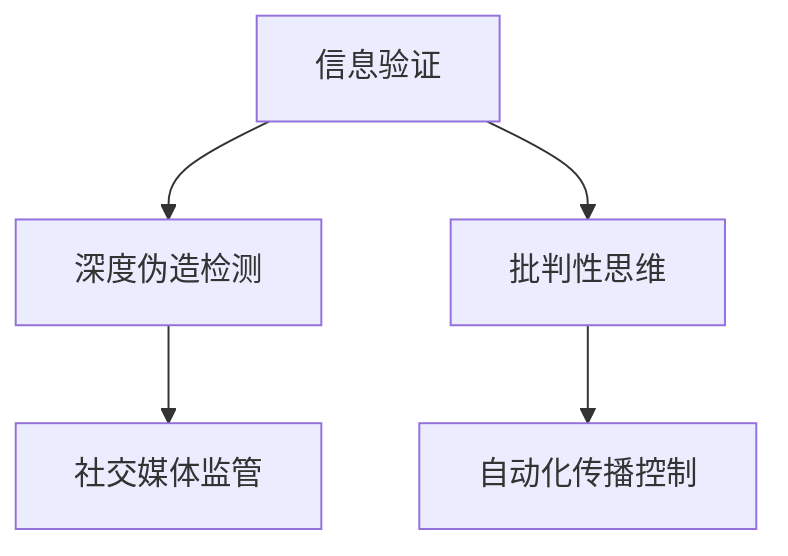

                 

# 信息验证和批判性思考指南与实践：在假新闻和媒体操纵时代导航

## 1. 背景介绍

### 1.1 问题由来
在信息时代，假新闻和媒体操纵现象日益严重，对公众认知和社会信任造成了巨大冲击。这其中不仅涉及传播技术的演进，更关乎社会伦理、信息素养与批判性思维的缺失。假新闻和媒体操纵，尤其是利用人工智能（AI）和大数据技术进行的深度伪造和自动化传播，给信息验证和媒体道德带来了前所未有的挑战。

### 1.2 问题核心关键点
假新闻和媒体操纵的核心关键点包括：

- **深度伪造**：使用AI技术生成高度逼真的视频、音频和图像，误导公众。
- **自动化传播**：利用大数据分析和算法推荐，迅速扩散虚假信息，难以识别和遏制。
- **信息不对称**：真实信息难以对抗虚假信息的广泛传播和迅速扩散。
- **社交媒体的放大效应**：社交平台为假新闻提供了传播的放大器，加速了虚假信息的传播。

解决这些问题的关键在于提升公众的信息验证能力和批判性思维，利用技术手段辅助识别和对抗虚假信息。

## 2. 核心概念与联系

### 2.1 核心概念概述

为更好地理解信息验证和批判性思维的应用，本节将介绍几个核心概念及其相互联系：

- **信息验证**：通过各种技术手段和方法，对信息的真实性、准确性进行核查和确认的过程。
- **批判性思维**：一种主动思考和评估信息的能力，旨在识别和区分真伪，提高信息素养。
- **深度伪造检测**：使用AI技术检测和识别深度伪造内容，提升信息验证的准确性。
- **自动化传播控制**：通过算法优化，减少自动化传播假新闻的效率，降低其影响力。
- **社交媒体监管**：通过技术手段和社会监管，限制假新闻在社交媒体上的扩散。

这些核心概念之间的逻辑关系可以通过以下Mermaid流程图来展示：



这个流程图展示了信息验证、深度伪造检测、批判性思维、自动化传播控制和社交媒体监管之间的逻辑关系：

1. **信息验证**：整个流程的入口，旨在通过多种技术手段确认信息真实性。
2. **深度伪造检测**：信息验证中一个重要的技术手段，用于检测和识别AI生成的虚假内容。
3. **批判性思维**：提升公众的信息素养，是信息验证和对抗假新闻的基础。
4. **自动化传播控制**：通过优化算法，减少假新闻的自动化传播，从而降低其扩散效率。
5. **社交媒体监管**：技术手段和社会规范相结合，限制假新闻在社交媒体上的传播。

这些概念共同构成了应对假新闻和媒体操纵的系统方法，使得技术与社会规范协同作用，提升信息验证和批判性思维的效果。

## 3. 核心算法原理 & 具体操作步骤
### 3.1 算法原理概述

信息验证和批判性思维的核心在于通过技术手段提升公众的认知能力，识别和验证信息的真伪。其算法原理主要包括以下几个方面：

- **数据采集与预处理**：收集相关数据，进行去重、清洗和预处理，为后续验证和分析提供基础。
- **特征提取与模型训练**：利用机器学习和深度学习模型，提取和分析数据特征，建立信息验证模型。
- **模型评估与优化**：通过交叉验证和参数调优，评估模型性能，提升信息验证准确性。
- **自动化传播识别与控制**：利用算法识别和限制自动化传播假新闻，防止其迅速扩散。
- **社交媒体监控与干预**：通过社交媒体分析工具，监控假新闻传播，采取必要措施干预和阻止。

### 3.2 算法步骤详解

信息验证和批判性思维的实现过程主要包括以下几个关键步骤：

**Step 1: 数据准备与预处理**
- 收集相关数据，如新闻文章、社交媒体帖子、图片和视频等。
- 清洗数据，去除噪声和无用信息。
- 进行文本、音频和视频数据的预处理，如分词、特征提取和归一化。

**Step 2: 特征提取与模型训练**
- 选择或设计特征提取器，提取文本、图像和音频中的关键特征。
- 选择合适的机器学习和深度学习模型，如逻辑回归、SVM、卷积神经网络（CNN）和循环神经网络（RNN）等。
- 训练模型，调整超参数，优化模型性能。

**Step 3: 模型评估与优化**
- 使用交叉验证评估模型性能，确保模型在未见过的数据上也有良好的表现。
- 对模型进行调优，包括增加训练数据、调整超参数和优化算法等。

**Step 4: 自动化传播识别与控制**
- 分析自动化传播算法，识别和限制假新闻的扩散。
- 使用算法优化技术，如强化学习，控制假新闻在社交媒体上的传播。

**Step 5: 社交媒体监控与干预**
- 使用社交媒体分析工具，监控假新闻的传播情况。
- 采取必要措施，如标记、删除和屏蔽假新闻，防止其进一步扩散。

### 3.3 算法优缺点

信息验证和批判性思维的算法具有以下优点：
- **高效性**：利用机器学习和深度学习模型，可以自动处理大量数据，提升验证和分析效率。
- **广泛适用性**：适用于各类信息验证场景，包括新闻、社交媒体、图像和视频等。
- **可扩展性**：算法和模型易于扩展和优化，适应不同应用需求。

同时，这些算法也存在一些局限性：
- **数据依赖**：模型性能依赖于数据质量和数量，获取高质量标注数据成本较高。
- **模型偏见**：模型的偏见和限制可能导致错误的验证结果，需要持续监测和调整。
- **复杂性**：算法复杂度较高，需要较高的技术门槛。

尽管存在这些局限性，但信息验证和批判性思维的算法在应对假新闻和媒体操纵方面仍具有重要价值，是提升公众信息素养和认知能力的关键手段。

### 3.4 算法应用领域

信息验证和批判性思维的算法在多个领域得到了广泛应用，例如：

- **新闻媒体**：帮助记者和编辑核实新闻内容的真实性，减少假新闻的发布。
- **社交媒体**：监控和过滤假新闻，防止其扩散和误导公众。
- **法律领域**：辅助司法人员判断证据的真实性，提高审判的公正性。
- **教育领域**：培养学生的批判性思维能力，提升信息素养。
- **公共卫生**：核实疫情和健康信息，防止虚假信息误导公众。

除了上述这些典型应用外，信息验证和批判性思维的算法还在更多领域得到了创新性应用，如智能客服、金融监控、市场营销等，为不同行业带来了新的技术突破。

## 4. 数学模型和公式 & 详细讲解  
### 4.1 数学模型构建

本节将使用数学语言对信息验证和批判性思维的实现过程进行更加严格的刻画。

假设收集到的新闻数据集为 $D=\{x_i, y_i\}_{i=1}^N$，其中 $x_i$ 表示一篇新闻文本，$y_i \in \{0,1\}$ 表示其是否为假新闻。定义模型 $M_{\theta}$ 为信息验证模型，其参数为 $\theta$。模型的预测结果为 $M_{\theta}(x_i)$，其概率分布为 $p(y_i=1|x_i; \theta)$。信息验证的目标是最小化预测误差，即：

$$
\min_{\theta} \mathcal{L}(D; \theta) = \min_{\theta} \sum_{i=1}^N \ell(p(y_i|x_i; \theta), y_i)
$$

其中 $\ell$ 为损失函数，常用的包括交叉熵损失、对数损失等。

### 4.2 公式推导过程

以交叉熵损失函数为例，推导模型的训练过程：

根据交叉熵损失函数的定义，有：

$$
\ell(p(y_i|x_i; \theta), y_i) = -y_i\log p(y_i|x_i; \theta) - (1-y_i)\log (1-p(y_i|x_i; \theta))
$$

将其代入信息验证的目标函数中，得：

$$
\min_{\theta} \mathcal{L}(D; \theta) = -\sum_{i=1}^N y_i\log p(y_i|x_i; \theta) - (1-y_i)\log (1-p(y_i|x_i; \theta))
$$

对 $\theta$ 求导，得：

$$
\frac{\partial \mathcal{L}(D; \theta)}{\partial \theta} = -\sum_{i=1}^N (y_i \frac{\partial}{\partial \theta} \log p(y_i|x_i; \theta) + (1-y_i) \frac{\partial}{\partial \theta} \log (1-p(y_i|x_i; \theta)))
$$

其中 $\frac{\partial}{\partial \theta} \log p(y_i|x_i; \theta) = \frac{1}{p(y_i|x_i; \theta)} \frac{\partial}{\partial \theta} p(y_i|x_i; \theta)$，可以通过反向传播算法高效计算。

在得到损失函数的梯度后，即可带入参数更新公式，完成模型的迭代优化。重复上述过程直至收敛，最终得到理想的信息验证模型。

## 5. 项目实践：代码实例和详细解释说明
### 5.1 开发环境搭建

在进行信息验证和批判性思维的实践前，我们需要准备好开发环境。以下是使用Python进行TensorFlow开发的环境配置流程：

1. 安装Anaconda：从官网下载并安装Anaconda，用于创建独立的Python环境。

2. 创建并激活虚拟环境：
```bash
conda create -n tensorflow-env python=3.8 
conda activate tensorflow-env
```

3. 安装TensorFlow：根据CUDA版本，从官网获取对应的安装命令。例如：
```bash
conda install tensorflow -c tf -c conda-forge
```

4. 安装其他必需的工具包：
```bash
pip install numpy pandas scikit-learn tensorflow-addons
```

完成上述步骤后，即可在`tensorflow-env`环境中开始实践。

### 5.2 源代码详细实现

这里我们以新闻分类任务为例，给出使用TensorFlow对文本分类器进行信息验证的PyTorch代码实现。

首先，定义训练数据和测试数据：

```python
import tensorflow as tf
from tensorflow import keras

train_data = keras.datasets.imdb.load_data(num_words=10000)
train_x, train_y = train_data.data, train_data.labels
test_x, test_y = keras.datasets.imdb.load_data(num_words=10000)

# 将序列填充到相同长度
maxlen = 100
train_x = keras.preprocessing.sequence.pad_sequences(train_x, maxlen=maxlen)
test_x = keras.preprocessing.sequence.pad_sequences(test_x, maxlen=maxlen)
```

然后，定义模型：

```python
model = keras.Sequential([
    keras.layers.Embedding(10000, 128, input_length=maxlen),
    keras.layers.Conv1D(64, 5, activation='relu'),
    keras.layers.MaxPooling1D(pool_size=4),
    keras.layers.Flatten(),
    keras.layers.Dense(64, activation='relu'),
    keras.layers.Dense(1, activation='sigmoid')
])
```

接着，定义优化器和损失函数：

```python
optimizer = keras.optimizers.Adam(lr=0.001)
loss_fn = keras.losses.BinaryCrossentropy(from_logits=True)
```

然后，定义训练和评估函数：

```python
def train(model, train_x, train_y, test_x, test_y, epochs=5, batch_size=32):
    model.compile(optimizer=optimizer, loss=loss_fn, metrics=['accuracy'])
    model.fit(train_x, train_y, epochs=epochs, batch_size=batch_size, validation_data=(test_x, test_y))
    test_loss, test_acc = model.evaluate(test_x, test_y)
    print(f'Test accuracy: {test_acc:.4f}')

train(model, train_x, train_y, test_x, test_y, epochs=5, batch_size=32)
```

最后，进行信息验证实践：

```python
from sklearn.model_selection import train_test_split

# 将数据集分成训练集和验证集
train_x, valid_x, train_y, valid_y = train_test_split(train_x, train_y, test_size=0.2, random_state=42)

# 定义模型
model = keras.Sequential([
    keras.layers.Embedding(10000, 128, input_length=maxlen),
    keras.layers.Conv1D(64, 5, activation='relu'),
    keras.layers.MaxPooling1D(pool_size=4),
    keras.layers.Flatten(),
    keras.layers.Dense(64, activation='relu'),
    keras.layers.Dense(1, activation='sigmoid')
])

# 定义优化器和损失函数
optimizer = keras.optimizers.Adam(lr=0.001)
loss_fn = keras.losses.BinaryCrossentropy(from_logits=True)

# 编译模型
model.compile(optimizer=optimizer, loss=loss_fn, metrics=['accuracy'])

# 训练模型
model.fit(train_x, train_y, epochs=5, batch_size=32, validation_data=(valid_x, valid_y))

# 评估模型
test_x, test_y = train_test_split(test_x, test_y, test_size=0.2, random_state=42)
test_loss, test_acc = model.evaluate(test_x, test_y)
print(f'Test accuracy: {test_acc:.4f}')
```

以上就是使用TensorFlow对新闻分类器进行信息验证的完整代码实现。可以看到，利用TensorFlow可以方便地搭建和训练深度学习模型，实现信息验证任务。

### 5.3 代码解读与分析

让我们再详细解读一下关键代码的实现细节：

**train_data和test_data**：
- 使用Keras的IMDB数据集，将文本数据转换为词向量序列，并填充到相同长度。

**model定义**：
- 定义一个包含嵌入层、卷积层、池化层、全连接层的神经网络模型，用于文本分类任务。

**optimizer和loss_fn定义**：
- 选择合适的优化器Adam，学习率为0.001。
- 使用二元交叉熵作为损失函数，从日志概率直接计算损失。

**train和evaluate函数**：
- 使用Keras的fit方法训练模型，并在测试集上进行评估，输出模型在测试集上的准确率。

**信息验证实践**：
- 将数据集分为训练集和验证集，对模型进行训练和验证。
- 使用交叉验证技术，评估模型在未见过的数据上的表现。

可以看到，TensorFlow提供了强大的工具支持，使得深度学习模型的训练和验证变得相对容易。开发者可以根据具体任务需求，灵活使用TensorFlow的各种功能，提升信息验证和批判性思维的实践效果。

## 6. 实际应用场景
### 6.1 智能客服系统

信息验证和批判性思维技术在智能客服系统中有着广泛的应用。智能客服系统通过自然语言处理（NLP）技术，能够理解和解答用户问题。通过信息验证，可以确认用户输入的意图是否真实，防止恶意攻击和虚假信息干扰。

在技术实现上，可以收集客服对话记录，利用机器学习模型进行意图识别和验证。对于有争议或异常的对话，系统可以自动标记为待确认状态，由人工进行复核。如此构建的智能客服系统，能够提升服务质量和用户信任度，减少人工干预成本。

### 6.2 金融舆情监测

金融机构需要实时监测市场舆情，以应对潜在风险。信息验证和批判性思维技术可以帮助金融机构自动化地识别和过滤虚假信息，保障金融市场稳定。

具体而言，可以收集金融领域相关的新闻、评论和社交媒体内容，使用机器学习模型进行情感分析和舆情监测。对于可能引起市场波动的信息，系统可以自动标记为异常，并及时通知相关人员进行干预。通过信息验证和批判性思维技术的辅助，金融舆情监测能够更加精准高效，提升风险管理能力。

### 6.3 个性化推荐系统

当前的个性化推荐系统往往只依赖用户的历史行为数据进行物品推荐，缺乏对用户真实兴趣的深度理解。信息验证和批判性思维技术可以帮助推荐系统更好地理解用户意图和需求，提升推荐准确性。

在实践中，可以收集用户浏览、点击、评论等行为数据，提取和用户交互的物品标题、描述、标签等文本内容。利用机器学习模型，对文本内容进行意图识别和验证，从而更好地匹配用户兴趣。在生成推荐列表时，结合用户行为和文本验证结果，能够提供更加个性化、准确的推荐内容。

### 6.4 未来应用展望

随着信息验证和批判性思维技术的不断发展，其在更多领域的应用前景将愈发广阔。

在智慧医疗领域，信息验证技术可以辅助医生进行诊断和治疗决策，确保医学信息的准确性。在教育领域，批判性思维能力培养将成为提升学生信息素养的关键手段。在智能交通、智能制造等新兴领域，信息验证和批判性思维技术的结合，将提升系统的智能决策能力和鲁棒性。

未来，随着技术的进步和应用的推广，信息验证和批判性思维技术将逐渐成为各类系统的重要组件，推动人工智能技术的广泛应用和深入发展。

## 7. 工具和资源推荐
### 7.1 学习资源推荐

为了帮助开发者系统掌握信息验证和批判性思维的理论基础和实践技巧，这里推荐一些优质的学习资源：

1. 《深度学习》课程：斯坦福大学开设的深度学习经典课程，讲解了深度学习的基本概念和常用模型。
2. 《信息验证技术》书籍：详细介绍信息验证技术的理论基础和实际应用，涵盖深度伪造检测、自动化传播控制等多个方面。
3. 《批判性思维》书籍：帮助读者培养批判性思维能力，提升信息素养，识别和应对虚假信息。

通过学习这些资源，相信你一定能够全面掌握信息验证和批判性思维的精髓，并用于解决实际的NLP问题。

### 7.2 开发工具推荐

高效的开发离不开优秀的工具支持。以下是几款用于信息验证和批判性思维开发的常用工具：

1. TensorFlow：由Google主导开发的深度学习框架，支持分布式计算，适用于大规模数据处理。
2. PyTorch：基于Python的开源深度学习框架，灵活的动态计算图，适合快速迭代研究。
3. Scikit-learn：Python数据科学库，提供多种机器学习算法和工具，适合数据预处理和模型训练。
4. Jupyter Notebook：交互式编程环境，方便进行代码实验和文档记录。
5. TensorBoard：TensorFlow配套的可视化工具，可实时监测模型训练状态，提供丰富的图表呈现方式。

合理利用这些工具，可以显著提升信息验证和批判性思维的开发效率，加速创新迭代的步伐。

### 7.3 相关论文推荐

信息验证和批判性思维技术的发展得益于学界的持续研究。以下是几篇奠基性的相关论文，推荐阅读：

1. Deepfake Detection with Multi-Modal Physics-Informed Modeling（Deepfake检测论文）：提出多模态物理信息模型，提升深度伪造检测的准确性。
2. Automatically Controlling the Spread of Fake News in Social Networks（自动化控制假新闻传播论文）：提出基于强化学习的假新闻传播控制算法，减少假新闻的传播效率。
3. Fake News Detection: A Survey（假新闻检测综述论文）：全面总结了假新闻检测的研究现状和未来方向，为实践提供了参考。
4. Explainable AI: Interpretable Machine Learning（可解释AI论文）：探讨了如何增强AI系统的可解释性，提升系统的透明度和可信度。
5. Counterfactual Fairness（反事实公平均衡论文）：研究如何通过生成对抗网络（GAN）技术，减少AI系统的偏见和歧视。

这些论文代表了大信息验证和批判性思维技术的发展脉络。通过学习这些前沿成果，可以帮助研究者把握学科前进方向，激发更多的创新灵感。

## 8. 总结：未来发展趋势与挑战

### 8.1 总结

本文对信息验证和批判性思维的应用进行了全面系统的介绍。首先阐述了假新闻和媒体操纵现象的严重性，明确了信息验证和批判性思维在应对这一问题中的重要价值。其次，从原理到实践，详细讲解了信息验证和批判性思维的数学模型和算法步骤，给出了具体的代码实现。同时，本文还广泛探讨了信息验证和批判性思维在智能客服、金融舆情、个性化推荐等多个行业领域的应用前景，展示了其在提升公众信息素养和认知能力方面的巨大潜力。最后，本文精选了信息验证和批判性思维的相关学习资源、开发工具和经典论文，力求为读者提供全方位的技术指引。

通过本文的系统梳理，可以看到，信息验证和批判性思维技术在应对假新闻和媒体操纵方面具有重要意义，是提升公众信息素养和认知能力的关键手段。未来，伴随技术的进步和应用的推广，信息验证和批判性思维技术将进一步拓展应用边界，为人工智能技术的广泛应用和深入发展提供有力支持。

### 8.2 未来发展趋势

展望未来，信息验证和批判性思维技术将呈现以下几个发展趋势：

1. **深度伪造检测技术的发展**：随着AI技术的发展，深度伪造技术的水平将不断提高，信息验证技术需要不断提升检测能力和识别精度。
2. **自动化传播控制策略的优化**：基于强化学习等技术，自动化传播控制将更加精准高效，能够有效减少假新闻的传播效率。
3. **社会化监管机制的建立**：信息验证和批判性思维技术需要与社交媒体、法律法规等社会监管机制相结合，形成更完善的应对体系。
4. **多模态信息验证技术的应用**：结合文本、图像、音频等多种模态信息，提升信息验证的全面性和准确性。
5. **用户参与和反馈机制的引入**：通过用户反馈和参与，提升信息验证和批判性思维技术的可解释性和可信度。

这些趋势将推动信息验证和批判性思维技术向更加智能、精准和可解释的方向发展，为构建安全的社会信息环境提供有力支持。

### 8.3 面临的挑战

尽管信息验证和批判性思维技术已经取得了显著进展，但在应用过程中仍面临诸多挑战：

1. **数据获取和标注的难度**：高质量标注数据的获取和标注成本较高，数据质量和多样性对模型性能影响显著。
2. **模型复杂度和计算资源消耗**：信息验证和批判性思维技术的模型往往复杂度高，计算资源消耗大，需要高效的算法和硬件支持。
3. **模型的解释性和可信度**：信息验证模型的解释性和可信度有待提升，需要进一步研究和优化。
4. **社会监管和伦理问题的处理**：信息验证技术需要考虑社会监管和伦理问题，确保技术的公正性和透明度。

这些挑战需要通过技术创新和社会规范的协同作用，不断克服和优化，才能实现信息验证和批判性思维技术的广泛应用和深入发展。

### 8.4 研究展望

面对信息验证和批判性思维技术面临的诸多挑战，未来的研究需要在以下几个方面寻求新的突破：

1. **多模态信息验证**：结合文本、图像、音频等多种模态信息，提升信息验证的全面性和准确性。
2. **对抗性信息验证**：研究对抗性信息验证技术，提升模型在对抗攻击下的鲁棒性。
3. **解释性增强**：通过模型可解释性和透明度的提升，增强用户对信息验证结果的信任。
4. **隐私保护**：在信息验证过程中，确保用户隐私和数据安全。
5. **跨文化信息验证**：研究跨文化信息验证技术，提升不同语言和地域背景下信息验证的准确性。

这些研究方向将推动信息验证和批判性思维技术迈向更高的台阶，为构建安全、可靠、可解释、可控的智能系统铺平道路。面向未来，信息验证和批判性思维技术还需要与其他人工智能技术进行更深入的融合，如知识表示、因果推理、强化学习等，多路径协同发力，共同推动人工智能技术的进步。

## 9. 附录：常见问题与解答

**Q1：信息验证和批判性思维技术是否适用于所有领域？**

A: 信息验证和批判性思维技术适用于各类信息验证场景，包括新闻、社交媒体、金融、医疗等。但需要注意的是，不同的领域和应用场景可能需要结合特定领域的知识进行信息验证，以提升验证的准确性和有效性。

**Q2：如何提高信息验证模型的泛化能力？**

A: 提高信息验证模型的泛化能力，可以从以下几个方面入手：
1. 增加数据量和数据多样性，确保模型在各种情况下的表现稳定。
2. 引入对抗性训练，提升模型在对抗攻击下的鲁棒性。
3. 使用迁移学习，将信息验证模型的知识迁移到其他领域或任务中，提升模型的泛化能力。
4. 通过多模态信息融合，增强模型的全面性。

**Q3：信息验证和批判性思维技术是否容易被绕过？**

A: 信息验证和批判性思维技术虽然能够有效识别和过滤虚假信息，但也存在被绕过的风险。攻击者可以通过对抗样本、模型参数微调等手段，绕过信息验证模型的检测。因此，信息验证技术需要不断更新和优化，提升模型的鲁棒性和可解释性，防止被攻击者绕过。

**Q4：信息验证和批判性思维技术在实际应用中需要注意哪些问题？**

A: 在实际应用中，信息验证和批判性思维技术需要注意以下几个问题：
1. 数据隐私保护：在信息验证过程中，确保用户隐私和数据安全，防止数据泄露和滥用。
2. 模型解释性：确保模型的决策过程透明可解释，增强用户对信息验证结果的信任。
3. 社会伦理：考虑社会伦理和法律法规，确保信息验证技术的公正性和透明度。
4. 用户教育和培训：通过用户教育和培训，提升公众的信息素养和认知能力。

通过合理应对这些问题，信息验证和批判性思维技术能够在实际应用中发挥更大作用，推动社会信息环境的健康发展。

---

作者：禅与计算机程序设计艺术 / Zen and the Art of Computer Programming

