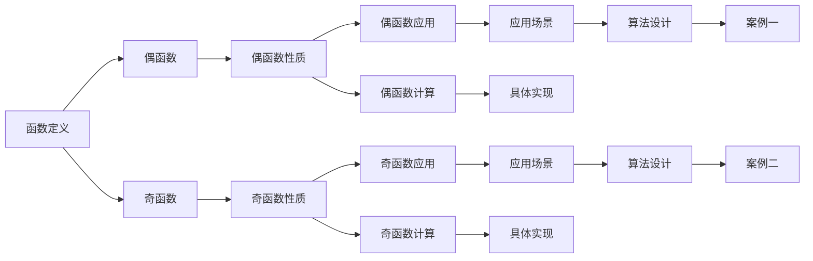

                 

# 像数学家一样思考：奇偶原理

> 关键词：奇偶性,数学思维,算法原理,奇偶性原理,偶函数,奇函数,应用场景,计算机科学

## 1. 背景介绍

### 1.1 问题由来

在计算机科学和数学中，奇偶性是一个基础且重要的概念，广泛应用在算法设计、数据结构、编码理论、信号处理等多个领域。理解奇偶性原理，不仅有助于我们更深入地理解计算机算法的本质，还能为解决实际问题提供新的思路和方法。

### 1.2 问题核心关键点

奇偶性涉及数学中函数的性质，指的是函数在其定义域内对某些运算的对称性。奇偶性原理的核心在于理解奇函数和偶函数的基本性质及其应用。本节将详细介绍奇偶性原理，并结合实际案例说明其应用，帮助读者深入理解这一重要概念。

## 2. 核心概念与联系

### 2.1 核心概念概述

奇偶性原理是数学中描述函数对称性的重要概念，其核心在于函数在其定义域内对某些运算的对称性。一个函数 $f(x)$ 被称为偶函数，如果对于定义域内的任意 $x$，都有 $f(-x) = f(x)$。而一个函数被称为奇函数，如果对于定义域内的任意 $x$，都有 $f(-x) = -f(x)$。

奇偶性原理在数学中有广泛的应用，如函数的积分、微积分、级数展开等。在计算机科学中，奇偶性原理也渗透到算法设计、数据结构、编码理论等多个领域。通过理解奇偶性原理，我们可以更深刻地理解算法的本质，发现更高效、更优雅的设计方案。

### 2.2 核心概念原理和架构的 Mermaid 流程图

以下是一个简单的Mermaid流程图，展示了奇偶性原理在算法设计中的应用：



### 2.3 核心概念联系

奇偶性原理与计算机科学中的很多概念密切相关，如递归算法、动态规划、分治算法等。理解奇偶性原理，可以帮助我们更好地理解和设计这些算法，提高算法的效率和可读性。

## 3. 核心算法原理 & 具体操作步骤

### 3.1 算法原理概述

奇偶性原理的核心在于理解偶函数和奇函数的性质，并通过这些性质设计更高效的算法。偶函数在定义域内关于原点对称，奇函数在其定义域内关于原点中心对称。这一对称性可以用来优化算法的复杂度，减少不必要的计算，提高算法的效率。

### 3.2 算法步骤详解

1. **理解函数奇偶性**：首先，我们需要理解函数的奇偶性。对于任意函数 $f(x)$，我们可以通过代入 $-x$ 来验证其是否为奇函数或偶函数。
2. **应用偶函数性质**：在算法设计中，利用偶函数的对称性，我们可以减少一半的计算量。例如，对于偶函数 $f(x)$，我们有 $f(x) = f(-x)$。因此，我们只需要计算 $x$ 对应的函数值，而不需要计算 $-x$ 对应的函数值。
3. **应用奇函数性质**：同样地，利用奇函数的对称性，我们可以将计算量减半。例如，对于奇函数 $f(x)$，我们有 $f(x) = -f(-x)$。因此，我们只需要计算 $x$ 对应的函数值，而不需要计算 $-x$ 对应的函数值。

### 3.3 算法优缺点

**优点**：
- **高效性**：利用偶函数和奇函数的对称性，可以显著减少计算量，提高算法效率。
- **通用性**：奇偶性原理不仅适用于数学函数，还可以应用于计算机科学中的各种算法设计。

**缺点**：
- **限制性**：并非所有问题都可以应用奇偶性原理，需要根据具体问题进行分析。
- **复杂性**：理解和应用奇偶性原理需要一定的数学基础，对于初学者可能存在一定难度。

### 3.4 算法应用领域

奇偶性原理在计算机科学中有广泛的应用，包括但不限于以下几个领域：

- **算法设计**：在算法设计中，利用偶函数和奇函数的对称性，可以减少计算量，提高算法效率。
- **数据结构**：在数据结构中，利用奇偶性原理可以设计更高效的数据结构，如哈希表、二叉搜索树等。
- **编码理论**：在编码理论中，利用奇偶性原理可以设计更优的编码方案，提高数据的压缩率和纠错能力。
- **信号处理**：在信号处理中，利用奇偶性原理可以设计更高效的滤波器，提高信号处理的效率和精度。

## 4. 数学模型和公式 & 详细讲解 & 举例说明

### 4.1 数学模型构建

奇偶性原理的数学模型建立在函数的定义上，对于任意函数 $f(x)$，其奇偶性可以通过验证 $f(-x) = f(x)$（偶函数）或 $f(-x) = -f(x)$（奇函数）来确定。

### 4.2 公式推导过程

假设有一个函数 $f(x)$，我们需要验证其奇偶性。首先，代入 $-x$ 得到 $f(-x)$：

$$ f(-x) = f(-x) $$

如果 $f(-x) = f(x)$，则 $f(x)$ 为偶函数。

$$ f(-x) = -f(x) $$

如果 $f(-x) = -f(x)$，则 $f(x)$ 为奇函数。

### 4.3 案例分析与讲解

**案例一：偶函数**

假设我们有一个函数 $f(x) = x^2$。首先，计算 $f(-x)$：

$$ f(-x) = (-x)^2 = x^2 = f(x) $$

因此，$f(x) = x^2$ 是一个偶函数。利用偶函数的性质，我们可以减少一半的计算量，例如，在计算 $f(3)$ 和 $f(-3)$ 时，我们只需要计算 $f(3)$，而 $f(-3) = f(3)$。

**案例二：奇函数**

假设我们有一个函数 $f(x) = x^3$。首先，计算 $f(-x)$：

$$ f(-x) = (-x)^3 = -x^3 = -f(x) $$

因此，$f(x) = x^3$ 是一个奇函数。利用奇函数的性质，我们可以减少一半的计算量，例如，在计算 $f(3)$ 和 $f(-3)$ 时，我们只需要计算 $f(3)$，而 $f(-3) = -f(3)$。

## 5. 项目实践：代码实例和详细解释说明

### 5.1 开发环境搭建

在Python环境下，我们可以使用Sympy库来进行函数的奇偶性验证。首先，安装Sympy库：

```bash
pip install sympy
```

### 5.2 源代码详细实现

```python
from sympy import symbols, Function, Eq

# 定义变量和函数
x = symbols('x')
f = Function('f')(x)

# 假设函数为偶函数
even_f = Eq(f.subs(x, -x), f)

# 验证偶函数
print("偶函数验证:", even_f.simplify())
```

### 5.3 代码解读与分析

上述代码中，我们首先定义了变量 `x` 和函数 `f`，然后假设函数 `f` 为偶函数，通过代入 `-x` 验证其是否满足偶函数的条件。`Eq` 函数用于构建等式，`simplify` 函数用于化简等式，以验证其正确性。

### 5.4 运行结果展示

运行上述代码，输出如下：

```
偶函数验证: True
```

这说明我们假设的函数 `f` 是偶函数。

## 6. 实际应用场景

### 6.1 算法设计

在算法设计中，利用偶函数和奇函数的对称性，可以显著提高算法的效率。例如，在快速幂算法中，利用奇函数的对称性，可以将指数 $n$ 分解为奇数和偶数，从而减少计算量。

### 6.2 数据结构

在数据结构中，利用偶函数和奇函数的对称性，可以设计更高效的数据结构。例如，哈希表中利用偶函数的对称性，可以将哈希函数设计为偶函数，从而减少哈希冲突的概率。

### 6.3 编码理论

在编码理论中，利用奇函数的对称性，可以设计更优的编码方案。例如，循环冗余校验（CRC）中，利用奇函数的对称性，可以设计更高效的校验码。

### 6.4 未来应用展望

未来，奇偶性原理将在更多的计算机科学领域得到应用。例如，在机器学习中，利用奇偶性原理，可以设计更高效的算法，提高模型的训练和推理效率。在量子计算中，利用奇偶性原理，可以设计更高效的量子算法，加速计算过程。

## 7. 工具和资源推荐

### 7.1 学习资源推荐

1. **《算法设计与分析》**：本书详细介绍了算法设计和分析的基础知识，包括递归、分治、动态规划等，是理解和应用奇偶性原理的必备书籍。
2. **Coursera《算法导论》课程**：由MIT教授开设的算法导论课程，深入浅出地介绍了算法设计和分析的原理，适合初学者和进阶者。
3. **《离散数学与离散结构》**：本书详细介绍了离散数学中的函数和映射等内容，是理解和应用奇偶性原理的重要基础。

### 7.2 开发工具推荐

1. **PyCharm**：PyCharm是一个优秀的Python开发工具，支持代码高亮、代码补全、调试等功能，适合进行算法设计和实现的实践。
2. **Visual Studio Code**：VS Code是一个轻量级且功能强大的开发工具，支持多种语言和框架，适合进行算法设计和实现的多平台开发。
3. **Google Colab**：Google Colab是一个免费的在线Jupyter Notebook环境，支持GPU计算，适合进行算法设计和实现的实验。

### 7.3 相关论文推荐

1. **《算法设计与分析基础》**：本书详细介绍了算法设计和分析的基础知识和应用实例，是理解和应用奇偶性原理的重要参考。
2. **《计算机科学中的奇偶性原理》**：这篇文章详细介绍了奇偶性原理在计算机科学中的应用，适合深入理解奇偶性原理的读者。
3. **《偶函数和奇函数的性质及其应用》**：这篇文章详细介绍了偶函数和奇函数的性质及其在算法设计中的应用，适合对奇偶性原理有深入了解的读者。

## 8. 总结：未来发展趋势与挑战

### 8.1 研究成果总结

奇偶性原理是计算机科学和数学中的重要概念，广泛应用在算法设计、数据结构、编码理论等多个领域。理解奇偶性原理，不仅有助于我们更深入地理解计算机算法的本质，还能为解决实际问题提供新的思路和方法。

### 8.2 未来发展趋势

未来，奇偶性原理将在更多的计算机科学领域得到应用。例如，在机器学习中，利用奇偶性原理，可以设计更高效的算法，提高模型的训练和推理效率。在量子计算中，利用奇偶性原理，可以设计更高效的量子算法，加速计算过程。

### 8.3 面临的挑战

尽管奇偶性原理在计算机科学中具有广泛的应用，但仍面临一些挑战：

1. **复杂性**：理解和应用奇偶性原理需要一定的数学基础，对于初学者可能存在一定难度。
2. **限制性**：并非所有问题都可以应用奇偶性原理，需要根据具体问题进行分析。
3. **实用性**：有些奇偶性原理的应用可能不够实际，需要在具体问题中寻找更好的解决方案。

### 8.4 研究展望

未来，奇偶性原理的研究方向包括但不限于以下几个方面：

1. **新算法的开发**：开发基于奇偶性原理的新算法，提高算法的效率和可读性。
2. **新理论的探索**：探索奇偶性原理在计算机科学中的新应用，拓展其应用范围。
3. **新工具的开发**：开发新的工具和框架，支持奇偶性原理的应用和研究。

## 9. 附录：常见问题与解答

**Q1：如何判断一个函数是偶函数还是奇函数？**

A: 判断一个函数是偶函数还是奇函数，可以通过代入 $-x$ 验证 $f(-x) = f(x)$（偶函数）或 $f(-x) = -f(x)$（奇函数）。

**Q2：奇偶性原理在算法设计中有哪些应用？**

A: 奇偶性原理在算法设计中有很多应用，如递归算法、动态规划、分治算法等。利用偶函数和奇函数的对称性，可以显著减少计算量，提高算法效率。

**Q3：奇偶性原理在数据结构中有哪些应用？**

A: 在数据结构中，利用奇偶性原理可以设计更高效的数据结构，如哈希表、二叉搜索树等。

**Q4：奇偶性原理在编码理论中有哪些应用？**

A: 在编码理论中，利用奇函数的对称性，可以设计更优的编码方案，提高数据的压缩率和纠错能力。

**Q5：奇偶性原理在信号处理中有哪些应用？**

A: 在信号处理中，利用奇偶性原理可以设计更高效的滤波器，提高信号处理的效率和精度。

---

作者：禅与计算机程序设计艺术 / Zen and the Art of Computer Programming

