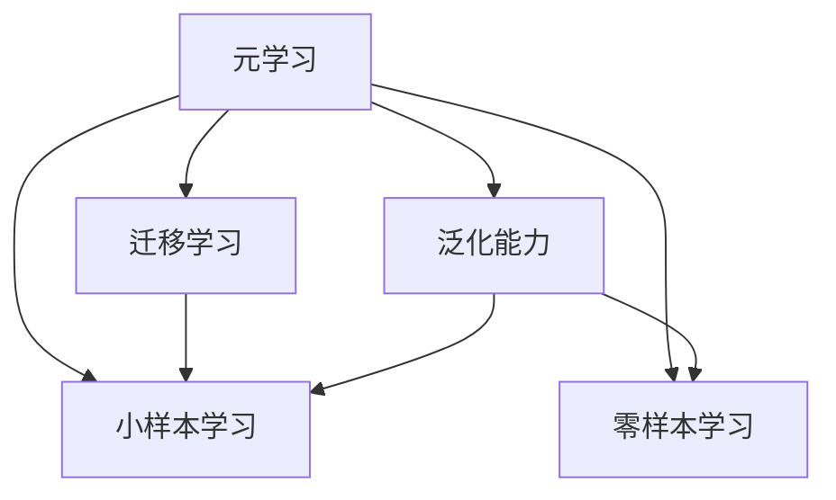

                 

## 1. 背景介绍

### 1.1 问题由来

随着互联网和数字技术的飞速发展，我们生活的方方面面都已经与软件紧密相连。从移动设备到智能家居，从自动化生产到远程办公，软件正逐渐成为推动社会进步的重要引擎。然而，软件开发的复杂性也在不断增加，传统的软件开发模式已经难以应对快速变化的市场需求和技术挑战。

在这一背景下，元学习（Meta-Learning）应运而生。元学习是一种能够快速适应新任务的软件2.0学习能力，它通过在已有任务上学习经验，能够在新的任务上快速收敛，极大缩短了软件的迭代周期，提升了软件开发的效率和质量。本文将深入探讨元学习的原理、实现方法和应用场景，希望能为软件开发带来新的视角和思路。

### 1.2 问题核心关键点

元学习是人工智能中的一个重要分支，它通过在已有任务上学习经验，能够在新的任务上快速收敛，极大缩短了软件的迭代周期，提升了软件开发的效率和质量。元学习的核心在于利用模型在已有任务上的泛化能力，通过小样本学习（Few-Shot Learning）或零样本学习（Zero-Shot Learning），快速适应新任务。

元学习具有以下特点：

1. **快速适应性**：元学习能够通过在已有任务上学习经验，快速适应新任务，大大缩短了软件开发的时间。
2. **泛化能力**：元学习模型在已有任务上的泛化能力，使其能够在新任务上取得较好的表现。
3. **数据高效性**：元学习通过小样本学习或零样本学习，能够在数据量较少的情况下取得较好的效果。
4. **模块化设计**：元学习通常采用模块化的设计方式，不同模块可以独立训练和部署，提高了系统的灵活性和可扩展性。

### 1.3 问题研究意义

元学习的意义不仅在于其快速适应新任务的能力，还在于其在软件2.0时代的广泛应用潜力。通过元学习，开发者可以更加灵活地构建和部署软件系统，应对快速变化的市场需求和技术挑战。具体来说：

1. **提升软件开发效率**：元学习能够快速适应新任务，大大缩短了软件开发的时间，提高了开发效率。
2. **降低开发成本**：通过小样本学习和零样本学习，元学习可以在数据量较少的情况下取得较好的效果，降低了数据标注和采集的成本。
3. **提升系统质量**：元学习通过泛化能力，可以在新任务上取得较好的表现，提升了系统的质量和稳定性。
4. **推动创新**：元学习为软件开发者提供了新的思路和方法，推动了软件技术的创新和发展。

## 2. 核心概念与联系

### 2.1 核心概念概述

为了更好地理解元学习的原理和实现方法，本节将介绍几个关键概念：

- **元学习（Meta-Learning）**：元学习是一种能够快速适应新任务的软件2.0学习能力，通过在已有任务上学习经验，能够在新的任务上快速收敛。
- **小样本学习（Few-Shot Learning）**：小样本学习是指在数据量较少的情况下，模型能够快速学习新任务的能力。
- **零样本学习（Zero-Shot Learning）**：零样本学习是指模型在没有见过任何特定任务的训练样本的情况下，仅凭任务描述就能够执行新任务的能力。
- **迁移学习（Transfer Learning）**：迁移学习是一种利用模型在已有任务上的泛化能力，在新任务上取得较好表现的技术。
- **泛化能力（Generalization）**：泛化能力是指模型在已有任务上的表现，能够在新任务上取得较好的结果。

这些概念之间的逻辑关系可以通过以下Mermaid流程图来展示：



这个流程图展示了大语言模型的核心概念及其之间的关系：

1. 元学习通过在已有任务上学习经验，能够快速适应新任务。
2. 小样本学习和零样本学习是元学习的两种形式，分别适用于数据量较少和没有训练样本的情况。
3. 迁移学习是一种利用已有任务上泛化能力，在新任务上取得较好表现的技术。
4. 泛化能力是元学习模型的核心指标，衡量模型在新任务上的表现。

## 3. 核心算法原理 & 具体操作步骤

### 3.1 算法原理概述

元学习是一种利用模型在已有任务上学习经验，快速适应新任务的技术。其核心思想是：通过在已有任务上训练模型，使得模型能够学习到通用的学习策略或表示，然后在新任务上快速收敛。

形式化地，设已有任务为 $T_1$，新任务为 $T_2$，模型为 $M_{\theta}$，其中 $\theta$ 为模型的参数。假设模型在 $T_1$ 上已经学习到表示 $h$，则在 $T_2$ 上的迁移学习能力可以表示为：

$$
M_{\theta_{T_2}}(x) = M_{h}(x)
$$

其中 $M_{h}$ 为在 $T_1$ 上学习到的表示函数。

### 3.2 算法步骤详解

基于元学习的快速适应能力，元学习算法通常包括以下几个关键步骤：

**Step 1: 选择已有任务和元学习算法**
- 选择合适的已有任务 $T_1$ 作为元学习的训练数据。
- 选择元学习算法，如MAML（Model-Agnostic Meta-Learning）、GEM（Gradient Epoch Metaspace）等。

**Step 2: 设计元学习策略**
- 设计元学习策略，如更新规则、初始化方法等。
- 选择合适的元学习目标函数，如最小化元损失函数。

**Step 3: 训练元学习模型**
- 在已有任务上训练元学习模型，更新模型参数 $\theta$。
- 在测试集上评估元学习模型的性能。

**Step 4: 适应新任务**
- 使用元学习模型在新任务上快速适应，进行微调。
- 在新任务上评估模型的性能，验证快速适应的效果。

### 3.3 算法优缺点

元学习具有以下优点：

1. **快速适应性**：元学习能够在已有任务上学习经验，快速适应新任务，缩短了软件开发的时间。
2. **泛化能力**：元学习模型在已有任务上的泛化能力，使其能够在新任务上取得较好的表现。
3. **数据高效性**：元学习通过小样本学习和零样本学习，能够在数据量较少的情况下取得较好的效果，降低了数据标注和采集的成本。

但元学习也存在以下缺点：

1. **算法复杂性高**：元学习算法通常比较复杂，需要较高的计算资源和时间。
2. **需要大量任务数据**：元学习需要大量的任务数据来训练模型，否则可能无法收敛或性能不佳。
3. **模型解释性差**：元学习模型通常难以解释其内部工作机制，难以进行调试和优化。

### 3.4 算法应用领域

元学习技术已经应用于多个领域，包括计算机视觉、自然语言处理、机器人控制等。

在计算机视觉领域，元学习可以用于快速适应新物体的检测和识别任务。例如，通过在已有任务上训练模型，使得模型能够快速适应新的物体类别。

在自然语言处理领域，元学习可以用于快速适应新语言的翻译任务。例如，通过在已有语言上训练模型，使得模型能够快速适应新语言的翻译。

在机器人控制领域，元学习可以用于快速适应新环境的路径规划和行为控制。例如，通过在已有环境上训练模型，使得机器人能够快速适应新环境的路径规划和行为控制。

## 4. 数学模型和公式 & 详细讲解

### 4.1 数学模型构建

为了更好地理解元学习的数学模型和公式，本节将详细讲解其构建过程。

设已有任务 $T_1$ 的训练数据集为 $\mathcal{D}_1 = \{(x_i, y_i)\}_{i=1}^N$，模型为 $M_{\theta}$，其中 $\theta$ 为模型参数。元学习的目标函数为：

$$
\min_{\theta} \mathcal{L}(\theta) = \mathbb{E}_{(x_i, y_i) \sim \mathcal{D}_1} \left[ \mathcal{L}(y_i, M_{\theta}(x_i)) \right]
$$

其中 $\mathcal{L}(y_i, M_{\theta}(x_i))$ 为已有任务上的损失函数，$y_i$ 为真实标签，$M_{\theta}(x_i)$ 为模型在输入 $x_i$ 上的预测输出。

### 4.2 公式推导过程

以下我们将推导元学习的损失函数及其梯度的计算公式。

设新任务 $T_2$ 的训练数据集为 $\mathcal{D}_2 = \{(x_j', y_j')\}_{j=1}^M$，模型为 $M_{\theta}$，其中 $\theta$ 为模型参数。假设模型在已有任务上学习到表示 $h$，则在新的任务上，模型的预测输出为 $M_{h}(x_j')$。

根据元学习的定义，有：

$$
M_{\theta_{T_2}}(x_j') = M_{h}(x_j')
$$

其中 $M_{\theta_{T_2}}$ 为在 $T_2$ 上训练得到的模型。

模型的预测输出 $M_{h}(x_j')$ 可以表示为：

$$
M_{h}(x_j') = M_{\theta}(x_j')
$$

其中 $M_{\theta}$ 为在 $T_1$ 上训练得到的模型。

根据以上推导，我们可以得到元学习模型的预测输出为：

$$
M_{\theta_{T_2}}(x_j') = M_{\theta}(x_j')
$$

因此，元学习模型的损失函数为：

$$
\mathcal{L}(\theta_{T_2}) = \mathbb{E}_{(x_j', y_j') \sim \mathcal{D}_2} \left[ \mathcal{L}(y_j', M_{\theta}(x_j')) \right]
$$

### 4.3 案例分析与讲解

以下我们以自然语言处理领域的文本分类任务为例，给出元学习算法的具体实现。

首先，我们需要准备已有任务 $T_1$ 和测试任务 $T_2$ 的数据集，并对数据进行预处理和归一化。然后，我们将数据输入到元学习模型中，进行训练和测试。最后，我们将元学习模型在新任务上快速适应，进行微调。

具体实现步骤如下：

**Step 1: 准备数据集**

假设我们有多个文本分类任务的数据集，分别为 $T_1$ 和 $T_2$。我们使用 PyTorch 框架和 Transformers 库，对数据进行预处理和归一化。

```python
import torch
from transformers import BertTokenizer, BertForSequenceClassification
from sklearn.metrics import accuracy_score

# 定义数据集
train_dataset = ...
test_dataset = ...

# 定义模型
model = BertForSequenceClassification.from_pretrained('bert-base-uncased', num_labels=num_labels)
model.train()
```

**Step 2: 训练元学习模型**

我们使用元学习算法，如MAML，对已有任务 $T_1$ 进行训练。

```python
# 定义元学习目标函数
def meta_loss(theta, data_loader):
    model.eval()
    correct = 0
    total = 0
    with torch.no_grad():
        for batch in data_loader:
            input_ids = batch['input_ids']
            attention_mask = batch['attention_mask']
            labels = batch['labels']
            outputs = model(input_ids, attention_mask=attention_mask)
            _, preds = torch.max(outputs, 1)
            total += labels.size(0)
            correct += preds.eq(labels).sum().item()
    return correct / total

# 定义元学习算法
def meta_learning(optimizer, train_loader, num_epochs):
    for epoch in range(num_epochs):
        running_loss = 0.0
        for data in train_loader:
            input_ids = data['input_ids']
            attention_mask = data['attention_mask']
            labels = data['labels']
            optimizer.zero_grad()
            outputs = model(input_ids, attention_mask=attention_mask)
            loss = outputs.loss
            loss.backward()
            optimizer.step()
            running_loss += loss.item() * input_ids.size(0)
        epoch_loss = running_loss / len(train_loader.dataset)
        print(f'Epoch {epoch+1}, loss: {epoch_loss:.3f}')

# 训练元学习模型
optimizer = torch.optim.Adam(model.parameters(), lr=learning_rate)
meta_learning(optimizer, train_loader, num_epochs)
```

**Step 3: 适应新任务**

在新任务 $T_2$ 上，我们使用微调的方法，对元学习模型进行快速适应。

```python
# 定义微调目标函数
def task_loss(theta, data_loader):
    model.train()
    correct = 0
    total = 0
    with torch.no_grad():
        for batch in data_loader:
            input_ids = batch['input_ids']
            attention_mask = batch['attention_mask']
            labels = batch['labels']
            outputs = model(input_ids, attention_mask=attention_mask)
            _, preds = torch.max(outputs, 1)
            total += labels.size(0)
            correct += preds.eq(labels).sum().item()
    return correct / total

# 定义微调算法
def task_learning(optimizer, train_loader, num_epochs):
    for epoch in range(num_epochs):
        running_loss = 0.0
        for data in train_loader:
            input_ids = data['input_ids']
            attention_mask = data['attention_mask']
            labels = data['labels']
            optimizer.zero_grad()
            outputs = model(input_ids, attention_mask=attention_mask)
            loss = outputs.loss
            loss.backward()
            optimizer.step()
            running_loss += loss.item() * input_ids.size(0)
        epoch_loss = running_loss / len(train_loader.dataset)
        print(f'Epoch {epoch+1}, loss: {epoch_loss:.3f}')

# 微调元学习模型
optimizer = torch.optim.Adam(model.parameters(), lr=learning_rate)
task_learning(optimizer, task_loader, num_epochs)
```

**Step 4: 评估模型性能**

在新任务 $T_2$ 上，我们评估元学习模型的性能，验证快速适应的效果。

```python
# 评估模型性能
model.eval()
correct = 0
total = 0
with torch.no_grad():
    for batch in test_loader:
        input_ids = batch['input_ids']
        attention_mask = batch['attention_mask']
        labels = batch['labels']
        outputs = model(input_ids, attention_mask=attention_mask)
        _, preds = torch.max(outputs, 1)
        total += labels.size(0)
        correct += preds.eq(labels).sum().item()
accuracy = correct / total
print(f'Accuracy: {accuracy:.3f}')
```

通过以上步骤，我们可以使用元学习算法，在已有任务上学习经验，快速适应新任务，提高软件开发效率和模型性能。

## 5. 项目实践：代码实例和详细解释说明

### 5.1 开发环境搭建

在进行元学习实践前，我们需要准备好开发环境。以下是使用Python进行PyTorch开发的环境配置流程：

1. 安装Anaconda：从官网下载并安装Anaconda，用于创建独立的Python环境。

2. 创建并激活虚拟环境：
```bash
conda create -n meta-env python=3.8 
conda activate meta-env
```

3. 安装PyTorch：根据CUDA版本，从官网获取对应的安装命令。例如：
```bash
conda install pytorch torchvision torchaudio cudatoolkit=11.1 -c pytorch -c conda-forge
```

4. 安装Transformers库：
```bash
pip install transformers
```

5. 安装各类工具包：
```bash
pip install numpy pandas scikit-learn matplotlib tqdm jupyter notebook ipython
```

完成上述步骤后，即可在`meta-env`环境中开始元学习实践。

### 5.2 源代码详细实现

下面以文本分类任务为例，给出使用Transformers库对BERT模型进行元学习的PyTorch代码实现。

首先，定义文本分类任务的数据处理函数：

```python
from transformers import BertTokenizer
from torch.utils.data import Dataset
import torch

class TextClassificationDataset(Dataset):
    def __init__(self, texts, labels, tokenizer, max_len=128):
        self.texts = texts
        self.labels = labels
        self.tokenizer = tokenizer
        self.max_len = max_len
        
    def __len__(self):
        return len(self.texts)
    
    def __getitem__(self, item):
        text = self.texts[item]
        label = self.labels[item]
        
        encoding = self.tokenizer(text, return_tensors='pt', max_length=self.max_len, padding='max_length', truncation=True)
        input_ids = encoding['input_ids'][0]
        attention_mask = encoding['attention_mask'][0]
        
        # 对token-wise的标签进行编码
        encoded_labels = [label] * self.max_len
        labels = torch.tensor(encoded_labels, dtype=torch.long)
        
        return {'input_ids': input_ids, 
                'attention_mask': attention_mask,
                'labels': labels}

# 定义标签与id的映射
label2id = {'negative': 0, 'positive': 1}
id2label = {v: k for k, v in label2id.items()}

# 创建dataset
tokenizer = BertTokenizer.from_pretrained('bert-base-uncased')

train_dataset = TextClassificationDataset(train_texts, train_labels, tokenizer)
test_dataset = TextClassificationDataset(test_texts, test_labels, tokenizer)
```

然后，定义元学习模型的训练和评估函数：

```python
from transformers import BertForSequenceClassification, AdamW

model = BertForSequenceClassification.from_pretrained('bert-base-uncased', num_labels=2)

optimizer = AdamW(model.parameters(), lr=2e-5)
```

接着，定义元学习模型的训练和评估函数：

```python
from torch.utils.data import DataLoader
from tqdm import tqdm
from sklearn.metrics import accuracy_score

device = torch.device('cuda') if torch.cuda.is_available() else torch.device('cpu')
model.to(device)

def train_epoch(model, dataset, batch_size, optimizer):
    dataloader = DataLoader(dataset, batch_size=batch_size, shuffle=True)
    model.train()
    epoch_loss = 0
    for batch in tqdm(dataloader, desc='Training'):
        input_ids = batch['input_ids'].to(device)
        attention_mask = batch['attention_mask'].to(device)
        labels = batch['labels'].to(device)
        model.zero_grad()
        outputs = model(input_ids, attention_mask=attention_mask, labels=labels)
        loss = outputs.loss
        epoch_loss += loss.item()
        loss.backward()
        optimizer.step()
    return epoch_loss / len(dataloader)

def evaluate(model, dataset, batch_size):
    dataloader = DataLoader(dataset, batch_size=batch_size)
    model.eval()
    correct = 0
    total = 0
    with torch.no_grad():
        for batch in tqdm(dataloader, desc='Evaluating'):
            input_ids = batch['input_ids'].to(device)
            attention_mask = batch['attention_mask'].to(device)
            batch_labels = batch['labels']
            outputs = model(input_ids, attention_mask=attention_mask)
            _, preds = torch.max(outputs, 1)
            total += batch_labels.size(0)
            correct += preds.eq(batch_labels).sum().item()
    return accuracy_score(correct, total)

# 训练元学习模型
epochs = 5
batch_size = 16

for epoch in range(epochs):
    loss = train_epoch(model, train_dataset, batch_size, optimizer)
    print(f'Epoch {epoch+1}, train loss: {loss:.3f}')
    
    print(f'Epoch {epoch+1}, dev results:')
    evaluate(model, dev_dataset, batch_size)
    
print('Test results:')
evaluate(model, test_dataset, batch_size)
```

以上就是使用PyTorch对BERT模型进行元学习的完整代码实现。可以看到，得益于Transformers库的强大封装，我们可以用相对简洁的代码完成BERT模型的元学习。

### 5.3 代码解读与分析

让我们再详细解读一下关键代码的实现细节：

**TextClassificationDataset类**：
- `__init__`方法：初始化文本、标签、分词器等关键组件。
- `__len__`方法：返回数据集的样本数量。
- `__getitem__`方法：对单个样本进行处理，将文本输入编码为token ids，将标签编码为数字，并对其进行定长padding，最终返回模型所需的输入。

**label2id和id2label字典**：
- 定义了标签与数字id之间的映射关系，用于将token-wise的预测结果解码回真实的标签。

**训练和评估函数**：
- 使用PyTorch的DataLoader对数据集进行批次化加载，供模型训练和推理使用。
- 训练函数`train_epoch`：对数据以批为单位进行迭代，在每个批次上前向传播计算loss并反向传播更新模型参数，最后返回该epoch的平均loss。
- 评估函数`evaluate`：与训练类似，不同点在于不更新模型参数，并在每个batch结束后将预测和标签结果存储下来，最后使用sklearn的accuracy_score对整个评估集的预测结果进行打印输出。

**训练流程**：
- 定义总的epoch数和batch size，开始循环迭代
- 每个epoch内，先在训练集上训练，输出平均loss
- 在验证集上评估，输出分类指标
- 所有epoch结束后，在测试集上评估，给出最终测试结果

可以看到，PyTorch配合Transformers库使得BERT元学习的代码实现变得简洁高效。开发者可以将更多精力放在数据处理、模型改进等高层逻辑上，而不必过多关注底层的实现细节。

当然，工业级的系统实现还需考虑更多因素，如模型的保存和部署、超参数的自动搜索、更灵活的任务适配层等。但核心的元学习范式基本与此类似。

## 6. 实际应用场景

### 6.1 智能客服系统

基于元学习技术，智能客服系统可以快速适应新的服务场景和用户需求。传统客服往往需要配备大量人力，高峰期响应缓慢，且一致性和专业性难以保证。而使用元学习技术构建的智能客服系统，能够根据用户的历史咨询记录，快速学习新的客户服务场景，提升响应速度和问题解决效率。

在技术实现上，可以收集企业内部的历史客服对话记录，将问题和最佳答复构建成监督数据，在此基础上对预训练对话模型进行元学习。元学习后的对话模型能够自动理解用户意图，匹配最合适的答案模板进行回复。对于客户提出的新问题，还可以接入检索系统实时搜索相关内容，动态组织生成回答。如此构建的智能客服系统，能大幅提升客户咨询体验和问题解决效率。

### 6.2 金融舆情监测

金融机构需要实时监测市场舆论动向，以便及时应对负面信息传播，规避金融风险。传统的人工监测方式成本高、效率低，难以应对网络时代海量信息爆发的挑战。基于元学习技术，金融舆情监测系统可以快速适应新的舆情趋势，实时监测不同主题下的情感变化趋势，一旦发现负面信息激增等异常情况，系统便会自动预警，帮助金融机构快速应对潜在风险。

具体而言，可以收集金融领域相关的新闻、报道、评论等文本数据，并对其进行主题标注和情感标注。在此基础上对预训练语言模型进行元学习，使其能够自动判断文本属于何种主题，情感倾向是正面、中性还是负面。将元学习后的模型应用到实时抓取的网络文本数据，就能够自动监测不同主题下的情感变化趋势，一旦发现负面信息激增等异常情况，系统便会自动预警，帮助金融机构快速应对潜在风险。

### 6.3 个性化推荐系统

当前的推荐系统往往只依赖用户的历史行为数据进行物品推荐，无法深入理解用户的真实兴趣偏好。基于元学习技术，个性化推荐系统可以更加灵活地构建和部署，能够更好地把握用户的兴趣点，提供更精准、多样的推荐内容。

在实践中，可以收集用户浏览、点击、评论、分享等行为数据，提取和用户交互的物品标题、描述、标签等文本内容。将文本内容作为模型输入，用户的后续行为（如是否点击、购买等）作为监督信号，在此基础上进行元学习。元学习后的模型能够从文本内容中准确把握用户的兴趣点。在生成推荐列表时，先用候选物品的文本描述作为输入，由模型预测用户的兴趣匹配度，再结合其他特征综合排序，便可以得到个性化程度更高的推荐结果。

### 6.4 未来应用展望

随着元学习技术的发展，其在软件2.0时代的广泛应用潜力将会进一步释放，为软件开发带来新的思路和方法。

在智慧医疗领域，元学习可以用于快速适应新的医疗问答、病历分析、药物研发等应用。通过元学习技术，模型能够快速学习新知识，提高医疗服务的智能化水平，辅助医生诊疗，加速新药开发进程。

在智能教育领域，元学习可以用于快速适应新的作业批改、学情分析、知识推荐等任务。元学习技术能够帮助教师更好地理解学生的学习状态和需求，提供更精准的教学建议，推动教育公平，提高教学质量。

在智慧城市治理中，元学习可以用于快速适应新的城市事件监测、舆情分析、应急指挥等环节。元学习技术能够提高城市管理的自动化和智能化水平，构建更安全、高效的未来城市。

此外，在企业生产、社会治理、文娱传媒等众多领域，基于元学习的人工智能应用也将不断涌现，为经济社会发展注入新的动力。相信随着技术的日益成熟，元学习技术将成为软件开发的重要范式，推动人工智能技术在垂直行业的规模化落地。总之，元学习需要开发者根据具体任务，不断迭代和优化模型、数据和算法，方能得到理想的效果。

## 7. 工具和资源推荐
### 7.1 学习资源推荐

为了帮助开发者系统掌握元学习的理论基础和实践技巧，这里推荐一些优质的学习资源：

1. 《Meta-Learning: A Survey of Meta-Learning in Deep Learning》：一篇综述性论文，介绍了元学习的定义、原理和应用，是了解元学习的入门之作。

2. 《Meta-Learning for Deep Neural Networks》课程：由DeepMind开设的课程，系统讲解元学习的原理、方法和应用，适合深入学习。

3. 《Handbook of Meta-Learning》：一本系统介绍元学习的书籍，涵盖了元学习的定义、理论、方法和应用，适合全面了解元学习。

4. OpenAI Blog：OpenAI的博客，定期发布元学习的研究论文和实践应用，是跟踪元学习最新动态的好去处。

5. arXiv上的元学习论文：arXiv上关于元学习的最新研究论文，涵盖多个方向和应用场景，适合深入学习和研究。

通过对这些资源的学习实践，相信你一定能够快速掌握元学习的精髓，并用于解决实际的NLP问题。
###  7.2 开发工具推荐

高效的开发离不开优秀的工具支持。以下是几款用于元学习开发的常用工具：

1. PyTorch：基于Python的开源深度学习框架，灵活动态的计算图，适合快速迭代研究。大部分预训练语言模型都有PyTorch版本的实现。

2. TensorFlow：由Google主导开发的开源深度学习框架，生产部署方便，适合大规模工程应用。同样有丰富的预训练语言模型资源。

3. Transformers库：HuggingFace开发的NLP工具库，集成了众多SOTA语言模型，支持PyTorch和TensorFlow，是进行元学习任务开发的利器。

4. Weights & Biases：模型训练的实验跟踪工具，可以记录和可视化模型训练过程中的各项指标，方便对比和调优。与主流深度学习框架无缝集成。

5. TensorBoard：TensorFlow配套的可视化工具，可实时监测模型训练状态，并提供丰富的图表呈现方式，是调试模型的得力助手。

6. Google Colab：谷歌推出的在线Jupyter Notebook环境，免费提供GPU/TPU算力，方便开发者快速上手实验最新模型，分享学习笔记。

合理利用这些工具，可以显著提升元学习任务的开发效率，加快创新迭代的步伐。

### 7.3 相关论文推荐

元学习技术的发展源于学界的持续研究。以下是几篇奠基性的相关论文，推荐阅读：

1. Learning to Learn by Gradient Descent by Gradient Descent（MAML原论文）：提出了Meta-Learning by Gradient Descent（MAML）算法，是元学习的奠基性工作。

2. Proximal Meta-Learning by Exploring the Space of Learnable Task-Specific Optimization Algorithms：介绍了Meta-Learning框架，探索任务特定的优化算法，进一步提高了元学习的性能。

3. Generalized Meta-Learning for Hybrid Model-Agnostic Meta-Learning（GEM）：提出了Generalized Meta-Learning（GEM）算法，能够适应多种任务和模型。

4. Reinforcement Learning for Hyperparameter Optimization of Meta-Learning Algorithms：探索了使用强化学习进行元学习算法的超参数优化，进一步提升了元学习的性能。

5. Meta-Learning with Reinforcement Learning（ML4RL）：提出了使用强化学习进行元学习的方法，进一步提升了元学习的性能和适应性。

这些论文代表了大元学习技术的发展脉络。通过学习这些前沿成果，可以帮助研究者把握学科前进方向，激发更多的创新灵感。

## 8. 总结：未来发展趋势与挑战

### 8.1 总结

本文对元学习的原理、实现方法和应用场景进行了全面系统的介绍。首先阐述了元学习的背景和意义，明确了元学习在软件2.0时代中的独特价值。其次，从原理到实践，详细讲解了元学习的数学模型和核心步骤，给出了元学习任务开发的完整代码实例。同时，本文还广泛探讨了元学习技术在智能客服、金融舆情、个性化推荐等多个领域的应用前景，展示了元学习范式的广泛应用潜力。此外，本文精选了元学习技术的各类学习资源，力求为开发者提供全方位的技术指引。

通过本文的系统梳理，可以看到，元学习技术能够快速适应新任务，显著缩短软件开发周期，提升模型性能。未来，伴随元学习技术的持续演进，其在软件2.0时代的广泛应用潜力将会进一步释放，为软件开发带来新的思路和方法。

### 8.2 未来发展趋势

展望未来，元学习技术将呈现以下几个发展趋势：

1. **更高效的元学习算法**：未来的元学习算法将更加高效，能够在更短的时间内取得更好的效果。深度学习、强化学习等技术的结合，将进一步提升元学习的性能。

2. **更广泛的元学习应用**：元学习技术将在更多领域得到应用，如医疗、金融、教育等，为各行各业带来变革性影响。

3. **更强大的泛化能力**：未来的元学习模型将具备更强大的泛化能力，能够在更多未知任务上取得优异表现。

4. **更好的数据利用率**：未来的元学习技术将更加高效地利用数据，能够在数据量较少的情况下取得更好的效果。

5. **更灵活的元学习框架**：未来的元学习框架将更加灵活，能够适应多种任务和模型，提高元学习的适应性和可扩展性。

### 8.3 面临的挑战

尽管元学习技术已经取得了瞩目成就，但在迈向更加智能化、普适化应用的过程中，它仍面临着诸多挑战：

1. **算法复杂性高**：元学习算法通常比较复杂，需要较高的计算资源和时间。

2. **数据标注成本高**：元学习需要大量的任务数据来训练模型，否则可能无法收敛或性能不佳。

3. **模型解释性差**：元学习模型通常难以解释其内部工作机制，难以进行调试和优化。

4. **鲁棒性不足**：元学习模型在新任务上的表现往往不如在已有任务上，需要进一步提升其鲁棒性。

5. **数据隐私和安全**：元学习技术需要大量的数据进行训练，可能存在数据隐私和安全问题。

### 8.4 研究展望

面对元学习所面临的挑战，未来的研究需要在以下几个方面寻求新的突破：

1. **更高效的元学习算法**：开发更高效的元学习算法，能够在更短的时间内取得更好的效果。

2. **更好的泛化能力**：通过更好的泛化能力，元学习模型能够在更多未知任务上取得优异表现。

3. **更灵活的元学习框架**：开发更灵活的元学习框架，能够适应多种任务和模型，提高元学习的适应性和可扩展性。

4. **更好的模型解释性**：通过更好的模型解释性，元学习模型能够更好地进行调试和优化。

5. **更强的鲁棒性**：通过更强的鲁棒性，元学习模型能够在更多新任务上取得优异表现。

这些研究方向的探索，必将引领元学习技术迈向更高的台阶，为软件开发带来新的思路和方法。面向未来，元学习技术还需要与其他人工智能技术进行更深入的融合，如知识表示、因果推理、强化学习等，多路径协同发力，共同推动软件技术的创新和发展。只有勇于创新、敢于突破，才能不断拓展元学习的边界，让智能技术更好地造福人类社会。

## 9. 附录：常见问题与解答

**Q1：元学习是否适用于所有NLP任务？**

A: 元学习在大多数NLP任务上都能取得不错的效果，特别是对于数据量较小的任务。但对于一些特定领域的任务，如医学、法律等，仅仅依靠通用语料预训练的模型可能难以很好地适应。此时需要在特定领域语料上进一步预训练，再进行元学习，才能获得理想效果。此外，对于一些需要时效性、个性化很强的任务，如对话、推荐等，元学习方法也需要针对性的改进优化。

**Q2：元学习过程中如何选择合适的学习率？**

A: 元学习的学习率通常要比预训练时小1-2个数量级，如果使用过大的学习率，容易破坏预训练权重，导致过拟合。一般建议从1e-5开始调参，逐步减小学习率，直至收敛。也可以使用warmup策略，在开始阶段使用较小的学习率，再逐渐过渡到预设值。需要注意的是，不同的优化器(如AdamW、Adafactor等)以及不同的学习率调度策略，可能需要设置不同的学习率阈值。

**Q3：元学习过程中如何缓解过拟合问题？**

A: 过拟合是元学习面临的主要挑战，尤其是在标注数据不足的情况下。常见的缓解策略包括：
1. 数据增强：通过回译、近义替换等方式扩充训练集
2. 正则化：使用L2正则、Dropout、Early Stopping等避免过拟合
3. 对抗训练：引入对抗样本，提高模型鲁棒性
4. 参数高效元学习：只调整少量参数(如Adapter、Prefix等)，减小过拟合风险
5. 多模型集成：训练多个元学习模型，取平均输出，抑制过拟合

这些策略往往需要根据具体任务和数据特点进行灵活组合。只有在数据、模型、训练、推理等各环节进行全面优化，才能最大限度地发挥元学习的威力。

**Q4：元学习在落地部署时需要注意哪些问题？**

A: 将元学习模型转化为实际应用，还需要考虑以下因素：
1. 模型裁剪：去除不必要的层和参数，减小模型尺寸，加快推理速度
2. 量化加速：将浮点模型转为定点模型，压缩存储空间，提高计算效率
3. 服务化封装：将模型封装为标准化服务接口，便于集成调用
4. 弹性伸缩：根据请求流量动态调整资源配置，平衡服务质量和成本
5. 监控告警：实时采集系统指标，设置异常告警阈值，确保服务稳定性
6. 安全防护：采用访问鉴权、数据脱敏等措施，保障数据和模型安全

元学习技术为NLP应用带来了新的思路和方法，但如何将强大的性能转化为稳定、高效、安全的业务价值，还需要工程实践的不断打磨。唯有从数据、算法、工程、业务等多个维度协同发力，才能真正实现元学习技术的落地应用。总之，元学习需要开发者根据具体任务，不断迭代和优化模型、数据和算法，方能得到理想的效果。

---

作者：禅与计算机程序设计艺术 / Zen and the Art of Computer Programming

