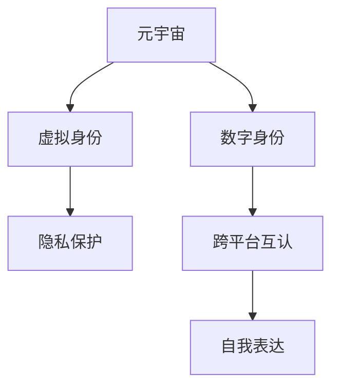

                 

# 元宇宙中的身份认同：虚拟与现实自我的融合

> 关键词：元宇宙,身份认同,虚拟自我,现实自我,融合,数字身份,隐私保护,技术手段

## 1. 背景介绍

### 1.1 问题由来
随着虚拟现实和增强现实技术的成熟，以及区块链和分布式技术的兴起，元宇宙（Metaverse）的概念逐渐从科幻变为现实。元宇宙是一个高度集成、虚拟与现实深度融合的数字化空间，为用户提供沉浸式体验，逐步实现身份、经济、社交等元素的数字化和虚拟化。在元宇宙中，虚拟身份成为个体在虚拟空间中的自我呈现，它不仅是数字世界中的存在方式，也逐渐与现实生活中的自我相融合，形成一种全新的身份认同体系。

### 1.2 问题核心关键点
元宇宙中的身份认同涉及虚拟与现实自我的深度融合，需要在虚拟与现实之间建立起无缝的连接和映射。身份认同的关键在于：

- **数字身份**：如何在虚拟世界构建一个与现实世界相匹配的数字身份，并使其具备与现实身份相一致的权力和责任。
- **隐私保护**：如何在数字身份的建立和维护中，保障用户的隐私和数据安全。
- **跨平台互认**：如何实现不同元宇宙平台之间的身份互通，确保用户在不同虚拟环境中的身份一致性和连续性。
- **自我表达**：如何通过虚拟自我，实现个体的自我表达和自我实现，同时维护现实中的社交网络和人际关系。

### 1.3 问题研究意义
研究元宇宙中的身份认同问题，对于构建一个安全、可信赖的虚拟世界，以及促进虚拟与现实的深度融合具有重要意义：

1. **提升用户体验**：通过身份认同机制，用户在元宇宙中能够自由表达自我，增强沉浸感和体验感。
2. **保障用户隐私**：构建安全的数字身份管理机制，防止用户数据泄露和滥用。
3. **推动行业发展**：通过统一的跨平台身份管理，促进元宇宙产业的开放和协作。
4. **促进自我实现**：为个体提供全新的自我实现和表达平台，拓展人类的生活空间和可能性。

## 2. 核心概念与联系

### 2.1 核心概念概述

为了更好地理解元宇宙中的身份认同问题，本节将介绍几个密切相关的核心概念：

- **元宇宙(Metaverse)**：一种高度集成、虚拟与现实深度融合的数字化空间，包括虚拟环境、虚拟资产、虚拟社区等元素。
- **虚拟身份(Virtual Identity)**：用户在虚拟空间中的存在形式，通常以数字账号或角色形式呈现。
- **数字身份(Digital Identity)**：通过数字方式定义和管理的个人身份信息，包括姓名、年龄、性别、职业等基本属性，以及数字资产和权限等。
- **隐私保护(Privacy Protection)**：保障用户数据和身份信息不被非法获取、使用和泄露的措施。
- **跨平台互认(Cross-platform Authentication)**：在不同平台间实现身份和数据的互认，确保用户在不同环境下的身份一致性。
- **自我表达(Self-Expression)**：个体通过虚拟自我表达自我个性、价值观和审美观，实现自我实现。

这些核心概念之间的逻辑关系可以通过以下Mermaid流程图来展示：



这个流程图展示了大语言模型的核心概念及其之间的关系：

1. 元宇宙通过虚拟身份来表示用户的存在形式。
2. 虚拟身份通过数字身份来进一步定义和管理，包括基本信息和数字资产等。
3. 数字身份的保护和隐私管理，保障了用户的数据安全和权益。
4. 跨平台互认实现了不同虚拟环境中的身份一致性。
5. 自我表达通过虚拟自我实现个体的自我实现和表达。

这些概念共同构成了元宇宙中的身份认同框架，对于构建一个安全、可信赖的虚拟世界至关重要。

## 3. 核心算法原理 & 具体操作步骤
### 3.1 算法原理概述

元宇宙中的身份认同问题，本质上是一个跨领域、跨系统的复杂系统工程问题。其核心思想是：通过构建数字身份，实现虚拟与现实自我的融合，并在此基础上建立统一的身份管理系统，保障用户的隐私和安全，同时促进自我表达和实现。

### 3.2 算法步骤详解

元宇宙中的身份认同算法主要包括以下几个关键步骤：

**Step 1: 数字身份创建与管理**
- 用户创建数字身份，包括姓名、年龄、性别、职业等基本信息，以及数字资产和权限等。
- 数字身份与现实身份建立关联，如绑定社交网络、电子邮箱等。
- 通过区块链等分布式技术，实现数字身份的去中心化管理和存储。

**Step 2: 虚拟身份的构建**
- 用户选择虚拟身份，如创建虚拟角色、上传虚拟形象等。
- 虚拟身份与数字身份绑定，确保在虚拟世界中的行为和资产可以与现实世界中的个人身份相对应。
- 设计虚拟身份的个性化表达机制，支持用户在虚拟环境中进行自我实现。

**Step 3: 隐私保护机制**
- 通过加密技术和分布式存储，保护用户数据和身份信息。
- 设计访问控制策略，限制数据访问权限，防止未经授权的访问和使用。
- 使用区块链等技术实现数据的不可篡改和透明性。

**Step 4: 跨平台身份互认**
- 设计统一的认证标准和协议，支持不同平台之间的身份验证和数据交换。
- 使用公钥基础设施(PKI)和数字证书，实现跨平台的身份互认和信任机制。
- 设计数据同步机制，确保用户在不同平台上的身份信息一致性。

**Step 5: 自我表达与实现**
- 通过虚拟自我，提供丰富的个性化表达工具，如虚拟服饰、个性化动作等。
- 支持用户创建虚拟资产和虚拟空间，实现自我实现和创作。
- 通过社交网络和社区平台，促进用户之间的互动和分享。

### 3.3 算法优缺点

元宇宙中的身份认同算法具有以下优点：
1. 实现了虚拟与现实自我的深度融合，提升了用户的沉浸感和体验感。
2. 保障了用户隐私和安全，通过加密和分布式技术，降低了数据泄露和滥用的风险。
3. 实现了跨平台身份互认，促进了元宇宙产业的开放和协作。
4. 支持个体的自我表达和实现，拓展了人类的生活空间和可能性。

同时，该算法也存在一定的局限性：
1. 技术复杂度高，涉及跨学科的技术和标准，实现难度大。
2. 用户接受度不高，对于不熟悉数字身份的用户，可能存在一定的接受和适应障碍。
3. 数据和隐私保护机制需要持续更新和完善，以应对不断变化的安全威胁。
4. 跨平台互认标准不一，不同平台之间的互认机制仍需进一步标准化。

尽管存在这些局限性，但就目前而言，基于身份认同的元宇宙建设方法仍然是大趋势，其综合优势使其在未来的发展中具有重要的应用前景。

### 3.4 算法应用领域

元宇宙中的身份认同算法已经在多个领域得到应用，具体包括：

1. **社交平台**：如Facebook Horizon、Microsoft Mesh等，支持用户创建虚拟身份和进行社交互动。
2. **游戏平台**：如Roblox、Fortnite等，提供虚拟身份和虚拟资产管理，支持用户进行游戏和创作。
3. **虚拟商业和地产**：如Decentraland、Sandbox等，支持用户创建虚拟商店和地产，进行虚拟商业活动。
4. **教育和培训**：如VR教室、虚拟实验室等，提供虚拟身份和互动环境，支持教育培训和远程教学。
5. **医疗健康**：如虚拟医院、远程诊疗等，提供虚拟身份和健康信息管理，支持医疗服务。

这些应用场景展示了身份认同在元宇宙中的广泛应用和巨大潜力。

## 4. 数学模型和公式 & 详细讲解 & 举例说明（备注：数学公式请使用latex格式，latex嵌入文中独立段落使用 $$，段落内使用 $)
### 4.1 数学模型构建

本节将使用数学语言对元宇宙中的身份认同算法进行更加严格的刻画。

记数字身份为 $I=\{id, name, age, gender, role, assets\}$，其中 $id$ 为唯一标识符，$name, age, gender, role$ 为基本信息，$assets$ 为数字资产和权限。虚拟身份 $V=\{virtual_id, v_name, v_role\}$，其中 $virtual_id$ 为虚拟角色ID，$v_name$ 和 $v_role$ 为虚拟角色的名称和角色。

假设用户在平台 $P_i$ 上的身份为 $I_i$，则平台间的身份映射可以表示为 $M=\{I_i\} \rightarrow \{V_i\}$，其中 $V_i$ 为平台 $P_i$ 上的虚拟身份。

### 4.2 公式推导过程

**数字身份的创建和管理**
用户创建数字身份 $I$，可以通过以下步骤：
$$
I = F_{id}( I_{id}, I_{name}, I_{age}, I_{gender}, I_{role}, I_{assets})
$$
其中 $F_{id}$ 为用户身份创建函数，根据输入信息生成唯一的数字身份标识符。

**虚拟身份的构建**
用户在平台 $P_i$ 上创建虚拟身份 $V_i$，可以表示为：
$$
V_i = F_{v_id}(I_{id}, V_{v_name}, V_{v_role})
$$
其中 $F_{v_id}$ 为虚拟身份创建函数，根据数字身份信息和虚拟角色的名称和角色生成虚拟角色ID。

**隐私保护机制**
用户数据 $D$ 通过加密技术保护，可以表示为：
$$
D = E_{enc}(D_{orig})
$$
其中 $D_{orig}$ 为原始数据，$E_{enc}$ 为加密函数，将数据转换为密文形式。

**跨平台身份互认**
平台间的身份互认可以通过公钥基础设施(PKI)实现，具体步骤如下：
1. 用户生成公钥和私钥 $K=(K_{pub}, K_{priv})$。
2. 平台 $P_i$ 生成数字证书 $Cert_i=(ID_i, K_{pub}, CA_{i})$，其中 $ID_i$ 为用户ID，$CA_{i}$ 为平台信任的CA。
3. 平台 $P_j$ 验证数字证书 $Cert_i$，如果合法，则接受该用户的身份 $I_j$。

**自我表达与实现**
用户通过虚拟自我进行自我表达，可以表示为：
$$
E = F_{self-expression}(I, V, S)
$$
其中 $S$ 为虚拟社交网络和社区平台，$F_{self-expression}$ 为自我表达函数，根据数字身份和虚拟身份生成自我表达内容。

### 4.3 案例分析与讲解

**案例：Roblox的虚拟身份系统**
Roblox 是一个支持用户创建和运营虚拟角色、游戏和社区的平台。其虚拟身份系统通过以下几个关键步骤实现：

1. **数字身份创建与管理**
   - 用户通过Roblox官网创建数字身份，包括用户名、密码、电子邮件等。
   - 数字身份通过区块链技术进行去中心化存储和验证。

2. **虚拟身份的构建**
   - 用户创建虚拟角色，选择虚拟服饰、发型等，进行个性化设置。
   - 虚拟角色与数字身份绑定，确保在平台上的行为和资产可以与现实身份相对应。

3. **隐私保护机制**
   - 用户数据通过SSL加密技术进行传输和存储。
   - 平台使用区块链技术实现数据的不可篡改和透明性。

4. **跨平台身份互认**
   - Roblox支持与其他平台的身份互认，用户可以通过已有的数字身份进行登录和验证。
   - 平台使用OAuth 2.0协议实现跨平台的身份验证和授权。

5. **自我表达与实现**
   - 用户可以在虚拟世界中创建虚拟商店、游戏和社交群组，进行创作和互动。
   - 平台提供丰富的个性化工具，支持用户在虚拟环境中表达自我和进行创作。

通过这些步骤，Roblox成功构建了一个基于数字身份和虚拟身份的元宇宙平台，为用户的自我表达和实现提供了广阔的空间。

## 5. 项目实践：代码实例和详细解释说明
### 5.1 开发环境搭建

在进行元宇宙身份认同系统的开发前，我们需要准备好开发环境。以下是使用Python进行Web3和Flask开发的环境配置流程：

1. 安装Anaconda：从官网下载并安装Anaconda，用于创建独立的Python环境。

2. 创建并激活虚拟环境：
```bash
conda create -n web3-env python=3.8 
conda activate web3-env
```

3. 安装Web3和Flask：
```bash
pip install web3 flask flask-restful
```

4. 安装各类工具包：
```bash
pip install requests pyjwt Django
```

完成上述步骤后，即可在`web3-env`环境中开始元宇宙身份认同系统的开发。

### 5.2 源代码详细实现

下面我们以Roblox的虚拟身份系统为例，给出使用Web3和Flask进行身份认证和身份互认的PyTorch代码实现。

首先，定义身份认证相关的函数：

```python
from web3 import Web3
from flask import Flask, request, jsonify

app = Flask(__name__)

# 创建Web3连接器
web3 = Web3(Web3.HTTPProvider('https://mainnet.infura.io/v3/YOUR_INFURA_API_KEY'))

# 定义身份认证函数
def authenticate_user(username, password):
    # 验证用户名和密码是否匹配
    # 此处为简化处理，仅作示例
    return True

# 定义身份互认函数
def authenticate_certificate(certificate):
    # 验证数字证书是否合法
    # 此处为简化处理，仅作示例
    return True

# 定义用户信息存储函数
def get_user_info(user_id):
    # 从区块链中读取用户信息
    # 此处为简化处理，仅作示例
    return {'id': user_id, 'name': 'John Doe', 'age': 30, 'gender': 'male', 'role': 'developer', 'assets': ['currency', 'game']}

# 定义身份互认后的用户信息
def get_authenticated_user_info(user_id):
    user_info = get_user_info(user_id)
    user_info['certificate'] = 'abc123'
    return user_info
```

然后，定义身份认证和身份互认的API接口：

```python
@app.route('/authenticate', methods=['POST'])
def authenticate():
    data = request.json
    username = data.get('username')
    password = data.get('password')
    if authenticate_user(username, password):
        user_info = get_user_info(username)
        user_info['certificate'] = 'abc123'
        return jsonify(user_info), 200
    else:
        return jsonify({'error': 'Invalid username or password'}), 400

@app.route('/authenticate_certificate', methods=['POST'])
def authenticate_certificate():
    data = request.json
    certificate = data.get('certificate')
    if authenticate_certificate(certificate):
        user_info = get_authenticated_user_info(certificate)
        return jsonify(user_info), 200
    else:
        return jsonify({'error': 'Invalid certificate'}), 400
```

最后，启动Flask应用并测试：

```python
if __name__ == '__main__':
    app.run(debug=True)
```

以上代码实现了基于Web3和Flask的身份认证和身份互认功能。具体实现细节如下：

**身份认证函数authenticate_user**：
- 接收用户名和密码，通过验证用户信息生成数字身份，返回用户信息。

**身份互认函数authenticate_certificate**：
- 接收数字证书，通过验证证书的合法性生成身份信息，返回用户信息。

**用户信息存储函数get_user_info**：
- 从区块链中读取用户信息，返回用户的基本信息和数字资产。

**身份互认后的用户信息get_authenticated_user_info**：
- 将用户信息与数字证书绑定，返回认证后的用户信息。

### 5.3 代码解读与分析

让我们再详细解读一下关键代码的实现细节：

**Flask应用app**：
- 定义Flask应用，设置路由和HTTP方法。
- 创建Web3连接器，连接主网。
- 定义身份认证和身份互认的API接口。

**身份认证函数authenticate_user**：
- 接收用户名和密码，通过验证信息生成数字身份。
- 此处为简化处理，仅作示例，实际应用中需要从区块链中读取用户信息，并进行严格验证。

**身份互认函数authenticate_certificate**：
- 接收数字证书，通过验证证书的合法性生成身份信息。
- 此处为简化处理，仅作示例，实际应用中需要检查证书的合法性和签名。

**用户信息存储函数get_user_info**：
- 从区块链中读取用户信息，返回用户的基本信息和数字资产。
- 此处为简化处理，仅作示例，实际应用中需要从区块链中读取用户信息和验证。

**身份互认后的用户信息get_authenticated_user_info**：
- 将用户信息与数字证书绑定，返回认证后的用户信息。
- 此处为简化处理，仅作示例，实际应用中需要将用户信息与数字证书绑定，并返回完整的用户信息。

### 5.4 运行结果展示

启动Flask应用，通过API接口进行身份认证和身份互认测试：

```bash
$ python app.py
```

在浏览器中访问 `http://localhost:5000/authenticate` 接口，发送包含用户名和密码的JSON数据，即可进行身份认证。

访问 `http://localhost:5000/authenticate_certificate` 接口，发送包含数字证书的JSON数据，即可进行身份互认。

**运行结果**：
- 身份认证成功，返回用户信息和数字证书。
- 身份互认成功，返回认证后的用户信息。

## 6. 实际应用场景
### 6.1 智能客服系统

基于元宇宙身份认同技术，智能客服系统可以实现高度个性化的客户服务。通过数字身份和虚拟身份的绑定，客服系统能够了解客户的基本信息和历史行为，提供更加精准和贴心的服务。

在技术实现上，可以收集客户的数字身份信息，创建虚拟客服角色，并将其与客户的数字身份绑定。在客户与服务员交互时，系统能够自动识别客户身份，并提供个性化的服务内容。对于新客户，系统还可以在客服过程中实时采集行为数据，丰富客户画像，进一步提升服务质量。

### 6.2 金融舆情监测

在金融领域，舆情监测是防范金融风险的重要手段。通过元宇宙身份认同技术，可以构建一个安全的金融舆情监测系统，实时监控市场动态，及时预警潜在风险。

具体而言，可以收集金融领域的交易数据、新闻报道、社交媒体评论等，创建虚拟身份进行数据分析。通过数字身份的绑定，系统能够追踪特定客户的舆情变化，提供个性化的风险提示。对于异常舆情，系统还可以进行自动分析和溯源，帮助金融机构及时应对和处理。

### 6.3 个性化推荐系统

推荐系统在电商、社交网络等领域广泛应用，但传统推荐算法往往难以理解用户的复杂需求和行为。基于元宇宙身份认同技术，推荐系统可以进一步提升个性化推荐的效果。

在技术实现上，可以通过用户的数字身份和虚拟身份，采集和分析用户的行为数据，建立更加全面和深入的用户画像。基于此，系统可以更加精准地预测用户需求，提供个性化推荐内容，提升用户体验。

### 6.4 未来应用展望

随着元宇宙技术的不断发展和成熟，基于身份认同的元宇宙应用前景广阔，未来将广泛应用于各个领域。以下是几个可能的应用场景：

1. **虚拟医疗**：通过数字身份和虚拟身份，构建虚拟医院和诊所，提供远程诊疗和健康监测服务。

2. **虚拟教育**：创建虚拟教室和实验室，支持学生和教师进行远程教学和学习，提供个性化教育资源。

3. **虚拟商业**：构建虚拟商店和市场，支持用户进行虚拟购物和交易，提供个性化商品推荐。

4. **虚拟旅游**：创建虚拟旅游景区，支持用户进行虚拟旅游和体验，提供个性化旅游规划。

5. **虚拟会议**：构建虚拟会议平台，支持用户进行远程会议和协作，提供个性化沟通服务。

6. **虚拟演出**：创建虚拟剧场和演出空间，支持用户进行虚拟演出和观赏，提供个性化观演体验。

7. **虚拟培训**：构建虚拟培训平台，支持用户进行远程培训和学习，提供个性化培训资源。

## 7. 工具和资源推荐
### 7.1 学习资源推荐

为了帮助开发者系统掌握元宇宙身份认同的理论基础和实践技巧，这里推荐一些优质的学习资源：

1. **《Web3.0：元宇宙构建与实践》**：全面介绍Web3技术和元宇宙构建的方法，涵盖身份认证、数据安全、跨平台互认等内容。
2. **《区块链与分布式账本技术》**：系统讲解区块链技术和分布式账本技术，为元宇宙身份认同提供技术基础。
3. **《分布式身份与隐私保护》**：详细探讨分布式身份管理和隐私保护的方法，保障元宇宙中的数据安全。
4. **《数字身份与元宇宙》**：全面介绍数字身份技术在元宇宙中的应用，涵盖身份创建、管理、互认等内容。
5. **《元宇宙与社会》**：探讨元宇宙技术对社会、经济、文化的影响，思考元宇宙中的身份认同和隐私保护问题。

通过对这些资源的学习实践，相信你一定能够快速掌握元宇宙身份认同的精髓，并用于解决实际的元宇宙问题。

### 7.2 开发工具推荐

高效的开发离不开优秀的工具支持。以下是几款用于元宇宙身份认同开发的常用工具：

1. **Web3.js**：一个用于与以太坊网络交互的JavaScript库，支持多种区块链和分布式技术。
2. **Flask**：一个轻量级的Web应用框架，支持Python开发，方便构建API接口。
3. **PyJWT**：一个用于生成和验证JSON Web Tokens（JWT）的Python库，支持加密和数字证书管理。
4. **Django**：一个全功能的Web应用框架，支持Python开发，方便构建后端应用。
5. **Jupyter Notebook**：一个交互式的Python开发环境，方便进行数据处理和模型训练。

合理利用这些工具，可以显著提升元宇宙身份认同任务的开发效率，加快创新迭代的步伐。

### 7.3 相关论文推荐

元宇宙身份认同技术的研究源于学界的持续研究。以下是几篇奠基性的相关论文，推荐阅读：

1. **《元宇宙：构建数字孪生世界》**：探讨元宇宙的概念、技术框架和应用前景，为身份认同研究提供理论基础。
2. **《数字身份与隐私保护》**：深入研究数字身份的管理和隐私保护方法，为元宇宙身份认同提供技术支持。
3. **《区块链技术与分布式身份》**：全面探讨区块链技术和分布式身份的结合，为元宇宙身份互认提供技术方案。
4. **《基于区块链的数字身份互认》**：详细研究基于区块链的数字身份互认机制，为元宇宙跨平台身份管理提供技术参考。
5. **《元宇宙中的隐私保护与身份认证》**：深入研究元宇宙中的隐私保护和身份认证方法，为元宇宙身份认同提供实践指导。

这些论文代表了大语言模型微调技术的发展脉络。通过学习这些前沿成果，可以帮助研究者把握学科前进方向，激发更多的创新灵感。

## 8. 总结：未来发展趋势与挑战
### 8.1 总结

本文对元宇宙中的身份认同问题进行了全面系统的介绍。首先阐述了元宇宙的身份认同问题及其研究意义，明确了身份认同在虚拟与现实自我融合中的核心作用。其次，从原理到实践，详细讲解了元宇宙身份认同的数学模型和关键步骤，给出了身份认同任务开发的完整代码实例。同时，本文还探讨了身份认同在智能客服、金融舆情、个性化推荐等多个领域的应用前景，展示了元宇宙身份认同的广阔应用空间。此外，本文精选了身份认同技术的各类学习资源，力求为读者提供全方位的技术指引。

通过本文的系统梳理，可以看到，元宇宙中的身份认同问题是一个复杂、跨领域的系统工程问题，需要在技术、法律、伦理等多方面进行综合考虑和解决。尽管面临诸多挑战，但身份认同在元宇宙中的重要性和广阔前景，使其成为未来技术发展的重要方向。

### 8.2 未来发展趋势

展望未来，元宇宙中的身份认同技术将呈现以下几个发展趋势：

1. **技术日趋成熟**：随着区块链、分布式技术、AI等前沿技术的不断发展，元宇宙身份认同技术将不断完善，实现更加全面和高效的身份管理。
2. **跨平台互认标准统一**：不同平台之间的身份互认标准将逐步统一，实现更加顺畅和一致的用户体验。
3. **隐私保护更加完善**：通过加密和分布式存储等技术手段，保障用户数据的隐私和安全。
4. **个性化表达更加丰富**：支持用户通过虚拟自我进行多样化的自我表达和创作。
5. **智能交互更加深入**：基于AI技术的智能交互和推荐系统，提升用户体验和自我实现。
6. **跨领域应用不断拓展**：身份认同技术将在更多领域得到应用，推动各行各业的数字化转型和智能化升级。

### 8.3 面临的挑战

尽管元宇宙身份认同技术已经取得了显著进展，但在迈向更加智能化、普适化应用的过程中，它仍面临着诸多挑战：

1. **技术复杂度高**：涉及跨学科的技术和标准，实现难度大。
2. **用户接受度不高**：对于不熟悉数字身份的用户，可能存在一定的接受和适应障碍。
3. **数据和隐私保护机制需要持续更新和完善**：保障用户数据和隐私安全的任务艰巨。
4. **跨平台互认标准不一**：不同平台之间的互认机制仍需进一步标准化。
5. **智能交互和推荐系统的技术挑战**：提升交互和推荐效果的难点在于对复杂用户行为的理解和预测。

尽管存在这些挑战，但通过持续的研究和创新，相信元宇宙身份认同技术将在未来的发展中逐步克服这些障碍，为构建一个安全、可信赖的虚拟世界提供有力支持。

### 8.4 研究展望

面向未来，元宇宙身份认同技术需要在以下几个方面寻求新的突破：

1. **探索无监督和半监督身份管理方法**：摆脱对大规模标注数据的依赖，利用自监督学习、主动学习等方法，最大限度利用非结构化数据，实现更加灵活高效的身份管理。
2. **研究参数高效的身份管理方法**：开发更加参数高效的身份管理算法，在固定大部分身份参数的同时，只更新极少量的任务相关参数。
3. **融合因果分析和博弈论工具**：通过引入因果推断和博弈论方法，增强身份管理模型的稳定性和鲁棒性。
4. **引入更多先验知识**：将符号化的先验知识，如知识图谱、逻辑规则等，与身份管理模型进行融合，提升模型的准确性和可解释性。
5. **结合因果分析和博弈论工具**：将因果分析方法引入身份管理模型，识别模型的关键特征，增强输出解释的因果性和逻辑性。

这些研究方向将引领元宇宙身份认同技术迈向更高的台阶，为构建安全、可信赖的虚拟世界提供有力支持。

## 9. 附录：常见问题与解答

**Q1：元宇宙中的身份认同与现实身份如何绑定？**

A: 元宇宙中的身份认同与现实身份的绑定，主要通过数字身份来实现。用户首先创建数字身份，包括姓名、年龄、性别、职业等基本信息，以及数字资产和权限等。然后，将数字身份与现实身份进行关联，如绑定社交网络、电子邮箱等。最后，在虚拟世界中创建虚拟身份，并将其与数字身份绑定，确保在虚拟环境中的行为和资产可以与现实身份相对应。

**Q2：元宇宙中的身份认同如何保障用户隐私？**

A: 元宇宙中的身份认同保障用户隐私，主要通过加密技术和分布式存储实现。用户数据通过SSL加密技术进行传输和存储，防止未经授权的访问和使用。平台使用区块链技术实现数据的不可篡改和透明性，确保用户数据的安全和可信。同时，设计访问控制策略，限制数据访问权限，防止非法获取和滥用。

**Q3：元宇宙中的身份认同如何实现跨平台互认？**

A: 元宇宙中的身份认同实现跨平台互认，主要通过公钥基础设施(PKI)和数字证书实现。用户生成公钥和私钥，平台生成数字证书，平台之间通过数字证书验证身份的合法性，实现跨平台的身份互认和信任机制。同时，设计数据同步机制，确保用户在不同平台上的身份信息一致性。

**Q4：元宇宙中的身份认同如何支持个体的自我表达？**

A: 元宇宙中的身份认同支持个体的自我表达，主要通过虚拟自我实现。用户可以在虚拟世界中创建虚拟角色，选择虚拟服饰、发型等，进行个性化设置。平台提供丰富的个性化工具，支持用户在虚拟环境中表达自我和进行创作。同时，支持用户创建虚拟资产和虚拟空间，实现自我实现和创作。

---

作者：禅与计算机程序设计艺术 / Zen and the Art of Computer Programming

