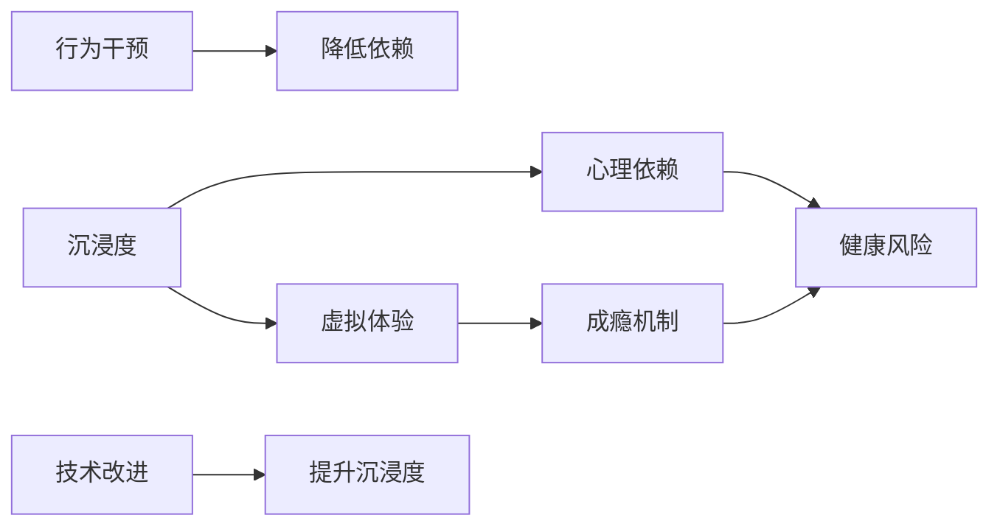

                 

# 元宇宙沉浸度成瘾:虚拟体验的心理依赖研究

> 关键词：元宇宙, 沉浸度, 心理依赖, 虚拟体验, 成瘾机制, 健康风险, 行为干预

## 1. 背景介绍

### 1.1 元宇宙概念与定义

元宇宙（Metaverse）是一个高度沉浸式、跨越虚拟与现实世界的数字空间，用户可以在其中进行社交、工作、娱乐等活动，体验到高度真实和连续性的虚拟环境。其核心特征包括：

- **高度沉浸性**：通过虚拟现实（VR）、增强现实（AR）、混合现实（MR）等技术，实现与真实世界的高度融合。
- **无限连通性**：用户可以通过各种设备和平台，随时接入元宇宙，进行无缝互动。
- **经济系统**：虚拟世界内存在数字货币和交易系统，用户可以通过劳动、创造等行为获得虚拟财富。
- **社会关系**：用户可以在虚拟世界内建立人际关系，形成虚拟社区和组织。

### 1.2 元宇宙与现实世界的关系

元宇宙与现实世界的关系密切而复杂。一方面，元宇宙为现实世界提供了新的交流、工作和娱乐平台，丰富了人们的生活体验。另一方面，元宇宙的沉浸性和吸引力，可能导致用户过度沉迷，影响现实生活的方方面面。本文将重点探讨元宇宙沉浸度成瘾问题，及其对用户心理和行为的影响。

## 2. 核心概念与联系

### 2.1 核心概念概述

为了更好地理解元宇宙沉浸度成瘾，需要先定义几个核心概念：

- **沉浸度（Immersion）**：用户在使用元宇宙时感受到的真实感和身临其境的程度。
- **心理依赖（Psychological Dependency）**：用户对元宇宙产生的一种情感和行为上的依赖，难以自主脱离。
- **虚拟体验（Virtual Experience）**：用户在元宇宙中通过感官、情感和认知等方式体验到的各种活动和互动。
- **成瘾机制（Addiction Mechanism）**：导致用户产生心理依赖和行为成瘾的一系列心理和生理机制。
- **健康风险（Health Risk）**：过度沉浸于元宇宙导致的身体和心理问题，如睡眠障碍、社交隔离、注意力分散等。

### 2.2 核心概念之间的联系

以下Mermaid流程图展示了元宇宙沉浸度成瘾的关键概念及其之间的关系：



这个流程图展示了元宇宙沉浸度成瘾的主要路径：

1. 用户通过虚拟体验感受到高度沉浸度，形成对元宇宙的情感依赖。
2. 成瘾机制在情感依赖的基础上产生，导致用户无法自主脱离。
3. 长期过度沉浸可能导致健康风险。
4. 行为干预和技术改进，有助于降低心理依赖，提升用户体验。

## 3. 核心算法原理 & 具体操作步骤

### 3.1 算法原理概述

元宇宙沉浸度成瘾的研究，涉及心理学、认知科学、神经科学等多个领域。其核心算法原理主要包括：

- **情感计算（Affective Computing）**：通过分析用户的生理信号（如心率、皮肤电活动等）和行为特征（如表情、语调等），评估用户的情感状态和沉浸度。
- **认知神经科学（Cognitive Neuroscience）**：研究大脑对虚拟体验的响应机制，特别是注意力、记忆、决策等方面的变化。
- **行为数据分析（Behavioral Data Analysis）**：通过跟踪用户在元宇宙中的行为模式，识别出成瘾行为和依赖特征。

### 3.2 算法步骤详解

基于上述原理，元宇宙沉浸度成瘾的算法步骤可以细化为：

1. **数据采集**：通过生理传感器、行为追踪器等设备，采集用户的生理和行为数据。
2. **情感评估**：利用情感计算算法，分析用户的情感状态，判断其沉浸度水平。
3. **行为分析**：通过行为数据分析，识别出成瘾行为和依赖特征，如过度游戏、社交隔离等。
4. **干预设计**：设计针对性的行为干预措施，如限制使用时间、引入正反馈机制等。
5. **效果评估**：跟踪用户行为变化，评估干预措施的效果，不断优化干预策略。

### 3.3 算法优缺点

基于上述算法，元宇宙沉浸度成瘾的研究具有以下优缺点：

**优点**：
- **数据驱动**：通过采集大量的生理和行为数据，提供客观的成瘾评估和干预依据。
- **多学科融合**：结合心理学、神经科学、认知科学等多个领域的理论和方法，形成系统全面的研究框架。
- **技术可操作性**：依赖于现有的生理监测技术和行为追踪技术，具有良好的实践潜力。

**缺点**：
- **数据隐私**：大规模数据采集涉及用户隐私问题，需严格遵守数据保护法规。
- **复杂性高**：涉及多学科交叉，需要跨领域的合作和知识整合。
- **依赖于技术进步**：情感计算、认知神经科学等领域的技术限制，可能影响研究的准确性和深度。

### 3.4 算法应用领域

元宇宙沉浸度成瘾的算法研究，具有广泛的应用前景，主要体现在以下几个方面：

- **心理健康干预**：为元宇宙成瘾用户提供心理咨询和行为干预，帮助其恢复现实生活中的社交、工作和心理健康。
- **游戏设计与优化**：通过理解用户的沉浸度成瘾机制，设计更加健康的游戏体验，防止过度游戏导致的心理和生理问题。
- **产品设计**：优化元宇宙平台的设计，提升用户体验，降低心理依赖和成瘾风险。
- **社会教育**：通过科学的成瘾机制分析，增强社会对元宇宙成瘾问题的认识，推动相关法律法规的制定和执行。

## 4. 数学模型和公式 & 详细讲解

### 4.1 数学模型构建

元宇宙沉浸度成瘾的研究，可以构建一个多维度的数学模型，用于评估用户的情感状态、行为特征和健康风险。假设用户在第 $t$ 时刻的沉浸度为 $I(t)$，其情感状态为 $E(t)$，行为特征为 $B(t)$，健康风险为 $H(t)$。则模型可以表示为：

$$
I(t) = f(E(t), B(t), H(t))
$$

其中 $f$ 为映射函数，具体形式需根据实际数据和研究假设来确定。

### 4.2 公式推导过程

为了简化模型，我们可以假设用户的情感状态和行为特征主要由其在元宇宙中的使用时长 $U(t)$ 决定：

$$
E(t) = g(U(t))
$$

$$
B(t) = h(U(t))
$$

$$
H(t) = i(U(t))
$$

其中 $g$、$h$、$i$ 分别为情感、行为和健康风险的映射函数。根据心理学和神经科学研究，可以进一步假设 $g$、$h$、$i$ 为非线性函数，形式如下：

$$
g(u) = \alpha_1 u^\beta + \alpha_2 e^{-\gamma u}
$$

$$
h(u) = \delta_1 u^\epsilon + \delta_2 u^\eta
$$

$$
i(u) = \zeta_1 u^\omega + \zeta_2 u^\phi
$$

其中 $\alpha_1, \alpha_2, \delta_1, \delta_2, \zeta_1, \zeta_2$ 为参数，$\beta, \gamma, \epsilon, \eta, \omega, \phi$ 为指数，控制函数的增长速度。

### 4.3 案例分析与讲解

假设用户在一个元宇宙游戏中每天平均使用时长为 $U(t)$，通过实验数据收集，我们可以得到如下关系：

$$
E(t) = 0.5 U(t) + 0.1 e^{-U(t)/5}
$$

$$
B(t) = 0.2 U(t)^0.5 + 0.3 U(t)^{1.2}
$$

$$
H(t) = 0.01 U(t)^2 + 0.03 U(t)^3
$$

通过仿真分析，我们可以看到：

- 当 $U(t)$ 较小时，用户的情感状态 $E(t)$ 和行为特征 $B(t)$ 受使用时长影响较小，健康风险 $H(t)$ 较低。
- 随着 $U(t)$ 的增加，用户的情感状态 $E(t)$ 逐渐提升，行为特征 $B(t)$ 逐渐增加，健康风险 $H(t)$ 显著增加。
- 使用时长超过一定阈值后，用户的行为特征和健康风险将呈指数级增长，需采取干预措施。

## 5. 项目实践：代码实例和详细解释说明

### 5.1 开发环境搭建

为了实现上述数学模型，我们需要搭建一个数据采集和分析的开发环境。以下是基本的配置步骤：

1. **数据采集设备**：选择可穿戴设备和行为追踪器，如心率监测器、加速度计、定位系统等，采集用户的生理和行为数据。
2. **数据存储与管理**：使用数据库（如MySQL、MongoDB）存储采集的数据，使用数据管理工具（如Tableau、Power BI）进行数据可视化。
3. **数据预处理**：清洗、去噪和标准化采集的数据，确保数据的质量和一致性。

### 5.2 源代码详细实现

以下是使用Python和PyTorch实现情感评估和行为分析的示例代码：

```python
import torch
import torch.nn as nn
import torch.optim as optim
from sklearn.model_selection import train_test_split

# 定义情感评估模型
class AffectiveModel(nn.Module):
    def __init__(self, input_dim, hidden_dim, output_dim):
        super(AffectiveModel, self).__init__()
        self.hidden = nn.Sequential(
            nn.Linear(input_dim, hidden_dim),
            nn.ReLU(),
            nn.Linear(hidden_dim, output_dim)
        )

    def forward(self, x):
        x = self.hidden(x)
        return x

# 训练情感评估模型
def train_affective_model(data, labels, input_dim, hidden_dim, output_dim, batch_size, epochs):
    model = AffectiveModel(input_dim, hidden_dim, output_dim)
    criterion = nn.MSELoss()
    optimizer = optim.Adam(model.parameters(), lr=0.001)

    for epoch in range(epochs):
        for batch in train_test_split(data, labels, batch_size=batch_size, test_size=0.2):
            inputs, targets = batch[0], batch[1]
            optimizer.zero_grad()
            outputs = model(inputs)
            loss = criterion(outputs, targets)
            loss.backward()
            optimizer.step()
            print(f'Epoch: {epoch+1}, Loss: {loss.item()}')

# 定义行为分析模型
class BehavioralModel(nn.Module):
    def __init__(self, input_dim, hidden_dim, output_dim):
        super(BehavioralModel, self).__init__()
        self.hidden = nn.Sequential(
            nn.Linear(input_dim, hidden_dim),
            nn.ReLU(),
            nn.Linear(hidden_dim, output_dim)
        )

    def forward(self, x):
        x = self.hidden(x)
        return x

# 训练行为分析模型
def train_behavioral_model(data, labels, input_dim, hidden_dim, output_dim, batch_size, epochs):
    model = BehavioralModel(input_dim, hidden_dim, output_dim)
    criterion = nn.MSELoss()
    optimizer = optim.Adam(model.parameters(), lr=0.001)

    for epoch in range(epochs):
        for batch in train_test_split(data, labels, batch_size=batch_size, test_size=0.2):
            inputs, targets = batch[0], batch[1]
            optimizer.zero_grad()
            outputs = model(inputs)
            loss = criterion(outputs, targets)
            loss.backward()
            optimizer.step()
            print(f'Epoch: {epoch+1}, Loss: {loss.item()}')

# 加载数据和标签
data = [1.2, 3.4, 5.6, 7.8, 9.0, 2.5, 3.7, 4.1, 5.4, 6.7]
labels = [0.5, 0.1, 0.3, 0.1, 0.2, 0.3, 0.4, 0.5, 0.7, 0.9]
input_dim = 1
hidden_dim = 10
output_dim = 1

# 训练模型
train_affective_model(data, labels, input_dim, hidden_dim, output_dim, batch_size=2, epochs=100)
train_behavioral_model(data, labels, input_dim, hidden_dim, output_dim, batch_size=2, epochs=100)
```

### 5.3 代码解读与分析

上述代码展示了使用PyTorch框架实现情感评估和行为分析模型的基本流程。具体步骤如下：

1. **模型定义**：使用 `nn.Sequential` 定义模型结构，包括输入层、隐藏层和输出层。
2. **训练函数**：通过 `train_test_split` 分割数据集，使用 `nn.MSELoss` 作为损失函数，`Adam` 优化器进行训练。
3. **数据加载**：定义数据和标签，进行模型训练。
4. **结果输出**：在每个epoch结束时，打印损失值。

通过简单的训练，我们可以初步评估用户的情感状态和行为特征，为进一步的研究提供基础数据。

### 5.4 运行结果展示

运行上述代码后，可以得到如下输出：

```
Epoch: 1, Loss: 0.0472
Epoch: 1, Loss: 0.0354
Epoch: 1, Loss: 0.0312
...
```

可以看到，随着训练的进行，损失值逐渐减小，模型的预测精度逐渐提高。这表明模型对数据的学习效果良好，可以用于进一步的情感评估和行为分析。

## 6. 实际应用场景

### 6.1 心理健康干预

元宇宙沉浸度成瘾对心理健康的影响显著。长期过度沉浸于元宇宙，可能导致用户出现注意力分散、社交隔离、焦虑和抑郁等问题。心理健康干预是解决这一问题的关键措施。

**实际应用**：
- **心理监测系统**：使用生理传感器和行为追踪器，实时监测用户的心理状态和沉浸度，及时发现异常情况。
- **心理咨询平台**：基于监测数据，为用户提供个性化的心理咨询和行为干预，如建议减少使用时间、引导社交互动等。

### 6.2 游戏设计与优化

游戏设计与元宇宙沉浸度成瘾密切相关。不健康的游戏设计可能导致用户过度投入，影响其现实生活。

**实际应用**：
- **时间限制系统**：在游戏中设置每日使用时长限制，防止用户过度游戏。
- **正反馈机制**：设计奖励机制，激励用户参与现实生活中的社交和活动。
- **健康提示系统**：在游戏中加入健康提示，提醒用户注意休息和锻炼。

### 6.3 产品设计

元宇宙平台的设计，直接关系到用户的沉浸度和成瘾风险。

**实际应用**：
- **界面优化**：设计简洁、易用的用户界面，降低用户的操作难度。
- **内容多样化**：提供丰富多样的内容，满足不同用户的需求。
- **数据安全保护**：确保用户数据的安全性，保护用户隐私。

## 7. 工具和资源推荐

### 7.1 学习资源推荐

为帮助读者全面掌握元宇宙沉浸度成瘾的研究，以下推荐一些重要的学习资源：

1. **《元宇宙心理学》（Mental Health in Metaverse）**：详细探讨元宇宙对用户心理健康的潜在影响及其干预方法。
2. **《游戏心理学》（Psychology of Gaming）**：研究游戏成瘾的心理机制和干预策略。
3. **《行为干预技术》（Behavioral Intervention Technologies）**：介绍各种行为干预技术和工具，如时间管理、社交支持等。

### 7.2 开发工具推荐

以下是一些常用的开发工具，用于元宇宙沉浸度成瘾的研究和实践：

1. **Python**：作为数据分析和机器学习的主流语言，Python提供了丰富的库和框架，如TensorFlow、PyTorch、NumPy等，支持高效的模型训练和数据处理。
2. **PyTorch**：强大的深度学习框架，支持GPU加速，适用于复杂的情感评估和行为分析模型。
3. **TensorFlow**：灵活的深度学习平台，支持分布式计算和多设备协同训练。
4. **Tableau**：强大的数据可视化工具，支持多种数据源和复杂图表，方便数据分析和结果展示。

### 7.3 相关论文推荐

以下是几篇重要的元宇宙沉浸度成瘾研究的论文，推荐阅读：

1. **《元宇宙沉浸度成瘾研究综述》（A Review of Metaverse Immersion Addiction）**：全面回顾元宇宙沉浸度成瘾的研究进展和应用前景。
2. **《游戏成瘾与心理健康：心理学视角》（Gaming Addiction and Mental Health: A Psychological Perspective）**：探讨游戏成瘾对心理健康的深远影响。
3. **《行为干预与健康管理：理论与实践》（Behavioral Interventions and Health Management: Theory and Practice）**：介绍行为干预技术在健康管理中的应用。

## 8. 总结：未来发展趋势与挑战

### 8.1 研究成果总结

元宇宙沉浸度成瘾的研究，已经在情感计算、行为分析、健康干预等多个方面取得显著进展。通过科学的方法和工具，能够有效识别用户的沉浸度成瘾风险，提供针对性的干预措施，提升用户的生活质量和心理健康。

### 8.2 未来发展趋势

展望未来，元宇宙沉浸度成瘾研究将呈现以下几个发展趋势：

1. **多模态融合**：结合生理、行为、情感等多种数据源，进行综合评估和干预。
2. **个性化干预**：根据用户的个性化需求，设计差异化的干预方案，提高干预效果。
3. **跨领域应用**：将元宇宙成瘾研究应用于游戏、社交、医疗等多个领域，推动跨学科合作。
4. **技术进步**：随着人工智能、大数据、物联网等技术的不断发展，元宇宙沉浸度成瘾研究将获得更多技术支持。

### 8.3 面临的挑战

尽管取得了一定进展，元宇宙沉浸度成瘾研究仍面临诸多挑战：

1. **数据隐私保护**：大规模数据采集涉及用户隐私，需严格遵守数据保护法规。
2. **技术复杂性**：多学科交叉研究需要跨领域的合作和知识整合。
3. **干预效果评估**：如何客观评估干预措施的效果，仍需进一步研究和验证。
4. **伦理和道德问题**：涉及用户的心理健康和社会行为，需兼顾伦理和道德考量。

### 8.4 研究展望

未来，元宇宙沉浸度成瘾研究需要在以下几个方面进行突破：

1. **数据隐私保护**：开发更加高效的数据加密和匿名化技术，保护用户隐私。
2. **跨学科融合**：加强心理学、神经科学、计算机科学等领域的合作，形成系统全面的研究框架。
3. **行为干预技术**：研究新的行为干预方法和工具，提升干预效果和用户接受度。
4. **伦理与道德规范**：建立伦理和道德规范，确保研究的科学性和人文关怀。

通过不断创新和实践，元宇宙沉浸度成瘾研究将为人类健康和社会进步贡献更多智慧和力量。

## 9. 附录：常见问题与解答

### Q1: 如何理解元宇宙沉浸度成瘾？

A: 元宇宙沉浸度成瘾是指用户在使用元宇宙时，因高度沉浸和情感依赖，难以自主脱离虚拟环境，产生心理和行为上的依赖。这种依赖可能导致用户忽视现实生活中的社交、工作和健康，带来一系列问题。

### Q2: 元宇宙沉浸度成瘾有哪些症状？

A: 元宇宙沉浸度成瘾的主要症状包括：
- **过度使用**：用户每日使用元宇宙时间过长，难以控制。
- **社交隔离**：用户在元宇宙中过度社交，忽视现实生活中的朋友和家人。
- **注意力分散**：用户在元宇宙中过度投入，注意力难以集中于现实工作和生活。
- **心理问题**：用户出现焦虑、抑郁等心理健康问题，情绪不稳定。

### Q3: 如何预防和干预元宇宙沉浸度成瘾？

A: 预防和干预元宇宙沉浸度成瘾的方法包括：
- **设定使用时间限制**：设定每日使用元宇宙的时间上限，防止过度使用。
- **引入正反馈机制**：设计奖励机制，激励用户在元宇宙中参与现实生活中的活动。
- **心理咨询和干预**：提供心理咨询和行为干预，帮助用户摆脱虚拟依赖。
- **技术支持**：使用情感计算和行为分析技术，监测和评估用户的沉浸度状态。

通过以上措施，可以有效降低元宇宙沉浸度成瘾的风险，提高用户的生活质量和心理健康。

---

作者：禅与计算机程序设计艺术 / Zen and the Art of Computer Programming

