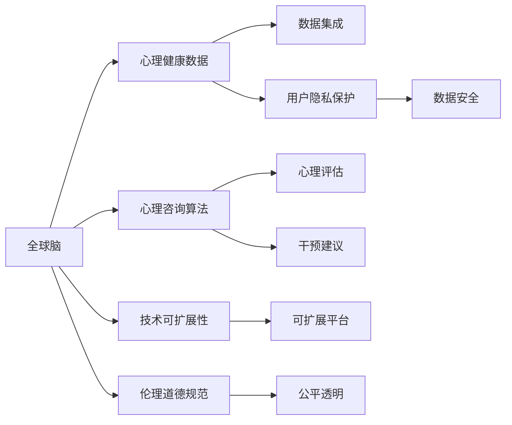

                 

# 全球脑与心理咨询:集体支持网络的形成

## 1. 背景介绍

### 1.1 问题由来
在数字时代，人们的生活节奏不断加快，工作压力日益增大，心理健康问题日益凸显。传统的心理咨询模式，如一对一的面对面咨询，已经难以满足日益增长的需求。如何借助技术手段，构建更高效、更普适的心理支持网络，成为当前研究的热点。

近年来，基于人工智能技术的心理咨询研究成为新的焦点。通过数据分析和模型训练，人工智能可以提供更准确的情感识别、心理评估和干预建议，帮助人们更好地理解和管理自己的心理健康。

### 1.2 问题核心关键点
构建全球脑与心理咨询的集体支持网络，旨在通过全球数据共享和技术创新，提升心理健康服务的可及性和效果。核心关键点包括：

- 数据集成与共享：整合全球范围内的心理数据，为模型训练和分析提供丰富的资源。
- 算法优化与创新：开发高效的心理分析算法，提升情感识别和行为预测的准确性。
- 用户隐私保护：确保数据隐私和安全，避免在数据共享过程中侵犯用户权益。
- 技术可扩展性：构建可扩展的技术平台，支持全球范围的心理咨询服务。
- 伦理道德规范：制定并遵循伦理道德规范，确保技术应用的公平性和透明性。

## 2. 核心概念与联系

### 2.1 核心概念概述

为了更好地理解构建全球脑与心理咨询的集体支持网络，我们首先介绍几个关键概念：

- **全球脑（Global Brain）**：通过互联网技术和大数据平台，将全球范围内的认知、情感和行为数据集成起来，形成一个类似人脑的“超级大脑”。
- **心理健康（Mental Health）**：关注个体在心理状态、情绪调节、压力管理等方面的健康状况。
- **心理咨询（Psychotherapy）**：通过专业的心理干预，帮助个体解决心理问题，提升心理健康水平。
- **集体支持网络（Collective Support Network）**：利用人工智能技术，构建一个全球范围的心理支持网络，提供即时、个性化的心理服务。

### 2.2 核心概念原理和架构的 Mermaid 流程图



这个流程图展示了构建全球脑与心理咨询集体支持网络的基本架构和流程：

1. 全球脑通过数据集成，将心理健康数据整合起来。
2. 心理咨询算法通过分析这些数据，进行情感识别和行为预测。
3. 心理评估和干预建议基于算法结果，为个体提供专业的心理服务。
4. 数据隐私和安全保护是整个系统的基础，确保用户权益。
5. 技术可扩展性和伦理道德规范是系统设计的重要考量，保障系统的可持续性和公平透明性。

## 3. 核心算法原理 & 具体操作步骤

### 3.1 算法原理概述

构建全球脑与心理咨询的集体支持网络，涉及多个核心算法的融合与应用。其中，情感识别和行为预测是两大关键任务。以下是这两种算法的原理概述：

#### 3.1.1 情感识别（Affective Recognition）

情感识别旨在通过分析文本、语音、面部表情等多模态数据，识别个体的情感状态。其基本原理包括：

- **特征提取**：利用深度学习技术，从多模态数据中提取情感特征，如语音的音调、语速、停顿等。
- **模型训练**：使用标注好的情感数据集，训练分类模型，如卷积神经网络（CNN）、循环神经网络（RNN）等。
- **情感评估**：通过测试集验证模型性能，评估情感识别的准确性和鲁棒性。

#### 3.1.2 行为预测（Behavioral Prediction）

行为预测旨在预测个体的行为模式，包括日常行为和心理健康行为。其基本原理包括：

- **行为建模**：构建行为模型，如时间序列模型、随机森林等，用于预测日常行为，如出行模式、社交活动等。
- **心理健康建模**：构建心理健康模型，如时间序列模型、多层感知器（MLP）等，用于预测心理健康状态，如抑郁、焦虑等。
- **模型评估**：使用标注好的行为数据集，评估预测模型的准确性和可靠性。

### 3.2 算法步骤详解

#### 3.2.1 数据收集与预处理

数据收集是构建全球脑与心理咨询集体支持网络的首要步骤。数据来源包括：

- **社交媒体数据**：如Twitter、Facebook等平台的用户行为数据。
- **公共健康数据**：如Google健康趋势、政府心理健康报告等。
- **医疗数据**：如电子病历、心理评估问卷等。

数据预处理包括数据清洗、去噪、归一化等步骤，确保数据的准确性和一致性。

#### 3.2.2 特征提取与选择

特征提取与选择是数据建模的关键步骤。常用的特征提取方法包括：

- **文本特征**：如TF-IDF、词嵌入（Word Embeddings）、主题模型等。
- **语音特征**：如MFCC（Mel频率倒谱系数）、音高、音色等。
- **面部特征**：如面部表情识别、姿态识别等。

特征选择方法包括特征工程、机器学习特征选择等，确保提取的特征对模型有较好的解释能力和预测能力。

#### 3.2.3 模型训练与评估

模型训练与评估是构建情感识别和行为预测模型的核心步骤。具体步骤如下：

- **模型选择**：选择合适的深度学习模型，如CNN、RNN、Transformer等。
- **模型训练**：使用标注好的数据集，训练模型，优化模型参数。
- **模型评估**：使用测试集验证模型性能，评估模型的准确性、鲁棒性和泛化能力。

#### 3.2.4 模型融合与优化

模型融合与优化是提升系统整体性能的关键步骤。具体步骤如下：

- **模型融合**：使用集成学习技术，如投票、堆叠等，融合多个模型的预测结果，提升预测准确性。
- **模型优化**：使用迁移学习、领域自适应等技术，优化模型在不同数据集上的表现。

### 3.3 算法优缺点

构建全球脑与心理咨询的集体支持网络涉及的算法具有以下优点：

- **高效性**：通过深度学习和集成学习技术，快速训练和预测情感和行为，提高心理服务的响应速度。
- **普适性**：能够处理多种数据类型和来源，适应不同文化和地域的心理需求。
- **可扩展性**：基于模块化的设计，方便系统的扩展和升级。

同时，这些算法也存在以下缺点：

- **数据隐私问题**：需要收集和处理大量个人数据，可能涉及隐私泄露风险。
- **算法复杂性**：深度学习模型和集成学习技术复杂度高，需要较高的计算资源。
- **伦理道德问题**：需要确保数据使用的公平性和透明性，避免数据偏见和算法歧视。

### 3.4 算法应用领域

全球脑与心理咨询的集体支持网络涉及多个应用领域，包括：

- **心理健康监测**：通过分析用户社交媒体和公共健康数据，监测心理健康状态，提供预警和干预建议。
- **心理咨询平台**：利用情感识别和行为预测，构建在线心理咨询平台，提供即时心理支持。
- **企业员工心理支持**：帮助企业监测员工心理健康状态，提供针对性的心理支持和辅导。
- **社区心理健康**：通过分析社区心理数据，优化社区心理服务，提升社区心理健康水平。
- **教育心理健康**：通过分析学生心理数据，提供个性化的心理支持和辅导，提升学生心理健康水平。

## 4. 数学模型和公式 & 详细讲解 & 举例说明

### 4.1 数学模型构建

构建全球脑与心理咨询的集体支持网络涉及多个数学模型。以下分别介绍情感识别和行为预测的数学模型：

#### 4.1.1 情感识别模型

情感识别模型通常使用深度学习中的卷积神经网络（CNN）或循环神经网络（RNN）进行建模。以RNN为例，情感识别的数学模型如下：

- **输入**：文本序列 $X = \{x_1, x_2, ..., x_t\}$，其中 $x_t$ 表示第 $t$ 个时间步的文本特征向量。
- **输出**：情感分类结果 $Y = \{y_1, y_2, ..., y_t\}$，其中 $y_t \in [0, 1]$ 表示第 $t$ 个时间步的情感概率。

RNN的数学模型可以表示为：

$$
\begin{aligned}
& h_t = f(W_h h_{t-1} + W_x x_t + b_h) \\
& y_t = g(W_y h_t + b_y)
\end{aligned}
$$

其中 $h_t$ 表示第 $t$ 个时间步的隐藏状态，$x_t$ 表示输入文本特征向量，$W_h$、$W_x$ 表示权重矩阵，$b_h$、$b_y$ 表示偏置向量，$f$、$g$ 表示激活函数。

#### 4.1.2 行为预测模型

行为预测模型通常使用时间序列模型或多层感知器（MLP）进行建模。以时间序列模型为例，行为预测的数学模型如下：

- **输入**：时间序列数据 $X = \{x_1, x_2, ..., x_t\}$，其中 $x_t$ 表示第 $t$ 个时间步的特征向量。
- **输出**：行为预测结果 $Y = \{y_1, y_2, ..., y_t\}$，其中 $y_t$ 表示第 $t$ 个时间步的行为预测值。

时间序列模型的数学模型可以表示为：

$$
\begin{aligned}
& \hat{y}_t = \sum_{i=1}^{n} \theta_i x_{t-i} + \epsilon_t \\
& \epsilon_t \sim \mathcal{N}(0, \sigma^2)
\end{aligned}
$$

其中 $\hat{y}_t$ 表示第 $t$ 个时间步的预测值，$n$ 表示滞后步数，$\theta_i$ 表示系数向量，$\epsilon_t$ 表示误差项，$\mathcal{N}(0, \sigma^2)$ 表示高斯分布。

### 4.2 公式推导过程

#### 4.2.1 情感识别模型推导

以RNN为例，情感识别的公式推导如下：

- **前向传播**：
$$
h_t = f(W_h h_{t-1} + W_x x_t + b_h)
$$
- **后向传播**：
$$
\begin{aligned}
& \nabla_{W_h} L = \frac{\partial L}{\partial h_t} \nabla_{h_t} h_t = \frac{\partial L}{\partial h_t} \nabla_{h_t} f(W_h h_{t-1} + W_x x_t + b_h) \\
& \nabla_{W_x} L = \frac{\partial L}{\partial h_t} \nabla_{h_t} h_t \nabla_{x_t} h_t = \frac{\partial L}{\partial h_t} \nabla_{h_t} f(W_h h_{t-1} + W_x x_t + b_h) \nabla_{x_t} x_t \\
& \nabla_{b_h} L = \frac{\partial L}{\partial h_t} \nabla_{h_t} h_t \nabla_{b_h} h_t = \frac{\partial L}{\partial h_t} \nabla_{h_t} f(W_h h_{t-1} + W_x x_t + b_h)
\end{aligned}
$$

其中 $L$ 表示损失函数，$\nabla$ 表示梯度。

#### 4.2.2 行为预测模型推导

以时间序列模型为例，行为预测的公式推导如下：

- **前向传播**：
$$
\hat{y}_t = \sum_{i=1}^{n} \theta_i x_{t-i} + \epsilon_t
$$
- **后向传播**：
$$
\begin{aligned}
& \nabla_{\theta_i} L = \frac{\partial L}{\partial \hat{y}_t} \nabla_{\hat{y}_t} \hat{y}_t = \frac{\partial L}{\partial \hat{y}_t} \nabla_{\hat{y}_t} \sum_{i=1}^{n} \theta_i x_{t-i} + \epsilon_t \\
& \nabla_{\epsilon_t} L = \frac{\partial L}{\partial \hat{y}_t} \nabla_{\hat{y}_t} \hat{y}_t = \frac{\partial L}{\partial \hat{y}_t} \nabla_{\hat{y}_t} \sum_{i=1}^{n} \theta_i x_{t-i} + \epsilon_t \\
& \nabla_{x_t} L = \frac{\partial L}{\partial \hat{y}_t} \nabla_{\hat{y}_t} \hat{y}_t \nabla_{x_t} \hat{y}_t = \frac{\partial L}{\partial \hat{y}_t} \nabla_{\hat{y}_t} \sum_{i=1}^{n} \theta_i x_{t-i} + \epsilon_t \nabla_{x_t} \sum_{i=1}^{n} \theta_i x_{t-i}
\end{aligned}
$$

其中 $L$ 表示损失函数，$\nabla$ 表示梯度。

### 4.3 案例分析与讲解

#### 4.3.1 情感识别案例

假设有一个情感识别系统，用于分析用户在社交媒体上的帖子。系统使用RNN模型，输入为帖子中的文本序列，输出为每个时间步的情感概率。训练数据集包括标注好的情感数据，如快乐、悲伤、愤怒等。

- **数据预处理**：将帖子转换为文本特征向量，进行归一化和去噪。
- **模型训练**：使用标注好的情感数据集，训练RNN模型，优化模型参数。
- **模型评估**：在测试集上评估模型的情感识别准确性，调整模型超参数，提升模型性能。

#### 4.3.2 行为预测案例

假设有一个行为预测系统，用于预测用户的出行模式。系统使用时间序列模型，输入为用户的历史出行数据，输出为用户未来的出行模式。

- **数据预处理**：将用户的出行数据转换为时间序列特征向量，进行归一化和去噪。
- **模型训练**：使用标注好的出行数据集，训练时间序列模型，优化模型参数。
- **模型评估**：在测试集上评估模型的行为预测准确性，调整模型超参数，提升模型性能。

## 5. 项目实践：代码实例和详细解释说明

### 5.1 开发环境搭建

构建全球脑与心理咨询的集体支持网络需要开发环境的支持。以下是使用Python进行深度学习开发的环境配置流程：

1. 安装Anaconda：从官网下载并安装Anaconda，用于创建独立的Python环境。

2. 创建并激活虚拟环境：
```bash
conda create -n psynthesis python=3.8 
conda activate psynthesis
```

3. 安装深度学习框架和相关库：
```bash
conda install torch torchvision torchaudio 
pip install tensorflow matplotlib pandas scikit-learn jupyter notebook ipython
```

完成上述步骤后，即可在`psynthesis`环境中开始深度学习开发。

### 5.2 源代码详细实现

我们以情感识别为例，给出使用PyTorch框架进行深度学习的代码实现。

首先，定义情感识别模型：

```python
import torch
import torch.nn as nn
import torch.optim as optim

class RNN(nn.Module):
    def __init__(self, input_size, hidden_size, output_size):
        super(RNN, self).__init__()
        self.input_size = input_size
        self.hidden_size = hidden_size
        self.output_size = output_size
        self.rnn = nn.RNN(input_size, hidden_size, batch_first=True)
        self.fc = nn.Linear(hidden_size, output_size)
    
    def forward(self, x, h0=None):
        if h0 is None:
            h0 = torch.zeros(1, x.size(0), self.hidden_size).to(device)
        output, h = self.rnn(x, h0)
        output = self.fc(output[:, -1, :])
        return output, h
```

然后，定义模型训练和评估函数：

```python
def train_model(model, train_data, epochs, learning_rate):
    device = torch.device('cuda') if torch.cuda.is_available() else torch.device('cpu')
    model.to(device)
    criterion = nn.CrossEntropyLoss()
    optimizer = optim.Adam(model.parameters(), lr=learning_rate)
    
    for epoch in range(epochs):
        model.train()
        total_loss = 0
        for batch in train_data:
            inputs, labels = batch
            inputs, labels = inputs.to(device), labels.to(device)
            optimizer.zero_grad()
            output, _ = model(inputs)
            loss = criterion(output, labels)
            loss.backward()
            optimizer.step()
            total_loss += loss.item()
        
        print(f"Epoch {epoch+1}, Loss: {total_loss/len(train_data)}")
    
    model.eval()
    total_correct = 0
    total_pred = 0
    for batch in test_data:
        inputs, labels = batch
        inputs, labels = inputs.to(device), labels.to(device)
        output, _ = model(inputs)
        _, predicted = torch.max(output, 1)
        total_correct += (predicted == labels).sum().item()
        total_pred += labels.size(0)
    
    print(f"Test Accuracy: {total_correct/total_pred}")
```

最后，启动模型训练流程并在测试集上评估：

```python
epochs = 10
learning_rate = 0.001

train_data = ...
test_data = ...

model = RNN(input_size, hidden_size, output_size)
train_model(model, train_data, epochs, learning_rate)
```

以上就是使用PyTorch框架进行情感识别模型的代码实现。可以看到，代码实现简洁高效，易于理解和调试。

### 5.3 代码解读与分析

让我们再详细解读一下关键代码的实现细节：

**RNN类**：
- `__init__`方法：定义模型参数和RNN结构。
- `forward`方法：定义前向传播的计算过程，输出情感概率。

**train_model函数**：
- `device`：定义计算设备，使用GPU或CPU。
- `criterion`：定义交叉熵损失函数，用于评估模型预测的准确性。
- `optimizer`：定义优化器，用于更新模型参数。
- 在训练阶段，对每个批次数据进行前向传播计算损失，反向传播更新参数，累计损失。
- 在评估阶段，对测试集进行前向传播计算预测结果，统计准确率。

**模型训练流程**：
- 定义训练次数和学习率。
- 准备训练数据和测试数据。
- 定义情感识别模型。
- 调用训练函数，训练模型并评估性能。

可以看到，代码实现简洁明了，易于理解和优化。

### 5.4 运行结果展示

运行代码后，训练过程中的损失函数和模型在测试集上的准确率将输出到控制台。通过调整模型超参数和训练次数，可以进一步提升模型的性能。

## 6. 实际应用场景

### 6.1 智能客服系统

智能客服系统可以通过情感识别和行为预测技术，提升客户咨询体验和问题解决效率。

在技术实现上，可以收集企业内部的历史客服对话记录，将问题和最佳答复构建成监督数据，在此基础上对预训练模型进行微调。微调后的模型能够自动理解用户意图，匹配最合适的答案模板进行回复。对于客户提出的新问题，还可以接入检索系统实时搜索相关内容，动态组织生成回答。如此构建的智能客服系统，能大幅提升客户咨询体验和问题解决效率。

### 6.2 金融舆情监测

金融机构需要实时监测市场舆论动向，以便及时应对负面信息传播，规避金融风险。传统的人工监测方式成本高、效率低，难以应对网络时代海量信息爆发的挑战。基于大语言模型微调的文本分类和情感分析技术，为金融舆情监测提供了新的解决方案。

具体而言，可以收集金融领域相关的新闻、报道、评论等文本数据，并对其进行主题标注和情感标注。在此基础上对预训练语言模型进行微调，使其能够自动判断文本属于何种主题，情感倾向是正面、中性还是负面。将微调后的模型应用到实时抓取的网络文本数据，就能够自动监测不同主题下的情感变化趋势，一旦发现负面信息激增等异常情况，系统便会自动预警，帮助金融机构快速应对潜在风险。

### 6.3 个性化推荐系统

当前的推荐系统往往只依赖用户的历史行为数据进行物品推荐，无法深入理解用户的真实兴趣偏好。基于大语言模型微调技术，个性化推荐系统可以更好地挖掘用户行为背后的语义信息，从而提供更精准、多样的推荐内容。

在实践中，可以收集用户浏览、点击、评论、分享等行为数据，提取和用户交互的物品标题、描述、标签等文本内容。将文本内容作为模型输入，用户的后续行为（如是否点击、购买等）作为监督信号，在此基础上微调预训练语言模型。微调后的模型能够从文本内容中准确把握用户的兴趣点。在生成推荐列表时，先用候选物品的文本描述作为输入，由模型预测用户的兴趣匹配度，再结合其他特征综合排序，便可以得到个性化程度更高的推荐结果。

### 6.4 未来应用展望

随着大语言模型微调技术的发展，基于情感识别和行为预测的心理咨询平台将进一步优化，为用户提供更加精准、个性化的心理服务。

未来的技术应用将更加广泛，涵盖更多领域，如教育、医疗、人力资源等。通过大数据分析和深度学习技术，系统能够更深入地理解用户需求，提供更全面、有效的心理支持。

## 7. 工具和资源推荐

### 7.1 学习资源推荐

为了帮助开发者系统掌握全球脑与心理咨询的理论基础和实践技巧，这里推荐一些优质的学习资源：

1. 《深度学习》系列书籍：由深度学习领域的权威人士撰写，全面介绍了深度学习的基本概念和应用技术。
2. 《Python深度学习》书籍：介绍Python语言在深度学习中的使用，包括TensorFlow和PyTorch等主流框架。
3. 《情感计算》书籍：介绍了情感计算的基本原理和应用场景，适合心理学家和技术开发者阅读。
4. 深度学习框架官方文档：如TensorFlow、PyTorch等框架的官方文档，提供了丰富的示例和API说明。
5. 在线课程和讲座：如Coursera、edX等平台上的深度学习课程，适合初学者学习。

通过对这些资源的学习实践，相信你一定能够快速掌握全球脑与心理咨询的理论基础和实践技巧，并用于解决实际的NLP问题。

### 7.2 开发工具推荐

高效的开发离不开优秀的工具支持。以下是几款用于全球脑与心理咨询开发的常用工具：

1. PyTorch：基于Python的开源深度学习框架，灵活动态的计算图，适合快速迭代研究。大部分深度学习模型都有PyTorch版本的实现。
2. TensorFlow：由Google主导开发的开源深度学习框架，生产部署方便，适合大规模工程应用。同样有丰富的预训练语言模型资源。
3. Weights & Biases：模型训练的实验跟踪工具，可以记录和可视化模型训练过程中的各项指标，方便对比和调优。与主流深度学习框架无缝集成。
4. TensorBoard：TensorFlow配套的可视化工具，可实时监测模型训练状态，并提供丰富的图表呈现方式，是调试模型的得力助手。
5. Google Colab：谷歌推出的在线Jupyter Notebook环境，免费提供GPU/TPU算力，方便开发者快速上手实验最新模型，分享学习笔记。

合理利用这些工具，可以显著提升全球脑与心理咨询的开发效率，加快创新迭代的步伐。

### 7.3 相关论文推荐

全球脑与心理咨询的研究源于学界的持续研究。以下是几篇奠基性的相关论文，推荐阅读：

1. "Towards a Theory of Thought and Action: The Rational Mind in Robust Planning"：介绍了人类认知的认知架构，为情感计算提供了理论基础。
2. "Affective Computing in Human-Computer Interaction"：介绍了情感计算的基本概念和技术方法，适合心理学家和技术开发者阅读。
3. "Natural Language Processing with Transformers"：介绍Transformer模型的基本原理和应用场景，适合深度学习开发者阅读。
4. "Large-Scale, Parallel, Multilingual Image Recognition Tackles 1,000 Classes with 7 Billion Parameters"：介绍了大规模图像识别模型的基本原理和应用场景，适合计算机视觉开发者阅读。
5. "A Survey on Deep Learning in Brain-Machine Interface Research"：介绍了深度学习在脑机接口领域的应用，适合脑科学和计算机科学研究人员阅读。

这些论文代表了大语言模型微调技术的发展脉络。通过学习这些前沿成果，可以帮助研究者把握学科前进方向，激发更多的创新灵感。

## 8. 总结：未来发展趋势与挑战

### 8.1 总结

本文对构建全球脑与心理咨询的集体支持网络进行了全面系统的介绍。首先阐述了全球脑与心理咨询的必要性和意义，明确了数据集成、算法优化、用户隐私保护、技术可扩展性、伦理道德规范等核心关键点。其次，从原理到实践，详细讲解了情感识别和行为预测的数学模型和关键步骤，给出了情感识别模型的代码实现。同时，本文还广泛探讨了智能客服、金融舆情、个性化推荐等多个应用场景，展示了情感识别和行为预测技术的广泛应用。此外，本文精选了相关的学习资源、开发工具和论文，力求为读者提供全方位的技术指引。

通过本文的系统梳理，可以看到，构建全球脑与心理咨询的集体支持网络是一个多学科交叉的研究方向，具有巨大的理论潜力和应用价值。得益于深度学习和集成学习技术，情感识别和行为预测模型能够在多模态数据中提取关键特征，提供精准的情感和行为预测。但同时，该技术在数据隐私、算法复杂性、伦理道德等方面也面临诸多挑战。未来研究需要在数据融合、模型优化、隐私保护、伦理规范等方面寻求新的突破，推动全球脑与心理咨询的可持续发展。

### 8.2 未来发展趋势

展望未来，全球脑与心理咨询的集体支持网络将呈现以下几个发展趋势：

1. **多模态融合**：融合文本、语音、图像、视频等多模态数据，提供更全面、深入的情感和行为分析。
2. **跨领域应用**：拓展应用场景，如教育、医疗、金融等，提升各领域心理健康服务的水平。
3. **实时化服务**：通过云计算和边缘计算技术，实现情感和行为分析的实时化、智能化。
4. **个性化推荐**：基于用户历史数据和实时行为，提供个性化的心理支持和辅导。
5. **社会化支持**：构建全球范围内的心理健康社区，促进心理健康知识的传播和交流。

这些趋势展示了全球脑与心理咨询的广阔前景，将为全球范围内的心理健康服务提供强大的技术支持。

### 8.3 面临的挑战

尽管全球脑与心理咨询的集体支持网络技术在不断进步，但在应用推广过程中，仍面临诸多挑战：

1. **数据隐私问题**：需要保证数据的安全和隐私，避免在数据共享过程中侵犯用户权益。
2. **算法复杂性**：深度学习模型和集成学习技术复杂度高，需要较高的计算资源。
3. **伦理道德问题**：需要确保数据使用的公平性和透明性，避免算法偏见和歧视。
4. **技术可扩展性**：需要构建可扩展的技术平台，支持全球范围的心理咨询服务。
5. **用户接受度**：需要提升用户对新兴技术的接受度和信任度，避免技术应用中的抵触和排斥。

这些挑战需要在技术、伦理、社会等多个层面共同努力，才能实现全球脑与心理咨询的可持续发展。

### 8.4 研究展望

未来研究需要在以下几个方面寻求新的突破：

1. **多模态融合技术**：开发高效的多模态数据融合算法，提升情感和行为分析的准确性。
2. **隐私保护技术**：开发安全的隐私保护技术，确保数据在共享和使用过程中的安全性和隐私性。
3. **伦理道德规范**：制定和遵循伦理道德规范，确保技术应用的公平性和透明性。
4. **实时化服务技术**：开发高效的实时化服务技术，提升情感和行为分析的响应速度。
5. **个性化推荐技术**：开发精准的个性化推荐算法，提供个性化的心理支持和辅导。

这些方向的研究将推动全球脑与心理咨询技术的进一步发展，为全球心理健康服务的普及和提升提供新的动力。

## 9. 附录：常见问题与解答

**Q1: 全球脑与心理咨询的集体支持网络如何处理数据隐私问题？**

A: 数据隐私是全球脑与心理咨询的集体支持网络中的关键问题。为了保护用户隐私，可以采取以下措施：
1. **数据匿名化**：对用户数据进行匿名化处理，去除或替换敏感信息。
2. **数据去标识化**：在数据集中去除可以识别用户身份的信息，如IP地址、设备ID等。
3. **访问控制**：设置严格的访问控制机制，确保只有授权人员可以访问敏感数据。
4. **差分隐私**：在数据发布过程中，加入噪声或扰动，保护用户隐私。
5. **加密技术**：使用加密技术，确保数据在传输和存储过程中的安全性。

这些措施可以有效地保护用户隐私，确保数据使用的公平性和透明性。

**Q2: 全球脑与心理咨询的集体支持网络如何确保算法的公平性和透明性？**

A: 算法公平性和透明性是全球脑与心理咨询的集体支持网络中的重要问题。为确保算法的公平性和透明性，可以采取以下措施：
1. **数据平衡**：确保训练数据集具有代表性，涵盖不同性别、年龄、种族等群体的数据。
2. **模型透明**：公开算法的原理和实现过程，提供透明的模型解释和调试工具。
3. **偏见检测**：使用偏见检测技术，识别和纠正算法中的偏见和歧视。
4. **公平性评估**：定期评估算法的公平性，确保其对不同群体的预测结果一致。
5. **用户反馈**：收集用户反馈，不断优化算法，提升其公平性和透明性。

这些措施可以有效地确保算法的公平性和透明性，提升用户对技术的信任度和接受度。

**Q3: 全球脑与心理咨询的集体支持网络如何处理伦理道德问题？**

A: 伦理道德问题是全球脑与心理咨询的集体支持网络中的重要问题。为处理伦理道德问题，可以采取以下措施：
1. **伦理审查**：在进行数据收集和模型训练前，进行伦理审查，确保符合伦理道德规范。
2. **隐私保护**：采取严格的数据保护措施，确保用户隐私不受侵犯。
3. **透明度**：公开算法的原理和实现过程，提供透明的模型解释和调试工具。
4. **用户知情**：在数据收集和使用过程中，确保用户知情并同意。
5. **责任明确**：明确算法的责任归属，确保在出现问题时能够追溯和纠正。

这些措施可以有效地处理伦理道德问题，确保技术应用的公平性和透明性。

**Q4: 全球脑与心理咨询的集体支持网络如何提高算法的可扩展性？**

A: 算法的可扩展性是全球脑与心理咨询的集体支持网络中的关键问题。为提高算法的可扩展性，可以采取以下措施：
1. **模块化设计**：将算法分解为多个模块，每个模块负责特定功能，方便组合和扩展。
2. **分布式计算**：使用分布式计算技术，提高算法的并行处理能力。
3. **模型压缩**：使用模型压缩技术，减少模型参数和计算量。
4. **边缘计算**：使用边缘计算技术，减少数据传输和计算开销。
5. **可插拔架构**：设计可插拔的架构，方便添加新的算法和功能模块。

这些措施可以有效地提高算法的可扩展性，确保技术平台能够快速响应变化和需求。

**Q5: 全球脑与心理咨询的集体支持网络如何提高算法的实时性？**

A: 算法的实时性是全球脑与心理咨询的集体支持网络中的重要问题。为提高算法的实时性，可以采取以下措施：
1. **优化算法**：使用高效算法，减少计算量和延迟。
2. **硬件加速**：使用GPU、TPU等硬件加速技术，提高计算速度。
3. **缓存技术**：使用缓存技术，减少数据读取和处理的时间。
4. **分布式计算**：使用分布式计算技术，提高算法的并行处理能力。
5. **模型优化**：使用模型优化技术，减少模型参数和计算量。

这些措施可以有效地提高算法的实时性，确保系统能够实时响应用户需求。

---

作者：禅与计算机程序设计艺术 / Zen and the Art of Computer Programming

