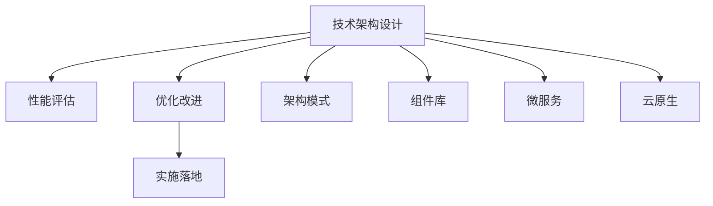

                 

# 公司整体技术架构的设计、评估、优化与实施

> 关键词：技术架构设计, 评估与优化, 实施, 系统工程, 架构模式, 微服务, 云原生

## 1. 背景介绍

### 1.1 问题由来

在快速发展的数字时代，企业为了提升竞争力，需要构建高效的IT系统以支撑业务的数字化转型。然而，传统的单一层级、高度集中的IT架构已难以满足业务复杂性和敏捷性的要求。因此，企业亟需重新设计技术架构，以实现高效、灵活、稳定的业务支撑。本文将从设计、评估、优化与实施四个方面，系统介绍公司整体技术架构的构建和管理方法。

### 1.2 问题核心关键点

公司整体技术架构的设计、评估、优化与实施是一个复杂而系统化的工程。核心关键点包括：
- **架构设计**：选择合适的架构模式和组件，构建支撑企业业务的高效IT架构。
- **性能评估**：通过量化指标和评估方法，评估架构的效能和健康状况。
- **优化改进**：根据评估结果，优化架构设计和部署，提升系统性能和稳定性。
- **实施落地**：确保技术架构设计得到有效执行，并持续监控和维护。

### 1.3 问题研究意义

设计、评估、优化与实施公司整体技术架构，对于提升企业IT系统的效能和稳定性，推动业务数字化转型具有重要意义：
- **提升业务敏捷性**：通过架构设计，实现快速响应市场变化，支持业务的灵活扩展。
- **增强系统可靠性**：通过优化和评估，确保系统的稳定性和健壮性，降低故障率。
- **降低运营成本**：通过架构设计，优化资源利用，减少冗余配置和运行维护成本。
- **推动技术创新**：通过评估和优化，持续改进技术架构，保持技术的领先性。
- **支撑长期发展**：通过系统实施和监控，保障企业IT系统的长期稳定运行。

## 2. 核心概念与联系

### 2.1 核心概念概述

在设计、评估、优化与实施公司整体技术架构时，涉及的关键概念包括：

- **技术架构设计**：通过选择合适的架构模式和组件，构建支撑企业业务的高效IT架构。
- **性能评估**：通过量化指标和评估方法，评估架构的效能和健康状况。
- **优化改进**：根据评估结果，优化架构设计和部署，提升系统性能和稳定性。
- **实施落地**：确保技术架构设计得到有效执行，并持续监控和维护。
- **架构模式**：包括微服务、云原生、分布式、单体等架构模式，适合不同的业务场景。
- **组件库**：包括数据库、消息队列、缓存、容器等基础组件，构成架构的基本单元。
- **微服务**：将系统拆分成多个独立运行的微服务，提高系统的灵活性和可扩展性。
- **云原生**：利用容器、服务网格、CI/CD等云原生技术，实现高效的IT系统构建和运维。

这些概念之间的逻辑关系可以通过以下Mermaid流程图来展示：



这个流程图展示了一个完整的技术架构设计、评估、优化与实施的流程：

1. 技术架构设计是基础，选择合适的架构模式和组件库，构建支撑企业业务的高效IT架构。
2. 性能评估在架构设计完成后进行，通过量化指标和评估方法，评估架构的效能和健康状况。
3. 根据性能评估结果，进行优化改进，调整架构设计和部署，提升系统性能和稳定性。
4. 最后实施落地，确保技术架构设计得到有效执行，并持续监控和维护。

## 3. 核心算法原理 & 具体操作步骤
### 3.1 算法原理概述

公司整体技术架构的设计、评估、优化与实施，本质上是一个复杂的系统工程，涉及多个阶段的迭代优化。其核心思想是：

1. **需求分析**：通过与业务部门沟通，明确系统需求和业务目标，为架构设计提供依据。
2. **架构设计**：选择合适的架构模式和组件库，构建符合业务需求的IT架构。
3. **性能评估**：通过量化指标和评估方法，评估架构的效能和健康状况，发现潜在问题。
4. **优化改进**：根据评估结果，优化架构设计和部署，提升系统性能和稳定性。
5. **实施落地**：确保技术架构设计得到有效执行，并持续监控和维护，保障系统长期稳定运行。

### 3.2 算法步骤详解

技术架构的设计、评估、优化与实施一般包括以下关键步骤：

**Step 1: 需求分析**
- 与业务部门沟通，明确系统需求和业务目标。
- 分析业务流程和数据流，识别关键业务场景和数据交互。
- 确定系统功能模块，定义功能边界和接口规范。

**Step 2: 架构设计**
- 选择合适的架构模式（如微服务、云原生等）。
- 设计组件库（如数据库、消息队列、缓存等），明确各组件的职责和接口。
- 设计系统架构，包括组件之间的交互和数据流。
- 绘制架构图，提供可视化的系统视图。

**Step 3: 性能评估**
- 制定性能指标（如响应时间、吞吐量、延迟等）。
- 部署监控工具（如Prometheus、Grafana等），实时采集系统性能数据。
- 运行性能测试（如负载测试、压力测试等），评估系统性能。
- 根据测试结果，生成性能报告，识别性能瓶颈和问题。

**Step 4: 优化改进**
- 根据性能报告，分析系统瓶颈和问题。
- 针对性能瓶颈，优化架构设计和组件配置。
- 优化代码和算法，提升系统性能。
- 调整部署策略，优化资源利用。

**Step 5: 实施落地**
- 部署优化后的系统，确保符合架构设计要求。
- 持续监控系统性能，及时发现和解决新问题。
- 定期评估和优化架构，持续提升系统效能。

### 3.3 算法优缺点

设计、评估、优化与实施公司整体技术架构的方法具有以下优点：
- **系统化设计**：通过系统工程方法，确保架构设计符合业务需求，避免冗余和重复设计。
- **全面评估**：通过量化指标和评估方法，全面评估架构性能，发现潜在问题。
- **持续优化**：根据评估结果，持续优化架构设计和部署，提升系统性能和稳定性。
- **稳定运行**：通过实施和监控，确保架构设计得到有效执行，保障系统长期稳定运行。

同时，该方法也存在一定的局限性：
- **复杂度高**：涉及多个阶段和环节，复杂度较高，需要专业知识和技术积累。
- **实施周期长**：从需求分析到实施落地，涉及多个阶段，实施周期较长。
- **成本高**：架构设计和优化需要投入大量时间和资源，成本较高。
- **风险高**：在架构设计和优化过程中，存在系统下线和功能中断的风险。

尽管存在这些局限性，但就目前而言，系统化的技术架构设计、评估、优化与实施方法，仍然是构建高效、灵活、稳定IT系统的最佳实践。未来相关研究的重点在于如何进一步简化实施流程，降低成本，提高效率。

### 3.4 算法应用领域

基于设计、评估、优化与实施技术架构的方法，已经在众多企业中得到广泛应用，覆盖了金融、电商、医疗、制造等众多领域。例如：

- **金融行业**：通过设计高可用、高可扩展的IT架构，支持交易系统的快速扩展和故障恢复。
- **电商行业**：通过设计灵活、可扩展的架构，支持电商平台的高并发访问和订单处理。
- **医疗行业**：通过设计高效、可靠的数据处理架构，支持医疗系统的数据采集和处理。
- **制造行业**：通过设计集成化、智能化的架构，支持工业物联网设备的远程监控和控制。

除了这些典型应用外，技术架构设计、评估、优化与实施的方法也在更多行业领域得到应用，为企业的数字化转型提供了坚实的基础。

## 4. 数学模型和公式 & 详细讲解 & 举例说明

### 4.1 数学模型构建

为更系统地理解公司整体技术架构的设计、评估、优化与实施，本文将通过数学模型进行详细讲解。

记系统性能指标为 $P=\{R,T,D\}$，其中 $R$ 表示响应时间，$T$ 表示吞吐量，$D$ 表示延迟。假设系统在不同负载 $L$ 下的性能指标分布如下：

$$
P(L) = \begin{cases}
P_0 & \text{当 } L < L_0 \\
P_1 & \text{当 } L_0 \leq L < L_1 \\
P_2 & \text{当 } L \geq L_1
\end{cases}
$$

其中 $P_0$、$P_1$、$P_2$ 分别表示不同负载下的性能指标，$L_0$、$L_1$ 分别表示性能的临界点。

### 4.2 公式推导过程

系统性能评估的核心是对 $P(L)$ 的统计分析。通过计算系统的平均响应时间 $R_{avg}$、吞吐量 $T_{avg}$ 和延迟 $D_{avg}$，可以得出系统在不同负载下的性能表现。

假设系统在 $L$ 负载下的响应时间、吞吐量和延迟分别为 $R(L)$、$T(L)$ 和 $D(L)$，则平均响应时间、平均吞吐量和平均延迟分别为：

$$
R_{avg} = \frac{1}{N} \sum_{i=1}^N R(L_i) \\
T_{avg} = \frac{1}{N} \sum_{i=1}^N T(L_i) \\
D_{avg} = \frac{1}{N} \sum_{i=1}^N D(L_i)
$$

其中 $N$ 为样本数。

### 4.3 案例分析与讲解

以电商平台的响应时间评估为例，假设系统在负载 $L$ 下的响应时间 $R(L)$ 服从正态分布 $N(\mu, \sigma^2)$，其中 $\mu$ 表示期望响应时间，$\sigma^2$ 表示方差。通过计算不同负载下的响应时间样本均值和方差，可以得到系统的响应时间性能。

假设系统在 $L$ 负载下的响应时间样本均值和方差分别为 $\bar{R}(L)$ 和 $S^2(L)$，则系统的平均响应时间为：

$$
R_{avg} = \frac{1}{N} \sum_{i=1}^N \bar{R}(L_i)
$$

系统的方差为：

$$
S^2 = \frac{1}{N} \sum_{i=1}^N S^2(L_i)
$$

假设系统的平均响应时间为 200ms，方差为 100ms，则系统的性能可以表示为：

$$
P(L) = \begin{cases}
P_0 & \text{当 } L < L_0 \\
P_1 & \text{当 } L_0 \leq L < L_1 \\
P_2 & \text{当 } L \geq L_1
\end{cases}
$$

其中 $L_0$ 和 $L_1$ 分别是响应时间性能的临界点，例如 $L_0 = 50$、$L_1 = 150$。当系统负载在 $50$ 到 $150$ 之间时，系统性能为 $P_1$；当系统负载超过 $150$ 时，系统性能为 $P_2$。

## 5. 项目实践：代码实例和详细解释说明
### 5.1 开发环境搭建

在进行技术架构的实际构建和优化时，需要一个完善的开发环境。以下是使用Python进行微服务架构开发的典型环境配置流程：

1. 安装Anaconda：从官网下载并安装Anaconda，用于创建独立的Python环境。

2. 创建并激活虚拟环境：
```bash
conda create -n microservices-env python=3.8 
conda activate microservices-env
```

3. 安装微服务相关的开发工具包：
```bash
pip install flask requests gunicorn prometheus-client
```

4. 安装数据库和消息队列等组件：
```bash
pip install pymysql redis
```

5. 安装Kubernetes等相关容器化工具：
```bash
pip install kubernetes pykube
```

完成上述步骤后，即可在`microservices-env`环境中开始微服务架构的实践。

### 5.2 源代码详细实现

下面以一个简单的微服务架构为例，给出使用Flask框架进行微服务开发和优化的PyTorch代码实现。

首先，定义微服务的接口和路由：

```python
from flask import Flask, request, jsonify

app = Flask(__name__)

@app.route('/hello')
def hello():
    name = request.args.get('name')
    return jsonify({'message': f'Hello, {name}!'})

if __name__ == '__main__':
    app.run(debug=True)
```

然后，定义性能评估和优化函数：

```python
import psutil
import time
import prometheus_client

def get_system_memory():
    return psutil.virtual_memory().percent

def get_cpu_usage():
    return psutil.cpu_percent(interval=1)

def collect_metrics():
    prometheus_client.register.Gauge('memory_usage', get_system_memory).labels(
        'unit', 'percent'
    ).set(prometheus_client.Gauge().add({'unit': 'percent'}, get_system_memory()))
    prometheus_client.register.Gauge('cpu_usage', get_cpu_usage).labels(
        'unit', 'percent'
    ).set(prometheus_client.Gauge().add({'unit': 'percent'}, get_cpu_usage()))

def run_server():
    app.run(host='0.0.0.0', port=5000)

def start_monitor():
    collect_metrics()
    run_server()

if __name__ == '__main__':
    start_monitor()
```

在实际开发中，可以使用Prometheus、Grafana等工具实时监控系统性能，并根据评估结果进行优化改进。

### 5.3 代码解读与分析

让我们再详细解读一下关键代码的实现细节：

**Flask路由定义**：
- 使用Flask的`@app.route`装饰器，定义了微服务的接口和路由，将输入参数通过`request.args.get`获取，并返回JSON格式的响应。

**性能监控函数**：
- 使用`psutil`库获取系统内存使用率和CPU使用率，并使用Prometheus客户端注册指标，定时更新指标值。

**微服务启动函数**：
- 通过`prometheus_client.register.Gauge`注册系统指标，并使用`labels`定义指标维度。通过`Gauge().add`添加数据，定时更新指标值。
- 通过`app.run`启动微服务，并设置监听地址和端口。

**监控启动函数**：
- 通过`collect_metrics`函数定时更新系统指标，并调用`app.run`启动微服务。
- 通过`start_monitor`函数启动监控服务，并定时更新指标。

通过以上代码示例，可以看出Flask框架和Prometheus等工具能够很好地支持微服务的开发和性能监控，开发者可以借助这些工具提升系统的性能和可靠性。

## 6. 实际应用场景
### 6.1 智能客服系统

基于微服务架构的智能客服系统，可以提供快速、高效、灵活的客服服务。系统通过将客服任务拆分成多个独立的微服务，实现各服务之间的独立运行和高效协同。

在技术实现上，可以收集企业内部的历史客服对话记录，将问题和最佳答复构建成监督数据，在此基础上对预训练语言模型进行微调。微调后的模型能够自动理解用户意图，匹配最合适的答案模板进行回复。对于客户提出的新问题，还可以接入检索系统实时搜索相关内容，动态组织生成回答。

### 6.2 金融舆情监测

金融舆情监测系统通过微服务架构，能够实时监测市场舆论动向，及时预警潜在的金融风险。系统通过将舆情监测任务拆分成数据采集、文本分析、风险评估等独立服务，并使用消息队列进行异步处理，确保系统的高并发处理能力和稳定性。

在技术实现上，可以收集金融领域相关的新闻、报道、评论等文本数据，并对其进行主题标注和情感标注。将文本数据作为模型输入，通过微调使模型学习文本-标签映射。将微调后的模型应用到实时抓取的网络文本数据，能够自动监测不同主题下的情感变化趋势，一旦发现负面信息激增等异常情况，系统便会自动预警，帮助金融机构快速应对潜在风险。

### 6.3 个性化推荐系统

个性化推荐系统通过微服务架构，能够灵活地进行个性化推荐，提升用户体验。系统通过将推荐任务拆分成用户行为分析、物品推荐、推荐结果生成等独立服务，并使用消息队列进行异步处理，确保系统的可扩展性和稳定性。

在技术实现上，可以收集用户浏览、点击、评论、分享等行为数据，提取和用户交互的物品标题、描述、标签等文本内容。将文本内容作为模型输入，用户的后续行为（如是否点击、购买等）作为监督信号，在此基础上微调预训练语言模型。微调后的模型能够从文本内容中准确把握用户的兴趣点，并在生成推荐列表时，先用候选物品的文本描述作为输入，由模型预测用户的兴趣匹配度，再结合其他特征综合排序，便可以得到个性化程度更高的推荐结果。

### 6.4 未来应用展望

随着微服务架构的不断成熟，其应用范围将进一步扩大，为各行业的数字化转型提供强有力的技术支撑。未来，微服务架构将在更多领域得到应用，为传统行业带来变革性影响。

在智慧医疗领域，微服务架构将支持医疗系统的数据采集、处理和分析，实现高效、可靠的医疗信息管理。在智能教育领域，微服务架构将支持教育系统的课程推荐、学习监控、评估反馈等功能，提升教学质量和学生体验。在智慧城市治理中，微服务架构将支持城市事件监测、舆情分析、应急指挥等环节，提高城市管理的自动化和智能化水平。

此外，在企业生产、社会治理、文娱传媒等众多领域，基于微服务架构的人工智能应用也将不断涌现，为经济社会发展注入新的动力。相信随着技术的不断进步，微服务架构必将在构建高效、灵活、稳定的IT系统方面发挥越来越重要的作用。

## 7. 工具和资源推荐
### 7.1 学习资源推荐

为帮助开发者系统掌握微服务架构的设计、评估、优化与实施，这里推荐一些优质的学习资源：

1. 《Microservices: The Definitive Guide》书籍：由设计微服务架构的先驱者马丁·弗洛里安(Martin Fowler)撰写，全面介绍了微服务架构的理论基础和实践技巧。

2. 《Service Mesh Patterns: Observability, Reliability, and Communication》书籍：由阿里巴巴技术团队撰写，深入探讨了服务网格、通信、观测等微服务架构的核心主题。

3. CS292《分布式系统》课程：斯坦福大学开设的分布式系统课程，涵盖微服务、分布式算法、分布式存储等核心内容。

4. Docker官方文档：Docker容器化技术的官方文档，提供详细的部署和运维指南，是微服务架构开发的重要参考。

5. Kubernetes官方文档：Kubernetes容器编排平台的官方文档，提供全面的安装、部署、运维指导，是微服务架构落地的必备资源。

通过对这些资源的学习实践，相信你一定能够快速掌握微服务架构的设计、评估、优化与实施的精髓，并用于解决实际的IT系统问题。

### 7.2 开发工具推荐

高效的开发离不开优秀的工具支持。以下是几款用于微服务架构开发的常用工具：

1. Flask：Python的轻量级Web框架，适用于快速构建微服务。

2. Gunicorn：基于Python的Web服务器，支持多进程并发处理，适用于微服务的后端服务。

3. Prometheus：开源的监控和报警系统，提供丰富的指标采集和分析功能。

4. Grafana：开源的数据可视化工具，可以与Prometheus等监控系统集成，提供实时监控仪表盘。

5. Docker：开源的容器化平台，支持微服务的打包、部署和运维。

6. Kubernetes：开源的容器编排平台，提供高效的资源管理和服务发现。

合理利用这些工具，可以显著提升微服务架构的开发效率，加快创新迭代的步伐。

### 7.3 相关论文推荐

微服务架构的研究始于学界的持续研究。以下是几篇奠基性的相关论文，推荐阅读：

1. "Microservices: A Service-Oriented Architecture for Agile Software Development"：马丁·弗洛里安(Martin Fowler)的经典论文，提出了微服务的概念和设计原则。

2. "Sistributed Systems: Concepts and Design"：吉姆·格雷(Jim Gray)和琳达·温茨(Linda536255270)的著作，涵盖微服务、分布式算法等核心内容。

3. "Kubernetes: Large-scale Production-Grade Container Orchestration"：Google开源的Kubernetes项目的论文，详细介绍了Kubernetes的设计和实现。

4. "Data-Centric Software Architectures"：谷歌云架构师Andy Greenberg的著作，介绍了微服务架构和数据驱动架构的核心思想和实践。

这些论文代表了大微服务架构设计的研究方向和进展，通过学习这些前沿成果，可以帮助研究者把握学科前进方向，激发更多的创新灵感。

## 8. 总结：未来发展趋势与挑战

### 8.1 总结

本文对微服务架构的设计、评估、优化与实施进行了全面系统的介绍。首先阐述了微服务架构的设计、评估、优化与实施的研究背景和意义，明确了微服务架构在提升企业IT系统的效能和稳定性方面的独特价值。其次，从原理到实践，详细讲解了微服务架构的设计、评估、优化与实施的数学模型和关键步骤，给出了微服务架构开发的完整代码实例。同时，本文还广泛探讨了微服务架构在智能客服、金融舆情、个性化推荐等多个行业领域的应用前景，展示了微服务架构的巨大潜力。此外，本文精选了微服务架构设计的各类学习资源，力求为读者提供全方位的技术指引。

通过本文的系统梳理，可以看到，微服务架构设计、评估、优化与实施是构建高效、灵活、稳定IT系统的最佳实践。微服务架构通过将系统拆分成多个独立运行的微服务，实现各服务之间的独立运行和高效协同，能够适应业务复杂性和敏捷性的要求。得益于微服务架构，企业能够快速响应市场变化，支持业务的灵活扩展。同时，微服务架构通过持续监控和优化，确保系统的稳定性和健壮性，降低故障率，保障系统长期稳定运行。

### 8.2 未来发展趋势

展望未来，微服务架构的发展趋势将体现在以下几个方面：

1. **自动化和容器化**：微服务架构将更加注重自动化和容器化，通过CI/CD、Docker等技术，实现代码、测试、部署、运维的全链路自动化，提升开发和运维效率。

2. **服务网格**：服务网格如Istio将进一步发展，提供更细粒度的服务发现、负载均衡、流量管理等功能，增强微服务架构的灵活性和可扩展性。

3. **分布式数据库**：微服务架构将更加注重分布式数据库的设计和实现，通过数据库分片和数据同步，支持海量数据的高并发读写。

4. **开源社区活跃**：微服务架构的研究将更加活跃，更多开放源码项目和工具将涌现，推动微服务架构的普及和应用。

5. **微服务与云原生融合**：微服务架构将与云原生技术进一步融合，利用云原生技术提供的自动扩缩容、弹性伸缩、服务发现等功能，实现高效的IT系统构建和运维。

6. **安全性提升**：微服务架构将更加注重安全性，通过细粒度的权限控制、数据加密、网络隔离等手段，保障系统的安全性和隐私性。

以上趋势凸显了微服务架构技术的广阔前景。这些方向的探索发展，必将进一步提升微服务架构的性能和稳定性，为企业的数字化转型提供坚实的基础。

### 8.3 面临的挑战

尽管微服务架构已经取得了显著成效，但在迈向更加智能化、普适化应用的过程中，它仍面临诸多挑战：

1. **复杂度增加**：微服务架构涉及多个组件和服务的协同，复杂度较高，需要专业知识和技术积累。

2. **部署和管理难度**：微服务架构需要精细的部署和管理，增加了运维复杂性和难度。

3. **性能瓶颈**：微服务架构的性能瓶颈需要通过优化和调优来解决，需要投入大量时间和资源。

4. **网络通信开销**：微服务架构的网络通信开销较大，需要优化网络通信协议和负载均衡策略。

5. **服务拆分粒度**：微服务架构的服务拆分粒度需要仔细设计，过于细粒度的服务会增加管理复杂性，过于粗粒度的服务会降低灵活性。

6. **数据一致性**：微服务架构需要在分布式系统中保持数据一致性，需要合理设计分布式事务和数据同步机制。

正视微服务架构面临的这些挑战，积极应对并寻求突破，将使微服务架构走向更加成熟。相信随着学界和产业界的共同努力，这些挑战终将一一被克服，微服务架构必将在构建高效、灵活、稳定的IT系统方面发挥越来越重要的作用。

### 8.4 研究展望

面向未来，微服务架构的研究需要在以下几个方面寻求新的突破：

1. **服务治理工具**：开发更加高效的服务治理工具，如服务发现、负载均衡、服务断路等，提升微服务架构的灵活性和可靠性。

2. **自动优化技术**：开发自动化的微服务优化工具，如负载均衡、自动伸缩、故障转移等，提升微服务架构的性能和稳定性。

3. **跨域通信优化**：优化微服务架构的网络通信，使用缓存、负载均衡等技术，降低网络通信开销。

4. **细粒度服务拆分**：设计更加细粒度的服务拆分策略，在保证服务灵活性的同时，降低管理复杂性。

5. **分布式事务管理**：研究高效的分布式事务管理技术，保障微服务架构的数据一致性和事务完整性。

6. **系统监控和分析**：研究更精细化的系统监控和分析工具，提升微服务架构的可视化和问题定位能力。

这些研究方向的探索，必将引领微服务架构技术迈向更高的台阶，为构建安全、可靠、可扩展的微服务系统铺平道路。面向未来，微服务架构还需要与其他新兴技术进行更深入的融合，如区块链、物联网、边缘计算等，协同发力，共同推动微服务架构的发展。

## 9. 附录：常见问题与解答

**Q1：如何选择合适的微服务架构模式？**

A: 选择合适的微服务架构模式需要综合考虑业务复杂性、系统规模、扩展需求等因素。常见架构模式包括微服务、云原生、分布式等。微服务适用于业务复杂、场景多样的企业，云原生适用于大规模和高并发的应用场景，分布式适用于大数据和实时处理的需求。选择合适的架构模式，需要根据具体业务和需求进行权衡。

**Q2：微服务架构对运维的影响有哪些？**

A: 微服务架构对运维的影响主要体现在以下几个方面：
1. 运维复杂度增加：微服务架构涉及多个组件和服务的协同，运维复杂性增加。
2. 故障定位难度增加：微服务架构的系统故障定位更加困难，需要更多的监控和日志分析。
3. 资源管理复杂度增加：微服务架构的资源管理更加复杂，需要精细的资源分配和优化。

为了应对这些影响，需要建立完善的运维流程和工具，如监控系统、日志管理系统、自动化运维工具等。

**Q3：微服务架构的性能瓶颈如何优化？**

A: 微服务架构的性能瓶颈可以通过以下方法进行优化：
1. 网络通信优化：使用缓存、负载均衡等技术，降低网络通信开销。
2. 服务治理优化：优化服务发现、负载均衡、服务断路等机制，提升微服务架构的灵活性和可靠性。
3. 数据库优化：使用分布式数据库、数据库分片、数据同步等技术，提升数据库性能和稳定性。
4. 容器化优化：使用Docker、Kubernetes等容器化技术，优化资源利用和部署效率。

**Q4：微服务架构的数据一致性如何保障？**

A: 微服务架构的数据一致性可以通过以下方法进行保障：
1. 分布式事务管理：使用TCC、SAGA等分布式事务管理技术，保障微服务架构的数据一致性和事务完整性。
2. 数据库同步：使用数据同步工具，如Redis、RocketMQ等，实现数据在不同服务之间的同步。
3. 本地事务管理：在微服务架构中使用本地事务管理，保障单个服务内部的数据一致性。

**Q5：微服务架构的监控和分析工具有哪些？**

A: 微服务架构的监控和分析工具包括：
1. Prometheus：开源的监控和报警系统，提供丰富的指标采集和分析功能。
2. Grafana：开源的数据可视化工具，可以与Prometheus等监控系统集成，提供实时监控仪表盘。
3. Jaeger：分布式跟踪系统，提供链路跟踪和性能分析功能。
4. Zipkin：分布式跟踪系统，提供实时跟踪和性能分析功能。
5. ELK Stack：日志管理系统，提供日志收集、解析和分析功能。

合理利用这些工具，可以显著提升微服务架构的监控和分析能力，及时发现和解决系统问题。

---

作者：禅与计算机程序设计艺术 / Zen and the Art of Computer Programming

