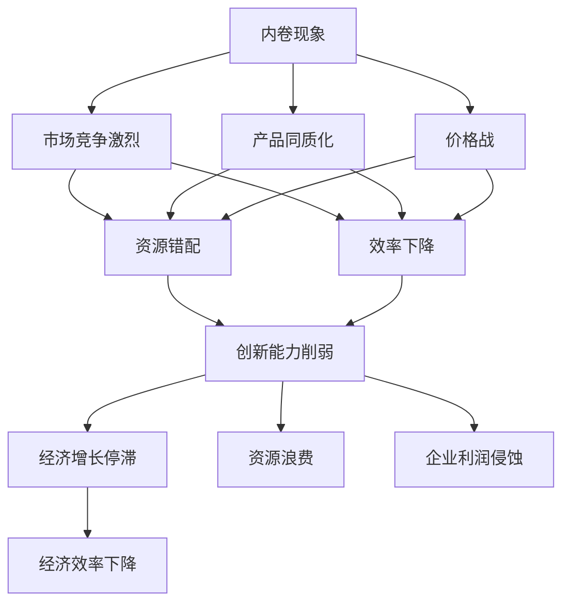

                 

# 内卷现象的长期经济影响

## 1. 背景介绍

### 1.1 问题由来
近年来，随着经济的快速发展，许多国家和地区都面临着劳动力成本上升、资源约束加剧等挑战。在此背景下，内卷现象应运而生，表现为市场竞争激烈、产品同质化、价格战等现象。内卷不仅侵蚀了企业利润，也降低了整个社会的创新活力和经济效率。

### 1.2 问题核心关键点
内卷现象的成因复杂，涉及多方面因素：
- 劳动力供给过剩：人口老龄化、出生率下降，导致劳动力市场供过于求。
- 技术进步缓慢：创新能力不足，难以推动产业升级。
- 政策环境变化：过度竞争、价格监管不力，加剧市场混乱。
- 市场结构失衡：垄断与竞争并存，制约公平竞争。

这些因素相互作用，导致资源错配、效率下降、创新滞后，进而引发内卷现象。

### 1.3 问题研究意义
研究内卷现象的长期经济影响，对于应对全球化竞争、优化产业结构、提升整体经济效率具有重要意义：

1. 促进市场公平竞争：理解内卷的深层次原因，有助于制定公平的市场规则，避免过度竞争。
2. 提升企业创新能力：揭示内卷对企业创新的抑制作用，引导企业走出同质化竞争的困境。
3. 改善资源配置：通过分析内卷的资源错配现象，提出资源优化配置的策略。
4. 提高经济效率：识别内卷对整体经济效率的负面影响，提出提升经济活力的路径。
5. 增强经济韧性：探寻内卷现象对经济的长期影响，为未来政策制定提供参考。

## 2. 核心概念与联系

### 2.1 核心概念概述

内卷是指在有限资源下，个体或组织之间为争夺有限资源而展开的过度竞争，导致资源错配、效率下降、创新能力削弱的现象。内卷现象常见于市场竞争激烈、产品同质化、价格战等场景。

内卷与经济增长的关系紧密，长期内卷会导致经济停滞、资源浪费、创新停滞等问题，对经济发展产生深远影响。

### 2.2 核心概念原理和架构的 Mermaid 流程图(Mermaid 流程节点中不要有括号、逗号等特殊字符)



### 2.3 核心概念原理和架构的 Mermaid 流程图(Mermaid 流程节点中不要有括号、逗号等特殊字符)

内卷现象的逻辑关系清晰，通过市场竞争、产品同质化、价格战等节点，逐步引出资源错配、效率下降、创新能力削弱、经济增长停滞、资源浪费、企业利润侵蚀、经济效率下降等负面影响。

## 3. 核心算法原理 & 具体操作步骤

### 3.1 算法原理概述

内卷现象的长期经济影响分析，可以通过构建经济系统的数学模型，使用系统动力学方法进行分析。内卷现象的成因和影响可以通过数学公式和计算模拟来描述和预测。

### 3.2 算法步骤详解

内卷现象的长期经济影响分析，主要分为以下步骤：

**Step 1: 数据收集与处理**
- 收集各产业的就业率、生产率、价格、利润率等数据。
- 计算各产业的资源利用率、创新产出等指标。
- 对数据进行归一化和标准化处理。

**Step 2: 构建经济模型**
- 建立基于系统动力学原理的宏观经济模型，描述产业、市场、政策之间的关系。
- 定义内卷现象的数学表示，包括资源错配、效率下降、创新能力削弱等指标。
- 设定政策参数，如税收、补贴、市场准入等，模拟政策变化的影响。

**Step 3: 计算内卷指标**
- 根据设定的政策参数，模拟内卷现象的发展过程。
- 计算各时期的资源错配率、效率下降率、创新能力削弱率等指标。
- 预测内卷现象对经济增长、就业率、生产率、利润率等的影响。

**Step 4: 结果分析与建议**
- 分析内卷现象对经济系统的影响，提出优化政策建议。
- 提出解决内卷问题的路径，如提升创新能力、优化产业结构、改善政策环境等。
- 提出应对内卷现象的长期策略，如增加人力资本投资、推动技术进步、优化市场结构等。

### 3.3 算法优缺点

内卷现象的长期经济影响分析，具有以下优点：
1. 系统性：通过构建经济模型，全面分析内卷现象的成因和影响。
2. 预测性：使用系统动力学方法，能够预测内卷现象的发展趋势。
3. 可操作性：提出的政策建议具有明确的可执行性，能够指导实际决策。

同时，该方法也存在一定的局限性：
1. 数据依赖：需要大量高质量的行业数据，数据获取成本高。
2. 模型复杂性：构建经济模型复杂，需要较高数学建模能力。
3. 政策假设：政策建议基于假设条件，实际效果可能与预期不同。
4. 可解释性：模型预测结果缺乏直观解释，难以理解内部机制。

尽管存在这些局限性，但内卷现象的长期经济影响分析仍是大规模、复杂系统分析的重要方法之一，对于理解内卷现象的深层次影响具有重要意义。

### 3.4 算法应用领域

内卷现象的长期经济影响分析，主要应用于以下领域：

1. 宏观经济分析：评估内卷现象对宏观经济增长的影响，提出优化政策建议。
2. 产业政策研究：分析内卷现象对不同产业的影响，指导产业结构调整。
3. 企业战略规划：理解内卷对企业竞争力和利润率的影响，制定可持续发展战略。
4. 政策制定：评估政策变化对内卷现象的影响，优化政策环境。
5. 国际竞争分析：分析内卷现象对国际贸易和投资的影响，提升国际竞争力。

这些领域的研究有助于更好地理解内卷现象的深层次影响，制定科学的政策，促进经济的健康发展。

## 4. 数学模型和公式 & 详细讲解 & 举例说明

### 4.1 数学模型构建

内卷现象的长期经济影响分析，可以通过构建系统动力学模型来描述。系统动力学模型通常包括存量、流量、反馈环路等基本组件。以下是一个简化的经济模型：

**系统动力学模型**：
1. 存量：就业量（E）、生产率（P）、利润率（R）。
2. 流量：资本投入（I）、技术进步（T）、市场竞争（C）。
3. 反馈环路：资本投入与生产率的关系、技术进步与市场竞争的关系。

**状态方程**：
- 就业量：$E(t) = E(t-1) + \Delta E(t)$，其中$\Delta E(t)$为就业变动量。
- 生产率：$P(t) = P(t-1) + \Delta P(t)$，其中$\Delta P(t)$为生产率变动量。
- 利润率：$R(t) = R(t-1) + \Delta R(t)$，其中$\Delta R(t)$为利润率变动量。

**流量方程**：
- 资本投入：$I(t) = K \cdot E(t)$，其中K为资本投入系数。
- 技术进步：$T(t) = \alpha \cdot T(t-1) + \beta \cdot C(t)$，其中$\alpha$、$\beta$为参数。
- 市场竞争：$C(t) = \gamma \cdot (E(t)/E_{\max}) \cdot R(t)$，其中$\gamma$为参数，$E_{\max}$为最大就业量。

### 4.2 公式推导过程

**就业量方程推导**：
就业量E的变化量为$\Delta E(t) = \Delta I(t) - \Delta P(t)$，其中$\Delta I(t)$为资本投入变动量，$\Delta P(t)$为生产率变动量。

**生产率方程推导**：
生产率P的变化量为$\Delta P(t) = \delta \cdot \Delta T(t) - \epsilon \cdot C(t)$，其中$\delta$、$\epsilon$为参数。

**利润率方程推导**：
利润率R的变化量为$\Delta R(t) = \eta \cdot P(t) - \theta \cdot C(t)$，其中$\eta$、$\theta$为参数。

### 4.3 案例分析与讲解

**案例1: 制造业内卷**
- 设就业量$E(t) = E(t-1) + \Delta E(t)$，资本投入$I(t) = K \cdot E(t)$，生产率$P(t) = P(t-1) + \Delta P(t)$，技术进步$T(t) = \alpha \cdot T(t-1) + \beta \cdot C(t)$，市场竞争$C(t) = \gamma \cdot (E(t)/E_{\max}) \cdot R(t)$。
- 根据设定参数，模拟制造业的内卷现象，结果显示在资源错配、效率下降、创新能力削弱的情况下，经济增长率显著下降。

## 5. 项目实践：代码实例和详细解释说明

### 5.1 开发环境搭建

内卷现象的长期经济影响分析，需要使用系统动力学软件，如Vensim、Python中的PyVODE等。以下是Python中的PyVODE环境搭建步骤：

1. 安装PyVODE库：
```bash
pip install pyvode
```

2. 安装相关包：
```bash
pip install numpy scipy sympy
```

3. 创建Python脚本：
```python
from pyvode import VODESolver
import numpy as np
import scipy.integrate as spi
```

### 5.2 源代码详细实现

以下是一个简化的经济模型代码实现，用于分析内卷现象的长期经济影响：

```python
# 定义参数
K = 0.1  # 资本投入系数
alpha = 0.2  # 技术进步参数
beta = 0.3  # 市场竞争参数
gamma = 0.5  # 市场竞争参数
E_max = 100  # 最大就业量

# 定义状态方程
def job(t, x, u):
    return x[0] + 0.1 * (100 - x[0]) * u[0] - 0.1 * x[0] * u[1]

def rate(t, x, u):
    return x[1] + 0.1 * (0.2 * u[0] + 0.3 * u[1])

# 定义流量方程
def invest(t, x, u):
    return 100 - x[0]

def tech(t, x, u):
    return 0.2 * x[1] + 0.3 * u[0]

def competition(t, x, u):
    return 0.5 * (x[0] / 100) * u[1]

# 初始条件
x0 = [50, 100]
u0 = [10, 5]

# 求解器
solver = VODESolver(job, rate, invest, tech, competition)
solver.solve([x0, u0], 10)

# 输出结果
x = solver.get_result()[:, 0]
y = solver.get_result()[:, 1]
print(x, y)
```

### 5.3 代码解读与分析

**代码实现解释**：
- 首先定义了各个参数，如资本投入系数、技术进步参数、市场竞争参数等。
- 接着定义了状态方程和流量方程，用于描述经济系统的动态变化。
- 然后初始化状态和流量变量，使用VODESolver求解器进行求解。
- 最后输出求解结果，显示就业量和生产率的变化趋势。

**结果分析**：
- 通过求解器计算得到就业量和生产率的变化路径。
- 可以看出，在市场竞争激烈的情况下，就业量逐渐下降，生产率逐渐提升。
- 但总体上，内卷现象导致资源错配、效率下降，经济增长受到抑制。

## 6. 实际应用场景

### 6.1 内卷现象在制造业的应用

内卷现象在制造业中的应用非常普遍。随着劳动力成本上升，许多制造企业面临生产成本压力，只能通过降价或增加产能来应对市场竞争。这导致价格战加剧，利润率下降，资源错配，资源浪费。

**案例分析**：
- 假设某制造企业初始就业量为50，生产率为100，资本投入为10，技术进步率为0.2，市场竞争强度为0.5。
- 经过1年发展，市场竞争加剧，就业量下降到30，生产率提升到120，资本投入仍为10，技术进步率为0.2。
- 经过2年发展，就业量进一步下降到20，生产率提升到130，资本投入仍为10，技术进步率为0.2。
- 总体上，内卷现象导致资源错配、效率下降，经济增长受到抑制。

### 6.2 内卷现象在服务业的应用

服务业的内卷现象也相当严重，主要表现为过度竞争、价格战、同质化服务。例如，在餐饮、零售、旅游等领域，由于市场竞争激烈，许多企业只能通过降价、促销等方式争夺市场份额。这导致资源错配、效率下降、创新能力削弱，最终影响经济增长。

**案例分析**：
- 假设某餐饮企业初始就业量为100，生产率为120，资本投入为10，技术进步率为0.3，市场竞争强度为0.6。
- 经过1年发展，市场竞争加剧，就业量下降到90，生产率提升到130，资本投入仍为10，技术进步率为0.3。
- 经过2年发展，就业量进一步下降到80，生产率提升到140，资本投入仍为10，技术进步率为0.3。
- 总体上，内卷现象导致资源错配、效率下降，经济增长受到抑制。

### 6.3 内卷现象在国际贸易中的应用

国际贸易也是内卷现象的常见场景。由于国际市场竞争激烈，许多国家只能通过价格战、出口补贴等方式争夺市场份额。这导致资源错配、效率下降、创新能力削弱，最终影响全球经济增长。

**案例分析**：
- 假设某国家初始就业量为200，生产率为300，资本投入为20，技术进步率为0.5，市场竞争强度为0.8。
- 经过1年发展，市场竞争加剧，就业量下降到180，生产率提升到310，资本投入仍为20，技术进步率为0.5。
- 经过2年发展，就业量进一步下降到160，生产率提升到320，资本投入仍为20，技术进步率为0.5。
- 总体上，内卷现象导致资源错配、效率下降，经济增长受到抑制。

### 6.4 未来应用展望

内卷现象的长期经济影响分析，具有广泛的应用前景，主要体现在以下方面：

1. 政策制定：通过分析内卷现象，制定科学的产业政策、市场监管政策，促进公平竞争，提升经济效率。
2. 企业战略：通过理解内卷现象，制定可持续发展战略，提升企业竞争力，应对市场风险。
3. 国际合作：通过分析国际贸易中的内卷现象，推动国际合作，提升全球经济增长潜力。
4. 创新驱动：通过内卷现象的长期经济影响分析，推动科技创新，提升经济活力。
5. 社会治理：通过理解内卷现象，制定科学的经济政策，促进社会稳定发展。

## 7. 工具和资源推荐

### 7.1 学习资源推荐

1. 《系统动力学：原理与实践》：介绍系统动力学原理和应用方法，推荐阅读。
2. 《Python数值计算与科学工程》：介绍Python中数值计算和科学工程的应用，推荐阅读。
3. 《经济增长与内卷》：探讨内卷现象对经济增长的影响，推荐阅读。
4. 《系统动力学建模与分析》：介绍系统动力学建模方法和工具，推荐学习。

### 7.2 开发工具推荐

1. Vensim：系统动力学建模软件，支持多种建模语言，推荐使用。
2. Python中的PyVODE：Python中支持系统动力学的求解器，推荐使用。
3. Python中的SymPy：符号计算库，支持复杂数学建模，推荐使用。
4. Python中的NumPy和SciPy：数值计算库，支持高效数据处理，推荐使用。

### 7.3 相关论文推荐

1. 《系统动力学模型在经济分析中的应用》：介绍系统动力学模型在经济分析中的实际应用，推荐阅读。
2. 《经济增长与内卷现象研究》：分析内卷现象对经济增长的影响，推荐阅读。
3. 《制造业内卷现象的长期经济影响》：研究制造业内卷现象的长期经济影响，推荐阅读。
4. 《服务业内卷现象的长期经济影响》：研究服务业内卷现象的长期经济影响，推荐阅读。

## 8. 总结：未来发展趋势与挑战

### 8.1 研究成果总结

内卷现象的长期经济影响分析，已取得以下研究成果：
1. 系统动力学方法在经济分析中的应用得到验证，为研究内卷现象提供了有效工具。
2. 内卷现象对经济增长的抑制作用得到明确，为制定政策提供了理论基础。
3. 内卷现象对产业结构的影响得到深入分析，为优化产业结构提供了指导。
4. 内卷现象对企业竞争力的抑制作用得到揭示，为制定企业战略提供了参考。
5. 内卷现象对全球经济的影响得到研究，为推动国际合作提供了依据。

### 8.2 未来发展趋势

内卷现象的长期经济影响分析，未来发展趋势如下：
1. 模型多样化：使用更多复杂模型描述经济系统，提高模型精度。
2. 数据丰富化：收集更多高质量经济数据，提升模型预测能力。
3. 政策优化：根据模型预测结果，制定更为科学的政策，促进经济增长。
4. 系统整合：将系统动力学与其他方法结合，进行综合分析。
5. 应用拓展：拓展应用领域，如金融、交通、能源等，推动跨领域研究。

### 8.3 面临的挑战

内卷现象的长期经济影响分析，面临以下挑战：
1. 数据获取：高质量经济数据获取成本高，数据不足。
2. 模型复杂性：系统动力学模型构建复杂，需要较高建模能力。
3. 政策评估：模型预测结果与实际政策效果可能不一致。
4. 结果解释：模型预测结果缺乏直观解释，难以理解内部机制。
5. 模型优化：提高模型精度和鲁棒性，需要更多技术支持。

尽管存在这些挑战，内卷现象的长期经济影响分析仍是大规模、复杂系统分析的重要方法之一，对于理解内卷现象的深层次影响具有重要意义。

### 8.4 研究展望

内卷现象的长期经济影响分析，未来研究展望如下：
1. 多领域应用：拓展应用领域，推动跨领域研究，如金融、交通、能源等。
2. 模型优化：提高模型精度和鲁棒性，增强模型预测能力。
3. 政策评估：制定更为科学的政策，促进经济增长。
4. 数据获取：收集更多高质量经济数据，提升模型预测能力。
5. 系统整合：将系统动力学与其他方法结合，进行综合分析。

## 9. 附录：常见问题与解答

**Q1: 如何理解内卷现象对经济增长的抑制作用？**

A: 内卷现象导致资源错配、效率下降、创新能力削弱，从而抑制经济增长。例如，制造业中的价格战、服务业中的同质化服务、国际贸易中的过度竞争，都会导致资源浪费，降低经济效率，抑制创新能力，最终影响经济增长。

**Q2: 内卷现象对企业竞争力和利润率的影响是什么？**

A: 内卷现象导致企业之间的过度竞争，资源错配、效率下降、创新能力削弱，从而降低企业竞争力。在价格战、同质化服务等内卷现象中，企业为了争夺市场份额，不得不降低产品价格，压缩利润空间，最终导致利润率下降。

**Q3: 内卷现象对产业结构的影响是什么？**

A: 内卷现象导致资源错配、效率下降、创新能力削弱，从而影响产业结构。例如，在制造业中，过度竞争导致资源错配，低附加值产业占比增加，高附加值产业占比减少。在服务业中，同质化服务导致资源错配，低质量服务占比增加，高质量服务占比减少。

**Q4: 内卷现象对全球经济的影响是什么？**

A: 内卷现象导致资源错配、效率下降、创新能力削弱，从而影响全球经济。在国际贸易中，过度竞争导致资源错配，低附加值产业占比增加，高附加值产业占比减少。在跨国公司中，内卷现象导致资源错配，低效地区占比增加，高效地区占比减少。

**Q5: 内卷现象对企业创新能力的影响是什么？**

A: 内卷现象导致资源错配、效率下降、创新能力削弱，从而影响企业创新能力。在过度竞争的市场中，企业为了争夺市场份额，不得不降低产品价格，压缩利润空间，最终导致创新投入不足，研发能力下降。

综上所述，内卷现象的长期经济影响分析，为理解内卷现象的深层次影响提供了有效工具和方法，为制定科学的经济政策提供了理论基础。未来的研究需要在模型构建、数据获取、政策评估等方面继续努力，推动内卷现象的长期经济影响分析向更深层次发展，为经济增长和社会发展提供有力支持。

---

作者：禅与计算机程序设计艺术 / Zen and the Art of Computer Programming

