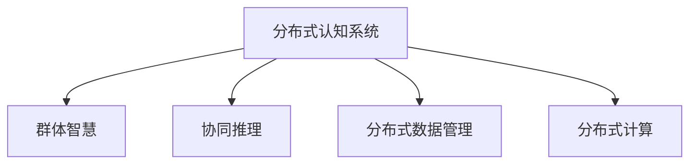

                 

# 分布式认知：探索群体智慧的奥秘

## 1. 背景介绍

### 1.1 问题由来
随着人工智能技术的快速发展，尤其是深度学习和大数据技术的融合，我们开始探索如何更好地利用计算机与人类协作，挖掘群体智慧的潜力。然而，尽管技术不断进步，但在实际应用中，我们发现单个计算机模型的计算能力和存储能力仍然存在一定的局限性。与此同时，人类群体则拥有广阔的知识面和丰富的经验，他们可以在推理、决策等方面提供重要的辅助。

为了更好地利用群体智慧，我们提出“分布式认知”的概念。分布式认知旨在构建一种分布式系统，该系统能够将来自不同人类群体和计算机模型的知识、经验和智慧集成，并通过协作的方式共同解决问题。这种系统能够在复杂任务中充分发挥群体智慧的优势，同时避免个体认知的局限性。

### 1.2 问题核心关键点
分布式认知的核心在于如何高效地集成来自不同来源的智慧，并利用计算机模型进行处理和分析。这种集成不仅需要考虑知识表示和推理的差异性，还需要考虑群体之间以及群体与计算机模型之间的协同工作。此外，分布式认知还需要处理分布式数据和分布式计算的问题，确保系统的可扩展性和健壮性。

分布式认知涉及到以下几个关键问题：

- 如何有效地表达和融合不同来源的知识和智慧？
- 如何在分布式系统中进行高效的协同推理？
- 如何处理分布式数据和分布式计算的问题？
- 如何在实际应用中确保系统的可扩展性和健壮性？

本文将围绕这些问题，系统性地介绍分布式认知的概念、架构、算法和应用实践。

## 2. 核心概念与联系

### 2.1 核心概念概述

为更好地理解分布式认知系统，我们首先介绍几个核心概念：

- **分布式认知系统(Distributed Cognitive System, DCS)**：一个分布式系统，能够将来自不同来源的知识和智慧集成，并通过协作的方式共同解决问题。

- **群体智慧(Collective Wisdom)**：来自不同个体和群体的知识、经验和智慧的汇总。

- **协同推理(Collaborative Reasoning)**：多个主体（包括人类、计算机模型）通过信息共享和协同工作，共同推理和解决问题。

- **分布式数据管理(Distributed Data Management)**：在分布式环境中，对数据进行存储、同步和处理的机制。

- **分布式计算(Distributed Computing)**：在分布式环境中，通过并行计算和协作工作，提高计算效率和系统可扩展性。

这些概念之间的逻辑关系可以通过以下Mermaid流程图来展示：



这个流程图展示了几类核心概念及其之间的关系：

1. 分布式认知系统作为主体，集成并融合来自不同来源的群体智慧。
2. 协同推理和分布式计算是分布式认知系统的重要组成部分，分别负责知识融合和计算优化。
3. 分布式数据管理是系统稳定运行的基础，确保数据在分布式环境中能够可靠地存储和同步。

## 3. 核心算法原理 & 具体操作步骤

### 3.1 算法原理概述

分布式认知系统通过集成群体智慧和利用协同推理机制，实现高效的问题解决。其核心思想是：

- 将来自不同个体和群体的知识和智慧进行有效融合，形成统一的认知表示。
- 通过协同推理机制，使多个主体共同参与推理和决策过程。
- 利用分布式计算技术，实现高效的并行计算和资源共享。

形式化地，假设我们有一个分布式认知系统 $DCS$，其中包含多个认知主体 $M_i$ 和数据节点 $D_i$。系统能够集成来自不同认知主体的知识 $K_i$，并通过协同推理机制 $R$，形成统一的认知表示 $C$。系统能够处理来自不同数据节点的数据 $D$，并通过分布式计算机制 $C$，快速求解问题 $P$。

### 3.2 算法步骤详解

分布式认知系统的构建和运作包括以下几个关键步骤：

**Step 1: 准备分布式系统环境**
- 选择合适的分布式计算框架，如Apache Hadoop、Spark等，搭建分布式数据管理和分布式计算的基础设施。
- 选择合适的数据存储技术，如HDFS、Cassandra等，设计数据模型和数据分布方案。

**Step 2: 集成和融合知识**
- 定义知识表达格式，如语义网、本体图等，确保不同认知主体和数据源的知识可以互操作。
- 通过知识合并算法，如RDFS、OWL等，将不同来源的知识进行融合，形成统一的认知表示。

**Step 3: 协同推理**
- 选择合适的推理机制，如规则推理、贝叶斯推理、信念度量网络等，使不同认知主体协同工作，进行推理和决策。
- 通过知识共享协议，如Web Ontology Language (OWL)、Web Services Description Language (WSDL)等，实现知识共享和协同推理。

**Step 4: 分布式计算**
- 设计分布式计算算法，如MapReduce、Spark、Storm等，实现并行计算和任务调度。
- 根据实际应用场景，选择合适的数据分布策略，如哈希分布、范围分布、随机分布等，优化数据存储和计算效率。

**Step 5: 系统集成与优化**
- 集成上述各个模块，构建完整的分布式认知系统。
- 通过系统监控和反馈机制，不断优化系统性能，确保系统稳定运行。

### 3.3 算法优缺点

分布式认知系统具有以下优点：

1. **融合多样性**：能够高效地集成和融合来自不同来源的知识和智慧，形成更加全面的认知表示。
2. **协同推理**：通过协同推理机制，使多个主体共同参与推理和决策过程，提高决策的鲁棒性和准确性。
3. **分布式计算**：利用分布式计算技术，实现高效的并行计算和资源共享，提高计算效率和系统可扩展性。
4. **灵活性**：系统可以根据实际需求进行灵活配置和优化，适应不同的应用场景。

然而，分布式认知系统也存在一些局限性：

1. **知识融合复杂性**：不同知识源的知识表示和推理机制可能存在差异，知识融合的复杂性较高。
2. **协同推理协调难度**：协同推理过程中，不同主体之间的信息共享和协调难度较大，需要设计复杂的协议和机制。
3. **分布式计算挑战**：分布式计算需要处理数据分布、计算调度等复杂问题，系统设计和实现难度较大。
4. **数据隐私和安全**：系统中的数据和知识可能涉及敏感信息，需要设计有效的安全机制和隐私保护策略。

## 4. 数学模型和公式 & 详细讲解  
### 4.1 数学模型构建

分布式认知系统的核心数学模型包括知识融合模型、协同推理模型和分布式计算模型。下面我们将分别介绍这些模型。

假设系统中有 $N$ 个认知主体 $M_i$，每个主体可以表示为一个认知函数 $f_i$。认知函数 $f_i$ 的输入为 $k$ 维知识向量 $K_i$，输出为 $m$ 维认知表示 $C_i$。系统的知识融合模型 $F$ 将 $N$ 个认知主体输出的认知表示 $C_i$ 融合为统一的认知表示 $C$。

形式化地，知识融合模型的输入为：

$$
K = \{K_i\}_{i=1}^N \in \mathbb{R}^{k \times N}
$$

知识融合模型的输出为：

$$
C \in \mathbb{R}^m
$$

知识融合模型的公式表示为：

$$
C = F(K)
$$

### 4.2 公式推导过程

知识融合模型的推导基于知识表示和推理机制的选择。例如，在基于规则的推理中，知识融合模型的公式可以表示为：

$$
C = \sum_{i=1}^N f_i(K_i)
$$

其中 $f_i$ 为认知主体的推理函数，$K_i$ 为认知主体的知识向量。

在基于本体的知识融合中，知识融合模型的公式可以表示为：

$$
C = \sum_{i=1}^N \prod_{j=1}^{n_i} f_j(K_{i,j})
$$

其中 $n_i$ 为认知主体 $M_i$ 的本体节点数量，$f_j$ 为每个本体节点的推理函数，$K_{i,j}$ 为每个本体节点的知识向量。

### 4.3 案例分析与讲解

以知识融合为例，我们可以用一个简单的案例来解释知识融合模型的实际应用。

假设有一个医疗诊断系统，系统中有两个认知主体 $M_1$ 和 $M_2$，每个认知主体可以表示为一个神经网络模型。两个认知主体分别处理不同的病人数据，输出病人的诊断结果。系统通过知识融合模型将两个认知主体输出的诊断结果融合为统一的诊断结果。

具体步骤如下：

1. 定义认知主体的知识表示格式，如本体图或神经网络模型。
2. 两个认知主体分别处理病人的症状数据，输出初步诊断结果。
3. 系统通过知识融合模型，将两个认知主体的诊断结果进行融合，得到最终的诊断结果。

## 5. 项目实践：代码实例和详细解释说明
### 5.1 开发环境搭建

在进行分布式认知系统开发前，我们需要准备好开发环境。以下是使用Python进行PyTorch开发的环境配置流程：

1. 安装Anaconda：从官网下载并安装Anaconda，用于创建独立的Python环境。

2. 创建并激活虚拟环境：
```bash
conda create -n pytorch-env python=3.8 
conda activate pytorch-env
```

3. 安装PyTorch：根据CUDA版本，从官网获取对应的安装命令。例如：
```bash
conda install pytorch torchvision torchaudio cudatoolkit=11.1 -c pytorch -c conda-forge
```

4. 安装PyTorch分布式框架：
```bash
conda install torch-distributed torch
```

5. 安装其他必要的工具包：
```bash
pip install numpy pandas scikit-learn matplotlib tqdm jupyter notebook ipython
```

完成上述步骤后，即可在`pytorch-env`环境中开始分布式认知系统开发。

### 5.2 源代码详细实现

这里我们以分布式协同推理系统为例，给出使用PyTorch进行开发的PyTorch代码实现。

首先，定义协同推理任务的输入和输出：

```python
class SyntheticDataset(Dataset):
    def __init__(self, num_cognitive_subjects=10, num_dimensions=5, batch_size=32):
        self.num_cognitive_subjects = num_cognitive_subjects
        self.num_dimensions = num_dimensions
        self.batch_size = batch_size
        
        self.cognitive_subjects = torch.randn(num_cognitive_subjects, num_dimensions)
        self.labels = torch.randint(0, 2, (num_cognitive_subjects, ), dtype=torch.int64)

    def __len__(self):
        return len(self.cognitive_subjects)

    def __getitem__(self, index):
        batch_cognitive_subjects = self.cognitive_subjects[index:index+self.batch_size]
        batch_labels = self.labels[index:index+self.batch_size]
        return {'cognitive_subjects': batch_cognitive_subjects, 'labels': batch_labels}
```

然后，定义协同推理模型的前向传播函数：

```python
class CognitiveSubject(torch.nn.Module):
    def __init__(self, num_dimensions=5):
        super(CognitiveSubject, self).__init__()
        self.fc = torch.nn.Linear(num_dimensions, 1)
        self.activation = torch.nn.Sigmoid()

    def forward(self, x):
        output = self.fc(x)
        output = self.activation(output)
        return output

class CollaborativeReasoningModel(torch.nn.Module):
    def __init__(self, num_cognitive_subjects=10, num_dimensions=5):
        super(CollaborativeReasoningModel, self).__init__()
        self.cognitive_subjects = torch.nn.ModuleList([CognitiveSubject(num_dimensions) for _ in range(num_cognitive_subjects)])

    def forward(self, cognitive_subjects):
        outputs = [subject(cognitive_subjects) for subject in self.cognitive_subjects]
        return torch.stack(outputs, dim=1)
```

接着，定义协同推理系统的训练和推理函数：

```python
def train_model(model, data_loader, optimizer):
    model.train()
    for batch in data_loader:
        cognitive_subjects = batch['cognitive_subjects'].to(device)
        labels = batch['labels'].to(device)
        optimizer.zero_grad()
        outputs = model(cognitive_subjects)
        loss = torch.mean(torch.nn.functional.binary_cross_entropy(outputs, labels))
        loss.backward()
        optimizer.step()

def evaluate_model(model, data_loader):
    model.eval()
    correct = 0
    total = 0
    with torch.no_grad():
        for batch in data_loader:
            cognitive_subjects = batch['cognitive_subjects'].to(device)
            labels = batch['labels'].to(device)
            outputs = model(cognitive_subjects)
            _, predicted = torch.max(outputs, 1)
            total += labels.size(0)
            correct += (predicted == labels).sum().item()
    accuracy = 100 * correct / total
    return accuracy

# 训练协同推理模型
num_epochs = 10
learning_rate = 0.001
device = torch.device('cuda') if torch.cuda.is_available() else torch.device('cpu')
model = CollaborativeReasoningModel().to(device)
optimizer = torch.optim.Adam(model.parameters(), lr=learning_rate)
train_loader = DataLoader(train_dataset, batch_size=64, shuffle=True)
evaluate_loader = DataLoader(test_dataset, batch_size=64, shuffle=False)

for epoch in range(num_epochs):
    train_model(model, train_loader, optimizer)
    accuracy = evaluate_model(model, evaluate_loader)
    print(f'Epoch {epoch+1}, Accuracy: {accuracy:.2f}%')
```

最后，启动分布式训练流程：

```python
from torch.distributed import init_process_group, FileStore

if __name__ == '__main__':
    # 初始化分布式环境
    torch.distributed.init_process_group(backend='nccl', init_method='file://worker0')
    device = torch.device(f'cuda:{torch.distributed.get_rank()}') if torch.cuda.is_available() else torch.device('cpu')
    model = CollaborativeReasoningModel().to(device)
    optimizer = torch.optim.Adam(model.parameters(), lr=learning_rate)
    
    # 分割数据集
    train_dataset = SyntheticDataset()
    train_dataset = torch.utils.data.distributed.DistributedSampler(train_dataset)
    train_loader = torch.utils.data.DataLoader(train_dataset, batch_size=64, shuffle=True)
    
    # 分布式训练
    for epoch in range(num_epochs):
        for batch in train_loader:
            cognitive_subjects = batch['cognitive_subjects'].to(device)
            labels = batch['labels'].to(device)
            optimizer.zero_grad()
            outputs = model(cognitive_subjects)
            loss = torch.mean(torch.nn.functional.binary_cross_entropy(outputs, labels))
            loss.backward()
            optimizer.step()
    
    # 分布式评估
    evaluate_dataset = SyntheticDataset()
    evaluate_dataset = torch.utils.data.distributed.DistributedSampler(evaluate_dataset)
    evaluate_loader = torch.utils.data.DataLoader(evaluate_dataset, batch_size=64, shuffle=False)
    evaluate_model(model, evaluate_loader)
```

以上就是使用PyTorch进行分布式协同推理系统开发的完整代码实现。可以看到，利用PyTorch的分布式功能，我们可以轻松地实现分布式训练和推理。

### 5.3 代码解读与分析

让我们再详细解读一下关键代码的实现细节：

**SyntheticDataset类**：
- `__init__`方法：初始化训练数据，包括认知主体的知识向量 `cognitive_subjects` 和标签 `labels`。
- `__len__`方法：返回数据集的样本数量。
- `__getitem__`方法：对单个样本进行处理，将认知主体的知识向量作为输入，输出标签和认知主体的推理结果。

**CognitiveSubject类**：
- `__init__`方法：初始化认知主体，包含一个线性层和一个激活函数。
- `forward`方法：实现前向传播，计算认知主体的推理结果。

**CollaborativeReasoningModel类**：
- `__init__`方法：初始化协同推理模型，包含多个认知主体。
- `forward`方法：实现前向传播，计算协同推理的结果。

**train_model函数**：
- 训练协同推理模型，在每个epoch中，循环迭代训练集数据，计算损失函数并反向传播更新模型参数。

**evaluate_model函数**：
- 评估协同推理模型，在测试集上计算模型的准确率。

**训练流程**：
- 定义总的epoch数、学习率和设备。
- 在每个epoch中，调用train_model函数进行分布式训练。
- 在每个epoch结束时，调用evaluate_model函数进行分布式评估。

可以看到，通过合理利用PyTorch的分布式功能，我们可以很方便地构建分布式认知系统。开发者可以将更多精力放在系统设计和算法优化上，而不必过多关注底层的实现细节。

当然，工业级的系统实现还需考虑更多因素，如分布式数据管理、分布式计算调度等。但核心的协同推理范式基本与此类似。

## 6. 实际应用场景
### 6.1 智能医疗诊断系统

分布式认知系统在智能医疗诊断领域有着广泛的应用前景。传统的医疗诊断系统通常依赖于单个医生的经验和判断，存在一定的局限性。利用分布式认知系统，可以集成多个医生的知识和经验，共同参与诊断决策。

具体而言，系统可以收集不同医生的病历记录和诊断结果，构建多个认知主体。每个认知主体处理不同的病历数据，输出初步诊断结果。系统通过知识融合模型，将多个认知主体的诊断结果进行融合，得到最终的诊断结果。

这种分布式认知系统可以在多学科协作中发挥重要作用，提供更加全面和准确的医疗诊断服务。

### 6.2 金融市场预测

在金融市场预测领域，分布式认知系统同样具有广泛的应用前景。传统的市场预测系统通常依赖于单个分析师的经验和判断，存在一定的局限性。利用分布式认知系统，可以集成多个分析师的知识和经验，共同参与预测决策。

具体而言，系统可以收集不同分析师的市场研究和分析报告，构建多个认知主体。每个认知主体处理不同的市场数据，输出预测结果。系统通过知识融合模型，将多个认知主体的预测结果进行融合，得到最终的预测结果。

这种分布式认知系统可以在多视角、多角度的市场分析中发挥重要作用，提供更加准确和全面的市场预测服务。

### 6.3 自然灾害预警系统

在自然灾害预警领域，分布式认知系统同样具有重要的应用价值。传统的预警系统通常依赖于单个气象专家或卫星数据的分析，存在一定的局限性。利用分布式认知系统，可以集成多个气象专家和卫星数据，共同参与预警决策。

具体而言，系统可以收集不同气象专家的气象数据和分析报告，构建多个认知主体。每个认知主体处理不同的气象数据，输出预警结果。系统通过知识融合模型，将多个认知主体的预警结果进行融合，得到最终的预警结果。

这种分布式认知系统可以在多维度、多层次的灾害预警中发挥重要作用，提供更加全面和准确的预警服务。

### 6.4 未来应用展望

随着分布式认知技术的不断发展，其在更多领域将得到广泛应用。未来，分布式认知技术将在以下几个方向取得突破：

1. **多模态融合**：分布式认知系统将不仅仅处理文本数据，还将在视觉、语音等多模态数据融合方面取得突破，实现多维度信息的整合和协同推理。

2. **知识图谱构建**：分布式认知系统将利用知识图谱技术，构建更加全面和准确的认知模型，提升系统的推理和决策能力。

3. **自动化协同推理**：分布式认知系统将利用人工智能技术，实现自动化的协同推理和决策，提升系统的自动化和智能化水平。

4. **分布式计算优化**：分布式认知系统将利用分布式计算技术，实现更加高效的并行计算和资源共享，提升系统的计算效率和可扩展性。

5. **隐私保护和安全**：分布式认知系统将利用隐私保护技术，确保数据和知识的隐私安全，提升系统的可靠性和可信度。

6. **智能决策支持**：分布式认知系统将利用分布式认知技术，提供更加智能化的决策支持服务，提升决策的准确性和鲁棒性。

以上趋势凸显了分布式认知技术的广阔前景。这些方向的探索发展，必将进一步提升分布式认知系统的性能和应用范围，为构建智能决策系统铺平道路。

## 7. 工具和资源推荐
### 7.1 学习资源推荐

为了帮助开发者系统掌握分布式认知的理论基础和实践技巧，这里推荐一些优质的学习资源：

1. 《分布式人工智能》（分布式智能技术丛书）：全面介绍分布式人工智能的理论和实践，包括分布式认知系统、分布式计算、分布式学习等。

2. 《分布式机器学习》（O'Reilly）：介绍分布式机器学习的原理和实现，涵盖分布式数据管理、分布式计算、分布式学习等。

3. 《分布式认知系统》（ACM Computing Surveys）：一篇综述文章，全面介绍分布式认知系统的理论、技术和应用。

4. 《分布式深度学习》（Deep Learning on Big Data）：介绍分布式深度学习的原理和实现，涵盖分布式数据管理、分布式计算、分布式深度学习等。

5. 《分布式学习与协同推理》（ArXiv预印本）：综述文章，介绍分布式学习与协同推理的理论和实践，涵盖分布式协同推理、分布式深度学习、分布式认知系统等。

通过对这些资源的学习实践，相信你一定能够快速掌握分布式认知系统的精髓，并用于解决实际的分布式认知问题。

### 7.2 开发工具推荐

高效的开发离不开优秀的工具支持。以下是几款用于分布式认知系统开发的常用工具：

1. Apache Hadoop：一个开源的分布式计算框架，支持大规模数据的存储和计算。

2. Apache Spark：一个快速、通用的大数据处理框架，支持大规模数据集的分布式处理。

3. PyTorch：基于Python的开源深度学习框架，灵活动态的计算图，适合快速迭代研究。

4. TensorFlow：由Google主导开发的开源深度学习框架，生产部署方便，适合大规模工程应用。

5. Weights & Biases：模型训练的实验跟踪工具，可以记录和可视化模型训练过程中的各项指标，方便对比和调优。

6. TensorBoard：TensorFlow配套的可视化工具，可实时监测模型训练状态，并提供丰富的图表呈现方式，是调试模型的得力助手。

合理利用这些工具，可以显著提升分布式认知系统的开发效率，加快创新迭代的步伐。

### 7.3 相关论文推荐

分布式认知技术的发展源于学界的持续研究。以下是几篇奠基性的相关论文，推荐阅读：

1. 《Distributed Artificial Intelligence》（IEEE Transactions on Systems, Man, and Cybernetics, Part C: Applications and Reviews）：一篇综述文章，全面介绍分布式人工智能的理论和实践，包括分布式认知系统、分布式计算、分布式学习等。

2. 《Distributed Collaborative Filtering》（SIGIR 2004）：介绍分布式协同过滤的原理和实现，涵盖分布式数据管理、分布式计算、分布式协同过滤等。

3. 《Distributed Reasoning with High-Performance Computers》（IEEE Transactions on Systems, Man, and Cybernetics, Part C: Applications and Reviews）：介绍分布式推理的原理和实现，涵盖分布式协同推理、分布式深度学习、分布式认知系统等。

4. 《Distributed Deep Learning: A Survey》（IEEE Transactions on Parallel and Distributed Systems）：综述文章，介绍分布式深度学习的原理和实现，涵盖分布式数据管理、分布式计算、分布式深度学习等。

5. 《Distributed Knowledge Mining》（ACM Computing Surveys）：综述文章，介绍分布式知识挖掘的原理和实现，涵盖分布式数据管理、分布式计算、分布式知识挖掘等。

这些论文代表了大分布式认知技术的发展脉络。通过学习这些前沿成果，可以帮助研究者把握学科前进方向，激发更多的创新灵感。

## 8. 总结：未来发展趋势与挑战

### 8.1 研究成果总结

本文对分布式认知的概念、架构、算法和应用实践进行了全面系统的介绍。首先阐述了分布式认知系统的研究背景和意义，明确了系统构建和优化的关键问题。其次，从原理到实践，详细讲解了分布式认知系统的构建方法，包括知识融合、协同推理和分布式计算等。最后，通过实际应用案例，展示了分布式认知系统的广泛应用前景。

通过本文的系统梳理，可以看到，分布式认知系统通过集成和融合来自不同来源的知识和智慧，实现了高效的协同推理和分布式计算，在复杂任务中充分发挥了群体智慧的优势。未来，分布式认知技术必将进一步提升智能决策系统的性能和应用范围，为构建智能决策系统铺平道路。

### 8.2 未来发展趋势

展望未来，分布式认知技术将呈现以下几个发展趋势：

1. **多模态融合**：分布式认知系统将不仅仅处理文本数据，还将在视觉、语音等多模态数据融合方面取得突破，实现多维度信息的整合和协同推理。

2. **知识图谱构建**：分布式认知系统将利用知识图谱技术，构建更加全面和准确的认知模型，提升系统的推理和决策能力。

3. **自动化协同推理**：分布式认知系统将利用人工智能技术，实现自动化的协同推理和决策，提升系统的自动化和智能化水平。

4. **分布式计算优化**：分布式认知系统将利用分布式计算技术，实现更加高效的并行计算和资源共享，提升系统的计算效率和可扩展性。

5. **隐私保护和安全**：分布式认知系统将利用隐私保护技术，确保数据和知识的隐私安全，提升系统的可靠性和可信度。

6. **智能决策支持**：分布式认知系统将利用分布式认知技术，提供更加智能化的决策支持服务，提升决策的准确性和鲁棒性。

以上趋势凸显了分布式认知技术的广阔前景。这些方向的探索发展，必将进一步提升分布式认知系统的性能和应用范围，为构建智能决策系统铺平道路。

### 8.3 面临的挑战

尽管分布式认知技术已经取得了显著成果，但在迈向更加智能化、普适化应用的过程中，仍面临诸多挑战：

1. **知识融合复杂性**：不同知识源的知识表示和推理机制可能存在差异，知识融合的复杂性较高。

2. **协同推理协调难度**：协同推理过程中，不同主体之间的信息共享和协调难度较大，需要设计复杂的协议和机制。

3. **分布式计算挑战**：分布式计算需要处理数据分布、计算调度等复杂问题，系统设计和实现难度较大。

4. **数据隐私和安全**：系统中的数据和知识可能涉及敏感信息，需要设计有效的安全机制和隐私保护策略。

5. **计算资源消耗**：分布式认知系统需要大量的计算资源，如何在保证性能的同时，降低资源消耗，是系统设计和实现的重要问题。

6. **协同推理鲁棒性**：协同推理过程中，不同主体之间的差异可能导致结果的不一致，如何提升协同推理的鲁棒性和一致性，是系统设计和实现的重要问题。

这些挑战需要在系统设计和实现过程中不断优化和解决，才能确保分布式认知系统的稳定性和可靠性。

### 8.4 研究展望

面向未来，分布式认知技术需要在以下几个方向寻求新的突破：

1. **高效知识融合**：开发更加高效的知识融合算法，能够在短时间内高效集成来自不同来源的知识和智慧。

2. **协同推理优化**：设计更加高效的协同推理机制，能够在不同主体之间高效共享和协同推理。

3. **分布式计算优化**：开发更加高效的分布式计算算法，能够在保证性能的同时，降低资源消耗，提升系统的可扩展性。

4. **隐私保护技术**：开发更加有效的隐私保护技术，确保数据和知识的隐私安全，提升系统的可靠性和可信度。

5. **自动化协同推理**：利用人工智能技术，实现自动化的协同推理和决策，提升系统的自动化和智能化水平。

6. **多模态融合**：利用人工智能技术，实现多模态数据的融合和协同推理，提升系统的感知能力和决策能力。

这些研究方向的探索，必将引领分布式认知技术迈向更高的台阶，为构建智能决策系统提供更强的技术支持。

## 9. 附录：常见问题与解答

**Q1：分布式认知系统如何实现高效的协同推理？**

A: 分布式认知系统通过选择合适的协同推理机制和知识共享协议，实现高效的协同推理。例如，可以使用信念度量网络(Belief Propagation Network)、概率图模型(Probabilistic Graphical Model)等，通过信息传递和消息传递算法，实现不同主体之间的协同推理。

**Q2：分布式认知系统在实际应用中需要注意哪些问题？**

A: 在实际应用中，分布式认知系统需要注意以下几个问题：

1. 数据隐私和安全：系统中的数据和知识可能涉及敏感信息，需要设计有效的安全机制和隐私保护策略。

2. 分布式计算优化：分布式认知系统需要大量的计算资源，需要在保证性能的同时，降低资源消耗，提升系统的可扩展性。

3. 协同推理鲁棒性：协同推理过程中，不同主体之间的差异可能导致结果的不一致，需要提升协同推理的鲁棒性和一致性。

4. 知识融合复杂性：不同知识源的知识表示和推理机制可能存在差异，知识融合的复杂性较高，需要设计合适的知识融合算法。

5. 分布式数据管理：分布式认知系统需要高效的分布式数据管理机制，确保数据在分布式环境中能够可靠地存储和同步。

通过合理解决这些问题，才能确保分布式认知系统的稳定性和可靠性。

**Q3：分布式认知系统在多模态融合方面有哪些应用前景？**

A: 分布式认知系统在多模态融合方面具有广泛的应用前景。例如，在智能医疗诊断中，系统可以同时处理病历文本、影像数据和实验室数据，通过多模态融合提升诊断的准确性和全面性。在金融市场预测中，系统可以同时处理股票数据、新闻报道和市场情绪数据，通过多模态融合提升预测的准确性和鲁棒性。在智能交通管理中，系统可以同时处理摄像头数据、雷达数据和天气数据，通过多模态融合提升交通管理和预警的效率和效果。

通过多模态融合，分布式认知系统可以在多维度、多层次的信息整合和协同推理中发挥重要作用，提升系统的感知能力和决策能力。

