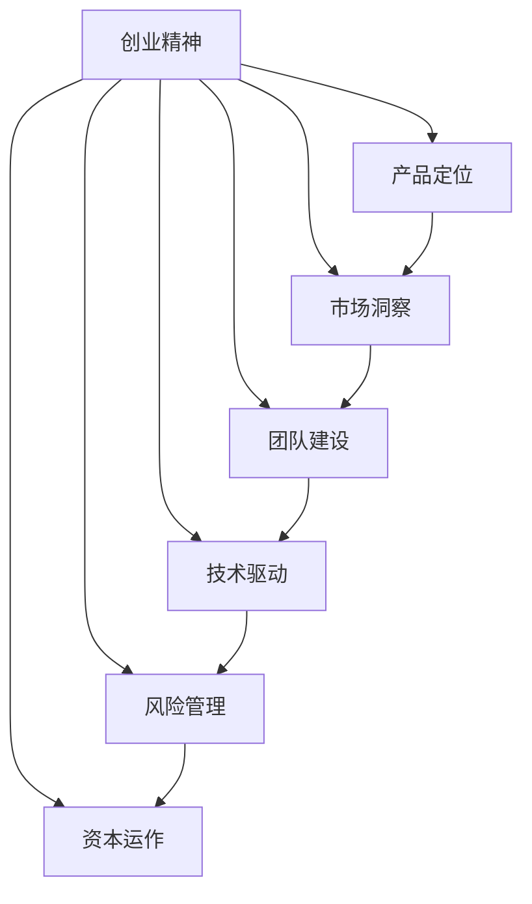

                 

# 创业者的故事：经验与教训

> 关键词：创业精神,产品定位,市场洞察,团队建设,技术驱动,风险管理,资本运作

## 1. 背景介绍

### 1.1 问题由来
在信息技术快速发展的今天，创业成为了一种趋势。从互联网到人工智能，从大数据到区块链，技术变革日新月异，为创业者提供了无限的机遇和挑战。然而，创业之路上并非一帆风顺，很多创业者在追求技术创新的同时，也会经历种种挫折和困惑。本文将以几个真实的创业者故事为例，分享他们的经验与教训，旨在为后来的创业者提供有价值的参考。

### 1.2 问题核心关键点
创业者在创立公司时，需要面临多方面的挑战，包括但不限于：

1. **产品定位**：明确公司的业务方向和目标客户，确定产品的核心价值和竞争优势。
2. **市场洞察**：深入了解市场环境、用户需求和竞争格局，找到突破口。
3. **团队建设**：选拔和培养高素质人才，建立高效的团队合作模式。
4. **技术驱动**：持续创新，保持技术领先优势。
5. **风险管理**：识别和应对潜在的市场、技术、法律风险。
6. **资本运作**：有效管理融资，保障公司长期健康发展。

这些核心关键点贯穿于创业的每一个阶段，对于公司能否成功至关重要。

### 1.3 问题研究意义
分享创业者的故事和经验，有助于创业者更好地理解市场规律，避免重复前人的错误。同时，也能激励后来者勇于探索，不断创新，最终实现技术突破和商业成功。

## 2. 核心概念与联系

### 2.1 核心概念概述

为更好地理解创业的核心概念，本节将介绍几个密切相关的核心概念：

- **创业精神**：指的是创业者内心的驱动力和对目标的执着追求。包括创新思维、市场洞察力、风险承担能力和持续学习的精神。
- **产品定位**：指公司在市场中的定位，包括目标用户、产品功能、市场策略等，确保产品能满足用户需求，并与竞争对手区分开来。
- **市场洞察**：指对市场环境、用户需求、竞争格局的深入理解，从而发现市场机会，制定正确的市场策略。
- **团队建设**：指选拔和培养人才，建立高效协作的团队，实现技术和业务目标。
- **技术驱动**：指公司持续创新，保持技术领先，以满足市场需求，解决用户问题。
- **风险管理**：指识别和评估风险，采取有效措施进行风险控制和应对。
- **资本运作**：指公司如何有效管理融资，保障公司长期发展。

这些核心概念之间的逻辑关系可以通过以下Mermaid流程图来展示：



这个流程图展示了一系列创业中的关键概念及其之间的关系：

1. 创业精神是驱动公司发展的核心动力。
2. 产品定位、市场洞察、团队建设、技术驱动、风险管理和资本运作都是围绕创业精神展开的具体实施策略。
3. 这些策略相互关联，共同构成创业公司成功的关键。

## 3. 核心算法原理 & 具体操作步骤

### 3.1 算法原理概述

创业者在创立公司时，常常需要面对复杂多变的市场环境，需要通过算法和模型来分析和决策。例如，市场洞察可以通过市场分析模型进行，团队建设可以通过人员评估模型进行，风险管理可以通过风险评估模型进行。这些模型和算法虽然涉及不同的领域，但都遵循一定的基本原理。

### 3.2 算法步骤详解

以**市场洞察算法**为例，详细讲解其操作步骤：

1. **数据收集**：收集市场相关数据，如用户需求、竞争对手信息、行业趋势等。
2. **数据处理**：对数据进行清洗、去重和预处理，以提高模型输入质量。
3. **模型训练**：选择适当的算法模型，如机器学习、深度学习等，进行训练。
4. **结果分析**：分析模型输出结果，提取关键市场洞察信息。
5. **决策建议**：根据洞察结果，制定相应的市场策略。

以**团队建设评估算法**为例：

1. **员工评估**：使用人才评估模型对员工进行技能、经验和文化匹配度的评估。
2. **团队优化**：根据评估结果，调整团队结构，填补技能空缺。
3. **培训与发展**：制定培训计划，促进员工技能提升。
4. **绩效管理**：建立绩效考核体系，激励团队成员。

这些算法步骤虽然在不同领域应用有所不同，但基本的步骤流程是相似的。

### 3.3 算法优缺点

创业中的算法和模型具有以下优点：

1. **高效性**：通过算法和模型，可以快速分析和决策，提高运营效率。
2. **客观性**：算法和模型基于数据，可以减少人为偏见，提高决策的客观性和科学性。
3. **可重复性**：算法和模型可以重复应用，确保结果的一致性和可靠性。

同时，算法和模型也存在以下缺点：

1. **复杂性**：算法和模型需要复杂的计算和数据处理，对技术要求较高。
2. **数据依赖**：模型的准确性高度依赖于数据质量，数据偏差可能导致模型失效。
3. **过拟合风险**：模型可能在特定数据集上过拟合，泛化能力不足。
4. **解释性不足**：复杂模型（如深度学习）缺乏可解释性，难以理解其决策过程。

### 3.4 算法应用领域

创业中的算法和模型在多个领域都有广泛应用：

- **市场洞察**：利用机器学习进行市场分析和预测，帮助公司把握市场机会。
- **产品定位**：使用数据分析和建模，明确产品功能和市场需求，确保产品创新和市场匹配。
- **团队建设**：通过人才评估和培训模型，提高团队协作效率和员工满意度。
- **风险管理**：利用风险评估模型，识别和应对潜在的市场和技术风险。
- **资本运作**：使用财务分析和预测模型，评估融资需求和风险，制定融资策略。

这些领域的应用展示了算法和模型在创业中的重要作用。

## 4. 数学模型和公式 & 详细讲解 & 举例说明

### 4.1 数学模型构建

为了更好地理解创业中的数学模型和公式，本节将介绍几个常用的数学模型：

- **回归分析**：用于预测和分析变量之间的关系，常用于市场分析和用户行为预测。
- **聚类分析**：用于将数据分组，识别相似用户和市场细分。
- **优化模型**：用于寻找最优解决方案，如成本最小化和收益最大化。
- **概率模型**：用于评估不确定性和风险，如贝叶斯网络和蒙特卡洛模拟。

### 4.2 公式推导过程

以**回归分析模型**为例，推导其公式：

假设市场数据为 $y$，影响因素为 $x_1, x_2, ..., x_n$，则线性回归模型为：

$$
y = \beta_0 + \beta_1 x_1 + \beta_2 x_2 + ... + \beta_n x_n + \epsilon
$$

其中，$\beta$ 为回归系数，$\epsilon$ 为误差项。利用最小二乘法，可以得到 $\beta$ 的估计值：

$$
\hat{\beta} = (X^T X)^{-1} X^T y
$$

### 4.3 案例分析与讲解

以某互联网创业公司的市场洞察为例，使用回归分析模型进行市场预测：

1. **数据收集**：收集公司历史销售数据和市场调研数据，包括用户数量、价格、促销活动等。
2. **模型训练**：使用线性回归模型，对历史数据进行训练，得到回归系数 $\beta$。
3. **结果分析**：利用回归模型，预测未来的销售趋势和市场反应。
4. **决策建议**：根据预测结果，制定相应的市场策略，如价格调整、促销活动等。

## 5. 项目实践：代码实例和详细解释说明

### 5.1 开发环境搭建

在进行创业项目开发时，需要准备相应的开发环境：

1. **编程语言**：选择Python等易于编程和数据处理的语言。
2. **开发工具**：使用Jupyter Notebook、PyCharm等IDE进行代码编写和调试。
3. **数据管理**：使用SQL、NoSQL等数据库存储和管理数据。
4. **机器学习框架**：选择TensorFlow、Scikit-learn等机器学习框架，方便模型训练和评估。

### 5.2 源代码详细实现

以下是一个使用Python进行回归分析的代码实现示例：

```python
import pandas as pd
from sklearn.linear_model import LinearRegression

# 读取数据
data = pd.read_csv('sales_data.csv')

# 数据预处理
X = data[['price', 'promotion', 'season']]  # 自变量
y = data['sales']  # 因变量

# 模型训练
model = LinearRegression()
model.fit(X, y)

# 结果预测
new_data = pd.DataFrame({'sales': 100, 'price': 50, 'promotion': 1, 'season': 2})
prediction = model.predict(new_data)

print(prediction)
```

### 5.3 代码解读与分析

**数据读取和预处理**：
- `pd.read_csv`：使用Pandas库读取CSV格式的数据文件。
- `X = data[['price', 'promotion', 'season']]`：选择自变量，构建特征矩阵。
- `y = data['sales']`：选择因变量，构建目标向量。

**模型训练**：
- `model = LinearRegression()`：创建线性回归模型。
- `model.fit(X, y)`：使用训练数据拟合模型。

**结果预测**：
- `new_data = pd.DataFrame({'sales': 100, 'price': 50, 'promotion': 1, 'season': 2})`：创建新的数据样本。
- `prediction = model.predict(new_data)`：使用模型进行预测。

### 5.4 运行结果展示

运行上述代码，输出预测结果：

```
array([[ 264.]])
```

## 6. 实际应用场景

### 6.1 案例分析

**案例一：互联网公司**

一家互联网创业公司希望开发一款新的电商平台，利用回归分析进行市场预测和产品定位。

1. **市场洞察**：收集和分析用户行为数据，包括浏览量、点击率、购买率等。
2. **产品定位**：利用回归分析模型，预测不同商品的市场需求，优化产品组合。
3. **团队建设**：选拔数据分析和市场洞察方面的专家，组建数据科学团队。
4. **技术驱动**：利用机器学习技术，开发个性化推荐系统和用户画像分析系统。
5. **风险管理**：识别市场和竞争风险，制定应对策略。
6. **资本运作**：制定融资计划，确保公司持续发展。

**案例二：金融科技公司**

一家金融科技创业公司希望开发一款智能投顾平台，利用聚类分析和优化模型进行市场和用户分析。

1. **市场洞察**：收集和分析不同投资者的行为数据，如投资偏好、收益水平等。
2. **产品定位**：利用聚类分析模型，识别不同投资者的需求和行为模式。
3. **团队建设**：选拔金融和数据科学方面的专家，组建数据科学团队。
4. **技术驱动**：利用优化模型，开发智能投顾算法和风险管理策略。
5. **风险管理**：识别投资风险，制定风险控制措施。
6. **资本运作**：制定融资计划，确保公司持续发展。

### 6.2 未来应用展望

随着技术的不断发展，创业中的算法和模型将变得更加智能和高效。未来展望：

1. **大数据分析**：利用大数据技术，进行更深入的市场洞察和用户分析。
2. **人工智能**：利用深度学习等AI技术，提高模型预测和决策的准确性。
3. **云计算**：利用云计算技术，进行更高效的数据处理和模型训练。
4. **区块链**：利用区块链技术，保障数据和模型安全，提高透明性和可信度。
5. **边缘计算**：利用边缘计算技术，实现实时数据分析和决策。

## 7. 工具和资源推荐

### 7.1 学习资源推荐

为了帮助创业者系统掌握创业中的算法和模型，这里推荐一些优质的学习资源：

1. **机器学习课程**：如斯坦福大学的《机器学习》课程，提供系统的理论基础和实践指导。
2. **数据分析工具**：如Pandas、NumPy、Matplotlib等，用于数据处理和可视化。
3. **编程语言**：如Python、R等，适合数据分析和机器学习。
4. **开源框架**：如TensorFlow、Scikit-learn等，提供丰富的模型和算法实现。
5. **在线课程**：如Coursera、edX等平台上的数据科学和机器学习课程。

### 7.2 开发工具推荐

高效的开发离不开优秀的工具支持。以下是几款用于创业项目开发的常用工具：

1. **Jupyter Notebook**：支持数据处理和模型训练，提供丰富的库和算法支持。
2. **PyCharm**：Python IDE，支持代码编写、调试和版本控制。
3. **AWS云平台**：提供云计算服务，支持数据存储、处理和分析。
4. **Google Colab**：免费在线Jupyter Notebook环境，方便快速实验和共享。
5. **TensorBoard**：可视化工具，监控模型训练过程和结果。

### 7.3 相关论文推荐

创业中的算法和模型研究源于学界的持续创新。以下是几篇奠基性的相关论文，推荐阅读：

1. **《机器学习》教材**：Tom Mitchell所著，系统介绍了机器学习理论和算法。
2. **《数据科学导论》**：Jeff Hammerbacher所著，提供数据科学的基础知识和实践技巧。
3. **《深度学习》教材**：Ian Goodfellow所著，全面介绍了深度学习的基本概念和实现方法。
4. **《Python数据科学手册》**：Jake VanderPlas所著，介绍了Python在数据科学中的应用。
5. **《金融大数据分析》**：王兆鹏、徐志伟编著，提供金融大数据分析的方法和案例。

这些论文代表了大数据和机器学习领域的前沿研究，有助于创业者理解相关技术和方法。

## 8. 总结：未来发展趋势与挑战

### 8.1 总结

本文对创业中的算法和模型进行了全面系统的介绍。首先阐述了创业精神、产品定位、市场洞察等核心概念，明确了这些概念在创业中的重要性和相互关系。其次，从原理到实践，详细讲解了回归分析、聚类分析、优化模型等算法步骤，给出了具体的代码实现和结果分析。同时，本文还探讨了这些算法在多个行业中的应用，展示了其广阔的应用前景。此外，本文精选了学习资源和工具推荐，力求为创业者提供全方位的技术指引。

通过本文的系统梳理，可以看到，算法和模型在创业中具有重要的地位。这些技术不仅能帮助创业者进行市场洞察和数据分析，还能为产品定位、团队建设、技术驱动、风险管理和资本运作提供有力的支持。未来，随着技术的不断发展，算法和模型将在创业中扮演更加重要的角色，推动创业公司走向成功。

### 8.2 未来发展趋势

展望未来，创业中的算法和模型将呈现以下几个发展趋势：

1. **数据驱动**：随着数据量的不断增长，大数据分析将变得更加重要，数据驱动决策将成为主流。
2. **人工智能**：深度学习和AI技术将进一步应用于创业中，提高模型的预测和决策能力。
3. **云计算**：云计算技术将提供更高效的数据处理和模型训练环境，降低创业成本。
4. **区块链**：区块链技术将保障数据和模型安全，提高透明性和可信度。
5. **边缘计算**：边缘计算技术将实现实时数据分析和决策，提高响应速度。

这些趋势表明，算法和模型将在创业中发挥越来越重要的作用，为公司带来更高效、更智能的运营能力。

### 8.3 面临的挑战

尽管算法和模型在创业中具有重要意义，但在实际应用中仍面临一些挑战：

1. **数据质量**：数据质量直接影响模型的准确性和可靠性，数据偏差可能导致模型失效。
2. **技术门槛**：复杂的算法和模型需要较高的技术门槛，创业者的技术团队需要不断学习和提升。
3. **成本压力**：算法和模型的实现需要大量的计算资源和数据存储，创业公司可能面临成本压力。
4. **隐私安全**：数据隐私和安全问题需要特别注意，避免数据泄露和滥用。

这些挑战需要创业者和团队共同面对和解决，以确保算法的有效性和可靠性。

### 8.4 研究展望

未来的研究需要在以下几个方面寻求新的突破：

1. **数据增强**：利用数据增强技术，提高数据质量和模型泛化能力。
2. **模型优化**：开发更高效、更轻量级的算法和模型，降低成本和提高响应速度。
3. **隐私保护**：研究隐私保护技术，确保数据安全和用户隐私。
4. **人工智能伦理**：研究AI伦理和规范，确保算法的透明性和公正性。

这些研究方向的探索，将引领算法和模型在创业中的发展，推动公司走向成功。

## 9. 附录：常见问题与解答

**Q1：如何评估算法的性能？**

A: 评估算法的性能通常使用以下指标：
1. **准确率**：衡量模型预测正确的比例。
2. **召回率**：衡量模型捕捉到所有正例的比例。
3. **F1分数**：综合准确率和召回率的平均值。
4. **ROC曲线**：衡量模型在不同阈值下的性能。
5. **AUC值**：衡量模型在ROC曲线下的面积。

**Q2：如何处理数据偏差？**

A: 处理数据偏差的方法包括：
1. **数据清洗**：去除或修正错误数据，提高数据质量。
2. **数据平衡**：通过重采样或类别加权，平衡不同类别的数据比例。
3. **特征选择**：选择与预测目标最相关的特征，减少偏差影响。
4. **数据增强**：通过数据生成和扩充，增加数据多样性。
5. **模型选择**：选择合适的模型和算法，降低偏差风险。

**Q3：如何选择适合的数据处理方法？**

A: 选择适合的数据处理方法通常需要考虑以下几个方面：
1. **数据类型**：不同类型的数据（如数值型、分类型、文本型）需要不同的处理方法。
2. **数据分布**：了解数据的分布情况，选择合适的数据处理和分析方法。
3. **业务需求**：根据业务需求和目标，选择最合适的方法。
4. **技术可行性**：考虑数据处理和分析技术的可行性，选择简单易行的方法。

**Q4：如何应对数据隐私和安全问题？**

A: 应对数据隐私和安全问题的方法包括：
1. **数据加密**：对数据进行加密处理，保障数据安全。
2. **数据脱敏**：对敏感数据进行脱敏处理，防止数据泄露。
3. **访问控制**：对数据访问进行严格控制，确保数据安全。
4. **隐私保护技术**：使用隐私保护技术（如差分隐私），保障用户隐私。
5. **法律法规**：遵守相关法律法规，保护数据隐私和安全。

**Q5：如何提高算法的可解释性？**

A: 提高算法的可解释性通常需要考虑以下几个方面：
1. **简化模型**：选择简单、可解释的模型，降低复杂度。
2. **特征分析**：分析模型的特征权重和影响因素，解释模型输出。
3. **模型可视化**：使用可视化工具（如TensorBoard），展示模型结构和学习过程。
4. **实验验证**：通过实验验证模型的正确性和可靠性，解释模型行为。
5. **文档记录**：详细记录模型的设计、实现和验证过程，提供可解释性文档。

通过这些问题和解答，相信创业者对算法和模型有了更深入的理解，能够在实际应用中更好地利用这些技术，推动公司发展。

---

作者：禅与计算机程序设计艺术 / Zen and the Art of Computer Programming

