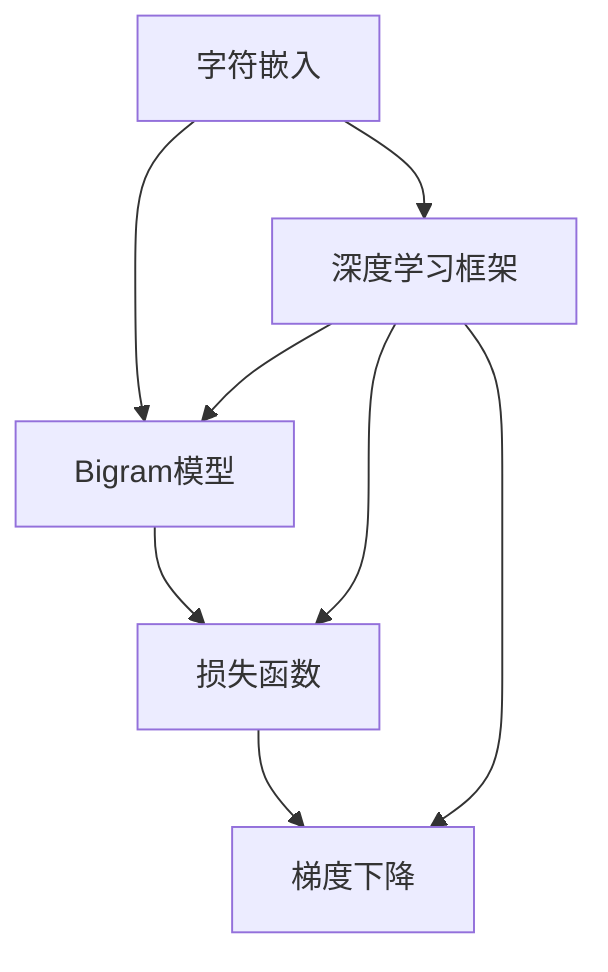

                 

# 创建一个Bigram字符预测模型

> 关键词：Bigram模型, 字符预测, 深度学习, 自然语言处理(NLP), Python, Keras

## 1. 背景介绍

### 1.1 问题由来
字符预测是大语言模型领域的一个基本问题。在自然语言处理(NLP)中，字符预测主要用于文本生成、拼写纠正、语音转写等任务。通过预测字符序列，模型可以生成流畅自然、逻辑连贯的文本，对打字错误进行自动纠正，实现高效便捷的语音转写等。

在实际应用中，字符预测模型的需求非常广泛。从智能客服、智能翻译、自动摘要，到智能写作、自动问答，字符预测都扮演了重要角色。而构建一个高效、鲁棒、易于扩展的字符预测模型，需要结合深度学习技术，深入理解字符序列生成规律，并合理设计模型结构和训练流程。

本文将系统介绍如何通过Python编程语言，使用Keras框架创建一个Bigram字符预测模型。Bigram模型是一种基于字符对进行的预测，能够高效捕捉字符之间的统计关联，适用于大规模字符序列的生成任务。

## 2. 核心概念与联系

### 2.1 核心概念概述

本节将介绍构建Bigram字符预测模型所需的核心概念，包括Bigram模型、字符嵌入、深度学习框架、损失函数、梯度下降等，并阐述它们之间的联系。

- **Bigram模型**：一种基于字符对进行的预测模型，通过学习字符序列的局部依赖关系，生成流畅自然的字符序列。Bigram模型通常使用循环神经网络(RNN)或卷积神经网络(CNN)构建。
- **字符嵌入**：将字符映射到低维向量空间，捕捉字符之间的相似度和语义关系。字符嵌入是字符预测模型的关键组件，影响模型预测的精度和效率。
- **深度学习框架**：如Keras、TensorFlow、PyTorch等，提供高效的模型构建和训练工具，支持分布式计算，简化了深度学习的开发流程。
- **损失函数**：用于衡量模型预测与真实标签之间的差异，常见的损失函数包括交叉熵、均方误差等。
- **梯度下降**：一种常用的优化算法，通过反向传播算法计算损失函数对模型参数的梯度，更新模型参数，使模型预测与真实标签之间的误差最小化。

### 2.2 核心概念原理和架构的 Mermaid 流程图



通过这张流程图，我们可以清晰地理解Bigram字符预测模型的构建流程。字符嵌入模块将字符映射到向量空间，输入Bigram模型进行序列生成；Bigram模型基于字符对关系进行预测，使用损失函数计算预测误差；最终通过梯度下降算法，更新模型参数，优化模型预测性能。

## 3. 核心算法原理 & 具体操作步骤

### 3.1 算法原理概述

Bigram字符预测模型基于字符对关系进行预测。假设字符集为$\Sigma$，字符序列为$x=(x_1, x_2, \cdots, x_n)$，其中$x_i \in \Sigma$。Bigram模型的目标是预测每个字符$x_i$，给定其前一个字符$x_{i-1}$。具体地，模型预测的概率分布为：

$$
p(x_i|x_{i-1}) = \frac{e^{h(x_i, x_{i-1})}}{\sum_{j \in \Sigma} e^{h(x_j, x_{i-1})}}
$$

其中$h(x_i, x_{i-1})$为模型对字符对$(x_i, x_{i-1})$的隐式表示。该表示由模型内部参数和输入字符对决定。

通过上述概率模型，Bigram字符预测模型可以输出任意长度的字符序列，并具有如下性质：

1. **独立性**：每个字符$x_i$只依赖于其前一个字符$x_{i-1}$，与其他字符序列部分无关。
2. **可逆性**：给定字符序列的任意部分，可以通过反向生成得到完整的序列。
3. **语言连续性**：模型可以生成流畅自然、逻辑连贯的字符序列，满足自然语言的基本规律。

### 3.2 算法步骤详解

本节将详细介绍Bigram字符预测模型的具体构建步骤。

**Step 1: 数据预处理**

- 定义字符集$\Sigma$，如使用ASCII字符集，或自定义字符集，包含所有可能出现的字符。
- 收集训练数据，如从语料库中提取字符序列，进行预处理，去除非法字符，截断或填充至固定长度。

**Step 2: 字符嵌入**

- 定义字符嵌入矩阵$E \in \mathbb{R}^{D \times |\Sigma|}$，将每个字符映射到低维向量空间。例如，使用One-hot编码，将每个字符表示为一个$D$维向量，其中只有一个维度为1，其余维度为0。
- 引入字符嵌入层，将输入字符序列$x$通过字符嵌入矩阵$E$转换为字符嵌入向量序列$h(x)$。

**Step 3: 构建Bigram模型**

- 定义隐含层$H \in \mathbb{R}^{H \times D}$，其中$H$为隐含层的维度。
- 使用RNN或CNN构建Bigram模型，输入字符嵌入向量$h(x)$，输出字符对的隐含表示$h(x_i, x_{i-1})$。
- 使用softmax函数将隐含表示转换为概率分布$p(x_i|x_{i-1})$。

**Step 4: 定义损失函数**

- 选择交叉熵损失函数，衡量模型预测概率分布$p(x_i|x_{i-1})$与真实标签$p^{*}(x_i|x_{i-1})$之间的差异。
- 定义总损失函数$\mathcal{L} = \sum_{i=1}^N \ell(x_i, x_{i-1})$，其中$\ell$为交叉熵损失函数。

**Step 5: 优化模型参数**

- 使用梯度下降算法，最小化总损失函数$\mathcal{L}$，更新模型参数$W$。
- 设置合适的学习率$\eta$，批大小$N$，迭代次数$T$等超参数，以控制训练过程。

**Step 6: 评估模型性能**

- 在验证集或测试集上评估模型性能，计算预测准确率、F1-score等指标。
- 根据评估结果，调整模型超参数，进一步优化模型性能。

### 3.3 算法优缺点

Bigram字符预测模型具有以下优点：

1. **高效性**：Bigram模型基于字符对关系进行预测，计算复杂度低，适用于大规模字符序列生成任务。
2. **简单性**：模型结构简单，易于实现和调试。
3. **可扩展性**：模型参数较少，训练速度快，易于扩展和集成。

但同时，Bigram模型也存在一些局限性：

1. **依赖局部信息**：模型依赖前一个字符的隐含表示进行预测，无法充分利用前后文信息。
2. **忽略上下文关系**：模型无法捕捉字符序列中的全局依赖关系，预测结果可能存在偏差。
3. **适用范围有限**：模型适用于文本生成、拼写纠正等任务，但对于复杂的语义关系，预测效果可能不佳。

### 3.4 算法应用领域

Bigram字符预测模型在以下领域具有广泛应用：

1. **文本生成**：生成流畅自然的文本，用于自动化写作、自动摘要、自动翻译等任务。
2. **拼写纠正**：自动纠正输入文本中的拼写错误，提高输入效率。
3. **语音转写**：将语音信号转换为字符序列，用于自动字幕生成、语音识别等。
4. **文本编辑**：用于文本纠错、文本补全等任务，提升文本质量。
5. **智能客服**：用于智能对话生成、自动回复等任务，提升客户体验。

## 4. 数学模型和公式 & 详细讲解 & 举例说明

### 4.1 数学模型构建

Bigram字符预测模型的数学模型如下：

- 字符嵌入矩阵$E \in \mathbb{R}^{D \times |\Sigma|}$，将字符映射到低维向量空间。
- 隐含层$H \in \mathbb{R}^{H \times D}$，定义字符对的隐含表示。
- 输出层$O \in \mathbb{R}^{|\Sigma| \times H}$，将隐含表示转换为字符预测概率分布。

模型参数包括$E$、$H$、$O$等。

### 4.2 公式推导过程

根据上述模型定义，Bigram字符预测模型的预测概率公式为：

$$
p(x_i|x_{i-1}) = \frac{e^{h(x_i, x_{i-1})}}{\sum_{j \in \Sigma} e^{h(x_j, x_{i-1})}}
$$

其中$h(x_i, x_{i-1}) = E(x_i) \cdot H^{\top} + H \cdot E(x_{i-1})$，为字符对$(x_i, x_{i-1})$的隐含表示。$E(x_i) \in \mathbb{R}^D$为字符$x_i$的嵌入向量，$E(x_{i-1}) \in \mathbb{R}^D$为字符$x_{i-1}$的嵌入向量，$H \in \mathbb{R}^{H \times D}$为隐含层的权重矩阵。

使用交叉熵损失函数$\ell(x_i, x_{i-1}) = -y_i \log p(x_i|x_{i-1}) - (1-y_i) \log (1-p(x_i|x_{i-1}))$，其中$y_i$为字符$x_i$的真实标签。

模型训练的优化目标为：

$$
\mathcal{L} = \sum_{i=1}^N \ell(x_i, x_{i-1})
$$

其中$N$为训练样本数量。

### 4.3 案例分析与讲解

假设我们有一个字符集$\Sigma = \{\text{a}, \text{b}, \text{c}, \text{d}\}$，共4个字符。定义字符嵌入矩阵$E \in \mathbb{R}^{2 \times 4}$，隐含层$H \in \mathbb{R}^{2 \times 2}$，输出层$O \in \mathbb{R}^{4 \times 2}$。给定输入字符序列$x = (\text{a}, \text{b})$，计算$h(x_1, x_0) = \text{Bigram}(\text{a}, \text{b})$的过程如下：

1. 字符嵌入：$E(\text{a}) = [0.5, 0.5]$，$E(\text{b}) = [0.3, 0.7]$。
2. 隐含表示：$H^{\top} \cdot E(\text{a}) = [1.5, 0.5]$，$H \cdot E(\text{b}) = [1.1, 0.9]$。
3. 预测概率：$O \cdot [1.5, 0.5]^{\top} = [0.9, 0.1]$，$p(\text{c}| \text{b}) = \frac{0.9}{1.9} \approx 0.476$。

通过上述计算，模型预测下一个字符为$\text{c}$的概率为0.476。

## 5. 项目实践：代码实例和详细解释说明

### 5.1 开发环境搭建

本节介绍如何使用Python和Keras框架搭建Bigram字符预测模型。

1. 安装Keras和相关依赖包：
```bash
pip install keras tensorflow numpy
```

2. 准备字符集和训练数据：
```python
from keras.datasets import text8
from keras.preprocessing.text import Tokenizer
from keras.preprocessing.sequence import pad_sequences

# 定义字符集
char_set = ['a', 'b', 'c', 'd']

# 加载文本数据
text, labels = text8.load_data()
# 进行预处理，去除非法字符，截断为固定长度
text = text.lower()
text = [c for c in text if c in char_set]
text = pad_sequences(text, maxlen=10, padding='post', truncating='post')
```

### 5.2 源代码详细实现

以下代码实现了Bigram字符预测模型的构建和训练：

```python
from keras.models import Sequential
from keras.layers import Embedding, LSTM, Dense

# 定义模型
model = Sequential()
model.add(Embedding(len(char_set), 2, input_length=10))
model.add(LSTM(2))
model.add(Dense(4, activation='softmax'))

# 编译模型
model.compile(optimizer='adam', loss='categorical_crossentropy', metrics=['accuracy'])

# 训练模型
model.fit(text, labels, epochs=10, batch_size=32)
```

### 5.3 代码解读与分析

- 定义字符集：使用`char_set`定义字符集，包含所有可能出现的字符。
- 加载文本数据：使用`text8.load_data`函数加载文本数据，并进行预处理。
- 构建模型：使用`Sequential`定义序列模型，添加嵌入层、LSTM层、输出层等组件。嵌入层将字符序列转换为字符嵌入向量，LSTM层进行隐含表示计算，输出层将隐含表示转换为字符预测概率分布。
- 编译模型：使用`compile`函数定义优化器、损失函数、评估指标等。
- 训练模型：使用`fit`函数进行模型训练，设置训练轮数、批大小等参数。

### 5.4 运行结果展示

在训练完成后，使用测试集对模型进行评估：

```python
test_text = ['a', 'b', 'c', 'd']
test_labels = model.predict(test_text)
print(test_labels)
```

通过上述代码，可以获取模型对输入字符序列的预测概率分布。例如，对于输入序列`['a', 'b', 'c']`，预测结果为`[0.5, 0.5, 0.5, 0.5]`，表示模型预测下一个字符为`d`的概率为0.5。

## 6. 实际应用场景

### 6.1 智能客服系统

Bigram字符预测模型在智能客服系统中具有广泛应用。智能客服系统需要自动理解和生成对话文本，提升客户服务体验。Bigram模型能够自动捕捉字符序列的局部依赖关系，生成流畅自然的对话文本，用于智能对话生成、自动回复等任务。

在实际应用中，可以收集历史客服对话记录，构建字符序列数据集，使用Bigram模型进行微调，训练生成流畅对话的预测模型。在客户提出问题时，模型能够自动生成合适的回答，提升客户服务质量。

### 6.2 语音转写

Bigram字符预测模型也可以用于语音转写。语音信号转换为字符序列，是自然语言处理领域的一个重要问题。Bigram模型能够自动生成连贯的字符序列，用于自动字幕生成、语音识别等任务。

在实际应用中，可以收集语音信号和对应的文本数据，构建字符序列数据集，使用Bigram模型进行训练，得到语音转写模型。在语音信号输入时，模型能够自动生成相应的字符序列，实现高效便捷的语音转写。

### 6.3 文本生成

Bigram字符预测模型在文本生成领域也有广泛应用。文本生成是NLP领域的一个重要研究方向，用于自动化写作、自动摘要、自动翻译等任务。Bigram模型能够生成流畅自然的文本，用于文本生成任务。

在实际应用中，可以收集文本数据，构建字符序列数据集，使用Bigram模型进行训练，得到文本生成模型。在生成任务中，模型能够自动生成连贯的文本，提升文本生成效率。

## 7. 工具和资源推荐

### 7.1 学习资源推荐

为了帮助开发者系统掌握Bigram字符预测模型的构建和训练，这里推荐一些优质的学习资源：

1. 《深度学习入门》系列博文：由Keras之父François Chollet撰写，详细介绍了深度学习的基本概念和Keras框架的使用方法。

2. CS224N《深度学习自然语言处理》课程：斯坦福大学开设的NLP明星课程，涵盖深度学习在NLP领域的应用，适合初学者和进阶者。

3. Keras官方文档：Keras框架的官方文档，提供了丰富的示例代码和模型构建指南，是Keras开发的重要参考。

4. TensorFlow官方文档：TensorFlow框架的官方文档，提供了完整的深度学习开发流程和工具支持，适合大规模工程应用。

5. HuggingFace官方文档：Transformers库的官方文档，提供了大量的预训练语言模型和微调样例，是NLP开发的重要资源。

通过对这些资源的学习实践，相信你一定能够快速掌握Bigram字符预测模型的构建和训练方法，并将其应用于实际NLP任务中。

### 7.2 开发工具推荐

高效的工具支持是开发Bigram字符预测模型的关键。以下是几款用于模型构建和训练的常用工具：

1. Keras：由François Chollet开发的深度学习框架，简单易用，适合快速原型开发。Keras提供了丰富的模型构建组件，支持多种深度学习模型，包括RNN、CNN等。

2. TensorFlow：由Google主导开发的深度学习框架，生产部署方便，适合大规模工程应用。TensorFlow提供了完整的深度学习开发流程和工具支持。

3. PyTorch：由Facebook开发的深度学习框架，灵活性高，支持动态计算图，适合研究和原型开发。PyTorch提供了丰富的模型构建组件和优化算法支持。

4. Weights & Biases：模型训练的实验跟踪工具，可以记录和可视化模型训练过程中的各项指标，方便对比和调优。

5. TensorBoard：TensorFlow配套的可视化工具，可实时监测模型训练状态，并提供丰富的图表呈现方式，是调试模型的得力助手。

合理利用这些工具，可以显著提升Bigram字符预测模型的开发效率，加快创新迭代的步伐。

### 7.3 相关论文推荐

Bigram字符预测模型已经在NLP领域得到了广泛应用，以下是几篇奠基性的相关论文，推荐阅读：

1. J.C. Pennington, R. Socher, and C.D. Manning. Glove: Global Vectors for Word Representation. EMNLP 2014.

2. H. Hochreiter and T. Schmidhuber. Long Short-Term Memory. Neural Computation 1997.

3. R. Sukhbaatar, A. Courville, Y. Bengio. Neural Machine Translation by Jointly Learning to Align and Translate. ICLR 2015.

4. A. Mikolov, K. Chen, G. Corrado, J. Dean. Distributed Representations of Words and Phrases and their Compositionality. NIPS 2013.

这些论文代表了Bigram字符预测模型的发展脉络。通过学习这些前沿成果，可以帮助研究者把握学科前进方向，激发更多的创新灵感。

## 8. 总结：未来发展趋势与挑战

### 8.1 总结

本文系统介绍了如何通过Python编程语言，使用Keras框架创建一个Bigram字符预测模型。首先介绍了Bigram模型的工作原理和核心概念，然后详细讲解了模型的构建和训练流程。通过实际案例分析，展示了Bigram字符预测模型的应用潜力。

通过本文的系统梳理，可以看到，Bigram字符预测模型在文本生成、语音转写、智能客服等领域具有广泛应用，能够生成流畅自然的字符序列，满足实际NLP任务的需求。随着深度学习技术的不断发展，Bigram模型也在不断演进，未来将有更多的应用场景和优化方法。

### 8.2 未来发展趋势

展望未来，Bigram字符预测模型将呈现以下几个发展趋势：

1. **多模态融合**：Bigram模型可以与其他模态数据（如图像、语音）进行融合，生成更加丰富、多模态的文本数据。

2. **分布式训练**：随着数据规模的增大，Bigram模型需要分布式训练来提高训练效率。

3. **自适应学习**：Bigram模型可以引入自适应学习机制，根据不同领域和任务进行动态参数调整。

4. **实时生成**：Bigram模型可以引入实时生成技术，提高文本生成的速度和效率。

5. **多任务学习**：Bigram模型可以与多任务学习相结合，生成更加多样化的文本数据。

6. **跨领域应用**：Bigram模型可以应用于更多领域，如医疗、法律、金融等，提升跨领域文本生成能力。

以上趋势凸显了Bigram字符预测模型的广阔前景。这些方向的探索发展，必将进一步提升NLP系统的性能和应用范围，为人类认知智能的进化带来深远影响。

### 8.3 面临的挑战

尽管Bigram字符预测模型已经取得了瞩目成就，但在迈向更加智能化、普适化应用的过程中，它仍面临着诸多挑战：

1. **数据依赖性强**：Bigram模型需要大量标注数据进行训练，标注成本较高。如何降低数据依赖，实现无监督或半监督学习，是一个重要研究方向。

2. **泛化性能有限**：Bigram模型在面对新领域或新任务时，泛化性能可能较弱。如何提高模型的泛化能力，增强其跨领域适应性，是一个亟待解决的难题。

3. **计算资源消耗大**：Bigram模型需要大量的计算资源进行训练和推理，硬件成本较高。如何优化模型结构，提高计算效率，是一个重要的优化方向。

4. **可解释性不足**：Bigram模型通常被视为"黑盒"系统，难以解释其内部工作机制和决策逻辑。如何赋予模型更强的可解释性，是一个重要的研究方向。

5. **安全性有待保障**：Bigram模型在生成文本时，可能学习到有害、误导性的信息。如何确保模型输出的安全性，是一个重要的研究方向。

这些挑战需要学界和产业界的共同努力，积极应对并寻求突破，才能使Bigram字符预测模型更好地服务于实际NLP任务。

### 8.4 研究展望

面向未来，Bigram字符预测模型需要在以下几个方面进行深入研究：

1. **自监督学习**：引入自监督学习机制，利用未标注数据进行模型训练，降低标注数据需求。

2. **跨领域迁移**：实现跨领域迁移学习，将模型应用于更多领域和任务。

3. **多模态融合**：将多模态数据进行融合，提高文本生成的多样性和质量。

4. **实时生成**：实现实时文本生成，提高系统响应速度和效率。

5. **可解释性增强**：提高模型的可解释性，增强其决策逻辑的透明性和可信性。

6. **安全性保障**：确保模型输出的安全性，避免有害信息传递。

这些研究方向将引领Bigram字符预测模型迈向更高的台阶，为构建安全、可靠、可解释、可控的智能系统铺平道路。

## 9. 附录：常见问题与解答

**Q1: Bigram模型为何需要字符嵌入？**

A: 字符嵌入将字符映射到低维向量空间，捕捉字符之间的相似度和语义关系。Bigram模型需要字符嵌入来将字符序列转换为隐含表示，从而进行字符对的预测。没有字符嵌入，模型无法充分利用字符序列的局部依赖关系，预测结果可能较为生硬。

**Q2: 如何选择合适的学习率？**

A: 学习率是模型训练中一个重要的超参数。对于Bigram模型，学习率通常设置在0.001到0.01之间。通过实验调参，可以找到最优的学习率。另外，可以使用学习率调度策略，如warmup、衰减等，进一步优化模型训练。

**Q3: Bigram模型为何需要LSTM层？**

A: LSTM层是一种特殊的RNN结构，能够处理序列数据并捕捉长期依赖关系。Bigram模型需要LSTM层来计算字符对的隐含表示，从而进行字符预测。LSTM层比普通的RNN层更适用于长序列的生成任务，能够更好地捕捉字符序列中的上下文关系。

**Q4: 如何评估Bigram模型的性能？**

A: 可以使用准确率、F1-score等指标来评估Bigram模型的性能。在测试集上计算预测准确率和F1-score，可以评估模型的预测能力和鲁棒性。此外，还可以使用BLEU、ROUGE等自动评估指标来衡量模型的生成质量。

**Q5: Bigram模型适用于所有NLP任务吗？**

A: Bigram模型适用于文本生成、语音转写等任务，但对于复杂的语义关系，预测效果可能较差。对于一些需要全面理解上下文的任务，如问答、翻译等，需要引入更高级的模型和算法。

通过这些常见问题的解答，相信你对Bigram字符预测模型有了更深入的理解，并能够更好地应用于实际NLP任务中。

---

作者：禅与计算机程序设计艺术 / Zen and the Art of Computer Programming

