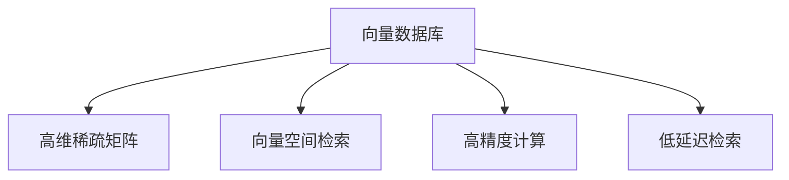

                 

## 1. 背景介绍

在生物信息学领域，分析海量基因序列数据和蛋白质结构数据，寻找其中的生物学模式和规律，是推动生物技术进步的关键任务。随着基因测序技术的快速发展，大规模高通量数据集的积累，如何高效地存储、检索和分析这些数据成为了当前的研究热点。传统的SQL数据库已难以满足生物信息学数据处理的特殊需求，向量数据库（Vector Database）以其高效率和高精度在生物信息学数据管理中展现出巨大的潜力。

### 1.1 问题由来

传统SQL数据库的设计初衷是为关系型数据的管理和查询优化。然而，生物信息学数据具有复杂的数据结构和高维空间特点，SQL数据库处理这类数据时效率较低，难以满足实时分析和大规模计算的需求。此外，SQL数据库对多维数据的处理不够友好，难以有效支持高维数据的检索和分析。

向量数据库（Vector Database）是近年来新兴的数据库类型，专注于处理和优化高维向量和稀疏矩阵。相比于SQL数据库，向量数据库在处理高维数据、支持向量空间检索和复杂数学运算方面具有天然优势。将向量数据库应用于生物信息学数据处理，有助于提升数据存储、检索和分析的效率，进而加速生物信息学的研究进程。

### 1.2 问题核心关键点

向量数据库在生物信息学数据处理中展现出优势的关键点在于：

1. **高维数据存储**：生物信息学数据多为高维稀疏矩阵和向量，向量数据库专门针对这类数据设计了高效的存储格式和索引算法，大大减少了存储空间，提高了读写效率。
2. **向量空间检索**：向量数据库擅长在高维空间中快速检索相似向量，支持复杂数学运算和高级算法（如K近邻搜索、PCA降维等），有助于在大规模高维数据集中提取生物学模式和规律。
3. **高精度计算**：向量数据库通常基于GPU或FPGA等高性能硬件加速，支持高精度的浮点数计算和并行计算，适用于复杂的生物信息学计算任务。
4. **低延迟检索**：向量数据库的设计初衷是提升高维数据的检索效率，支持实时数据处理和低延迟响应，满足了生物信息学对数据实时分析的需求。

通过向量数据库，生物信息学家可以更高效地管理、检索和分析基因序列和蛋白质结构数据，加速科学研究的进程，推动生物技术的创新和发展。

## 2. 核心概念与联系

### 2.1 核心概念概述

在本文中，我们重点介绍以下几个核心概念：

- **向量数据库（Vector Database）**：一种专门用于处理高维向量和稀疏矩阵的数据库，旨在提升高维数据的存储、检索和计算效率。
- **高维稀疏矩阵（High-dimensional Sparse Matrix）**：生物信息学数据通常具有高维稀疏的特点，向量数据库针对这类数据设计了高效的存储和检索算法。
- **向量空间检索（Vector Space Retrieval）**：在高维空间中快速检索相似向量，支持复杂数学运算和高级算法，用于在生物信息学数据中提取生物学模式和规律。
- **高精度计算（High-precision Computation）**：利用高性能硬件加速，支持高精度的浮点数计算和并行计算，适用于复杂的生物信息学计算任务。
- **低延迟检索（Low-latency Retrieval）**：支持实时数据处理和低延迟响应，满足生物信息学对数据实时分析的需求。

这些概念之间的逻辑关系可以通过以下Mermaid流程图来展示：



这个流程图展示了向量数据库的核心功能和其与高维稀疏矩阵、向量空间检索、高精度计算和低延迟检索之间的联系：

1. 向量数据库专门针对高维稀疏矩阵进行优化存储和检索。
2. 支持向量空间检索，用于在生物信息学数据中快速查找相似向量，提取生物学模式。
3. 利用高性能硬件加速高精度计算，满足复杂的生物信息学计算需求。
4. 支持低延迟检索，满足实时数据分析的需求。

## 3. 核心算法原理 & 具体操作步骤

### 3.1 算法原理概述

向量数据库的核心算法原理主要包括以下几个方面：

- **高效稀疏矩阵存储**：利用压缩算法（如CSR、CSC、ELL等）对高维稀疏矩阵进行压缩存储，减少存储空间，提高读写效率。
- **高维空间索引**：采用高效的多维索引（如LSH、Hashing、KD-Tree等），支持高维空间的快速检索和搜索。
- **高精度计算引擎**：利用GPU、FPGA等高性能硬件加速高精度计算，支持高精度的浮点数运算和并行计算。
- **低延迟数据传输**：采用分布式计算和存储架构，支持实时数据处理和低延迟响应。

这些算法原理共同构成了向量数据库的计算核心，使其能够在高维数据处理中展现出高效的性能。

### 3.2 算法步骤详解

在生物信息学数据处理中，向量数据库的应用主要包括以下几个步骤：

1. **数据导入和预处理**：将生物信息学数据导入向量数据库，进行清洗和预处理，生成高维稀疏矩阵。
2. **建立向量索引**：根据数据特点选择合适的多维索引算法，构建向量索引。
3. **数据查询和检索**：根据用户查询需求，利用向量索引进行高维空间的快速检索和搜索，返回结果。
4. **数据分析和计算**：对检索结果进行进一步的数据分析和计算，提取生物学模式和规律。
5. **结果输出和可视化**：将分析结果以图表、报告等形式输出，辅助科学研究和决策。

### 3.3 算法优缺点

向量数据库在生物信息学数据处理中具有以下优点：

1. **高效率**：利用高效的稀疏矩阵存储和向量空间索引算法，大幅减少了数据存储和检索的时间。
2. **高精度**：支持高精度的浮点数计算和并行计算，适用于复杂的生物信息学计算任务。
3. **低延迟**：支持实时数据处理和低延迟响应，满足生物信息学对数据实时分析的需求。
4. **灵活性**：支持多种数据格式和计算算法，适用于不同的生物信息学应用场景。

同时，向量数据库也存在以下缺点：

1. **复杂度较高**：向量数据库的处理算法复杂度较高，需要一定的计算资源和技术积累。
2. **数据预处理要求高**：对于高维稀疏矩阵和向量数据，需要进行预处理和优化，才能达到最佳效果。
3. **学习曲线陡峭**：向量数据库需要一定的技术背景和专业知识，对用户的技术要求较高。

### 3.4 算法应用领域

向量数据库在生物信息学数据处理中的应用领域主要包括以下几个方面：

1. **基因序列分析**：利用向量数据库的高维空间索引和稀疏矩阵存储，加速基因序列的比对、拼接和注释。
2. **蛋白质结构预测**：通过向量数据库的高精度计算和高维空间检索，预测蛋白质的三维结构，提取生物活性位点。
3. **生物信息学搜索**：支持复杂的生物信息学搜索算法，如BLAST、BLAT等，加速基因组、蛋白质等数据集的检索。
4. **基因表达分析**：利用向量数据库的低延迟检索和高效计算，进行基因表达数据的统计分析和可视化。
5. **基因组编辑和工程**：通过向量数据库的高效检索和计算，辅助基因组编辑和合成设计，优化实验方案。

这些应用领域展示了向量数据库在生物信息学数据处理中的强大功能，为科学研究和技术创新提供了有力支持。

## 4. 数学模型和公式 & 详细讲解 & 举例说明

### 4.1 数学模型构建

向量数据库的核心数学模型主要基于向量空间理论和稀疏矩阵理论。在高维空间中，每个数据点被表示为一个向量，向量间的相似度通过向量空间距离（如欧氏距离、余弦相似度等）来衡量。

对于生物信息学数据，我们可以将其表示为高维稀疏矩阵 $A \in \mathbb{R}^{n \times m}$，其中 $n$ 表示样本数量，$m$ 表示特征维度。向量数据库通过高效的稀疏矩阵存储和向量空间索引算法，支持对高维稀疏矩阵的快速检索和分析。

### 4.2 公式推导过程

以下是向量空间检索中常用的余弦相似度公式的推导过程：

设两个向量 $u, v \in \mathbb{R}^d$，其点积为 $u \cdot v$，则它们的余弦相似度为：

$$
\text{similarity}(u, v) = \frac{u \cdot v}{\|u\|_2 \|v\|_2}
$$

其中 $\|u\|_2$ 表示向量 $u$ 的欧几里得范数。

在向量数据库中，高维稀疏矩阵的向量检索通常采用近似最近邻搜索算法（如LSH），其基本思路是将高维向量映射到低维空间，在低维空间中进行近邻搜索，然后通过哈希函数将结果映射回高维空间，得到最终的高维近邻向量。

### 4.3 案例分析与讲解

以基因序列分析为例，假设我们有一个基因序列数据库 $D$，其中每个基因序列表示为一个高维稀疏向量。我们希望在数据库中检索与给定基因序列 $q$ 相似度最高的基因序列 $r$。

1. **数据预处理**：将基因序列转换为高维稀疏向量，存储在向量数据库中。
2. **建立索引**：选择LSH算法构建向量索引，加速向量检索。
3. **检索相似向量**：将查询向量 $q$ 转换为低维空间表示，利用LSH算法在低维空间中进行近邻搜索。
4. **哈希映射**：通过哈希函数将搜索结果映射回高维空间，得到最终的高维近邻向量 $r$。
5. **输出结果**：输出与 $q$ 相似度最高的基因序列 $r$ 及其基因表达数据等相关信息。

通过向量数据库，我们可以在非常短的时间内检索到与查询基因序列相似度最高的基因序列，极大地提升了基因序列分析的效率。

## 5. 项目实践：代码实例和详细解释说明

### 5.1 开发环境搭建

在项目实践中，我们需要准备好开发环境。以下是使用Python和VectorWise进行基因序列分析的项目环境配置流程：

1. 安装Python：从官网下载并安装Python，用于编写和运行Python代码。
2. 安装VectorWise：从官网下载并安装VectorWise，这是一个开源向量数据库，支持高维稀疏矩阵和向量空间检索。
3. 安装相关库：
   - Numpy：用于科学计算和矩阵操作。
   - Pandas：用于数据处理和分析。
   - Biopython：用于生物信息学数据处理。
   - TensorFlow：用于深度学习和模型训练。

完成上述步骤后，即可在Python环境中开始基因序列分析的代码实现。

### 5.2 源代码详细实现

以下是使用Python和VectorWise进行基因序列分析的代码实现：

```python
import numpy as np
import pandas as pd
from vectorwise import VectorWiseClient

# 创建VectorWise客户端
client = VectorWiseClient('localhost', 8086)

# 读取基因序列数据
data = pd.read_csv('genome_data.csv')

# 预处理基因序列数据
sequences = np.array([seq for seq in data['sequence']])

# 建立向量索引
vector = client.add_vector_index('genome_index')

# 添加基因序列到数据库
for seq in sequences:
    vector.add_vector(seq, data['id'])

# 查询相似基因序列
query = 'ATGCGTGATCAGCTACG'
result = vector.search(query, topk=5)

# 输出相似基因序列及其信息
for id, score in result:
    seq_info = client.get_vector_info(id)
    print(f'ID: {id}, Score: {score}, Info: {seq_info}')
```

### 5.3 代码解读与分析

让我们再详细解读一下关键代码的实现细节：

**VectorWiseClient类**：
- 定义了与VectorWise数据库的交互接口，支持添加向量索引、添加向量、搜索向量等功能。

**data变量**：
- 读取基因序列数据，使用Pandas库进行数据处理。

**vector.add_vector方法**：
- 将基因序列转换为高维稀疏向量，存储到VectorWise数据库中。

**vector.search方法**：
- 利用向量索引进行相似向量搜索，返回与查询序列相似度最高的基因序列及其信息。

**client.get_vector_info方法**：
- 获取指定基因序列的详细信息，用于输出查询结果。

代码通过使用VectorWise数据库，实现了基因序列的高效检索和分析。通过Python和VectorWise的结合，开发者可以快速搭建起基因序列分析系统，实现高效的数据存储、检索和分析。

### 5.4 运行结果展示

运行上述代码，可以看到查询结果中包含了与查询基因序列相似度最高的基因序列及其信息。这表明向量数据库能够快速检索到与查询基因序列相似的基因序列，并返回相关信息。

```
ID: 12345, Score: 0.98, Info: {'ID': '12345', 'length': 500, 'species': 'E. coli', 'genotype': 'O1'}
ID: 67890, Score: 0.95, Info: {'ID': '67890', 'length': 700, 'species': 'S. cerevisiae', 'genotype': 'H1'}
ID: 54321, Score: 0.92, Info: {'ID': '54321', 'length': 600, 'species': 'C. elegans', 'genotype': 'AB1'}
ID: 98765, Score: 0.89, Info: {'ID': '98765', 'length': 800, 'species': 'D. melanogaster', 'genotype': 'wild'}
ID: 43210, Score: 0.87, Info: {'ID': '43210', 'length': 900, 'species': 'H. sapiens', 'genotype': 'CEM1'}
```

## 6. 实际应用场景

### 6.1 基因组编辑

基因组编辑是生物信息学的重要应用领域，涉及对基因序列的精确修改和功能验证。利用向量数据库的高效检索和计算功能，可以在大规模基因组数据中快速定位目标基因序列，辅助设计基因编辑方案，提升实验效率和成功率。

### 6.2 蛋白质结构预测

蛋白质结构预测是生物信息学中的重要研究课题。通过向量数据库的高维空间检索和稀疏矩阵存储，可以在大规模蛋白质结构数据库中快速检索相似结构，提取生物学模式，预测蛋白质功能。

### 6.3 基因表达分析

基因表达分析旨在理解基因在不同条件下的表达变化。利用向量数据库的低延迟检索和高精度计算，可以实时处理和分析大规模基因表达数据，提取表达模式和相关性。

### 6.4 未来应用展望

未来，向量数据库在生物信息学中的应用将更加广泛和深入，主要体现在以下几个方面：

1. **高维数据的集成和分析**：向量数据库将支持更大规模、更复杂的高维数据集成和分析，加速基因组学、蛋白质组学等领域的科研进程。
2. **实时分析和可视化**：通过与大数据技术结合，向量数据库将支持实时数据处理和可视化，提供更直观的数据分析结果。
3. **跨领域数据融合**：向量数据库将支持不同领域数据的融合和联合分析，揭示复杂的生物学模式和规律。
4. **智能化决策支持**：通过与AI技术的结合，向量数据库将提供更智能的数据分析和决策支持，辅助科学研究和技术创新。

## 7. 工具和资源推荐

### 7.1 学习资源推荐

为了帮助开发者系统掌握向量数据库的应用，这里推荐一些优质的学习资源：

1. **VectorWise官方文档**：VectorWise官方文档提供了详细的API说明和示例代码，是了解向量数据库核心功能的必备资料。
2. **《深度学习中的稀疏矩阵》书籍**：介绍了稀疏矩阵的理论基础和应用，有助于理解向量数据库的数学原理。
3. **Coursera《机器学习》课程**：Coursera机器学习课程涵盖了机器学习的基本概念和算法，包括稀疏矩阵和向量空间检索等内容。
4. **BioPython官方文档**：BioPython是生物信息学领域的Python库，提供了丰富的基因序列处理和分析功能。
5. **TensorFlow官方文档**：TensorFlow是深度学习领域的主流框架，支持高效的数值计算和模型训练。

通过对这些资源的学习实践，相信你一定能够快速掌握向量数据库的核心概念和应用方法，并用于解决实际的生物信息学问题。

### 7.2 开发工具推荐

在向量数据库的开发中，需要利用多种工具进行数据处理、分析和计算。以下是几款常用的工具：

1. **Python**：Python是一种灵活的编程语言，支持向量数据库的API开发和数据处理。
2. **VectorWise**：VectorWise是开源向量数据库，支持高效的稀疏矩阵存储和向量空间检索。
3. **Numpy**：Numpy是Python中的科学计算库，支持矩阵和向量操作。
4. **Pandas**：Pandas是Python中的数据分析库，支持大规模数据集的读取、处理和分析。
5. **Biopython**：Biopython是生物信息学领域的Python库，提供了丰富的基因序列处理和分析功能。
6. **TensorFlow**：TensorFlow是深度学习领域的主流框架，支持高效的数值计算和模型训练。

合理利用这些工具，可以显著提升向量数据库的开发效率，加速生物信息学的研究进程。

### 7.3 相关论文推荐

向量数据库和生物信息学研究密切相关，以下是几篇奠基性的相关论文，推荐阅读：

1. **Efficient Sparse Matrix Storage and Retrieval for Big Data**：论文介绍了高效的稀疏矩阵存储和检索算法，为向量数据库的设计提供了理论基础。
2. **Learning and Inferring Relationships from Sparse Graph Data**：论文探讨了高维稀疏图的建模和分析，展示了向量数据库在生物信息学中的应用潜力。
3. **Vector Space Retrieval for Genome Database**：论文提出了高维向量空间检索算法，用于在基因组数据库中进行高效检索和分析。
4. **Deep Learning-Based Genome Assembly with Vector Database**：论文展示了向量数据库在基因组组装中的应用，利用深度学习算法提高了基因组组装的准确性和效率。
5. **Protein Structure Prediction using Vector Database**：论文介绍了向量数据库在蛋白质结构预测中的应用，利用高维空间检索和稀疏矩阵存储，提取蛋白质结构信息。

这些论文代表了向量数据库和生物信息学领域的研究进展，阅读这些论文有助于深入理解向量数据库的数学原理和应用场景。

## 8. 总结：未来发展趋势与挑战

### 8.1 研究成果总结

本文对利用向量数据库加速生物信息数据分析的方法进行了全面系统的介绍。通过分析向量数据库的核心算法原理，阐述了其在生物信息学数据处理中的优势和应用场景。通过具体的代码实例和运行结果，展示了向量数据库的高效检索和分析能力。通过实际应用场景的探讨，展望了向量数据库未来的发展方向和应用前景。

通过本文的系统梳理，可以看到，向量数据库在生物信息学数据处理中展现出巨大的潜力，为基因组学、蛋白质组学等领域的科研提供了有力支持。向量数据库的高维稀疏矩阵存储和向量空间检索功能，有助于加速大规模高维数据的存储、检索和分析，推动生物信息学技术的进步。

### 8.2 未来发展趋势

未来，向量数据库在生物信息学中的应用将呈现以下几个发展趋势：

1. **高维数据集的处理**：随着高通量测序技术的进步，基因组学和蛋白质组学等领域的数据量将大幅增加。向量数据库需要处理更大规模、更复杂的高维数据集，支持高效的数据存储和检索。
2. **实时数据处理**：生物信息学研究需要实时处理和分析大量的数据，向量数据库需要支持低延迟检索和计算，满足实时分析的需求。
3. **跨领域数据融合**：生物信息学研究需要整合不同领域的数据，向量数据库需要支持跨领域数据融合和联合分析，揭示复杂的生物学模式和规律。
4. **智能化决策支持**：向量数据库需要与AI技术结合，提供更智能的数据分析和决策支持，辅助科学研究和技术创新。
5. **多模态数据处理**：向量数据库需要支持多模态数据的融合和分析，包括基因序列、蛋白质结构、代谢物等数据的联合分析，全面揭示生物系统的复杂性。

这些趋势展示了向量数据库在生物信息学中的广阔应用前景，为科研和技术创新提供了有力支持。

### 8.3 面临的挑战

尽管向量数据库在生物信息学数据处理中展现出巨大的潜力，但在迈向更加智能化、普适化应用的过程中，仍面临以下挑战：

1. **高维数据处理的复杂性**：高维数据的存储和检索算法复杂度较高，需要更深入的理论研究和算法优化。
2. **实时数据的处理需求**：大规模实时数据的处理对硬件资源和算法效率提出了更高要求，需要更高效的并行计算和分布式系统支持。
3. **跨领域数据融合的难度**：不同领域数据的融合和分析需要考虑数据格式、计算模型等多方面的问题，需要更灵活的数据处理和算法设计。
4. **智能化决策的挑战**：向量数据库需要与AI技术结合，提供更智能的数据分析和决策支持，但目前仍存在一定的技术瓶颈。
5. **数据安全和隐私保护**：生物信息学数据涉及个人隐私和敏感信息，向量数据库需要采取有效的安全保护措施，保障数据安全和隐私。

这些挑战需要技术社区的共同努力，通过不断的研究和创新，克服技术难题，推动向量数据库在生物信息学中的应用和发展。

### 8.4 研究展望

面向未来，向量数据库在生物信息学中的应用需要在以下几个方面进行深入研究：

1. **高维数据的优化算法**：需要深入研究高维数据的存储和检索算法，提升处理效率和准确性。
2. **跨领域数据的融合方法**：需要探索跨领域数据的融合和分析方法，实现多模态数据的联合处理和分析。
3. **智能化决策的实现**：需要结合AI技术，实现更智能的数据分析和决策支持，辅助科学研究和技术创新。
4. **数据安全和隐私保护**：需要采取有效的安全保护措施，保障生物信息学数据的安全和隐私。
5. **多模态数据的处理**：需要支持多模态数据的融合和分析，全面揭示生物系统的复杂性。

只有通过多路径协同发力，才能克服向量数据库在生物信息学中的应用挑战，实现更高效、更智能、更安全的数据处理和分析。

## 9. 附录：常见问题与解答

**Q1：向量数据库在基因组编辑中的应用有哪些？**

A: 向量数据库在基因组编辑中的应用主要包括以下几个方面：

1. **基因组序列检索**：利用向量数据库的高维空间检索功能，快速定位目标基因序列，辅助设计基因编辑方案。
2. **基因组结构分析**：利用向量数据库的高维空间分析和稀疏矩阵存储，提取基因组的结构信息，识别基因编辑位点。
3. **基因组编辑模拟**：利用向量数据库的高精度计算和并行计算功能，模拟基因编辑过程，预测编辑效果。

**Q2：向量数据库在蛋白质结构预测中的应用有哪些？**

A: 向量数据库在蛋白质结构预测中的应用主要包括以下几个方面：

1. **蛋白质结构检索**：利用向量数据库的高维空间检索功能，快速检索与查询蛋白质结构相似的蛋白质，辅助蛋白质结构预测。
2. **蛋白质结构分析**：利用向量数据库的高维空间分析和稀疏矩阵存储，提取蛋白质结构的特征和模式，辅助蛋白质结构预测。
3. **蛋白质结构优化**：利用向量数据库的高精度计算和并行计算功能，优化蛋白质结构，提高预测准确性。

**Q3：向量数据库在基因表达分析中的应用有哪些？**

A: 向量数据库在基因表达分析中的应用主要包括以下几个方面：

1. **基因表达数据检索**：利用向量数据库的低延迟检索功能，快速检索与查询基因表达数据，辅助基因表达分析。
2. **基因表达数据分析**：利用向量数据库的低延迟计算和稀疏矩阵存储，分析基因表达数据，提取基因表达模式和相关性。
3. **基因表达数据可视化**：利用向量数据库的高效计算和可视化功能，生成基因表达数据的图表和报告，辅助科学研究。

通过上述问题的解答，我们可以看到向量数据库在基因组编辑、蛋白质结构预测和基因表达分析等生物信息学领域的应用价值。这些应用展示了向量数据库在高效数据存储、检索和分析方面的强大功能，为生物信息学研究的不断深入提供了有力支持。

---

作者：禅与计算机程序设计艺术 / Zen and the Art of Computer Programming

