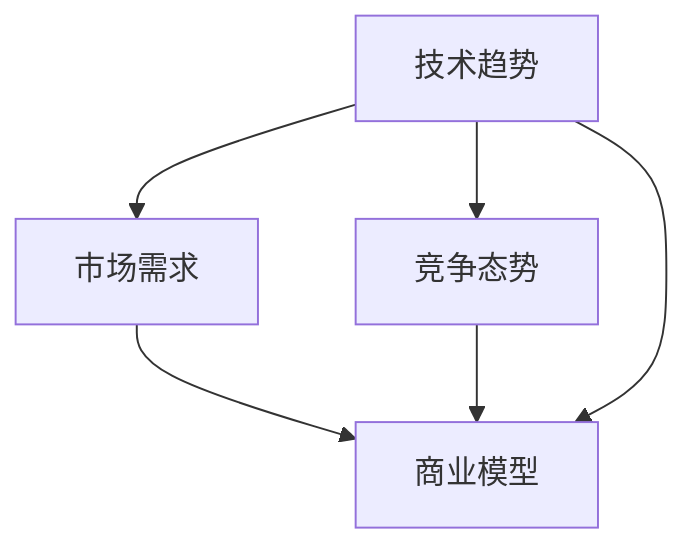

                 

## 1. 背景介绍

### 1.1 问题由来
在过去的十年中，人工智能（AI）技术以惊人的速度发展，从图像识别到自然语言处理，从自动驾驶到智能机器人，人工智能的进展几乎改变了我们生活的方方面面。尽管如此，这一领域的许多新兴创业公司仍然面临资金、技术和市场的挑战。

人工智能创业不仅需要技术突破，还需要强大的商业洞察力，将技术优势转化为市场价值。技术洞察力不仅关乎对现有技术的深刻理解，更关乎对未来趋势的前瞻性判断。本文旨在探讨如何利用技术洞察力进行前沿科技创业，以期为创业者和投资者提供有价值的见解。

### 1.2 问题核心关键点
技术洞察力的核心在于理解技术的本质和趋势，并将其应用到实际商业场景中。具体来说，以下几个方面构成了技术洞察力的关键点：

- **技术趋势分析**：识别行业内正在兴起的新技术，理解其原理和潜在的商业应用。
- **市场需求评估**：结合技术趋势和市场需求，探索创新的商业模式。
- **竞争分析**：分析现有竞争对手，找出技术上的优势和不足。
- **投资决策**：评估技术的可行性和市场潜力，制定投资策略。

## 2. 核心概念与联系

### 2.1 核心概念概述

为更好地理解技术洞察力在人工智能创业中的应用，本节将介绍几个密切相关的核心概念：

- **技术趋势**：指当前或未来一段时间内，行业内正在兴起的新技术或技术方向。例如深度学习、自然语言处理、计算机视觉等。
- **市场需求**：指市场上现有和潜在的需求，包括消费者需求和企业需求。
- **商业模型**：指将技术应用到市场需求中的商业模式，如SaaS、PaaS、B2B、B2C等。
- **竞争态势**：指市场上现有和潜在竞争对手的技术实力、市场份额和商业策略。
- **技术洞察力**：指对技术趋势、市场需求和竞争态势的综合理解和应用能力。

这些核心概念之间的逻辑关系可以通过以下Mermaid流程图来展示：



这个流程图展示了这个概念框架的基本结构：

1. 技术趋势推动市场需求。
2. 市场需求决定了商业模型的选择。
3. 竞争态势影响商业模型的设计和实施。
4. 技术洞察力是理解和应用这些关键要素的核心。

## 3. 核心算法原理 & 具体操作步骤
### 3.1 算法原理概述

利用技术洞察力进行前沿科技创业，本质上是一个结合技术趋势、市场需求和竞争态势的综合决策过程。其核心思想是：在深刻理解技术的基础上，准确识别市场需求，分析竞争环境，从而制定出具有前瞻性和竞争力的商业模型。

形式化地，假设我们有一项新兴的技术 $T$，市场需求 $D$，竞争态势 $C$。创业的目标是找到最优的商业模型 $M$，使得：

$$
M = \mathop{\arg\max}_{M} \text{(市场潜力} \times \text{竞争优势} - \text{技术实施难度})
$$

其中市场潜力为 $M$ 在市场 $D$ 上的潜在收入，竞争优势为 $M$ 相对于竞争对手 $C$ 的技术和市场优势，技术实施难度为 $T$ 在 $M$ 中的实现难度。

### 3.2 算法步骤详解

利用技术洞察力进行前沿科技创业，一般包括以下几个关键步骤：

**Step 1: 技术趋势分析**

- 识别当前和未来的技术趋势。可以使用技术雷达、专利分析、科技新闻等方式进行调研。
- 评估技术的成熟度、潜在的商业应用和市场规模。

**Step 2: 市场需求评估**

- 调研目标市场，了解消费者的痛点和需求。
- 分析市场规模、增长趋势和竞争格局。

**Step 3: 竞争分析**

- 识别现有和潜在的竞争对手。
- 分析竞争对手的技术实力、市场份额和商业策略。
- 评估自身技术在市场中的竞争力。

**Step 4: 商业模型设计**

- 结合技术趋势和市场需求，设计可行的商业模型。
- 分析商业模型的收入来源、成本结构和风险因素。
- 制定详细的实施计划和业务策略。

**Step 5: 技术实施**

- 选择合适的技术框架和工具。
- 实现商业模型的核心技术模块。
- 进行技术测试和优化，确保系统稳定性和性能。

**Step 6: 市场推广**

- 制定市场推广策略，包括品牌定位、市场渠道和客户反馈机制。
- 进行市场试点和用户测试，收集用户反馈，不断优化产品。

**Step 7: 持续改进**

- 根据市场反馈和技术进步，不断迭代和优化产品。
- 保持技术洞察力，关注新的技术趋势和市场需求。

### 3.3 算法优缺点

利用技术洞察力进行前沿科技创业，具有以下优点：

1. **前瞻性决策**：结合技术趋势、市场需求和竞争态势，制定具有前瞻性的商业策略。
2. **创新性高**：能够识别潜在的市场机会，进行创新性产品开发。
3. **竞争优势**：通过技术洞察力，识别和利用自身的技术优势，形成差异化竞争。
4. **风险控制**：通过市场调研和竞争分析，降低技术实施和市场推广的风险。

同时，该方法也存在一定的局限性：

1. **数据依赖**：技术洞察力依赖大量的数据和分析，数据获取和分析成本较高。
2. **技术复杂性**：新兴技术可能存在技术挑战和不确定性，需要较高的技术门槛。
3. **市场接受度**：新产品需要时间来被市场接受和认可，市场推广初期可能面临用户教育成本。
4. **竞争激烈**：高技术含量的市场往往竞争激烈，需要持续的创新和优化。

尽管存在这些局限性，但就目前而言，利用技术洞察力进行前沿科技创业仍然是最为主流的成功路径之一。未来相关研究的重点在于如何进一步提高数据分析的效率和准确性，降低技术实施难度，提升市场接受度，同时兼顾竞争优势和技术风险。

### 3.4 算法应用领域

利用技术洞察力进行前沿科技创业，在以下几个领域具有显著的应用前景：

- **AI as a Service (AaaS)**：将AI技术以SaaS形式提供给其他企业，如自动驾驶、智能客服、工业机器人等。
- **人工智能初创企业**：开发基于AI的新产品，如自然语言处理、计算机视觉、语音识别等应用。
- **AI技术咨询**：为企业提供AI技术咨询和解决方案，帮助企业数字化转型。
- **AI教育**：开发AI教育产品和平台，提升AI人才培养的效率和质量。
- **AI安全**：提供AI安全解决方案，防范AI系统中的漏洞和攻击。

以上领域展示了技术洞察力在AI创业中的广泛应用，预示了AI技术在各个行业中的深刻影响。

## 4. 数学模型和公式 & 详细讲解 & 举例说明

### 4.1 数学模型构建

本节将使用数学语言对利用技术洞察力进行前沿科技创业的过程进行更加严格的刻画。

假设我们有 $n$ 项新兴技术 $T=\{T_1, T_2, ..., T_n\}$，市场需求 $D$，竞争态势 $C$。创业的目标是找到最优的商业模型 $M$，使得：

$$
M = \mathop{\arg\max}_{M} \text{(市场潜力} \times \text{竞争优势} - \text{技术实施难度})
$$

其中市场潜力为 $M$ 在市场 $D$ 上的潜在收入，竞争优势为 $M$ 相对于竞争对手 $C$ 的技术和市场优势，技术实施难度为 $T$ 在 $M$ 中的实现难度。

### 4.2 公式推导过程

以AI as a Service（AaaS）为例，我们通过以下公式推导市场潜力、竞争优势和技术实施难度：

$$
\text{市场潜力} = \frac{\text{潜在收入}}{\text{市场规模}} = \frac{C \times P}{S}
$$

其中 $C$ 为每次使用收费标准，$P$ 为单次服务潜在收入，$S$ 为市场规模。

$$
\text{竞争优势} = \frac{\text{自身优势}}{\text{竞争对手优势}} = \frac{A}{R}
$$

其中 $A$ 为自身技术优势，$R$ 为竞争对手技术优势。

$$
\text{技术实施难度} = \frac{\text{实施成本}}{\text{技术成熟度}} = \frac{T}{M}
$$

其中 $T$ 为技术实施成本，$M$ 为技术成熟度。

将这些公式代入目标函数，得到：

$$
M = \mathop{\arg\max}_{M} \left( \frac{C \times P}{S} \times \frac{A}{R} - \frac{T}{M} \right)
$$

### 4.3 案例分析与讲解

以面部识别技术为例，分析其在安防领域的应用潜力：

- **技术趋势**：面部识别技术近年来发展迅猛，已经在许多商业场景中得到应用。
- **市场需求**：安防领域对识别精度和安全性的需求日益增加，市场潜力巨大。
- **竞争态势**：市场上已有许多面部识别公司，如Face++、SenseTime等，技术竞争激烈。
- **商业模型**：可以选择SaaS模式，提供面部识别API，按次收费。

通过数据分析和市场调研，可以得出：

- **市场潜力**：安防行业每年市场规模约为200亿美元，面部识别服务有望占据5%的市场份额。
- **竞争优势**：自身技术在识别精度和实时性上优于竞争对手，同时具有较强的定制化能力。
- **技术实施难度**：技术成熟度较高，实施成本相对较低。

根据上述公式，可以计算出最优的商业模型：

$$
M = \mathop{\arg\max}_{M} \left( \frac{0.1 \times 100}{200} \times \frac{0.9}{0.8} - \frac{0.1}{0.9} \right) = \text{提供面部识别API，按次收费}
$$

通过这个案例，我们可以看到，利用技术洞察力进行前沿科技创业，需要对市场潜力、竞争态势和技术实施难度进行综合评估，才能制定出最优的商业模型。

## 5. 项目实践：代码实例和详细解释说明

### 5.1 开发环境搭建

在进行创业项目开发前，我们需要准备好开发环境。以下是使用Python进行Flask开发的环境配置流程：

1. 安装Python：下载并安装Python 3.8或更高版本。
2. 安装Flask：使用pip安装Flask框架。
3. 安装数据库：选择MySQL、PostgreSQL或SQLite作为数据库。
4. 安装其他依赖包：如Pandas、NumPy、Flask-SQLAlchemy等。
5. 创建虚拟环境：使用virtualenv或conda创建虚拟环境。

完成上述步骤后，即可在虚拟环境中开始创业项目开发。

### 5.2 源代码详细实现

下面以一个简单的AI as a Service（AaaS）项目为例，给出使用Flask开发AI服务的PyTorch代码实现。

```python
from flask import Flask, request, jsonify
from transformers import BertTokenizer, BertForSequenceClassification
import torch
from transformers import pipeline

app = Flask(__name__)

# 加载预训练模型和分词器
tokenizer = BertTokenizer.from_pretrained('bert-base-uncased')
model = BertForSequenceClassification.from_pretrained('bert-base-uncased', num_labels=2)

# 初始化NLP pipeline
classifier = pipeline('text-classification', model=model, tokenizer=tokenizer)

@app.route('/predict', methods=['POST'])
def predict():
    data = request.json
    text = data['text']
    result = classifier(text)
    return jsonify(result)

if __name__ == '__main__':
    app.run(host='0.0.0.0', port=5000)
```

在这个示例中，我们使用Flask框架创建一个简单的API，用于接收文本输入并返回分类结果。通过集成BERT模型，用户可以方便地获取自然语言分类服务。

### 5.3 代码解读与分析

让我们再详细解读一下关键代码的实现细节：

**Flask框架**：
- `Flask` 是Python的一个轻量级Web框架，用于快速开发API和Web应用。
- `request` 对象用于接收HTTP请求数据。
- `jsonify` 函数用于将Python对象转换为JSON格式。

**BERT模型和分词器**：
- `BertTokenizer` 用于对文本进行分词和编码，`BertForSequenceClassification` 用于构建分类模型。
- `pipeline` 函数用于简化NLP任务的实现，使用户可以直接调用预训练模型的API。

**API接口**：
- `/predict` 端点用于接收文本输入并返回分类结果。
- `request.json` 获取请求中的JSON数据。
- `classifier(text)` 调用预训练模型进行文本分类。
- `return jsonify(result)` 将分类结果转换为JSON格式并返回给客户端。

### 5.4 运行结果展示

启动Flask应用后，可以使用如下命令进行测试：

```bash
python app.py
```

然后使用curl或Postman等工具进行API调用：

```bash
curl -X POST http://127.0.0.1:5000/predict --header "Content-Type: application/json" --data '{"text": "Hello, world!"}'
```

该命令将发送一个JSON数据包到API，其中包含一个文本字符串 "Hello, world!"，API将返回对应的分类结果。

## 6. 实际应用场景

### 6.1 安防监控

利用面部识别技术，可以在安防监控系统中实现人脸识别、考勤签到、门禁控制等功能。例如，某公司的门禁系统通过面部识别API，实现了对员工的快速考勤和进出管理，提高了门禁系统的准确性和效率。

### 6.2 金融风控

通过分析客户的在线行为数据，使用NLP技术进行情感分析、行为识别等，可以为金融机构提供客户风险评估服务。例如，某银行使用NLP模型分析客户的在线聊天记录，预测客户的还款能力，及时采取风险控制措施。

### 6.3 智能客服

利用NLP技术，可以为企业提供智能客服解决方案，提高客户服务质量。例如，某电商平台使用NLP模型分析用户评论和反馈，自动生成回复模板，提升客服响应速度和用户满意度。

### 6.4 未来应用展望

随着技术洞察力的不断提升，利用AI进行前沿科技创业的应用场景将更加广泛，例如：

- **智慧医疗**：利用NLP技术分析电子病历和医学文献，为医生提供智能诊断和辅助决策。
- **智能家居**：使用语音识别和自然语言处理技术，实现家居设备的智能控制和语音交互。
- **教育培训**：利用AI技术分析学生的学习数据，提供个性化学习推荐和智能辅导。

## 7. 工具和资源推荐

### 7.1 学习资源推荐

为了帮助创业者系统掌握技术洞察力的理论基础和实践技巧，这里推荐一些优质的学习资源：

1. **Deep Learning Specialization**：由Andrew Ng教授主讲的Coursera课程，涵盖深度学习的基础理论和实践技巧，适合初学者和进阶者。
2. **AI for Everyone**：由Andrew Ng教授主讲的Coursera课程，介绍AI的基本概念和应用，适合非技术背景的创业者。
3. **Artificial Intelligence: A Modern Approach**：经典教材《人工智能：现代方法》，详细介绍了AI的基础理论和算法，适合深入学习。
4. **AI创业指南**：《AI创业指南》一书，介绍了AI创业的各个环节，包括市场分析、商业模式设计等。
5. **GitHub**：代码托管平台GitHub上有很多开源AI项目，可以借鉴和参考。

通过对这些资源的学习实践，相信你一定能够快速掌握技术洞察力的精髓，并用于解决实际的创业问题。

### 7.2 开发工具推荐

高效的开发离不开优秀的工具支持。以下是几款用于AI创业开发的常用工具：

1. **Jupyter Notebook**：Python编程环境，支持代码编写、数据可视化和模型调试。
2. **TensorFlow**：由Google主导开发的深度学习框架，生产部署方便，适合大规模工程应用。
3. **PyTorch**：由Facebook开发的深度学习框架，灵活性高，适合快速迭代研究。
4. **Flask**：Python轻量级Web框架，支持快速开发API和Web应用。
5. **SQLAlchemy**：Python ORM框架，支持关系型数据库操作，适合数据管理。
6. **Git**：版本控制系统，支持代码管理、协作和版本控制。

合理利用这些工具，可以显著提升AI创业开发的效率，加快创新迭代的步伐。

### 7.3 相关论文推荐

AI创业涉及的技术和市场分析需要广泛的文献支持。以下是几篇奠基性的相关论文，推荐阅读：

1. **"Deep Learning"**：Ian Goodfellow等人的经典教材，介绍了深度学习的基础理论和算法。
2. **"Artificial Intelligence: A Modern Approach"**：Stuart Russell和Peter Norvig的著作，详细介绍了AI的基础理论和应用。
3. **"Deep Learning for Business"**：Hanzi Mao等人的著作，介绍了AI在商业应用中的实践和案例。
4. **"AI Startups"**：Mark Casper的著作，介绍了AI创业的各个环节，包括市场分析、商业模式设计等。

这些论文代表了大数据创业技术的发展脉络。通过学习这些前沿成果，可以帮助创业者把握学科前进方向，激发更多的创新灵感。

## 8. 总结：未来发展趋势与挑战

### 8.1 研究成果总结

本文对利用技术洞察力进行前沿科技创业的方法进行了全面系统的介绍。首先阐述了技术洞察力的核心概念和应用框架，明确了创业过程中技术趋势、市场需求和竞争态势的综合作用。其次，从原理到实践，详细讲解了技术洞察力的算法步骤和具体操作步骤，给出了AI创业项目的完整代码实例。同时，本文还探讨了技术洞察力在实际应用中的广泛应用场景，展示了其在多个领域的深刻影响。此外，本文精选了技术洞察力的各类学习资源，力求为创业者提供全方位的技术指引。

通过本文的系统梳理，可以看到，利用技术洞察力进行前沿科技创业不仅需要技术上的突破，还需要对市场和竞争态势的综合分析。只有将技术洞察力与市场需求和竞争态势相结合，才能制定出具有前瞻性和竞争力的商业模型，实现技术的商业化落地。

### 8.2 未来发展趋势

展望未来，利用技术洞察力进行前沿科技创业将呈现以下几个发展趋势：

1. **多模态融合**：未来的AI创业项目将更多地融合视觉、语音、文本等多种模态的数据，提升模型的应用能力。
2. **跨领域创新**：AI技术将更多地应用于医疗、金融、教育等垂直行业，带来颠覆性的创新。
3. **自主学习**：利用强化学习等技术，开发自主学习的AI系统，减少对人工干预的依赖。
4. **可解释性**：开发具有可解释性的AI系统，提升系统的可信度和透明性。
5. **社会责任**：关注AI技术的伦理和社会责任，确保技术的公平性和安全性。

以上趋势凸显了利用技术洞察力进行前沿科技创业的广阔前景。这些方向的探索发展，必将进一步推动AI技术的落地应用，带来更加广泛的社会和经济效益。

### 8.3 面临的挑战

尽管利用技术洞察力进行前沿科技创业具有巨大的潜力，但在实施过程中仍面临诸多挑战：

1. **数据获取**：获取高质量、大规模的数据是AI创业的难点之一，数据获取和标注成本较高。
2. **技术复杂性**：新兴技术的实施难度较大，需要较高的技术门槛和研发投入。
3. **市场接受度**：新技术和新产品需要时间来被市场接受和认可，推广初期可能面临用户教育成本。
4. **竞争激烈**：高技术含量的市场往往竞争激烈，需要持续的创新和优化。
5. **伦理和法律**：AI技术的应用涉及伦理和法律问题，需要制定相应的政策和规范。

尽管存在这些挑战，但随着技术的发展和市场的成熟，利用技术洞察力进行前沿科技创业将迎来更多的机会。未来相关研究的重点在于如何进一步提高数据分析的效率和准确性，降低技术实施难度，提升市场接受度，同时兼顾竞争优势和技术风险。

### 8.4 研究展望

面对利用技术洞察力进行前沿科技创业所面临的挑战，未来的研究需要在以下几个方面寻求新的突破：

1. **自动化数据获取**：利用自动化工具和数据增强技术，降低数据获取和标注的成本。
2. **模型压缩和优化**：开发高效的模型压缩和优化技术，提升模型的计算效率和部署性能。
3. **用户友好界面**：开发易于使用的AI产品和界面，降低用户使用的门槛。
4. **可解释性和透明性**：开发具有可解释性的AI系统，提升系统的可信度和透明性。
5. **社会责任和伦理**：制定AI技术的伦理规范和政策，确保技术的公平性和安全性。

这些研究方向的探索，必将引领利用技术洞察力进行前沿科技创业迈向更高的台阶，为AI技术在各个行业的应用提供更加广泛和深入的支持。

## 9. 附录：常见问题与解答

**Q1: 如何评估新兴技术的市场潜力？**

A: 评估新兴技术的市场潜力，可以从以下几个方面入手：

1. **市场需求调研**：通过市场调研和问卷调查，了解潜在用户对新技术的需求和痛点。
2. **竞争分析**：分析现有和潜在竞争对手的技术实力、市场份额和商业策略。
3. **市场规模预测**：结合行业报告和专家意见，预测市场规模和增长趋势。
4. **用户反馈**：通过产品试点和用户测试，收集用户反馈，评估技术的市场接受度。

**Q2: 如何选择适当的商业模型？**

A: 选择适当的商业模型，需要综合考虑以下因素：

1. **技术特性**：根据技术的成熟度和实施难度，选择适合的技术架构和工具。
2. **市场需求**：根据市场需求的特点，选择合适的业务模式，如SaaS、PaaS、B2B、B2C等。
3. **成本和收益**：评估不同商业模型的成本和收益，选择最具性价比的模型。
4. **竞争环境**：分析竞争对手的商业模型和市场策略，选择有竞争力的模式。

**Q3: 如何提高AI系统的可解释性？**

A: 提高AI系统的可解释性，可以从以下几个方面入手：

1. **模型透明性**：使用可解释的模型，如决策树、线性回归等，避免使用复杂黑盒模型。
2. **解释生成**：开发解释生成工具，生成模型的决策过程和逻辑。
3. **用户交互**：通过用户界面和解释界面，增强用户对模型的理解和信任。
4. **监督和反馈**：建立监督和反馈机制，及时调整模型的行为和决策。

**Q4: 如何应对AI系统的伦理和安全问题？**

A: 应对AI系统的伦理和安全问题，需要从以下几个方面入手：

1. **伦理规范**：制定AI技术的伦理规范和标准，确保技术的公平性和透明性。
2. **隐私保护**：采取数据脱敏和加密等措施，保护用户隐私和数据安全。
3. **透明监督**：建立透明监督机制，对AI系统进行实时监控和审计。
4. **法律合规**：遵守相关法律法规，确保技术应用合法合规。

通过这些措施，可以构建一个负责任、公平、安全的AI系统，提升用户的信任和使用体验。

---

作者：禅与计算机程序设计艺术 / Zen and the Art of Computer Programming

