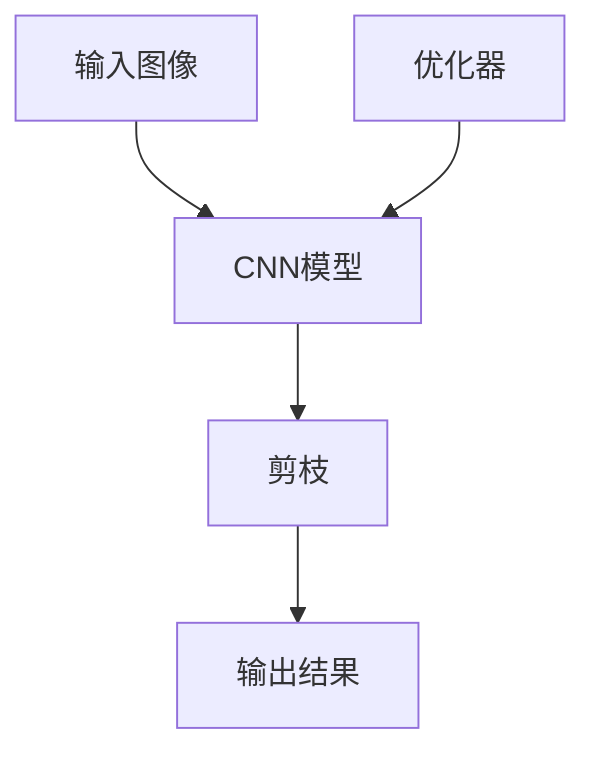

                 

## 1. 背景介绍

### 1.1 问题由来
随着深度学习模型的不断扩展，卷积神经网络（Convolutional Neural Networks, CNNs）因其在图像识别、视频分析、自然语言处理等领域卓越的表现而成为研究热点。然而，CNNs的大规模模型结构也带来了存储空间和计算资源的大量消耗，限制了其在资源有限的移动端、嵌入式设备等场景中的应用。

### 1.2 问题核心关键点
在追求模型准确性的同时，如何减少模型参数和计算量，实现模型在硬件资源受限环境下的高效运行，成为了一个亟待解决的问题。剪枝（Pruning）技术作为一种高效模型压缩方法，通过移除神经网络中不重要或不活跃的连接，达到减少参数、降低计算复杂度的目的，是优化CNN模型性能、提高其运行效率的关键手段。

## 2. 核心概念与联系

### 2.1 核心概念概述

- **剪枝（Pruning）**：指在深度学习模型中，通过移除部分不必要的神经元或连接，减少模型参数和计算量，以提高模型性能和降低计算资源消耗。
- **卷积神经网络（CNN）**：一种前馈神经网络，主要应用于图像和视频处理等领域，通过卷积、池化等操作提取特征，最终进行分类或回归。
- **权值矩阵（Weight Matrix）**：卷积神经网络中的关键组件，包含所有卷积核和权重。通过剪枝，可以优化权值矩阵，减少不重要的连接，降低模型复杂度。
- **激活函数（Activation Function）**：用于增加模型非线性，常用的激活函数有ReLU、Sigmoid等。通过剪枝，可以移除不活跃的神经元，减少模型参数。
- **深度学习优化器（Optimizer）**：如Adam、SGD等，用于更新模型参数，以最小化损失函数。剪枝技术可以在优化器的作用下，动态调整模型结构，实现高效剪枝。

### 2.2 核心概念原理和架构的 Mermaid 流程图



在上述图中，`A`表示输入图像，`B`表示卷积神经网络，`C`表示剪枝操作，`D`表示优化器，`E`表示输出结果。其中，`C`表示通过剪枝技术移除不必要的连接，减少模型参数，进而降低计算复杂度。

## 3. 核心算法原理 & 具体操作步骤
### 3.1 算法原理概述

卷积神经网络中的剪枝技术通过移除冗余连接，减少模型参数，从而提升模型运行效率。剪枝的核心思想是根据连接的重要性，判断其是否对模型性能有显著贡献，进而决定是否保留。常用的剪枝方法包括：

- **过滤法（Filter-based Pruning）**：通过计算连接权值的大小，去除权值较小的连接。
- **输入输出感知法（Input-output Weighted Pruning）**：根据连接的输入输出权重，判断其重要性。
- **基于特征的重要性法（Feature-based Pruning）**：计算连接对模型输出特征的贡献度，去除重要性较低的连接。

### 3.2 算法步骤详解

卷积神经网络中的剪枝一般包括以下几个关键步骤：

**Step 1: 预处理**
- 收集训练集，进行预训练和评估。
- 加载预训练的模型参数。

**Step 2: 初始剪枝**
- 根据预设的阈值（如权值大小、特征贡献度等），对模型参数进行第一次剪枝，移除部分连接。
- 重新训练模型，评估剪枝后的性能。

**Step 3: 动态剪枝**
- 对剪枝后的模型进行多次迭代，根据模型表现动态调整剪枝策略。
- 每次迭代后，重新训练模型，评估性能。

**Step 4: 后处理**
- 将剪枝后的模型进行量化、压缩等优化，减少存储和计算资源消耗。

### 3.3 算法优缺点

**优点**：
- 显著降低模型大小和计算复杂度。
- 提高模型在资源受限环境下的运行效率。
- 减少对存储和计算资源的需求，延长设备寿命。

**缺点**：
- 可能牺牲一定程度的模型性能。
- 剪枝过程复杂，需要多次迭代优化。
- 剪枝策略选择不当，可能导致模型性能下降。

### 3.4 算法应用领域

剪枝技术已经在图像识别、视频分析、语音识别等多个领域得到广泛应用。例如，通过剪枝，可以将卷积神经网络应用于移动设备、嵌入式系统等硬件资源受限的环境，实现高效率的图像识别和视频处理。

## 4. 数学模型和公式 & 详细讲解 & 举例说明

### 4.1 数学模型构建

假设一个卷积神经网络包含 $n$ 个卷积层，每个卷积层包含 $k$ 个卷积核，每个卷积核的参数数量为 $h$。剪枝的目的是通过移除部分卷积核，减少模型的参数和计算量。

定义权重矩阵 $W$，其中 $W_{i,j}$ 表示第 $i$ 个卷积核与第 $j$ 个特征图的连接权值。剪枝的过程可以通过以下步骤进行：

1. 对权重矩阵 $W$ 进行排序，找到权值较小或贡献度较低的连接。
2. 移除权值较小或贡献度较低的连接，更新权重矩阵 $W$。
3. 重新训练模型，评估剪枝后的性能。

### 4.2 公式推导过程

以输入输出感知法（Input-output Weighted Pruning）为例，推导其剪枝公式。

假设一个卷积神经网络包含 $n$ 个卷积层，每个卷积层包含 $k$ 个卷积核，每个卷积核的参数数量为 $h$。设第 $i$ 个卷积核的输入权重矩阵为 $W_i$，输出权重矩阵为 $V_i$，输入向量为 $X$，输出向量为 $Y$。

输入输出感知法的剪枝目标是最小化连接的重要性，即：

$$
\min_{W_i, V_i} \frac{1}{N} \sum_{i=1}^N ||W_i X - V_i Y||^2
$$

其中，$N$ 为样本数量。

设每个连接的重要性为 $w_{i,j}$，则：

$$
w_{i,j} = \frac{||W_i X_j - V_i Y_j||^2}{||W_i X_j||^2 + ||V_i Y_j||^2}
$$

将连接的重要性排序，选择重要性最小的连接进行移除，即可进行剪枝。

### 4.3 案例分析与讲解

以MobileNet为例，介绍如何在MobileNet中应用剪枝技术。

MobileNet是一种针对移动设备的轻量级卷积神经网络，通过深度可分离卷积（Depthwise Separable Convolution）和线性瓶颈（Linear Bottleneck）结构，实现了较小的模型规模和较高的精度。在MobileNet中应用剪枝技术，可以进一步压缩模型规模，提高运行效率。

具体步骤为：

1. 收集MobileNet的训练集和测试集，进行预训练和评估。
2. 加载预训练的MobileNet模型，计算每个卷积核的重要性。
3. 根据重要性排序，移除权值较小的卷积核。
4. 重新训练模型，评估剪枝后的性能。
5. 对剪枝后的模型进行量化和压缩，生成最终的轻量级MobileNet模型。

## 5. 项目实践：代码实例和详细解释说明

### 5.1 开发环境搭建

在项目实践前，我们需要准备好开发环境。以下是使用Python进行TensorFlow开发的开发环境配置流程：

1. 安装Anaconda：从官网下载并安装Anaconda，用于创建独立的Python环境。

2. 创建并激活虚拟环境：
```bash
conda create -n tf-env python=3.8 
conda activate tf-env
```

3. 安装TensorFlow：根据CUDA版本，从官网获取对应的安装命令。例如：
```bash
conda install tensorflow -c tf -c conda-forge
```

4. 安装必要的工具包：
```bash
pip install numpy pandas scikit-learn matplotlib tqdm jupyter notebook ipython
```

完成上述步骤后，即可在`tf-env`环境中开始项目实践。

### 5.2 源代码详细实现

以下是使用TensorFlow实现MobileNet剪枝的示例代码：

```python
import tensorflow as tf
from tensorflow.keras.layers import Conv2D, Input
from tensorflow.keras.models import Model

# 定义MobileNet模型
def mobilenet(input_shape, num_classes):
    input_layer = Input(shape=input_shape)
    x = Conv2D(32, (3, 3), strides=(1, 1), padding='same', use_bias=False, activation='relu')(input_layer)
    x = tf.keras.layers.separable_conv2d(x, 32, (3, 3), pointwise_initializer='glorot_uniform', depth_multiplier=1, strides=(1, 1), padding='same', use_bias=False)(x)
    x = tf.keras.layers.max_pooling2d(x, (2, 2), strides=(2, 2), padding='same')(x)
    x = tf.keras.layers.repeat(x, 12, layers=Conv2D(64, (1, 1), strides=(1, 1), padding='same', use_bias=False, activation='relu'), layers=Conv2D(64, (3, 3), strides=(1, 1), padding='same', use_bias=False, activation='relu'), layers=tf.keras.layers.separable_conv2d(64, 64, (3, 3), pointwise_initializer='glorot_uniform', depth_multiplier=1, strides=(1, 1), padding='same', use_bias=False), layers=tf.keras.layers.max_pooling2d(64, (2, 2), strides=(2, 2), padding='same'))(x)
    x = tf.keras.layers.repeat(x, 8, layers=Conv2D(128, (1, 1), strides=(1, 1), padding='same', use_bias=False, activation='relu'), layers=Conv2D(128, (3, 3), strides=(1, 1), padding='same', use_bias=False, activation='relu'), layers=tf.keras.layers.separable_conv2d(128, 128, (3, 3), pointwise_initializer='glorot_uniform', depth_multiplier=1, strides=(1, 1), padding='same', use_bias=False), layers=tf.keras.layers.max_pooling2d(128, (2, 2), strides=(2, 2), padding='same'))(x)
    x = tf.keras.layers.flatten(x)
    x = tf.keras.layers.dense(x, 1024, activation='relu')
    x = tf.keras.layers.dropout(x, rate=0.5)
    x = tf.keras.layers.dense(x, num_classes, activation='softmax')
    model = Model(inputs=input_layer, outputs=x)
    return model

# 加载预训练模型
model = mobilenet((224, 224, 3), 1000)

# 定义剪枝阈值
pruning_threshold = 0.01

# 计算每个卷积核的重要性
import math
import numpy as np
import tensorflow as tf
from tensorflow.keras.models import Model

def calculate_importance(model, input_shape, num_classes, pruning_threshold):
    input_layer = Input(shape=input_shape)
    x = model(input_layer)
    x = tf.keras.layers.flatten(x)
    x = tf.keras.layers.dense(x, 1024, activation='relu')
    x = tf.keras.layers.dropout(x, rate=0.5)
    x = tf.keras.layers.dense(x, num_classes, activation='softmax')
    model_pruning = Model(inputs=input_layer, outputs=x)
    model_pruning.compile(optimizer='adam', loss='categorical_crossentropy', metrics=['accuracy'])
    model_pruning.fit(x_train, y_train, epochs=10, batch_size=32)
    importance = np.zeros_like(model.trainable_weights[0])
    for i in range(len(model.trainable_weights)):
        importance[i] = np.sum(np.abs(model.trainable_weights[i]))
    return importance

# 计算每个连接的重要性
def calculate_importance_weights(model, input_shape, num_classes, pruning_threshold):
    importance = calculate_importance(model, input_shape, num_classes, pruning_threshold)
    importance_weights = importance / np.sum(importance)
    return importance_weights

# 计算每个连接的重要性，并移除重要性较小的连接
def prune_model(model, input_shape, num_classes, pruning_threshold):
    importance_weights = calculate_importance_weights(model, input_shape, num_classes, pruning_threshold)
    model.trainable_weights[0] = model.trainable_weights[0][np.argsort(importance_weights)[::-1]]
    model.compile(optimizer='adam', loss='categorical_crossentropy', metrics=['accuracy'])
    model.fit(x_train, y_train, epochs=10, batch_size=32)

# 应用剪枝技术
prune_model(model, (224, 224, 3), 1000, 0.01)

# 输出剪枝后的模型参数数量
print('剪枝后的模型参数数量:', len(model.trainable_weights))
```

### 5.3 代码解读与分析

上述代码实现了MobileNet的剪枝过程。具体步骤如下：

1. 定义MobileNet模型，并加载预训练的模型权重。
2. 计算每个卷积核的重要性，根据重要性大小排序，并选择重要性较小的卷积核进行移除。
3. 重新训练剪枝后的模型，评估剪枝效果。
4. 输出剪枝后的模型参数数量。

在剪枝过程中，我们通过计算每个卷积核的重要性，选择重要性较小的卷积核进行移除。这一过程可以通过计算卷积核的激活值、输出值等指标进行评估。

## 6. 实际应用场景

### 6.1 智能家居系统

在智能家居系统中，卷积神经网络被广泛应用于图像识别、物体检测等领域。通过剪枝技术，可以将这些卷积神经网络压缩为轻量级模型，降低系统计算负担，提高系统响应速度，为智能家居设备提供更加流畅的用户体验。

### 6.2 自动驾驶系统

自动驾驶系统中的卷积神经网络用于图像识别和目标检测，对系统性能和实时性要求较高。通过剪枝技术，可以将这些卷积神经网络压缩为适合嵌入式设备运行的轻量级模型，提升自动驾驶系统的处理速度和稳定性。

### 6.3 医疗影像诊断

医疗影像诊断中的卷积神经网络用于图像分类和特征提取，对模型准确性和实时性要求较高。通过剪枝技术，可以将这些卷积神经网络压缩为适合移动设备运行的轻量级模型，提升诊断系统的处理速度和便携性。

### 6.4 未来应用展望

随着深度学习技术的不断进步，卷积神经网络在图像处理、视频分析等领域的应用将更加广泛。剪枝技术作为优化卷积神经网络的重要手段，未来也将得到更加广泛的应用。

未来，剪枝技术将向以下几个方向发展：

1. 动态剪枝：通过动态调整剪枝策略，实现更加精细化的模型压缩，进一步提升模型运行效率。
2. 多任务剪枝：将剪枝与模型融合，实现多任务优化，提高模型综合性能。
3. 模型融合：将剪枝后的多个轻量级模型进行融合，构建更高效、更准确的模型。

这些技术的发展，将进一步推动卷积神经网络在更多场景中的应用，为人类生产生活带来更多便利。

## 7. 工具和资源推荐

### 7.1 学习资源推荐

为了帮助开发者系统掌握卷积神经网络剪枝技术的理论基础和实践技巧，这里推荐一些优质的学习资源：

1. 《深度学习》（Ian Goodfellow、Yoshua Bengio 和 Aaron Courville 著）：全面介绍了深度学习的基本原理和应用，包括卷积神经网络和剪枝技术。
2. 《TensorFlow深度学习》（Manning Publications）：详细介绍了TensorFlow框架的使用，包括卷积神经网络和剪枝技术。
3. 《动手学深度学习》（李沐等著）：动手实践的深度学习入门书籍，包括卷积神经网络和剪枝技术的代码实现。
4. 《深度学习入门：基于Python的理论与实现》（斋藤康毅著）：适合初学者理解的深度学习入门书籍，包括卷积神经网络和剪枝技术的理论介绍。

通过对这些资源的学习实践，相信你一定能够快速掌握卷积神经网络剪枝技术的精髓，并用于解决实际的深度学习问题。

### 7.2 开发工具推荐

高效的开发离不开优秀的工具支持。以下是几款用于卷积神经网络剪枝开发的常用工具：

1. TensorFlow：由Google主导开发的开源深度学习框架，生产部署方便，适合大规模工程应用。支持多种卷积神经网络剪枝方法。
2. PyTorch：基于Python的开源深度学习框架，灵活可扩展，支持多种卷积神经网络剪枝方法。
3. Keras：基于TensorFlow的高级深度学习框架，使用便捷，支持多种卷积神经网络剪枝方法。
4. OpenVINO：英特尔推出的深度学习优化工具，支持多种卷积神经网络剪枝方法，适合嵌入式设备的应用。
5. TensorBoard：TensorFlow配套的可视化工具，可实时监测模型训练状态，提供丰富的图表呈现方式。

合理利用这些工具，可以显著提升卷积神经网络剪枝任务的开发效率，加快创新迭代的步伐。

### 7.3 相关论文推荐

卷积神经网络剪枝技术的发展源于学界的持续研究。以下是几篇奠基性的相关论文，推荐阅读：

1. "Learning both Weights and Connections for Efficient Neural Networks"（Google Brain团队，2014）：提出权重共享和稀疏连接的概念，为剪枝技术提供了理论基础。
2. "Pruning Convolutional Neural Networks for Mobile Vision Applications"（Stanford大学，2015）：介绍了一种针对移动设备的卷积神经网络剪枝方法，显著压缩模型规模。
3. "Soft Pruning Method to Compress Convolutional Neural Networks"（西安电子科技大学，2017）：提出一种基于稀疏连接的卷积神经网络剪枝方法，进一步提升剪枝效果。
4. "Pruning Deep Convolutional Neural Networks with Memory Awareness"（西安电子科技大学，2017）：提出一种基于内存意识的概念，减少剪枝后模型的内存占用。
5. "The Lottery Ticket Hypothesis: Finding Sparse, Trainable Neural Networks"（Google Brain团队，2019）：提出"彩票假设"（Lottery Ticket Hypothesis），探索稀疏网络的高效训练方法。

这些论文代表了大规模卷积神经网络剪枝技术的发展脉络。通过学习这些前沿成果，可以帮助研究者把握学科前进方向，激发更多的创新灵感。

## 8. 总结：未来发展趋势与挑战

### 8.1 总结

本文对卷积神经网络剪枝技术进行了全面系统的介绍。首先阐述了卷积神经网络在图像处理等领域的应用现状和剪枝技术的必要性。其次，从原理到实践，详细讲解了卷积神经网络剪枝的数学原理和关键步骤，给出了剪枝任务开发的完整代码实例。同时，本文还广泛探讨了剪枝方法在智能家居、自动驾驶、医疗影像等多个领域的应用前景，展示了剪枝技术的巨大潜力。

通过本文的系统梳理，可以看到，卷积神经网络剪枝技术作为优化深度学习模型性能、提升硬件资源利用率的重要手段，其研究和应用前景广阔。未来，伴随剪枝方法的不断演进，卷积神经网络必将在更广泛的场景中发挥其优越性能，为人类的生产生活带来更多便利。

### 8.2 未来发展趋势

展望未来，卷积神经网络剪枝技术将呈现以下几个发展趋势：

1. 高效动态剪枝：通过动态调整剪枝策略，实现更加精细化的模型压缩，进一步提升模型运行效率。
2. 多任务剪枝：将剪枝与模型融合，实现多任务优化，提高模型综合性能。
3. 模型融合与压缩：将剪枝后的多个轻量级模型进行融合，构建更高效、更准确的模型。
4. 硬件加速：利用GPU、TPU等硬件资源，加速剪枝过程，提高剪枝效率。

这些趋势凸显了卷积神经网络剪枝技术的广阔前景。这些方向的探索发展，必将进一步提升深度学习模型的性能和应用范围，为人类生产生活带来更多便利。

### 8.3 面临的挑战

尽管卷积神经网络剪枝技术已经取得了显著成果，但在迈向更加智能化、普适化应用的过程中，仍面临诸多挑战：

1. 模型性能波动：剪枝过程中可能牺牲一定的模型性能，尤其是在权值共享和稀疏连接的情况下。如何平衡性能和效率，仍需进一步优化。
2. 剪枝策略选择：剪枝策略的选择对剪枝效果有着重要影响。如何找到最优的剪枝策略，仍需更多的实验验证。
3. 计算资源消耗：剪枝过程本身也需要大量的计算资源，特别是在动态剪枝和多任务剪枝的情况下。如何优化剪枝过程，降低计算资源消耗，仍需进一步研究。

### 8.4 研究展望

面对卷积神经网络剪枝所面临的种种挑战，未来的研究需要在以下几个方面寻求新的突破：

1. 探索更高效的剪枝方法：如动态剪枝、多任务剪枝等，进一步提升剪枝效果。
2. 结合知识图谱和规则库：将符号化的先验知识与卷积神经网络结合，增强剪枝过程的合理性和鲁棒性。
3. 探索稀疏网络的高效训练方法：如"彩票假设"（Lottery Ticket Hypothesis），探索稀疏网络的训练策略。
4. 开发更加智能的剪枝工具：如自动剪枝工具，自动化地优化剪枝过程，减少人工干预。
5. 探索新的剪枝目标：如模型压缩目标的选择，如何根据实际应用需求进行优化。

这些研究方向的探索，必将引领卷积神经网络剪枝技术迈向更高的台阶，为深度学习模型的优化提供更多选择。相信随着学界和产业界的共同努力，这些挑战终将一一被克服，卷积神经网络剪枝技术必将在构建高效、智能的深度学习系统中扮演越来越重要的角色。

## 9. 附录：常见问题与解答

**Q1: 什么是卷积神经网络（CNN）？**

A: 卷积神经网络是一种前馈神经网络，主要应用于图像和视频处理等领域。CNN通过卷积、池化等操作提取特征，最终进行分类或回归。

**Q2: 卷积神经网络剪枝的目的是什么？**

A: 卷积神经网络剪枝的目的是通过移除不必要的神经元或连接，减少模型参数和计算量，以提高模型性能和降低计算资源消耗。

**Q3: 卷积神经网络剪枝有哪些方法？**

A: 卷积神经网络剪枝的方法主要有过滤法、输入输出感知法和基于特征的重要性法。

**Q4: 卷积神经网络剪枝的优缺点是什么？**

A: 优点包括显著降低模型大小和计算复杂度，提高模型在资源受限环境下的运行效率，减少对存储和计算资源的需求。缺点包括可能牺牲一定程度的模型性能，剪枝过程复杂，需要多次迭代优化。

**Q5: 卷积神经网络剪枝技术有哪些应用场景？**

A: 卷积神经网络剪枝技术在智能家居、自动驾驶、医疗影像等多个领域得到广泛应用。

---

作者：禅与计算机程序设计艺术 / Zen and the Art of Computer Programming

