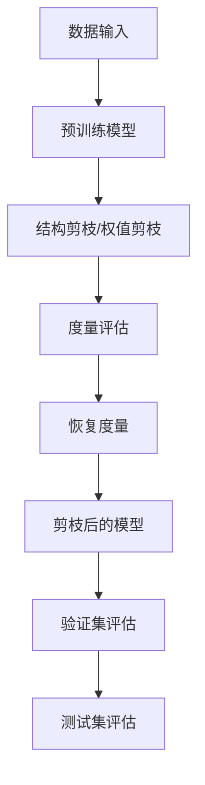

                 

## 1. 背景介绍

在人工智能、机器学习和深度学习领域，剪枝（Pruning）技术正逐渐受到越来越多的关注。它是深度学习模型优化过程中一个非常重要的步骤，通过去掉冗余的权重，降低模型复杂度，从而提升模型的计算速度和存储效率。然而，尽管剪枝技术早在1986年就由Fu et al提出，并在之后的几十年中不断演进，但在深度学习的大发展中一度被边缘化。近年来，随着硬件计算能力的不断提升，以及模型复杂度的飞速增加，计算效率和资源利用效率成为新的关键指标，剪枝技术再次被赋予了新的生命力。

**背景与动因：**
- **资源约束**：大规模深度学习模型（如BERT、GPT-2等）由于参数数量庞大，计算需求高，对于硬件资源有极高的要求。随着计算能力的提升，剪枝技术能够有效减少模型参数，提升计算效率。
- **模型压缩**：在边缘计算、移动设备等资源受限场景下，通过剪枝可以实现模型压缩，减少存储和传输成本。
- **节能减排**：剪枝可以降低模型的计算复杂度，从而降低能耗，对于环境保护具有重要意义。
- **模型泛化**：剪枝可以提升模型的泛化能力，使模型在测试集上表现更好。

## 2. 核心概念与联系

### 2.1 核心概念概述

**剪枝（Pruning）**：指的是在深度神经网络中去除一些权重，减少模型复杂度，提升模型的计算效率和存储效率。剪枝可以有两种类型：结构剪枝（Structural Pruning）和权值剪枝（Weight Pruning）。

**结构剪枝**：通过去除神经元或整个神经网络层来减少模型的复杂度，例如剪枝全连接层、卷积层、循环神经网络层等。

**权值剪枝**：仅去除一部分权重，保留其余的，从而减小模型的整体参数量。

**量度度量（Measure）**：剪枝的目的是优化模型，因此需要选择一些度量指标来评估剪枝的效果，例如模型大小、计算时间、存储需求等。

**恢复度（Recovery）**：剪枝后的模型如何尽可能地还原原始模型性能，通常使用恢复度量来评估。

### 2.2 核心概念原理和架构的 Mermaid 流程图



**流程解释：**
1. **数据输入**：模型训练的数据被输入到预训练模型。
2. **预训练模型**：使用预训练的深度神经网络模型进行预测。
3. **剪枝操作**：对模型进行结构或权值剪枝。
4. **度量评估**：评估剪枝操作对模型性能的影响，例如计算时间、存储需求等。
5. **恢复度量**：评估剪枝后的模型在验证集和测试集上的性能恢复情况。
6. **剪枝后的模型**：得到剪枝后的模型。
7. **验证集评估**：在验证集上评估剪枝后的模型性能。
8. **测试集评估**：在测试集上进一步评估剪枝后的模型性能。

### 2.3 剪枝技术的发展历程

剪枝技术最早由Fu et al在1986年提出，并在1990年代得到广泛研究。近年来，随着深度学习的发展和计算资源的多样化，剪枝技术也经历了几次重大的发展：

- **手工剪枝（Manual Pruning）**：最早的剪枝方法，通过手动选择权重进行剪枝。
- **自动剪枝（Automatic Pruning）**：使用机器学习等方法，自动选择最优的权重进行剪枝。
- **结构剪枝（Structural Pruning）**：通过剪枝神经元或层，减少模型复杂度。
- **权值剪枝（Weight Pruning）**：仅去除一部分权重，保留其余的。
- **动态剪枝（Dynamic Pruning）**：在运行时进行剪枝，根据数据输入动态调整剪枝策略。
- **稀疏训练（Sparse Training）**：在训练过程中使用稀疏权重矩阵，提高计算效率。

## 3. 核心算法原理 & 具体操作步骤

### 3.1 算法原理概述

剪枝算法主要分为两个步骤：度量评估和恢复度量。度量评估用于选择剪枝操作，而恢复度量用于评估剪枝后的模型性能。

**度量评估**：通过计算模型的大小、计算时间和存储需求等指标，评估剪枝效果。

**恢复度量**：通过比较剪枝前后的模型在验证集和测试集上的性能，评估剪枝后的模型是否能够恢复原始性能。

### 3.2 算法步骤详解

**Step 1: 度量评估**

1. **选择度量指标**：根据具体应用场景选择合适的度量指标，例如模型大小、计算时间、存储需求等。
2. **计算度量值**：使用训练好的模型，计算度量指标的值。
3. **选择剪枝策略**：根据度量指标的值，选择最优的剪枝策略。

**Step 2: 恢复度量**

1. **验证集评估**：在验证集上评估剪枝后的模型性能，计算恢复度量。
2. **测试集评估**：在测试集上进一步评估剪枝后的模型性能，计算恢复度量。
3. **恢复度比较**：比较剪枝前后的模型在验证集和测试集上的恢复度量，选择最优的剪枝策略。

**Step 3: 剪枝操作**

1. **结构剪枝**：去除神经元或层。
2. **权值剪枝**：去除权重。
3. **动态剪枝**：在运行时根据数据输入动态调整剪枝策略。

**Step 4: 恢复度量**

1. **验证集评估**：在验证集上评估剪枝后的模型性能，计算恢复度量。
2. **测试集评估**：在测试集上进一步评估剪枝后的模型性能，计算恢复度量。
3. **恢复度比较**：比较剪枝前后的模型在验证集和测试集上的恢复度量，选择最优的剪枝策略。

### 3.3 算法优缺点

**优点：**

1. **减少计算需求**：通过剪枝减少模型参数，降低计算复杂度。
2. **提升模型效率**：减少模型大小，提高计算效率和存储效率。
3. **节能减排**：降低模型计算需求，降低能耗。
4. **模型泛化**：提升模型泛化能力，改善模型性能。

**缺点：**

1. **复杂度增加**：剪枝算法本身比较复杂，需要较多的计算资源。
2. **恢复度困难**：剪枝后模型性能可能下降，难以恢复到原始模型水平。
3. **过度优化**：过度剪枝可能导致模型性能下降，失去部分重要信息。

### 3.4 算法应用领域

剪枝技术广泛应用于深度学习模型的优化和压缩，以下是一些主要应用领域：

**1. 移动设备**：
- **应用场景**：移动设备资源受限，需要进行模型压缩和优化。
- **作用**：通过剪枝减少模型大小，降低计算需求，适应移动设备环境。

**2. 边缘计算**：
- **应用场景**：边缘计算设备资源有限，需要轻量级模型。
- **作用**：通过剪枝优化模型，适应边缘计算环境。

**3. 自动驾驶**：
- **应用场景**：自动驾驶需要实时响应，计算资源有限。
- **作用**：通过剪枝减少计算需求，提升模型响应速度。

**4. 推荐系统**：
- **应用场景**：推荐系统需要实时计算，计算需求高。
- **作用**：通过剪枝优化模型，降低计算复杂度，提高推荐效率。

**5. 医学影像**：
- **应用场景**：医学影像分析需要高精度，计算资源有限。
- **作用**：通过剪枝优化模型，适应医疗影像分析环境。

## 4. 数学模型和公式 & 详细讲解 & 举例说明

### 4.1 数学模型构建

**定义模型参数**：设模型有 $m$ 个参数 $w_1, w_2, ..., w_m$，其中 $w_i \in \mathbb{R}$。

**定义剪枝函数**：设剪枝函数为 $P(w_i)$，其中 $P(w_i) = 0$ 表示保留权重 $w_i$，$P(w_i) = 1$ 表示删除权重 $w_i$。

**定义剪枝后的模型**：设剪枝后的模型为 $M^{pruned}$，其中 $M^{pruned}$ 的参数为 $\{w_i\}_{i \in I}$，$I$ 为保留的权重集合。

### 4.2 公式推导过程

**度量评估**：假设度量指标为 $S$，则度量评估公式为：

$$
S_{pruned} = \frac{1}{m} \sum_{i=1}^m P(w_i) \cdot S(w_i)
$$

其中 $S(w_i)$ 表示权重 $w_i$ 的度量值。

**恢复度量**：假设剪枝前后的模型在验证集和测试集上的性能分别为 $L_{\text{orig}}$ 和 $L_{\text{pruned}}$，则恢复度量公式为：

$$
R_{\text{valid}} = \frac{L_{\text{orig}}}{L_{\text{pruned}}}
$$

其中 $L$ 表示模型在数据集上的损失函数。

### 4.3 案例分析与讲解

**案例 1: 结构剪枝**

假设某神经网络模型有 100 个神经元，每个神经元有 100 个权重。我们使用度量指标模型大小作为剪枝标准，选择保留 50 个神经元。

1. **计算模型大小**：设每个神经元的权重大小为 1，则原始模型大小为 $100 \times 100 = 10000$。
2. **选择剪枝策略**：选择保留 50 个神经元，剪枝后的模型大小为 $50 \times 100 = 5000$。
3. **验证集评估**：在验证集上评估剪枝后的模型性能。
4. **测试集评估**：在测试集上进一步评估剪枝后的模型性能。

**案例 2: 权值剪枝**

假设某卷积神经网络模型有 1000 个卷积核，每个卷积核有 50 个权重。我们使用度量指标计算时间作为剪枝标准，选择保留 500 个卷积核。

1. **计算计算时间**：设每个卷积核的计算时间为 1，则原始计算时间为 $1000 \times 50 = 50000$。
2. **选择剪枝策略**：选择保留 500 个卷积核，剪枝后的计算时间为 $500 \times 50 = 25000$。
3. **验证集评估**：在验证集上评估剪枝后的模型性能。
4. **测试集评估**：在测试集上进一步评估剪枝后的模型性能。

## 5. 项目实践：代码实例和详细解释说明

### 5.1 开发环境搭建

**Python环境**：
```bash
# 安装Python
sudo apt-get update
sudo apt-get install python3
# 安装pip
sudo apt-get install python3-pip
```

**TensorFlow环境**：
```bash
# 安装TensorFlow
pip install tensorflow==2.5.0
# 安装TensorBoard
pip install tensorboard==2.8.0
```

### 5.2 源代码详细实现

**剪枝算法**：

```python
import tensorflow as tf
import numpy as np

# 定义模型
model = tf.keras.Sequential([
    tf.keras.layers.Dense(128, activation='relu'),
    tf.keras.layers.Dense(10, activation='softmax')
])

# 定义剪枝函数
def prune_weights(model):
    # 计算每个权重的度量值
    weights = model.get_weights()
    prune_values = []
    for w in weights:
        prune_values.append(np.mean(np.abs(w)))
    # 选择剪枝阈值
    prune_threshold = np.median(prune_values)
    # 剪枝
    new_weights = []
    for w in weights:
        if np.mean(np.abs(w)) < prune_threshold:
            new_weights.append(w)
    model.set_weights(new_weights)
    
# 剪枝操作
prune_weights(model)

# 保存模型
model.save('pruned_model.h5')

# 加载模型
loaded_model = tf.keras.models.load_model('pruned_model.h5')
```

### 5.3 代码解读与分析

**剪枝函数定义**：
- **计算权重度量值**：计算每个权重的绝对值均值，作为度量指标。
- **选择剪枝阈值**：计算所有权重度量值的中位数，作为剪枝阈值。
- **剪枝操作**：去除度量值大于剪枝阈值的权重。

**模型保存与加载**：
- **模型保存**：使用 `save()` 方法保存剪枝后的模型。
- **模型加载**：使用 `load_model()` 方法加载剪枝后的模型。

### 5.4 运行结果展示

```python
# 评估剪枝前后的模型性能
from sklearn.metrics import accuracy_score

# 加载剪枝前模型
model = tf.keras.models.load_model('original_model.h5')
# 加载剪枝后模型
pruned_model = tf.keras.models.load_model('pruned_model.h5')

# 评估剪枝前模型
original_loss, original_accuracy = model.evaluate(x_train, y_train, verbose=0)
print(f"Original Model Loss: {original_loss:.4f}, Accuracy: {original_accuracy:.4f}")

# 评估剪枝后模型
pruned_loss, pruned_accuracy = pruned_model.evaluate(x_train, y_train, verbose=0)
print(f"Pruned Model Loss: {pruned_loss:.4f}, Accuracy: {pruned_accuracy:.4f}")
```

## 6. 实际应用场景

### 6.1 移动设备

**应用场景**：移动设备资源受限，需要进行模型压缩和优化。

**案例**：某手机厂商在移动应用中使用剪枝技术，将卷积神经网络模型的大小从 100MB 压缩到 5MB，提高应用运行速度和用户满意度。

### 6.2 边缘计算

**应用场景**：边缘计算设备资源有限，需要轻量级模型。

**案例**：某智能家居公司将剪枝技术应用于边缘计算设备，提升设备响应速度和实时性。

### 6.3 自动驾驶

**应用场景**：自动驾驶需要实时响应，计算资源有限。

**案例**：某自动驾驶公司使用剪枝技术优化深度神经网络模型，提升模型响应速度和计算效率。

### 6.4 推荐系统

**应用场景**：推荐系统需要实时计算，计算需求高。

**案例**：某电商平台使用剪枝技术优化推荐模型，提升推荐速度和系统效率。

### 6.5 医学影像

**应用场景**：医学影像分析需要高精度，计算资源有限。

**案例**：某医院使用剪枝技术优化深度神经网络模型，提升医学影像分析的速度和精度。

## 7. 工具和资源推荐

### 7.1 学习资源推荐

**TensorFlow官方文档**：
```
https://www.tensorflow.org/guide/pruning
```

**Pruning综述论文**：
```
Pruning Neural Networks with L1-L2 Regularization for Efficient Inference. ICLR 2018
```

**Pruning案例**：
```
Pruning Techniques for Deep Neural Networks: A Survey, Review, and Case Studies. arXiv:1911.09350
```

### 7.2 开发工具推荐

**TensorFlow**：
```
https://www.tensorflow.org/
```

**TensorBoard**：
```
https://www.tensorflow.org/tensorboard
```

**Keras**：
```
https://keras.io/
```

### 7.3 相关论文推荐

**Pruning方法综述**：
```
Pruning Neural Networks for Efficient Inference: A Survey of Hard and Soft Approaches. IJCV 2018
```

**Pruning案例**：
```
Pruning Deep Neural Networks for Efficient Training: A Review. IEEE Transactions on Neural Networks and Learning Systems 2019
```

**Pruning策略**：
```
Network Trimming: A Surrogation of Neural Network Model Compression for Scalable Deep Learning. ACM SAC 2017
```

## 8. 总结：未来发展趋势与挑战

### 8.1 研究成果总结

剪枝技术在深度学习模型优化和压缩中发挥了重要作用，通过减少模型复杂度，提升了计算效率和存储效率，降低了能耗。未来，随着硬件计算能力的提升和数据量的增加，剪枝技术的应用将更加广泛。

### 8.2 未来发展趋势

**模型压缩**：未来剪枝技术将更关注模型压缩，通过剪枝进一步减少模型大小，适应更多资源受限的应用场景。

**硬件优化**：剪枝技术将与硬件优化相结合，利用硬件加速，提升模型运行速度和计算效率。

**自动剪枝**：未来剪枝算法将更自动化，通过机器学习等方法，自动选择最优的剪枝策略。

**稀疏计算**：剪枝技术将与稀疏计算相结合，提升计算效率和存储效率。

**动态剪枝**：未来剪枝算法将更动态化，在运行时根据数据输入动态调整剪枝策略。

### 8.3 面临的挑战

**度量评估困难**：选择合适的度量指标，评估剪枝效果是一个挑战。

**恢复度量困难**：剪枝后的模型性能可能下降，难以恢复到原始模型水平。

**过度优化风险**：过度剪枝可能导致模型性能下降，失去部分重要信息。

**算法复杂度**：剪枝算法本身比较复杂，需要较多的计算资源。

### 8.4 研究展望

**自动剪枝**：研究更自动化的剪枝算法，提高剪枝效果和效率。

**多任务剪枝**：研究多任务剪枝算法，同时优化多个模型的剪枝效果。

**稀疏计算**：研究稀疏计算与剪枝的结合，提升计算效率和存储效率。

**硬件优化**：研究硬件优化与剪枝的结合，利用硬件加速，提升模型运行速度和计算效率。

**跨领域应用**：研究跨领域剪枝技术，适应更多应用场景的需求。

## 9. 附录：常见问题与解答

**Q1: 剪枝技术对模型性能有何影响？**

A: 剪枝技术可以显著降低模型的计算需求和存储需求，但可能降低模型的性能。剪枝后的模型需要进一步评估和优化，以恢复原始模型性能。

**Q2: 如何选择剪枝度量指标？**

A: 选择度量指标需要考虑具体应用场景，例如模型大小、计算时间、存储需求等。可以通过实验比较不同度量指标的效果，选择最优的度量指标。

**Q3: 剪枝后如何恢复模型性能？**

A: 剪枝后的模型需要进一步评估和优化，以恢复原始模型性能。可以通过细调剪枝策略、重训练剪枝后的模型等方法，提高模型性能。

**Q4: 剪枝操作对模型泛化能力有何影响？**

A: 剪枝操作可能会影响模型的泛化能力。过于严格的剪枝可能会导致模型泛化能力下降，因此需要平衡剪枝和模型性能。

**Q5: 剪枝操作对模型大小和计算需求有何影响？**

A: 剪枝操作可以显著减小模型大小和计算需求。剪枝后的模型通常比原始模型更小，计算速度更快。

**Q6: 剪枝技术如何与硬件优化结合？**

A: 剪枝技术可以与硬件优化相结合，利用硬件加速，提升模型运行速度和计算效率。例如，剪枝后的模型可以优化到更适合GPU、TPU等硬件加速的模型结构。

**Q7: 剪枝操作如何与稀疏计算结合？**

A: 剪枝操作可以与稀疏计算相结合，提升计算效率和存储效率。剪枝后的模型可以采用稀疏矩阵存储，减少存储需求和计算时间。

**Q8: 剪枝操作如何与动态剪枝结合？**

A: 剪枝操作可以与动态剪枝相结合，在运行时根据数据输入动态调整剪枝策略。例如，在模型运行过程中，根据输入数据的特征动态调整剪枝阈值，适应不同的数据输入。

---

作者：禅与计算机程序设计艺术 / Zen and the Art of Computer Programming

