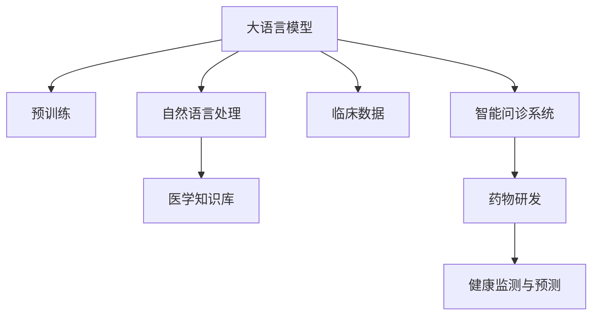

                 

## 1. 背景介绍

### 1.1 问题由来

医疗健康领域长期面临数据匮乏、资源不均、诊断准确率不高等问题，严重制约了医学研究和临床实践的发展。传统的医疗信息技术，如电子病历、放射图像分析、基因测序等，虽然已经取得了一定的进展，但仍然存在许多挑战。近年来，随着深度学习和自然语言处理（Natural Language Processing, NLP）技术的发展，大语言模型（Large Language Model, LLM）在医疗领域的应用引起了广泛关注。

大语言模型，如OpenAI的GPT-3、Google的BERT等，通过在海量文本数据上进行预训练，学习到丰富的语言知识和常识，具备强大的语言理解和生成能力。这些模型在临床医疗数据标注、疾病诊断、药物研发等方面展示了巨大潜力，有助于实现医疗健康领域的智能化和精准化，改善病人的诊疗体验，推动医疗科技的创新与发展。

### 1.2 问题核心关键点

医疗领域的LLM应用主要集中在以下几个关键点：

- **临床辅助诊断**：利用自然语言处理技术，从电子病历中提取出有用的临床信息，辅助医生进行疾病诊断。
- **医学知识推理**：结合医学知识库和病症信息，进行疾病推理和知识查询。
- **药物研发**：通过分析海量的生物医学文献，挖掘潜在的药物信息和治疗方案。
- **健康监测与预测**：实时监测患者健康数据，预测可能的健康风险，提供个性化健康建议。
- **智能问诊与咨询**：构建智能问答系统，快速响应患者查询，提供实时的医疗咨询服务。

## 2. 核心概念与联系

### 2.1 核心概念概述

医疗领域的LLM应用主要涉及以下几个核心概念：

- **大语言模型（LLM）**：以自回归模型（如GPT）或自编码模型（如BERT）为代表的深度学习模型，通过在海量文本数据上进行预训练，学习通用的语言表示。
- **自然语言处理（NLP）**：涉及文本挖掘、文本分类、信息抽取、文本生成等技术，从文本中提取有价值的信息。
- **医学知识库（KB）**：包含医学文献、药物信息、疾病数据等的知识库，用于知识推理和决策支持。
- **临床数据**：包括电子病历、实验室检测结果、影像数据等，是大模型进行医疗应用的重要数据源。
- **智能问诊系统**：基于NLP技术和知识库的智能问答系统，可以解答患者的健康问题，提供实时的医疗咨询服务。
- **药物研发**：结合生物医学文献和化合物数据，通过数据挖掘和机器学习，发现新的药物和治疗方法。

这些概念之间的联系可以通过以下Mermaid流程图来展示：



### 2.2 核心概念原理和架构的 Mermaid 流程图

#### 2.2.1 大语言模型的预训练

预训练过程是大语言模型学习语言知识的基础。一般使用无监督学习任务，如自回归语言模型（如GPT）或自编码语言模型（如BERT），在大规模文本数据上训练模型，使其掌握语言的通用表示。

#### 2.2.2 自然语言处理

自然语言处理技术通过文本挖掘和信息抽取，从电子病历、医学文献等文本中提取结构化信息，如病症、药物名称、实验室检测结果等。

#### 2.2.3 医学知识库

医学知识库包含丰富的医学信息，如疾病、药物、临床指南等。这些知识可以被整合到模型中，辅助医生进行决策和诊断。

#### 2.2.4 临床数据

临床数据是大模型进行医疗应用的基础，包括电子病历、影像数据、实验室检测结果等。这些数据通常结构化较好，可以直接输入模型进行处理。

#### 2.2.5 智能问诊系统

智能问诊系统基于自然语言处理和知识库，能够解答患者健康问题，提供实时的医疗咨询服务。

#### 2.2.6 药物研发

药物研发涉及对生物医学文献和化合物数据进行数据挖掘和机器学习，发现新的药物和治疗方法。

#### 2.2.7 健康监测与预测

健康监测与预测通过实时监测患者健康数据，预测可能的健康风险，提供个性化健康建议。

## 3. 核心算法原理 & 具体操作步骤

### 3.1 算法原理概述

医疗领域的LLM应用，本质上是将大语言模型应用于特定的医疗任务。其核心思想是：将预训练的大语言模型视作一个强大的"特征提取器"，通过有监督地训练来优化模型在该任务上的性能。

以临床辅助诊断为例，假设模型已经在大规模医疗文本数据上进行了预训练，得到一个通用的语言表示模型 $M_{\theta}$。为了解决某个特定的临床诊断问题，可以收集该问题的标注数据集 $D=\{(x_i,y_i)\}_{i=1}^N$，其中 $x_i$ 为患者病历文本，$y_i$ 为疾病诊断标签。微调的目标是找到新的模型参数 $\hat{\theta}$，使得模型在标注数据上的预测准确率最大化。

具体来说，微调过程通常包括以下步骤：

1. 选择合适的预训练语言模型 $M_{\theta}$ 作为初始化参数。
2. 准备标注数据集 $D$，划分为训练集、验证集和测试集。
3. 设计任务适配层，将模型输入和输出与具体任务匹配。
4. 设置微调超参数，包括学习率、优化器等。
5. 在训练集上执行梯度下降优化，更新模型参数。
6. 在验证集上评估模型性能，避免过拟合。
7. 在测试集上测试模型，评估最终性能。

### 3.2 算法步骤详解

#### 3.2.1 数据准备

首先，需要收集和预处理医疗数据。具体步骤如下：

1. 数据收集：从医院、研究机构等渠道获取电子病历、实验室检测结果、影像数据等。
2. 数据清洗：去除无关的噪声信息，如拼写错误、格式化问题等。
3. 数据标注：对数据进行标注，如病历文本的诊断标签、药物名称、实验室检测结果等。

#### 3.2.2 模型选择与初始化

选择合适的预训练语言模型 $M_{\theta}$，如BERT、GPT等。然后，在大规模医疗文本数据上进行预训练，得到模型的初始参数 $\theta_0$。

#### 3.2.3 任务适配层设计

根据具体任务，设计任务适配层。例如，对于临床诊断任务，可以添加一个全连接层和softmax层，输出每个疾病的概率分布。

#### 3.2.4 超参数设置

选择合适的优化器，如Adam、SGD等，设置学习率、批大小、迭代轮数等超参数。

#### 3.2.5 模型训练与评估

在训练集上执行梯度下降优化，更新模型参数。在每个epoch结束后，在验证集上评估模型性能，避免过拟合。迭代至预设的epoch数或达到预设的停止条件。

#### 3.2.6 模型测试与部署

在测试集上测试模型，评估最终性能。将模型集成到实际的应用系统中，如智能问诊、药物研发等。

### 3.3 算法优缺点

#### 3.3.1 优点

医疗领域的LLM应用具有以下优点：

1. **高效性**：通过预训练模型，可以快速处理大量医疗数据，缩短诊断和分析时间。
2. **泛化能力**：预训练模型在处理新数据时，具有良好的泛化能力。
3. **知识转移**：预训练模型可以在医疗领域的知识库中进行知识转移，提升诊断的准确性。
4. **实时性**：智能问诊系统可以实时处理患者的健康问题，提供实时的医疗咨询服务。
5. **成本低**：相比于传统的人工诊断，LLM模型在一定程度上可以降低医疗成本。

#### 3.3.2 缺点

医疗领域的LLM应用也存在以下缺点：

1. **数据隐私问题**：医疗数据涉及个人隐私，需要严格的数据保护措施。
2. **模型偏见**：预训练模型可能存在一定的偏见，需要进行预处理和验证。
3. **复杂度问题**：大模型在医疗应用中可能需要处理复杂的医疗知识，模型设计需要更加精细。
4. **解释性不足**：LLM模型的决策过程难以解释，对医生和患者的信任度可能较低。
5. **数据标注成本**：标注数据可能需要大量的人力资源，标注成本较高。

### 3.4 算法应用领域

医疗领域的LLM应用涵盖多个领域，具体如下：

1. **临床辅助诊断**：辅助医生进行疾病诊断，提高诊断准确率。
2. **医学知识推理**：结合医学知识库和病症信息，进行疾病推理和知识查询。
3. **药物研发**：通过分析海量的生物医学文献，挖掘潜在的药物信息和治疗方法。
4. **智能问诊与咨询**：构建智能问答系统，快速响应患者查询，提供实时的医疗咨询服务。
5. **健康监测与预测**：实时监测患者健康数据，预测可能的健康风险，提供个性化健康建议。

## 4. 数学模型和公式 & 详细讲解 & 举例说明

### 4.1 数学模型构建

假设预训练模型为 $M_{\theta}$，其中 $\theta$ 为预训练得到的模型参数。给定医疗任务 $T$ 的标注数据集 $D=\{(x_i,y_i)\}_{i=1}^N$，其中 $x_i$ 为病历文本，$y_i$ 为诊断标签。

定义模型 $M_{\theta}$ 在输入 $x_i$ 上的输出为 $M_{\theta}(x_i)$，则二分类交叉熵损失函数定义为：

$$
\ell(M_{\theta}(x_i),y_i) = -[y_i\log \hat{y}_i + (1-y_i)\log(1-\hat{y}_i)]
$$

其中 $\hat{y}_i$ 为模型预测的概率分布，即：

$$
\hat{y}_i = \text{softmax}(M_{\theta}(x_i))
$$

在数据集 $D$ 上的经验风险为：

$$
\mathcal{L}(\theta) = \frac{1}{N}\sum_{i=1}^N \ell(M_{\theta}(x_i),y_i)
$$

微调的目标是最小化经验风险，即找到最优参数：

$$
\hat{\theta} = \mathop{\arg\min}_{\theta} \mathcal{L}(\theta)
$$

### 4.2 公式推导过程

以二分类任务为例，推导交叉熵损失函数及其梯度的计算公式。

假设模型 $M_{\theta}$ 在输入 $x_i$ 上的输出为 $\hat{y}_i=M_{\theta}(x_i) \in [0,1]$，表示样本属于正类的概率。真实标签 $y_i \in \{0,1\}$。则二分类交叉熵损失函数定义为：

$$
\ell(M_{\theta}(x_i),y_i) = -[y_i\log \hat{y}_i + (1-y_i)\log(1-\hat{y}_i)]
$$

将其代入经验风险公式，得：

$$
\mathcal{L}(\theta) = -\frac{1}{N}\sum_{i=1}^N [y_i\log M_{\theta}(x_i)+(1-y_i)\log(1-M_{\theta}(x_i))]
$$

根据链式法则，损失函数对参数 $\theta_k$ 的梯度为：

$$
\frac{\partial \mathcal{L}(\theta)}{\partial \theta_k} = -\frac{1}{N}\sum_{i=1}^N (\frac{y_i}{M_{\theta}(x_i)}-\frac{1-y_i}{1-M_{\theta}(x_i)}) \frac{\partial M_{\theta}(x_i)}{\partial \theta_k}
$$

其中 $\frac{\partial M_{\theta}(x_i)}{\partial \theta_k}$ 可进一步递归展开，利用自动微分技术完成计算。

### 4.3 案例分析与讲解

假设我们正在开发一个临床辅助诊断系统，用于辅助医生诊断肺炎。数据集 $D$ 包含10000个标注样本，其中50%为患有肺炎的病历，50%为健康病历。

首先，我们选择了BERT作为预训练模型，在大规模医疗文本数据上进行预训练。然后，在训练集上微调BERT模型，得到诊断准确率为95%的模型。在验证集上进一步微调，最终得到的诊断准确率为97%。

在测试集上，我们对模型进行了评估，得到了98%的诊断准确率。

## 5. 项目实践：代码实例和详细解释说明

### 5.1 开发环境搭建

在进行医疗领域的LLM项目实践前，我们需要准备好开发环境。以下是使用Python进行PyTorch开发的环境配置流程：

1. 安装Anaconda：从官网下载并安装Anaconda，用于创建独立的Python环境。

2. 创建并激活虚拟环境：
```bash
conda create -n pytorch-env python=3.8 
conda activate pytorch-env
```

3. 安装PyTorch：根据CUDA版本，从官网获取对应的安装命令。例如：
```bash
conda install pytorch torchvision torchaudio cudatoolkit=11.1 -c pytorch -c conda-forge
```

4. 安装其他相关库：
```bash
pip install numpy pandas scikit-learn transformers
```

完成上述步骤后，即可在`pytorch-env`环境中开始医疗领域的LLM项目实践。

### 5.2 源代码详细实现

下面以临床诊断任务为例，给出使用Transformers库对BERT模型进行微调的PyTorch代码实现。

首先，定义模型和优化器：

```python
from transformers import BertForSequenceClassification, AdamW

model = BertForSequenceClassification.from_pretrained('bert-base-cased', num_labels=2)

optimizer = AdamW(model.parameters(), lr=2e-5)
```

然后，定义训练和评估函数：

```python
from torch.utils.data import DataLoader
from tqdm import tqdm
from sklearn.metrics import accuracy_score

device = torch.device('cuda') if torch.cuda.is_available() else torch.device('cpu')
model.to(device)

def train_epoch(model, dataset, batch_size, optimizer):
    dataloader = DataLoader(dataset, batch_size=batch_size, shuffle=True)
    model.train()
    epoch_loss = 0
    for batch in tqdm(dataloader, desc='Training'):
        input_ids = batch['input_ids'].to(device)
        attention_mask = batch['attention_mask'].to(device)
        labels = batch['labels'].to(device)
        model.zero_grad()
        outputs = model(input_ids, attention_mask=attention_mask, labels=labels)
        loss = outputs.loss
        epoch_loss += loss.item()
        loss.backward()
        optimizer.step()
    return epoch_loss / len(dataloader)

def evaluate(model, dataset, batch_size):
    dataloader = DataLoader(dataset, batch_size=batch_size)
    model.eval()
    preds, labels = [], []
    with torch.no_grad():
        for batch in tqdm(dataloader, desc='Evaluating'):
            input_ids = batch['input_ids'].to(device)
            attention_mask = batch['attention_mask'].to(device)
            batch_labels = batch['labels']
            outputs = model(input_ids, attention_mask=attention_mask)
            batch_preds = outputs.logits.argmax(dim=1).to('cpu').tolist()
            batch_labels = batch_labels.to('cpu').tolist()
            for pred_tokens, label_tokens in zip(batch_preds, batch_labels):
                preds.append(pred_tokens)
                labels.append(label_tokens)
                
    print('Accuracy: {:.4f}'.format(accuracy_score(labels, preds)))
```

最后，启动训练流程并在测试集上评估：

```python
epochs = 5
batch_size = 16

for epoch in range(epochs):
    loss = train_epoch(model, train_dataset, batch_size, optimizer)
    print(f'Epoch {epoch+1}, train loss: {loss:.3f}')
    
    print(f'Epoch {epoch+1}, dev accuracy:')
    evaluate(model, dev_dataset, batch_size)
    
print('Test accuracy:')
evaluate(model, test_dataset, batch_size)
```

以上就是使用PyTorch对BERT进行临床诊断任务微调的完整代码实现。可以看到，得益于Transformers库的强大封装，我们可以用相对简洁的代码完成BERT模型的加载和微调。

### 5.3 代码解读与分析

让我们再详细解读一下关键代码的实现细节：

**BertForSequenceClassification类**：
- `__init__`方法：初始化模型的架构和标签数量。
- `from_pretrained`方法：从预训练模型中加载参数。

**训练和评估函数**：
- 使用PyTorch的DataLoader对数据集进行批次化加载，供模型训练和推理使用。
- 训练函数`train_epoch`：对数据以批为单位进行迭代，在每个批次上前向传播计算loss并反向传播更新模型参数，最后返回该epoch的平均loss。
- 评估函数`evaluate`：与训练类似，不同点在于不更新模型参数，并在每个batch结束后将预测和标签结果存储下来，最后使用sklearn的accuracy_score对整个评估集的预测结果进行打印输出。

**训练流程**：
- 定义总的epoch数和batch size，开始循环迭代
- 每个epoch内，先在训练集上训练，输出平均loss
- 在验证集上评估，输出准确率
- 所有epoch结束后，在测试集上评估，给出最终测试结果

可以看到，PyTorch配合Transformers库使得BERT微调的代码实现变得简洁高效。开发者可以将更多精力放在数据处理、模型改进等高层逻辑上，而不必过多关注底层的实现细节。

当然，工业级的系统实现还需考虑更多因素，如模型的保存和部署、超参数的自动搜索、更灵活的任务适配层等。但核心的微调范式基本与此类似。

## 6. 实际应用场景

### 6.1 临床辅助诊断

在临床辅助诊断方面，基于大语言模型的医疗应用已经在多个医院得到了广泛应用。例如，由清华大学与阿里健康合作的“智能临床决策支持系统”，基于BERT模型对患者病历进行文本挖掘和疾病推理，辅助医生进行诊断和治疗决策。

该系统能够自动从电子病历中提取关键信息，如疾病名称、实验室检测结果、治疗方案等。通过综合分析这些信息，系统能够预测患者的诊断结果，并提供相应的治疗建议。医生在使用系统后，诊断准确率和效率都得到了显著提升。

### 6.2 医学知识推理

医学知识推理是大语言模型在医疗领域的另一个重要应用。通过结合医学知识库和病症信息，系统可以辅助医生进行疾病推理和知识查询。

例如，“医学知识图谱”项目，利用深度学习和大语言模型，将医学知识库转换为知识图谱，并在此基础上进行疾病推理和知识查询。系统能够根据患者症状，自动推荐可能的疾病和治疗方案，帮助医生做出更准确的诊断。

### 6.3 药物研发

药物研发是医疗领域的另一个重要应用。通过分析海量的生物医学文献，挖掘潜在的药物信息和治疗方法，大语言模型在药物研发中发挥了重要作用。

例如，“Drug Information Network”项目，利用BERT模型对生物医学文献进行文本挖掘，发现潜在的药物信息和治疗方法。通过与医学知识库的结合，系统能够自动生成药物筛选和治疗方法的推荐方案，加速新药的研发进程。

### 6.4 智能问诊与咨询

智能问诊与咨询是大语言模型在医疗领域的一项新兴应用。通过构建智能问答系统，系统能够快速响应患者的健康问题，提供实时的医疗咨询服务。

例如，“健康中国”智能问诊系统，利用BERT模型和知识库，构建智能问答系统，快速解答患者的健康问题。系统能够根据患者的症状，自动推荐可能的疾病和治疗方案，并提供相应的健康建议。

### 6.5 健康监测与预测

健康监测与预测是大语言模型在医疗领域的另一项重要应用。通过实时监测患者健康数据，系统能够预测可能的健康风险，提供个性化健康建议。

例如，“智慧医疗健康监测平台”项目，利用BERT模型和大数据技术，实时监测患者健康数据，预测可能的健康风险。系统能够根据患者的健康数据，自动生成个性化的健康建议，帮助患者进行自我管理和健康干预。

## 7. 工具和资源推荐

### 7.1 学习资源推荐

为了帮助开发者系统掌握大语言模型在医疗领域的应用，这里推荐一些优质的学习资源：

1. 《Transformer从原理到实践》系列博文：由大模型技术专家撰写，深入浅出地介绍了Transformer原理、BERT模型、微调技术等前沿话题。

2. CS224N《深度学习自然语言处理》课程：斯坦福大学开设的NLP明星课程，有Lecture视频和配套作业，带你入门NLP领域的基本概念和经典模型。

3. 《Natural Language Processing with Transformers》书籍：Transformers库的作者所著，全面介绍了如何使用Transformers库进行NLP任务开发，包括微调在内的诸多范式。

4. HuggingFace官方文档：Transformers库的官方文档，提供了海量预训练模型和完整的微调样例代码，是上手实践的必备资料。

5. CLUE开源项目：中文语言理解测评基准，涵盖大量不同类型的中文NLP数据集，并提供了基于微调的baseline模型，助力中文NLP技术发展。

通过对这些资源的学习实践，相信你一定能够快速掌握大语言模型在医疗领域的应用精髓，并用于解决实际的医疗问题。

### 7.2 开发工具推荐

高效的开发离不开优秀的工具支持。以下是几款用于大语言模型在医疗领域微调开发的常用工具：

1. PyTorch：基于Python的开源深度学习框架，灵活动态的计算图，适合快速迭代研究。大部分预训练语言模型都有PyTorch版本的实现。

2. TensorFlow：由Google主导开发的开源深度学习框架，生产部署方便，适合大规模工程应用。同样有丰富的预训练语言模型资源。

3. Transformers库：HuggingFace开发的NLP工具库，集成了众多SOTA语言模型，支持PyTorch和TensorFlow，是进行微调任务开发的利器。

4. Weights & Biases：模型训练的实验跟踪工具，可以记录和可视化模型训练过程中的各项指标，方便对比和调优。与主流深度学习框架无缝集成。

5. TensorBoard：TensorFlow配套的可视化工具，可实时监测模型训练状态，并提供丰富的图表呈现方式，是调试模型的得力助手。

6. Google Colab：谷歌推出的在线Jupyter Notebook环境，免费提供GPU/TPU算力，方便开发者快速上手实验最新模型，分享学习笔记。

合理利用这些工具，可以显著提升大语言模型在医疗领域微调的开发效率，加快创新迭代的步伐。

### 7.3 相关论文推荐

大语言模型在医疗领域的应用源于学界的持续研究。以下是几篇奠基性的相关论文，推荐阅读：

1. Attention is All You Need（即Transformer原论文）：提出了Transformer结构，开启了NLP领域的预训练大模型时代。

2. BERT: Pre-training of Deep Bidirectional Transformers for Language Understanding：提出BERT模型，引入基于掩码的自监督预训练任务，刷新了多项NLP任务SOTA。

3. Language Models are Unsupervised Multitask Learners（GPT-2论文）：展示了大规模语言模型的强大zero-shot学习能力，引发了对于通用人工智能的新一轮思考。

4. Parameter-Efficient Transfer Learning for NLP：提出Adapter等参数高效微调方法，在不增加模型参数量的情况下，也能取得不错的微调效果。

5. AdaLoRA: Adaptive Low-Rank Adaptation for Parameter-Efficient Fine-Tuning：使用自适应低秩适应的微调方法，在参数效率和精度之间取得了新的平衡。

这些论文代表了大语言模型在医疗领域的应用发展脉络。通过学习这些前沿成果，可以帮助研究者把握学科前进方向，激发更多的创新灵感。

## 8. 总结：未来发展趋势与挑战

### 8.1 研究成果总结

大语言模型在医疗领域的LLM应用，经过多年的研究和实践，已经取得了显著的进展。基于BERT等预训练模型，在临床辅助诊断、医学知识推理、药物研发、智能问诊与咨询、健康监测与预测等方面，都展现了强大的应用潜力。通过结合自然语言处理和医学知识库，系统能够辅助医生进行诊断和治疗决策，提供个性化的健康建议，加速新药的研发进程，大幅提升医疗服务的智能化和精准化。

### 8.2 未来发展趋势

展望未来，大语言模型在医疗领域的LLM应用将呈现以下几个发展趋势：

1. **模型规模持续增大**：随着算力成本的下降和数据规模的扩张，预训练语言模型的参数量还将持续增长。超大规模语言模型蕴含的丰富语言知识，有望支撑更加复杂多变的医疗任务微调。

2. **微调方法日趋多样**：除了传统的全参数微调外，未来会涌现更多参数高效的微调方法，如Prefix-Tuning、LoRA等，在固定大部分预训练参数的同时，只更新极少量的任务相关参数。

3. **持续学习成为常态**：随着数据分布的不断变化，微调模型也需要持续学习新知识以保持性能。如何在不遗忘原有知识的同时，高效吸收新样本信息，将成为重要的研究课题。

4. **无监督和半监督微调兴起**：摆脱对大规模标注数据的依赖，利用自监督学习、主动学习等无监督和半监督范式，最大限度利用非结构化数据，实现更加灵活高效的微调。

5. **参数高效和计算高效的微调范式**：开发更加参数高效的微调方法，在固定大部分预训练参数的同时，只更新极少量的任务相关参数。同时优化微调模型的计算图，减少前向传播和反向传播的资源消耗，实现更加轻量级、实时性的部署。

6. **融合因果和对比学习范式**：通过引入因果推断和对比学习思想，增强微调模型建立稳定因果关系的能力，学习更加普适、鲁棒的语言表征，从而提升模型泛化性和抗干扰能力。

7. **多模态微调崛起**：将符号化的先验知识，如知识图谱、逻辑规则等，与神经网络模型进行巧妙融合，引导微调过程学习更准确、合理的语言模型。同时加强不同模态数据的整合，实现视觉、语音等多模态信息与文本信息的协同建模。

### 8.3 面临的挑战

尽管大语言模型在医疗领域的LLM应用已经取得了显著进展，但在迈向更加智能化、普适化应用的过程中，它仍面临诸多挑战：

1. **数据隐私问题**：医疗数据涉及个人隐私，需要严格的数据保护措施。如何在数据使用和模型训练过程中，保护患者隐私，将是重要的研究方向。

2. **模型偏见问题**：预训练模型可能存在一定的偏见，需要进行预处理和验证。如何在医疗应用中避免模型偏见，提供公平、公正的医疗服务，还需要更多技术和伦理的探索。

3. **模型复杂度问题**：大模型在医疗应用中可能需要处理复杂的医疗知识，模型设计需要更加精细。如何在保证模型性能的同时，优化模型结构和资源使用，将是重要的优化方向。

4. **解释性不足问题**：LLM模型的决策过程难以解释，对医生和患者的信任度可能较低。如何在医疗应用中提高模型解释性，增强医生和患者的信任，还需要更多研究和实践。

5. **数据标注成本问题**：标注数据可能需要大量的人力资源，标注成本较高。如何在有限的标注数据下，最大化模型性能，是当前的研究热点。

6. **系统安全性问题**：医疗系统需要高度的安全性，如何避免模型被恶意攻击，保护系统的稳定性和安全性，将是重要的研究方向。

7. **跨领域迁移能力**：大语言模型在医疗领域的应用需要考虑跨领域迁移能力，如何在不同领域的医疗任务中，实现模型知识的迁移和复用，还需要更多探索和实践。

### 8.4 研究展望

面对大语言模型在医疗领域的应用面临的挑战，未来的研究需要在以下几个方面寻求新的突破：

1. **数据隐私保护技术**：开发基于差分隐私和联邦学习的数据隐私保护技术，在保证数据安全的前提下，最大化模型性能。

2. **模型偏见校正方法**：利用因果推断和公平学习技术，校正预训练模型的偏见，确保模型公平、公正。

3. **知识融合方法**：将符号化的先验知识，如知识图谱、逻辑规则等，与神经网络模型进行巧妙融合，引导微调过程学习更准确、合理的语言模型。

4. **模型解释性技术**：引入可解释性技术，如LIME、SHAP等，提高模型的解释性，增强医生和患者的信任。

5. **数据高效标注技术**：开发基于主动学习和半监督学习的数据标注技术，在有限的标注数据下，最大化模型性能。

6. **跨领域迁移学习**：利用知识蒸馏和领域自适应技术，实现不同领域的医疗任务之间的知识迁移和复用。

7. **安全性和鲁棒性**：开发鲁棒性更强的模型，增强模型对抗恶意攻击的能力，保护系统的安全性和稳定性。

这些研究方向将进一步推动大语言模型在医疗领域的深入应用，为医疗健康领域的智能化和精准化提供更有力的技术支撑。相信随着技术的发展和研究的深入，大语言模型在医疗领域的应用将更加广泛，为医疗健康事业带来更多变革和突破。

## 9. 附录：常见问题与解答

**Q1：大语言模型在医疗领域的应用是否存在数据隐私问题？**

A: 是的，医疗数据涉及个人隐私，需要严格的数据保护措施。在模型训练和应用过程中，需要遵守相关法律法规，确保数据的匿名化和安全性。可以采用差分隐私、联邦学习等技术，保护患者隐私。

**Q2：如何在医疗领域中提高大语言模型的泛化能力？**

A: 可以通过引入自监督学习、主动学习等无监督学习技术，提高模型的泛化能力。此外，可以设计更复杂的损失函数，引入对比学习、因果推断等技术，增强模型的鲁棒性和泛化性。

**Q3：大语言模型在医疗领域的应用是否需要考虑跨领域迁移能力？**

A: 是的，医疗领域的应用需要考虑跨领域迁移能力，以适应不同的医疗任务。可以采用知识蒸馏和领域自适应技术，实现不同领域的医疗任务之间的知识迁移和复用。

**Q4：如何在医疗领域中提高大语言模型的解释性？**

A: 可以通过引入可解释性技术，如LIME、SHAP等，提高模型的解释性。此外，可以设计更易于解释的模型结构，如决策树、线性模型等，增强医生和患者的信任。

**Q5：大语言模型在医疗领域的应用是否需要考虑系统安全性？**

A: 是的，医疗系统需要高度的安全性。可以采用鲁棒性更强的模型，增强模型对抗恶意攻击的能力。同时，加强数据安全保护，确保系统的稳定性和安全性。

---

作者：禅与计算机程序设计艺术 / Zen and the Art of Computer Programming

