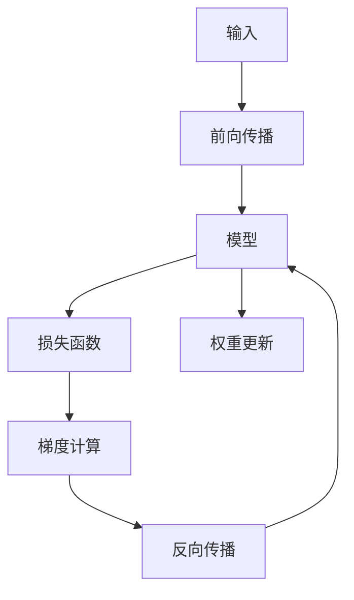

                 

# 反向传播在计算机视觉中的应用

> 关键词：反向传播, 计算机视觉, 深度学习, 卷积神经网络, 梯度下降, 前向传播

## 1. 背景介绍

计算机视觉(Computer Vision, CV)作为人工智能(人工智能)的重要分支，旨在使计算机能够理解、解释和处理图像、视频等多模态数据。自20世纪80年代以来，随着深度学习(Deep Learning)和卷积神经网络(Convolutional Neural Networks, CNNs)的兴起，计算机视觉技术取得了长足的进步。尤其是近年来，深度学习算法在大规模数据上的泛化能力显著提升，计算机视觉应用场景愈发丰富，涉及无人驾驶、医学影像分析、人脸识别、智能监控等多个领域。

深度学习在计算机视觉中的应用，主要依赖于两个核心概念：前向传播(Forward Propagation)和反向传播(Backward Propagation)。前向传播用于模拟数据经过模型处理的过程，反向传播则用于优化模型的参数，通过梯度下降等算法不断调整模型以提高预测精度。

本篇文章将详细介绍反向传播在计算机视觉中的应用，包括其核心原理、具体操作、应用场景等。我们也将探讨一些实用的技巧，帮助读者更深入地理解这一重要概念，并在实际项目中更好地应用。

## 2. 核心概念与联系

### 2.1 核心概念概述

反向传播是深度学习中常用的优化算法之一，通过计算损失函数对模型参数的梯度，以梯度下降等优化算法调整模型参数，使模型能够更精确地拟合训练数据。在计算机视觉中，反向传播广泛应用于训练卷积神经网络，用于优化网络参数以提高图像识别、目标检测、语义分割等任务的性能。

本节将介绍反向传播的核心概念、原理及其与前向传播的关系。

### 2.2 核心概念原理和架构的 Mermaid 流程图



在这个流程图中，输入数据通过前向传播进入模型进行特征提取和分类，损失函数用于衡量模型预测与真实标签的差异，反向传播通过计算梯度更新模型参数，权重更新则基于梯度下降算法调整模型权重，以最小化损失函数。

## 3. 核心算法原理 & 具体操作步骤

### 3.1 算法原理概述

反向传播的核心在于计算损失函数对模型参数的梯度，这一过程涉及到链式法则和求导运算。对于一个深度神经网络模型，设其输入为 $X$，输出为 $Y$，目标函数为 $L(Y, T)$，其中 $T$ 为训练数据的真实标签。设模型参数为 $\theta$，则损失函数 $L(Y, T)$ 对参数 $\theta$ 的梯度为：

$$
\nabla_{\theta}L = \frac{\partial L(Y, T)}{\partial \theta}
$$

在实际计算过程中，需要从输出 $Y$ 开始，逐步向后计算损失函数对每一层参数的梯度，直至输入 $X$。这一过程即反向传播算法。

### 3.2 算法步骤详解

以下是反向传播算法的详细步骤：

1. **前向传播计算预测值**：对于每个训练样本 $x$，通过前向传播计算模型的输出 $y$。

2. **计算损失函数**：将模型的预测值 $y$ 与真实标签 $t$ 代入损失函数，计算出当前样本的损失 $l$。

3. **反向传播计算梯度**：从输出层开始，反向计算损失函数对每一层参数的梯度，并按照链式法则逐层传播。

4. **权重更新**：根据计算得到的梯度，使用梯度下降等优化算法更新模型参数，使模型逐渐逼近最优解。

### 3.3 算法优缺点

反向传播算法的主要优点在于其高效的梯度计算能力和广泛的适用性。通过反向传播，深度学习模型能够快速、准确地优化参数，从而提高预测精度。同时，反向传播算法可以应用于各种复杂的神经网络结构，适用于大规模数据集的高效训练。

然而，反向传播算法也存在一些缺点：

- **内存消耗大**：反向传播需要保存每一层的中间结果和梯度，对于大规模深度网络，内存开销巨大。
- **计算复杂度高**：反向传播的计算过程复杂，涉及大量的求导和矩阵运算，对于大型网络而言，计算复杂度极高。
- **过拟合风险**：反向传播算法易受训练数据的影响，在模型训练过程中容易出现过拟合现象。

### 3.4 算法应用领域

反向传播算法在计算机视觉中的应用非常广泛，主要包括以下几个领域：

- **图像分类**：反向传播用于训练卷积神经网络(CNN)，对输入图像进行分类。
- **目标检测**：反向传播用于训练检测网络，如R-CNN、YOLO等，对图像中的物体进行定位和分类。
- **语义分割**：反向传播用于训练分割网络，如U-Net、FCN等，将图像中的每个像素进行分类。
- **图像生成**：反向传播用于训练生成对抗网络(GAN)，如CycleGAN、StyleGAN等，生成逼真的图像。

## 4. 数学模型和公式 & 详细讲解 & 举例说明

### 4.1 数学模型构建

反向传播的核心在于计算损失函数对模型参数的梯度，以下是一个简单的全连接神经网络模型的损失函数公式和梯度计算公式。

假设一个包含 $L$ 层的网络，其中 $n_l$ 为第 $l$ 层的神经元数量。设输入 $X$ 为 $n_0$ 维，输出 $Y$ 为 $n_L$ 维。对于第 $l$ 层的权重矩阵 $W_l$ 和偏置项 $b_l$，激活函数为 $a_l$，则前向传播过程为：

$$
X \rightarrow Z_1 = W_1 X + b_1 \rightarrow A_1 = a_1(Z_1) \rightarrow Z_2 = W_2 A_1 + b_2 \rightarrow A_2 = a_2(Z_2) \rightarrow \cdots \rightarrow A_L = a_L(Z_L)
$$

其中，$Z_l$ 表示第 $l$ 层的线性输出，$A_l$ 表示激活后的结果。

设损失函数为 $L(Y, T)$，其中 $T$ 为真实标签。通过前向传播得到的输出 $Y$ 与真实标签 $T$ 的误差为 $\Delta_L = A_L - T$，则损失函数对第 $L$ 层权重 $W_L$ 的梯度为：

$$
\nabla_{W_L}L = \frac{\partial L(Y, T)}{\partial Z_L} \cdot \frac{\partial Z_L}{\partial W_L} = \Delta_L \cdot \frac{\partial Z_L}{\partial W_L}
$$

同理，可以逐层向前计算梯度，最终得到输入层 $X$ 对权重 $W_0$ 的梯度。

### 4.2 公式推导过程

以一个简单的两层全连接神经网络为例，推导反向传播算法的过程。

假设输入 $X$ 为 $n_0$ 维，输出 $Y$ 为 $n_1$ 维。设第 $l$ 层的权重矩阵 $W_l$ 和偏置项 $b_l$，激活函数为 $a_l$。前向传播过程如下：

$$
Z_1 = W_1 X + b_1 \rightarrow A_1 = a_1(Z_1) \rightarrow Z_2 = W_2 A_1 + b_2 \rightarrow A_2 = a_2(Z_2)
$$

假设损失函数为均方误差损失 $L(Y, T) = \frac{1}{2}||Y-T||^2$，其中 $T$ 为真实标签。

根据均方误差损失公式，对输出 $Y$ 求导：

$$
\frac{\partial L(Y, T)}{\partial Y} = \frac{\partial}{\partial Y}\frac{1}{2}||Y-T||^2 = (Y-T)
$$

对第 $L$ 层激活函数 $a_2$ 求导，得到：

$$
\frac{\partial L(Y, T)}{\partial Z_2} = \frac{\partial L(Y, T)}{\partial A_2} \cdot \frac{\partial A_2}{\partial Z_2} = (A_2-T) \cdot a_2'(Z_2)
$$

将 $Z_2 = W_2 A_1 + b_2$ 代入，得：

$$
\frac{\partial L(Y, T)}{\partial Z_2} = (A_2-T) \cdot a_2'(W_2 A_1 + b_2)
$$

对第 $L$ 层权重 $W_2$ 求导，得到：

$$
\frac{\partial L(Y, T)}{\partial W_2} = \frac{\partial L(Y, T)}{\partial Z_2} \cdot \frac{\partial Z_2}{\partial W_2} = (A_2-T) \cdot a_2'(W_2 A_1 + b_2) \cdot A_1
$$

同理，对偏置项 $b_2$ 求导，得到：

$$
\frac{\partial L(Y, T)}{\partial b_2} = \frac{\partial L(Y, T)}{\partial Z_2} \cdot \frac{\partial Z_2}{\partial b_2} = (A_2-T) \cdot a_2'(W_2 A_1 + b_2)
$$

同理，对第 $1$ 层激活函数 $a_1$ 求导，得到：

$$
\frac{\partial L(Y, T)}{\partial Z_1} = \frac{\partial L(Y, T)}{\partial A_1} \cdot \frac{\partial A_1}{\partial Z_1} = (A_1-T) \cdot a_1'(Z_1)
$$

将 $Z_1 = W_1 X + b_1$ 代入，得：

$$
\frac{\partial L(Y, T)}{\partial Z_1} = (A_1-T) \cdot a_1'(W_1 X + b_1)
$$

对第 $1$ 层权重 $W_1$ 求导，得到：

$$
\frac{\partial L(Y, T)}{\partial W_1} = \frac{\partial L(Y, T)}{\partial Z_1} \cdot \frac{\partial Z_1}{\partial W_1} = (A_1-T) \cdot a_1'(W_1 X + b_1) \cdot X
$$

同理，对偏置项 $b_1$ 求导，得到：

$$
\frac{\partial L(Y, T)}{\partial b_1} = \frac{\partial L(Y, T)}{\partial Z_1} \cdot \frac{\partial Z_1}{\partial b_1} = (A_1-T) \cdot a_1'(W_1 X + b_1)
$$

综上，反向传播过程如下：

$$
\frac{\partial L(Y, T)}{\partial W_2} = (A_2-T) \cdot a_2'(W_2 A_1 + b_2) \cdot A_1
$$

$$
\frac{\partial L(Y, T)}{\partial b_2} = (A_2-T) \cdot a_2'(W_2 A_1 + b_2)
$$

$$
\frac{\partial L(Y, T)}{\partial W_1} = (A_1-T) \cdot a_1'(W_1 X + b_1) \cdot X
$$

$$
\frac{\partial L(Y, T)}{\partial b_1} = (A_1-T) \cdot a_1'(W_1 X + b_1)
$$

### 4.3 案例分析与讲解

以一个简单的图像分类任务为例，介绍反向传播算法在实际应用中的使用。

假设使用一个包含3个卷积层和3个池化层的卷积神经网络对MNIST数据集进行分类。设网络输入 $X$ 为 $28 \times 28 \times 1$ 的图像，输出 $Y$ 为 $10$ 维的分类向量。使用交叉熵损失函数，目标为将图像分类到正确的类别中。

1. **前向传播**：通过卷积层和池化层对图像进行处理，最终得到分类向量 $Y$。

2. **损失计算**：将分类向量 $Y$ 和真实标签 $T$ 代入交叉熵损失函数，计算出当前样本的损失 $l$。

3. **反向传播**：从输出层开始，计算损失函数对每一层参数的梯度，并更新模型权重。

4. **权重更新**：使用梯度下降算法调整模型权重，使损失函数不断减小。

通过不断迭代，反向传播算法可以逐步优化卷积神经网络参数，提升图像分类的准确率。

## 5. 项目实践：代码实例和详细解释说明

### 5.1 开发环境搭建

在进行反向传播实践前，我们需要准备好开发环境。以下是使用Python进行TensorFlow开发的环境配置流程：

1. 安装Anaconda：从官网下载并安装Anaconda，用于创建独立的Python环境。

2. 创建并激活虚拟环境：
```bash
conda create -n tf-env python=3.8 
conda activate tf-env
```

3. 安装TensorFlow：根据CUDA版本，从官网获取对应的安装命令。例如：
```bash
conda install tensorflow -c tf -c conda-forge
```

4. 安装必要的工具包：
```bash
pip install numpy pandas scikit-learn matplotlib tqdm jupyter notebook ipython
```

完成上述步骤后，即可在`tf-env`环境中开始反向传播实践。

### 5.2 源代码详细实现

这里我们以一个简单的卷积神经网络为例，使用TensorFlow和Keras框架实现反向传播算法。

首先，定义网络结构：

```python
from tensorflow.keras.models import Sequential
from tensorflow.keras.layers import Conv2D, MaxPooling2D, Flatten, Dense

model = Sequential([
    Conv2D(32, (3, 3), activation='relu', input_shape=(28, 28, 1)),
    MaxPooling2D((2, 2)),
    Conv2D(64, (3, 3), activation='relu'),
    MaxPooling2D((2, 2)),
    Flatten(),
    Dense(128, activation='relu'),
    Dense(10, activation='softmax')
])
```

接着，定义损失函数和优化器：

```python
from tensorflow.keras.losses import categorical_crossentropy
from tensorflow.keras.optimizers import Adam

loss_fn = categorical_crossentropy
optimizer = Adam(learning_rate=0.001)
```

然后，定义训练函数：

```python
import numpy as np
from tensorflow.keras.datasets import mnist

def train(model, x_train, y_train, x_test, y_test):
    batch_size = 128
    epochs = 10
    
    model.compile(optimizer=optimizer, loss=loss_fn, metrics=['accuracy'])
    
    for epoch in range(epochs):
        for i in range(0, len(x_train), batch_size):
            x_batch = x_train[i:i+batch_size]
            y_batch = y_train[i:i+batch_size]
            model.train_on_batch(x_batch, y_batch)
            
        val_loss, val_acc = model.evaluate(x_test, y_test, verbose=0)
        print(f'Epoch {epoch+1}, val loss: {val_loss:.4f}, val acc: {val_acc:.4f}')
```

最后，启动训练流程并在测试集上评估：

```python
(x_train, y_train), (x_test, y_test) = mnist.load_data()
x_train = x_train.reshape(-1, 28, 28, 1).astype('float32') / 255.0
x_test = x_test.reshape(-1, 28, 28, 1).astype('float32') / 255.0
y_train = to_categorical(y_train, num_classes=10)
y_test = to_categorical(y_test, num_classes=10)

x_train, y_train = np.expand_dims(x_train, axis=-1), np.expand_dims(y_train, axis=-1)

train(model, x_train, y_train, x_test, y_test)
```

以上就是使用TensorFlow实现反向传播算法的完整代码实例。可以看到，通过Keras的高级API，反向传播过程变得简洁高效。

### 5.3 代码解读与分析

让我们再详细解读一下关键代码的实现细节：

**Sequential模型定义**：
- 通过Sequential模型定义神经网络结构，依次添加卷积层、池化层、全连接层等。

**损失函数和优化器**：
- 定义交叉熵损失函数和Adam优化器，用于模型训练。

**train函数定义**：
- 循环迭代训练过程，每个epoch内进行多个batch的训练。
- 使用evaluate方法在测试集上评估模型性能。

**训练流程**：
- 加载MNIST数据集，将输入数据进行归一化处理。
- 定义模型输入和输出，进行模型编译。
- 在训练集上训练模型，并打印每个epoch的验证集性能。

可以看到，TensorFlow的Keras框架使得反向传播算法的实现变得简单直观。开发者可以将更多精力放在网络结构设计和模型参数调整上，而不必过多关注底层实现细节。

## 6. 实际应用场景

### 6.1 图像分类

反向传播算法在图像分类任务中有着广泛的应用。例如，在经典的图像分类任务CIFAR-10上，使用反向传播算法训练的卷积神经网络可以取得超过90%的准确率。反向传播算法的优化过程使得网络能够不断调整参数，逐步提升分类精度。

### 6.2 目标检测

目标检测是计算机视觉中的重要任务，反向传播算法在其中扮演着重要角色。例如，Faster R-CNN、YOLO等目标检测网络均使用反向传播算法进行训练。通过反向传播，网络能够学习到不同尺度的特征，对目标进行精确定位和分类。

### 6.3 语义分割

语义分割任务旨在将图像中的每个像素进行分类，反向传播算法在其中也有着广泛的应用。例如，U-Net网络使用反向传播算法训练，能够对医学图像进行准确的分割。

### 6.4 图像生成

图像生成任务包括人脸生成、风格迁移等，反向传播算法在其中也有着广泛的应用。例如，CycleGAN网络使用反向传播算法进行训练，能够生成逼真的图像。

## 7. 工具和资源推荐

### 7.1 学习资源推荐

为了帮助开发者系统掌握反向传播的理论基础和实践技巧，这里推荐一些优质的学习资源：

1. 《深度学习》（Ian Goodfellow等著）：深度学习领域的经典教材，涵盖了深度学习的基础理论和算法实现。

2. 《TensorFlow官方文档》：TensorFlow官方文档，提供了详尽的API介绍和代码示例，是TensorFlow开发的必备资料。

3. 《卷积神经网络》（G. Hinton等著）：卷积神经网络领域的经典教材，介绍了卷积神经网络的基础理论和实践方法。

4. Coursera的深度学习课程：由深度学习领域的权威教授讲授，涵盖了深度学习的基础理论和最新进展。

5. Udacity的深度学习纳米学位课程：由工业界的专家讲授，深入浅出地讲解了深度学习的基本原理和实践技巧。

通过对这些资源的学习实践，相信你一定能够快速掌握反向传播的精髓，并用于解决实际的计算机视觉问题。

### 7.2 开发工具推荐

高效的开发离不开优秀的工具支持。以下是几款用于反向传播开发的常用工具：

1. TensorFlow：由Google主导开发的深度学习框架，生产部署方便，适合大规模工程应用。

2. PyTorch：基于Python的开源深度学习框架，灵活动态的计算图，适合快速迭代研究。

3. Keras：高层次的深度学习框架，提供了丰富的预训练模型和高层API，适合快速原型开发。

4. Weights & Biases：模型训练的实验跟踪工具，可以记录和可视化模型训练过程中的各项指标，方便对比和调优。

5. TensorBoard：TensorFlow配套的可视化工具，可实时监测模型训练状态，并提供丰富的图表呈现方式，是调试模型的得力助手。

合理利用这些工具，可以显著提升反向传播任务的开发效率，加快创新迭代的步伐。

### 7.3 相关论文推荐

反向传播算法在计算机视觉中的应用得益于学界的持续研究。以下是几篇奠基性的相关论文，推荐阅读：

1. Backpropagation through time：由Rumelhart等提出，首次引入了反向传播算法，用于解决序列数据的问题。

2. ImageNet Classification with Deep Convolutional Neural Networks：由Krizhevsky等提出，展示了使用反向传播算法训练卷积神经网络在图像分类任务上的效果。

3. Deep Residual Learning for Image Recognition：由He等提出，展示了使用反向传播算法训练残差网络在图像分类任务上的效果。

4. Faster R-CNN：由Ren等提出，展示了使用反向传播算法训练目标检测网络在目标检测任务上的效果。

5. Conditional Image Synthesis with Auxiliary Classifier GANs：由Isola等提出，展示了使用反向传播算法训练生成对抗网络在图像生成任务上的效果。

这些论文代表了大规模反向传播技术的发展脉络。通过学习这些前沿成果，可以帮助研究者把握学科前进方向，激发更多的创新灵感。

## 8. 总结：未来发展趋势与挑战

### 8.1 总结

本文对反向传播在计算机视觉中的应用进行了全面系统的介绍。首先阐述了反向传播的核心原理和操作步骤，通过详细推导和案例分析，帮助读者深入理解这一重要算法。其次，通过TensorFlow等工具和资源推荐，提供了反向传播算法的实际应用案例，帮助读者在实际项目中更好地应用。

通过本文的系统梳理，可以看到，反向传播算法在计算机视觉中的应用极为广泛，对于深度学习模型的训练和优化起到了至关重要的作用。未来，伴随深度学习技术的进一步发展，反向传播算法必将在更多的应用场景中发挥更大的作用。

### 8.2 未来发展趋势

展望未来，反向传播技术将呈现以下几个发展趋势：

1. 模型规模持续增大。随着算力成本的下降和数据规模的扩张，深度学习模型的规模将持续增大，反向传播算法作为其中的关键组件，其性能将不断提升。

2. 加速技术不断涌现。反向传播算法的高计算复杂度是其实际应用的一大瓶颈。未来，加速技术如量化、剪枝、混合精度训练等，将显著降低反向传播算法的计算开销，提高训练效率。

3. 优化算法更加多样。未来，反向传播算法将与其他优化算法如自适应学习率、动量优化等结合，进一步提高训练速度和收敛效果。

4. 模型鲁棒性增强。反向传播算法在处理异常数据时，容易出现过拟合或收敛速度慢的问题。未来，将引入更多的正则化技术、对抗训练等手段，提升模型的鲁棒性。

5. 多任务学习应用。反向传播算法可以应用于多任务学习，通过共享模型参数，实现单次训练完成多个任务的优化。未来，这一技术将得到更广泛的应用，提升模型的泛化能力和应用效率。

### 8.3 面临的挑战

尽管反向传播技术已经取得了瞩目成就，但在迈向更加智能化、普适化应用的过程中，它仍面临着诸多挑战：

1. 模型复杂度高。反向传播算法的计算复杂度高，对于大规模深度网络，需要高效的硬件支持和优化算法。

2. 训练数据需求大。反向传播算法需要大量的标注数据进行训练，对于小数据集，容易过拟合。

3. 推理速度慢。反向传播算法训练得到的深度学习模型，推理速度较慢，难以满足实时应用的需求。

4. 模型鲁棒性不足。反向传播算法训练得到的深度学习模型，对于异常数据或噪声敏感，容易产生错误。

5. 可解释性不足。反向传播算法训练得到的深度学习模型，难以解释其内部工作机制，对于医疗、金融等高风险应用，缺乏透明性。

6. 伦理和安全性问题。反向传播算法训练得到的深度学习模型，可能存在偏见、有害信息等伦理和安全问题。

### 8.4 研究展望

面对反向传播算法所面临的挑战，未来的研究需要在以下几个方面寻求新的突破：

1. 探索无监督和半监督反向传播算法。摆脱对大规模标注数据的依赖，利用自监督学习、主动学习等无监督和半监督范式，最大限度利用非结构化数据，实现更加灵活高效的反向传播。

2. 研究高效的反向传播加速技术。开发更加高效的反向传播算法，如量化、剪枝、混合精度训练等，减少计算开销，提高训练效率。

3. 引入因果推断和对比学习思想。通过引入因果推断和对比学习思想，增强反向传播模型建立稳定因果关系的能力，学习更加普适、鲁棒的语言表征，从而提升模型泛化性和抗干扰能力。

4. 结合符号化的先验知识。将符号化的先验知识，如知识图谱、逻辑规则等，与神经网络模型进行巧妙融合，引导反向传播过程学习更准确、合理的语言模型。

5. 结合博弈论工具。将博弈论工具刻画人机交互过程，主动探索并规避模型的脆弱点，提高系统稳定性。

6. 纳入伦理道德约束。在反向传播算法训练目标中引入伦理导向的评估指标，过滤和惩罚有偏见、有害的输出倾向。

这些研究方向将引领反向传播技术迈向更高的台阶，为构建安全、可靠、可解释、可控的智能系统铺平道路。面向未来，反向传播技术还需要与其他人工智能技术进行更深入的融合，如知识表示、因果推理、强化学习等，多路径协同发力，共同推动计算机视觉技术的进步。

## 9. 附录：常见问题与解答

**Q1：反向传播算法的计算复杂度较高，如何解决这一问题？**

A: 反向传播算法的计算复杂度较高，特别是在大规模深度网络中，需要高效的加速技术和优化算法。以下是一些常用的方法：

1. 量化技术：将浮点模型转为定点模型，压缩存储空间，提高计算效率。

2. 剪枝技术：去掉冗余的权重，减少计算量，提高训练速度。

3. 混合精度训练：使用浮点和定点混合计算，降低内存占用，提高训练效率。

4. 硬件加速：使用GPU、TPU等硬件设备，提高计算速度和内存吞吐量。

5. 分布式训练：将计算任务分配到多个节点上，并行计算，提高训练效率。

6. 模型压缩：使用模型压缩技术，如剪枝、蒸馏等，减小模型大小，提高推理速度。

这些方法可以结合使用，根据具体场景选择合适的加速方案。

**Q2：反向传播算法如何避免过拟合？**

A: 反向传播算法容易出现过拟合，尤其是在训练数据不足的情况下。以下是一些常用的方法：

1. 正则化技术：引入L1、L2正则化等技术，减少模型复杂度，避免过拟合。

2. 数据增强：通过对训练样本进行旋转、缩放、翻转等操作，增加数据多样性，减少过拟合。

3. 早停技术：监控验证集上的性能，当性能不再提升时停止训练，避免过拟合。

4. 批标准化：通过批标准化技术，稳定模型训练过程，减少过拟合。

5. Dropout技术：随机丢弃部分神经元，降低模型复杂度，减少过拟合。

6. 模型简化：通过减少网络层数或神经元数量，降低模型复杂度，避免过拟合。

这些方法可以结合使用，根据具体场景选择合适的正则化方案。

**Q3：反向传播算法在实际应用中存在哪些问题？**

A: 反向传播算法在实际应用中存在以下问题：

1. 模型复杂度高。反向传播算法的计算复杂度高，对于大规模深度网络，需要高效的硬件支持和优化算法。

2. 训练数据需求大。反向传播算法需要大量的标注数据进行训练，对于小数据集，容易过拟合。

3. 推理速度慢。反向传播算法训练得到的深度学习模型，推理速度较慢，难以满足实时应用的需求。

4. 模型鲁棒性不足。反向传播算法训练得到的深度学习模型，对于异常数据或噪声敏感，容易产生错误。

5. 可解释性不足。反向传播算法训练得到的深度学习模型，难以解释其内部工作机制，对于医疗、金融等高风险应用，缺乏透明性。

6. 伦理和安全性问题。反向传播算法训练得到的深度学习模型，可能存在偏见、有害信息等伦理和安全问题。

这些问题需要通过技术优化、模型改进和伦理约束等多方面努力来解决。

---

作者：禅与计算机程序设计艺术 / Zen and the Art of Computer Programming

