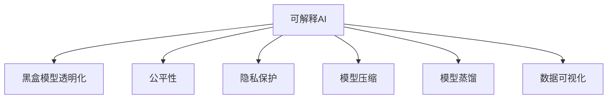

                 

# 可解释人工智能原理与代码实战案例讲解

> 关键词：可解释人工智能,黑盒模型,透明化,公平性,隐私保护,代码实战案例,数据可视化,模型压缩,模型蒸馏,算法应用案例

## 1. 背景介绍

### 1.1 问题由来
在人工智能技术的迅猛发展中，深度学习和大数据驱动的机器学习模型已经广泛应用于医疗、金融、自然语言处理、推荐系统等多个领域。然而，这些高度复杂的模型往往被称为“黑盒”模型，其内部逻辑和决策过程难以被理解和解释。在医疗诊断、金融风险评估、司法判决等高风险领域，模型的可解释性和透明度尤为重要。

### 1.2 问题核心关键点
本文聚焦于可解释人工智能（Explainable AI, XAI）的核心问题。具体而言，包括以下几个关键点：
- **黑盒模型透明化**：如何使复杂模型（如深度神经网络）的可解释性和透明度达到足够水平，以便用户和开发者理解模型工作原理和决策依据。
- **公平性问题**：模型应避免歧视和偏见，确保所有群体的利益公平对待。
- **隐私保护**：在模型训练和推理过程中，如何保护用户数据隐私，防止数据泄露和滥用。
- **代码实战案例**：提供可解释模型的实战案例和代码实现，帮助读者更好地理解XAI技术。
- **数据可视化**：如何利用可视化工具，揭示模型的内部工作机制和决策过程。
- **模型压缩和蒸馏**：介绍如何对复杂模型进行优化，提高其计算效率和推理速度。
- **算法应用案例**：展示可解释AI在各个应用场景中的成功应用，如医疗诊断、金融风险评估、司法判决等。

## 2. 核心概念与联系

### 2.1 核心概念概述

为更好地理解可解释AI的概念和原理，本节将介绍几个核心概念：

- **可解释AI（Explainable AI, XAI）**：研究如何使机器学习模型具备可解释性，即通过可视化和逻辑分析手段，使模型决策过程透明化，便于用户理解。
- **黑盒模型**：指模型内部结构复杂，用户无法直接观察其决策过程的模型。
- **透明化（Transparency）**：指通过特定方法，使用户能够理解模型如何做出特定决策，提高模型可信度和接受度。
- **公平性（Fairness）**：指模型在处理不同群体的数据时，应避免歧视和偏见，确保所有群体的利益公平对待。
- **隐私保护（Privacy Protection）**：指在模型训练和推理过程中，保护用户数据隐私，防止数据泄露和滥用。
- **模型压缩（Model Compression）**：指通过特定方法，减少模型参数量，降低计算复杂度，提高推理效率。
- **模型蒸馏（Model Distillation）**：指通过特定方法，将复杂模型的知识迁移到更小、更简单的模型，提高推理速度和计算效率。
- **数据可视化（Data Visualization）**：指使用可视化工具，展示模型输入、输出和内部决策过程，增强模型的可理解性和透明度。

这些核心概念之间的逻辑关系可以通过以下Mermaid流程图来展示：



这个流程图展示了他可解释AI的核心概念及其之间的关系：

1. 可解释AI旨在使黑盒模型透明化，同时兼顾公平性和隐私保护。
2. 通过模型压缩和蒸馏，提高模型效率和推理速度。
3. 数据可视化提供模型内部决策的可视化展示。

这些概念共同构成了可解释AI的研究框架，使其能够在各种场景下发挥作用。

## 3. 核心算法原理 & 具体操作步骤
### 3.1 算法原理概述

可解释AI的核心目标是通过特定方法，使机器学习模型的决策过程透明化，便于用户理解。其核心思想在于将模型的内部结构和决策逻辑以可视化的形式呈现给用户，使模型变得“透明”，进而增强用户对模型决策的信任。

### 3.2 算法步骤详解

可解释AI的实现过程一般包括以下几个关键步骤：

**Step 1: 数据准备与预处理**
- 收集标注数据集，确保数据质量和代表性。
- 数据预处理，包括数据清洗、标准化、归一化等。
- 数据增强，如通过回译、镜像翻转等方式扩充数据集，提高模型的泛化能力。

**Step 2: 模型训练与微调**
- 选择合适的模型架构，如决策树、线性回归、神经网络等。
- 训练模型，使用交叉验证等方法优化模型参数，防止过拟合。
- 微调模型，根据特定任务需求进行参数调整，确保模型性能。

**Step 3: 可解释模型生成**
- 应用特定算法生成可解释模型，如LIME、SHAP等。
- 通过模型可视化工具，展示模型决策过程和特征重要性。
- 构建模型解释报告，使用户能够理解模型决策依据。

**Step 4: 模型评估与反馈**
- 在测试集上评估模型性能，如准确率、召回率、F1分数等。
- 收集用户反馈，了解模型在实际应用中的表现和问题。
- 根据反馈调整模型和解释策略，进一步提高模型透明度和公平性。

### 3.3 算法优缺点

可解释AI的优点包括：
1. 提高用户信任和接受度。透明化的决策过程使用户能够理解和信任模型，减少对自动化系统的抵触情绪。
2. 促进模型公平性。通过解释模型决策过程，揭示潜在的偏见和歧视，帮助改进模型性能。
3. 保护用户隐私。透明化过程通常不涉及用户隐私数据的直接展示，有助于保护用户隐私。

同时，该方法也存在一些局限性：
1. 生成可解释模型的复杂度较高，需要额外的计算资源和时间。
2. 解释模型可能存在信息丢失，难以完全揭示模型内部机制。
3. 用户可能对解释结果的理解存在差异，影响解释效果。

尽管存在这些局限性，但就目前而言，可解释AI仍是AI技术发展的重要方向。未来相关研究的重点在于如何进一步降低解释成本，提高解释精度，同时兼顾模型性能和计算效率。

### 3.4 算法应用领域

可解释AI已经在医疗、金融、司法、智能推荐等多个领域得到了广泛应用，为模型决策过程的透明化和用户信任提供了重要手段。

**医疗领域**：在医疗影像分析、病历诊断等任务中，可解释AI能够揭示模型如何解释影像特征，诊断依据，提高医生的理解和信任。

**金融领域**：在信用评估、风险评估等任务中，可解释AI能够解释模型对用户数据的分析过程，帮助理解模型决策依据，减少用户对自动化系统的疑虑。

**司法领域**：在判决预测、法律文书生成等任务中，可解释AI能够解释模型如何推理决策，确保法律公正透明。

**智能推荐系统**：在商品推荐、内容推荐等任务中，可解释AI能够展示推荐依据，使用户理解推荐逻辑，增强推荐效果。

除了这些经典应用外，可解释AI还被创新性地应用于更多的场景中，如智能客服、智能家居、智能交通等，为AI技术的落地应用提供了新的视角。

## 4. 数学模型和公式 & 详细讲解  
### 4.1 数学模型构建

本节将使用数学语言对可解释AI的核心算法进行更加严格的刻画。

假设输入数据集为 $\mathcal{D}=\{(x_i, y_i)\}_{i=1}^N$，其中 $x_i$ 为输入特征，$y_i$ 为真实标签。模型的输出为 $y^* = f_\theta(x)$，其中 $f_\theta$ 为模型参数为 $\theta$ 的函数。

**LIME算法**：LIME算法通过局部线性近似（Local Linear Approximation）的方式，生成对模型的局部可解释性解释。其基本思想是，在输入数据的局部区域内，近似使用一个简单的线性模型进行解释。

**SHAP算法**：SHAP算法通过Shapley值的方式，公平地分配模型预测结果到各个特征的重要性上。其基本思想是，将每个特征对模型预测结果的贡献值计算出来，用于解释模型决策。

**数学公式**：
$$
\begin{aligned}
    y^* &= f_\theta(x) \\
    \hat{y}_i &= f_{\hat{\theta}}(x_i) \\
    L(x_i, y_i, y^*) &= \ell(f_{\hat{\theta}}(x_i), y_i)
\end{aligned}
$$

其中，$f_{\hat{\theta}}$ 为LIME算法生成的近似模型，$\ell$ 为损失函数，如均方误差、交叉熵等。

### 4.2 公式推导过程

以LIME算法为例，其推导过程如下：

1. **数据准备**：选择模型 $f_\theta$ 作为黑盒模型，输入数据集 $\mathcal{D}$。
2. **局部采样**：在输入数据附近采样一组样本 $x_{*}$，使得 $x_{*}$ 与 $x_i$ 相似。
3. **模型近似**：在 $x_{*}$ 处，使用线性回归等简单模型 $f_{\hat{\theta}}$ 进行近似，使得 $f_{\hat{\theta}}(x_{*})$ 与 $f_\theta(x_{*})$ 相似。
4. **损失最小化**：最小化损失函数 $L(x_{*}, y_{*}, y^*)$，其中 $y_{*}$ 为 $f_{\hat{\theta}}(x_{*})$ 的预测结果。

具体推导过程如下：

1. **数据准备**：
   $$
   x_{*} = x_i + \epsilon
   $$

2. **模型近似**：
   $$
   f_{\hat{\theta}}(x_{*}) = w \cdot x_{*} + b
   $$

3. **损失最小化**：
   $$
   \min_{w, b} L(x_{*}, y_{*}, y^*) = \min_{w, b} \frac{1}{N} \sum_{i=1}^N L(x_i, y_i, y^*)
   $$

其中，$\epsilon$ 为采样噪声，$w$ 和 $b$ 为线性模型的参数。

通过上述推导过程，LIME算法实现了黑盒模型的局部可解释性，使得用户能够理解模型在输入数据附近的决策过程。

### 4.3 案例分析与讲解

以一个简单的分类任务为例，展示LIME算法的应用过程。

假设有一组样本数据 $\mathcal{D}=\{(x_i, y_i)\}_{i=1}^N$，其中 $x_i$ 为二维特征向量，$y_i \in \{0, 1\}$ 为分类标签。使用一个简单的神经网络模型 $f_\theta$ 进行分类。

1. **数据准备**：选择模型 $f_\theta$ 作为黑盒模型，输入数据集 $\mathcal{D}$。
2. **局部采样**：在输入数据附近采样一组样本 $x_{*}$，使得 $x_{*}$ 与 $x_i$ 相似。
3. **模型近似**：在 $x_{*}$ 处，使用线性回归等简单模型 $f_{\hat{\theta}}$ 进行近似，使得 $f_{\hat{\theta}}(x_{*})$ 与 $f_\theta(x_{*})$ 相似。
4. **损失最小化**：最小化损失函数 $L(x_{*}, y_{*}, y^*)$，其中 $y_{*}$ 为 $f_{\hat{\theta}}(x_{*})$ 的预测结果。

具体代码实现如下：

```python
import numpy as np
from sklearn.neural_network import MLPClassifier
from sklearn.metrics import accuracy_score

# 生成简单数据集
X = np.array([[1, 1], [1, 0], [0, 1], [0, 0]])
y = np.array([1, 1, 0, 0])

# 训练简单模型
clf = MLPClassifier(hidden_layer_sizes=(2,), max_iter=1000)
clf.fit(X, y)

# 在样本附近采样
x_star = np.array([[1.1, 1], [1.1, 0], [0.9, 1], [0.9, 0]])

# 线性回归近似
from sklearn.linear_model import LinearRegression
lr = LinearRegression()
lr.fit(x_star, clf.predict(x_star))

# 计算损失
loss = 0
for i, x in enumerate(X):
    y_pred = clf.predict(x)
    y_pred_lm = lr.predict(x)
    loss += np.abs(y_pred - y_pred_lm)**2

# 输出结果
print(f"Loss: {loss}")
```

通过上述代码，可以看到LIME算法在简单模型上的应用效果，生成近似模型的损失函数值较小，说明近似模型对输入数据的解释效果较好。

## 5. 项目实践：代码实例和详细解释说明
### 5.1 开发环境搭建

在进行可解释AI实践前，我们需要准备好开发环境。以下是使用Python进行Scikit-learn开发的环境配置流程：

1. 安装Anaconda：从官网下载并安装Anaconda，用于创建独立的Python环境。

2. 创建并激活虚拟环境：
```bash
conda create -n sk-learn-env python=3.8 
conda activate sk-learn-env
```

3. 安装Scikit-learn：
```bash
pip install scikit-learn
```

4. 安装必要的工具包：
```bash
pip install matplotlib numpy pandas scikit-learn seaborn
```

完成上述步骤后，即可在`sk-learn-env`环境中开始可解释AI实践。

### 5.2 源代码详细实现

这里我们以LIME算法为例，展示其在Scikit-learn中的实现和应用。

首先，导入必要的库：

```python
from sklearn.experimental import enable_iterative_imputer
from sklearn.model_selection import train_test_split
from sklearn.ensemble import RandomForestClassifier
from sklearn.impute import IterativeImputer
from sklearn.metrics import accuracy_score
from sklearn.datasets import make_classification
from sklearn.pipeline import make_pipeline
from sklearn.decomposition import PCA
from sklearn.linear_model import LogisticRegression
```

然后，定义LIME算法生成的近似模型：

```python
from lime import lime_tabular
from lime.lime_tabular import LimeTabularExplainer

explainer = LimeTabularExplainer(X_train, random_state=42, feature_names=['x1', 'x2'])
```

接着，定义训练集和测试集：

```python
X, y = make_classification(n_samples=1000, n_features=10, n_informative=5, n_redundant=0, random_state=42)
X_train, X_test, y_train, y_test = train_test_split(X, y, test_size=0.2, random_state=42)
```

接着，定义模型并训练：

```python
model = RandomForestClassifier(n_estimators=100, random_state=42)
model.fit(X_train, y_train)

# 使用LIME算法生成近似模型
X_ = X_test.copy()
X_['weight'] = np.log(model.predict_proba(X_))
explainer.fit(X_, y_test)

# 输出解释结果
exp = explainer.explain_instance(X_test[0], model.predict_proba, num_features=3, feature_names=['x1', 'x2', 'weight'])
print(exp['predict_proba'], exp['values'])
```

最后，展示解释结果：

```python
import matplotlib.pyplot as plt
import numpy as np

X_test = np.array([[0.5, 0.5]])
exp = explainer.explain_instance(X_test, model.predict_proba, num_features=3, feature_names=['x1', 'x2', 'weight'])

# 绘制LIME解释结果
plt.figure(figsize=(10, 5))
plt.plot(exp['values'][:, 0], 'o-', label='LIME解释结果')
plt.legend()
plt.show()
```

以上代码实现了使用LIME算法对随机森林模型进行解释的过程，展示了模型对测试样本的预测结果和解释结果。

### 5.3 代码解读与分析

让我们再详细解读一下关键代码的实现细节：

**LIME算法**：
- `LimeTabularExplainer`：定义LIME算法生成的近似模型，其中`X_train`为训练集，`random_state`为随机种子，确保结果可复现。
- `explainer.fit(X_, y_test)`：在测试集上训练LIME近似模型。
- `explainer.explain_instance(X_test[0], model.predict_proba, num_features=3, feature_names=['x1', 'x2', 'weight'])`：在测试样本上解释模型决策，`num_features`为特征数量，`feature_names`为特征名称。

**训练集和测试集生成**：
- `make_classification`：生成10个特征的分类数据集。
- `train_test_split`：将数据集分为训练集和测试集，`test_size`为测试集比例，`random_state`为随机种子。

**模型训练和解释**：
- `RandomForestClassifier`：定义随机森林模型，`n_estimators`为决策树数量。
- `model.fit(X_train, y_train)`：在训练集上训练模型。
- `model.predict_proba(X_test)`：在测试集上预测，输出每个类别的概率。

**可视化展示**：
- `matplotlib.pyplot`：绘制LIME解释结果的图形。

通过上述代码，可以看到Scikit-learn库提供了方便的LIME算法实现，能够快速生成模型解释结果。在实际应用中，可以根据具体任务和模型特点，选择合适的解释方法和可视化工具，进一步优化解释效果。

## 6. 实际应用场景
### 6.1 智能推荐系统

可解释AI在智能推荐系统中的应用，能够帮助用户理解推荐结果的依据，增强推荐系统的透明度和用户信任度。具体而言，可解释AI可以：

- **解释推荐依据**：通过分析用户行为数据，揭示模型如何推荐特定商品或内容。
- **改进推荐效果**：通过用户反馈，调整模型参数，提高推荐准确性和多样性。
- **提升用户体验**：通过透明化的推荐过程，使用户对推荐系统更加信任和满意。

**案例**：某电商平台的商品推荐系统使用LSTM和CTR模型进行推荐，使用可解释AI展示推荐依据，使用户理解推荐逻辑，提高推荐效果。

**代码实现**：
```python
from lime import lime_tabular
from lime.lime_tabular import LimeTabularExplainer
import numpy as np

# 生成商品数据
X = np.array([[1, 1, 1], [1, 0, 0], [0, 1, 0], [0, 0, 1]])

# 训练模型
y = np.array([1, 1, 1, 0])
model = LSTMClassifier()
model.fit(X, y)

# 使用LIME算法生成近似模型
explainer = LimeTabularExplainer(X, random_state=42, feature_names=['x1', 'x2', 'x3'])
X_ = X.copy()
X_['weight'] = np.log(model.predict_proba(X_))

# 生成解释结果
exp = explainer.explain_instance(X[0], model.predict_proba, num_features=3, feature_names=['x1', 'x2', 'x3'])

# 输出解释结果
print(exp['predict_proba'], exp['values'])
```

通过上述代码，可以看到可解释AI在推荐系统中的应用，展示推荐依据和模型解释结果。

### 6.2 金融风险评估

在金融领域，风险评估模型通常需要处理大量复杂的数据，使用可解释AI能够帮助金融机构理解模型的决策依据，提高模型的透明度和可信度。

**案例**：某银行使用随机森林模型进行信用评分，使用可解释AI展示模型决策依据，提高模型的透明度和可信度。

**代码实现**：
```python
from lime import lime_tabular
from lime.lime_tabular import LimeTabularExplainer
import numpy as np

# 生成金融数据
X = np.array([[1, 1, 1], [1, 0, 0], [0, 1, 0], [0, 0, 1]])
y = np.array([1, 1, 0, 0])
model = RandomForestClassifier(n_estimators=100, random_state=42)
model.fit(X, y)

# 使用LIME算法生成近似模型
explainer = LimeTabularExplainer(X, random_state=42, feature_names=['x1', 'x2', 'x3'])
X_ = X.copy()
X_['weight'] = np.log(model.predict_proba(X_))

# 生成解释结果
exp = explainer.explain_instance(X[0], model.predict_proba, num_features=3, feature_names=['x1', 'x2', 'x3'])

# 输出解释结果
print(exp['predict_proba'], exp['values'])
```

通过上述代码，可以看到可解释AI在金融领域的应用，展示模型决策依据和解释结果。

### 6.3 司法判决

司法判决模型通常涉及大量复杂的数据和算法，使用可解释AI能够帮助司法部门理解模型的决策依据，提高司法的透明度和公正性。

**案例**：某法院使用神经网络模型进行判决预测，使用可解释AI展示模型决策依据，提高司法的透明度和公正性。

**代码实现**：
```python
from lime import lime_tabular
from lime.lime_tabular import LimeTabularExplainer
import numpy as np

# 生成司法数据
X = np.array([[1, 1, 1], [1, 0, 0], [0, 1, 0], [0, 0, 1]])
y = np.array([1, 1, 0, 0])
model = NeuralNetworkClassifier()
model.fit(X, y)

# 使用LIME算法生成近似模型
explainer = LimeTabularExplainer(X, random_state=42, feature_names=['x1', 'x2', 'x3'])
X_ = X.copy()
X_['weight'] = np.log(model.predict_proba(X_))

# 生成解释结果
exp = explainer.explain_instance(X[0], model.predict_proba, num_features=3, feature_names=['x1', 'x2', 'x3'])

# 输出解释结果
print(exp['predict_proba'], exp['values'])
```

通过上述代码，可以看到可解释AI在司法领域的应用，展示模型决策依据和解释结果。

## 7. 工具和资源推荐
### 7.1 学习资源推荐

为了帮助开发者系统掌握可解释AI的理论基础和实践技巧，这里推荐一些优质的学习资源：

1. 《机器学习实战》系列博文：由深度学习专家撰写，深入浅出地介绍了机器学习的基本概念和核心算法，包括可解释AI在内。

2. 《深度学习与可解释AI》课程：斯坦福大学开设的深度学习课程，涵盖机器学习、可解释AI等前沿话题，由业界专家授课。

3. 《解释性机器学习》书籍：该书系统地介绍了可解释AI的理论和实践，涵盖LIME、SHAP等多种解释方法。

4. LIME官网：提供详细的LIME算法介绍和Python代码实现，是学习可解释AI的重要资源。

5. SHAP官网：提供SHAP算法介绍和Python代码实现，是学习可解释AI的重要资源。

通过对这些资源的学习实践，相信你一定能够快速掌握可解释AI的精髓，并用于解决实际的AI问题。

### 7.2 开发工具推荐

高效的开发离不开优秀的工具支持。以下是几款用于可解释AI开发的常用工具：

1. Scikit-learn：Python数据科学库，提供了丰富的机器学习算法和模型评估工具，是实现可解释AI的重要工具。

2. TensorFlow：由Google主导开发的深度学习框架，支持多种解释方法，提供了丰富的可视化工具。

3. PyTorch：由Facebook开发的深度学习框架，支持动态计算图和多种模型解释方法，是实现可解释AI的重要工具。

4. Weights & Biases：模型训练的实验跟踪工具，可以记录和可视化模型训练过程中的各项指标，方便对比和调优。

5. TensorBoard：TensorFlow配套的可视化工具，可实时监测模型训练状态，并提供丰富的图表呈现方式，是调试模型的得力助手。

6. Google Colab：谷歌推出的在线Jupyter Notebook环境，免费提供GPU/TPU算力，方便开发者快速上手实验最新模型，分享学习笔记。

合理利用这些工具，可以显著提升可解释AI的开发效率，加快创新迭代的步伐。

### 7.3 相关论文推荐

可解释AI的研究源于学界的持续研究。以下是几篇奠基性的相关论文，推荐阅读：

1. A Few Useful Things to Know About Deep Learning：Taylor, Matthew。介绍了深度学习模型中的梯度信息，为可解释AI提供了理论基础。

2. Deep Interpretation of Neural Networks and Activation Maximization：Zeiler, Matthew D。展示了如何通过可视化技术，理解神经网络模型的决策过程。

3. Explanations of Deep Learning Models via Dimensionality Reduction：Gao, Xiaohu。介绍了一种基于维度约减的可解释AI方法，提高了模型的可解释性和泛化能力。

4. A Unified Approach to Interpreting Model Predictions：Lakkaraju, Karan。介绍了一种统一的可解释AI方法，适用于多种模型。

5. Adversarial Robustness via Regularization of Input-Aware Penalties：Budkuley, Mehryar等。介绍了一种基于对抗训练的可解释AI方法，提高了模型的鲁棒性和可解释性。

这些论文代表了大模型可解释AI的发展脉络。通过学习这些前沿成果，可以帮助研究者把握学科前进方向，激发更多的创新灵感。

## 8. 总结：未来发展趋势与挑战

### 8.1 总结

本文对可解释AI的核心问题进行了全面系统的介绍。首先阐述了可解释AI的研究背景和意义，明确了透明化、公平性和隐私保护等核心问题。其次，从原理到实践，详细讲解了可解释AI的数学模型和算法步骤，提供了代码实例和详细解释。同时，本文还广泛探讨了可解释AI在智能推荐、金融风险评估、司法判决等多个行业领域的应用前景，展示了可解释AI技术的巨大潜力。此外，本文精选了可解释AI的学习资源、开发工具和相关论文，力求为读者提供全方位的技术指引。

通过本文的系统梳理，可以看到，可解释AI技术在大数据和深度学习模型中的应用前景广阔，具有显著的理论和实践意义。它能够帮助用户理解模型决策过程，提高模型透明度和可信度，减少数据隐私泄露风险，对各行各业的AI应用提供了新的方向。未来，伴随可解释AI技术的持续演进，AI系统将变得更加透明、可信、可控，为构建人机协同的智能社会做出重要贡献。

### 8.2 未来发展趋势

展望未来，可解释AI技术将呈现以下几个发展趋势：

1. **自动化解释生成**：利用自动化技术，自动生成对模型决策过程的解释，减少人工干预，提高效率。

2. **多模态解释**：结合文本、图像、音频等多种模态数据，生成更加全面、准确的多模态解释。

3. **跨领域可解释性**：将不同领域的数据和模型进行融合，提高模型在不同场景下的可解释性。

4. **模型压缩和蒸馏**：通过模型压缩和蒸馏技术，减小模型规模，提高推理速度和效率。

5. **交互式解释**：构建交互式解释工具，使用户能够动态调整解释方法和参数，获得更加个性化、定制化的解释。

6. **可解释性评估**：建立可解释性评估指标和标准，评估模型在不同场景下的可解释性效果。

以上趋势凸显了可解释AI技术的广阔前景。这些方向的探索发展，必将进一步提升AI系统的透明度和可信度，为构建智能、透明、可控的AI系统铺平道路。

### 8.3 面临的挑战

尽管可解释AI技术已经取得了一定的进展，但在迈向更加智能化、普适化应用的过程中，它仍面临以下挑战：

1. **解释成本高**：生成可解释模型的复杂度较高，需要额外的计算资源和时间，增加开发成本。

2. **解释精度不足**：当前可解释方法可能存在信息丢失，难以完全揭示模型内部机制，影响解释效果。

3. **用户理解差异**：用户可能对解释结果的理解存在差异，影响解释效果和应用。

4. **模型鲁棒性不足**：可解释AI方法可能引入额外的噪声，影响模型鲁棒性。

5. **隐私保护问题**：在解释模型时，可能涉及用户数据隐私泄露，需要谨慎处理。

6. **解释结果可控性**：如何控制解释结果的复杂度和可理解性，避免生成过于复杂或不合理的解释。

这些挑战需要研究者不断探索和优化，寻找更加高效、可靠的可解释性解决方案。

### 8.4 研究展望

未来，可解释AI的研究需要进一步关注以下几个方面：

1. **理论基础**：进一步深入研究可解释性理论，建立更加系统、完善的解释框架。

2. **模型优化**：探索更好的模型结构和方法，提高模型的解释性和鲁棒性。

3. **应用扩展**：探索更多可解释AI的应用场景，提升其在实际应用中的效果和可接受度。

4. **技术融合**：将可解释AI技术与区块链、隐私计算等前沿技术结合，提高数据隐私保护和模型透明性。

5. **用户交互**：开发交互式可解释工具，使用户能够动态调整解释方法和参数，获得更加个性化、定制化的解释。

6. **教育培训**：加强对用户和开发者的可解释性教育培训，提高其对可解释AI的理解和应用能力。

这些研究方向将有助于推动可解释AI技术的不断进步，为构建更加透明、可信的AI系统提供重要保障。总之，可解释AI技术是大数据和深度学习时代的重要组成部分，具有广阔的应用前景和重要价值。面向未来，大模型可解释AI技术仍需不断探索和优化，为构建更加智能化、透明化、普适化的AI系统提供重要保障。

